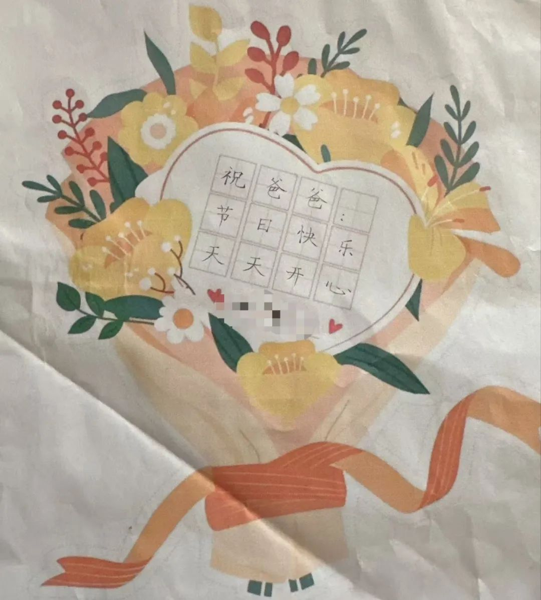

# 目录
 
- [2023年](#2023年)
  - [9月](#2023年9月)
    - [2023-9-1 职业扛雷~](#2023-9-1-职业扛雷)
    - [2023-9-2 踩坑~](#2023-9-2-踩坑)
    - [2023-9-3 boom~完犊子](#2023-9-3-boom完犊子)
    - [2023-9-4 破圈~](#2023-9-4-破圈)
    - [2023-9-7 让利~](#2023-9-7-让利)
    - [2023-9-11 新的搞钱业务~](#2023-9-11-新的搞钱业务)
    - [2023-9-17 风向标~](#2023-9-17-风向标)
    - [2023-9-18 一声叹息~](#2023-9-18-一声叹息)
    - [2023-9-20 搞钱的诱惑](#2023-9-20-搞钱的诱惑)
  - [11月](#2023年11月)
    - [2023-11-14 上阵父子兵](#2023-11-14-上阵父子兵)
    - [2023-11-16 永不空军！](#2023-11-16-永不空军)
  - [12月](#2023年12月)
    - [2023-12-7 传家宝~](#2023-12-7-传家宝)
    - [2023-12-15 祝你好孕~](#2023-12-15-祝你好孕)
    - [2023-12-17 差点被猪拱了~](#2023-12-17-差点被猪拱了)
    - [2023-12-20 变化真大！](#2023-12-20-变化真大)
    - [2023-12-28 算算我今年亏了多少钱？](#2023-12-28-算算我今年亏了多少钱)
- [2024年](#2024年)
  - [1月](#2024年1月)
    - [2024-1-9 闭嘴~！](#2024-1-9-闭嘴)
    - [2024-1-11 祖坟在喷火](#2024-1-11-祖坟在喷火)
    - [2024-1-20 紧急撤离~](#2024-1-20-紧急撤离)
    - [2024-1-22 “高质量发展”~](#2024-1-22-高质量发展)
  - [2月](#2024年2月)
    - [2024-2-19 “祖传秘诀”](#2024-2-19-祖传秘诀)
    - [2024-2-27 收钱不手软~](#2024-2-27-收钱不手软)
  - [3月](#2024年3月)
    - [2024-3-1 说两句心里话](#2024-3-1-说两句心里话)
    - [2024-3-5 瞧，大“骟”人~](#2024-3-5-瞧大骟人)
    - [2024-3-11 熟悉的前奏又响起来了](#2024-3-11-熟悉的前奏又响起来了)
  - [4月](#2024年4月)
    - [2024-4-7 春天的迹象](#2024-4-7-春天的迹象)
    - [2024-4-8 前进的方向](#2024-4-8-前进的方向)
    - [2024-4-9 守住基本盘和“压舱石”](#2024-4-9-守住基本盘和压舱石)
    - [2024-4-21 两周年～](#2024-4-21-两周年)
    - [2024-4-24 摊上这样的孩子~](#2024-4-24-摊上这样的孩子)
    - [2024-4-25 路径依赖~](#2024-4-25-路径依赖)
    - [2024-4-28 周末唠唠嗑](#2024-4-28-周末唠唠嗑)
    - [2024-4-29 一些零碎的想法](#2024-4-29-一些零碎的想法)
    - [2024-4-30 无题](#2024-4-30-无题)
  - [5月](#2024年5月)
    - [2024-5-1 信息茧房](#2024-5-1-信息茧房)
    - [2024-5-3 机会～](#2024-5-3-机会)
    - [2024-5-5 一切都是假象](#2024-5-5-一切都是假象)
    - [2024-5-16 放大招～](#2024-5-16-放大招)
    - [2024-5-20 一般从来不一般](#2024-5-20-一般从来不一般)
    - [2024-5-24 拒绝新闻的生活](#2024-5-24-拒绝新闻的生活)
  - [6月](#2024年6月)
    - [2024-6-3 席地而坐～](#2024-6-3-席地而坐)
    - [2024-6-5 写点旅行感受～](#2024-6-5-写点旅行感受)
    - [2024-6-7 习惯性跑题](#2024-6-7-习惯性跑题)
    - [2024-6-13 沸水煮青蛙](#2024-6-13-沸水煮青蛙)
    - [2024-6-16 埋在无人问津处](#2024-6-16-埋在无人问津处)
    - [2024-6-18 欲说还休](#2024-6-18-欲说还休)
    - [2024-6-20 穿过冬天～](#2024-6-20-穿过冬天)
    - [2024-6-21 问题与答复](#2024-6-21-问题与答复)
    - [2024-6-23 认真解释一下这件事](#2024-6-23-认真解释一下这件事)
    - [2024-6-24 旧事重提](#2024-6-24-旧事重提)
    - [2024-6-27 一切都是取舍](#2024-6-27-一切都是取舍)
  - [8月](#2024年8月)
    - [2024-8-1 如履薄冰～](#2024-8-1-如履薄冰)
    - [2024-8-5 用自己的眼睛看世界](#2024-8-5-用自己的眼睛看世界)
    - [2024-8-7 时代悄悄变了](#2024-8-7-时代悄悄变了)
    - [2024-8-10 不知老之将至](#2024-8-10-不知老之将至)
    - [2024-8-15 黎明前的黑暗](#2024-8-15-黎明前的黑暗)
    - [2024-8-19 这事不知该不该说](#2024-8-19-这事不知该不该说)
    - [2024-8-20 未来，我的选项…](#2024-8-20-未来我的选项)
    - [2024-8-21 钉在历史的耻辱柱上](#2024-8-21-钉在历史的耻辱柱上)
    - [2024-8-23 蛛丝马迹~](#2024-8-23-蛛丝马迹)
    - [2024-8-24 起风了~](#2024-8-24-起风了)
    - [2024-8-26 “最重要的一周”](#2024-8-26-最重要的一周)
    - [2024-8-27 一场大冒险~](#2024-8-27-一场大冒险)
    - [2024-8-28 流水账~](#2024-8-28-流水账)
    - [2024-8-29 天黑请闭眼](#2024-8-29-天黑请闭眼)
    - [2024-8-30 全力倚父~](#2024-8-30-全力倚父)
  - [9月](#2024年9月)
    - [2024-9-1 更可怕的泡沫~](#2024-9-1-更可怕的泡沫)
    - [2024-9-3 思路打开了~](#2024-9-3-思路打开了)
    - [2024-9-6 自驱力～](#2024-9-6-自驱力)
    - [2024-9-5 心惊肉跳的时刻](#2024-9-5-心惊肉跳的时刻)
    - [2024-9-6 如果有明天～](#2024-9-6-如果有明天)
    - [2024-9-7 抄底，急不得～](#2024-9-7-抄底急不得)
    - [2024-9-8 落坨翔子~](#2024-9-8-落坨翔子)
    - [2024-9-13 新的纪元？](#2024-9-13-新的纪元)
    - [2024-9-14 允许一切发生～](#2024-9-14-允许一切发生)
    - [2024-9-19 降息，新周期～](#2024-9-19-降息新周期)
    - [2024-9-25 准备迎接惊涛骇浪~](#2024-9-25-准备迎接惊涛骇浪)
    - [2024-9-26 勒紧裤腰带~](#2024-9-26-勒紧裤腰带)
    - [2024-9-27 爱你在心口难开~](#2024-9-27-爱你在心口难开)
    - [2024-9-28 老天赏饭吃～](#2024-9-28-老天赏饭吃)
    - [2024-9-29 下一个风向标？](#2024-9-29-下一个风向标)
    - [2024-9-30 疯狂星期一](#2024-9-30-疯狂星期一)
  - [10月](#2024年10月)
    - [2024-10-2 转折点～](#2024-10-2-转折点)
    - [2024-10-3 最危险的时刻～](#2024-10-3-最危险的时刻)
    - [2024-10-7 无话可说～](#2024-10-7-无话可说)
    - [2024-10-8 接下去怎么做？](#2024-10-8-接下去怎么做)
    - [2024-10-9 激流缓退~](#2024-10-9-激流缓退)
    - [2024-10-10 不为此刻所困~](#2024-10-10-不为此刻所困)
    - [2024-10-11 顺着麦穗找麦田~](#2024-10-11-顺着麦穗找麦田)
    - [2024-10-14 人到中年做“减法”～](#2024-10-14-人到中年做减法)
    - [2024-10-15 把自己安放妥当～](#2024-10-15-把自己安放妥当)
    - [2024-10-16 通道正逐渐收紧~](#2024-10-16-通道正逐渐收紧)
    - [2024-10-17 赚钱如流水～](#2024-10-17-赚钱如流水)
    - [2024-10-18 商量一件事~](#2024-10-18-商量一件事)
    - [2024-10-21 错的是全世界～](#2024-10-21-错的是全世界)
    - [2024-10-22 寻找下一张船票～](#2024-10-22-寻找下一张船票)
    - [2024-10-23 最平静的结局～](#2024-10-23-最平静的结局)
    - [2024-10-24 套利机会～](#2024-10-24-套利机会)
    - [2024-10-25 熬到头了？](#2024-10-25-熬到头了)
    - [2024-10-28 来不及想标题了～](#2024-10-28-来不及想标题了)
    - [2024-10-29 这有点东西啊](#2024-10-29-这有点东西啊)
    - [2024-10-30 更辽阔的星辰大海～](#2024-10-30-更辽阔的星辰大海)
    - [2024-10-31 在十月的最后一天～](#2024-10-31-在十月的最后一天)
  - [11月](#2024年11月)
    - [2024-11-1 他回来了，怎么办？](#2024-11-1-他回来了怎么办)
    - [2024-11-4 多数人都是血亏的…](#2024-11-4-多数人都是血亏的)
    - [2024-11-5 梦醒了～](#2024-11-5-梦醒了)
    - [2024-11-7 狂风暴雨地涨~](#2024-11-7-狂风暴雨地涨)
    - [2024-11-8 很重要的一些调整~](#2024-11-8-很重要的一些调整)
    - [2024-11-9 一年将尽~](#2024-11-9-一年将尽)
    - [2024-11-11 创造新历史~](#2024-11-11-创造新历史)
    - [2024-11-12 一切还是老样子~](#2024-11-12-一切还是老样子)
    - [2024-11-13 转眼二十年~](#2024-11-13-转眼二十年)
    - [2024-11-14 我抄！](#2024-11-14-我抄)
    - [2024-11-15 废物，又跪了~](#2024-11-15-废物又跪了)
    - [2024-11-16 难比登天~](#2024-11-16-难比登天)
    - [2024-11-18 大干一场~](#2024-11-18-大干一场)
    - [2024-11-19 勒紧裤腰带~](#2024-11-19-勒紧裤腰带)
    - [2024-11-20 涛声依旧~](#2024-11-20-涛声依旧)
    - [2024-11-21 走过风暴海~](#2024-11-21-走过风暴海)
    - [2024-11-22 这钱，太烫手了~](#2024-11-22-这钱太烫手了)
    - [2024-11-23 蛮重要的事（可能会被盾）](#2024-11-23-蛮重要的事可能会被盾)
    - [2024-11-25 尽所能，敬所不能~](#2024-11-25-尽所能敬所不能)
    - [2024-11-27 如风中年~](#2024-11-27-如风中年)
    - [2024-11-30 再也回不去~](#2024-11-30-再也回不去)
  - [12月](#2024年12月)
    - [2024-12-3 制服的诱惑~](#2024-12-3-制服的诱惑)
    - [2024-12-4 穿过冬天~](#2024-12-4-穿过冬天)
    - [2024-12-5 等一个上场机会~](#2024-12-5-等一个上场机会)
    - [2024-12-6 坐了一回过山车~](#2024-12-6-坐了一回过山车)
    - [2024-12-8 我最看重的三个点~](#2024-12-8-我最看重的三个点)
    - [2024-12-9 我计划落袋为安了~](#2024-12-9-我计划落袋为安了)
    - [2024-12-10 大水漫灌？](#2024-12-10-大水漫灌)
    - [2024-12-11 草根的牛市~](#2024-12-11-草根的牛市)
    - [2024-12-12 哎哟，我去！失算了…](#2024-12-12-哎哟我去失算了)
    - [2024-12-13 贤者时刻~](#2024-12-13-贤者时刻)
    - [2024-12-16 跃向未来~](#2024-12-16-跃向未来)
    - [2024-12-18 梦回2008~](#2024-12-18-梦回2008)
    - [2024-12-19 倒车接人~](#2024-12-19-倒车接人)
    - [2024-12-20 一定要扛下去~](#2024-12-20-一定要扛下去)
    - [2024-12-23 趋势越来越明显~](#2024-12-23-趋势越来越明显)
    - [2024-12-24 赚钱的秘诀~](#2024-12-24-赚钱的秘诀)
    - [2024-12-26 我的2024年度~](#2024-12-26-我的2024年度)
    - [2024-12-29 2025年的投资展望~](#2024-12-29-2025年的投资展望)
- [2025年](#2025年)
  - [1月](#2025年1月)
    - [2025-1-2 新的时间开始了~](#2025-1-2-新的时间开始了)
    - [2025-1-6 提前布局~](#2025-1-6-提前布局)
    - [2025-1-7 主力回来了~](#2025-1-7-主力回来了)
    - [2025-1-8 2025年搞钱指南~](#2025-1-8-2025年搞钱指南)
    - [2025-1-9 心无旁骛~](#2025-1-9-心无旁骛)
    - [2025-1-10 不太聪明的人~](#2025-1-10-不太聪明的人)
    - [2025-1-14 全村人的希望~](#2025-1-14-全村人的希望)
    - [2025-1-15 准备迎接风暴吧~](#2025-1-15-准备迎接风暴吧)
    - [2025-1-16 我后面的打算~](#2025-1-16-我后面的打算)
    - [2025-1-17 我落袋为安了，舒服~](#2025-1-17-我落袋为安了舒服)
    - [2025-1-21 坚持自己的眼光~](#2025-1-21-坚持自己的眼光)
    - [2025-1-22 满城都是投机者~](#2025-1-22-满城都是投机者)
    - [2025-1-23 一分钱都赚不到了~](#2025-1-23-一分钱都赚不到了)
    - [2025-1-27 即将到来的风险~](#2025-1-27-即将到来的风险)
    - [2025-1-28 神话破灭？](#2025-1-28-神话破灭)
    - [2025-1-29 想对你们说的一些话](#2025-1-29-想对你们说的一些话)
  - [2月](#2025年2月)
    - [2025-2-3 真正的财神~](#2025-2-3-真正的财神)
    - [2025-2-4 戏剧性的一幕~](#2025-2-4-戏剧性的一幕)
    - [2025-2-5 机会点来了~](#2025-2-5-机会点来了)
    - [2025-2-7 压力还要持续十几年~](#2025-2-7-压力还要持续十几年)
    - [2025-2-9 走向深水区~](#2025-2-9-走向深水区)
    - [2025-2-10 看看你周围那些人~](#2025-2-10-看看你周围那些人)
    - [2025-2-14 经历本身就是答案~](#2025-2-14-经历本身就是答案)
    - [2025-2-17 路边的狗听了都遗憾~](#2025-2-17-路边的狗听了都遗憾)
    - [2025-2-21 普通人的妙笔~](#2025-2-21-普通人的妙笔)
    - [2025-2-24 他们都回来了？](#2025-2-24-他们都回来了)
    - [2025-2-25 “宇宙最重要财报”~](#2025-2-25-宇宙最重要财报)
    - [2025-2-26 “保姆级教程”~](#2025-2-26-保姆级教程)
    - [2025-2-27 走在薄冰上过河~](#2025-2-27-走在薄冰上过河)
    - [2025-2-28 特朗普风暴~](#2025-2-28-特朗普风暴)
  - [3月](#2025年3月)
    - [2025-3-2 终于尘埃落定~](#2025-3-2-终于尘埃落定)
    - [2025-3-3 有些话只能点到为止~](#2025-3-3-有些话只能点到为止)
    - [2025-3-4 被举报了~](#2025-3-4-被举报了)
    - [2025-3-5 离钱最近的地方~](#2025-3-5-离钱最近的地方)
    - [2025-3-7 何日君再来~](#2025-3-7-何日君再来)
    - [2025-3-10 让一部分人更富一些~](#2025-3-10-让一部分人更富一些)
    - [2025-3-11 抄底，刚刚开始~](#2025-3-11-抄底刚刚开始)
    - [2025-3-12 跃出水面看前路~](#2025-3-12-跃出水面看前路)
    - [2025-3-13 写在春天里~](#2025-3-13-写在春天里)
    - [2025-3-14 转眼又是一年~](#2025-3-14-转眼又是一年)
    - [2025-3-15 一切都是最好的安排~](#2025-3-15-一切都是最好的安排)
    - [2025-3-17 那些我消失以后的日子~](#2025-3-17-那些我消失以后的日子)
    - [2025-3-19 悬着的心终于放下了~](#2025-3-19-悬着的心终于放下了)
    - [2025-3-20 选择比努力重要~](#2025-3-20-选择比努力重要)
    - [2025-3-24 未来如洪流~](#2025-3-24-未来如洪流)
    - [2025-3-25 拥抱变化~](#2025-3-25-拥抱变化)
    - [2025-3-26 大跌怎么办？](#2025-3-26-大跌怎么办)
    - [2025-3-29 隧道的尽头~](#2025-3-29-隧道的尽头)
    - [2025-3-31 该来的终于来了~](#2025-3-31-该来的终于来了)
  - [4月](#2025年4月)
    - [2025-4-1 新的开始~](#2025-4-1-新的开始)
    - [2025-4-3 风暴来袭~](#2025-4-3-风暴来袭)
    - [2025-4-4 大暴跌？就这？？~](#2025-4-4-大暴跌就这)
    - [2025-4-4 开小灶~](#2025-4-4-开小灶)
    - [2025-4-5 拍马赶到~](#2025-4-5-拍马赶到)
    - [2025-4-7 不完美的回答（1）~](#2025-4-7-不完美的回答1)
    - [2025-4-7 上了深刻的一课~](#2025-4-7-上了深刻的一课)
    - [2025-4-8 越无知越自信~](#2025-4-8-越无知越自信)
    - [2025-4-9 终有一天等到你~](#2025-4-9-终有一天等到你)
    - [2025-4-9 不完美的回答（2）~](#2025-4-9-不完美的回答2)
    - [2025-4-10 一觉醒来发财了…](#2025-4-10-一觉醒来发财了)
    - [2025-4-11 踏上孤独的旅程~](#2025-4-11-踏上孤独的旅程)
    - [2025-4-14 不要浪费每一次危机~](#2025-4-14-不要浪费每一次危机)
    - [2025-4-15 不要被短期波动裹挟~](#2025-4-15-不要被短期波动裹挟)
    - [2025-4-25 看不懂的世界~](#2025-4-25-看不懂的世界)
    - [2025-4-28 请照顾好你的船~](#2025-4-28-请照顾好你的船)
    - [2025-4-30 你们要的保险清单来了（5天后删）](#2025-4-30-你们要的保险清单来了5天后删)
    - [2025-4-30 没有标准答案~](#2025-4-30-没有标准答案)
  - [5月](#2025年5月)
    - [2025-5-1 一切并没有回到原点~](#2025-5-1-一切并没有回到原点)
    - [2025-5-2 被束缚在经验里~](#2025-5-2-被束缚在经验里)
    - [2025-5-3 一切都是崭新的~](#2025-5-3-一切都是崭新的)
    - [2025-5-7 往大风吹的方向去~](#2025-5-7-往大风吹的方向去)
    - [2025-5-7 不完美的回答（3）~](#2025-5-7-不完美的回答3)
    - [2025-5-8 冲击会非常大~](#2025-5-8-冲击会非常大)
    - [2025-5-12 平静应对…](#2025-5-12-平静应对)
    - [2025-5-13 赚钱的伦理问题~](#2025-5-13-赚钱的伦理问题)
    - [2025-5-14 那些显而易见的蠢事~](#2025-5-14-那些显而易见的蠢事)
    - [2025-5-15 大炮又支愣起来了~](#2025-5-15-大炮又支愣起来了)
    - [2025-5-19 对抗时间的最优解~](#2025-5-19-对抗时间的最优解)
    - [2025-5-19 不完美的回答（4）~](#2025-5-19-不完美的回答4)
    - [2025-5-21 让奇迹发生~](#2025-5-21-让奇迹发生)
    - [2025-5-23 别急，你还没到巅峰期~](#2025-5-23-别急你还没到巅峰期)
    - [2025-5-27 可以迷茫，不要迷路](#2025-5-27-可以迷茫不要迷路)
    - [2025-5-28 改变不了潮水的方向~](#2025-5-28-改变不了潮水的方向)
    - [2025-5-29 重回巅峰~](#2025-5-29-重回巅峰)
    - [2025-5-30 成为另外一种人~](#2025-5-30-成为另外一种人)
    - [2025-5-31 人对了，事就对了~](#2025-5-31-人对了事就对了)
  - [6月](#2025年6月)
    - [2025-6-4 大势将至，未来已来~](#2025-6-4-大势将至未来已来)
    - [2025-6-5 只不过从头再来~](#2025-6-5-只不过从头再来)
    - [2025-6-6 最后的体面~](#2025-6-6-最后的体面)
    - [2025-6-7 做一个测试~](#2025-6-7-做一个测试)
    - [2025-6-8 失而复得~](#2025-6-8-失而复得)
    - [2025-6-11 有钱人没有傻瓜~](#2025-6-11-有钱人没有傻瓜)
    - [2025-6-12 找到属于自己的节奏~](#2025-6-12-找到属于自己的节奏)
    - [2025-6-13 这个时代的“家常菜”~](#2025-6-13-这个时代的家常菜)
    - [2025-6-14 这篇你不看就亏了~](#2025-6-14-这篇你不看就亏了)
    - [2025-6-16 再回首~](#2025-6-16-再回首)
    - [2025-6-17 回不去的世界~](#2025-6-17-回不去的世界)
    - [2025-6-19 一段漫长的旅程~](#2025-6-19-一段漫长的旅程)
    - [2025-6-20 持久才是最难的~](#2025-6-20-持久才是最难的)
    - [2025-6-20 一切尽在不言中~](#2025-6-20-一切尽在不言中)
    - [2025-6-23 硝烟从未散尽~](#2025-6-23-硝烟从未散尽)
    - [2025-6-24 没有标题~](#2025-6-24-没有标题)
    - [2025-6-25 摸着石头过河~](#2025-6-25-摸着石头过河)
    - [2025-6-26 创历史新高了~](#2025-6-26-创历史新高了)
    - [2025-6-27 离开一段时间~](#2025-6-27-离开一段时间)
  - [7月](#2025年7月)
    - [2025-7-3 你们要的保险清单来了（7天后删）](#2025-7-3-你们要的保险清单来了7天后删)
    - [2025-7-3 终局之战到来~](#2025-7-3-终局之战到来)
    - [2025-7-9 建立自己的城邦~](#2025-7-9-建立自己的城邦)
    - [2025-7-14 听见未来的回响~](#2025-7-14-听见未来的回响)
    - [2025-7-16 活在欲望之外~](#2025-7-16-活在欲望之外)
    - [2025-7-20 时光里的灰烬~](#2025-7-20-时光里的灰烬)
    - [2025-7-22 让我再看你一眼~](#2025-7-22-让我再看你一眼)
    - [2025-7-31 如期而至~](#2025-7-31-如期而至)
  - [8月](#2025年8月)
    - [2025-8-1 世界已经永远改变了~](#2025-8-1-世界已经永远改变了)
    - [2025-8-6 想成为那样的人~](#2025-8-6-想成为那样的人)
    - [2025-8-7 掀开幕布的一角~](#2025-8-7-掀开幕布的一角)
    - [2025-8-11 保留了一点幸运~](#2025-8-11-保留了一点幸运)
    - [2025-8-14 你看不见的世界~](#2025-8-14-你看不见的世界)
    - [2025-8-15 巴菲特出手了~](#2025-8-15-巴菲特出手了)
    - [2025-8-25 妙不可言~](#2025-8-25-妙不可言)

# 简介

微信公众号地址：[金渐成微信公众号历史文章](https://mp.weixin.qq.com/mp/appmsgalbum?__biz=Mzg2NTkwNTM4MA==&action=getalbum&album_id=3896715541905326087&scene=173&subscene=&sessionid=svr_f5a56fc1e02&enterid=1742266117&from_msgid=2247483813&from_itemidx=1&count=3&nolastread=1#wechat_redirect)

# 2023年

## 2023年9月

### 2023-9-1 职业扛雷~

这些天，郑州卖房“背债人”事件广为流传，大概意思是：

这几年，一些城市的**房价“回撤”幅度较大**，有的业主首付被跌没了，有的业主首付被击穿，如买入时180万的房子，首付54万（30%），现在市场挂牌价125万，而且还卖不掉。

首付跌没了、被击穿了，但月供还在啊，还要继续月供二三十年，这才是可怕的地方。这种情况下，正常要想止损，要么在125万的价格上再大幅度降价，直到卖出为止；要么直接不要房子，让银行法拍，然后征信黑了。

这两种显然都不是好选择，于是有了第三种：**找职业背债人**。

一般来说，会**从偏远贫困偏远地区找农民、三和大神、低保户等，让他们做“买家”**，买下这套房子。当然，成交价一般会做得较高，因为房子要脱手，必须**给这些“买家”好处费**，比如20万元，那就把这好处费加到房价里面。

做完手续，房子就从“卖家”名下转移到了“买家”名下，烫手的山芋顺利甩掉，月供压力也没了。银行放款后，你拿钱，但这还没完：

“职业背债人”摇身一变，成了有房族，“卖家”拿到房款后，**拿出点钱来继续还几个月月供，同时再给背债人（“买家”）交上几个月的医社保公积金，把征信“养好”，然后开始去申请信用贷、网贷、信用卡**。

因为信用贷、网贷、信用卡等会根据房产及公积金来审批，所以撸个三四十来万问题不大，等这些钱都搞出来后，**“卖家”拿钱走人，“买家”好处费到手，然后开始断供**。

之后的事，是银行和“职业背债人”之间的问题了，房子被拍卖、欠款一大堆，都由“职业背债人”担着。再这样下去，“职业背债人”这种职业扛雷的“白户”会越来越少，价格也越来越贵；风险也被转移到银行。

当下教培类跑路的机构也越来越多，**很多机构跑路前，都会变更法人**，而这个法人绝大多数就是“职业背债人”，拿钱扛雷，你怎么闹都没用，人家就是职业干这个的，压根不在乎“限高”等处罚。

现在很多救市政策，效果甚微，大家都说是信心和预期问题，其实本质上是**信用危机**。

我这几年也挺迷茫的，昨天让我居家，我就必须居家；今天说我是首套，我就是首套；明天呢？一直不明白，依据是什么？规则在哪里？它说什么就是什么，我很胆小，不敢拿身家性命陪它玩。

... ...

1、一**职业骗薪团伙落网**。在上海，这种职业骗薪的群体有数百人，一个人同时在几家、十几家公司入职，每天上午在A公司打卡，打完卡去附近其他公司面试，晚上去蹭个圈层活动。

很少上班，经常蹭各类活动，假装在见客户；雇佣大爷大妈冒充高净值人群来应付公司揽客的需求和活动；自带团队，面试通过后，将团队的人陆续拉进公司；入职的公司要帮忙缴医社保公积金时，再三拖延，直至离职......

入职的公司太多了，就做个备忘录，记录每家公司的入职时间、职位、工资卡号等；忙不过来时，就组建团队，拿抽成。他们之间，经常相互交流，面试经验、仲裁经验等。

我身边就有朋友的公司被这种职业骗薪团伙给霍霍了，这种行为导致工作/求职环境被严重破坏，最终还是普通求职者买单。

2、**央行下调外汇存款准备金率2%**，离岸人民币汇率收复7.24。每次到7.3时，都会有神秘的力量反弹回来。

3、财新中国制造PMI为51，较上个月回升1.8。**财新公布的PMI更多是中小企业，统计局公布的是大型企业的PMI**，二者都显示在逐步回升，说明经济一定程度上在缓慢复苏中。

4、**恒大财富公告称，因资金不足问题，本月无法兑付**。嗯，从每月2000元，到每月460多块钱，再到现在0元，这就是分期兑付。谁是大爷，谁是孙子，一目了然。

有读者问，碧桂园裁员的赔偿，一次性76折和分期8折选哪个好？这还需要考虑？肯定是**一次性啊，落袋为安**，不然饼画得再好，也是画饼，都啥时候了，还心存幻想。

我们**为什么不快乐？因为总是期待一个结果。人最大的无力感，根源就来于超出环境上限的期待**。

晚上7点环湖慢跑，风吹来渐渐有了一丝凉意，生活原本沉闷，但跑起来就会有风。

***

### 2023-9-2 踩坑~

今天卸了2大车的货，累得我差点手臂都抬不起来。随意写点。

有段时间没怎么运动，体力下降得厉害，湿气也肉眼可见地变多。于是，这两个月开始偶尔参与卸货，出一身暴汗，非常爽。

以前没做实业，体会不到实业的难，现在算是感受到了，不仅各类细节繁琐，耗时费神，而且辛苦钱没挣到，只挣到了辛苦。

之前，长辈们时常碎碎念，觉得我十几年来一直在做投资和金融，哪怕赚的是美国佬的钱，还是不如在国内做点实业来得有爱国情怀。

长辈们年轻的七十多岁，年长的八九十岁，身体健朗，精气神足，即便已退休下来多年，但平时还是会时常指点晚辈，有时候聊天也不会太客气。

我这种搞VC和对冲基金的，在他们眼中属于玩得花，赚的钱再多，也有点不务正业的感觉。

他们那个年代过来的人，大多是这么想。所以我没少被说，哈哈。偏偏我还喜欢和长辈们聊天，听他们讲过去各种各样的故事，久而久之，他们开始念叨，让我做点实业。

三年前，我开始打算在几个副业间新增实业项目，躬身入局，一能更了解实业的难处和问题所在，二能少听点长辈们念叨，三能退休后有点事做，打发时间。

结果这一跨入，两年半时间踩了好多个坑。之前的职业习惯，已经习惯了签完合同直接给钱，做实业后，这直接让我掉坑里：

有供应商材料出现瑕疵的，不得不多次返工；有材料多次不过关的，不得不临时换供应商；有付了全款，结果给的产品是瑕疵品，只能报废，不得不打官司的；有拿了钱，把钱挪用，导致没法按合同给我供货的......

千奇百怪，林林总总的问题，一万斤大筐都装不下。

于是，我不断总结，开始采用分阶段付款，打样品、验收、定款、签合同、交货、抽检......每个阶段付每个阶段的钱。

开始告诉自己要严苛点，不能太好说话，因为每次都太好说话，结果总被坑。

于是，事情开始慢慢好转，先前的各种问题开始消失。按时付款，不拖欠款项，在当下是财神爷一般的存在，对供应商要求高点、严苛点其实也正常。嗯，我已经开始逐渐变态......

之前遗留的问题，开始着手去化解，债务化解方案做了一个又一个。我的观念中，做生意其实没那么难，多点相互理解、换位思考，和气生财。

没钱还我？打官司、抵押房子车子啥的就先算了，不到万不得已，不去做这种撕破脸皮的事，尽可能体面地解决问题，大家都是要体面的人。那就把手上有的资源摆上台，源头的厂家、熟识的人......

把供应商直接从供货方变成介绍方，自己越过供应商直抵源头，由自己直接把控源头，减少中间的信息层级，这样能把不确定性削减很多。原来的供应商嘛，固定从每批货中拿提成，用每批货的提成来抵债。

嗯，我这种傻缺活财神，世所罕见。结果？这些合作过的供应商，最后一个个都想跟我做朋友，但我又不太擅长社交，不怎么交朋友。做个认识的熟人也挺好的。

实业真的太难做了，当个副业做着体验还行，如果专职做，估计会亏出个大窟窿。利润至今不见踪影，坑是没少踩，今天晚上搬完货详细盘算一番，踩坑没回来的钱，近一千万。

晚上7点，我还在苦哈哈地跟工人卸货。仓库做在写字楼里，平时习惯了直接拉货走客梯。卸货临近尾声，拉着货从电梯里出来时，一个妈妈带着她儿子从旁边经过，这位妈妈对她儿子说：“不好好读书，以后就要这么辛苦”。

我顿了下，想了想，好像也没啥毛病。

大部分人对于所谓的成功，只有两个标准:小时候的分数和大了之后的钱数。

三只小猫崽1个月1周了，已经会撒着欢四处乱跑，最近不仅要开始教它们使用猫砂盆方便，还要开始给它们做辅食，能做的事越来越多了。

有时候，我也会想，自己想要什么样的生活，目前没有答案，但总体来说，简单点、安静点、事不多，打发时间正好，也挺好的。

***

### 2023-9-3 boom~完犊子

抖音又有千万粉丝网红被封号了，理由是违反平台规定。

我没用抖音，对这些所谓的网红无感。但抖音的系统和运行机制，我倒是很熟，2016-2018年曾接触过字节跳动（现已经改名抖音集团）的D轮、E轮、Pre-IPO融资，所以对抖音和头条这类产品的底层逻辑还算了解。

在算法之内，**任何网红都不过是抖音这个大平台的养料**，养成的大网红越多，平台的张力越强；**弊端是所有的流量都属于公共领域**，平台能让你一步登天，也能让你高空跌落。

今天平台捧A，A就大火，明天转去捧新欢B，A成旧爱，砸再多钱也很难复刻昨日的光辉。**平台通过不断地轮动**，不断地造出新的大网红，也不断地淘汰大网红，**今天的新欢，转眼成为明日的旧爱**。

嗯，妥妥的“**渣男**”**行为，但很符合人性的喜新厌旧**。网红们为了维持、提升数据和流量，就得不断地砸钱，无论网红怎么折腾，**平台都是最终的受益者**。

这就是平台的威能。其实看看身边，平台无处不在：

房地产类的贝壳找房，一笔10万元的佣金，最终到二手房经纪人手上的，很难超过3万元，新房的会高一些；美团这种外卖平台，给的订单好坏、奖励还是惩罚，都是平台在主导。

**公司也是个平台**，我经常对有创业想法的人说，“公司是个平台，你要在这个平台上成长，熟悉各项规则，积累资源，等时机合适时，再从平台上脱离，自行成长。**可以观察一下多肉植物**，叶子上密密麻麻的小疙瘩，其实都是一棵棵新植株，在等待自己成长到足够强壮时，会脱离母体，自立。”

时常有读者问我怎么做自媒体，其实我也不懂，这是实话，写着玩的，商业化程度低到令人发指。但和经营企业一样，你**要做自媒体，要先想清楚，怎么跑通商业变现这条路**。

抖音这类的平台，属于**公域流量，可以在里面捞流量，但要导向微信这类私域，做留量，也就是要做品牌运营和精耕**。道理很简单，在抖音**算法主导的运行机制下，再大的网红也不过是平台的养料，主导不了自己未来的命运**，但在微信这类私域，你可以。

在如今鱼龙混杂的环境中，**真实、真诚、实事求是、脚踏实地，会成为助力塑造个人IP的有力武器**。

**自媒体最大的问题，是不稳定**，容易被封号，就像建在流沙上的城市，有今天没明天的。弄虚作假、低俗、偷税漏税、说不该说的实话、影响太大等，很容易被封。现在动不动就是违反相关法律法规，但又不会具体跟你说违反的是哪一条。

虽然我希望平台在和谐文章和封号这种事上，**能尽量公开、透明，用户有准则，处罚有依据，判断讲事实，标准能具体化**。但这，也仅仅是希望，毕竟，**模糊就是为了能有操作空间**。

很多东西，不是平台能决定的，平台也只不过是个需要听大哥指令的小弟而已。

... ...

1、北京、上海执行“认房不认贷”后，媒体报道开发商连夜涨价、售楼部访客量、二手房看房客大增。都什么年代了，还用这种涨价的老套路。

嗯，**应该鼓励有能力的人加杠杆，来提振市场对房地产的信心**。这个新政的最大受益者，是改善/置换客群，口袋里多少有点钱，对未来收入预期也较高。

至于效果，可以参考今年春节后，**短期内释放一波需求，至于中长期，如果没有其他政策继续提振，预计稳中下行**。原因很简单，收入才是客户是否上车、市场热度能否持续的决定因素。

2、周五晚，美国公布非农数据，8月失业率3.8%，创去年2月以来的新高。这数据一出来，预计美联储**9月份大概率不会加息了，今年内加息的概率也大幅度降低**。至于**降息，可能会从明年底提升到明年中旬**。

希望美联储早点降息，我们的操作空间会变大很多，目前很多经济上的困境也有望改善和缓解。

3、招行发布高储户净值人群画像，316万人超千万身价，其中40岁以下占49%，比去年提升7%。招行的数据还是可以多看看，有很多信息在里面。

4、**碧桂园**旗下一笔**39亿元的境内公司债展期3年的方案获得通过**。这笔债券的原本到期日是9月2日。这仅仅只是个开始，碧桂园的困难还在后头。

5、读者常问，怎么选另一半？我个人观点：首选情绪稳定的伴侣，**情绪稳定第一位**。

情绪不稳定的人，很容易让人极端内耗，调整内耗可以去户外走走，徜徉大山和湖海，看白色浪花在空中翻滚闪烁，看朝阳冉冉升起投射大地，看落日用金黄画出一片赤霞。

许多人终其一生都想从别人身上找寻爱，以为爱是自然界的第二个太阳，却忘了自己才是那道照耀全世界的光。

***

### 2023-9-4 破圈~

“酱香拿铁”成为今天社交和朋友圈的主角，火爆出圈。

给员工们买了点尝尝鲜，我属于喝茶不喝咖啡的那种，今天也破例试了试。酱香味很淡，奶香味盖过了酱香味，咖啡豆的味道又和奶香味交织在一块。喝不习惯，纯粹凑个热闹。

年轻时在投行，还会喝咖啡，后来觉得上班时间，自己掏钱给自己提神，有点大冤种的既视感，好比老牛耕地时给自己多抽了几鞭子。然后就戒了。

瑞幸咖啡和茅台集团的这个联动，在营销上很成功。现在的茅台开始在主力业务酱香白酒外，**充分运用自己的影响力和IP，去做周边，不断扩大自己的张力和边界。这点和迪士尼很像**。

从定位上来说，茅台这一波属于降维打击。一直以来，**降维容易，升维难**。

以往茅台给人的印象，属于高高在上，**主要客群是较富裕的中产及以上群体**。从茅台冰淇淋开始，到酱香拿铁，跨界联动玩得一次比一次出圈，一次比一次影响大。

这两次做周边和跨界联动，联动的是冰淇淋和咖啡这类**日常消耗量大的产品，产品价格低，门槛放低了，参与的人群暴增**，大有全民参与“酱香科技”活动的预期目标。达到了营销希望达到的“触角/张力最大化”的目的。

如果非要扯上茅台在培育年轻人成为潜在客群之类的，那就有点扯淡了。茅台真不缺客户，每年都是飞天不够卖，旺季需要提前预定。这点我作为经销商还算有发言权。

当然，如果你要杠，那就是你说得对，每个人都很难看到自己所处阶层、圈层之外的东西。

茅台集团的**主力产品是飞天茅台，每年飞天的产量，约5万吨**，但市场上在卖的各种“飞天茅台”，估计有30万吨，假货太多了，防不胜防。**茅台短时间内解决不了飞天产能的问题，又需要业绩，只能从系列酒入手**。

这就得说到茅台经销商的**配货制**。大的经销商，每年的飞天茅台配额是10-20吨，1吨能装约2222瓶（500ml），出厂价969元/瓶，官方指导价是1499元。但茅台集团并不是只给飞天，其**他的酒，经销商也得配着拿**，比例1：1、1：2都有。

而这些配着拿的**系列酒，往往很难卖，基本上是5折处理掉**，甚至为了回款，4折也见过，这里**亏掉的50-60%，就要从飞天茅台上赚回来**。如果不处理掉，压货、压资金会很严重。

**押金是3000万，要是发现串货等问题，会罚款**，从押金里面扣。此外，**经销商所在地区，老爷和他们的裙带关系要货，也要给，甚至要送**。

此外，**白酒的税是重税**，需要缴纳的增值税、附加税、消费税、企业所得税等各种税金加起来，综合税负率约39.02%

**押金的成本/利息、配货的酒亏损金额、供食、税负等，都指望着飞天茅台赚钱填回来，这就是飞天茅台价格下不来的重要原因之一**。

说茅台以后卖不动的，大概还是没看懂这个社会的规则游戏，即便没有茅台，也会有茅台的替代品出现（很难出现了，懂得都懂），来填补这个规则游戏的需求。

茅台玩跨界，寻求的不过是维持和扩大影响力，尽可能地让它的张力触及更远的边界。玩玩周边，营销IP，**未来靠输出IP赚钱这类轻资产的玩法，我们还会继续看到**。

... ...

1、国家发改委设立民营经济发展局。嗯，上面越来越重视民营经济了，真让人高兴......

朋友说，民营经济的问题不是管得不够多，而是管得太多了。他问我，以后是不是又多了个管咱的？咱是不是又多了个码头要拜？

我让他不要多想。云南人吃菌子中毒了也不会怪菌子有毒，只会怪自己没炒熟，不至于干出“要求菌子服从管理全部可食用化”这种傻事。

2、多家银行涉房地产不良贷款率大增。截至6月底，18家重点上市银行（6家国有大行、10家股份制银行、2家城商行）房地产业不良贷款余额共计2970.26亿元，比2020年末增加209.32亿元。

3、贝壳找房发布二季度财报，总交易额7800亿元，调整后净利润23.64亿元；存量房净收入64亿元，同比增长15.9%；新房净收入87亿元，同比增长30.4%。市场越差，开发商越依赖贝壳找房这类渠道。

就是贝壳找房的股票实在是软，我浮亏太多，这一年一直用期权（sell put +sell call）持续把钱捞回来，浮亏才变少。有机会再做半年，我就能彻底解套。

4、今天在家门口钓鱼，顺利空军。一年来，我打了不少于100斤的窝，钓的鱼都没100斤，鱼应该很喜欢我这位“打窝仙人”，搞不好缺食的时候，会组织鱼族群给我磕头。

如果我钓一辈子鱼，回头去佛祖那儿结算，功德会比那帮搞放生的多好几倍。想到这，突然觉得其实空军也没啥不好的~哈哈哈

***

### 2023-9-7 让利~

中农工商四大行官宣，从9月25日起，存量房首套住房贷款客户不要申请了，银行将在当天统一批量调整。

四大行这么做，其他银行预计都会纷纷跟进。终于不用“端着碗、拿着袋子去排队，等待赈济了”，不然靠客户自己跟银行协商？协商个屁，客户拿什么跟银行协商？地位对等吗？

显然还是统一批量操作好。存量房贷调整细则根据不同的时间分三种情形：

一种是**2019年10月7日之前，由“LPR+高基点”调整为“LPR+低基点”**。即4.2%+0%=4.2%，如原来的房贷利率是5.8%，按揭30年等额本息，调整后，总利息和月供，从111万元、5868元下调为76万元、4890元。

第二种是**2019年10月8日-2022年5月14日，由“LPR+高基点”调整为“LPR+0基点”**。即4.2%+0%=4.2%

第三种是**2022年5月14日之后，由由“LPR+高基点”调整为“LPR-20基点”**。即4.2%-0.2%=4%

按照这个调整方法，**满足首套房条件的，之前的房贷利率只要是LPR浮动利率贷款**，不管是5%，还是6%，**都可以直接调整到4.2%+X基点。这个X是由当地利率政策下限决定的**。

具体细则的以银行所说为准，大家不妨耐心等些时日，9月25日时登手机银行界面看看就知晓了。

最大的遗憾，不是错过了最好的人，而是当你遇见更好的人时，却已经把最好的自己用完了。

至于那些不满足房贷利率下调且利率又高的客户，只能努力挣钱，提前还贷了。

截至7月底，全国人民在银行的总存款是131.94万亿元，比房贷余额多3倍。

这一顿大餐的买单人，自然由存款用户掏了，毕竟定期存款利率已经大幅度下调，涉及下调的定期存款利率金额为94.43万亿元，如果存款利率下调20个基点，银行一年能少支付1889亿元。

而房贷利率下调的，银行每年少赚约1350亿元左右。1889亿元＞1350亿元。

你怎么都算不过银行，这家伙精明着呢，一堆精算师不是白养的。左手让出去的，右手赚回来。

... ...

前天公布并向社会征求意见的《治安管理处罚法》修订草案，第三十四条第二款和第三款引起大范围的讨论。

第三十四条第二款：**在公共场所或者强者他人在公共场所穿着、佩戴有损中华民族精神、伤害中国民族情感的服饰、标志的**；

第三款：**制作、传播、宣扬、散布有损中华民族精神、伤害中华民族情感的物品或言论的**；

处罚：处五日以上十日以下拘留或者一千元以上三千元以下罚款；情节较重的，处十日以上十五日以下拘留，可以并处五千元以下罚款。

这事，本不想多说。但是这两年，基层执行出现偏离度的事没少发生。基层作为主要执行层面，对“伤害中华民族精神、伤害中华民族情感”这类行为的理解范围会不会扩大化？是需要考虑到的一个问题。

“中华民族精神”除了**爱国主义为核心，还有“团结、和平、勤劳、勇敢”这四点**。躺平的人，一点也不勤劳，是不是直接可以抓起来？

至于“中华民族情感”，这个范围更大了，我能力太低，概括不出来。现在这舆论环境，说句炒美股赚钱，炒A股亏钱，A股就是大缅北，算不算“伤害中华民族情感”？现在动不动站在道德制高点的人可多了。

道德是照自己的镜子，而不是打别人的棍子。

所以，真要修订，**这两条规定也应该尽可能地具体化、细则化、精准、可执行，这样执行时，才不会出现可模糊化的“万金油罪”**。

... ...

1、据网信中国信息，知网运营的14款APP违法处理个人信息行为，被罚款5000万元。这是知网第二次被罚。反垄断啥时候锤子砸在知网头上，这是我想看到的，还有视觉中国，这两货，口碑和行为都不行。吃相难看。

2、今天A股跳水下行。上午公布了8月出口数据、美债收益率走高，都是影响原因。每次最烦的就是写A股，涨了原因很明显，跌了找半天编不出个理由来。曹操这么爱妙妇的人，都不这么艹蛋的。

3、地产股这几日走高，很多人在说孙宏斌要上岸了。很难，暴雷的房企，困难是明面上大家所看到的几十倍，这难度不亚于要让一个植物人重新复活。

4、有读者问我为什么喜欢读名著和史书，这类书籍很无聊，看不下去。我很少看短视频，太碎片化，不利于思考，适合奶头乐。看书有利于自己认知体系的建立、完善和迭代。

看书又可以分为很多类，资讯和工具书可以作为认知体系的养料补充，工具书的作用是直接的，已经把规律总结好了，直接给你观点，你立刻就可以拿去用，指导你的生活。

而名著和史书的作用是间接的，教会你思考的能力，让你自己去总结规律，得出观点，做出人生选择。

***  

### 2023-9-11 新的搞钱业务~

这些天我又忙碌了起来，新业务落地后挺忙的。

这个项目还是海外的，开辟了一个新的业务，量化交易范畴，主要做美股和数字货币。项目筹备了半年多，刚落地执行一周多，目前效果还不错，收益率在我预期之上。

周六周末回了一趟家，和长辈们聊聊家常，他们还是一如既往地矛盾：一边觉得雇老外做员工，是争气的事；一边又觉得惋惜，没有在国内创造更多的就业岗位。

我只能笑着说自己能力不足，还需要成长和沉淀之类的；同时也解释说，可以把机会留给国人，有机会的话不在国内卷，要走出去赚老外的钱，割洋韭菜。

从六七十年代走过来的那批长辈们，身上的爱国情怀和痕迹都刻得很明显。我从小就在这种环境中长大，耳濡目染，喜欢也常听他们讲50-80年代的事。

真正的爱国其实很朴素，就是一种内心深处的情怀，不需要说出来，每个人照顾好自己的小家庭，也是爱国。看看网上那些把爱国挂在嘴上大声嚷嚷的，往往嘴上主义，心里生意。

量化交易这个不复杂，用计算机技术将历史数据加工分析制定策略，减少操作错误和由情绪引起的不合理判断，高频、短平快地交易，**本质上来说，就是一个先进的数学模型在主导交易**。

人工成本不低，薪酬和对冲基金的差不多。要招到合适的人，要舍得花钱。这就又回到了赚钱的意义上。

**赚钱很大的意义，是能够把自己从生活的琐碎中解放出来，花钱让别人把自己生活中的琐碎打理干净，然后让自己投身到那些值得专注的事业中去**。

所以，我一向不太认同“花一份钱让一个员工干三份工作”那种事，“花两份钱让一个员工把一份工作专注干到极致”还差不多。

原本我想着退休了也挺好的，奈何半年多时间，人就闲不住，这就又开始折腾了，人都是善变的动物。后续可能会落地一些新的业务，还在看。

我不想简单地活着，常对自己的前途做出思考，决定下一刻自己会成为什么样的人。在天赋和环境内，成为什么人是自己决定的结果。

环境很重要，时代风风雨雨，打落多少投林之鸟，覆灭多少一叶孤舟。我也不知道以后自己会折腾些什么业务，但如果环境允许，我还是愿意折腾的。

**前提是环境允许**。

... ...

1、石榴集团老板崔巍为让金融机构放心，现场下跪，“如果公司实际净资产覆盖不足而给各家金融机构带来损失的话”，他将从石榴中心22楼一跃而下，“用生命作名誉担保”。

石榴集团这三个月内外交困，崔巍和桑春华这两大股东争夺公司。崔巍睡在公司守着公章等公司资料，然后麻溜地将桑春华踢出公司管理层；桑春华一边声明自己是石榴集团二股东，一边又陷入“替嫪毐一嫪毐二约一中年妇女一起探索生命起源”的“多人运动”未遂的丑闻。

2、8月社会融资规模增量31200亿元，同比去年增加6000亿元（来源：中国人民银行网站）；叠加中午的央妈喊话，人民币汇率暴涨700个基点，今天的A股和港股，一根阳线拉起。

我没有啥大的抱负，就想平安这货赶紧让我解套，回本解套了，我一定努力工作，报效祖国。

3、李佳琦直播，观众质疑产品涨价时，李表示“有时候找找自己的原因，这么多年了工资涨没涨，有没有认真工作？”。然后，李久一直挂在热搜上，成了一个情绪宣泄口。

这种言论，要放几年前，很多人会觉得很有道理。只是现在“不降薪就不错了”的环境，这种言论有点“何不食肉糜”的味道，无疑是捅了马蜂窝。

现在的容错率很低，说什么都得悠着点，一不小心说错，结果会被安排得明明白白，简称“教做人”。嗯，不出意外马上到达目的地，出了意外也能到达墓地地。

有些东西，还是看淡点好，看得太重是一种羁绊。比如自媒体账号，说错话或瞎说大实话，往往直接就G了。活在当下，享受表达，这样就行了。享受过程，结果自有天命。

来去都是自由风，该相逢时会相逢。

***

### 2023-9-17 风向标~

昨晚深圳市公安局南山分局发布通报：依法对恒大财富杜某等涉嫌犯罪人员采取刑事强制措施。

这个杜某，舆论上都将其对应为恒大财富的总经理杜亮。本月，正值恒大财富暴雷两周年。

时间很快，2021年4月初开始写恒大的问题及其暴雷的时间推演，向一众读者预警，遭遇了许多恒大的员工及水军。过程很刺激，文章不断地被和谐，评论区激烈交锋......

那会，许多“奴才丫鬟”忙着心疼锦衣玉食的“主子”，动不动就要别人“理解许家印、理解黄其森”，我时常会想起金庸的小说里，最爱国的人是丐帮的人，一群没饭吃没房住的人整天在那“保家卫国”。

在暴雷前，我多次预警，并将恒大的资金来龙去脉理清楚、窟窿和风险写清楚，如实地呈现给大家，希望有人能看明白并早点抽身，少些损失。

这是我能做的为数不多的事，全网第一个这么干的，自然没少挨喷。总有人质疑动机，什么唱衰、负面......大清亡了一百多年，但有些人仍然跪着，没办法。特别是**利益相关者，屁股决定脑袋，利益决定立场**。

到暴雷时，想逃跑已经来不及了，成了恒大雪崩后的那个“代价”。此时，我能做的有限。即便恒大等房企，如我所写的暴雷了，我一点也不开心，**太多人被埋葬在里面，从此命运被改写**。

这是我以前写文章时，字里行间常有的那种“忧”和“愤”，当然，小白和二极管是不会明白的。

有些人我没能唤醒，但我一点也不后悔，因为尽力了。**人是叫不醒的，只能痛醒**。恒大财富暴雷后，大量攻击我的人，变成了向我求援的人。

恒大财富暴雷前，杜亮和许家印的前妻丁玉梅将自个投在恒大财富的几千万提前兑付，上演了一出现实版的“让领导先走”。

那些年，我时常觉得有些地产从业者“很傻很天真”，也很可怜、可悲，尤其是恒大和碧桂园的。至于现在，已经完全不一样，很多人都已觉醒。

不少房企有用于融资的平台，恒大的恒大财富、阳光城的华冕、佳兆业的锦恒......以高息、高回报吸引投资者将钱投进去，甚至是给员工下派指标。后来大多已暴雷。

暴雷后的房企，出的方案要么是抵房，要么是分期兑付。像恒大财富这种，一开始分期兑付8000元/月，11个月后改为2000元/月，再后来就是没了。

杜亮被逮捕这事，可以看作是个**风向标**：房企像恒大财富这类平台**一旦停止兑付，就到了要抓几个人顶事的时候**。毕竟总要满足一下百姓的复仇欲，让他们出出气。**至于拿钱回来？基本上没戏**，“该出的气出了，你还想怎么样？”，继续负重前行吧，就是这么个思路。

许家印是真豪气，当初说“整个恒大都可以献给国家”，大家都以为他说着面上好看的，谁能想到他居然玩真的。

时至今日，我认真回顾了许家印在恒大财富一事的表态，觉得需要重新断句去理解：**我，可以一无所有？（潜台词是No！），但恒大财富的投资者？不！能一无所有**。

... ...

这些天，我在重读《三国演义》。鲁肃，是个大智若愚的人。

早期周瑜军中缺粮，是鲁肃将家中三垛山一样高的粮草分了两垛给周瑜。因此，鲁肃和周瑜成了好朋友，进了周瑜的团队，挂上了参军职务。

 我想了想，最初借粮这里有点不合常理，大概率最初不是鲁肃慷慨，而是周瑜身后带着一两百号“文质彬彬”的精壮兵卒，所以才借到了粮草。

我翻了翻史书，以上猜想得到了验证：“周瑜为居巢久，将数百人故过侯肃，并求资粮。”——《三国志·吴书·周瑜鲁肃吕蒙传》。

至于鲁肃献出两垛粮草的好处怎么捞回来，这简单：鲁肃可以告诉周瑜：“3剁粮草只有1垛是我家族的，另外2垛是村民的，现在村民们前来讨要，公瑾只需借200精壮（兵卒）给我，我就能摆平这事，并给公瑾带来更多粮草。”

鲁肃带着这200精壮去拜访大户，大户们自然要给面子，这样一来，粮草不就有了？至于借的粮草到期后，想赎回怎么办？

一边告诉大户们，现在兵荒马乱的，**粮草还是放在我鲁肃这安全，有精兵护卫，需要多少再支取就是**。另一边**派一些兵卒假扮匪盗，把那些不听话的人支取走的粮草抢走**。

如此一来，大家觉得鲁肃厚道，往他那存粮草的人就会更多，鲁肃有了源源不断的大量粮草流入后，既能支付粮草给大户，又能有大量粮草可供周瑜带兵打仗，还能支援一些给吴侯孙权和江东贵族，交好各方，为日后升迁东吴大都督结下深厚人脉。

典型的“3个锅盖10个锅”周转模式。至于万一锅盖盖不过来怎么办？那就暴雷呗。

反正周公瑾和孙仲谋的处置方式一般是：流动性问题，不要挤兑，服从大局。然后鲁肃顺应上意，承诺分期返还。巧合的是，拿到粮草的债主，夜里又被匪盗抄家了。

还好鲁肃遇到的不是曹操，要不操家的作风就是：借汝项上人头一用，汝妻子吾养之......

可惜，杜某等多数职业经理人遇到的，是曹孟德。

***

### 2023-9-18 一声叹息~

我又阳了，这次症状不严重。

今天918，勿忘国耻。我一般不谈宏大叙事类的话题，今天谈点个人朴素的爱国主义情怀吧。先说观点：

个人认为，**忧国是比爱国更深层次的感情**。我也不太喜欢现在网络的键盘侠、键政官动不动就扣帽子的绑架式“爱国”。

一般来说，我们和对子女、亲人、朋友的感情深，才会去触及其缺点和不足这个话题，怒其不争的那种情感。而对交情一般的人和陌生人，压根不会提及这个话题。

口头上打嘴炮的“爱国”、绑架式的“爱国”，有百害而无一利，除了大搞形式主义、四处扣帽子、把环境搞得乌烟瘴气，什么也不是。

环境健康，是企业和个人能获得健康发展很重要的一环。而环境健康，需要每个人来维护。

**真正的爱国，是希望国家越来越好，希望在自己能力范围内，对国家能有所助力；暂时没能力的，就做好自己，不添乱**。

以我自身为例，我在力所能及的范围内：做企业创造更多就业岗位；做助农，帮助更多乡村的百姓产业化解决收入问题，改善生活；做海外投资，赚欧美人的钱，给国家创造外汇......

虽然不多，但能力范围内只能做到这么多了，可以说是我的能力问题。然而，像我这种，二极管和“低级红高级黑”群体，也压根不看我做了什么，意见相左的，直接上来就是扣一顶帽子。

嘴炮且仇富的它们，往往又菜又敏感，扛着大旗四处扣帽子，大行其道。不知道寒了多少人的心，而它们却沉迷其中，自得其乐。

舆论不友好+镰刀太狠，我会感觉：这环境真糟糕。然后继续做下去的意愿开始下降。环境有所恶化，这也是我今年较丧、积极性下降、表达欲丧失的原因之一。

所以，**环境很重要。杜绝形式主义，实事求是，这点很重要**。

有些领域，和发达国家有差距，我们**认识到不足，然后奋起直追，直至超过**：基建做得比他们更好，廉洁做得比他们更好，为人民服务做的比他们更好，科技发展得比他们更好......

如此，**用行为和实力直接让他们闭嘴，才是正确处理事情的态度，而不是打嘴炮、自嗨、搞形式主义、面对不同的声音就扣帽子**。

这也是我和一些做企业的朋友，这两年来的真实感受和心声，一个好的环境太重要了。

站在民族情感的角度上，我对日本人也没啥特别的好感，但我从来不对他们打嘴炮，而是想着怎么样把他们口袋里的钱搞过来，把他们先进的东西/模式/理念搞到手，强大己身。

... ...

1、**房地产税立法暂缓**。这个其实没什么意外的，今年我还和读者们对赌，说5年内房地产税出台，我发10万红包给大家，这不，不用发了。

当前的房地产，**还在调整阶段，新模式也没有探索出来；居民信心不足，预期不稳；经济面临新的困难挑战，内需和外需都承压**......这些都是房地产税暂缓的原因。

房地产税作为贫富差距的调节工具之一，早晚是要出台的，只是**出台的节点选择很重要**，上层认为当前不是出台房地产税的节点，显然是经过综合考量。

这个其实没啥好说的，站在我个人角度，相比房地产税，更期待官员财产公开公示一事。

2、**恒大人寿被海港人寿接盘**。恒大最优质的资产之一，被剥离出来，下一步应该就是公开恒大的债务重组方案了。我捋了捋，个人感觉恒大这事的处理，整体思路可参考海航。

3、腾讯近期跌跌不休，南非大股东一直在减持，现在**南非大股东CEO换人了，看会不会调整策略**，少减持腾讯。我企鹅的成本现在是192，看情况（企鹅涨上去时）准备出仓一部分，把成本压下来些。

4、这个**中秋国庆假期，旅游爆火**，酒店等都在涨价，订单喜人，今天旅游板块大涨。茅台也在近期推出“茅房”：酱香大床房。茅台现在这ip四处联名，有些调性越做越low的既视感，不仅做了酱香咖啡，还做了酒心巧克力，都快成调味酒了......

当然，我们**有什么样的认知就会投影出什么样的像，所以要不断超越有限的认知，不断地提升内外的自由度，去合最高境界的那个道**。

5、今天带三只蓝金小猫崽去打疫苗，第一针疫苗，发张照：

右边是老二金钟罩，左边是老三金六福，老大金三胖躲在背包里。我拍照技术渣渣，把很可爱很灵性的猫咪拍出了最严肃的一面......

看了性别，老大老二是公的，长大后可以去嘎了，这俩是猫公公候选；老三是母的，看情况再决定要不要嘎。出生52天左右，开始吃鸡胸肉+羊奶粉十天左右，壮得跟小奶狗似的，肥嘟嘟的，特别皮。

就这样吧，明天见。

***

### 2023-9-20 搞钱的诱惑

楼市的政策正在不断宽松，存款利率在不断下调...大家似乎都很焦虑：

每天都有很多人问，有什么靠谱的可以投资？房子能不能买？X股X债券怎么样？

就我个人来说，在去杠杆的阶段，叠加美联储加息，最好的是按兵不动，**回笼资金，等待时机**。投资上，**根据自己的实际情况，不轻易上杠杆，保持好的心态，扛过这个周期的底部**。

楼市虽然很差，但也有一些机会，前提是你在自己的能力范围内，能扛得住，包括风险：

一些一线城市和核心二线城市的法拍房，甚至能做到零首付，月供比租金还低；商住流动性和保值很差，但租金回报率能达到5-6%......

这类放在平时，都是有人去抄底的，但当下这市场，你敢不敢上，又是另一回事。

今年放水了44万亿元，当前的高净值阶层和金融系统内部，通胀得厉害：

大量货币在金融系统里空转，银行天天打电话问你要不要贷款、信用卡提额...高净值群体，越有钱赚钱越简单，手握大笔资金却找不到稳妥的投资渠道，读者中这样的群体不在少数。

宏观上货币不缺，甚至还过剩，旱的旱死，涝的涝死。破解的方式其实也有，就是发钱。

... ...

关注一条主线：**美联储加息和降息**。当美联储加息到高利率且持续一段时间时，大量美元回流：

这时全世界会陷入需求不足、产能过剩。美国自身或其他负债率高、产业结构单一的国家，会出现债务危机。资产价格（如股市、楼市、债券）大跌。

在美联储加息进入尾声，联邦基金利率进入中性利率阶段。此时，**保持个人稳定的现金流和足额的现金储备，不要做大规模投资**。

至于抛售资产，应该**在美联储最激进加息的阶段**（本轮对应的是去年和今年初），**把手头的高价资产出售，储备现金**。

**金融危机发生后**，资产价格大幅度下跌，货币、信贷和财政大幅度宽松，此时，**此前手头储备好的现金，就可以去抄底核心资产**。

在当前，全球的信用货币体系，应对金融危机，只有一个手段，不断印钱，也就是量化宽松。因此，当新一轮宽松开启时，核心资产往往领涨。

货币不断超发，债务驱动经济的模式下，也因此有钱的人容易越来越有钱，贫富分化成了这个过程中必然的结果。

**在马太效应下，富人的购买力是越来越强的**。

我之前所说，留下150㎡以上核心城市核心地段的江河湖海景观豪宅，赚有钱人的钱。至于200㎡以上开始抛，是老钱富人的需求已经不在楼市上，所以只能赚新晋富人的钱（不是超高净值人群）。

如此，**危机中那些被错杀的核心优质资产**，今后富人会因为喜欢和需要买单的，就是我们捡漏的目标。

... ...

但我个人认为，等美联储开始降息了，我们的操作空间会更大，前提是能扛到那个时候。

至于当前，我**收缩精力，停掉没有意义的事，留出空闲，空出时间，早起早睡，让自己的身心恢复和休息**。

当前的环境，很容易让人迷茫，而迷茫会让人焦虑。

我个人的做法有两类：一个是**选择多看书**，看经典书籍、中外名著等。**别人用一生看自己，而我用读一本书的时间就看完了别人的一生，这就是读书的意义之一**。

另一个，是**出门四处走走，钓鱼、认识新的人、尝试新的事物**。尝新是打破迷茫的利器。总之，就是**放下包袱，放开视野，走出舒适区，去发现更多可能**。毕竟，迷茫往往只能把自己困住，在迷茫中重复自己，浪费时间和机会。

我尽量让自己保持幸福感，当然，**幸福不是出门多风光，而是关上门依旧内心愉悦**。比如，跟大家唠唠嗑，做交流，也是一种幸福，精神层面的满足。

***

## 2023年11月

### 2023-11-14 上阵父子兵

一转眼，都快两个月没更新。

这两个月，偶尔送别友人，每天就看看书和陪娃。

一般来说，每年我会重读一遍四大名著和《资治通鉴》，重读的速度很快，因为章节已经很熟悉，无非是多了一些对细节和大纲的探索、思考，换位到作者的角度上，希望得到点不一样的东西和启示。

也会结合同时期西方的一些著作，去作比较，得出社会、人文和经济的发展的轨迹及变化。

在书中看完千万人各不相同的一生，由此汲取自己认知体系所需的构件，挺有意思的。

... ...

投资的事操作较少，去年和上半年都已经做完调整，现在耐心等就行：

把不太优质的房产做了个收尾处理，追加了些许文化类、精神类的投资。

大饼经历了一轮大涨，从2.5万刀涨到3.6万刀，我啥也没操作，得益于去年底、今年初的建仓成本够低（1.8），这轮涨幅账面浮盈不错，翻倍。

区块链的量化交易这两个月跑得不错，只不过时间拉长后，收益率慢慢回归真实，不像原来短期内的数据那么高那么失真，但这部分整体的收益也让我很满意。

持有的美股基本上没操作，仅英伟达在481美元时出仓了些，将成本降低到220左右；港股腾讯卖了点，成本进一步从118降低到92；

大A方面，茅台卖了5手（500股），用来补仓平安，因为平安又跌了。茅台成本已经归零，账面上的都是浮盈，卖点用来加仓下跌的平安，做低平安的成本，方便后续解套，对我个人这种情况，再合适不过了，不需要额外投入资金。

... ...

三只蓝金渐层猫崽，现在已经长得像小奶狗一般，很粘人。精力贼旺盛，整天爬上爬下，花园里抓飞虫，玩得飞起。

现在老二金钟罩长得最胖也最爱撒娇，老三金六福（焦糖色蓝金渐层）这段时间生病了，做个全身各项检查，白细胞太低，免疫力很弱，经常窜稀和呕吐，所以近期一直住在宠物医院，过两天准备接它回家。

金六福看病至今，花了大约5500元。现在通过这几只蓝金渐层的情况，也在看宠物赛道的一些机会，和一些宠物医院也在接触。

我之前投了个学弟的猫粮猫零食品牌，那会对猫这类宠物的感觉一般，反而比较喜欢狗，比如金毛和边牧；现在觉得，还是养猫省事。

养宠物还挺有趣的，就是很耗费时间和精力。

... ...

一个月前，我去附近的夜市逛了逛。给手机贴膜时，跟摆摊的小哥闲聊些摆摊的收入、费用等情况。

我其实是有想法的：家里的娃不知道钱具体是怎么赚来的，他只在脑海里有个大概的理论条线，但从来没在现实生活中实践过。

我会陪他玩买卖的游戏，会给他讲解公司的运营和“钱-产品/模式-钱”的转化，但这些终究都是纸上谈兵。

在看到夜市摆摊的那一瞬间有尝试的想法，于是有和贴膜小哥的一番交流。我找过夜市负责出租摊位的人，他告诉我，最低是三个月起租，夜市不做月租这类的短租。

最后的结果是，和摆摊小哥谈好条件，等他想休息时，帮我腾出连续的三天，我付他半个月的租金。

两周前，我带着娃去夜市摆摊，卖的是他的旧库存玩具（各种车、火箭、飞机、魔方等）。

路上他跟我说有些害怕/怯场，我看了看他，问是不是心里有点打退堂鼓，但又有点想尝试？他说好像是。我告诉他，这不叫害怕，这是又激动又期待

连续摆摊三天下来，他清楚了解什么叫成本，什么叫造势，什么叫利润，知道钱是怎么来的，怎么赚和亏的。

一共卖了1535元，都是很便宜处理，清理了一大堆家里的旧玩具，如300多元的猎鹰火箭模型，因为有点小瑕疵10元就卖了，还有整套整套的玩具车。

有机会我还想再带他经历点别的，他们这代人对钱的概念和我们完全不一样。

我时常提醒我媳妇“不要鸡娃”，要教小孩“势、法、术”的精髓，但架不住她那颗蠢蠢欲动鸡娃的心。

夫妻俩生活中争执肯定是难免的，但我觉得方向是一致的就行。常有读者问，选伴侣要注意什么？

我通常会很认真回答这个问题：情绪稳定很重要，过度索取情绪价值会让人很累；男女的感情中，带点崇拜/依赖的成分往往能走得更远；

对婚姻来说，纵使对方再美丽的皮囊，再闪耀的标签，时间久了，经历过风浪，你就会发现那都是虚的。

一颗真正爱你的心，那种铁了心要和你荣辱与共的态度和决心，才是最重要的根本。

***

### 2023-11-16 永不空军！

今天我又去钓鱼了，运气很好，鱼族长果断在开局没多久，就给我这位打窝仙人献祭了一条皮毛很漂亮的八斤大鲤鱼。

手机上正和朋友们唠磕着，猛地一个大黑漂......一番搏斗，我以湿身的代价将其擒获。

曾想过带我儿子来钓鱼，来改善他性急的缺点，考虑到水边不安全，还是作罢。也曾带他看太阳一点点升起，一点点落下；花一朵朵开，一瓣瓣地落下；稻苗抽穗，稻谷成熟，都是缓慢的。

最后让他开始学围棋，在下棋中边学习耐住性子和大局观，边经历挫折教育，效果还不错。

人到中年有个爱好挺好的，媳妇都不用担心钓鱼佬在外面有花花草草，那些个骚姿弄首的，哪有钓鱼来得有诱惑力？

咱是有点搞不懂普通人去看直播打赏是啥心理，用我媳妇的话说，要让我去看直播，除非主播给我付钱。

抖音的直播和短视频做得不错，商业化很成功，在算法机制下，每个博主都是平台的养料，随时可以废弃。

博主为了崛起和维持热度，不得不一直在平台上做流量充值（业内叫投流），带货也是如此，很依赖流量充值。

在互联网的世界里，流量是最贵的，像今年很火的短剧，动不动就是营收几千万上亿元，但鲜为人知的是，这营收的净利润并不高，因为流量（投流）往往能占到80%，甚至更高些。

手握流量的平台，干的是稳赚不赔的生意，“包租婆、包租公”的角色。而短剧这些产品，看似风光，实则承担着风险，火了很容易被整治；对各类直播的整治和规范，预计也在路上了。

平台呢，偶尔挥动它“神奇的魔法棒”，让平凡的人大火，给普通人看到做网红的希望和曙光，如此才会有更多的人投身“网红”这个行业。

我没用抖音，但抖音的系统和运行机制，倒是很熟，2016-2018年曾接触过字节跳动（现已经改名抖音集团）的D轮、E轮、Pre-IPO融资，所以对抖音和头条这类产品的底层逻辑还算了解。

在算法机制下，商业化取得巨大成功，助力今年的字节跳动营收大增，上半年营收大约540亿美元（第二季度营收290亿美元），妥妥的互联网巨头，国内市场占营收的80%，海外只占20%。

现在抖音又开始测试付费。抖音等短视频和直播，很适合割韭菜，有商业大师教你怎样经营企业，从股权架构到经营理念。

在我接触过的各类圈层，没人会轻易把自己赚钱的方法往外说，能含蓄点醒他人，都算是他人极好的造化了。

但这么厉害的大师，不仅没自己下场干个优秀的公司跟咱们竞争，反而纯卖课程了，嗯，真是个“大善人”。

... ...

1、SpaceX“星舰”明天晚上9点发射，这是“星舰”第二次发射。今年4月“星舰”在美国德州进行了首次试飞，但升空四分钟后就发生爆炸；马斯克表态本次试飞只要完成一二级火箭的分离，那就算成功。

“星舰”作为人类历史上体积最大、推力最强的重型运载火箭，其荷载达150吨以上，如果用于发射18.4吨的星链卫星，一次可以发射400颗。

马斯克的梦想，是“星舰”成功后，规模化生产，打造1000艘“星舰”组成太空舰队，将10万人和相关物资运送到火星。

我儿子对天文方面的东西很感兴趣，尤其喜欢火箭和各类航天器，对马斯克的SpaceX特别爱，虽然我也给他普及过长征五号，但不妨碍他对猎鹰重型火箭的热爱，模型都买了全套。

所以明天晚上有可能没更新，陪娃看“星舰”发射。

2、马云家族信托拟出售阿里巴巴创始人股份，涉资8.7亿美元。阿里美股盘前跳水。阿里的根据地淘宝天猫，这两年被抖音和拼多多挤压得有点狠，传统电商是越来越难。

3、今天出了2500股腾讯，成本成功降低到两位数以内，等后续涨上去了，再慢慢操作，把成本一点点掏出来，浮盈放着任它涨跌都无所谓。

4、厦门岛内放开限购。从2019年央行发布的数据来看，厦门的居民杠杆率约96%，仅次于杭州，名列全国第二；居民资金负债率，即地方住户负债/住户储蓄存款的比值，超过160%，名列全国第一。

2018年时，市场“钱荒”，厦门房价跌了不少，后来又慢慢涨回来了。现在的厦门，二手房价连续16个月下跌，几个月前已经放开岛外的限购，但效果甚微。

现在放开岛内的限购，短期内会有一定托底作用，长期要看闽南的购买力，以及安溪龙岩等地的互联网杀猪盘大佬，这些过去几年在厦门扫了很多房子。

市场预期不行，这些资金大概率就不会来扫货，这不，中骏都暴雷了。

***

## 2023年12月

### 2023-12-7 传家宝~

好像很久没写了，来码码字，这两个月忙着四处走走、写书和收摊一些业务，近期尽快稳定更新吧~，

**万达上市进展不顺**，目前在和投资者沟通延期偿还战投资金，或卖掉股权引入 新的投资方。

这挺难，现在啥行情啥年景？**对赌的300亿元回购款要偿还**，够王健林夜不能寐的。

他已经计划将万达投资部分股权转让给上海儒意，这是王健林今年第四次出售万达电影股权，交易完成后，王将不再控股万达电影；

据悉，万达商管**计划出售旗下位于一二线城市的万达广场**，换取资金周转，目前和保险公司等在洽谈中。

不久前，万达已经卖了一些万达广场给保险公司，比如上海周浦万达广场。

现在的房地产市场，暂时看不到“回暖”的苗头，房地产企业的市场销售遇到困难，回款下滑，自身造血功能受到严重挤压，随时有爆裂的风险，谁也不敢说自己绝对完全。

个人认为，**现在的房地产首要问题，不是回暖、反弹和波动的问题，关键是还能撑多久的问题**；当市场处于下行趋势，每一刻的坚持都像逆水行舟，要花数倍的力去支撑。

第一步先看能不能撑到2024年底吧。

普通人能做的，就是**保持健康，耐心等待，降低欲望和预期，保持心情放松和愉快，安心享受生活**。

这短短的一生当中，人走茶凉是常态，很多人际关系都会瞬间破裂。我们**要从追求确定，转为拥抱不确定**。

去年初至去年中旬，我建议的“努力回款，多储蓄”，就是等待时机，时间到了，如果你感兴趣的话，市场上自会有很多带血的筹码，让你挑选。

多观察钱的流向，**利用好“美元潮汐”**，赚取自己需要的资源，努力**让自己成为掌握生产资料的人**，这样，钱自然会找到你。

很讨厌小白和二极管的原因，就是这时候它们总喜欢杠，明明是自个犯了红眼病，非要耍嘴皮子要求别人和它一样失败，却动不动就抬出“爱国”之类的帽子。

咱一直觉得这类人脑子有问题，什么时候买手机和爱国扯上关系了？要这么说，我就用它们的观点去要求它们：

**现在买房最爱国，你可以多买几套；实在没钱，A股需要你，门槛也很低，去做个接盘侠也是爱国**。

普通百姓照顾好自己和家人的生活，不给政府添乱，就已经是爱国。

我略微有些许微薄之力，在外多赚点外汇，在内创造就业、善待员工、能力范围内做做公益慈善和助学、助农，也是爱国。

懒得跟它们争辩，所以一向是发现一个拉黑一个。“认知不在一个高度没必要相互征服，你不信佛，寺庙也从不缺烧香的”，不浪费自己的元气。

... ...

1、**A股**最近跌得......我现在已经很少看账户，等清掉平安后，就剩零成本的茅台，可能放着就不管了。

宁德时代逃顶600，中免盈利清仓，只被套个平安，按咱这环境和能力，已经算祖宗保佑，该知足了。

想想还是陈奕迅有先见之明：“我要稳稳的A股，能抵挡涨跌的残酷，在起伏的股市，能有个归宿”，瞧，围绕3000点上下果然稳如老狗。

2、**大饼**最近涨得不错，涨到4.3万美刀。看着账户上的U已经翻倍+地涨，心情很爽。**今年的收益，大约一半靠大饼，另一半靠美股**，持有的美股涨得也不错。

大饼我没加仓，但持有的量较大，出于风控考虑，先出了些，把成本进一步降低到1.3万美刀。

3、**中国和新加坡将30天互免签证**。现在有超过100个国家护照可以免签进入新加坡，咱们这次也算赶上了。

担心非法居留增加？大可不必，新加坡对**内部的高度管理控制能力**和**严厉处罚**了解下；**生活成本也高**，雇主也不敢。用风险回报一算，非法居留显然很不划算。

**从签证便利度、特色娱乐、安全性、多样性等综合来看，最大的输家貌似是澳门**。至于新加坡会不会对互免30天提出具体的要求和条件，大概率是会的，后续可以观察一下。

4、有读者问，我对后代子女怎么做资产分配？

我暂时没细想这些，只做了初步安排，毕竟自己正当壮年。**当下我最重要的，是做好孩子的家庭教育，也就是“家学”**。

家境良好不在于外表，而在于内核，家庭的传承比起物质，更重要的是思维与经验。包括对社会底层逻辑、运行规则、世态人情的解构，是什么为什么怎么办......

这个世界不会永远太平，事实上它动荡不安，或许未来会更加动荡不安；财富太容易在动荡中烟消云散了。

比起财富，家学更能穿越时间周期，成为传家宝。

***

### 2023-12-15 祝你好孕~

在机场等登机，挺无聊的，手机码一篇稿吧。

最近东方甄选的事，闹得沸沸扬扬的：

先是东方甄选的小编数次在自家第一主播董宇辉上播时“背刺”，称文案非董宇辉个人所著，都是团队创造，间接打脸老板俞敏洪。

每一只公鸡都以为自己叫出了日出，这种**小编的职业素养和职业道德，实在差**。

然后是东方甄选的CEO小孙化身大圣，**线上开庭，把课堂变升堂，把手机当“惊堂木”，怒斥自家的“衣食父母们”（粉丝）搞饭圈文化**。

年轻时，我以为别人尊重我，是因为我很优秀，后来才明白别人尊重我，是因为别人很优秀。优秀的人对谁都尊重，尊重强者是一种欣赏，尊重弱者是一种慈善，**尊重所有的人是一种基本教养**。

但小孙连给“衣食父母们”足够的尊重都没有，更别说董了。这把骚操作，直接把“衣食父母们”得罪大半。

然后是俞敏洪的道歉，董宇辉的解释，小孙的再次道歉......

看吧，**现在解决问题，不靠解决，靠解释**。不要神化这社会上的任何组织、事物和人，因为**社会就是一个草台班子**。

之所以“神”，都是你给加滤镜加的。神化和过度美化的结果，会让人忽略了内里的空虚和风险。

东方甄选也一样：**直播公司的核心资产是头部网红**，这类网红的形成往往运气占第一位，很多直播公司砸钱也砸不出一位头部网红。

董宇辉是这位幸运儿，有平台算法等综合成分的造就，也有自身的努力和厚积薄发。

在董成为头部网红后，其实**东方甄选最佳的捆绑方法，是在给期权和加薪外，给他“权”**，例如首席产品官。

有了权力，团队包括编辑等成员和董的关系，名份上属于上下级关系，足以“御下”。你还敢在领导上播时，直接开着公司账号不合时宜地“胡回复”去背刺领导？

你给了董宇辉该有的“名”，却没有给他足以驾驭这种“名”的权力，名不符实会让他陷入险境。多看看史书吧，可有“给亲王名，但无故不加亲王衔”的事？

从**组织架构的“分权制衡”这点**上，俞敏洪风险管控就没做好。当然，大多数人也很难做好这点，**权力决定资源的流向**，相比人，我更愿意让AI当领导。

当然，新东方这方面从创业阶段至今几十年，组织架构在“分权制衡”这点上，一直都做得不怎样，以至于新东方在江湖上以擅长“内斗”而闻名四海。

纵观东方甄选的**风控重点，几乎都是围绕着“防止风险过度集中”这点展开**：

担心过度依赖自家头部主播，导致风险过度集中，这点可以理解，毕竟现在这环境，说错那么一两句话，可能这头部主播直接就没了。

所以东方甄选通过扶持自家的其他主播，减少对头部直播的依赖，来分散和对抗风险，这是可以理解的。

但**太过于赤裸裸地“去董化”**，则会让人反感和有“卸磨杀千里马”的既视感。

有意思的是从新东方出身的多次创业者罗永浩，也插了一手，表示愿意提供所需的资源，支持董宇辉创业。

现在，董宇辉**最好的选择，是暂时呆在东方甄选**，这样很赚人气：在被背刺后，出于感恩老板和公司，即便有外部丰厚的诱惑，仍对公司不离不弃。

倘若现在离开东方甄选，抹黑他的稿子必然会说：“公司在他身上倾注了大把资源（花钱买流量、俞敏洪给他介绍大佬等），结果他受了点小委屈就跑了，白眼狼”。

诸如此类事，着实是见多了，不胜枚举。

**最佳的离开时间**，差不多是三个月后，在此事影响逐渐淡化，平时上播率下降，被“雪藏”和冷落的痕迹凸显后，随着舆论同情发酵再行离开，定能赚取极高的同情分。

全网的目光都在盯着，这是没有办法的选择，掌握的大量流量的人，往往会被用更高的“道德”、“规则”等要求束缚和左右。所以董现在能做的，就是让自己在舆论战场“不败”。

纵观古今，所有的兵法和常胜将军们，**首先告诉你的并不是如何速胜，而是如何才能保持不败**。

投资同理：投资首先是保值，其次才是增值。

识人、藏锋、笃行、不败：“识人”的目的是为了更好地看清别人，“藏锋”的目的是为了不让别人看清自己，都是为了规避风险；

“笃行”是要为自己的目标和志向，有撞破南墙的勇气；

“不败”，兵法里的胜战、周易里的潜龙勿用、儒家的三思而后行，都是在阐述同一个道理：不要急于求成，不打没有把握的仗。

就这样吧，祝你好孕：有所收获，有好结果。

***

### 2023-12-17 差点被猪拱了~

坡县常来，这次过来办点事，把小孩也一并带出来走走。

上学？请假，请了一个月的假，流感严重。再说课本上能教的也就那些，小孩自己安排，有超前学习，就不担心这些。况且很多知识并不在课堂上，而在课堂外。

三年暂停的时间，失去的东西很多，理论的东西学一堆，实践却没跟上，这是我很忌讳的，这次正好带着娃们四处看看。

从朋友家出来，打算带他们去动物园，但娃们表示没兴趣。于是，就在附近看着比较野生的公园（chestnut natural park)转转，坡县虽然常来，但这一带我没来过。

边走边聊，冷不防冒出几只野猪，一头体型较大的吭呲吭呲朝着我奔过来。我看形势不对，一把抄起娃，一路狂奔，夺园而出，那一刻的感觉，别说什么博尔特，闪电侠都跑不过我。

后来才知道，这个公园挨着原始森林，野猪伤人的事已经发生过两回，这些年公园局陆续干掉了二三十头野猪。坡县这种地方，最大的危险基本上就是被野猪拱。

和友人见面时，除了聊聊投资事宜，也会聊一些经济“温差”和变化。我一般会把儿子也带身边，让他们安静地听，小儿子耐心会比较不足，所以有时会扔个玩具让他自个一边安静玩去。

在返程途中，大儿子突然问了个问题：“为什么之前大家都在骂李嘉诚，现在却夸起了李嘉诚？”。

我想了下，告诉他这是首先是因为信息差，导致的认知和举止不同：

把人比作猪的话，普通人就是听到“烧水”还要凑上去看热闹的，看到别的猪被杀刨光毛放在盆里了，还会去拱残余零碎吃，直到自己被掀翻捆住了，才开始叫得惊天动地。

而李嘉诚这样的，听到风中飘来“烧水”俩字，就撒开蹄子跑进了深山老林。

普通人从先秦时期一直到宋元明清，都活得很屈辱，那些时代，所有普通人都是王侯将相随意掠夺和玩弄的私产，王侯们还要普通人对这种剥削视而不见，转而去恨外部那些素未谋面的人。

作为普通人，其实选择并不多，如果有机会能跳开这种游戏规则，身体会很诚实。虽然时代不一样了，但李嘉诚的选择，说到底还是自己认知在现实中的映射。

随着时间推移，慢慢地有些人有了共识，评价自然就开始发生转变。

生命的零度各不相同，每个人都有各自的寒冷，苦难有它回答不了的问题，幸福有它不被看见的深刻。春天里的痛苦就像柳絮钻进鼻子里的痒意，冬天里的痛苦就像风雪钻心刻骨的寒意。

我们读不懂史书中的隐痛，读不懂波澜壮阔下的喑哑晦涩，就像我们看不到那些正在进行的苦难。当后者变得像前者一样模糊，也注定走向被轻描淡写的结局。

我们每发出一次呼喊，就会听到一声令人失望的回答，我们以为那就是世界给出的答案，可那不过是落在自己墙壁上的回音。人人都在喧哗，这世界却像一出默剧。

我们一路闲聊，不知不觉到了目的地，小娃很开心，因为又可以交到新的朋友，有人可以陪他玩了。小孩的世界，快乐很简单，有人一起玩耍足以。

他们还小，还不知道：不是朋友多了，路才好走；而是路走好了，朋友才会多。

***

### 2023-12-20 变化真大！

今天先到旧金山办点事。

已经有四年多没踏上这座城市的土地，记忆中的旧金山，阳光明媚，干净整洁的马路，海鸟不时掠过树梢、马路上空，从楼宇间穿过；科技产业蒸蒸日上，人们脸上挂着希望。

现在，世界已经大变样，重点说变差的地方吧：

多了些许萧索，不少公司倒闭或搬走，问了下常居旧金山的朋友，主要还是因为远程办公兴起；路边冒出了很多流浪汉，一是全美的流浪汉开始往这集中，二是润进来的人多了。

流浪汉饿不死，因为每天都有一些社会公益组织和福利机构在免费发放衣服、食物、水、水果等生活必需品，流浪汉基本上可以说是衣食无忧，有些人惯性驱使下，干脆“躺下”，职业做流浪汉了。

加州的气候属于典型的地中海气候，夏季不热，冬季温和，差不多四季如春，这样的天气，除了吸引大富豪，也吸引流浪汉。大冬天睡路边，也冻不死，很多流浪汉就路边搭个帐篷睡了，有的干脆直接躺路边睡。

街上时不时能闻到一股尿骚味，流浪汉多，大街上、公园、码头、天桥下，随处可见。旧金山吸引富豪和流浪汉的原因，除了气候，还有它多元文化和包容的社会环境。

唐人街、小意大利、日本城、同性恋区、嬉皮区、墨西哥区...这些自然形成的文化区带有强烈的文化特色。全美的中国移民和润人，广东和福建大概各占五分二，其余五分一是全国其他地区的，所以在唐人街这种地方，会广东话和福州话，基本上就能畅通无阻，典型如纽约唐人街。

我有点恍惚，变化可真大。我小儿子问我，这些人无家可归真可怜，是不是因为不努力。我告诉他。部分人是不努力，或不愿意工作，连救助站和收容所都不愿意去，就在街头流浪践行他们的嬉皮态度；但部分人是时运不济，无家可归或精神有问题的可怜人。

我一直不希望自己的孩子把拥有的东西视作理所当然，希望他们能有同理心，学会换位思考，不要轻视任何人。

刚参加工作那会，在四大投行之一，刚开始新鲜劲还在，爱四处活动，发现同事中有许多关系户，老辣、深藏不露，又面色平和。

当发现一个学历学校远不如你的人和你坐在一个办公室中，最好不要先急着瞧不起他，他要么有传统教育体系无法衡量的才能，要么有无需传统教育体系衡量的背景；任何一样可能都比我的一纸文凭值钱。

后来事实印证了我的猜想，那些同事/前辈，业绩拔尖，现在已经有不少成为叱咤风云的一方人物。

我对小孩未来的规划，相对简单，希望他们能通过教育，保住阶层不下滑，有条件就向上跃升。

所以这几年会做一些功课，了解国内外教育体系的规则，这样才能为孩子制定备案以应对不利情况，以避开拥挤的赛道，提前规划最有利的上升路径，降低风险。

当然，这个最考验的，其实不是孩子，而是家长的认知。

... ...

今天把中国平安清仓了，2018年-2019年底，秉着“要么第一，要么唯一”的原则，陆续买了不少，成本65。这几年没减仓，下跌过程中还陆续加仓，结果跌成💩，前段时间我还出仓了些已经是纯利润的茅台股，加仓平安，用于压降成本。

回头看，这一系列的操作，属实是在平安这坨翔上努力给它镶金边了，奈何翔就是翔，怎么镶金边也没用。最终降低到约50元的成本，但最近又跌跌不休。

那就去你大爷的吧，直接不伺候了，上周开始陆续割肉，看了真的是很烦，每次看到心情都不好。一算，加上这些年分到手的分红、股息，大概还要亏400W出头，为认知买单。算了，相比大多数股民，我已经算幸运了，宁德时代逃顶，中免盈利，茅台净利，不能太贪心，有赚自然就有亏。

能说服一个人的，从来不是道理，而是南墙；能点醒一个人的，从来不是说教，而是磨难。

倒时差，我百无聊赖，吃起了儿子的糖果。小时候，一块水果糖就可以甜一天，现在的却不会这样了，其实糖没什么大的变化。

这个社会把原来的你弄丢了，但是你自己要找回来。

***

### 2023-12-28 算算我今年亏了多少钱？

晚上跟媳妇拌了几句嘴，原本没心情更新的，想想既然答应了要更新，那还是打开笔记本码字吧。

那就统计下今年亏了多少钱，仅写我个人的，公司等投资和收益不计入在内。

**股票**：今天A股涨得不错，我也趁机把**平安**彻底清仓，嗯，全清完了，原本预估亏400，今天详细算了下，**亏419.7**，持有六年半；

**贝壳找房**（美股）即将解套，目前在不断做T中，目前账面上**亏了小700（97.3万美元）**，这个解套后我就再也不会碰中概股；

**房子**：有一套是亏本出掉的，一百多平的，在萧山科技城，原本有学区等利好，后来学校发生变化，房价就转头向下，这是我在2020年后唯一买的一套房子，加上利息等，**亏了大概35**。

**个人投资（公司的不计入在内）**方面，年初投的心理类项目，几个股东四个月前内讧，项目黄了，本月初计提减值后股权大股东回收，我作为天使轮投资人，**亏损约260**。

**借款有135烂账**，收不回来，对方把资金和财产转移走，执行不回来，体面人到最后也是不体面；**股东借款给公司（国内）700**（有个小公司裁撤，亏损较大，账面资金不够），用于清算及人员的赔偿、五险一金续缴。

赚的，也有，大部分集中在美股和大饼，不说赢麻了，小麻还是有的，今年全靠美股和大饼赏饭吃。

茅台重新站上1700，我卖了8500股，以前打算留着给娃，现在想法有所调整，剩下的看情况慢慢卖吧。持有的原因，一个是因为成本已经归零，另一个是因为茅台的分红和派息很不错，这种股票我就很中意。

腾讯（港股）今天收涨293，我原计划等300以上再出仓，没忍住，今天卖了2000股，成本降到75，接下去会继续减持。不是不看好腾讯，恰恰相反，我很看好腾讯这种用流量换取经济效益的模式，但**减持的原因很简单，没有安全感**：一个行业和公司，被一张纸、几句话影响的日子，我心累。有个好心情很重要。

美股持有的英伟达、苹果、谷歌、微软、特斯拉等收益不错；**大饼**目前在4.25万美元上下徘徊，我成本1.3万美刀，账面总收益不错。

说到大饼，最近很火的是铭文，一堆人在搞。大饼十多年来，所有的应用开发都失败了，现在铭文这个概念被炒得火热，我没有参与铭文，但尊重新生事物。

这次铭文运动的提出，基于所有的商品都有货币性，所有命名都有Meme性，所有的Coin，包括大饼在内，首先是Meme币。铭文胜在名字，类似于回到人类文明源头重新走一遍，**技术上不做全闭环验证，只是一个实验**。

玩铭文的大多是急需暴富的低净值玩家，这点和玩大饼的不同。铭文这玩意，我个人看着就没啥价值，只不过炒概念，炒烂大街后，可以继续另起炉灶，搞山羊皮的概念，反正一直都这么玩的。

世界是个草台班子，上帝也是个草台班子。**万物不属于我所有，万物归我所用**，也未尝不可。

年轻的时候，我喜欢哪里能赚快钱往哪里凑，28岁后，我开始喜欢专注在一个行业和领域去赚钱，现在的很多副业和在做的事，都是当年从主业VC（已歇业几年）中淘出来的。

专注挺好的，想想，每个人都有一块地，地里埋着很多人参让人挖。我比较笨，专注一个方向挖十米；你聪明会使巧劲儿，四两拨千斤，挖了三米，就能顺势把人参给起出来。

我继续深挖的时候，你就转身挖别的人参去了。过了几年，你身边堆了一大堆人参，地上满是坑；而我只挖出来几个。沾沾自喜的你当时并没发现，我的人参都是全须全尾的，而你的都有一小半儿断在地里了。

我往地下挖的坑有十米，几年过去早就成了一口井，量变引发质变，如今可以源源不断地从中汲取水分浇灌，种植。而你只顾着四处挖人参，挖的坑太浅，只是个坑而已。

皮裤套棉裤，必定有缘故。

***

# 2024年

## 2024年1月

### 2024-1-9 闭嘴~！

以后有些内容，不能写得太直白，只能蜻蜓点水。

据圈内流传信息，如微博开始暂停所有新增“财经博主”认证，即日起严查唱空国内、唱多海外，严查鼓动炒作海外资产相关内容，严查财经类违法违规信息。

我之前跟读者聊到的配置美元资产之类的文章，以后可能会大幅度削减。或者看衰美元资产可以，看好得谨慎，一不小心被扣上个鼓动炒作海外资产，那可就罪大恶极、十恶不赦。

因为诸多原因，现在我们必须得自己很努力去张开眼睛，才能看见世界。

这个月，我搞了把集运欧线，捞一把就撤，吃到些甜头；大饼站上4.6万刀，我没动，成本还是1.3万刀，如果站上5万刀，会适当减持些，先把成本压降些，后续再看行情慢慢将成本和部分利润落袋为安。

腾讯跌到283，茅台1641，没动，还是老样子；腾讯站上300，我会适当减持一些，第一步是尽量把成本降到0，茅台暂时不出，等着吃股息分红。

漂亮股那边，英伟达再次站上520刀，我减持一小部分英伟达、谷歌，转去加仓苹果，其他的没操作。

... ...

现在上海的朋友不少在问，房子短期内卖不动，转出租也不好租，租金一直在掉，怎么整。

这个现象去年中下旬就已经有迹象了，23年七八月，上海二手房挂牌量开始攀升，到最后两个月，变成一个项目里的二手房相互压价，只有降价才能卖得动，比的就是谁降价多。

我去年那个时候降价20%多卖了套房子，还被社区的业主抱怨扰乱市场。现在，社区的二手房价格，还不如我卖掉时的成交价，又掉了约8%左右。

这种市场下，一部分业主觉得价格达不到预期，就转去挂牌出租，市场上租赁房源开始变多，但众所周知的原因，上海的租客总量在减少，供求关系下，房子的租金也就开始往下降。

有意思的是，现在有些三四线城市的房租反而开始涨价。可能是从一二线城市回流的人群变多了？只有这个猜想，不然其他的解释不通。

房子不好卖，现在买房的人变少，一个是收入和就业不稳定，另一个是房价跌或不涨，买房的客户变少。**当资产价值涨幅低于借贷利率时候，资产就成为负债**。所以，房价跌或不涨，就是楼市下行的重要原因。这也是我们经常调侃的：

房价一涨，遍地刚需；房价一跌，刚需都消失了。

原因就那么回事：没有人能抵挡利益的诱惑。如果有，那就是因为利益不够大。

... ...

最近带我大儿子去坐了趟绿皮火车，起因是他最近有点自满，有点飘。我带着他和我小儿子，好不容易逮到一趟白天的车次，排队安检上车。

上车前，他似乎有些兴奋。等我们踏进车厢，满车厢的脚臭味、烟味等，熏得他再也高兴不起来，哈哈哈，小样，看你还不老实，我可是特意选的硬卧车票

坐了3站，他眼泪都快掉出来了，看到了身上挂满大包小包在车厢里穿行的普通百姓、十个月大就跟着父母一起挤硬卧的婴儿、在嘈杂环境中混合着车厢里脚臭味烟味泡面味边玩手机边吃饭的人们......

他看了看我，不一会就凑过来跟我说，他会改的，会自觉努力。我问他为什么要努力？小儿子抢戏说因为哥哥不想以后坐这样的车。

我告诉他，努力不是为了别的，而是为了让自己有选择，**有选择追求自由的权利**。就像读大学，不是真的光去猛读书、泡图书馆，而是要利用学校这个平台给你的资源提升自己，考个好大学就等于上个好平台，平台太重要了。

有了好的平台加持，他会有更多的机会选择做自己喜欢和感兴趣的事，能去追求自己喜欢的自由，这个自由包括富有、地位、知识和健康；我们追求这些，也不过是为了不被金钱、权势、愚昧和疾病所束缚。

回来后，截止目前为止，他表现挺好的，希望他是真的听进去了。

现在的时间，一年年飞快，2024年已经来了，我的思绪还沉浸在2023年的时间维度里。

年龄大了，比猪还害怕过年。

***

### 2024-1-11 祖坟在喷火

去年和今年，我收益最高的是大饼。由于大饼和漂亮股的带动，整体收益不错。

我们生活在一个信息茧房中，很多信息要看站在哪个角度去看，内外对冲，往往才能得出相对真实的信息。当然，很多东西，我在这里没法讲。

大饼最近涨得不错，利好信息有11只大饼的ETF被批准。但下方这个解读吧，出现了典型的断章取义：

原话原意是说，批准了比特币ETF，不代表认可其他加密货币。所以信息在传递的过程中有没有被曲解很重要，真实的信息难能可贵。

经常提倡读者，要对信息有所甄别，信息要对冲着看，才不容易失实。这是我一直以来的习惯，也和我的成长经历有关。我生命中有一位很重要的贵人，小时候，他一直是我们这群人中的“神”，典型的“别人家的孩子”：

他是我亲戚的孩子，也就是我哥，年龄大我很多，我们这群同辈的弟弟妹妹们，是听着他的光辉事迹长大的：高考状元，放弃名校保研出来工作，不久后创业又迅速崛起，再到后来亿万资产......

八岁那年，我在他家玩耍，他在院子花园的一棵约一米高的茶花树旁抱起我，鼓励我要好好学习，以后走出去看看世界。那是我人生中第一次跟我的偶像如此近距离面对面谈话。

此后，我努力追寻他的脚步，虽然等级差距很大，但有个“灯塔”在那，是很不一样的。说少年立志，我觉得太虚了，少年时候哪有什么很坚定的志向啊，所谓的少年志向，只不过是语文作文上拿高分的一种密码而已。

但少年时给自己树立个看得见、摸得着的偶像和标杆，那还是很现实的。少年时光匆匆而过，想起来那天的场景，至今都挺鲜活。时间仍然在向前流淌，我也拥有自己的人生，经常回顾再回味那段被激励的往事。

后来，我也沿着他的足迹，走出去看这个世界，分析他的投资轨迹和资产布局，**试着站在他的角度上，去理解他做投资和布局的意图和想法**。因此，那段时间的我，成长得飞速。

再后来，有了如今的我。我是如此幸运，在成长道路上，有个人能引领我前进、成长。现在，我每年会去给他爸妈拜年，附上一份红包和礼物，说是分享过去一年取得成就的喜悦，但其实也是在内心深处向他致敬。

可以说，我这几十年的成长，很大一部分原因，是因为有他的存在和引领，这种引领，如同一个人走过的足迹，在地上留痕，后人顺着这个痕迹往前摸索。虽然我们现实几年都没碰一次面，也鲜有对话和沟通，但这并不妨碍他在精神层面、思想高度上引领我成长。

时常会感慨，我家祖坟喷火，运气好得爆棚，让我能如此幸运。

后来的我，也做好了内外的资产布局，信息的对冲和筛选，投资和思考各有不同，但殊途同归。过去两年，我也因此得益，资产总体量翻倍，这个很难，尤其是体量越大的情况下。

我有了自己的孩子，在教育孩子时，我时常会想起小时候的自己，会想起那时的自己需要什么样的朋友和导师，需要什么样的“标杆”，然后给孩子做规划，引导他们向前。

娃们和我的关系，就像最好的朋友，虽然我从来没揍过、凶过他们，但这并不妨碍娃把我当成最惧怕、最厉害的人，哈哈哈。我希望自己的孩子像个正常人，不追星。

什么体育运动员、艺人明星，除了底子好之外，只不过是把普通人拿来读书的时间，用来训练其他技能了。人的时间都是有限的，她有长处，必然有短处。很多艺人的知识素养惨不忍睹，金玉其外，败絮其中。

所谓见贤思齐焉，不是让你见贤跪拜之。这世上，除了恩人和父母，没人值得你跪。当然，目前为止，我对娃们的整体还是很满意的，三观正，也知道开眼看世界，不受困于信息茧房。

前段时间带大儿子去坐绿皮火车，起因是他有段时间有点飘，自以为是，对同龄人会骄傲，不够有同理心，会抱怨不公平，觉得自己拥有的理所当然。殊不知，这是得益于他的父母，也就是我。

我带他坐绿皮火车，是希望他看点平时生活中看不到的。世界之大，很多苦难是超出我们的认知范围的，但不代表它们没有，只不过我们没有经历过，就无法理解，更无法代入到自己身上。

亲眼看看他人的境遇，才知道相比之下，我们拥有的已经很多，没有什么好抱怨的。也让他知道，要靠自己努力，去一个更好的平台（大学），这是父母没法直接帮他做到的。父母早晚都会从他的生活中退出，他早晚要独立去面对生活和这个世界。

人的本质是孤独的，当一切喧闹喧哗都离自己远去的时候，我们也应该学习如何和自己和平相处。

适应孤独是每一个人的必修课。

***

### 2024-1-20 紧急撤离~

周五出了一些茅台股，今年以来已经出了1.5万股，目前剩约3万股。

持有茅台约七年，前期建仓加仓多，2020年七八月茅台冲上1500元/股后，我开始陆续出仓，去年中下旬茅台成本归零，之后余下的就是账面上的浮盈。

我原本打算长期持有的，龙头+奢侈品效应+高股息分红，确实挺香的。但这几个月来，有些事让我开始思考之前的决定是否正确，尤其是在23年底彻底清仓平安后。

现在保护民营企业家、营造良好的营商环境、让资本市场健康发展等口号和政策挺多的，效果嘛，大家自有定论。何至于此？

为什么彭宇案保护了老人利益，现在老人摔倒没人敢扶了？为什么增加的许多女性福利反而成为了职场女性的枷锁？

我个人认为，资本和市场经济的自由度、稳定文明法治的政治环境，这两点很重要，尊重和保护私人财产也很重要。当然了，如果你有不同意见，那以你的为准，不必争论。

我个人觉悟不够（还需提升），觉得每个人的能力有高低之分；人不是圣人，有私心很正常；每个人愿意为目标付出努力等程度不一样...因此，要人人都富裕，挺难的，世界上任何一个发达国家都做不到。

但是，有些东西变了，比如环境和舆论，再比如市场和预期。所以，我自己也做了些调整，没打算长期持有茅台股，后面会看情况清掉。不是不看好茅台，相反，我认为白酒行业，也就茅台有机会。清掉茅台的原因，是我有其他更稳更合适的选择。

现在中小微企业处境也很艰难，我今天和一个朋友聊天，他的公司这个月收摊了，算得上在春节前紧急撤离。

去年和今年，上海这类企业很多，一年销售额三五千万，最终一地鸡毛。他在那大吐苦水：每年销售额4000万元。每年人员成本360万+、销售提成150万+、房租、办公费、招待费，合计近100万元。增值税（6-13%）、企业所得税（25%）、个人所得税（20%）、及零零碎碎的印花税、教育附加税等小税种扣完，到个人手上的钱，也就一百五十万。

我知道他**这是比较粗糙的算法**，其中有些操作空间，比如成本抵扣等，但毕竟还有孝敬各部门的钱没算进去，姑且两两相抵。如果还需要5%质保金，或万一遇到一两笔应收款烂账回不来，那基本上一年白干了。

社会都认为老板赚钱，其实很多亏钱的。以前社会各体系还不完善，早期很多发家的不太干净，现在随着各漏洞堵上，已经很难再白手起家，甚至要经营好一家企业，都不容易；要想发展得好且长久，就别想着偷逃税，都老老实实交税。

现在这社会，亏钱的容易被说没本事，赚钱的被骂黑心肠...就是没人去说综合税负太高，全球前列。综上，这两年，不少做企业的干脆收摊，赚不到钱，让自己身心健康点总可以吧？

我这两年在做内外调整，目前基本上处于尾声，没有别的原因，就是让自己永远能有选择，这点很重要。

至于小孩，我希望他们能保持创造性，不需要学习成绩有多好，但创造性和独立思考的能力要有。我给他们做好了托底，该配置的收益类资产和信托一样不落。

我们常说，“富不过三代”，你以为的富不过三代是第一代资产二十亿，第三代街头要饭，兜里没有一分钱；实际上的富不过三代应该是第一代资产二十亿，第二代能力弱效益下滑，第三代又错过产业转型，资产只剩两个亿，天天住在亿万豪宅、百万豪车里哀嚎对不起爷爷。

... ...

美股创下新高，过去两个月，市场认为美股现在估值偏高。但美股挺有意思的，虽然高估，但就是不跌，等着将来上市公司盈利上涨，修复高估值。

英伟达和微软涨得凶猛，长期是看好这两样的，但上周出仓了些英伟达，是考虑要适当降低成本的原因，我的仓位太高。

现在英伟达站上590美刀，我成本173美刀；微软398美刀，我成本160美刀；特斯拉、苹果、亚马逊、谷歌这些暂时没动。

大饼这段时间下跌较大，从4.65万美刀下跌到4.15万美刀，对我影响不大，我成本够低，而且没上杠杆，这段时间也没事什么操作；不过二饼这段时间涨得比较凶，我观望中，没建仓。

贝壳找房是我持有的唯一一只中概股，通过不断做T，今年应该可以解套，以后不会再碰中概股了，既然有选择，就不要再拘泥于过去的作业方式，非要在粪坑里捡豆子，不容易捡到不说，还容易被灌一嘴💩。

过去两年，我白天辛辛苦苦，晚上载歌载舞。我媳妇说，那是因为白天开盘的是大A，晚上开盘的是美股。

虾仁猪心~

***

### 2024-1-22 “高质量发展”~

大A今天击穿2760点，超5000只个股绿增长；日经225指数收盘涨1.62%，再创34年来新高。

如果以韩国济州岛为分界线，这股市具有强烈的“东升西落”特征；有人说，这是“环中牛市经济区”，我义愤填膺地反驳他“台湾也是咱们的一部分”，台湾股市没熊......

投资三大错觉：楼市到底了、A股到底了、港股到底了。

腾讯今天跌到262，我盯着好几天，一直没有出仓，等300附近再出一部分，现在成本70多；美团今天也跌到65，美团我之前观察过一阵子，后来放弃了，担心又来个“高质量发展的指导”。

现在看到“高质量发展”这几个字，我会有点发麻，这几年在这几个字上亏掉的钱也有一套大平层了。无论它怎么变更用语和语境，我都能认得，就算变成一头猪，我也能在猪圈里一眼认出它，“RNM，还钱！”

“高质量发展”的前提，是让大家兜里有钱，有钱会消费，消费上去了，企业自然也会做产业升级。而不是兜里光光，只剩嘴上喊口号，那就是形式主义。

幼儿园时，从领导来园检查的那个下午开始，我这一生与形式主义结下不解之缘，所以我一直都很讨厌形式主义，这也是我不爱开会、不爱年会、不爱上台发言的原因之一。

... ...

傍晚在公司泡茶，和一90后伙伴聊起婚姻这个话题。

说到过年回家被催婚这个话题，她问我怎么看到婚姻，是不是一定要结婚？

我问她要听真话，还是安慰话？真话是：**底层的婚姻，为了生存相互抱团，是必需品，一定要有；中层的婚姻为了发展，1+1＞2，可有可无；上层的婚姻，为了利益，资源整合，是奢侈品，可以没有**。

很现实的社会规则是，对于女孩子来说，男性的“硬通货”是经济条件好；对于男性来说，女孩子的“硬通货”是年轻。这么说虽然有点赤裸裸，但多经历些，自然就明白。如果你有不同意见，那就以你的为准。

认识的一位女孩，过去有点“捞女”的特征，现在依旧沉迷于路径依赖，然而大环境不好，有钱男人的钱也没那么好捞了；我曾劝过她转型，不要钱，要资源，能把资源转化成经济效益，是自己能力强，而且会有源源不断的钱。目前来看，她似乎没听进去。

现在不比以前了，以前还能有“嫁入豪门”的说法，现在？洗洗睡吧。现在有钱男人，一个个都精明着呢。想嫁给有钱人，也要看看自身的情况，美貌是一种资源，但并不稀缺。

当然，要不要结婚，**主要看自身的条件、结果、选择和取舍**。

这位90后的女孩说，据她所知，离婚后带娃的女性，特别是美国女性，一样也不愁找对象。好家伙，这个就问到熟悉的领域了。

美国的男人喜欢离异带娃的女性，实际上是因为随着孩子判给女方，房子车子这些，通常会给到女方，同时男的要定时向女方支付孩子的抚养费，直到孩子成年或女方再婚。

这样一来，带娃女方离异后再谈的男人，可以永远不结婚只谈恋爱，不用养她和她的孩子，一家人一起吃她前夫就行了。

这也是为什么美国女人被求婚时常常泪流满面，因为这潜台词是：我要把房子、车子、票子给你了...

当然，如果前夫撑不住，开始破罐子破摔，拒绝再打工赚钱，做个流浪汉，那么这一家“吃绝户”的好日子自然会立刻到头。这也是为啥美国特别有才华的流浪汉超多的原因之一。

至于“要不要生孩子”这个问题，反而应该谨慎。

寄希望于他会充实你无趣的下半生，维系你脆弱的婚姻，为你的晚年生活提供保障。他幼年时，有的人只是给娃提供了一口饱饭，照样在他成年之后藉“养育之恩”向他索取，以那点零星的情感为缚，在身体上和精神上缚他一生，这种我做不来。

除了爱，任何有所企图的生养都是不道德的，既然擅自把他带到这个复杂的世界上来，对他好是天经地义，不要动不动就打骂，他是人，不是工具。

***

## 2024年2月

### 2024-2-19 “祖传秘诀”

重要提示：文末有学习方法。

大A开门红，收复2900点，4000多个票上涨。

年前跌得窜稀似的，市场的情绪低落到极点，我也有过买点宽基指数的念头。后来认真想了想，还是算了，玩不起，时间和精力有限，况且我还想有个愉悦的心情和精神状态。

然后就错过了年前年后这两波上涨。这也不一定是坏事，今年市场的流动资金会不会再像去年下旬那样被抽空，不知道，只能说今年要用钱的地方还很多，地方城投债等到期要还的债务，比去年的体量大不少。

Sora概念在大A如同GPT时被热炒，认真看了看，炒来炒去，这次的sora概念股和GPT概念股是同一批，没什么新意。

我个人其实没啥特别的看法。科技是第一生产力，生产力的提升会推动社会发展和进步，因此Sora只是科技的一种展现方式，一种载体、工具，内核还是科技水平的提升和进步。

相比于关注这些表面的工具，我更希望读者能通过利用工具，进而掌握生产资料，无论大小。

... ...

春节期间，我梳理数据导入模型，试着推演地方城投债一些数据。结果就不在这里说了，不方便，只是我会重点关注今年城投债是否展期，展期规模大小，最终化解方案。

也分析了一些银行公开的数据，并做了一件事，劝我姨她们将在农商行（农村信用社）的存款移到工农中建邮政交行这6大银行，招商中信等12家也行，存款分散在3-5家存放。

现在银行动不动限额，取现超过5万元就要预约，挺麻烦的，万一有个急事，还得跑柜台；而每家取现5万内不需要预约，分散存放的话，比如急需20万，几个银行一会就能凑齐。

现在反诈、反洗钱等本是好事，但过程中层层加码，最终让百姓承担了这个代价，确实挺......

... ...

美股科技七巨头，这两个月以英伟达涨得最疯。此前是觉得，它有很大机会成为芯片界的微软，所以一路重仓，最后仓位突破总仓位的45%

为了降低风险，控制成本，在1月中下旬580-590刀左右出掉了5%的仓位，降仓位控制在40%，打算后续再看情况慢慢减持，有序撤退。

现在回头看，确实出早了，它一路狂奔站上720，这是我没有料到的。但这种事只能往前看，不能去后悔，不然几条大腿都不够拍的，全部淤青、拍废。知足常乐吧。

至于减持，我个人预计在800-820左右会适当减持个5%，850-900减持5%，剩下的看情况再说。

大饼也从4.2万刀站上5.2万刀，我没有动，成本还是1.3万刀，账面浮盈多了些；不过这几天，我买入了一些二饼，大概2%的仓位，最多增加到5%，目前涨得也不错，这两样都是现货，没有加杠杆。

除了现货，至于去年九月份开始做的大饼和二饼的量化，过去这几个月时间我基本上没看，这会瞧了一眼，30日盈亏收益是13.61%的账面收益，跑得也不错，总盈亏是8.93%，就是我放在里面的资金不多，基数低，所以收益总额也不高。

我个人的风格比较稳扎稳打类型，不贪功蛮冒进，所以加仓或减仓，一向是步步为营。投资首要前提是保值，其次才是增值。

... ...

未来不到四个月，是很多中学生备战高考、中考的关键时期。春节前，我出来之前，曾和朋友们的孩子聊了一天的时间，俩孩子，一初三、一高三。

现在的学生其实挺辛苦的，精神压力很大，大多来自家庭和学校，不像我们80后那般自在，所以**尝试着站在他们的角度去理解他们、去感同身受**，这点很重要，不要一味地提对他们的要求。

我高中时，遇到不喜欢的课，还会逃课跑去打篮球，只要功课和成绩不落下就行，现在的学生估计是很难想象了。有些家长对孩子的要求太苛刻，给的压力太大，孩子患上抑郁症或心理问题的现象越来越频发。

人各有所长，但健康成长是首要前提。世人都以为考入C9高校很牛，但等进了大学后发现，即便你考入的是清北，也有一堆比你牛的人，比如保送生。当然，还有比保送生更牛的，比如权贵的子女。

我跟这两个学生聊了些自己的学习方法，供他们参考，在这也写一写：

约**60-70%远在自己能力水平之下的作业直接抄答案**，不在这些基础掌握很扎实的知识点上浪费时间，只需要注意审题，不要粗心大意丢分即可。这里有个**需要注意的定语**：

“远在自己能力水平之下”的含义，指抄写类作业和一看就知道方法、只缺计算、如果考试做正确率超过90%的题目；另一种是知道这一专题自己的掌握程度远超出绝大部分同学，可以不做题，等老师讲题时，看看老师提到错误率高的题。

约**20%会做但是还需巩固的知识点多看看，多做题目巩固，做一些有意思有代表性的题目**，然后对照答案，借鉴看看自己哪里掌握得不扎实，运用不熟练，补缺补漏。

约**10-15%对自己有难度的难题着重思考**，不仅做，还想多种解法做，一边看答案、看同学解法一边思考。

这样一般平时花三四个小时就能写完作业，能把精力用在刀刃上，不仅将作业做完，同时还能补缺补漏，且**保证休息和睡觉时间。合理分配精力，不要疲劳作战，找到属于自己的节奏**，做作业就像考试，考试就像做作业。

如果**基础不好的同学**，作业不会的题特别多且量大，更应该放弃大部分难题，腾出所有时间，每两天针对一个专题查漏补缺，直到达到上述水平为止，这是巩固占比最大（约70%）的基础分。

就这样吧，篇幅比较长，希望有用~

***

### 2024-2-27 收钱不手软~

出门办事，路途上码个简篇。

几天前割了美股的贝壳找房，跌跌不休，即便此前两年我不断做T，想借此回本，但还是止不住一直亏损。去年下半年以来，市场又开始恶化，反映到贝壳股票上，就是股价持续下跌。

我实在没有那个精力和心神去消耗在这烂玩意上，索性割肉，一了百了，起码能有个好的心情，把精力放在值得的事情上。割完后，实际总亏损127W美刀。

以后不会再碰中概股了，以前是看好这些企业的成长，但现在，经历多了，我就不想再碰这些。太多的变数，一个行业可能因为一张纸就消失的环境，实在让人没有安全感。

英伟达一度站上820美元，我按原计划在807出了一部分，现在持有的英伟达占总仓位的35%出头，成本降低到97美元。

英伟达去年和今年涨得很疯，人工智能GPT3.5的消息刚冒头不久，我一直觉得英伟达要起飞，于是观察了一段时间后，根据自己的判断逐步开始建仓，直到去年中旬都在大规模建仓。

之后一段时间，英伟达涨得太疯，我适度逢高减持。现在回头看，这个高，减持在了山腰。但往前看，现在成本这么低，我可以毫无压力地持有很长时间，不再去看它短期内的涨跌，而只需要看大势。

大饼今天站上5.55万美刀，我减持了一小部分，现在成本已经从1.3万美元降低到7500美元。二饼最近基本没动，仓位还是维持在3%，二饼的价格也已突破3200美元。

我这两年运势还不错，有点“收钱不手软”的样子，不枉为这波美元潮汐中准备了好几年。2020年底到22年初一直在强回款，没停过，很多重资产和没盈利的业务开始停掉、剥离，即便亏损也要砍掉。

人的行为，不过是自身认知在现实世界中的映射。

世界很残酷，起点都是娘胎，终点都是棺材，中间就是人生，钱是通行证。更现实的是，如果有钱，规矩是可以变通的；如果有权，规矩是为你服务的；如果你既没有钱，也没有权，规矩是为你量身定做的。

所以多赚钱总归是没什么错，当然，钱不是万能的，但能让人有底气去做很多自己想做的事。

我一直以很愉悦的心态去面对自己所做的事，去享受它，热爱它。对于短期内的事，可能会用悲观的态度去操作和指导自己的行为，比如股票的逢高减持；对于未来这种长期的事，我会用乐观的态度去面对，无论它怎么变，我始终都有选择，如此，就够了。

让自己始终处于有选择的境地，这就是我想做的事。

***

## 2024年3月

### 2024-3-1 说两句心里话

这两天没更新，因为说了些老爷们不太爱听的话。以后我会尽量不说。

得益于这一轮中时代的眷顾，我这两年的资产体量已经翻倍，不是一倍的那种。个人的资产分布比例，之前写过。

一直以来，都希望自己能言行一致，去实践自己的认知，去调整自己的认知。

现在的环境，说实话，个人挺不喜欢的，可能跟我经历过好时代有关。人怀念过去，并不是因为过去有多好，而是现在太…

过去20个月里，送别了很多很多的朋友，每次看着搭载的飞机冲天而起，飞向远方；再回顾身后，以夹头为代表的民粹主义盛行，我坚定的故土信念，也曾多次动摇过，这是实话。

希望我们的营商环境能越来越好，这对绝大多数人都是有好处的。别等到铁锤砸到你身上时，才猛然痛醒，那时已经太迟了。

大饼我已经说了一年三个月，它从1.8万美刀，一路到今天的6.26万美刀，我逢高减持，今天已经正式跨入0成本区间。

英伟达站上800刀，微软一度站上420刀…我分别减持了些，现在持有科技七巨头中的五个，成本都已经降到两位数内。

港股腾讯和大A茅台，我最近都没操作，放着，准备等分红后再看情况决定减持程度。

对了，最近部分银行的理财产品，底层逻辑有了些变化，里面有城投债等，大家购买的时候，要了解清楚再慎重购买。

今年开始，到期的城投债规模比往年大很多，用这种方式有利于化解城投债风险，后续不排除大量银行参与其中。嗯，我只能这么说。

挺希望这类产品，银行可以告知投资人真实的风险的，但很难。具体的风险不知或不说，这才是常态，我想，最难的莫过于底层的百姓了。

2015年之前，我们的印钞锚定的是外汇结算，外面赚回来多少外汇，在内对应印多少人民币；2015年后，锚定物变成了债务……棚改货币化等有很多人都经历过。

算了，就此打住，再说下去，我也要没了。

挺怕民粹主义的，咱自认为是个很爱国的人，创造就业岗位、助学、助农、慈善等都在做。但有些狗东西张口就来，龇牙咧嘴上来就胡乱咬人。

甚至一上来就扣帽子…拜托，做个有正常认知的人吧，这有利于你生活得好点，起码在物质和精神上是这样。

不要做个有认知障碍的“人”，这样往往既穷，又没有认知，很容易成为信息茧房的深度受害者而不自知，从而断绝了自己的上升通道和成长成才的可能性。

之前写的书内容没过审，跟大家说下。具体就是内容不太合适，我又不愿意违背本意去把它修改得面目全非的，所以干脆就不出了。

后续，我会把一些内容放在公众号上，这个具体我再想想怎么做比较好。

就这样吧。

***

### 2024-3-5 瞧，大“骟”人~

这几天，把几个副业和算不上副业的股权架构做了一些调整。

今年整体的预期不如去年，因此将这些七七八八的副业的股权拿了一部分出来释放给伙伴，也是对过去两三年的结果做一个奖励，对未来做一个激励。希望他们今年更有进取心，为自己和公司创收。

个人不喜欢画饼，没太多好说的，激励给到位，他们想要的自然会去打拼。最近几年时常在思考，或许我生性散漫随性，也不太适合老派管理，更喜欢自己的伙伴们能活得像个人一样，所谓的管理，可能对我来说就是没啥管理，更多是通过激励去撬动个人的自觉性。

至于结果嘛，未来会怎样我也不知道，反正过去三四年的结果来看，还不错。

... ...

这些天挺闲的，有些问题还没想通，只能边思考边调整。然后我将花园重新整理了一遍，种上一些果树。

上午刚去买完果树回来栽种完，正准备在院子里喝杯茶享受下自己的劳动成果，然后看到后来有位读者来到了上海旅游，说想拜访。

一般不见读者，这四五年下来见过的读者，一共三次，7位。社交是我的短板，有点社恐。但下午那会估计心情太好，就同意了，给他发完地址我就有些后悔了图片

下午一点半，我们正式见面，他带着他媳妇一起来的。我们聊了一下午，他傍晚五点撤的。聊天的内容，大致上是对一些问题的看法，对投资理念的探讨。

我们聊到了香港楼市的问题，我并不看好未来的香港楼市，北部未来会有超大体量的天量项目入市，香港的年轻人也在往外走。只能说**香港对于高净值人群最好的一点，是资金自由，资金自由这点在未来会特别重要**。香港楼市无非只是资金外出的一种方式，并不是最佳选择。   

聊到了孩子的教育问题，例如要不要华侨生身份。我个人的建议是，如果他的资产允许，又有打算让孩子未来往外走，可以选华侨生身份，进可攻退可守，对内有选择，对外也可以选择，缺点就是未来对内的学历含金量不高，但未来咱们学历贬值鬼知道会到什么程度呢~

他很高兴地告诉我，23年初开始，照着公众号文章写的那样，跟风买进了大饼、英伟达和特斯拉等，现在账面上的浮盈已经上海一套陆家嘴大平层。

我....哑然，这也行，不怕掉坑里？最好还是不要这样，我只是分享自己的一些操作和思路，不建议跟风，万一跌了，那你们就是在为我的认知买单。

还好过去一年多很少踩坑，不然估计被骂惨了，今天就不是来跟我好好喝茶聊天的，可能就是来捅我的
。再次建议，**不要无脑跟风，要独立思考**。

... ...

大饼今天一度站上6.8万美刀，截至目前是6.66万美刀；二饼也站上3690美刀，二饼我买得比较少而且晚，成本近2800刀。

英伟达站上852美刀，中间一度站上870。我按原计划（850-900美刀区间要减持5%），开始减持了有一小部分，持有的英伟达从一开始占总仓位的45%，下降到目前的37.5%，预计最终会降到35%，那时成本早已归零，剩下的都是账面浮盈。

现在这几个都站上高位了，未来可能会再创新高，也有可能会下调，所以我们能做的，就是**注意管控风险，降低自己的成本**。

聊天的过程中，这位读者问我：如果你投资很成功，有了十辈子花不完的钱，你会怎么做？

回顾过往，认真想了想，像我这样无趣的人，目前这个阶段，没什么花大钱的兴趣爱好。因此，对此时的我来说：一辈子花不完的钱，和十辈子花不完的一样，因为我只能活一辈子。所以日子还是照常过。

... ...

养的四只蓝金已经长大，猫妈妈金不换又到了发情期，今天我将它和三只猫孩金三胖、金钟罩、金六福一起送去做了绝育手术。

嗯，对于猫来说，少生不生，长命一生。我真是个大“骟”人~...一会准备去接它们出院回家，7-10天后复查。

就这样吧。

***

### 2024-3-11 熟悉的前奏又响起来了

这段时间，深居简出，感觉这样安安静静地，也挺好。时常会回想起山居的那段时光，但我并不怀念。

大饼冲破7.1万美元，我原来的预期是今年底能突破6.5万。但没想到这市场会这么疯狂，一再创下历史新高。说实话，最终能涨到什么样，我心里也没底，能做的就是逢高适当减持，让账面浮盈先落袋为安。

从7万开始，每上涨500，我计划减持10%，先减持合约部分，再减持现货部分。我的仓位，合约占30%，现货70%，这样可以把带杠杆的合约这风险大的部分先消除。目前我持有的大饼已经进入纯浮盈负成本阶段，人不能太贪心，什么都想要，往往什么都得不到。

英伟达一度站上980美元，后来回落到875美元，于是有的媒体说，英伟达暴跌5.55%，挺有意思的。我按之前文章里说的计划，在920-925之间减持了5%，现在英伟达也进入纯浮盈负成本阶段。

之后，我打算英伟达站上900以后，在920-950之间，再度减持5%，950-980之间继续减持10%；如果没有站上950，而是在现875的位置上继续下跌，我也减持5%，先把账面上的浮盈一小部分落袋为安，然后再慢慢看。

现在的环境是，外面通胀，所以赚钱普遍容易，但缺点是物价飙升得比较离谱；而里面通缩，所以赚钱特别难。

… …

现在的网络舆论，乌烟瘴气的，U型锁遍地。说到底，还是智能手机太便宜了，几百块钱的门槛，导致下沉市场的人员基数暴涨。

市场一再下沉，互联网逐渐全民化，这时人数压倒一切，人越多声音越大。

于是乎，互联网上的舆论话语权，从早期的“精英群体”手中，过渡到庞大的“中产群体”手中，再过渡到全民化。

全民化可以，我也觉得挺好的，但有些无脑言论不可取，不要助长U型锁的无脑言论，这对营商环境是极大的创伤。

时常会和几个做企业的朋友私下聊聊天，说到这段时间的舆论环境，他们直摇头说:熟悉的前奏又响起了。营造良好的营商环境和法治，任重而道远。

我希望的，是不要底层互害，陷入螃蟹效应。相比于权贵，做企业的也不过是大号点的韭菜而已。但我也知道，这仅仅只能是希望而已。

… …

和一个读者聊到了创业这个话题，他很看好一个项目，并且也有比较高的把握，但现在普遍都在说，不提倡创业。

我问他，这个项目在他的能力范围内吗？包括风险。并不是不提倡创业，而是不提倡轻率地、超出能力承受范围内去创业:

有的人，风险承受能力用金额衡量，是100万，但项目需要投入的，只有20万，这就属于小成本试错，在能力承受范围内，可以一试。

有的人，风险承受能力能力范围是30万，但他要做的项目需要投入是30-40万，这就属于超过风险承受范围，打算梭哈的类型，如果梭哈失败了呢？这类我是不提倡也不建议的。

对于副业，我个人一直持认可态度，包括我自己，在主业范围外，也做了好些副业。

自己的平台，再小也是自己的；别人的平台，再大也是别人的，让不让你做，老板一句话的事。

… …

以上这些，是我在下山途中用手机码字的，如果有什么跳跃性的文字或不连贯的地方，大家将就着看吧。下山的路，不好走，我码完没检查直接就发了。

要坚持锻炼身体，脑力劳动最后拼的是体力，体力劳动最后拼的是脑力。

***

## 2024年4月

### 2024-4-7 春天的迹象

清明节，回老家去给另一个世界的亲人扫墓。

娃正值表现欲强的年纪，一路上在给爷爷表演魔方，爷孙俩的互动冲淡了空气中丝丝的低沉。

小时候，我跟着长辈去给过世的亲人扫墓；一转眼，到了我带着娃去给另一个世界的亲人扫墓。恍惚间，我叩问自己，这世间可有轮回？怎能开出一朵相似的花。

想想老一辈的在世时，已经够累的了，我没许什么愿求庇佑，只希望她能安静地休息，听我说说话，如此就已经很好了。

娃在三四岁时对于死亡曾很是恐惧，我小的时候也是如此。只是到了我这个阶段，已经可以很坦然且平静地告诉他，春天草木会发芽开花，夏天会郁郁葱葱，秋天会结果和枯黄，冬天会随风凋零，一切都有定数，到了来年春天，又是新的开始，这是轮回。

娃从那之后不再恐惧，**一代代人的成长，总是在不断解惑中前行。我也在参照自己的过往，给出娃想要或者能接受的答案**。

现在的娃，已经到了表现欲和自尊心都极强的阶段，和我媳妇不同，我一般不会在公开场合批评他，**照顾他的情绪和自尊**，但私下会跟他好好沟通做得不对的地方，让他清楚认识到自己哪里可以做得更好。

这个阶段，娃表现得对钱很有兴趣，我除了教他看钱的流向和赚钱思维外，也开始**培养娃对钱的支配和使用意识**，我媳妇给他弄了个储蓄罐，交学费、买玩具、旅游等等，每一笔支出，都是让他把对应的钱给到我们，然后我们用自己的账户帮他购买。

期间，我会**观察他的弱点和不足，然后在不同的场景做相应的举措，帮他一步步克服**。我儿子目前较明显的短板是逆商，耐心不足、内心不够强大等。

昨天我帮他拔牙，因为他很怕疼，所以在绳子套牙时太紧张，有点应激反应，他边哭边给自己做心理建设，过程很不顺利，折腾了八次。

因此，我并没有催促他，而是在这个过程中淡化他的恐惧感，并配合给他做心理建设，最终成功拔牙。拔完牙，他边哭边跟我击掌，然后笑嘻嘻拿走了我给的奖金。

下一阶段，我有打算带他去云贵川的山村里和孤儿院等走走看看。

... ...

过去这一个月，大饼大起大落，上到7.3万美刀，下到6.3万美刀。由于合约我都清了，持有的都是现货，没有杠杆，所以对我影响很小。

特斯拉股价年后持续走低，我没打算动，成本够低，放着吧，谷歌等一样没动；英伟达减持了一部分，约总仓位的5%；年后微软走势不错，站上425美刀了，我减持了一些。

减持英伟达和微软后的资金，我买入了大宗商品的铜（**铜是大宗商品之王和全球经济的晴雨表**），**根据过往每次美联储降息后，大宗商品走势都很不错**。且日前公布的数据显示，**全球制造业PMI突破50，这意味着全球开始进入复苏阶段**。

美国公布的最新非农就业数据挺好的，所以市场普遍将美联储首次降息的预期从6月推迟到9月。我个人还是去年的判断，预计9-11月之间降息，因此现在开始**布局降息后会受益的一些资产和投资**。

至于大A的茅台和港股的腾讯，我暂时没打算动，等拿完分红和派息再看情况。

... ...

这段时间的**楼市迎来小阳春，但成色不足**，成交量普遍和我之前预测的一样，大概只有去年同期的7-8成。且**大多数成交，都是“以价换量”**：

深圳算比较例外的，时隔3年二手房网签量再次突破5000套，但这**成交数据背后，是81.4%的房源成交价低于指导价**，而去年3月只有26.2%的房源成交价低于指导价。

上海北京等地，**老破小卖得不错，这是因为这一轮老破小是降价的主力军，且降价幅度不小**，比去年同期，甚至有降幅35-40%的。降价后，老破小的性价比就凸显出来了。

现在各城市的救市措施不断，去年这个时候，首套房房贷利率还是4字头，现在已经突破到3.45%；过去一年房价也在不断下行，还没探底。真的是“你不买我不买，房价利率齐下海”，“等等党”成为最大赢家。

我的应对措施也很简单，**不跟大势对抗**，那无异于坐着轮椅去跟法拉利飙车，这种傻事咱不干。

至于有买房需求且不急的读者，等下行势头很明显止住了，再考虑买房的事。比较急的读者，再忍三五个月，下半年的节点和机会会比上半年多还能多。

就这样吧~

***

### 2024-4-8 前进的方向

昨天的文章提到的大宗商品铜，我写完后看留言，才意识到一些读者可能还相对小白，所以在留言区做了补充，主要是伦铜，其次是沪铜，期货，不是股票。

看了下我买入的时间，3月12日，周五。后来就3月26日再次加仓，此后就按兵不动。

昨晚出门去中介那谈房子出售事宜，没成交，现在的买家自带大砍刀，砍价特别狠，双方的价格差距太大。这套江景大平层我属于自用房之一腾出来的，可买可不卖（有合适的价格就卖）。挂了有几个月时间，看房客户寥寥，中介砍价倒是很勤快。

每次说到小孩教育的事，都有很多的互动，我整理了一下这两年来的问题要点，因为平时都是我和我家睿智婆娘一起带娃，阿姨只是辅助，所以娃的问题我会比较清楚，简单写一写：

第一个关键的节点，是小孩的**感统发育期**。

这个期间从躺着练习踢脚和抓物开始，坐、爬、站这些阶段他经历的时间较久，基础扎实，走路学得很快且很稳；这个阶段要**重点锻炼他的精细动作**，如抓花生米和绿豆等放到罐子里。

感知方面，我在家会给他放“巴塔木”等节奏感强的音乐；教一些简单的数字，给他讲绘本时，开始将绘本上的东西串联起来讲个简单的故事，让他有联动的画面感。

到了一岁以后，他开始学走路了，即便他摔倒，我也是不紧不慢地扶起他，神色平静，让他觉得摔倒只是一件很寻常的事。我始终觉得**情绪平稳很重要**。

我们在外时，如在江边玩沙，会给他讲江水的由来（水汽蒸腾、降雨、溪流汇聚），并描绘较完整的生态链，江边的花草，江畔的细沙，水中的鱼虾，让娃的脑海里有个大致的画面感。

约1岁2-3个月，开始走平衡木等，练习他对身体的控制感，开始练习蹦蹦跳跳，和坐、爬、站、走一样，属于大动作范畴。以上，共3个点：**大动作、精细动作、感知和思维**。

第二个关键的节点，是小孩**社交能力、同理心萌芽的培养期**。

大概1岁5个月到三岁，小孩开始有自己的社交。一开始，他并不懂得怎么跟人打交道，又想融入别人的圈子，因此很容易被打，产生社交恐惧。

这个阶段，我是手把手教他怎么和别的小朋友玩，不小心**被打了，会淡化处理**，告诉他：对方不是故意的，是不小心的。**如果比较严重，会让对方道歉，并告诉他**：对方是很想跟你玩，但是他不懂怎么表达，所以采用了错误的方式。

别的小朋友想要他的玩具，我会**先征求他的意见，培养他的物权意识**。然后出门多带几个玩具，教他怎么交换玩具，怎么交到更多的朋友。

大概两岁出头，他变成了打人的那个。我告诉他的是：“爸爸知道你是很想跟他玩，跟他做朋友，只是你这样的方式不对，这样别的小朋友可能会受伤”、“你可是试着分享给他一个玩具，然后问他可以一起玩吗？”、我没有一开始就批评他，而是问他“如果你跟D哥哥玩，他打你了，你会不会伤心难过？一样的，你打了那个小朋友，他也会伤心难过”。

差不多这类换位思考的方式，这是**很重要的阶段，是培养同理心的萌芽**，后来很多不同年龄的不同场景，可以套用，效果挺好的。我儿子从这之后，成为社牛。

再就是刚上幼儿园阶段，班上有小朋友爱打人，我教他的处理方式是，第一次报告老师，还有第二次就打回去，别的地方不要打，对准鼻子即可。他这点执行得挺好，打人的小朋友现在把他当成好朋友，他在班上挺受欢迎的，快成孩子王了。

第三个关键节点，是**生活自理能力、责任感、独立思考和自由精神的培养**。

这点差不多是从3岁开始的，会鼓励他帮忙提东西、丢垃圾、收拾玩具、学习做卫生（擦桌子、刷牙等），选择自己想要穿的衣服，穿衣服、收拾小书包等。到后来（5-6岁）的摆碗筷、清洗瓜果蔬菜，循序渐进。

一方面是**锻炼他的生活自理能力，另一方面是培养他的责任感和男子气概**。我平时会告诉他“你和爸爸都是男生，妈妈是女生，平时我们在一起，爸爸会保护你和妈妈；如果就你和妈妈在呢？”，他经常告诉我和我媳妇，他会照顾和保护好妈妈。

几次他单独和我媳妇出门，确实也做得挺不错，自己拉行李，自己的事自己做。

**独立思考，是让他有自己的想法，不盲从**。如，他小班下学期放学回家跟我说日本是坏蛋，我没有反驳他，而是先了解他为什么会这么说。他告诉我是老师说的，我想了想，对他说：

“老师这么说的原因，是基于几十年前日本军国主义时期，侵华犯下的种种罪行，这确实是坏蛋没错。但我们要用发展的眼光看问题，现在普通的日本百姓，或许并不都是坏蛋呢？我希望你以后自己走出去看看，得出属于自己的结论，不要让别人的观点成为你的观点”。

后来我带他去日本走了京都、东京、大阪、横滨等几座城市。

大概5岁，他识字量接近可以独立看书，在这之前的几年里，他在我一声声夸赞声中爱上了读书识字，简单的字**通过对比法，让他掌握更多的字**，如“一、人、大、太、犬”等。

他喜欢数学，我就教他加减乘除，给他出题，然后他算题，我工作；他喜欢天文，我就给他讲八大行星，后来他自己通过视频学了火箭、卫星、航天飞机、空间站、行星、星系、黑洞、白洞、空洞、爱因斯坦罗森桥等。做什么事，我**首先是让他产生兴趣，然后引导他，让他有成就感，有了成就感自然会喜欢**。

课外，他选了自己喜欢的乐高/玛塔、英语、游泳、思维。乐高和玛塔对他来说，相当于去游乐场玩耍一样；英语是开眼看世界的工具，私教是外籍的，一对一，边学边玩，他挺喜欢的；游泳锻炼身体，我自己夏天带他到大山溪流里玩耍学的；思维有专门的老师教，我自己也教。

到了5岁以后，他的自尊心变得很强，我都会充分维护他的尊严，和他像朋友一样沟通，效果一直挺好的。

我大儿子差不多也是这么过来的，目前他就没什么需要我操心的了，很独立、很成熟，学习成绩好且稳定。

不知不觉写了近2500字，就先这样吧。以后咱们慢慢唠唠嗑。

我对孩子没有什么要求，所以经常会鼓励他们去做自己喜欢的事，去找自己的理想。社会上升通道已接近闭合，鸡娃不如鸡自己，与其把希望寄托在娃身上，不如自己多努力。

我给娃配置好了托底的资产，在岸和离岸的，让他们不至于阶层滑落，但没跟他们说。

希望他们这辈子能做自己喜欢的事，过自己喜欢的生活。他们有属于自己的人生和生活，而我这个父亲其实也不过是他们生命中的重要过客。

我能做的，就是尽可能让他们往预期好的方向前进，去看看、去经历、去感受这个世界。

***

### 2024-4-9 守住基本盘和“压舱石”

现在各种形式的鸡娃，本质上来说，**是父母对于儿女能否守住基本盘的焦虑，即阶层不滑落**。

我一直鼓励自己的读者要掌握生产资料，可以简单片面理解是掌握属于自己的资源。没有掌握生产资料的中产，若无根之萍，**随时可能失去和无法传续给下一代，致使人产生不安和焦虑感**。

过去的三四十年，我们生活在一个奋进的时代，有大把的机会和阶层跃升的希望，可能很多人没有居安思危。

随着这些年社会上升通道的逐渐闭合，机会肉眼可见地减少，为了阶层跃升或守住基本盘（不阶层滑落），需要付出的努力和心血呈几何数倍增，“鸡娃”现象也就愈发严重。

我常说，我怀念“以经济建设为中心的岁月”，我**怀念过往，怀念的并不是时代本身，而是那时充满的希望**。

我大儿子出生时，我也以为会一直这么好下去。直到小儿子出生，我才很明确感觉到时代传递的信息和风向起了变化，从那会开始，我围绕着他们的未来做了一系列的事。

当我们意识到有些东西并不一定会向前，而是会后退，真是令人绝望的事情，但如果你已经做好了相对应的措施，其实会轻松许多。

早期公派出去做交换生时，让我有较多的时间及机会去了解很多不同的信息、知识，我赚取的发家资金也是源于这个时期。因为专业的缘故，我比绝大多数人要了解各种资产的底层逻辑和风险，因此在给小孩做培育和托底计划时，会更从容些。

首先是要在国内学习，还是出去学习这个问题，即**未来去留问题**。

这个话题不好写，特别是在一个民粹和知障（认知障碍）较多的环境。但这关系到孩子的未来，我还是决定说一说。

八年前，面对这个问题我没有直接敲定，而是选择折中方案：“可进可退”，留时间给孩子，让他处于有选择的境地：

等高中再看孩子的学习情况和社会情况做选择，无论他们愿意在国内还是往外发展都有可选项，这种“进可攻退可守”，竞争小的方式，只要家长搞定身份问题。现在较火的“华侨生”就是利用了这个规则。

当然，放到现在，为人父已久的我会更倾向于让自己的孩子去一个宽松的环境，去过自己想要和喜欢的生活，而不是在乌泱泱的嘈杂环境中，做“婆罗门”们的韭菜和耗材。

其次是关于孩子**成长的培育计划**，这主要是认知和精神。

认知方面，其实就是我过往写的，除了培养小孩生活自理能力、自制力、理财能力这些基础之外，还要培养他独立思考的能力，教他正确地识物（识物方能正确用物）、识人（青春期和成年后不容易交友不慎）、识规则（熟识规则才能利用规则）、“势法术”等，尽量不要有认知障碍，不人云亦云、随波逐流，要做一个认知健全的人。

精神方面，我会更注重他智商、情商和逆商的培养，特别是逆商，男孩子要有耐心和韧性、内心要强大，要有内在的驱动力；此外，自由精神也要有，不要被太多东西束缚，“万物不归我所有，但万物皆可为我所用”。

认知和精神两大方面做好，小孩的“基本盘”差不到哪里去，培养成功可以做个实现阶层跃升的“开疆之主”，再不济也可以做个“守成之主”。

最后是**物资层面的“托底”**，也就是做好基础的物质保障，防止他阶层滑落，这其实也是最重要的后手，可以说是整个托底计划的“压舱石”。

留太多钱财给孩子，怕万一孩子的路走歪了，家产被败光；不留资产给孩子，我自问做不到，哈哈哈。因此，怎么处理这个问题，我思考了很多年：

一个是留上海核心地段的不动产，每个娃两处，一商一住，等他们工作后会看情况择期过户到他们名下，不过这个十几年以后的事了，中间会出现什么变动还不知道。

一个是将外面的核心资产（股权、不动产等）装入离岸信托，指定孩子为受益人，以后他们没有支配权，只有定期获得较固定资金的权利，想败家都没办法。这一步几年前开始做，直到目前仍在做，预计还需要不少时间。国内的部分？我自己要留着，我还年轻，还能折腾。

另一个是给他们配置寿险、年金险等具有定期分配功能的传承类保险等资产，当然这个不容易，坑多，好的产品很快被抢光，加上不知能否遇到靠谱的经纪人，因此要选到合适的产品不容易，要会看保险产品的底层逻辑。

早期我资产不多的时候，国内主要给娃配置的是意外险、重疾险、百万医疗险、寿险，每个小孩每样一份，不多。

八年前开始增配了香港保险的重疾险和储蓄险，算是升级版，也是很重要的一步，这个之前详细说过：关于港险的事。（不要在那个评论区留言了，现在想了解的可以直接去这里登记：意向登记）

有兴趣的，我过两天再整理个港险的详细专篇供了解，这边只简单说底层逻辑。港险产品包含保证和非保证部分，通常非保证部分更高，**底层资产主要分为以美国国债为代表的固收类资产，和以美股为代表的权益类投资**，前者构成了保证部分，后者则构成了非保证部分。

我购买这份保险产品，相当于通过保司去买了一个投资组合，在全球投资，构建不同货币的投资组合，在这种底层投资逻辑和大背景，美金储蓄产品，做到6%-7%的收益，是不难的。

了解完底层逻辑后，我觉得没问题就入手了。看中的是保单可以拆分，也可以无限次数转换持有人和受保人，还可以预设第二持有人和受保人，这样保单可以传递下去，传给子孙。此外，保单还可以多货币转换。

并不是要靠保单生活，给他们配置这两款，更多是做个托底作用，最差的结果是娃不成器，导致阶层有所滑落，但不会一无所有。

整体其实就一个理念：**学识为先，重在塑人；物质仅仅做为最后的托底和压舱石**。

就这样吧。

***

### 2024-4-21 两周年～

晚上，在街头漫步。突然想起，距离上一次我在上海渡过毕生难忘的那段时间，已经过去整整两年。

那段经历对我的影响特别大，从那时候开始，我对这个世界有了一些不一样的看法和想法:

我就活这么一辈子，所以想做个人，而不是被物化的工具和肉鸡。

就算是棵韭菜，是只肉鸡，也有自己的脾气，起码自己可以选择让谁吃，这是最基本的权利。让自己尽量处于有选择的境地，而不是没有选择的绝路。

历史记录的一定是真实的吗？很显然并不是，所看过的各类历史书籍，不过是历朝历代在论述自己统治的合法性罢了，真假并不是首要的。

我活着的当下，现实和记录的偏离度就已经很大了，谁知道以前是不是也这样。

我开始尝试跳出狭隘的满是螃蟹效应的深井，越来越好的同时，也越来越没有了表达欲。

这两年的收益，不仅仅是物质层面的资产翻倍，更重要的是精神层面的自由和超脱，开始惜言，珍惜自己的元气。

有的人在奔向自己的新生活，有的人在奔赴自己的苦难地，有的人脚踏实地行走在坎坷的路上，有的人眉飞凤舞在敲着键盘做个键盘侠…人各有命，尊重每个人的宿命，尊重生物的多样性。有些人的认知，配得上他们所受和即将遭受的苦难。

这两年，失去了几位老朋友，希望他们在另一个世界都好吧。我没别的，就是记性还不错，所以会尽量记住他们曾经出现在我的生命里。

一朋友，去年初企业因非市场原因陷入困境，我看着他这一年半时间内，从一位意气风发的雅士，变成了满身沧桑的单薄“行尸”，眼神里满是掩不住的疲惫。

我挪了一笔钱给他，帮他尽可能地撑一段时间，问他后面打算怎么办？他苦笑“能怎么办，面对呗”，也是，相比跳河，还是选择跳绳吧，有个好的身体比什么都重要。

这两年，螺旋下行的“滑滑梯”上，无数人茫然不知所措，不知未来将往何方。

人一旦没有了信心和预期，行为就会无限趋向保守，当所有人都是这种保守和躺平的心态，整个环境就是一潭死水。

众所周知，我挺讨厌小白和二极管的，发现基本上就是送黑名单，一个是因为精力有限，另一个是因为他们确实挺蠢的，连骂人都骂不到不到点上，经常让我以为自己遇到了原始人。

没骂到点上，人不会破防的：你骂一个山东妹子“你这辈子嫁不出去”，她可能呵呵一笑，觉得单身挺好。你要是骂她“你这辈子全家都考不上编制”，你看她锤不捶你。

你骂一个上海小姐姐“你这辈子嫁不出去”，她可能也笑眯眯。你要是问她，“你说话怎么有苏北口音？”，搞不好你能体验武林绝学狮吼功或九阴八骨爪。

我写一些自己的观点和操作思路，不一定对。最近这一年半的大饼、英伟达、大宗商品铜等，暂时都还算精准。

大饼，站上7万美刀后，曾提示阶段高位会有震荡和调整的风险，可以考虑落袋为安。此后这一个多月，大饼的走势也印证了这一点。

写这些，是希望提供一种思路给有需要的人参考和借鉴，而不是让你们照搬照抄，照搬照抄死得快。

早在美联储加息前，我已提醒过，抓紧回笼资金，要用这一轮的“美元潮汐”赚钱，很多人只是听听就过了，等到现在，才跑来说后悔当初没听进去，当耳边风了。

就这行动力，还不如一小孩，能赚到钱才奇怪了。我大崽把历年的压岁钱等储蓄大多换成美元，躺在账户里吃利息，4.8%，不也挺香的？知易行难。

有人问，经济不好时，普通人怎么办？

普通人要么往外多看看，信息多对冲，让自己的认知有所提升，而不是活在信息茧房里，人云亦云。

要么在内就尽量少折腾，保留现金流就是最好的，就算是机会来了，你有钱，也比其他普通人的机会更大。

就这样吧。

***

### 2024-4-24 摊上这样的孩子~

前两天和我小儿子聊天，他说他在陪妈妈看房子，看中了一套儿童房装修成榻榻米风格的江景大平层，他很喜欢。

我媳妇告诉他说没钱。我小儿子立马反驳道：“我有啊，我的都给你，你不就有钱了嘛？”，他还以为自己有很多的钱图片。

时间很快，转眼间六周岁的他也到了这个阶段，当年我大儿子也曾经这样对钱没有具体概念。

第一个娃降临时，初为人父的我还在学习和摸索中。刚开始对培养小孩金钱观这方面没上心，也没往这方面去想；他也从小对钱没概念，即便春节收了红包，也就说声谢谢，然后随手扔一边，玩去了。钱都由他妈妈保管和帮他放储蓄罐。

后来他上了小学，开始会用储蓄罐里的钱去买自己喜欢的玩具和东西，直到他小学三年级，即便储蓄罐装不下了，也不愿意再把钱给他妈妈保管，认为是他的钱就应该由他自己支配。

我觉得这种情况不应该来硬的，不能以势压人要求他上交压岁钱，相反，要充分尊重他的物权，肯定他的物权意识。这一年二娃幼儿园中班，小儿子刚出生。

我在元宵节后的某天把他们都带到公司，然后开了一个总结会，盘点了过去一年每个人的成长和不足。最后，我告诉他们：

新的一年，公司有个项目大概率可以赚钱，要不要投一份？由于他们是第一次投，所以这次可以赚了算他们的，亏了我兜底。二娃很嗨皮地把钱都投进来，我媳妇帮小儿子也投了一份。

大儿子表示不投，自己的钱要自己支配。我拿出协议让二娃签上自己的名字，按手印；小娃按个手印；我媳妇也“配合演戏”认购了一部分。

后来的每季度，我们都当大儿子的面分红一次，每次二娃和小儿子拿钱时（我给他们的年化大概是8-10%），大儿子都一脸羡慕的样子。到了第四季度初，他终于忍不住跑来问我：“爸爸，还能不能投？”

小样，这么容易让你得到，哪还会有珍惜度？于是我果断拒绝，告诉他年初就被认购满了，现在没人退出来，又不能新增，所以他没法投。他满脸失落地离去。

年底，我告诉大儿子，有个小股东因为急需用钱资金周转不开，想要退出，他有机会加入。然后大儿子开始三天两头问我，什么时候可以投？于是，就这样，我把他迟迟不肯掏出来的“巨款”都搞到手了。

春节后，我们做了一次分红，他第一次拿着好不容易“赚”到的钱，开心了好一阵，随后，把他新收的全部压岁钱都投了进来。

自此，他的财商开始觉醒，有了用钱生钱的概念。其实刚开始，并不存在这样的项目，是我和我媳妇虚构的，但孩子的钱上交后，出于要让他们看到“项目”这一因素，我就把这些钱单独放在一个账户里，做我最熟悉的美股。

后来小孩们一年年长大，他们每年用自己的钱，做学费、旅游、玩具、慈善等各项支出，进一步加深对“钱”这个媒介的理解和运用。

我看了一下他们专属的账户，盈利排名第三位的收益是45万刀了，盈利排名第一第二就不放了（数额比第三大N多倍），会有炫富的嫌疑，现在禁止炫富。

其实也不全买美股，还买了些A股和港股的，也投了些到我副业上，另有一部分是买了黄金和港险，只是收益相对一般，美股的收益最好。

嗯，整体比较分散，但我正好可以借此展开，让他们对各个行业有所了解。让他们从小懂得敬畏，敬畏这个社会和时代。

... ...

我们每个人，就像大江大河中的小小扁舟，身不由己地接受时代给予我们的所有激荡，同时，也在这样的身不由己中，完成自己的更新和塑造。

抛开我的第一桶金不谈，第一波财富来自于资产负债表扩表期，也就是“双创”和房地产时代，主要是前者，那是VC的黄金时代，一些投资的项目成功上市后套现，为了对冲货币泡沫，会购置一些不动产对冲（22年之前大部分清掉了），因此也吃到了房地产这个红利。

第二波财富，来自于这轮的资产负债表缩表期，抓住了这次“美元潮汐”的机会，通过22年底做空大饼和特斯拉，继而23年初转做多、抓住了英伟达等这些机会，资产再次翻番。

以上这些，历史文章里在相应的时间点都有写过，有兴趣的可以去翻看（有少数几篇被毙了）。

我喜欢像猎人一样，做好准备，耐住性子，慢慢等机会狩猎，典型如这轮，21年底22年初我就让大家多储备现金，等待这一轮“美元潮汐”。

一次大的机会，十几年难得一遇，小机会平时多的是，要抓重点，而不是这里做点，那里做点。

真正让你优于常人的，不是频繁出手争取小机会，而是耐心、慎重地对待重大机会。

这是我个人的观点，不一定正确，仅供参考。

... ...

女律师跳“擦边”舞的舆论热搜，再次暴露“底层互害”的螃蟹效应。其实，真正应该思考的是：

为什么我们的教育辛苦十几年培育出来的一个高考状元，毕业后找工作薪酬会低到她需要跳“擦边舞”这副业才能养活自己？怎样才能让社会对年轻人和中年人友善点？怎样让工作的人收入能比退休的人退休金高？

更应该思考社会怎样才能摆脱当前的这种病态。而不是千夫所指，都跑去骂人家女孩子。

要知道，一个吃人的社会，会让人满是戾气；而一个包容的社会，会允许他人迷途知返。

就这样吧，唉~

***

### 2024-4-25 路径依赖~

这两个月，腾讯涨得还不错，我没动；仓里大A仅剩的独苗茅台，也在1700左右波动，我也没动。

这两只准备等分红派息后再看情况，目前我的持仓成本很低，腾讯70多，茅台负成本。

大饼这些日子在6.5万刀左右来回跳，今天我出了一小部分，现在也进入负成本阶段；二饼全部清空，没赚多少钱，微利。

沪铜和伦铜没动，目前沪铜在79500左右震荡（我成本69940），所以可能会较长时间持有，直到美联储降息后再看情况。

美股我持有的几只股这段时间比较震荡，其中下跌的有两只：苹果从2月份的192落到了169；特斯拉从去年12月底265一路向下，来到了目前的162（还是昨天涨了12%的情况下）。

特斯拉这一波下跌，让我持有特斯拉的账面盈利直接回吐了五分二，蒸发掉约750-800万美刀，目前特斯拉在我账面上的浮盈总额排名已滑落到第四位：

这一年半，马斯克的负面和骚操作太多，FSD又迟迟无法落地，鸽了五年，这种画饼式的利好，时间长了资本市场可不买账。

加上现在又面临国产电车挖空心思般地抢市场份额，特斯拉的压力也不是一般大。我就先按兵不动，短时间内不卖出，也不会买入。

英伟达上攻到824后，昨天的交易日又滑落到796，整体也是处于震荡期，我815出仓了一小部分，目前英伟达负成本，后续没什么大的意外，就不打算卖了，看情况再说。

昨天有位读者后台给我留言，我们交流了一会。

这位读者的问题，类似于“淹死的都是会游泳的人”，在较熟悉的环境和市场，用熟悉的方式去应对，结果被市场捶爆了。

我其实也犯这样的错，典型如去春节前清仓的中国平安，总共亏了约420，怎么亏的呢？：

以前买龙头股，本着“要么第一，要么唯一”的原则，就买入宁德时代、中国中免（我买的时候还叫中国国旅）、茅台、平安等，以及后来在美股上市的贝壳找房。

前面的几只侥幸盈利，平安遇上了房地产企业频频暴雷，特别是华夏幸福。然后平安就一路往下，越跌我越买，总想抄底，摊低成本嘛。

结果成本是从65降到50左右了，但仓位却越来越重，要命的是，平安还一路跌。

最终我实在忍不了这货，就在38出头割了它，嗯，几乎是割在了最低点。

很多买万科股、恒大、碧桂园股票的从业者也如此，看到它们大跌了，总觉得会回涨的，于是兴致冲冲进去抄底，然后就抄在脖子上，直接被埋了。

年初清仓的贝壳找房，有了平安的前车之鉴，我就没再继续抄底，而是不断做T，一点点搞，最后还是亏了不少，割肉离场。此后，我不会再碰中概股。

说到房子上，其实也一样：这两年的房价下跌，业主从一开始抱着“还会再涨回来的心态”，到“尽量少亏就是赚”，再到现在“能卖掉就是解套”。

而鼓吹房价会涨的中介和自媒体，也从“大放水，必涨”，到“新增供应量大减，必涨”...然后房价从10万元/㎡，涨到了5万元/㎡，还在继续往下涨...然而他们还是只能硬着头皮说会涨。

害死我们的，往往是对过往的思维定势，因为过往曾因此成功过，就认为未来必定还是会复制过往的路径，然后“刻舟求剑”，结果直接被埋，这就是“淹死的都是会游泳的”。

最终要破碎的，都是你的自我限制，是那些你信以为真、把自己捆绑的信念。每当你预设了什么是正确的，就聆听不到真实的答案了。

而所谓成长，就是一边披荆斩棘前行，一边不断破碎这些路径依赖。

就这样吧，准备前往去京都走走，有空会多写写，谢谢大家~

***

### 2024-4-28 周末唠唠嗑

未来三个月，我都会在路上:

从韩国到日本，再到加拿大、美国，然后绕到新西兰和澳洲，之后到新加坡，经香港入境大陆。

所以更新上，我尽量，篇幅会比较简短。

这次是带着小孩们一起出来走走看看，增长一些见识和阅历。这事本来2021年左右就要做的，被耽搁了。

学校能教的有限，小孩现阶段该掌握的都掌握了，因此先请假一段时间。

与其活在别人的观念和认知中（书本、网络等），还不如亲身走一遭，不要把他人的认知当认知。

韩国去了首尔，日本除了东京和京都，还打算去横滨和大阪看看。

饮食各方面的都挺习惯的，街道、环境都很干净，建筑由于高楼大厦较少连片，因此让人觉得舒适、不压抑。

语言应该是国人最大的障碍了，不过日语的发音相对简单，学起来很快就能掌握日常生活用语，平时的基本交流不是问题。

我平时买东西没关注价格，我媳妇说这段时间东西以人民币计价便宜了不少，因为日元贬值了。

抛开民族情绪不谈，这个国度还是很不错的。相对来说，我喜欢往前看，往前走，而不是让孩子活在过去的仇恨中。当然，这并不意味着要忘记，历史还是要牢记。

越封闭、越专制、越保守的地方，越喜欢圈养自己人，让他们活在恐惧、不安、“外面都是狼，只有家里最安全”的信息茧房中。

我们只有自己去经历、去感受，才能得到自己最真实的感受和判断。

信息茧房还是很致命的，后台总有那么几个喜欢教我投资，比如让我卖掉特斯拉股票、英伟达是泡沫、大饼是骗局等等。

这个世界挺荒谬的，连一百万都没赚过的人，却在教人投资；没有赚过千万的人，开口闭口教你赚千万；更有甚者，动不动就是上亿。

而真正赚过大钱的人，却越来越惜口，珍惜自己的元气，不喜说教。

经历过前面几年，很多以前会成为我认知障碍、束缚我的情感，现在已经不再是问题，开眼看世界。

这一轮，我个人的投资收益，排名第一的是英伟达，第二是大饼，这二者收益很接近；第三是苹果，第四才是特斯拉、茅台、集运欧线等，第五是腾讯、大宗商品铜等。

最后是微利的二饼和亏损的平安、贝壳找房等。

多看看外面的世界，多信息对冲，赚钱的机会其实还是挺多的。

不要把眼光都集中在房地产上，房地产差不多到头了，现在各种放松政策，效果不大，原因很简单:都绝经了再取环，能有啥用？

不要被狭隘的情绪裹携，开放自己的思维和观念、眼界，很多东西水到渠成，收益也只是顺其自然的事。

毕竟，货币是价值的体现，而价值是认知的反馈。

说得比较含蓄，不知道多少人能听懂。

就这样吧。

***

### 2024-4-29 一些零碎的想法

昨天晚上，一位妈妈在破口大骂她的小孩，我睡眠很浅，被吵醒了，拿起手机一看，凌晨三点。

尝试着入睡，奈何隔壁或对门的凶悍还在继续，我睡不着。于是猫着耳朵，仔细听:

“你们跟你死鬼老爸一样，就是来气我的”、“你们每人一天花了八百块钱”、“在家十一点才睡，到了这三点还不睡”……

大概过了半个小时，骂声渐止。我翻来覆去睡不着，一直到天亮。

我不能理解，这究竟是在教育小孩，还是借着教育小孩的名义在发泄自己的情绪？

当然，身为母亲特别不容易，难免有情绪激动的时候，这点我们都清楚，也能理解。

但如果情绪稳定、经济条件好，会不会让人更从容、更淡然些？

大概七八岁时，我和父母去外公外婆家，我翻着外公家的书籍和报纸，一些50-70年代的书籍，特别“有意思”。

我从那会开始知道，在遥远的另一方，有一个叫“美国”的国家。那段时间，我一肚子的问题，围着外公问。

曾好奇问外公，“美国是不是快崩溃了？”，耄耋之年的外公笑了笑说“我年轻的时候，就已经听说美国快崩溃了，人民生活在水深火热中”。

时至今日，我年将不惑，美国仍然还在崩溃中，我儿子仍然在问我这个问题。

看来，美国的崩溃可能需要几百年的时间，不知道我这辈子能不能赶得上。

所以我只能活在当下，更注重个人的宽度和厚度。少空想，多实干，多挣钱，经济基础决定你能走多远，甚至某种程度上，决定你的价值。

有些脑残天天把“爱国”挂嘴上，对企业家和富人喊打喊杀。在我看来，这种不是“爱国”，而是“碍国”。

一个国家的发展，需要有大量的税收等财政收入做支撑，所以真的爱国，就少打嘴炮，多实干，多缴税。

对于老爷来说，能贡献大量税赋和资源的富人，其价值比只会打嘴炮的“碍国”脑残会高很多，如果非要做个选择，老爷们会怎么选，一目了然。

这话挺让智障们挺难受的，但这是事实。

原本想展开说说一些日韩见闻和感想的，想想还是算了，一个民粹盛行之地，还是“独善其身”比较好，苟着吧

往外看，多学习他人的长处，忌固步自封、夜郎自大。他人做得好，自然有他人的优势。

放下心中的芥蒂，用平常心去对待很多东西，善于学习，能最大程度上改变自己的命运。

就这样吧。

***

### 2024-4-30 无题

昨天写到凌晨三点，被妈妈骂小孩的声音吵醒，我的日语刚学一个月，还比较菜鸡，仅够日常生活最基本的交流用。

所以能听懂的，对方身份不是很明显吗？是有打算好好学下日语，后续可能会在东京有一些业务。

还有说到隔音效果的。这个可能是三个方面的原因:

一个是女性暴怒情况下，声音比较尖锐；一个是我睡眠很浅，平时在家户外的一丁点鸟叫虫鸣声都能把我吵醒；

另一个是日本的建筑结构问题，由于抗震需要，墙体之间有填充物。因此隔音方面确实不比国内全是水泥砂浆的厚墙体？这点我不太懂，交给专业的人士解读吧。

还有问日元大幅度贬值，影响怎么样的？京都的朋友说影响整体比较小，没有媒体说的那么夸张。

至于外来的游客，整体肯定是更划算的；我没有去计算过，问了下我媳妇，她说过来这几天，因为没有卡预算，都是随性而为，所以花销方面，会比在国内一线城市旅行略多一些。

大头的支出，主要是带娃去环球影城等游乐园，比如买七项快速通道，人均约1850元人民币；其次是包车，2500元人民币/天（日本的高速费用也不便宜）。

至于吃吃喝喝，我没算过花销。不过日本这边的消费，吃喝+住+出行，也是日本百姓日常支出的大头。

至于衣服啥的，都挺便宜的，这些花销基本上可以忽略不计。

问了下朋友，车的价格，同等配置下，价格大概是国内的三分一出头。有的价差更大，比如阿尔法，日本售价二十多万人民币，顶配的大概四十多万人民币。

主要还是税的区别，日本买车税低，国内进口的汽车关税等税负高。

今天参观了两家大企业，分别是京瓷和新日本制铁。

在参观新日本制铁时，再次感叹改革开放总设计师眼光的前瞻性，“科技是第一生产力”，他老人家当年在参观新日本制铁后，果断选择了要科技，因此才有了我们国内的宝钢。

日本的企业员工，如果不是自己选择跳槽，正常情况下就是在一家企业工作到退休。

他们没有中年失业的忧虑，但劣势是基本上在一个公司一入职，就干到退休，职业前景和生活平静得一眼能看到头，波澜不惊。

日本的企业不喜欢员工频繁跳槽，会将个人的主动频繁跳槽视为不诚信的行为，除非是猎头替企业来主动挖人。

一个人在A公司做了20年，主动跳槽到B公司，那他就是B公司里的新人，待遇上可能还不如在B公司只做了三年的人，因为这位在B公司三年的人，是前者的前辈。

企业人员的流动性很小，稳定是就业的最大特征。

日本的朋友说，他们这里有很多的百年企业、百年老店，可能规模很小，但很稳定、命长。

以前日本也是储蓄大国，后来频繁的自然灾害和消费习惯的改变，让日本变成了消费大国:

一是扣除日常生活开支后，确实也没剩多少钱；二是地震等自然灾害频繁，人随时可能没了，因此活在当下，即时享受。

我问他，不存钱，以后养老怎么办？

他笑了笑，一是退休时年纪已经大了；二是工作终身制下，从企业退休时，能领到一笔巨额退职金，一般情况下不必担心养老问题。

也是，现代化并不是简单看表面繁华、高楼林立，而是民生有保障，食品安全，病能医，老有养，生活幸福。

我们还有很长的路要走。

其实听完这些，我也挺感慨的，想过对几个副业公司做调整的，做小而美的利润型企业，让员工们安心稳定工作，给他们做好福利保障。

但目前也只敢想想，因为不知道自己的几个企业，能不能活到员工们老了退休。

今天的行程大概就是这些。

ps:先苟着写这么多，看反应，再决定后面是否继续写。现在这种写外面情况的，太容易招脑残和脑瘫了……

时差原因，东京时间比国内早了一个小时。因此这篇写完直接设置了系统定时发文，​我睡觉去了，明早再来翻留言。大家都早点睡吧，晚安。

***

## 2024年5月

### 2024-5-1 信息茧房

我看了下后台，几个比较集中的问题，我写一写。

第一个，这次到日本旅行是自由行，还是报团？

是自由行，五年期的自由行很方便，办自由行门槛也不高。

现在赴日本旅游观光团数量整体在下降，但高净值人群为主的各种考察团、医疗/体检团的数量在上升。

考察团的主要是考察对象是日本的各类企业，他们在经营方面确实很有一手；体检团方面，由于日本的生物医药技术领先世界，在筛查癌症和治疗等方面，比较受高净值人群的认可。

你要问我怎么看？我只能说，相信有钱人的眼光，人家是有钱，但不傻。

第二个，日本的收入情况？

日本的收入整体分布是一个橄榄型:两头（顶尖富人和底层贫民）群体少，中产群体占比大。这点和中美很不一样。

平均收入45万日元/月，临时工的小时工资1300-1800日元/小时。

农民的日子不错，比较有钱，政府每年也有100万日元的补贴。日本的农民是高尔夫球的重要玩家群体。

日本的蔬菜种类不多，仅比韩国略多一些，所以日本人可选择购买的蔬菜种类很少，这点是远不如我们国内的品类多、选项多。

第三个，日本的房子还能买吗？

2018年之前，日本的房价整体没啥动静，没涨，甚至略跌。2018年到2022年底，日本的房价主要是东京等极少数城市，由于奥运的利好带动，涨了一两波。

2023年下旬开始，房价又有所回落了些，目前仍在持续。

由于购买日本的房产，需要缴纳管理费，以及传承有巨额的遗产税（约50-60%），叠加日本经历过的消化泡沫期，所以日本人很少有炒房的。

现在来买的国人不少，但踩坑的也挺多的。如果非要买，我个人是建议选择流动性好的房产，以那么一两个核心城市核心区优质资产为主，其他的就不要考虑了。

第四个，日本有什么不同于国内的职业？

这个就很多了，不同的这个面太广了，没法细聊，就说两个比较有意思的职业:

一个是和尚，收入很高。另外，生了儿子一样可以做和尚，生女儿可以外面招个女婿来继承衣钵。

一个是相扑手的媳妇，相扑手收入高而命短，他们的配偶往往能早早坐拥财富。但这个职业也不好干，光鲜的背后，更多是鲜为人知的辛酸。

庞大的中产阶级，由于社会阶层太牢固，几乎没什么阶层跃升的希望，叠加大量外部和内在问题。

因此日本百姓的抑郁症等心理类型的问题，较高发。

第五个，日本的消费高不高？

这个怎么说呢，还是昨天说的那样，吃住行是主要的花销，占了大头。他们的收入是高，但花得也不少。

此外的服装等，反而不贵，质量还上乘。他们赚日元花日元，所以最合理的是按日元来计价。

如果你非要换成人民币来算他们的支出，那确实也不低。

第六个，日本真的失去三十年了吗？

这个可以了解一下“影子日本”，他们在还海外大量买地买资源，输送回日本的以原材料为主，出口的以高附加值的产品为主，赚取利润的同时，海外的布局也已在悄然间成为庞然大物。

不过我个人觉得，最值得我们企业家学习的是:

日本会把最好的东西留在本国，海外的好东西也尽可能输送回日本，供给自己的百姓。

善待自己的国民，这点确实是我们需要多学习的地方。

其他更多的我就不多说了，怕有些人从情感上接受不了，有机会就亲身走一遭，自己体会，也有助于你从信息茧房脱困。

… …

看后台的一些留言，我有时挺哭笑不得的。

由于大部分人获取信息的渠道被垄断，绝大多数信息是被污染和加工过的，所以获取的信息本身就有问题。

奈何他们并不清楚自己在信息茧房里，或者清楚自己在信息茧房里，然而并没有什么改变。

翻看留言时，我很轻易就能看出哪些人落在信息茧房里，用不全面甚至是错误的信息，来指引自己对这个世界的认知。

也能判断出对方大致的经济和财富状况、认知阶段和所处的社会阶层。

这种感知来得很容易，一点也没有难度，就像你看一个人，大概就能知道对方是小学生还是幼稚园的幼儿。

更致命的是，对方评论和反驳所采用的信息，都是用被加工和污染过的信息源，然后终日困在宏大叙事带来的致命缺陷中，不知道自己生而为人的基本权利。

咱没有改变他人看法的习惯，也没有提醒它们信息有误的义务，更没有改变他人观念的责任。

有的只会是尊重生物的多样性，尊重他人命运，然后在这个我的记录平台上，动动手指把它们拉黑，让它们永远闭嘴，省得污染我视线。

这些年，由于我另一个账号身处行业头部，因此和某些部门打交道很多，深知如今各种信息是如何因时因需被加工和扭曲的，其中的严重程度和毒害，让我逐渐丧失了表达的欲望，为大多数普通人深感悲哀。

至于少数动不动想给我指导的二愣子，你是指南针转世嘛？这么爱指导别人，也不看看你自己配吗？

说得难听点，就你那点少得可怜、几乎可以忽略不计的认知和财富，想跨阶层去指导别人，无异于幼稚园的幼儿想指导大学生写作业。

人难能可贵是自知。脑瘫们要么自己闭嘴，要么自觉取关，要么被我拉黑。

别把自己想得太重要，我写号就是做个记录，不像专职的自媒体需要靠这个吃饭，所以你看不看对我压根没影响，人少一点反而好，我喜欢清静。

咱在自己的公众号上写一写记录，你看不惯也可以自己开一个写一写嘛，可能写了也没人看。

嗯，就这样打住吧，实在受不了有些智障了，认知有问题，就花点钱出去看看世界，经历是最好的老师。

没钱的话，那就抓紧赚钱，别在那指点江山，你就是个小人物，有空装叉，还不如利用好时间提升自己。

最烦沙雕在我面前装叉，没点自知之明。

***

### 2024-5-3 机会～

这两天见了几位朋友，他们普遍在日本呆了15年+，我印象比较深的有四位:

一位是做威士忌的，因为供销渠道都很稳定，所以目前日子过得挺滋润的。日本的威士忌目前在国内爆火，属于有货就不愁销售的状态。

一位是做雪茄的，他靠着多年经营，几乎垄断了日本几个较大城市的雪茄供应，转销各方，尤其是国内，加价数倍，仍常年处于供不应求的状态。

一位是做中古品的，这类产品，会深入到日本的农村里去淘，然后再转销海外。量大，利润也不错。

还有一位是做文玩的，祖籍福清，家族的人都已移居日本，进入数个行业，如商超等。

从与他们交流中获悉，日本目前商业层面的机会普遍较少，因为各行业合作方普遍很稳定（和日本的社会特征也很像），不轻易换合作方，所以新人能进入的机会少。

其他行业的（金融除外），大多波澜不惊、平平淡淡，少有钱流汹涌的。

钱，其实是一种媒介，我们可以用它换到自己想要的资源。赚钱，其实就是看钱的流向。

这个流向是会变的，要赚钱，就顺应流向去；从来不是人赚钱，人要赚钱是很难的；但让钱找人，就容易得多。

在东京银座购物时，遇见了很多国人，有时也挺感慨的。

来日本旅游的国人越来越多，也改变了在日国人的命运，他们从早期普遍在日本做中低端产业（工厂等），开始进入第三产业服务业等，比如导购，因为会中文，所以她们的工资普遍比只会日语的导购要高。

我对奢侈品啥的没啥兴趣，不过随手给睿智婆娘买点东西还是可以的，最终买了手链、项链和戒指。

导购是一位北京来的女孩，年龄和我差不多。因为小孩子经常咳嗽，甚至严重到出血，于是卖掉北京的两套房子，和家人一起到了日本。

因为不想和社会脱节，所以出来做点事。我觉得挺好的，每天都能接触到大量五湖四海的客人，被认可被需要的感觉，让她精神收获巨大。

买东西时，还遇到了一位上海的阿姨，她是上海封控结束第一时间跑出来的，在那大吐苦水，也很有意思。

从现在的评论中，我感受最大的一点，是很撕裂。我们的幅员辽阔，人口基数很大，经济发展和收入水平又不一致，每个人的见识和认知又各不相同。

左边的人说那是一座山，右边的人说那是一片岭，中间的人说那是绵延万里高耸入云的巨峰。其实都对，也都不对，因为角度不同。

每个人的认知和维度都不一样，所以选择和做法，也就不一样，都在自己的认知体系内行事，为自己的认知买单；没有好坏，没有对错，只是处在不同的频率和维度，做了不同的选择。

“公元1142年岳飞被杀，临安百姓举城欢庆;二十年后平冤昭雪，临安举城欢庆”，很搞笑吧？没办法，这也不能怪百姓愚昧，他们能接触到的信息，都是被加工过的。

我们每个人所能做的，只能是尽可能地远离愚痴，亲近良善。

***

### 2024-5-5 一切都是假象

今天前往另一座城市，车子在高速上前进，两边的景色在飞速倒退，这样的现象要持续两个小时。

孩子们各做各的事，我也用这个时间手机码码字。

小孩每天会安排好自己的事:想去的游乐场和景区、零碎时间想玩的游戏和想看的视频、想买的东西和想送礼物的朋友；晚上时间，他们会翻看自己镜头记录下的见闻，并交流观点和想法。

这是我大儿子的做事习惯，后来传染给了二娃和小儿子。我觉得挺好的，经常参与其中。

很多事我并不干涉，唯一的要求是手机上不能安装微博。我对微博的感官很差，它就像个粪坑，爬满了奇形怪状的蛆。

各种极端情绪和偏见的“拳击手”充斥其间，容易带偏孩子的三观，对成长不利。

真正会过日子且从中受益的人，都低头闷声过自己的日子，不屑于在网上发声，一般不会在大庭广众之下博人眼球，更别说去输出极端情绪和观点了。

至于抖音等，一般是利用它的算法机制训练好了，再交付给小孩，然后再给他们几个能看到外面信息的渠道，稍作对冲。

不过从这几年的结果来看，他们几乎都不看抖音等，这点跟我一样。

这趟旅行截至目前，几个孩子都表示自己收获很大，也确实有了让人眼前一亮的成长感。

我个人最大的收获，是能跳出立场和情绪，用人类/全局的角度去看很多事，这对做投资无疑是有利的，能抛开很多假象。

以前我还比较朦胧、局部能跳出立场和情绪，就已经受益匪浅了。人一直都在修行的路上。

另一个大的收获，是找到了小儿子培养耐心和韧性的门道。我发现他很喜欢做木工，在做木工时，能很专注、专心、耐心地去克服各种困难，不急不躁。

等回去，就给他专门做个木工房，刨子、锯子、墨线和笔之类的都备上。其实我也挺喜欢的，解压。

对于小孩们，很多事我会放手让他们自己去做，做得不好，再事后总结和临场指点一二。相信他们能行，当然这也是相信自己。

我会观察他们的社交情况，然后指出不足和应对方式。比如我小儿子不太懂拒绝，不太会应对其他小朋友的死缠烂打。

我充分肯定他的物权，然后告诉他:支配自己的东西，首要的是遵循自己内心的意愿，只有自己内心深处真的愿意给的，才可以给；凡是遇到对方主动索要且死缠烂打的，直接拒绝。

最近他这方面也有了长足进步。社交能力的培养和完善，需要打磨，这注定是个漫长的过程。

前几天有位读者问我，以后小孩遇到高额彩礼之类的，会不会愿意给？这个和最近很热的舆论“胖猫事件”可以放在一起写。

很多事其实都不简单的是事本身，一切都是假象，核心的问题，还是人。

按目前的状况来看，这几个孩子跟我性子很像，估计选择也跟我一样。

我愿意的，就算对方不说，我也会主动给；对方主动开口要的，我反而不想给，因为感觉不舒服。

我家睿智婆娘就是这样，结婚没要彩礼，平时没要钱，我都主动给了，现在资产超一半在她名下，不争就是大争，她挺睿智的。形成鲜明对比的，就是我某位前任了。

偶尔会跟我婆娘调侃说，以后儿媳妇的把控工作就交给她了，千万别让儿子在终身大事上栽倒在绿茶手里。

我并不担心这个问题，平时多让他们去社交、去接触，年少年轻时，偶尔吃点亏也不是什么坏事。

只有深入其中，才能知道其中的门道，学习和锻炼更多的社交能力和社交情感技能，对他们有好处。

有时会帮他们参考一二，协助他们培养应对社交和情感问题的能力。

当下阶段，除了智商、情商和财商外，我会更关注他们逆商的培养。

人是一切的根源和核心，把人培养好了，很多问题自然也就不是问题了。

就这样吧。

***

### 2024-5-16 放大招～

杭州临安区搞起了新的去库存招式“收储模式”，一时间舆论汹汹。

好些自媒体说，这模式一旦推广开，必然能起到大效果。我只能说他们太年轻，还不够了解社会。

收储模式，就是收购开发商的库存房源，用来做公租房等，开发商得到了救命钱，政府完成了公租房人才房等KPI。

但这类收储房源，往往都会有要求，比如临安区这个，就要求整幢、70㎡以下，配有一定比例的车位。

我们都知道，城投这几年为了托底，拿了很多地，而且是较高的价格拿的。

城投拿地，抵押给银行套钱，用于城市服务配套和人员工资等开支。

大量抵押给银行的话，在房地产下行的市场中，房价地价都在跌，风险自然就会集中到金融系统风险。

但是，如果收储模式搞潜规则呢？比如搞定制，限定整幢、面积、地段、配套等等。老江湖都知道这种玩法。

那么，城投公司原来高价拿的一直没有开发的地，现在就可以开发了。

盖好房子，政府直接市场价收，这样城投公司财务账本上不会巨额亏空，就不需要有人担责；

而政府收了城投公司盖好的房子，直接拿来做公租房人才房等，完成了KPI；

公租房等可以用来收租，租金用于覆盖买房时找银行贷款的利息。

银行也可以从城投大量抵押地块套钱的风险和境况中解脱出来；

这样一来，一举四得，形成了完美闭环。这才是真正的放大招。

当然了，这种好事，本来就没民营企业什么份，先救城投，有必要再捞一把民营房企。

我个人觉得，收储模式推广开后，会往这个方向去走。

… …

世茂退市、碧桂园区域再收缩。

几年前我写过世茂财务造假的事，也预测了它的暴雷时间，很不幸精准命中。

大概16-18年，接触过很多需要融资的房企老板，多多少少知道每家房企内部真实的财务问题，所以命中大部分预测，不奇怪。

碧桂园自从暴雷后，和恒大一样，口号都喊得很响，但你细查进去会发现，也就只剩口号了，几乎没有东山再起的可能性。

收缩，节省开支，“不惜一切代价”，可惜这个代价，是大量的业主、供应商/合作方、中基层员工。

… …

中国大陆持有的美国国债7674亿美元，环比减少76亿美元，创下15年新低。

现在要用钱的地方太多了，黄金储备、稳汇率等等，都需要大把的钱。

别看我们外汇储备金有三万多亿美元，但真实能动用的并不多，不懂的可以了解下外企注册资金的流程，大概就懂了。

美国国债现在收益率不低，是个优质美元资产，流动性很强，世界各国大凡排得上号的基金和投资公司，几乎都有配置美债。

只是出于某些需要，我们在舆论上让大部分底层百姓有一种美债是垃圾的感觉，但有钱人都不傻。

这种话说出来可能不太正确，但现实就是这么回事，实事求是。

… …

腾讯这段时间涨得挺不错的。

我准备等月底分红后再出仓一部分，让成本彻底归零，剩下的就先放着不动。整体操作思路和茅台负成本一样，茅台这段时间也稳在1700。

今年谷歌和微软涨得不错，创下新高。

我持有的谷歌、微软账面总收益，昨天开盘后超过了第四的特斯拉，特斯拉现在收益落到第六，第七的亚马逊也即将赶超特斯拉。

持有的股票中，收益排名第一的自然是英伟达了，它目前占我总仓位的28%，英伟达昨天收盘946美刀，我在940出了一小部分。

如果能突破950，那我会再减持一小部分，约2%左右，虽然之前已经进入负成本阶段，但也要把盈利的一部分落袋为安。

之前套出来的钱，一部分配置了美债，一部分配置不动产（酒店），一小部分给小孩追加配置了港险（16-23年已经都配好了，这次是再追加金额）。

大饼这段时间在6.2-6.6之间波动，现货我都没动，量化这段时间收益慢慢赶上来了，之前13%出头，现在20%左右。

… …

有读者问，家里经济状况应该让小孩知道吗？

我自己是从小就让孩子知晓，大娃现在已经开始过目公司的账本了，收支明细让他心里有个数，知道赚钱不易，他现在还挺稳重的，不骄躁。

二娃和小娃也觉得爸妈赚钱不容易，要扛那么多家庭的希望，压力大。

前天我对着夕阳发呆，小儿子问我媳妇:爸爸为什么看起来闷闷不乐？我媳妇逗他说可能是遇到困难了。

然后他屁颠屁颠跑过来问我，是不是公司有困难，不要愁，他有钱，都给我，哈哈哈。

… …

四只蓝金渐层被带到了公司，给公司的伙伴们缓解下焦虑的情绪。

大家都很喜欢，平时可以撸撸猫，准备让猫咪长期呆在公司了。

现在这市场和环境，确实也需要一个调剂，长期紧绷着，很透支人的元气。

看了下他们发来的照片，猫咪们各自找了个位置呼呼大睡:

感觉也挺好的，哈哈。

***

### 2024-5-20 一般从来不一般

沪铜今天走到87360元，伦铜突破11000美元。

大宗商品铜是我今年资金投入较大的一项，主要是伦铜和沪铜，前者占比三分二，后者占比三分一。

虽然投入的资金体量比不上持仓的英伟达，但也有不小，陆家嘴几套江景大平层的量还是有的。

建仓完成后一段时间，我在某天写稿时提到了这事（春天的迹象）。我沪铜成本69940，按今天的价格87360元来算，账面浮盈约陆家嘴一套江景大平层。

以前，会分享自己的一些看法和操作。后来慢慢就不写看法，因为怕有些读者盲目跟风，导致亏损，那样我很内疚，还不如不写。

我个人在二级市场上投资，一般都比较谨慎，看准了比较有把握才下手，有自己的一套方式，姑且称为“2-3-3-2法”吧。

不少读者希望我展开讲讲，那就讲讲吧，尽量大白话一些，方便大家理解。

以铜为例，比如我个人看涨到10万，预计总投入资金X万元。

我在2月2日那天（南方小年，送礼，所以记得很清楚）先买入20%，放着观察走势。

那时还不确定铜什么时候会启动，但大宗商品之王，在美联储降息预期开启前，就会有一波套利机会。

3月初，上行的趋势开始凸显，所以再买入30%；

3月上旬快结束时，大阳线已经显现，拉升势头猛，于是买入30%；

4月上旬，经过三月中下旬的急剧拉升后，开始进入调整期，几天后调整期结束，上行势头继续，买入20%，至此完成100%目标。

现在，我肯定不会再买入了。预计会持有到美联储降息前，减持一部分，美联储降息后，看全球市场反应，再减持一部分，之后看市场走势安排减持计划。

买入时，我一般都是这么操作，以前观察A股有没有小牛市机会，也是这么操作买点券商的票放着。

如果看不到机会，就割掉建仓的20%，如果看到并确认有机会，就买入30%，并在之后调整和上行期时，完成目标仓位。

卖出其实也一样是这么操作方法，以我卖英伟达和大饼为例:

在用“2-3-3-2法”完成建仓后，预计英伟达能涨到650美刀，大饼能涨到6.5万美刀。

在300多美元，大饼3.2万美刀时，我开始出仓一小部分（把20%拆成5%+5%+5%+5%）。这几个5%是可以灵活调整的，比如市场上攻乏力，有下行颓势，那就10%，反之则5%

这样我可以避免踏空上涨，又可以降低成本，一举两得，优点是风险可控，缺点是可能赚到手钱会变少。

但我的理念是:投资的首要前提是保值/保本，其次才是增值/收益。所以这一套方式很适合我。

那段时间英伟达和大饼涨太快，结果我20%还没出完，它们就蹿升到400多和4.2万美刀。

因此，余下的部分，我在英伟达490美元和大饼4.3万美刀时，我才出完这计划中的20%

之后就是英伟达从500多一路突突突到950美刀，大饼调整了有两个月左右时间，继续上行，爬到7万美刀。

在这个过程中，我按计划在英伟达550-680-750-850-900-950美元时，完成减持30%的目标（5+10+5+5+5）；

在大饼5.5万-6万-6.5万-7万美刀时，完成减持30%的目标，并去掉全部合约（去杠杆），全部持有现货，0杠杆。

目前这二者余下还持有的50%，都是账面盈利，也就是负成本，后续也会用上述方式减持，避免彻底踏空。

如果市场上的常规操作是，没有办法精准确定目标会涨到什么程度，自己想在哪个阶段减持，通常是用“定投”这种方式。

我因为有自己的对冲基金模型可用，而且下手谨慎，所以一直以来都习惯用自己这套方式。

怎么说呢，其实赚钱这东西，还是有讲究的:

用体力赚钱就老实一点， 用脑子赚钱就机灵一点， 用钱赚钱就狠一点， 用资源赚钱就圆滑一点， 用人赚钱就豁达一点。

一般从来不一般，多琢磨，或许有收获。

对了，助农项目今天有一年一次的全场95折活动，有需要的读者可以看看:天叙小馆

今天事比较多，就这样吧，简短些。

***

### 2024-5-24 拒绝新闻的生活

我已经有很长一段时间不看国内的新闻。

现在的新闻三要素，有吗？没有。

新闻业的实质是广告业赞助的娱乐业，看多了影响自己的判断力，不可避免地陷入信息茧房中而不自知。

在部分媒体中，以总理涉嫌战争罪被申请逮捕令，哈领导人同样被申请逮捕令的信息只字不提；

美股永远在崩溃，崩溃到一再创新高；大A永远牛市来了，牛到年年打3000点保卫战。

英伟达这两年一直在崩溃，从100多美刀一路崩溃到昨晚历史新高的1037美刀。

当这种情况屡屡出现时，受损的，其实是自身的公信力，新闻被搞成了娱乐，又何尝不是一种悲哀。

2021年-22年上半年时，我的建议是尽一切可能回笼资金，等待美元潮汐；

22年下半年-23年上半年，我的建议是持有美元资产。

受益于这两年大饼等美元资产和英伟达等美股大涨，我截止今天的净收益突破400%，但人民币资产的收益，几乎可以忽略不计，逼近负数。

一年前曾在一篇文章里写过:

09-19年，是人民币资产的黄金周期，那会是套美元买人民币资产，如何负债购入人民币资产才是赚钱的精髓。

2020年后，是美元资产的黄金期，套人民币买美元资产，如何负债买入美元资产才是赚钱的精髓，截止目前仍是，未来很长一段时间也是。

富人赚钱靠杠杆靠金融资产，穷人才靠劳动力。金融的本质，就是借便宜的钱去赚高息的钱。

有读者问，为什么我敢大举建仓大饼和美股科技七巨头？

大饼是美元资产之一，美联储接近停止加息时，利空出尽，随之而来的就是一年多以后美联储降息的利好，这时候很适合买入。

因此，23年初，我由空转多重仓大饼，这些在历史文章里都能找到当时具体的操作。此时，新闻只会告诉你，“大饼是个骗局，你看它暴跌了吧”。

大约去年2月中下旬，有消息说GPT4.0即将面世，彼时英伟达股价100多不到200美刀，新闻是说GPT3.5有很多硬伤，不够智能，不过如此，诸如此类的舆论。

我在那个时候，大举买入英伟达，现在回头看，正确无比。

那段时间，经常能在新闻里看到美股科技七巨头泡沫如何如何地大，劝人远离。

结果，整个23年，英伟达上涨239%，Mate上涨194%，亚马逊、谷歌、微软都上涨超50%，今年还继续大涨（英伟达今年涨了超90%）。

对于一个正在高速成长甚至是引领一场产业革命的企业来说，英伟达的市盈率倍数不算高，毕竟它还会继续成长，营收和利润会持续不断增高。

简而言之，公司的营收和利润，在我们可预期的未来，都保持稳健增长。这其实也从侧面说明，人类科学的进步和经济的发展，永远都不会停止。

最新的英伟达财报，第一季度净利润接近150亿美元，连续三个季度营收大增。

财报一发布，股价一举突破1000美元，接下去会拆股（1拆10），季度股息将提高150%，1美分/股。

我原本打算950美元后减持一部分，看了财报，暂停减持，等拆股后再看。

而且，目前成本都已经掏出来，账面浮盈也落袋为安不少，年底前，没有减持的打算。

长期成长性的公司，少之又少，时间越长越有不确定性。

我个人喜欢看PEG指标，它不仅考虑到当前的市盈率，还考虑到公司的未来成长潜力。PEG越低，公司就越便宜。

从这个指标来看，英伟达一直都不贵。股价明明在涨，估值却越涨越便宜，这就是成长的力量。

在美股这种流动性非常充足、金融衍生品非常丰富、交易者非常自由的市场，即便是头部科技公司在市场面前，也并没有特权，反而可能会遭遇更加挑剔的审核。

不服就去做空嘛，all in 做空英伟达等科技七巨头的ETF呗，嘴炮最没意义。

在大A，我持有的是茅台；在港股，持有的是腾讯；美股持有的是英伟达、谷歌、微软、亚马逊等科技七巨头。因为它们不仅能吃到经济增长的红利，还能吃到多分蛋糕的红利。

这个布局其实可以窥探到我的一些想法和观点。

去持有一些业绩增长更快、盈利能力更高、研发能力更强，能推动科技和效率大幅进步，能代表人类先进生产力的公司股票。

发文前，让一位朋友去翻看我俩21年-22年底的聊天记录，那会我个人的目标和建议都是去重仓持有美股科技七巨头的股票。

23年初都实现了，收益颇丰。未来，目标仍是继续持有。

跳出新闻像娱乐的信息茧房，生活和人生确实会不一样。

毕竟，在人的内心深处，所有的优越感其实都不是来自容貌、身材、知识、家族、财富、地位、成就和权利。

它只来自见识的短缺和悲悯。

***

## 2024年6月

### 2024-6-3 席地而坐～

四个月前，我想着将几只蓝金送到公司，换个更宽敞的场地，给猫咪们做个猫房和空中猫爬架。

然后跟看中的那套写字楼业主谈价，我希望按照彼时的市场价签五年期合同，租金年付，不递增。

业主是个比较难缠的女士，这点我是后来从物业管家和经纪人那得知的。上一个租户撤离时，被她百般刁难，要求一切恢复原样，比如灯罩、地脚线等。

一开始，业主的要求是一年一签，租金价格比当前的市场价高约15元/㎡，后来放宽到签两年；一个月后，业主让步，愿意按市场价签约，但租期只能签三年，每年递增5%；

后来，业主某天同意按市场价签五年，不递增，租金年付，但不能改装修；等经纪人跟我打招后，业主又反悔，表示只能签两年。

现在商业地产过剩，租金长期下行趋势很明显，上哪去找五年签、租金年付的客户？

这两天，那位写字楼业主又表示可以签五年，我觉得跟这种不了解市场、活在自己世界里的人过度纠缠消耗精力，真累。直接让她爬了。

至此，我决定放弃更换计划，和目前使用的写字楼业主续了四年合同，由于对方主动给我降了些价格（10%），我索性将租金由一年一付改为两年一付。

如果不是考虑弄个更舒适的办公环境，我甚至一开始就不会有这更换计划。未来几年，国内没有任何扩张的打算，有可能考虑收缩。

从一开始，我就在海外发家，后来涉足做国内市场，巅峰期海外和国内的占比约5.5:4.5，现在约8.5:1.5，这个占比变化，主要是因为这两年持有的美元资产变多（赚的）导致的。

以前，我觉得众生皆苦；现在，我认为人各有命。看看那些乌烟瘴气、充满智障的言论，真觉得认知配得上苦难。

对民营企业和企业主喊打喊杀，不分青红皂白，善恶不分。现在，即便铁拳砸到了自己身上，很多人还没清醒认识到根源到底是为什么。

人看不到超过自身所处层次的东西。

普通打工人只知道个税高，却不知道企业税负同样高得不得了；

只知道直接税，却不知道被层层隐藏起来的间接税，同样在世界遥遥领先；

人对于某一件事的认知不同，频道不同，自然无法共情。

小微企业的员工天天骂老板，却不知道老板把脑袋别在裤腰带上，冲锋陷阵，在为员工打工；

百姓动不动骂资本，然后资本撤离一多（压死骆驼的不是最后一根稻草，而是每一根），就业都出问题。

看一件事，不能只看一面，魔方压根不止一面，它是多维的，不是只有二维，你能看到哪一面，取决于你站在哪个位置面对它。

多换位思考，多维度去思考和看待问题，能让你更清晰地认识它。

英伟达有泡沫吗？如果从现在这个阶段（技术到全要素的扩散早期）静止的角度来看，自然有泡沫；

但如果从动态发展的角度来看，自身处于垄断地位，营收和利润不断提升，应用端的也在不断扩散，那么，没有泡沫。

用发展的眼光看问题。这个世界早就变了，一切都和过往不同。各种草台班子，一会给民众塞个奶头乐，一会劈手夺走奶头乐，塞根雪茄再扔杆AK-47。

用以前的逻辑套用到现在，纯属刻舟求剑，已经不适用。以前是全球化趋势，现在呢？

长期来看，我还是会继续加大力度海外赚洋人的钱、赚外汇，其中一部分可以用来改善国内员工的福利待遇和做助学、助农。

这不比天天打嘴炮“爱国”、实则恶化营商环境的那些动物强多了？

这两年，思考最多的，是如何与自己相处。

都说:“人需要解决三重关系才能安然过活，自己和自己的关系，自己和他人的关系，自己和世界的关系”。

最困难的是自己和自己的关系，因为太复杂太幽深也太危险。

可以是柔和、慷慨，或选择同情、冷酷、狰狞。但我觉得，有选择的时候，最好还是悬片刻，哪怕是停留那么一瞬间，让自己认识到自我。

做过很多年的公益慈善、助学、助农…至今仍在做。究其根源，还是希望借此能让自己的心柔软些，别太硬。

自己和世界的关系算是最简单的。身为普通人一步步进入更为广阔深远的世界，度过了充实而有意义的一生，这是很大的宽慰。

席地而坐，再看一遍《兰亭集序》，甚是美妙。

这个世界很崎岖，高低起伏得厉害，而我们，就像个残缺的蒲公英。

相比叶落归根，落地生根无疑更重要。

***

### 2024-6-5 写点旅行感受～

一眨眼，出来走了两个月，从韩国到日本，再到美国，准备前往加拿大，然后去澳洲和新西兰。

经常有读者让我聊聊外面的见闻，之前写过一些，后来不想写了。

一个是有些内容现在在国内的环境不太适合说，另一个容易招杠精。

你所在的阶层，决定了每个国家的社会将向你展示的哪一面。一个社会总是多面的，能看到哪面，因人而异。

每个人旅行中的见闻，更多是自己所在社会阶层的“事实”。

顶端的富人基本在哪都觉得很好，底层的穷人在哪都不轻松。

我尽可能带孩子去接触各个层面的人群，了解各方面的信息。和在国内一样，让他跟商业伙伴的小孩接触，跟公司职员接触，跟小贩、工人也接触。

这样信息尽可能地立体和全面。别人看到的，我们不一定看得到；别人看不到的，我们很可能会看到。

中上阶层的人，由于出身和家庭条件比较优越，现实物质的枷锁较少，会更偏好日本、新加坡和国内北上广深杭成这种商业服务业高度发达的国家和城市，尤其适合外向活泼、不喜欢孤独的人。

日本有完善的社会保障和福利体系，特别是养老方面，堪称全球典范。因此日本老人数量多且长寿，但是也带来了负面，就是老龄化社会严重。

家境一般的中下阶层，需要一个打拼的周期，用来积累财富等原始资本积累，会更偏好北美这种社会福利保障健全、人工费高的国家，只要足够努力和奋斗，就能快速获得可观、不错的财富。

尤其适合爱好野外、喜欢独处、享受宁静田园生活的人。

至于财富自由的金字塔塔尖的高净值人群，更不用说了。

嗯，有些人说美国是个“大农村”，其实也没啥错，纽约和洛杉矶、旧金山算是异类。地广人稀，自然资源和景观丰富，一所大学的校园面积就相当于东京两个区…

我们经常会看到国内的人，在嘲笑有些走线黑进北美的人群，过着流浪汉的生活。我觉得挺不妥的:

一个把特殊性案例当普遍性现象来嘲笑；另一个是没有换位思考过。

如果在原来生活的地方做底层或流浪汉，是不是也能顺利地有餐食、水果和药品、帐篷等，能不能在公园和路边露宿。

这其实是个值得思考的问题。更重要的是，不要去嘲笑自己的同胞，如果可以，没有人愿意背井离乡，踏上未知的前途。

日本人表面都很礼貌友好，实际对待咱们中国人的反感并不会直说；而美国人表面大家都很nice，喜欢用great，awesome赞美你，但这些词的正确翻译很多时候是“呵呵”。

相比日韩的“拘谨”，美国更多是那种在大自然中的开阔感和自由感，以及发达程度很高的田园生活。

夏威夷的夕阳海滩、迈阿密的潜水邮轮、黄石国家公园的银河星空…爬山、出海、跳伞、射击…穷人也能用白菜价体验到说走就走看世界的快感。

当然，服务业和生活便捷程度、人工费用贵，这些体验感是不如国内好的，毕竟我们有“庞大的人口红利”。

贫民窟和城市一些地区的治安问题。还有黑人问题，以及种族歧视问题，都存在，但也没有国内媒体说的那么乱和严重。

这些就像硬币的两面，有好的一面，也有不好的一面。

我带小孩去参观了硅谷和华尔街的一些公司，怎么说呢，含蓄点就是我们整体还有差距，局部也有些领先（这或许算一句安慰的话）。

当然，世界在发展，我们国家也在发展。有了积累才能曲折前进，这个积累不仅仅是经验还有教训。

有的走在前面，有的摸着前面的过河。走在前面固然有成本，但是回报也远比照葫芦画瓢要大的，因此需要格外注重培养人才、鼓励创新、发展科技。

原创是天鹅，高仿是大鹅。天鹅是保护动物，大鹅是饱腹动物，前者属于天空，后者属于铁锅。

受教育不同、阶层不同、经历不同、认知不同，这些因素时时刻刻都会影响我们每一个人对事物的解构以及对世界的解读。

走过的地方越多，见过的人越多，越会感觉到如此。

只是很多时候，我们习惯了用自己经历的事情，去推测别人也是如此。

在不可违抗的大潮之下，普通生活着的芸芸众生们，不论在哪里，其实重要的，是把自己的生活过好、把家人照顾好。

比这更重要的，是我们的心态。

***

### 2024-6-7 习惯性跑题

又是一年高考时。

高三是多数人智力与知识的巅峰，后来开始走下坡路，增加的，不过是经验和阅历的积累。

和大我两届的一位学长聊到了高考这个话题，他沉默了一会，用满满地瓜腔的普通话感叹:时间真快。

典型小镇做题家出身的他，当年以省榜眼选了top2经济学专业，又被保送到美国HYP之一做交换生，毕业后进了小摩（投行）…后来自己创业，现在退休养老。

此君是个很有趣的人，我跟他很聊得来，一方面是经历和职业有些相似；一方面是很多事他看得透、看得远；另一方面是谈吐有趣，学识渊博，随性。

大概在2019年底，他觉得环境变了，遂以不到四十岁的年纪选择退休，在家相妻教子。

然而，并没有闲着，这两年又选择梭哈美元资产，然后继续躺着数钱。

我问他:退休的生活会不会无聊？

他表示不会，可以给媳妇的事业出谋划策，还可以在家陪小孩、撸猫，去邻里串门喝茶，种花种菜…

从一开始就知道自己要什么，怎么去实现。把目标规划得很明确，细分到每个阶段，然后去完成。

一切的终点，都是生活，这才是人生的终极考题，会生活的人，才是赢家。

考个好学校，毕业后找个好工作，有份好收入，让生活好点；早早进入社会，找工作，有份收入，改善生活。

很多人出发久了，会忘了自己为什么出发，要去往何处，在路途中，做着做着，就迷失了、走偏了、失神了…

也就是习惯性跑题。

或许，高考并不意味着一切，也不是人生的分水岭，羊水和炒A股才是。

今天陪娃们看星舰的第四次发射，看他们眼里有光的感觉，真好。

小儿子说，长大后，要给我造个大火箭，送我去火星。我可真是谢谢你啊！

这段时间航天的盛世真多，都是他们喜欢的，嫦娥六号登月、星舰发射…

我希望带他们多看看世界，提升他们的见识、阅历、眼界、格局和耐心、韧性等心性，为人生大考题打基础。

至于学习上，做好自己能力范围内能做的以后，其他的看孩子们自己的了，我已经尽力，没有什么遗憾就行。

还好，娃们学习的事都不用我操心，目前表现都挺好的。我希望他们能有韧性和耐心，并且明白:

磨难本身并没有什么特别的意义，磨难只会帮你认清自己，到底是什么成色。

吃苦就是吃苦，不需要通过对比，看别人吃苦来觉得自己幸福。幸福本是发自内心深处的一种自我感觉。

希望他们未来的人生，不跑题，沿着自己的目标走下去。

世上芸芸众生，各有各的宿命，各有各的认知。

写了一年多的英伟达和大饼，有的人认为它们能赚钱，有的人认为它们是骗局；有的人观望，有的人行动…

结果自然也不一样，有的人在赚得盆满钵满，有的人继续以“我只是个普通人，啥也做不了”自我慰籍，只停留在想的层面。

行动力是除了认知以外，另一个决定人与人之间差距的重要因素。

不过，每个人有自己的选择，预期和结果有差距，往往是中间的行动力和认知上，出了偏差，也是习惯性跑题。

知行合一，财富只是认知的产物。认知指导投资和生活。

选择一个自由、公平、开放、民主、法制的商业环境做投资，本身就是认知的一部分。

***

### 2024-6-13 沸水煮青蛙

美联储宣布维持利率不变，同时暗示今年只降息一次。

标普500指数和纳指创下历史新高。

这几年，我基本上把大A清空，焦点集中在美股。

钓鱼佬都知道，要想钓到鱼，首先得选个有鱼的溪流湖泊，钓到鱼的概率才会大。

选择在粪坑里钓鱼，大概率是没有鱼的，只有蛆。

这段时间，茅台不仅飞天茅台跌得狠，从3000往2400以下砸，连股票也从1770朝着1500砸去。

经济不行是消费拉垮的重要原因。没钱是一方面，但对于茅台这类产品来说，送礼的需求减少，社交方式的改变等，都是消费拉垮的原因，比如现在掼蛋火热，喝酒就变少。

我是想等分红后再卖掉一些的，结果还没等到分红，股价先跌了，人呐，真不能太贪心。

不过还好，无所谓，这只股目前负成本，即便跌了，无非也就是少赚点而已。下半年，会看时机适当减持一部分。

港股的腾讯，前些日子爬到了400的高点，我也是想着分红后再减持，现在准备减持，一看股价370。

还是减持了一部分，现在成本正式归0，下一次减持，就是负成本。

铜这段时间吃了好几个利空，往下砸了个小坑。

不过还好，我成本低还扛得住，打算继续持有，如果减持的话，会先减持沪铜，然后才是伦铜。

美股方面，持有的几个股票涨得都不错。

英伟达拆股后，现在收盘价是125。目前应该是阶段性高点，会在125-135之间震荡一段时间，当然，也不排除会被热钱推高。

等半年度财报数据出来后，英伟达的数据预计会很亮眼，到时股价再往上涨涨。

苹果我减持了些，把成本往下降一降。

苹果这段时间涨得不错，我由于成本较高（今年还加仓了一次），所以出仓一小部分，把成本降到目标内。

特斯拉适当减持了一小部分，五月底190+美刀时没有择机减持，现在回头看算个小失误。

大饼在6.8-7万美刀之间震荡。这个和我几个月前的预判一致:7.1万美元后是阶段性高点，有震荡风险。

目前大饼也是成本为负数，所以没有操作。

谷歌、微软和亚马逊这几个，也按兵不动，没操作，短时间内没有动的打算，继续持有。

这两年全靠万恶的资本主义赏饭吃，也不知道该怎么说。

我们深陷房地产泥沼中，许多人想当猎人，最后成了猎物。

我不会去热腾腾的油锅里捞硬币，一不小心就是沸水煮青蛙，小命没了。

投资的首要前提是保值，其次才是增值，安全性是风险管控的第一位。

我个人很关注的两个点，一个是法拍房，另一个银行的数据。

从法拍房的数量和价格中，能看清房价的下一阶段；从银行的数据中，能看到房地产的困境走到哪个程度。

法拍房的价格，可以去阿里法拍看看成交价格数据和二拍数据，一拍二拍很多流拍的。

对于银行的顾问，我一向物尽其用，能在闲聊中获取到一些想要的信息和数据，比如招行给万科投放的百亿贷款，究竟是怎么运作的。

知道了这个，就能分析其中的风险。

前两年，很多房企刚开始做债务展期时，我就说未来这些债务展期，大概率还要二次三次展期。

原因很简单，知道这玩意的底层逻辑和运作，自然也就知道风险从何而来，未来会如何。

多用脑袋思考。绝大多数人挺懒的，还喜欢给自己找借口，行动力又差。

这样的人想做猎人挺难的，只能靠运气，俗称风口吹猪，猪就是猎物。

就这样吧，花十分钟写个简篇。

***

### 2024-6-16 埋在无人问津处

周五加仓了台积电。

4月中旬建仓少许（目标的20%），观察了一阵，符合自己预期中护城河、产业链等要素，所以开始加仓。

后续边买边看，计划长期持有。

五月的经济数据发布:

1-5月份社融数据是14.8万亿，比去年同期减少2.52万亿；

M2同比增长7%；

M1同比下降4.2%（M1即市场中的现金、活期存款等数据）。上一次出现类似的情况，是79年的1-2月份。

M2-M1剪刀差走阔至11.2%，再创历史新高，说明活钱的比例进一步降低，企业和老百姓日趋谨慎。

去年是居民部门风险偏好下降，今年是企业部分风险偏好下降，短期内，企业降本增效（优化、cai员）的事，还将继续发生。

房贷方面，5月新增房贷514亿元，这是个什么水平？

拿近三年的同期数据来对比:2021年5月是6232亿元，22年5月是2888亿元，23年5月是1684亿元。

“517新证”等刚给楼市撑了一把腰，有些媒体和自媒体都在狂欢，什么“爆火、连夜买房”等诸如此类。

个人一直认为这是短期药效，顶多个把月就消退，到时看看6月份的数据。

后知后觉的人，不太适合做投资:政策都是为了解决问题施行的。

如果开始扶持房地产，就说明房地产要不行了；如果开始各种限购，打压房地产，就说明当下炒房热度太高了；

如果各种鼓励消费，就说明钱不好赚，大家都谨慎了。如果各种稳定物价，就说明物价要涨或者已经涨了。

这些年买房的，很多都高位站岗，被埋在无人问津处。其他的，大家自己品，多学习，才不容易被带节奏。

人人都在命运里挣扎，人人都想尽办法，试图抓到一点确定的东西，像落水的人，在水里拼命挣扎试图抓住每一根稻草。

万一哪天真的被命运踢到深渊里，只有脑子里的知识，也许可以让你编成绳索，带你脱身。

写公众号这些时日，最怕的是自以为是的屌丝，活在自己的世界里，看到不符合自己预期的观点，就起而攻之。

每次都是利索拉黑，眼不见为净。

这两个多月四处走走的时间，小孩们不困于一隅，增长了见识，提升了眼界，看待事物也变得有见地。

看待一件事，能分析出优点和缺点，然后分析取舍。取舍，我很高兴他们能悟出这点。

很多二极管活得还不如一个六岁半的小孩明白，非此即彼。

有时想想，这也不怪他们，信息被屏蔽和扭曲了，因为有某种“墙”的存在，使得人们无法正常获取信息，辨别真伪。

自然就无法在投资中做出正确选择，投资能力弱，也就不足为奇。弱智化，也就符合正常走势。

用你的钱建一个笼子把你关起来，美其名曰“为你好”，我理解不来。

每个人生活在怎么样的一个世界里，自有他的因果，自有他的缘由。

理解，也接受，然后往前看。

我希望我的孩子们在花甲之前都尽力往前走，让自己和后辈成为有选择的人。

而不是浑浑噩噩，然后两手一摊，什么都给不了后辈，自慰“平淡才是真、佛系”。

在希望他们这么做之前，我也在这么做。

一个环境不好，不利于投资，只能蛰伏休养，以待来日。有选择的，这时可以选另一个环境，不困死在一个池塘里。

池塘的内循环只能打磨和修炼基本功，连通外面的大江大河，引入活水，才是池塘所需，利于池塘内的生物成长。

皱纹是时间吹过身体时泛起的涟漪。有人觉得它和夕阳一样悲，行将就木；有人觉得它是情爱挥发、岁月沉淀，都没错。

错的，是总想甄别它好坏的人。

***

### 2024-6-18 欲说还休

台积电我再加了一部分仓，目前已完成总目标的80%，后续看情况再决定要不要加剩余的20%

目前台积电占总仓位的1.18%，年初是想过把特斯拉出掉一部分，加仓台积电的。后来那么一犹豫，就错过了。

大饼回落到6.5万美刀，和当初的预判一致，站上7.1万后，开始一直震荡，低到6.2，高到7.3。

我初步的计划是在明年3月份左右，将大饼阶段性清空。

明年3月左右，美联储应该降息3次+，那降息的利好也被大饼吃透，涨得也差不多了，后续的空间不看好能有多大，所以先落袋为安，等下一波周期。

大饼之前已经出了很多，目前已经是负成本，也就是成本已经全部落袋为安，账面上的都是浮盈，有一部分盈利也已落袋为安。

从3万多就开始出，出于降低成本的需要，这些都出在了腰部，和英伟达一样。我的操作思路一直都是“2-3-3-2”（之前写过）。

目前大饼持有量只剩巅峰期的五分三，站上7万后，就达到出仓的目标价，会按批次开始出。

英伟达我减持了一小部分，下次预计会等半年报数据出来后再考虑减持些，目前仓位占总仓位太高了些，适当降低仓位。

目前账面上都是浮盈，负成本。

特斯拉在185美刀出仓了一部分，特斯拉在总仓位的占比从5.39%下降到3.77%，目前成本降低到30美元内。

余下的先持有着，短时间内应该不会再减持。

其余的美股没操作，按兵不动，目前仓位7成。

铜昨天大跌至7.8万。

5月20日更新时，铜站上8.7万，我在更新中说那个阶段不会再买入，是因为短期内涨太多，不理性，利空必然来袭。

然后果然吃了好些个利空，一直跌跌不休，到现在7.8万。我成本6.94，还能扛，中长期看，今明年还是看多铜。

后续减持也会先减持沪铜，再伦铜，国内的市场干扰因素太多，市场恢复和景气指数也有差距。

茅台最近跌得凶，我按兵不动，负成本，无非是少赚而已，要知足。后续能回到1650+，我会开始逐步减持。

腾讯出仓了一小部分，381出的。不久前的那一次减持，成本已全回，这次减持，盈利部分开始落袋为安。

还会再减持一次，余下的腾讯股票准备长期持有。

孩子们在看NBA总决赛，我和媳妇在做这几年的回顾。

这几年运气比较好，18年之前普通二线城市的房产清掉，21年之前清了绝大部分一线和核心二线城市的房产。

20年初停掉国内主营业务VC，合并副业的业务，注销大部分公司，将重心放在海外的对冲基金上。

在21年和22年初，全力回笼现金。22年下旬至23年上旬，买入美元资产。

过程中有很多在当时属于低价贱卖的，但现在回头看，都卖在了相对高点。

逐步买入科技七巨头，翻了翻当时和朋友交流的聊天记录，最初的想法是想完成布局后躺着，长期吃福利。

现在回头看，发现阴差阳错，这几年的很多思路和操作居然很对。

可能是和某些特权阶层打交道多了，深知它们的吸血行径，所以潜意识中做出的保守行为导致的措施正确。

未来的投资方向，重点会继续往科技类方向布局，科技是第一生产力。

至于对发展科技的看法，嗯，科技本就应该出自市场自发自导，gov负责提供环境和维护秩序即可。

让市场决定方向才是更好的选择，规则制定者不要下场指挥。

科技发展适合自由竞争，技术本就是在无序的研发中因某个项目的没什么关联的偶然发现而改变世界。如英伟达、OpenAI等。

将机会和资源集中在一两家企业，会掐灭其他企业的发展希望，因为前者容易变成恶龙，成为行业“百草枯”。

环境和规则，特别重要。

写到这，看到一些倒查三十年、XX合作作战中心，我想了想，还是闭嘴不说了。

就这样吧。

欲说还休，欲说还休，却道天凉好个秋。

PS:618活动助农项目95折倒计时，需要的看看:天叙小馆（戳）。

***

### 2024-6-20 穿过冬天～

身边的朋友这两年要么外出，要么躺平。

做得也对，当环境进入冬季，适合冬眠，穿过冬天，才能抵达春天。

不能忽视市场调节，轻视社会资本，万事都想自己一只手抓住。这样最后往往既没有健康的市场循环，也缺乏合理的分配机制。

不能每一次大投入，最后都成了骗子们的盛宴。

要发展，需要稳定、希望、空间等要素，缺一不可。

活着，等待机会；活着，才有后续的可能。

问了几位朋友，这一年在做什么？

他们要么在旅行/考察，要么静下心来陪伴家人，有些在学习。

在这个时期，多总结过往，多学习他人成败的案例和经验，多掌握和提升技能。

多陪伴家人，多点耐心、关心和关怀。职场/事业的身份，只是诸多身份当中的一种，并不是一个人人生的全部。

小儿子跟我爸打电话时，问:“爷爷，爸爸他是不是听话的乖孩子？”。老爷子笑呵呵地拆我的台:“他一直都不听话”。

儿子挂完电话后，眼里满是困惑。我拉着他的小手，抱着他蹲坐下来:

因为以前机会多，风口多，未曾抓住过机会和风口的父母，他们建议没有什么太大的借鉴意义。所以在做事业和成长规划上，不需要太听父母的；

以后机会很少，风口也几近消失，孩子他们这一代的上限，大概率是不如我们这一代曾抓住风口的人。所以要多听我们过来人的经验和教训，参考借鉴。

就像月入几千的人，去指导一个亿万富豪，正常情况下是荒唐。而一个亿万富豪，指点他人赚百万，还是比较现实的。

经历本身就是一种答案，来自于阅历、眼界、格局和见识不同，导致的经验差异。

大儿子在一边插话:爸妈他们的经验和教训，就是宝贵的财富。

小儿子懵懵懂懂，他问我:那我们最宝贵的财富是什么？

我想了想，告诉他:

这个阶段，你们最宝贵的财富，是有父母遮风挡雨、指引、希望（无限可能）、空间。

我们人类最伟大的财富，是自由下的创新。创新意味着探索、开拓和进取，意味着社会和文明发展、进步。

人是目的，而不是工具，不应该把人变成巨大机器的一部分。

小儿子听完，从我大腿上站了起来，很兴奋:

现在有很多财富，除了这些，钱也是财富，是看得见的财富，他有一些就存在家里的储蓄罐里…

我……终究是年纪还小了些，理解能力够不上。

大儿子倒是问了个很不错的问题:正常家庭，是怎么保护财产，让自己不阶层滑落的？

中上层富豪就不必说了，在社会各行各业的生产资料中占有一席之地，有自己掌握的资源进行“鸡生蛋，蛋孵鸡”的生钱游戏。

小富豪（1亿+净资产、流动资金占比20%+）的话，如今主要往金融资本集团化方向走。

现在很多地区小富豪纷纷抱团，组成小财团集中去投资、运营一些生意。这些生意往往有比较明显的资本壁垒，可参考性和复制性不强。

正常家庭，一般指中产家庭。那中产家庭维持阶层不滑落的方式主要有:

食利化。这个简单来说，主要是寻找可以产生被动收入的渠道，比如稳健投资、收租、合伙等等。

技能化。更多的是依靠教育，获得超出常人的能力和学识，然后做自己擅长的东西来赚钱。

实体化。投资及运营所有强现金流的刚需型项目，确保资产稳步上升，跟上时代。

还有一种是转型，从“纳粮的”，变成“吃粮的”，比如考公务员。在体制内蛰伏的同时，将重心放在孩子教育上，生两三个孩子（转向技能化）；或者自己是前三类，然后让孩子去考公。

中产是个伪命题，因为不掌握生产资料，所以风险很大，不稳定。

也因此，这个群体最爱冒险，喜欢“赌一把”，投资复杂、技术性强、前景不太明朗、需要一定融资的项目。

要么就是通过下沉渠道，去割落后的地区的韭菜，这种风险一般都很大，吃牢饭是常有的事。

如果可以，最好的办法还是出海，赚洋人的钱。赚了钱是有本事有能力，既赚到钱，还赚了口碑，也不怕别人眼红。

赚国人的钱，在这个内卷的时代，即便做得再好再正规，也很容易被眼红的人扣上一顶“割韭菜”的罪恶帽子。

这段时间偶尔写国外的一些见闻和感悟，偶尔也能收到个别连国门都没跨出过、活在信息茧房里的“人才”的评论，指点江山的宏大叙事，我看了自愧不如。

除了笑一笑，拉黑了事，我啥也没做。

蠢了很多年，小事可以骗自己，中事可以选择逃避忽视，遇见改变进程的大事，他们还有精神胜利法。

嗯，不要去动上层人的利益，也不要去动底层人的观念。

有人常问，市场啥时候会好起来？美联储降息了会不会好起来？这个要看根源在哪里。

与其慌乱，四处寻找答案，不如保持耐心，多提升自己。

最长的路也有尽头，黑暗的夜晚最终也会迎接清晨。

***

### 2024-6-21 问题与答复

过去一个月，读者在评论区提问了一些不错的问题，我整理了几个，供应参考。

第一个问题:老公不上交收入，让闺蜜们笑话我没有财政大权，该不该跟他闹？

这个问题其实很简单的:

如果收入不高，去掉房贷车贷和家庭开支后，就剩三瓜两枣，那没什么好争的，谁存得住钱，谁管；

如果收入高，男方比女方能赚钱，投资能力也比女方强，就男方管钱。可以将收益的一部分交给女方管，作为家庭风险备用金，这个前提是女方不是个败家娘们。

至于闺蜜们笑话啥的，不要当回事。我们常说“既怕兄弟吃苦，又怕兄弟开路虎”，这个的女性版本是:

当你过上好日子的时候，你最主要的敌人，你死我活的敌人，是过得不如你的闺蜜们。

第二个问题:现在网络环境乌烟瘴气的，让人看了心烦，怎么办？怎么看那些嘴上“爱国”的行为？

简中的网络真的是坨💩，谣言横行，动不动美国崩溃，欧洲崩溃，日本澳洲民不聊生，只有俄中最牛X。

川普这类人，在全球政商界有名的富豪、人精，在简中被塑造成一个傻冒+癫狂+神经病院的疯子，连村口的乞丐都能笑话他。

这明显不符合常理嘛，稍微用点脑子都知道。

一边要反诈，要百姓提高甄别能力。一边又在搞降智，弱智化，很矛盾。真不知道到底怎么想的。

一堆败类，动不动以“爱国”的道德名义，网暴、胁迫他人必须跟他们一样蠢，有不同观点就扣个“行走的50万、1450”之类的帽子。

动不动就喊打喊杀，想营造良好的营商环境，有难度。

爱国，不是打嘴炮。企业踏实经营，创造就业和税收；个人把自己的生活过好，不给社会添麻烦；能力范围内，尽量去帮助他人，如公益慈善、助学、助农等。这些都算是行为上真正的爱国者。

当你懂得这些以后，遇到类似的信息就可以直接划走，不消耗心力。心累才是最累的。

第三个问题:能不能谈一谈你的消费观？

我是极简主义者，不喜欢东西太多。穿的无所谓，季节性的衣服，每个季节3-4套，够用就行，多了会分神；不讲究品牌，怎么舒适怎么来。

对入口的东西比较讲究，水、果蔬、米、茶等，宁肯多花点钱，也要好的品质。

对奢侈品、车、手表等，没有什么概念，在我眼中就是一普通物品，会给媳妇买就是了，自己没感觉，不需要；

对居住的环境，要求干净、安静、物业要好，业主不要乱七八糟的。

对外物没有什么占有欲，我个人的消费金额每年都比较固定，波动不大。

第四个问题，纳斯达克和标普500还能继续持有吗？

我个人是2020年3月20日开始持有这两个，并在随后三年内不断加仓的。

那时美股熔断，国内新闻都在说美股崩了，接下去要轮到欧洲。我个人认为这是个不错的买入节点，于是买入。

另一个精准抄底的，是腾讯22年10月底暴跌，200以内梭哈，这个之前的文章里写过。

这两个基本面都没有恶化，砸盘主要是因为情绪，有机会就买入，不能浪费上天给的良机。

纳斯达克和标普500一直持有至今，不过23年四月左右，我就已经停止买入。主要是觉得涨高了，有风险。

认知不到位，就错过了后来这一波上涨。后续会继续持有。

美国在70年代也经历过长期的经济滞胀一一通胀与衰退并存。两次石油危机引发持续高通胀，美国制造业面对日本和西德的全面挑战而竞争力下降，导致制造业外流，进入痛苦的去工业化过程。

最终走出长期滞胀，靠的是科技的力量，抓住了第三次工业革命，将产业结构从传统制造业为主，转向信息科技、金融、消费、高端服务业为主。

微软和苹果，就诞生于那个时代。近几年带动整个经济的七巨头，都是科技型企业。

第五个问题:要到什么时候才有可能好转？

只有面对问题，才有可能解决问题；连面对问题的勇气和能力都没有，又谈何着手去解决问题？

所以，很明显:实事求是的时候。

就这样吧。

***

### 2024-6-23 认真解释一下这件事

写公号写得有点随心所欲，顺应自己的表达欲。

也拉黑了不少人，目前这里13万读者，黑名单里躺着的不低于1000人，以后会更多。

进了黑名单的人，无法留言、无法接收更新推送。

我觉得心情很重要，所以更多是顺着自己的心情来。这是我为数不多能让自己保持住表达欲的措施。

几年前，我还有心情跟大家求同存异，现在已经没了这个耐心。不想也不需要取悦任何人。

什么样的人会被拉黑呢？例如:

这种典型活在信息茧房里叫不醒的，自以为是，有典型“底层互害”心理的人，肯定会被拉黑。

我在6月13日的文章中说过“英伟达拆股后不久，现在收盘价是125。目前应该是阶段性高点，会在125-135之间震荡一段时间，当然，也不排除会被热钱推高”。

这段时间英伟达冲高到136，最高上探139，然后回落到目前126美元。印证之前我说的判断没错。

英伟达3.34万亿美元，跌2000美元，搞不懂叫啥暴跌。过去的一年半，在一路的“暴跌”中，英伟达一路从一两百美元，涨到了1300美元，也挺有意思的。

也说过自己英伟达已经全部是账面浮盈，目前持有这只股的成本是负数，也就是盈利已经有一部分落袋为安。

我是在138美元开始陆续买入英伟达，中间减持在腰部的不少，后来约1200美元时拆股，1拆10，拆股当天收盘涨0.75%，报收121美元。

121美元，相对目前从135美元“暴跌”到126美元，还是涨了5美元/股。

我也不知道这种脑子是不是天天活在每天晚上七点的喜剧联播里。

还抱着盼望我亏损的心态吃瓜，典型的“底层互害”阴暗心态。我看了不舒服，直接拉黑。

英伟达的总浮盈够我一家人（不败家的情况下）这辈子花不完的，大饼也一辈子花不完，其他的大概也能有个小半辈子。

以前截图发过名下的一个账户中，总盈利排名第四的特斯拉，1000多万刀盈利。原来有想过发英伟达交易记录的，现在想想还好没发:

按我持有英伟达的资金体量，发了的话，这次针对“炫富”元素的朗清行动，大规模封号名单中就会有我，就没法像现在这样坐在这跟大伙们一块唠唠嗑了。

以后都不发任何和钱有关的截图，禁止炫富。

公众号后台这边，能看到每一个人的关注时间、留言、点赞等数据:

点开“留言总数”那里，可以看到每一条留言的详细内容。

我一般会点开那看看留言，二极管、攻击性强、都是我不喜欢的类型，就直接拉黑。

回答问题也是，优先回复老读者和点赞、留言多的、留言内容有意思有深度的。

至于评论，我从不删评，没那个精力，也没必要，很多时候回复被删了，不是我干的，在后台它是这样的:

当然，盾掉的这类回复和你们被盾的留言特别多，你们看不到这句话而已。偶尔能看到的一两条，是我复制黏贴回复给你们看的，避免误会。

为了让自己保持比较旺盛的表达欲，我往后会继续拉黑自己不喜欢的读者。

读者不喜欢可以取关号主，号主不喜欢也可以拉黑读者，本来就是双向选择。

我不是职业号主，只是写着玩的，所以二极管别在我这刷存在感，我可不惯着，又不欠你啥，该滚哪去滚哪去，别在我这碍眼。

以前觉得民生多艰，现在觉得人各有宿命，认知配得上苦难。

表达我自己的操作思路和方式，是希望大家做个参考借鉴，不希望大家照搬照抄，这样没有意义。

再高的武功招式，都需要有内功心法搭配，不然徒有其表，不得精髓。

我的观点和操作也不一定正确，仅仅是提供一个角度供参考，但对于头铁、攻击性强的、我觉得不舒服的，会直接拉黑。

至于楼市和经济，我没什么太多想说的，都在我的行动中了。

说到根源上，这一次并不仅仅是表面的“周期”那么简单。

希望大家具备突破信息茧房，建立独立思考的能力。

不要和傻瓜争论什么，遇上了，一句“你说的都对”带过。

珍惜自己的元气和精力，每个人的元气和精力都是有限的、宝贵的。

就这样吧。

***

### 2024-6-24 旧事重提

之前写过自己买香港保险的事，优点、缺点、底层逻辑等都说的比较清楚，后来删掉了，后台还是很多读者在问。

因此，再发一次，旧事重提。内容和要求写得比较详细，全文近3000字。

#### NO. 1｜壹

先说自己配置的香港保险部分吧，为避免广告的嫌疑，隐去保司名称和产品名称，纯分享。

香港的保险，我买了八年多，固定找在香港开保险经纪公司的朋友那买，十几年的交情，知根知底，为人踏实、靠谱，长期服务能力比较稳定。

之前他在银行，后来自己开了保险经纪公司，就给我安排了个经纪人专门对接，这个经纪人做人做事也很合我的习惯，做事、计划有前置安排，靠谱、专业、职业素养也很到位，做事很细心。

2023年8月去香港给我小儿子配置港险（原计划2020年初配置的），原本计划三四天的事，她大半天就帮我做完了，从开户到签约、账户使用，一站式服务。这点很难，香港在“效率”这点，和大陆难以比肩。

我一共只买了2类产品，都是大保司的产品：

一款是给小孩配置的重疾险（成人的重疾险我个人不建议配置香港的，过往病史多，如实申报则投保困难；不如实申报则理赔困难），产品有优势。

给娃配置的**重疾险**，年交保费2000多美元，最高理赔8次重疾，缴费25年（总缴费金额5.34万美元）：

基础保额是20万美元，前十年赠送50%保额，即前十年的保额是30万美元；保额会递增，健康到75岁再理赔，可拿到168万美元；或者没有理赔过，又想要把钱拿出来养老，那么如果是75岁退保，可以拿到约147万美元。

另一款是**储蓄险**，这款我印象中有**最低缴费，好像是一万美元**。

我给小孩配置的保单，是每年缴5万美元，分5年缴；大概第8年可以回本（大儿子的保单是2016年买的，我看了下，今年已经回本），第20年和30年时，保单里的钱大概会是保额的2.5倍和4.85倍，以此类推.....

等他18岁时，每年领几万美元，作为自己独立生活的经济来源补充；30岁时，每年领取十几万美元的婚嫁金；50岁后，每年领取十几万美元，当退休金，估计还能剩不少。

我三个小孩，大娃和三娃最初配置的都是5万美元*5年期的保单，二娃配置的是10万美元*5年期的保单。

24年上旬，给大儿子和小儿子又各配置了一份5万美元*5年期的保单，这样一来，三个孩子都一样；24年8-9月再次大幅度增配。

并不是要靠保单生活，给他们配置这两款，**更多是做个托底作用**，最差的结果是娃不成器，导致阶层滑落，但不会一无所有。有备无患、未雨绸缪吧。

#### NO. 2｜贰

#### 底层逻辑

24年一季度，内地访客赴港投保保费156亿港元，同比上涨62.5%，保费规模达历史第二高（仅次于2016年）。其中投保产品以终身寿险、储蓄险、重疾险为主。

很多人搞不懂，香港储蓄型保险为什么敢**把长期复利6%-7%的回报写在它的计划书里**。

这个就关系到它的底层逻辑：

香港作为自由贸易港，亚洲金融中心，投资渠道不受限制，可以**在全球范围内进行投资**。我看了香港保险业180多年的投资历史，都在全球各个市场选择最优质的投资标的。那么我购买这份保险产品，相当于**通过保险公司这个大机构去买了一个投资组合**；

香港储蓄险**包含保证和非保证部分**，通常非保证部分更高，分红部分是非保证的，由保险公司和客户分；

从投资类别来看，**底层资产主要分为固收类和权益类**：

**以美国国债为代表的固收类资产，构成了保证部分**。目前美国国债10年、20年、30年期的回报均在4%+；**以美股等为代表的权益类投资则构成了非保证部分**。标普500指数，也就是美股的大盘，过去30多年的走势，平均复合增长率约8%的。过去的2023年，标普500指数涨了20%；

港险投资全球市场，全球化，足够分散和多样化，使整体收益更稳定，这样构成港险的安全屏障。

纵观历史，香港保险公司都会根据市场去调整固收类和权益类的投资比例，通过构建不同货币的投资组合，去穿越经济周期并获益，其中有一个很显著的特点是：**权益类的占比要高于固收类**。

以上这些特点，和国内有很明显的差异。在上述这些底层投资逻辑下，香港保险的美金储蓄产品，做到6%-7%的收益，是不难的。

#### NO. 3｜叁

#### 优点

香港保险采取复利分红的方式。一般复利为6-7%，相当于单利10%+，**低风险、高收益**。从1776年英国公正生命保险社第一次将盈利的10%返还给投保人起，分红险已被发达国家运用了200多年，是**用来抵御通货膨胀和利率变动的主力险种**。

香港保险有约180年历史了，经久不衰意味着**制度和规则稳定、健全**。

香港的储蓄险**属于离岸资产**，不纳入征税范围，也就是我买入持有后，合理合法合规地避债避税；统一采用**美元计价**，美元为全球流通货币；香港尊重并**保护个人财产**和个人隐私。

美金储蓄分红型保险设计的初衷在于为客户的**长远未来做规划**，比如子女教育、养老规划等，但如果是**希望短期内达到一定的资产增值并取用**，那我不建议采用购买香港储蓄分红险。

我比较喜欢的点是：**可以指定受益人和分配比例**。这种传承安排很适合我，不像遗嘱需要到公证处去公证。

**保单可以拆分，也可以无限次数转换持有人和受保人，还可以预设第二持有人和受保人**，这样保单可以传递下去，传给子孙。此外，保单还可以**多货币转换**。

#### NO. 4｜肆

#### 缺点

说完了港险历史悠久，高回报率，分红信息公开，多币种配置，永续传承的优点，来说说它的风险。

港险的风险，**第一点是汇率风险，汇率波动**。未来人民币的汇率走势不好判断（我含蓄点，懂的都懂，不需要我多说），只能说选择一部分美元投资，是较为平衡的做法。配置港险本身就是为了分散币种的风险，多币种配置，就看自己能否接受。

第二点是要多走一步流程：资金进出会多一步流程，所以要考虑是否值得这样折腾，**一般建议等值于2万美金*5年以下的保单就不要折腾了**。金额大的话，多一个流程，收益增加很多倍，麻烦一点点，也值得。

第三点是**分红的非保证**：分红能否达成，就**要参考过往实现数据**了，并不是每家保险公司的分红都能100%达成当初投保时候计划书的分红，所以需要有诚信，有良心的保险经纪专业建议。

我个人的看法是，现在国内保险的保证收益率太低了，未来趋势大概率也是非保证的分红险。

第四点是**未完成预定的缴费年限，或者头几年就退保，会发生损失**。保险是长期配置工具，不是短期工具，所以需要选择适合自己规划。

个人建议，**从资产配置的角度，港险虽好，国内的医疗，寿险保障先要配齐，然后再考虑升级港险**。

同时，购买储蓄险产品**要看公司实力**，公司实力强大，才有一定的历史资产作为稳定资金，才能够在一些重大危机下保证其稳健的经营，不至于受到重大的波折。

#### NO. 5｜伍

#### 适合群体

适合香港储蓄险的群体，我个人认为有这几类：想要配置海外资产的人、高净值人群、（长期）想减少税费支出的人、没有时间精力和能力理财的人、投资目标明确的人。

之前找我要经纪人联系方式的读者不少，我没法实时在线回复，导致好些读者几天才收到回复。

所以现在直接变成意向登记的方式，有需要的就做个登记，经纪人会联系你，这样就不用等到我回复才能拿到联系方式了。

考虑到她个人的精力毕竟有限，又要保障服务质量和口碑，**所以请大家在登记时根据自身情况，把情况和每一项数据都填写详细，不要乱填**，这关系到她给你做测算和出计划书。

PS：个人的一点看法，等值于**1万美金*5年以下的保单我个人是不建议折腾，不划算**。有需要的戳下方登记，她会尽快联系你们：

意向登记窗口（戳）

***

### 2024-6-27 一切都是取舍

前天167加仓了台积电，最后的20%补齐。

至此，台积电持仓目标完成100%，准备长期持有，过程中会看情况做一些细微的调整。

大饼也和预期一样，在6-7万美刀之间来回蹦。我纯现货，成本已经进入负值区间，因此按兵不动。

英伟达下探118后又回到126，在“125-135”数值区间。

其他股票都没操作，增持了一小部分美债。

茅台这段时间跌得狠，等下半年进入旺季后，股票若是回升到1650+，我准备开始清仓，持有很多年了，目前成本也是负值。

这几天，带孩子们去了趟加拿大，去了多伦多，今天返回纽约，接下去会去渥太华和魁北克走走，温哥华由于路线原因，只能放在最后一站。

今天我大儿子说，国内的人力资源丰富，服务行业发达，生活便捷程度的体验感比加拿大和美国好。

我引导他思考，为什么会这样？

最终他得出的结论是:这个生活便捷，是建立在大量底层百姓付出劳动和回报不成正比的基础上的，和农民一样，被剪刀差收割。

觉悟还可以，但深层次的东西，他目前这个阶段还没法触及。

没有十全十美的人和物，也没有完美的国度和城市，都有优缺点。只不过每个人根据自己的情况，做出各不相同的选择罢了。

一切都是取舍，都是选择，哪来那么多的对与错，是与非。

大儿子突然问我:有什么有人说现在进入历史的垃圾时间了？

所谓的历史垃圾时间，即当某一个时代严重的违背了经济发展的自然规律，而任何个人都无力改变所有的一切，都呈现出一种必然走向失败的趋势时，那这个时代就进入了所谓的历史的垃圾时间……

我想了想，说:无论历史是不是进入垃圾时间，我们不能让自己进入垃圾行列，最好是让自己始终处于有选择的境地。即发挥人的主观能动性。

选择生活方式、选择工作、选择未来…

我们出来走走，增长见识、开阔眼界、提升阅历…是希望能有更好的成长，不惑于心，知行而一。

年初时，将国内的几项副业做了股权调整，让了20%股权出来，激励老员工们；

将猫咪带到公司，又在公司养了一百多条鱼…公司配备了健身房，鼓励员工们锻炼好身体，有个好身体，才能熬过尚不知时长的困难期。

试着把人当目的，而不是工具，效果或许能有所不同呢？不妨做个尝试。

在上半年惨淡的市场中，我们业绩整体平稳，波动很小，未来有待观察。

现在发生什么，我都不觉得奇怪，查税、鼓励民营企业、各种各样的“重磅利好”、中小银行问题……

站在未来的某个节点上，回头望向当下，中间的时间线会发生什么，没有什么秘密。

自然也就知道过程中如果做好每个阶段的应对措施，“风险管控”，简单的四个字，可能做好的，寥寥无几。

因此，总是成功上岸的人少，逝水东流去的人多。

发展经济不是目的，只是手段。如果粪便价比黄金，穷人们就会丧失自己肛门的所有权。

但能夺走他们所有权的，会是谁呢？一目了然。

我小儿子说，他的同学们就要毕业了，他有点想他们。

跟几个同学视频交流完后，他问我媳妇:妈妈，为什么我们班上有些同学可以出来玩，有些同学每天都在上各种各样的课程呢？他们有好多课呀。

这个时期，相对于中产阶层来说，是最难的困顿期。

底层的结局，是螃蟹效应/底层互害，但也能靠着拼命生娃，偶尔祖坟冒青烟，后代有人头角峥嵘，“开中彩票”。

富人阶层，到哪都差不多，变化比较大的，无非是权势的区别而已。

对特权阶层影响更小，顶多是少喝口汤，少吃口肉，甚至不减反增。

至于中产，不掌握生产资料，因此只能卷教育、技能等，但现在的教育回报率，低到尘埃里。

无论什么样的教育，保的都是下限，上限要看资源、天赋、运气，尤其是资源。

所以，中产要的并不是更上一层楼，这是个兜底思维，保底。

也就是说，中产怕的是滑落。中产摸得到自己的天花板，他们不会有穷人那么多痴心妄想，他们最怕孩子掉下去。

只是，未来鸡娃不如鸡自己。往后孩子们那一代，即便受教育再多，也很难像我们能经历时代红利期（改革开放不断深入、加入WTO、人民币资产腾飞期等等）。

一直认为，如果把我跨入社会的节点，放在当下这个时代，跟现在一众常青藤才俊相比，我可能只有去扫厕所的份。

以前，创富＞守富；未来，守富＞创富。

就这样吧，胡咧咧几句。

***

## 2024年8月

### 2024-8-1 如履薄冰～

有一个多月没更新了，后台催更信息贼多。

这些日子的行程比较紧凑，逛完加拿大的几个城市，前往新西兰，呆了近两周时间，转往澳洲。

直到前天到新加坡，这朋友多，聚会叙旧花了些时日，晚上终于有点时间拿起手机码码字。

房地产现阶段已经没什么好关注的，在各种针灸刺激下，偶尔有点条件反射起点小动弹，改变不了它躺得直挺挺的整体状态。

想买房的，如果不是特别急，不妨多等等，绝大多数城市现有的成交，都属于降价跑量。

看过农村养猪没？猪不下崽，急的不是猪，而是养猪的和卖饲料的人。有时耐住性子等一等，能少花不少冤枉钱。

这些日子，大A又一次成为大型教育基地，人均挨打，茅台跌到1386，如果是去年上半年，我会毫不犹豫加仓。

现在，算了吧，年底如果能反弹回1500+，我会全部清仓。5月份时为了后面吃分红，在1700+没有清。失误，人心不足，这不，领到个大比兜。

还好，在茅台这账面上都是浮盈，成本进入负值区间了，所以跌再多，也只是少赚而已。只能这么安慰自己了。

挺喜欢看有些人炒股炒到破防的，主打一个真实，哈哈哈。

大A现在看得越来越少，茅台清完后就不看了。选择很重要，有时候拉不出屎，可能真的是马桶有问题，环境太脏，苍蝇太多。

有些人，明明是砧板上的肉，却总以为自己是大厨；明明在菜单上，却总以为自己在餐桌上。铁拳砸到自已身上，才知道自己的真正位置。

大饼在6.8-7万美刀时，我基本上全清仓了。说基本，是因为还留了一个做纪念，哈哈哈。

之前写过，明年三月份之前，我会阶段性清仓大饼。

主要的原因，是降息的利好已基本上被现阶段的市场吃透。这点体现在美股上也很明显，这段时间的美股也很震荡，起落起落。

台积电这段时间跌麻了，我持有的平均成本165美刀，昨天大跌时，153美刀又加仓了一倍，目前成本降到近159美刀，后续看情况，大跌会再买入。

特斯拉261美刀卖了一些，目前成本进入负值区间。

英伟达跌，但账面上都是浮盈，按兵不动；少量加仓了一些些微软；其余没操作。

这两年，重仓美元资产，包括美元、美股、美债、港险等，收益挺知足的。

股票的波动性大，收益和风险并存，因此配置美债和港险这种中长期稳健型的资产，做压舱石，熨平投资行为导致总资产波动过大的风险。

至于美元，一个是它本身仅存款利率就不低，更别说还是美元资产投资中最重要的货币弹药。

我始终保持手头有充足弹药的习惯，为后续的操作预留空间:

 

**万物皆周期，任何的人和事，都不会一直在云端。在春风得意时布局，平淡了才有退路**。（我的座右铭）。

投资这事，如履薄冰，要为未来做好规划。

谁知道后续美股会不会砸出个坑呢，手头有弹药，自己才始终保持有上牌桌的机会。

投资和做事一样，很重要的一点是终局思维，有想要的预期/结果，于是从这个结果倒推过程，细化过程中每个步骤该做什么，做好风险管控，把结果尽可能往预期的方向引导。

人民币全球化和汇率这事，大家都挺关注的。个人只说一点供参考:受管制的货币，不满足自由流通和通用这一属性，很难成为全球货币。

有读者问关于留学的事，主要看未来要不要回去。花钱出来留学，买的是视野和观念，并不是一纸学历，没有不过时的知识，只有不断提升的能力。

更多的问题是问现在的大环境下，年轻人要何去何从。

我给不了什么爹味太重的说教和指点。从我个人的观点出发:

建议去拥抱一些新的东西，尤其是老一代人不太专业的东西，这样才有机会。

过去的几十年，资源和财富已经被瓜分得差不多了，占有资源的人也不会把资源让出来。

这种情况下能做的，就是另辟蹊径，尝试新事物，如AI、数字资产等，借此去打破原有的阶层束缚。

不要沿着老路去追蝴蝶，而要在门口种花。

***

### 2024-8-5 用自己的眼睛看世界

上一篇刚说到“谁知道美股后续会不会砸出个坑呢，手头有弹药，自己才始终保持有上牌桌的机会”。

然后美股就大跌，你们说我乌鸦嘴，这锅我可不背。导火索是就业数据严重偏离预期。

台积电跌得凶，我又加仓了一部分。现在成本155，是我持有的美股中成本最高的，后续再跌会继续加仓，弹药管够。

平时操作，别一股脑全部买进、全部卖出，风险太大，容易高位站岗和踏空，循序渐进，试着按“2-3-3-2”去操作，要稳健得多。

买了少许英特尔空单，数额很少，几乎可以忽略不计，目前浮盈很高。

其他的股票我没操作，大多数已经是负成本，无所谓跌不跌，做长线。

同样大跌的还有日经股指。带动大跌的，主要是借日元赚美股的钱现在回到了日元上，再等日元升值继续赚钱。简单一句话就是:外资拆杠杆。

日元升值可能会有连锁反应，这波挺凶猛的，很多利差交易可能会反向操作，主要做好风险管控。

看了一眼大饼，目前5.4万刀，比较幸运，高位逃顶。

后续看情况，如果再涨到6.5+，那我可能会选时机做一波空单。

… …

和孩子们在公司做了这几个月旅程的总结，他们说，现在更有欲望和动力了，这是好事。

但对我来说，一切都才刚开始。

孩子有了欲望和动力，就要有达成目标的方法论，这个方法论，需要我去言传身教。

有些父母带孩子去看世界，只是提升了孩子的阅历和眼界，增长了欲望，却没有匹配方法论。

最终孩子养成的却是眼高于顶的做事风格，无法脚踏实地去完成自己的目标，甚至不知道如何走向、接近自己的目标。

他们觉得自己是在教育孩子，但给孩子的，既不是知识，也不是审美，而是自己狗屁不通的见地。

个人觉得，相比于生理基因缺陷遗传，父母的心理和思维缺陷遗传更致命。

现实中，大多数情况下我们并没有选择，从“真善美”的象牙塔里出来，即刻投入到丛林法则的社会中。

不得不在不利于自己的战场上仓促开战，在规则完全不利于自己的情况下努力争取胜利。

没有方法论的人，两眼一抹黑，二十余岁摸爬滚打，到三十几岁稍微开窍，一步慢，步步慢。

睁开眼睛看一看世界很重要，有了开眼看世界的能力后，需要补上的，是触摸世界，融入世界的能力。

要做到后者，最重要的是方法论。方法论，能让后辈们少走很多弯路。

有时候，直接把东西放手给他们，并不是让他们真正拥有的方式。

比如钱，它是一种媒介，从来不是人赚钱，人是赚不到钱的，很多人只是它的过客；是钱在找寻人，钱在寻找它的主人。

教给孩子掌握、调配钱的各种方法，比直接给钱显然要来得好。

人的认知，是无法超越自己经历的。

可惜的是，我们总是习惯于用有限的认知，去评论无限的世界。

一如我们年轻时，坚信“世上无难事，只怕有心人”；后来才发现，很多事是做不了的，只能接受。

准备出门，抽空码了点字，就这样吧。

***

### 2024-8-7 时代悄悄变了

本来昨晚要更新的，结果被朋友拉出去吃饭，推迟到今天。

135加仓了台积电，现在平均成本145刀；90的英伟达看着眼馋，93刀加仓了一部分；387加仓了一些微软。

就这些操作，其他的没动。

现在来新加坡的国人挺多的，晚上吃饭时，朋友说:

现在的新加坡，普通中产不适合呆，这里的生活，只适合小富豪级别（亿元）以上的群体。

还有一类，是年轻的女孩子，很多跑来这里做“肉制品进出口贸易”，也就是卖皮肉，来钱快。这群体不小。

也正常，年轻人要在这里立足是很难的，学历、资源、能力都不占优，能拿的出手的，也就一副皮囊。

我认真听着他们说在这生活了两年的见闻、对一些事件和趋势的看法。

有些时候，我们身处历史剧变的进程中，面对时代悄悄变了，毫无知觉，总认为又是稀疏平常的普通的一天。

再多的口号、再漂亮的宣发，都敌不过看资本真实的流向。嘴巴会骗人，利益不会，钱最为诚实。

不过这也没啥错，能被舆论筛选掉的，都是低认知的人。

就像在我们的固有认知里，新加坡就是得益于马六甲海峡，交通咽喉，属于老天赏饭吃的那种。

但很少有人说，新加坡其实是从教育起家，大力发展教育，培养人才，并在此基础上引进大量世界五百强企业，大幅降低税负等。

人才、就业岗位、产业升级等做到良性循环。在这次也抓住机会，在金融上承接了香港的部分离岸中心功能。

很多时候，公开的信息有严重的滞后性。

就比赚钱，很多事情其实已经有人在偷偷做了，不到一个市场被基本赚干净了初步的收益，这个门路是不会放出来的。

等到消息出来的时候，已经是开始赚第二层次的钱了，也就是扩展大众认知的钱。

… …

早上孩子们又坐在一块，讨论着过两天新加坡国庆时要看烟花秀，并对一周后的香港行程充满期待。

然后我们做了个议题:现在站在新加坡讨论香港，后续站在香港讨论新加坡。

我把结论做个提炼，仅供参考。

小儿子很积极抢答。他只去过三次香港，只记得我曾经跟他说过的:

香港是窗口型城市，离岸人民币大本营。

大儿子认为:“一帮操粤语、保留着众多传统风俗的中国人；一座以西方制度和观念建构起来的现代化大城市。这就是香港。

作为中西交汇的一个纽带，香港人的独特优势是贯通中西。

相比内地，见识和眼界接轨世界；相比西方，更懂中国，也懂西方文化和制度，进入（或协助进入）大陆市场的难度会更低些。”

我觉得他说这个方面很对，也很不错。

我媳妇认为:香港曾经最美的风景是制度。

是法治精神，是资金自由兑换，是低税制；是愿意听法院判决低头认错的特区政府；

是ICAC独立调查；是申诉专员公署听取投诉；是被捕可以接受律师的秘密法律咨询；是普遍以人为本的情怀…

我问小儿子，去了几次香港，认为有什么不好的地方？

小儿子说:平地太少，导致建筑扎堆、密集，但山地多，野外活动空间大，可以爬山等；

物价高，对普通家庭不太友好，但可以北上购物，薅隔壁深圳的羊毛。

大儿子听了急，因为深圳是他喜欢的城市之一。

他认为深圳不应该都是钢筋混凝土，应该留出公共空间做医院、学校等，给市民提供更多配套服务；

应该像香港一样，给市民发优惠券和钱，补贴市民生活，而不是让香港薅羊毛……

随后他们就争了起来…谁也说不过谁。

怎么说呢，放眼整个大湾区，甚至整个国家，其实深圳和香港的关系，和我两个儿子的关系一样。

香港最大的好处，就是任何大事都不需要他承担；最大的弊端，也是因为不用承担任何大事。（自己悟）

就这样吧（这是删改版，删了一部分）。

***

### 2024-8-10 不知老之将至

这两天台积电反弹回167，失去了买入的节点。

它在我总仓位中的占比，也从2%+，升到近8%。

原来的预想是英伟达有出现低于95的、台积电低于140以下的，继续抄底。

即便93刀时买了些英伟达，目前的总成本还是负值区间，因为前期套利的比较多，账户上都是浮盈。

后续台积电到185-190区间，我会适当减持一些，因为目前145的成本太高了些，适当降低成本，能更好更长久地拿住，不需要顾虑太多东西。

其他的没有操作。

这个月，我跟娃们在复盘过去八个月的投资，并在这段时间里，把他们原先三个人共用的一些账户，分成三个，各自的钱各自配置。

孩子总要长大，物权意识起来后，涉及到资金和财产的东西，还是分清楚些比较好。

他们的理念也各不相同:

老大求稳，他的配置主体是美元定存+保险+美债+美股的微软、苹果+港股的腾讯。前三个不用说了，股票以垄断型老牌科技巨头公司为主，波动小，收益较稳健。

老二的配置主体是美元定存+保险+美债+美股英伟达、台积电、特斯拉+少量大饼，股票的类型，波动较大。

老三的配置，是我根据他的意思给他定制的:美元定存+保险+美债+大A茅台+港股腾讯+美股亚马逊、谷歌、微软、英伟达+少量大饼。

还有一部分配置，是投在我公司上面，让我替他们打工的。

看他们配置，有点意思，攻守兼备的同时，侧重收益，还是侧重风险管控/追求稳健，都体现在配置中。

有时看着他们，也会想，五六十年后，他们会是什么样子？有什么是可以穿越周期、穿越时空和空间的资产？

似乎，唯一能穿越周期的，就是不断成长和提升的能力、与时俱进的能力。

… …

前天带他们去了圣淘沙，昨天去了新加坡历史博物馆。

看完新加坡被马来西亚踢出联邦，不得不自立的历史后，他们叁一番探讨，最后得出一个结论:

无论别人嫌不嫌弃你，自己不能嫌弃自己，要自强不息。

小儿子出生6年半以来，第一次出来环游多个国家，三岁前去过一些国家和地区，但已经没什么记忆；三岁后，困于疫情防控，直到去年初。

即便我时常跟他讲解我个人对这个世界的见闻和认知，但在他自己一系列接触后，仍旧会问我:为什么我们好像跟这个世界有点格格不入？

听到这话，我的感受很不好，就像当初年幼的他，问我为什么要天天戴口罩、核酸检测。

我只能耐住性子跟他解释:每个农场主有自己的顾虑和考量。

生活在一座孤岛上、茧中，最需要做的，是面对楚门内外的勇气和强大内心。

我问了他们一个问题:如果有15万人关注你，怎么将这群体中你不喜欢的人筛选出来？

大儿子的回答是:引蛇出洞、关门打狗、一网打尽。

熟读历史，是有好处的。嗯，接下去就准备这么干，欢迎大家畅所欲言，我发现不喜欢的一律拉黑[旺柴]。

… …

今天上午带娃在公司，下午准备去坐他们喜欢的鸭子船。

谈到新加坡的垂直绿化建筑时，小儿子说国内沿海地区有台风；新加坡靠近赤道，地处热带，没有台风，所以可以大规模建垂直绿化建筑。

似乎也有道理。

有些读者好奇我是怎么带娃的，我平时就是这样，任由孩子发挥，再适当补充和指正。

不一定对，但鼓励和肯定他们表达自己的观点，学会沟通。

陪伴孩子成长的时间总是过得很快，发愤忘食，乐以忘忧，不知老之将至。

一眨眼，一年一年已逝去。

媳妇说，明年生对龙凤胎吧？我认真想了想，也不是不可以。

我大概是疯了~

***

### 2024-8-15 黎明前的黑暗

台积电回到170，英伟达回到118，微软回到416刀。

两个月前，我曾说“真正让你优于常人的，不是频繁出手争取小机会，而是耐心、慎重的对待重大机会。”

这点在这轮的美股和日经股指等暴跌潮中，体现得淋漓尽致。

8月5日，日经股指跌12%，美股科技七巨头在夜盘一度同时下跌10%……

8月13日，日经股指已经恢复到之前的水平，还在继续上涨；美股也基本修复。

这段下跌主要是由于日元套息规模大导致的情绪恐慌，并非基本面发生改变，是典型的黄金坑。

所以下跌时，我就出手买了点，买到了135-137的台积电，93的英伟达，387的微软。

这是典型的“高抛低吸”中的“低吸”，逢低买入。

有个别读者在恐慌情绪下选择低点卖出，现在再考虑要不要接回来，这……这样是永远赚不到钱的。

只要基本面没有发生改变，请不要轻易放过每次恐慌情绪下的暴跌。

更多的人是选择，恐慌情绪下，不敢出手买。

个人认为，离岸买美股，不要看在岸/墙内信息，信息没有参考意义，因为它们永远只会说:

美股/国崩溃了、美股/国即将崩溃。

还有一众自媒体，连买美股都不懂怎么买，就在那嗨“崩溃了！即将危机！”诸如此类的弱智言论。

通过在岸信息炒离岸美股，离谱程度不亚于请教一个都没买卖过房子的人该怎么买房。

说起美股崩溃，个个专业得化身成专家，但它们，绝大部分没碰过美股，连怎么买卖都不知道。

也对，美股风险太大了，只有大A永远稳健，永远3000点来回波动，很适合这些人买。

对于社会和资本市场来说，嘴炮再厉害，都不如真金白银投入去实践。因此大多数人只能口嗨，而没法发财，这是事实。认知有障碍和缺陷。

写公众号这些时日，发现越是底层屌丝，越爱讨论宏观叙事。可能是个人实在微不足道，需要寄托和融入宏大叙事中，让自己寻得成就感。

中长期看好，就只要择机买入，然后该吃吃，该喝喝，该怎么过日子就怎么过日子。

因为中长期的结果是确定的。这是成熟的资本市场，不是疯批的大A，不需要你频繁操作。

投资本就是把握大机会，适当抓点小机会，做正确的事，赚钱并不难，跟吃饭喝水差不多。

当然，亏钱也不难，哈哈。

正确的投资，会让人有安全感和成就感，而不是焦虑。

对于我个人来说，股票市场的风险高，就通过美元定存、美债、香港保险等这类稳健型美元资产去熨平波动，降低风险。

目前来看，这样组合的效果挺好的。

…  …

这两天准备离开新加坡。到香港之前，我做了一轮个人当下各资产比例的回顾，粗略如下:

目前，我个人是现金占比30%，原本只有24%左右，前段时间清了大饼，落袋为安，导致现金占比上升。

美港A股的股票和股指占比，约30%，其中美股占大头，港股只持有腾讯，A股只持有茅台，后续会看情况清掉茅台。

不动产占比约25%，原本占比约15%，后来新增了一些物业，所以占比就上升了。

美债和保险等，占比约12%左右，后续现金那部分会往美债和港险再增加一些配置，占比往18%这个目标去靠近。

至于公司股权和收益，我没有计入个人资产中，这块就当现金流的一个补充。

… …

昨天晚上给我小儿子讲了一小时的睡前故事。

第一集是《探索太阳系》，第二集《银河系漫游记》准备留着过两天再讲。

都是自己编的，没有参考，根据每个星球和星系的距离、特征，临场发挥。

我喜欢通过自编各种小故事，让他知道做事要有耐心、有韧性，成功不可能一蹴而就，要团结能团结的力量…

一年下来，目前来看，效果挺不错的。

早上，带他一起游泳，我跟他说，游泳的时候，要认真，要专注/集中注意力。他游着游着，突然对一旁伴游的我说:

爸爸，你这么努力，做事认真，所以我很幸福；我也要努力，要认真，以后我的孩子才会幸福；

每个父母都要努力，不然他们的孩子就不会幸福。

嗯，他又开始日常鸡爸妈了。

我也无数次很认真想过，未来的生活和世界会是什么样，孩子们的未来会是什么样，我是什么样。

现状是黎明前的黑暗，只是这个黑暗的时长有多长？不确定。我能做的，就是带着家人和身边人捱过去，在黑暗中漫舞。

人只有见识过生活底线，才会明白生活。

我能做的，就是尽我所能，帮孩子们把这个“底线”筑高。

***

### 2024-8-19 这事不知该不该说

今天和孩子们一块读历史，讲的是1917-1945年这段时间。

小儿子正准备上小学，他对经济危机为何物没有任何概念。

我这老父亲，只能循循善诱:经济危机的本质，是消费力不足…

因为在工业文明时代，生产力通常都超过了购买力，所以经济危机每隔一段时间就会爆发。

我问他，怎么要应对经济危机？

他说，那首先肯定、必须补充购买力啊。

真不错，比那些只会出嘴炮政策的专家强。

在你被打了一巴掌时，他不但要求你不能还手，还要求你得感谢对方促进你脸部血液循环。这是我们的专家通常的做法。

这巴掌没把脑子里的血栓打通了，都干不出来这事。

我们顺着时间线，讲到第一次世界大战的爆发，到1929年经济危机爆发，再到第二次世界大战爆发……

这些都可以用经济危机这条主线串联，经济基础决定上层建筑，战争是政治的延续。

娃们听得很感兴趣，不过他们不喜欢打打杀杀的战争场景，而是听战争背后国家模式的对抗:

闪电战成功，是欧洲议会式民主模式被德国纳粹模式碾压；苏德战争，是纳粹模式和苏联社会主义模式的对抗；美苏争霸，是苏联社会主义模式和美国总统授权模式的对抗。

这种分析，抛开表面的繁杂，回归到本质上分析各种模式的优缺点，通过优缺点，分析模式是否可持续。

就像分析一只股票是否值得买入并长期持有，分析一件事是否值得去做并坚持做下去。

每次分析这些，娃们总是能静下来专注听下去，我很喜欢他们认真吸收和思考的样子。

… …

讲完后，下午出门见了位朋友。他从杭州到深圳口岸，时隔一年半，我们再度碰面。

看他骨子里透出的浓浓疲倦和浑身沧桑，听完他这一年的遭遇，我唏嘘不已。

去年上旬，我们一起喝茶时，我说自己要退休了，不打算继续做下去。也谈到了未来可能会遭遇的一些境况。

他是个乐天派，表示要继续积极做事，用心经营公司，照顾好员工。

不幸的是，他去年底遇上了“远洋捕捞”，十几年的辛劳，大半被毁。

所谓的“远洋捕捞”，是一个专业称呼，通俗点说，是跨地区执法。

一些贫困地区的财政，这几年难以为继，土地又卖不动了，于是想着法子去异地（富裕地区）搞钱回来用。

搞钱的对象，分两类，一类是有钱或看起来有钱的企业，一类是有钱的个人。

企业方面，如果和他们所属地区本就有一些关联的，那就直接上手操作；如果没有关联的，那就做局引诱企业入局，关联上后上手操作。

如果是有钱的个人，那更简单，用不干净的钱转到你账户里，然后把你账户资金全部冻结，后来这些钱就都到他们的口袋里。

公安部三申五令，禁止随意跨地区执法，跨地区执法要严格依照规定。但效果……

这其实也能理解，因为地方公安的工资发放，来源于地方政府财政。

前段时间，杭州九堡的派出所就发文告知企业，大意是:

外地公安机关不得非法进入企业办案。如发现杭州市以外的公安机关，在没有九堡派出所或上城区公安分局民警陪同下，非法入企办案的，请立即110报警+录像取证。

我觉得东部沿海地区的城市，还是要多一些像杭州九堡派出所这样的通知，并落地执行，保护好自己属地的企业。

企业的税负够重的了，我们60%+的**综合税负**，不说和新加坡、香港15-17%的比，就算和其他发展中国家比，都是遥遥领先的。

现在这大环境，企业很难，还要被“远洋捕捞”，一旦出问题，代价不仅仅是税收，还有员工的就业和家庭。

今年上半年，政府财政收入超11万亿。再看一下非税收收入，21833亿。

嗯，大雁飞过都得落地，飞不起来，无他，秃了，没毛怎么飞？

要鼓励民营企业发展，营造良好的营商环境，首先是不是应该考虑收敛“扶持一个企业我真没那本事，干垮一个企业太简单了”这种行为？

想了想，算了，啥也不说了，话题太沉重。

就这样吧~

***

### 2024-8-20 未来，我的选项…

英伟达上升到130美刀，修复回归到120-135区间值；台积电175，微软421…

基本都回复到月初美股暴跌前的水平。

在这一轮抄底美股的，目前为止赚点钱还是没问题的，多少而已。

我们常说，买东西，要找正规厂家出品的。买股票其实也一样，在正规的地方玩，会少很多烦恼。

看了下账户，目前就谷歌跌得多些，从7月中旬的190+高位，跌到155左右，目前165+。这只我接近零成本了，打算放着长期持有。

目前自己几个账户里持有的股票比例，大致是:

英伟达28%+、微软11%、亚马逊9%、苹果8%+、谷歌7.5%+、台积电7.5%+、特斯拉2.5%+、meta1%+，其余的个股，大概1%+。

纳指11%左右，标普500指数10%，其余一些指数约1.5%+。

港股的腾讯和大A的茅台，加起来占比约1.5+。铜没有计算在内，期货。

大致这些。

目前压力最大的就是台积电，成本太高，145美刀，也是在这一轮下跌中不断买进，买成了重仓股之一。

后续我个人的操作思路是台积电190-200，适当减持些，降低成本，有利于长期持有，拿得住。

至于英伟达，即便我过程中不断卖出，堪称卖在腰部，占比仍是最高的，因为涨得太凶，目前已经是负成本。

只所以重仓美股七巨头，原因很简单，跟我未来的选择相关:

未来要发展好，要么向权力靠拢，要么向科技靠拢。

前者不需要多说，收益大，风险也大；后者“科技是第一生产力”。

我这个人不喜欢社交和应酬，没得选，只能选后者，那持有这类股票，首选目标自然是正规市场正规厂家。

一个人能不能赚到钱且拿得住，就看五点:知识、技能、经验、心性、运气。

比如第一点，很多人看着有知识，其实是没有的。

这阶段人民币升值到7.15以内，很多人在嗨，甚至搞民粹。

但认真看一下，我们的基本面并没有变好。

这段时间，外资在净流出，流出规模，嗯，今天开始，没法看每日数据，只能等每季度的数据。

认真想一想，外资流出，带走的是美元，不是人民币。这时候人民币升值，7.3拉到7.15，同等金额的人民币，能换走更多美元。

对谁是利好？那些搞民粹的二货，脑细胞凑起来都没大拇指指甲盖大，连基本常识都没有也是正常的。

读者经常会有很多问题，我看了有时会回答，有时懒得回答。

很多问题，只要思考核心是什么，自然会有答案。当下，我们的很多问题，并没有那么复杂。

权力没有约束，是现在所有问题的核心。

典型如工厂常遇到的:环保一刀切。嗯，我只能说到这层了。

就这样吧。

***

### 2024-8-21 钉在历史的耻辱柱上

今天在翻相册，给娃讲这几年的事。

然后翻到了金不换的照片，22年出生的它一眨眼也两岁半了，还成了三只小猫的妈妈。

我把照片上传给你们看看，小视频在手机版订阅号助手（公众号后台）没法上传，只能作罢:

现在它和猫崽们（金三胖、金钟罩、金六福）都在公司，成了“楼红”，物业的妹子、隔壁公司的老板员工和家属们经常跑来撸猫。

有时一天来三四趟，影响正常办公了，接下去得想个法子闭门谢客。

有读者问猫的喂养。我一般是买新鲜鸡胸肉烫熟，搅拌羊奶粉后，给它们吃。

猫粮的话，幼猫时喂皇家，一周岁后改用巅峰肉干猫粮（ZIWI），辅以鱼油、肉松、益生菌钙片等；

零食给的比较少，一般就鸡肉味猫草干、营养补充剂类化毛膏、罐头。

驱虫每个月做一次，内服和外用都用上；三个月洗澡一次。

养猫我也不专业，金不换是朋友送的。刚开始我对猫没兴趣，后来养着养着，就成了家里的一份子，爱不释手。

今年四月初出来走走，四只猫咪少了很多陪伴。公司的环境不错，想着放到公司养它们能有伴，也能调节下工作氛围，不那么压抑，于是就放到公司了。

谁知道它们成了“楼红”……

… …

今天跟小孩们讲历史，主要是国内1945-1976这段时间线。

小儿子很疑惑“公私合营”，私人财产神圣不可侵犯，后来是怎么解决这个问题的？

我……总不能跟他说太负面的吧？最后还是我媳妇跟他说清楚了，这种问题不适合我来回答。

然后是苏联撕毁协议，撤走技术人员……讲着讲着，到了三年饥荒。

我发现自己实在不适合跟小朋友讲国内的这段历史，跟大儿子可以讲，小儿子还太小了。

于是让我媳妇带他一边看天文纪录片去。

最后还是讲到了十年浩劫，这是我看历史书籍时，最不愿意去复读和回顾的一段历史，太……

那十年是荒唐、疯狂、愚昧、无知年代，有些事情用“惨无人道”形容一点不为过。

尤其是1967-1969这三年，是历史上必须记住的，许多科学家、文学家、社科学家、文化艺术体育界名人等，主要是在这三年被迫害致死的。

他们有很多人，都是放在海外优渥生活，毅然回去报效祖国的人杰才俊。

那个年代还破坏了很多有形的，无形的历史文化遗产，比如医药、哲学、佛学、历史、字画等等…

损失价值魔无法估量，甚至可以说比英法联军烧圆明园还要惨痛百倍，千倍…

现在的很多名人古建等，都是后来仿建的。典型如岳飞墓，当年被红卫兵毁坏，拖出来挫骨扬灰，理由是岳飞镇压过农民运动。

国内的很多地方，我在08-16年曾多次四处看名胜古迹等，后来觉得没得看，有些仿的实在没有那个韵。

去过北京故宫博物馆，去过台北故宫博物馆，也去过大英博物馆，以及日本和美国的一些博物馆。

现在旅游的人太多了，我更多是带孩子们错峰出行，去看一些文物古迹，让他们了解背后的历史故事。

对于十年浩劫，我个人觉得，如果有一天，我们的历史课本上能详细介绍那段历史，学生的考试内容包含这段历史，人民能平常心谈论那段历史，我们国家会进入一个高度文明的时代。

至于后来者，如果还有人再走文革路，终将被钉在历史的耻辱柱上。

多读书是有用的，向往那个年代的人，要么脑袋瓜里没有脑细胞，要么心是黑的。

那是个黑白无常来了都要抱头痛哭的年代。愿我们和后人，不再踏入这条河流。

当然，这只是个愿景。

每个人生活在怎么样的一个世界里，自有他的因果，自有他的缘由。

就这样吧，随手码字，有错别字，大家多担待。

***

### 2024-8-23 蛛丝马迹~

今天和朋友聊到香港持续下跌的楼市，聊着聊着，聊到了厦门。

厦门今年领跌全国，特别是岛内，跌妈不认。

当初放开岛外限购时，我说岛外会继续下跌，然后波及岛内，一语成谶。

我看了下岛内的几个建发楼盘，之所以选建发，是因为建发在厦门本地是一种信仰，号称“一生总要有一套建发房”，所以建发的价格往往同片区最高。

这得益于过去几十年它过硬的品质，不过现在的建发另当别论了，品质只剩个大门还能看看。

首先是号称厦门二手房价格天花板的五缘湾片区，建发中央湾区的价格，已经从9-10万跌到现在5万多、6万的成交价，其他的楼盘也跌得跟窜稀似的；

靠近五缘湾有个一手房新盘“云起东方”，是这次厦门降价引起舆论关注的重点:

楼面价4.5万，去年底开盘时6-6.5万的售价，这次据说售价低到3.9万，后来被辟谣，让子弹飞一会。

这个楼盘是建发、金茂、首开三方合作的，首开在环东海域3.3万楼面价的项目，1.5万起售的事，前几天我曾说过。

枋湖片区的二手房，建发中央美地和建发中央天成，特别是薛岭公园旁的中央天成，几乎是跌回2014-2015年的价格低点。

薛岭公园里，原来有薛岭公墓，后来拆迁改造了。

当年我去厦门时，陪一位朋友去看这楼盘，我问他，晚上疲惫时“举杯邀明月，对影成三人”（人有影子，👻没有）不会心里发毛嘛？

他表示“林北又不住，系（是）用来投机（资）的”。

岛外的二手房，翔安区的首开项目，六七年前一平米3万多的，现在二手房成交价腰斩；

海沧曾经的大热门，泰禾院子，高层住宅现在和房价高点比，也差不多腰斩，近期成交的两套中高楼层，成交单价1.73万。

更有意思的是，号称厦门顶豪的帝景苑，现在开始大规模启动分销，销售佣金一套80万。

帝景苑位于厦门筼筜湖旁，是个大平层项目，定位类似于“厦门的深圳湾一号”，从拿地开始，就是个有故事的项目。

在15-19年楼市火热时，不知道是推盘节奏的问题，还是市场上目标客群少的原因，完美错过楼市上行期。

也有可能是因为老板干涉太多，职业经理人没有什么施展空间。

我个人觉得大概是前者，接触过这家公司的老板，梁林伟是个比较自负的人，他打造过的另一个项目，是厦门的万年新盘、新房卖了十几年还没卖完的豪宅:云顶至尊。

这个豪宅的二手房，目前报价（不是成交价）只有3.6万起，远不如周边的刚需楼盘报价。

厦门的房价从跌跌不休，到爹爹不羞，中间的差距，大概是现实市场和统计口径的区别。

现实市场跌麻了，统计公布的数据是房价同比只下跌了10.6%，有些同志真是辛苦，大家要理解一下，他们已经尽力了。

… …

厦门的房价，深圳过去两年曾走过，就是不知道接下去会是哪个城市。

有人说，美联储降息后，国内的房价会大涨。嗯，还能意淫，说明还不错，最惨的是连意淫的劲都没有了。

美联储降息后，资金能不能大规模引导回流进入国内，还有很多长的路要走。

首先是继续深入改革开放。简单来说，“改革”，就是权力下放；“开放”，引进外资、利用外资。

嗯，自己琢磨。但我想说的是，对于资本来说，它们很诚实，也很现实:

要么给它足够的自由，要么给它足够的利润、要么给它足够的希望。

如果三者都没有，丫的，做慈善吗？

让你掏钱去买个十年不赚钱、有亏损风险、流动性差的资产，你愿意吗？

你都不愿意，还要求资本愿意，资本是钱多，但不是傻。

开放，就需要打造良好的营商环境，这点不仅对外资重要，对民营企业也很重要。

良好的营商环境，需要将“民粹”控制在一定程度，不能任由其泛滥。

泛滥的民粹主义，对营商环境显然是致命毒药。

天天有外行想指导你内行、动不动对你喊打喊杀，换作是你，你会放心、放开手脚、投入巨额真金白银去做投资？

什么时候，司马夹头、张公公、卢X元、观XX网等因为搞愚民和反智被禁了，对外资和民营企业喊打喊杀的人被禁了，那可以算得上是一个风向标，一个环境改善的迹象，蛛丝马迹。

这些搞民粹往往不择手段，甚至披着“爱国”的外衣，在搞“碍国”的勾当。各种传播谣言，最终削弱的，是某些公信力。

例如近期炒得沸沸扬扬的“159个国家采用金砖新支付系统”，这就是个假新闻。

没有好的经济支撑，别说什么房价、奢侈品价格下跌了，连百姓的生活都撑不住。

所以，不要搞民粹，搞民粹最终挨铁拳的，还是百姓，因为环境恶化，会影响到工作、就业、收入。

全世界本一体，对内改革，对外开放，有利于我们更好发展。

企业、就业、经济就像生态体系一样，看似强大，实则脆弱，维护它的良性循环极为不易，但轰然崩塌，很简单。

这种很简单的道理，大凡读过书的，都应该明白。

就这样吧。

***

### 2024-8-24 起风了~

美联储主席表示，降息时机已到。

至此，新的周期即将开启，“美元潮汐”退潮/收水阶段结束，即将进入涨潮/放水阶段。

昨天下了一些大饼的多单，早上看到涨幅5%后清掉，十倍杠杆，赚点生活费，家庭一年的开销到手。

这种就是赚确定性的钱，降息后对大饼的利好短期内会刺激大饼上涨，趁机赚点生活费还是可以的。

目前大饼6.39万刀，我之前已经在6.8-7万美刀清仓大饼，所以这次只是捞一把赚点零花钱，仅此而已。

从22年中下旬至今，一直在记录自己买美元资产的一些投资，现在也是时候做个整体总结了，和过去告个别，开启新的阶段。

这一轮的总收益，让我的总资产翻了4.53倍，远超我的预期，尤其是我这个资金体量。

其中收益最大的，是英伟达、大饼这两个，占了总收益的70.8%，之后才是微软、苹果、特斯拉、亚马逊、谷歌这些。

淡出大A，往科技靠拢，是这几年我个人的选择，目前来看，满意。

不动产方面，国内的占比不断下降，海外的占比上升了些。

也写过自己卖房的一些经历，对房地产的一些看法，都是个人看法而已，不一定对，仅供参考。

经济规律里的最后一环，就是有人接盘；经济规律里最重要的概念，就是风险。记住这个，就知道自己该怎么抉择。

海外的业务，这两年稍微扩张了些，除原有纽约的点外，新增一个湾区办公点；香港的也移到了新加坡。

国内的业务，主业在20年初就歇了，剩下的是一些副业，2021年后，也处于收缩期。

有时回头看，不知道是该觉得侥幸，还是觉得悲哀，但只能往前看，往前走。

冬天的时候，就选择冬眠，因为不知道后面是不是寒冬。

等到一切风平浪静，春天到时，再播种也来得及。不在冬天干播种的事。

很多时候，我们看一些信息，不能浮于表面，要去看内在。

比如，表面上反复讲正确的时候，就是动机没有办法放到台面上说了；当一再讲立场的时候，就是不打算再讲公正了；当强调以大局为重的时候，就是我要霸王硬上弓了……

很多鼓励的东西，要谨慎，三思而后行，比如现在鼓励买房，以前限制购房。

不要再推土机前捡钢镚，不要在山洪面前捡矿石。

如果做一件事能让普通人得到利益，那么这件事可能会被禁止或设置重重门槛。

现在的信息，很多除了嘴炮，也就剩嘴炮了。一头牛宰杀了就一斤牛肉，其余的都是牛逼。

还有一些要注意的，是那些分不清楚希望和现实，错把自己的希望当现实的人，动不动美元/美股崩溃，然后自己天天炒大A亏钱。

这妥妥在为自己的认知买单。

每个人赚的钱，除了极少数是运气成分外，本质上都是自己认知体系的价值变现。

… …

过去两年，我会将每次操作的思路和原理讲给孩子们听。

言传身教，老父亲很不容易。家庭是最好的学校，父母是最好的老师。

父母是孩子的第一位老师，也是终身的老师。每一个孩子都是一个家庭的缩影，父母的观念、想法、态度、经济水平……

全部都会在孩子的身上反映出来。

而学校里的老师，是每个孩子在人生道路上都会遇到的NPC，影响会有，但和父母相比，还是太小。

好学生不是老师教出来的，差学生也不是老师教出来的。

现在的学校，考试也不公开成绩，跟以前确实不一样，大家更卷了。

在野外遇到黑熊，以前你只要确定自己跑得比同行的人还快，就能活下来；

现在都被蒙上黑布，你压根不知道同行的人跑得快不快，只能自己拼命蒙眼狂奔，把自己累个半死还不一定能活下来。

至于为啥要这样，可能是因为确实没法干掉黑熊，黑熊是啥？就业、产业、社会结构等。

只是，无论怎样，我还是希望自己的孩子在学习过程中要踏实、认真，要努力。

人还是要努力的，不要因为努力没能得到预期的回报，就认为努力没有意义。

就像很多年前，我回答大儿子的那个问题一样，现在依然是:

努力爬上山顶，不是为了世界能看到你，而是你能看见世界。

就这样吧。对了，助农项目95折活动开启，需要的看这:天叙小馆（戳）。谢谢大家~

***

### 2024-8-26 “最重要的一周”

这周有个信息值得关注一下:

美国东部时间8月28日盘后，英伟达即将公布第二财季业绩。

现在分析师预期，英伟达第二财季销售额有望达到287亿美元，同比增长112%；
这份即将发布的这财报被称为“近年来最重要的科技财报”、“下周将是今年股市最重要的一周，也可能是多年来华尔街最重要的一周。”
英伟达目前129美刀。过去一年八个月，我运气挺好，对英伟达的判断暂时没有出过错，它也给我带来了丰厚的回报。

这次出远门近5个月，在美国呆了约1.5个月，看了看人工智能在他们社会生活、工作中的应用，嗯，比想象中的要广泛很多。

而国内的主流媒体，依然停留在“人工智能可能是一场泡沫”的喧嚣中。这或许是一种自我慰籍。

毕竟芯片是一个原因，人工智能模型的架构是一个原因，大量投喂让模型给出来的回答能ZZ正确/或直接阉割也是一个原因。

按照我原本的计划，是打算在“韩国-日本-美国-加拿大-澳大利亚-新西兰-新加坡-香港”这条5个月的行程结束后，去欧洲也走走看看。

现在却有了找一所计算机/人工智能专业强的大学进修学习人工智能的想法。目前在看的学校，主要是宾大等几所。

我个人对于英伟达，一直都看好，两三年内，它的护城河很坚固，同时也是最有希望成长为“人工智能界微软”的企业、行业基建型企业。

台积电也是这个原理。

这次财报发布后，热钱再度涌入，英伟达有可能会被推高，我个人对它年内股价比较稳妥的测算大概是140-145美刀左右，不一定对。

我们的媒体总说英伟达泡沫大，忽略了人家的成长会抹平这个所谓的“泡沫”。按他们的意思，3000点的大A最安全。

有时候，话语权就是这么被自己作没的。

以上是我的一些个人思考，不一定对。

我买入或卖出，大多会写一写，很多时候踩对了纯属运气好。

毕竟美股又不是我开的，我没有未卜先知和提前作弊的能力，这是美股，又不是大A。

… …

房屋养老金一事，怎么说呢:经历本身就是答案~这篇核心内容被毙了，一直无法过审。

稍微说下自己的一些看法。

首先是现在这个节点，确实很不妥当。现在楼市正在加速大跌，出台这个政策，跟“火上浇油”没差别。

就算解释说不会再收费、“不增加个人负担”，但体检费和保险费是不是也从公账户里支出？能不能吸取新房的教训，做好资金监管和问责机制？这些都很重要。

这种环境下，任何不利于房地产的消息，都会被无限放大。

X信力丧失环境下的人特别敏感，解释是一回事，信不信又是另一回事了。

如此一来，市场会不会加速房屋挂牌，加速大跌，是个值得关注的事。

真是又菜又贪又爱玩，大凡脑子有花生米那么大，都干不出这种事。就不能在说事的时候，一并把市场顾虑的东西解释清楚么？

以前房地产行情好，房价涨，属于“把税包装成资产，才能越收越多”；

现在房价下行，任何有可能导致增加持有房产成本和费用的，对持有人来说，都会在心里把它简单粗暴和“税”挂钩。嗯，“直接加税，税只会越收越少”。

所以说事的时候，最好把顾虑点也一并解释清楚。

至于房价什么时候会止跌企稳？我也不知道，只能给国际经验供参考:

从国际上各个国家的房地产周期来看，房价调整未必是线性直线下跌的，普遍存在着房价回落一段时间后，再度加速下降的现象。

国内暂时没有参考案例，不同城市的住宅成交密集区，可能在一定程度上成为房价的“心理支撑位”。

在这一支撑位下，业主的挂牌意愿会降低，从而减缓供需压力。

但现在成交价很多看不到，于是很多人转向参考法拍房的价格。

为了维稳而屏蔽成交价反而成了坏事，笑死，多么熟悉的味道。

信心是建立在安全感上。

以前一直以为是它们傻，原来傻的是我，它们不是不懂，只是别无选择罢了。

就这样吧。

***

### 2024-8-27 一场大冒险~

在武夷山回上海的路上，掏出手机随手写写。

财政部公布的数据显示:今年1-7月，企业所得税收入同比下降5.4%，个人所得税收入同比下降5.5%

有意思的是，GDP上半年增长5%，我愿称之为:神迹。

已经有几年不看GDP数据，但一直都会关注税收数据，这玩意更真实。

这两个东西，还是有区别的，打个不太恰当的比喻:一个是纸面流动财富，是可以调整的，一个是实打实的收入，比较难造假。

这个和家庭很像，一个家庭的财富和收入，收入意味着新进账的弹药，是可以支配的；财富意味着库存，可能需要某些步骤，比如组装和清扫后才能使用。

现在都在说中产和小富群体很惨，收入降低或失业没有收入，但这没有说到最根源上。

这类群体最惨的，是家庭财富大幅度下滑、蒸发。家庭财富包括现金、房产、股票等。

楼市的降价潮正在进行中，2017年后买入的购房者，几年、十几年的收入已经被蒸发掉。

原本收入受到影响，还能动用粮仓里的库存支撑，结果现在库存被老鼠霍霍完了，只剩一地空壳谷子，换谁都难受。

这些年，身边没听劝，高位套现后转身又买入其他房产投资的朋友也有不少，现在他们表面看还有房产这个财富。

但仔细扒开来看，已经是个负资产:房子首付等都已经蒸发掉，剩下的都是欠银行的负债（按揭和利息），这类房子，就是负资产。

最典型的是过去这两年，听信各种所谓的利好冲进楼市，买房投资的。

最近的就是15%首付“利好”时，冲进当下跌幅最大的厦门楼市的群体，现在首付已经跌没了，买的房子成为妥妥的负资产。

绝大多数人在绝大多数情况下，并不具备穿透现象看本质的眼光和能力。

尤其是底层庞大的群体，他们被狂热的民粹主义情绪包裹着，不讲是非对错，上来就是先搞立场，然后直接扣帽子。

跟这类人说话，你只能说“美国即将崩溃，美国就是垃圾”，不然你就是“汉奸、间谍、1450、行走的50万”。

这种固步自封的狭隘情绪要不得。开眼看世界、融入世界，才是我们四十多年来腾飞的根源之一。

《走向共和》中，荣禄对袁世凯说:“找一个德才双全的人，难呐！慰亭，你是有才干的。”

言外之意是:你缺德啊!

五年前，我开始提示房地产行业的各个风险点，包括房企潜在问题和风险，甚至暴雷时间。

多数人看过就略过，没当回事，但最头痛的，是恒大、泰禾、碧桂园等房企基层员工的言论攻击，那种狂热情绪，跟现在搞民粹的那些没区别。

这些人后来买房踩坑、被裁员时，找我求助，我能给建议尽量给，不过那时候，我也已经没有太大办法。

这两年，我都在尽可能地远离这类有民粹主义倾向的人，自己会少很多内耗，财运也好了许多倍。

一些投资操作，我都记录下来了，不能说一定都对，但运气不错，这两年对了绝大多数。

至于极个别攻击我导向性问题的，我不觉得有什么导向性问题，大A就是个亏钱的粪坑，我远离大A有什么问题？这也能是导向性问题？

很多东西，你分不清它脑袋瓜里没有脑细胞，说的话让人一看就觉得它是屌丝。

我做助学、助农、赚外汇回来给员工发工资，还有错啦？也不知道什么东西那么牛，来指责我，也不撒泡尿照照自己。

写到这，听到身旁有声响，低头一看，原来是昨天家里新到的小狗在脚边撒尿，差点被尿到~

… …

说到赚钱这事，除了看懂，还要培养一项很重要的能力:布局。

欲取三年之利，需布五年之局，积十年之功。

之前写过，为了这一轮“美元潮汐”，我用了两三年时间来抓回款等事宜。很多东西，是需要时间的，08年那一轮，我没赶上，这一轮不能再错过了。

应对形势的不明朗，做内外资产的配置；应对股票的震荡，做好美元定存、美债、保险的配置…

本质上来说，都是做好风险对冲的管控措施。

今年美联储降息，会有两种可能:

一种是短期内出现一次规模不大的衰退，那么体现在美股上就是出现急跌，美联储为了应对，会加快降息步伐，这样一来，长债（长期美债）将提前兑现未来降息中的涨幅；

另一种是经济实现软着陆，随着美联储有序降息，以及企业盈利持续增长，会迎来股市债市的中长期慢牛。

以上这两点，是我今年增加美债配置的原因。配置港险也有点同理，说白了，就是赚确定性高的钱，来对冲市场可能出现的风险导致的资产和收益波动。

尽可能把资产整体的波动变小、熨平，这是我最喜欢做的，也是风险管控中最有意思的事。

简单来说，就是不仅要赚得到钱，还要守得住钱。

现在父母会给孩子做规划，上什么小学、中学，要走哪条路上大学。

规划比较好的是刘强东的媳妇奶茶，她父母帮她一路打点，最终拿了个清华专科，嗯，不是本科，但它也是清华。

更多父母是看别人的孩子很出色，自己也拼命鸡娃，压根没看到人家的家庭情况。

比如对方走竞赛路线，会不会是因为对方父母中有一位就是数学教师或从业者？人家有的是时间和精力培养和引导自己的孩子往这方面去发展。

“欲取三年之利，需布五年之局，积十年之功”，放在小孩的培养上也是如此。

最重要的是要看自身的情况，针对性地设定以后孩子要去的方向，是海外，还是国内，还是都想要，这是完全不同的。

前者就是跟世界接轨，英语一定要学好，孩子的主见和创造性要保持好，不能抹灭它；

后者是顺应贴合当前的教育，力保考试成绩好的同时，再看看有什么是加分项，在不影响学习的情况下，分点时间去额外加分，不要投入太大时间和精力，容易得不偿失；

如果是两者都要，那就去了解一下华侨生身份参加的联考，可进可退。

很多时候，分析完自己有的和想要的，自然就知道下一步怎么走了。

最重要的，还是长期布局的能力，这是很多人欠缺的，需要成长的。

琢磨清楚一件事的本质，然后顺着本质去布局，大多数情况下，都不会太差。

未来几年，最差的，大概就是那些随波逐流、听风就是雨的群体。

就这样吧。

***

### 2024-8-28 流水账~

在外飘了近五个月，刚回来这两天，档期排得很满。

昨天下午到今天傍晚，见了几拨人，这会才得空，躺着码码字，想到哪写到哪。

三天前（25号）大饼一度突破6.5万刀，我在月初5号那篇《用自己的眼睛看世界》中说，大饼突破6.5万刀时，考虑下些空单。

这会突然想起来忘了操作，再一看，现在大饼5.9万刀。嗯，原本可以煮熟的鸭子飞了。

这个结果，是我用模型跑出来的，还挺准的。当然，也不止准这一次了，过去几年它的准确率一直都挺高的。

每次写到模型，就会有打模型主意的，我在这还是直接拒绝吧，这东西涉及到公司的商业机密，不可能对外。

我能把一些结果拿出来说说，自认为够意思了。

这几天媳妇在忙小儿子学校的事，我们一番探讨后，共同决定让他去私立校，以后再考虑往外走。

昨天一位学长过来坐，医疗行业的，聊着聊着，说到未来这几年的规划。

他说准备在千岛湖附近一带找找民宅，改造后用于休憩。

过去几年他做得挺好的，公司利润也不错，他又是那种视工作如命的人。这转变，来得还是有些突然。

他笑了笑，叹了口气，没说话。这事说来也不复杂，本质上:

以前做事，像跟着刘邦做，预算100万，刘邦能手写120万，“能干干，不干滚，不要打扰我捏脚”，这回款和利润是有一定保障的；

现在做事，像给刘备做军师，预算10万，刘备:

“这是我这些年打工攒下的11000，这是我三弟的2800，这是我二弟的1950，这是我小舅子的老婆本1400，这是赵子龙的私房钱160，这是我发小简雍资助的58……诸葛先生，交给你了！”

“对了，军师，你有没有攒老婆本？我们还得凑2万给孙权送去”

做个屁咧，你这诸葛先生还得倒贴，去草船借贷，把缺口垫上。

还不如收拾一下，回南阳草庐，守着家小，日出而作，日落而息。

… …

早上来的是一位搞工程的老板，他过去几十年赚得不错，公司资质也很高。

说到今年，他也是一阵嘘唏，回款慢，回款难都是老生常谈的话题，但关系的变动才是他们这个行业最大也最怕的事。

他说的也对，接项目需要拼关系，拿了项目也不过是在替他人打工:

18个点的利润，能安排他的人，才是真正的老板，要拿走大头，能给他留个三分一就够意思了。

这种吃关系的行业，层层转包都是常态，溢价高，利润也高。

你种的橙子只值2块钱一斤，但是人家褚时健刚把树苗种好，橙子就预定完了，12块一斤。

这种的就是不一样，其中包含“感谢当年没把我供出来”的大恩，普通人比不了。

听这位老板的烦恼，是想停停不下来，扛着雷一路狂奔，还得祈祷真正的老板没事，不然回款就悬了。

他感叹，这种行业的业态，一直是大蛤蟆带小蛤蟆，一路瞎蹦跶。

还是谦虚了，这哪里是蛤蟆，分明是金蟾世家，多少人求之不得。

… …

下午来的是一位学弟，带着他未婚妻一起来的。

他请教了个问题，现在在上海要不要买房？一步到位的改善型。

他未婚妻反对现在买房，理由是:

现在房价在下跌，按这个趋势来看，未来两年甚至很长时间内，上海的楼市都很难会涨；而比背负几百万的房贷，四百万放在账户上，让自己更有安全感，结婚可以先租房住。

我觉得，他捡到宝了，还买什么房子。

当前，买期房吧，最大的风险是怕交不了房，毕竟买房这条线从上到下，只有业主不能违约。

买二手房吧，可能到手没多久，财富就被蒸发掉一部分:房子降价的风险。

每个人都不必然是自己正确决策和行为所带来福祉的唯一受益人；

但几乎一定肯定是自己错误决策和行为所引发代价的唯一承担者。

当年马云说“996是福报”，被全网喷。现在回头看，有工作，能996，还真特么成了“福报”。

莫名嘲讽。

我并不是赞同996，只是强调能有一份相对稳定工作，很难。

很多时候，当痛苦成为常态时，哪怕是最基本的不正常待遇都变成了奖励。

这是我过去1.5天经历的流水账。

就这样吧。

ps：平时找不到助农项目入口的读者，可以去本公众号菜单栏上，很好找。或者记住小程序：天叙小馆。谢谢大家~

***

### 2024-8-29 天黑请闭眼

早上六点半醒来，看到英伟达发布的财报:

第二财季营收300亿美元，净利润165.99亿美元，同比分别增长122%、168%。

然后，英伟达震荡，收盘时相比上一个交易日跌了些，从129到125美刀。

原因是增长呈现放缓趋势，过去四份财报，英伟达的营收环比增速从88%，掉到了18%，这也是必然，因为基数变大了。

当营收和利润增速放缓，市场容易对其失去了想象力，愿意再给出高溢价的投资者也少。

这也是为什么我个人认为英伟达应该主要放眼中长期，主要看它“人工智能领域基建角色”的地位，因为短期已经没有意义，做波段不好做。

第一阶段能修复130-135的高位已经撑死，今年内能达到140-145已经是比较稳妥的且有想象力的点位。

… …

2月份时，大A跌妈不认，金融消费者们鬼哭狼嚎、鼻青脸肿。我给朋友的回答是:年内还有第二波下跌。

他也在看这个公众号，会不会看到这篇就不知道了。

现在的大A，确实没什么好说的。我只差茅台没有出，后面会找个合适的时间抛，1500+就卖。

在大A，我算撤得早，有盈利，其中宁德时代几乎是卖在最高点，这个写过；中免也卖在上升浪的次顶峰上，茅台净利可观。

其他的像平安之类的，亏得多，总体还是盈利。只是眼看着整个经济基本面不断……我也就选择退出，连带着不碰海外的中概股。

主要的问题是风险，有很大的不确定性。一张纸盖个章，可以改变一切；肉喇叭一句话，宛如放火烧山，丛林众鸟惊吓四散，踩踏身死无数。

现在大A依旧在跌，北向资金从每日可知，改成了季度可知。

效果还是前几天写过的那个熊样:在野外遇到黑熊，以前你只要确定自己跑得比同行的人还快，就能活下来；

现在都被蒙上黑布，你压根不知道同行的人有没有跑，跑得快不快，只能自己拼命蒙眼狂奔，空气中充斥着恐慌。

越来越多的人，原地躺着，装睡。嗯，股市里沉睡不动的账户越来越多。

资金没有好的去处，导致今年债市出现严重的高估。

虽然央行在敲打债市，但目前的调整，算不上是真正的调整。

要想真正地结束债牛，最根本上，是要让资金有个好的去处，也就是解决资金的去路问题。

未来，当债牛结束，出现踩踏式卖出的时候，才算是债市真正的调整。

至于具体时间，我也不知道，就像我也不知道美股什么时候会崩溃，大A什么时候能行，楼市什么时候止跌。

… …

有些读者问到移民这事。

这个需要多了解，特别是目的地的人文和生活，自己能不能适应。最好先去了解，不要盲目冲动。

不少移民的人有个问题，是一时冲动，后来想撤回肉身，已经陷入被动境地。

如果是普通中产，既没有高产和富豪的财富，又没有底层的技能和身段（吃苦耐劳等），想用内地赚钱出去外面花，那钱会很毛，不禁用。

最好且长久的办法，是你在外面能有赚到钱的职业或产业，外面赚钱外面花。

国内的优势（人力成本低，效率高等），刚好是外面的劣势。

我个人的情况比较特殊，是外面发家后才回来做的国内的业务，所以外面赚的一直以来都远比国内的多。

当下，我们面临的表面上的困境是:商业萧条，收入下降，楼股双跌，财富蒸发。

多数人被裹携进了没有间歇的持续状态，不停地运营。

头上戴金箍，前方尽险路，一步一探，再无木筏渡海的豪情。

更多的人渴望着，文明前行驱散黑夜，也终结内卷的肃杀，平复信息的喧嚣和复杂的愁思，能有一场好梦。

我这些年，开始更多地向内求索，日渐心安。

无论天黑不黑，我们要做的和能做的，只不过是让自己始终处于有选择的境地，仅此而已。

就这样吧。

***

### 2024-8-30 全力倚父~

最近啥都没操作，放着，布局的都是中长期，短期除非特殊情况，不然一般不会有什么操作。

昨天转接了个电话，某部门打来的。

以后呢，不会涉及任何投资建议，也不涉及任何个人的资产详情，照旧只写一写自己的一些操作和看法。

话说，公众号断断续续写着写着，最近读者增长很快，即便我经常停更一两个月或半年，它依旧无法阻止它从小号慢慢变大。

大家还是不要到处推荐，谢了，我不喜欢人多。人多就繁杂，繁杂就容易遇到杠精，现在每天都要拉一些进黑名单，黑名单里已经躺了大几千个。

前面已经有两个10万+和一个7万+的号被我扔一边没怎么更新。人再多，我又要断更一段时间。

最近孩子们都在准备开学的事，最小的那个上小学了。

选了私立校，学费从他的投资账户里支出，属于花在他自己身上的教育投资。

现在的公立校，素质教育执行得很彻底，学生一入学就是报体育项目，跟几年前老大老二时很不一样。

其实也能理解，底层逻辑是教育的叙事发生了变化:

刚改革开放时，大量缺有学识的人。应对措施是一边大量提拔教师和高工等有学识有技能的人，一边抓紧用填鸭式教育去培养这类“速成型人才”，去补缺补漏。

这个过程持续了40余年，培养出来的这类群体已经很多，基数很大，完全饱和、过剩。

这个苗头其实早就已经显现，只是用心留意的人不多，典型的想象是延长教育时间的群体增多，现在研究生和博士生泛滥。

由于需求端反馈给供给端的信息滞后，加上社会的惯性仍让多数人沉寂在过去“知识改变命运”的意识里，仍然再拼命鸡娃教育。

所以整体一直到最近几年才开始调整。

现在，大面积推素质教育，本质上就是换一种叙事，不再单纯强调“知识改变命运”这个说法，转向强调“改变命运的方式多种多样”。

有些人先知先觉，除了对内观察，也在往外看。

有些家长有一点思维惯性不太好，就是过份强调学历（不是说学历不重要），并这种思维惯性延伸到了海外。

体现在行为上，就是把自己孩子送出去留学，然后只要他能拿到学历，过程并不管。

我的第一桶金，就是从这类群体中掘来的，之前写过:搞钱。

个人的观点一直都是:花钱出去留学，买的是视野和观念，并不是一纸学历，没有不过时的知识，只有不断提升的能力。

所以，送孩子出去留学，最重要的，是提升他的能力。生活自理能力、规划和统筹的能力、落地执行的能力、沟通交际能力……

这些都是在过程中可以锻炼的，新的环境，给他创造了成长和发挥的空间，这种机会不要错过。

不然还不如留在国内随便搞个学历，反正都是一张纸。

话题转回到选学校的事，因为公立校的情况，我们对小孩的规划，是拥抱世界。各种情况斟酌下，最终所以选了私立校。

老大老二现在每天安排自己的学习和游乐计划，都很自觉，不需要我们盯着。

小儿子屁颠屁颠跑去请教和交流，昨天也给了我一个他的计划表，我认真看了下，规划得还不错。

相比要求孩子学习，我一直更注重培养他们内在的自驱力，基本上二三年级后，都不要再盯着。

这个培养内在自驱力的过程，根据老大老二的情况，一般三四年时间，从幼儿园大班到小学二年级结束。

最小的这个，目前也已经做得不错，初具雏形。早上他又在那讨要弟弟妹妹，理由是他想做亲哥哥。

未来两年，我除了陪伴他培养好习惯和自驱力，我一把年纪还要满足他当亲哥哥的愿望。

本指望他全力以赴，结果他全力倚父～

小孩靠意义编织幻想世界，中年人睁开眼睛，发现世界的真相原来是血肉模糊的狮驼岭…

就这样吧，我准备带娃出门一趟。

***

## 2024年9月

### 2024-9-1 更可怕的泡沫~

昨天带着孩子们，去一个山清水秀的地方游泳。

由于从小就跟他们强调“野外游泳要戴游泳圈，不然出事的通常都是会游泳的”这点，所以他们这么多年下来，安全意识很到位。

游完泳，在回上海的路上，老大老二在看书，小儿子在问我各种稀奇古怪的问题。

看了下老大在看的书，《日本可以说不》。嗯，然后我就问他们:“想不想了解这本书诞生的背景，以及后来发生的事？”

三个娃一致表示，想听。我媳妇在一旁也兴奋地搓搓小手，她一直都很喜欢听我说各种各样稀奇古怪的事。

嗯，这本书面世的时间，是80年代末，日本民众的生活“接着奏乐接着舞”，消费欲望高涨，资产价格疯涨，半个东京买下美国的段子就此诞生。

与经济高速发展相对应的，是日本民族主义泛滥。《日本可以说不》这本书中，提出了很多当时看来叛逆，如今看来又熟悉的观点：

美国企业向海外转移制造业，造成其产业空心化；经济增长都来自于贪婪短视的华尔街；日本完整的工业链，制造出物美价廉的产品，因此美日贸易才出现巨大逆差……

总之，一切责任在美方。

小儿子不解问:“为什么会出现这样的说法并泛滥开来呢？”

我想:“在赢麻的氛围中，宏大叙事能够统一战线，团结不同阶级的人群”。

然而，这种民族自豪感，注定会变成对胜利的无限贪婪和对任何失败的恐惧，并在遭遇挫折后，加速演变为集体躺平和摆烂。

宏大叙事泡沫的破灭，比经济泡沫破灭更可怕。

小儿子还想问点什么，老二让弟弟不要打断。

于是，剧情来到了我们都熟悉的环节，日本经济泡沫开始破裂:

很快，世界迎来了日新月异的90年代，但日本却成为陷入萧条的异类。

可在当时的日本，没有人意识到自己身处的宏大时代已经落幕。

1990-91年，日经指数下跌了35%，东京土地价格开始松动，但所有专家学者包括政府部门都会自信的说:

“不要慌，这只是技术性回调”、“日本政府主动戳破泡沫是在下一盘大棋”……

如今，我们提及日本失去的30年，言必称广场协议。

但实际上，广场协议并没有解决美国最在意的逆差问题，把日本衰退全部归结于美国幕后黑手，只是一种刺激情绪、博人眼球的阴谋论宣泄。

在主流经济学领域，日本衰退的主要原因，是日本官方在美日贸易战中自乱阵脚，采取错误的货币政策，仓促的刺激经济，而后又刺破泡沫。

1985年广场协议后，日本政府担心出口受挫，希望通过快速压低利率促进内需，结果大量货币涌入市场，资产价格飙升。

1989年，日本政府意识到经济失控。

于是决定迅速加息刺破泡沫，从这一年的五月起，日本央行在15个月里加息五次至6%的水平，快速加息直接导致日本股市在1989年12月29日见顶。

更激进的刺破泡沫，体现在土地上:

1990年3月，日本财务省发布关于土地相关贷款的限制。

央行配合大幅收缩货币，1991年从前一年的11.7%骤降为3.6%，1992年仅为0.6%，于是土地价格开始暴跌，只涨不跌的楼市神话旋即被打破。

今天来看，当时日本政府挤泡沫的行为是过激的，但在当时来看，这一波操作不仅理性。而且底气十足：

日本政府的底气之一，是日本难以撼动的产业优势。

虽然有广场协议，以及后来美国强制日本签署的各种不平等贸易条约，但这些依然没有解决美国焦头烂额的贸易逆差。

90年代，日本每年依然可以从美国赚到大量外汇，1998年甚至创下新高。

背后的原因在于，日本在汽车和电子两大行业的优势实在是太过强。

而且，后来让日本焦头烂额的老龄化问题，在当时还没什么影响:

1990年，日本劳动年龄人口占总人口近70%，达到战后巅峰，总人口的拐点直到2008年才出现。

总的来说，日本在1989年到1990，经历了一次短暂的泡沫破裂。

从民众到政府都认为，这只是一小段儿弯路，这点儿风雨掀不翻日本经济这座大海巨轮，调整完节奏，日本依然是挑战美国的存在。

这种朴素的乐观精神是不分国界和世界。

此后20多年，日本官方用尽了各种修辞，试图描绘出经济稳中向好的愿景。

但任由政府的口号多么鼓舞人心，民间依然用实际行动做出回应，从1992年开始，日本企业纷纷缩减产能，压缩支出。

一直听得很认真的大儿子，突然问:“如果有上帝视角，你会怎么做？”

答案其实并不难:深化经济改革，坚决淘汰僵尸银行，重塑消费信心，加大对科技创新的扶持力度。

但由于日本当局在犹豫中，实际只施行了一条，那就是中央政府加杠杆，以国家力量刺激经济。

1992年，日本出台十万亿日元刺激计划，其中六万亿投向基建，第二年又推出十三万亿应对措施，收效甚微。

后来，就是大众所熟知的:

政府工具箱里的政策用尽，企业对负债避之不及，民众逐渐接受现状躺平……

从此，再也没有人追求亚洲领袖的宏大叙事，不再沉迷GDP天梯排行榜，对国有单位的胜利感到麻木。

90年代末的日本，是一个大梦初醒的年代，谁能想到，此时距离那个准备向美国说“不”的日本，仅仅过去了十年…

30年过去了，日本经济终于在2024年走出阴霾，随着日本股市重返巅峰，东京楼市再度起航，日本央行加息…

这是日本经历的过去。

日本人用了30年的时间，苦涩地与雄心勃勃的宏大叙事完成和解。

如此长时间的衰退，不仅改变了一代人的命运，也改变了日本整个社会的精神面貌。

“就业冰河期”的一代人，他们经历了日本战后经济腾飞，在“日本可以说不”的口号中膨胀出空前的民族主义，而后在狂热中推动泡沫形成，并在资产价格和债务规模的巅峰，摔得粉身碎骨，然后彻底躺平。

人们总说，历史的一粒灰落，在个人头上就是一座山。有些时候，历史的变革风云变幻，如晴天霹雳。

但大多数情况下，个人的体感是温水煮青蛙，今天一根大棒，明天一颗萝卜，逐渐笼罩的铁幕上，总有透光的缝隙，给人事情总会好起来的假象。

直到多年以后，人已沧桑，蓦然回首，才发现那历史的车轮已把无数人碾成齑粉。

讲到这，高铁即将到站，孩子们面面相觑，而后又一起陷入沉默……

***

### 2024-9-3 思路打开了~

这两天娃陆续都去上学了。

昨天我去接小儿子放学，被他班主任逮着就是一通猛夸。

大意就是上课专注力强、社交强、记忆力好、脑袋瓜子转得快、自信等等，几位学科老师都在办公室讨论他，诸如此类的。

有点吃不消这个，让我媳妇顶上去跟班主任聊，我溜之大吉。

去上学的前一天，我们在吃饭时，举杯恭喜他正式从“幼儿园的小朋友”，跨越到小学的“同学”这一身份上的转变。

然后跟他说到新的学校:去享受学习过程、去交新的朋友、去适应新的平台，以及不给老师和同学添麻烦。

从三岁的学前班开始，我们就跟他谈好，每个人有自己的工作要做，爸妈的工作是去上班，他也知道自己的“工作”是去上学。

相比家里，他似乎更喜欢去学校，看到谁都会打招呼，连门口的保安叔叔都不例外，每天都很开心去上学。

在送他去上学时，就跟他约好去接他的具体时间。接他时提前5-10分钟到，等接到了，在言语上给他做心理按摩，让他有“爸爸妈妈说到做到了”的安全感。

一周左右时间，他就已经没有任何分离焦虑，满满的安全感。

后来一直延续下来，直到如今入小学。几年过程中偶尔会迟到去接他，但会跟他道个歉，然后详细说明是什么原因导致迟到的，他总是很开心地“原谅”了我们。

三个小孩，我都是这么带过来的，效果也都挺不错的。

跟他们的相处，总结大概是四个字:信任和尊重。很少命令式地用家长身份去压他们。

结果是他们最爱我的同时，也最怕我。

我鼓励他们，要勤奋地思考与行动。很多知识原本就是空的，除非把它付诸实践，实践出真知。

大儿子最近一年从我手上接手走了属于他自己的账户，投资做得不错，分析得也很有道理。

比如他做美元定存，比例比较低，而且3-6个月的短期为主。

理由是方便需要时调配，而且美元定存后续的挑战，是美联储降息后，收益随之降低，越来越低。

美债的话，他也是以短债为主，计划年底降低美债占比，并在近期增加港险的占比。

理由是美债的收益，会随着美联储的降息被释放并稀释，因此需要增加港险等这类资产大厦“阻尼器”的配置，来让资产体量波动小，达到稳中有增的效果。

美股和港股的配置，也是微软、苹果和腾讯等这类老牌科技巨头为主。他整体的配置以稳健为主。

一年下来，嗯，思考得不错，行动不错，知识和实践结合得不错，效果也不错，整体可以给他评个90分+。

接下来几年，老二和老三，也会经历这个从知识到实践结合的过程。

前天，我在给他们做总结时，大儿子颇为感慨:知识和实践结合太重要了，知道和做到还是很不一样的。

那是，单纯书上的知识和实践得出的知识（知识和实践的结合），这其中的差距，是吹牛逼和真牛逼之间的差距。

比如书上知识形容一款武器厉害，就是列举各种数据，然后吹上天；实践得出的，是根据实战得出的结论总结去研发和改进。

一个是理论上，一个是实践上，完全不一样。

典型的，如大鹅吹上天的世界前列武器，被乌克兰拿着美制的近半个世纪前的阉割版武器打成了筛子。

前者武器的厉害，更多停留在理论和概念层面；后者武器的厉害，诞生于实战中，经过实战检验。

三个孩子去年在看世界地图时，说想去几个地方看看，看和书本上介绍的有什么不一样。

于是我们开始计划一年内去哪些地方，然后今年出去几个国家走了近五个月。

在他们心中，我一直都是说到做到、言出必行的人，无论大小事，都没有放过他们鸽子。

所以很多时候，我跟他们沟通问题，没什么障碍，说话比较管用。

他们也会跟我分享一些自己对一些事的看法和见解。

比如去年初，大儿子他说班上的同学好些在挺俄，但他觉得，俄才是个坏东西:

占领我们最多领土的就是它；各种搞小动作，一直掣肘我们；普公然撒谎，14年接受世界主流媒体说到期准备退休，结果食言……

他认为，可以趁机吃掉广袤的西伯利亚。自己吃不下，可以联合几大强国一起吃，彻底拿回之前被侵占的领土等。

这样一来，和主要发达国家搞好关系的同时，还能解决自身资源问题、战略纵深和出海口等问题。

听完觉得，有点意思，有自己的想法，虽然有些稚嫩，但思路打开了。有人还不如小孩，只会杠

对于他们，我更多是鼓励他们有自己的看法，保持自己的见解和创造性，这样对以后走向世界、融入世界会有大的帮助。

今天到杭州办点事，下午要赶回上海。在高铁上，就先写到这。

杭州的夏天是真热:夏天拉屎，用十张纸；九张擦汗，一张擦屎。

就这样吧。

***

### 2024-9-4 自驱力～

我的三个孩子各有特色:

老大兴趣广泛，做事最专注最有耐心；老二爱思考、有主见，做事最有规划，让人放心；老三活泼好动，理解能力强，但耐心和韧性有欠缺。

三个孩子都是我和媳妇自己带，孩子小的时候就带身边，一边工作，一边带娃。家和公司离学校都近，到点了，出发去接也方便。

家里就阿姨偶尔搭把手，没有老人家帮忙带娃。

自己从小带大的孩子，自己更了解，沟通起来也更顺畅。

和孩子日常的交流，本着“尊重和信任”的原则，更像朋友谈心，家庭氛围和亲子关系都很轻松，鲜有鸡飞狗跳的事。

我媳妇以前的情绪比较大，又比较偏执，体现在和大儿子的沟通中，就是命令式地让他遵照妈妈的意思去做一些事，不愿做或做不好，她在哭，他也在哭。

这个时候，我会介入，了解清楚原委，再用孩子能接受的方式去沟通。

大概的路径是:先表达对他的信任，肯定他的本意和出发点不是坏的，只是方式不对；

然后再让他换位思考，同理心去理解妈妈；同时会说妈妈的表达方式不对、太粗暴这个问题；

最后询问他能不能原谅妈妈。

一般来说，这个效果挺不错的，大部分情况都能搞定。

像我大儿子刚去小学时，说他在学校被老师提醒了两次，一次是因为趴在桌子上，一次是因为手放在桌子下。

我没有批评他，而是问他“你只是刚去新的学校，不知道小学和幼儿园不一样，坐姿要端正，手要摆放在桌子上，对不？”，他给了肯定的回答，后续就没有再出过这类小问题。

就是充分让他感受到，父母信任他。

我也鼓励他觉得自己被冤枉时，积极为自己争辩。嗯，尊重他的权利。

信任和尊重，是培养娃自驱力的充分必要外部条件。

几年下来，效果挺好的，媳妇觉得我的方式有效，也开始往这方向去做，于是情绪越来越稳定，小孩也越来越觉得我们开明，有什么事都可以沟通，很多事愿意跟我们交流。

小儿子最近上小学，中午回家吃饭，不像幼儿园一样在学校有午休，嗯，生物钟乱了。

然后昨天他不愿意午睡，说自己不困，还跟我媳妇在那怄气，觉得妈妈很凶很不尊重他；好不容易去睡，叫他起来起床气还大。

我今天是这么跟他沟通的:

“你跑步后，有没有很累？因为用的是体力；而你上课时，很认真听老师讲课，放学后有没有觉得有一点点累和乏？因为用的是脑力。

体力是由身体的细胞协同提供的，你只要喝点水，休息一会，体力就会恢复；同样的，你只要让脑袋瓜里面的脑细胞休息一会，它们就会恢复和裂变成长，你不仅能有精神，还能越来越聪明。

而脑细胞的休息方式，就是好好睡觉，因为睡觉的时候，大脑是放松的状态，什么都没有想”。

听完，他自己马上爬到床上去睡觉了。睡前跟他妈妈说:“妈妈，1点35分你要叫我”，转念一想，又给自己设置了个闹钟。

下午准时醒，起床自己穿好衣服去上学，没有起床气。

父母的情绪稳定很重要，这是培养娃自驱力的前提条件。

一开始小孩摔倒，我媳妇火急火燎地跑去抱起来，小孩哇哇大哭；后来我说要平常心对待，小孩摔倒，我们没有什么激动的反应，和平时一样慢慢走向他，他自己看了看我们，爬起来拍拍手，继续玩。

很少给物质奖励，更多是精神鼓励。

上幼儿园和小学前，我们会告诉他，在学校里可能发生的一些情况，比如被老师批评、被欺负等，然后和他一起做应对举措。

效果不错，他们面对这些事都应对得很从容。这个就像我们去一个新的环境，有人告诉你“可能会遇到什么问题，要怎么应对”是一样的。

而不是直接把你扔进去不管，让你自己磕磕碰碰地去摸索。

对于孩子，我们没有什么攀比心和急功近利的心，按自己的节奏来。

发现他们的长处和兴趣，支持和鼓励他们，然后由此出发，培养他们对学习重要性的认识。这是自驱力培养的入手点。

老大小时候喜欢积木，到哪都会带着，搭建筑、火箭、汽车等等，再到学编程、英语、游泳、滑板等，都是他基于自身兴趣去学的，再到现在的经济学书籍等。

老二小时候对文字很感兴趣，比较早开始识字，喜欢阅读和听故事，所以给了很多书籍，这些年思维逻辑越发清晰，做事有序有条理，有着不太符合年龄的老成稳重，让人很放心，要说需要注意的，就是需要多点户外运动。

老三就比较皮，活泼好动，跟电动小马达似的，鬼精，耐心和韧性不太行，但对数字很敏感，对天文学很感兴趣。

所以平时会给他出些数学和天文学的题目，鼓励和肯定他的同时，带他做感兴趣的木工、围棋等，锻炼他的耐心和专注力。

偶尔也会让他们经历挫折，但最终设定的结果，还是成功的。“迎难而上，坚持到底”这种韧性，没法速成，只能在生活中慢慢经历。

整体还说，还是要尽可能地让孩子稳定的保持在情绪积极向上的状态。

这样学习计划才能顺利推进，帮助、引导他们稳定地保持在情绪积极向上的状态。

培养精神状态比学习习惯更重要。

从兴趣入手，引导学习，培养好精神状态，然后从学习中感受到乐趣，愈发热爱学习，形成了正向循环。自驱力因此得成。

幼儿园大班开始，每年我都会陪他们做个计划表，主要是写下他们每天和每周要做的事和想做的事。

要做的就是上学/上课，想做的事他们的乐趣，把二者综合下来，就能做到松弛有度。

时间一久，他们就养成了做事有规划有计划的习惯。

像我小儿子，他给自己每天的安排是:起床、刷牙、吃饭、上课/学、玩/阅读/写字、吃饭，看纪录片、洗澡、阅读、睡觉。

每天自觉执行好，准时起床，上学乐呵呵去学校，放学了就在公司或社区里玩；

傍晚回家时会自己写一写字或者阅读，然后吃饭；

饭后他是要看天文学纪录片的，一般20-30分钟，看完自己去洗澡，洗完澡就阅读20分钟，或者我给他讲睡前故事。

看纪录片时，他会总结自己一天的表现，然后问能不能奖励十分钟，凑30分钟，到点准时关iPad。

至于哭闹要手机之类的，从小到大没有过。因为他知道我们一向信守承诺，该给他的会给，不给的怎么哭闹都没用，表现不好，等下连仅有的20分钟都会被取消。

他现在除了学校的，还学思维、乐高/编程、魔方、游泳、英语等，几乎每天都有课。我要给他取消一些，他还不愿意，因为都是他喜欢的。

准备这周末跟他好好聊聊，人的精力是有效的，让他学会取舍。只不过，他学这些很多也是乐趣，学的时候跟在玩耍没什么两样，可能也就随他去了。

因为字写得很不错，老师这两天经常表扬他，他很有成就感，回家跟我说想把数字和英语也写得好和工整。

嗯，这就是正向循环开始了。

从一点入手，持续获得有效反馈，使他经常保持良好的自我感觉，这样他对自己也有较严格的要求。

老大和老二，到了现在就完全过了需要一起做计划表的这个阶段。每天几点睡觉，几点起床，每天要做什么事，想做什么事，自己都安排得好好的。

我们前段时间出行近五个月的时候，行程计划表也是由三个孩子一起参与做的。

每到一个国家，他们会提出自己想去的地方，然后我们再一起把这些地点串联起来，形成路程路线图。

到了美国、加拿大、新西兰和澳大利亚，他们开始把大家想去的地方列举出来，然后用GPT去制定路线图，学会使用新工具。

写到这，我问了问刚放学回家的大儿子，对自己内在驱动力这事有什么看法？

他说别人的他不清楚，但他“自己决定自己做什么，并且把自己想做的事做得越来越好，有成就感，在此基础上助力自己超越原本的自己（更上一层楼）”，这就是他的内在驱动力。

或许，他说的对。

就像我自己，繁忙中抽空写点东西，是一种乐趣，信息对他人有用，做做助农助学，都会有一种成就感，因此更愿意写。

这就属于“持续获得有效反馈”和“保持良好的感觉”阶段。长此以往，自驱力就会养成。

想到哪，写到哪，写得比较杂，大家将就着看。

就这样吧。

ps:助农项目95折活动开启了，教师节、中秋节临近，有需要自饮、送礼，可以看看:导购指南，或:天叙小馆。

***

### 2024-9-5 心惊肉跳的时刻

这两天的美股，眼看着又开始经历“大跌到修复”这个过山车时刻。

起因是美国供应管理协会（ISM）公布的8月制造业景气指数低于市场预期。

英伟达由于增速放缓等问题，市场给的高估值、高预期开始调整。

我个人短期内不会对英伟达有什么操作，除非跌得够多，那会选择买入。现在都放眼中长期。

前天买了点AMD，不多，就是买一些进来放着观察，后续再决定要不要加仓。

思路是想两边下注，不想把鸡蛋都放同一个篮子里。在人工智能芯片方面，英伟达是老大，AMD是老二，对于人工智能赛道和市场来说，现在还在早期。

市场的需求够大，但产能还远远跟不上，这个时间最少需要三五年时间才能填补，而且三五年后，人工智能的落地情况，大概也会比较清晰明朗了。

这就是为什么看中长期的原因。至于短期，目前可以确定的一点，是英伟达明年公布的财报数据会很好看。

过去两年，由于美联储加息后，美元利率大幅提高，美元回流，借贷成本大幅提高。

因此，需要匹配确定性、高杠杆、低波动率，最终产生高回报率的资产。

这种情况下，英伟达等处于风口上的科技企业，就成为了符合确定性且高杠杆、低波动的且最终产生高回报率的资产。

如今，美联储即将进入降息阶段，英伟达等也开始震荡，短期内能操作的，就是看低点有没有弹药加仓。

从近两次的情况来看，美股大跌，日本股市紧随其后。

之前写过，日元由于长期维持着低利率政策，一直充当被套息货币的角色。

过往30年，借贷日元都是投资除日本以外的市场。

从90年到2002年长达12年的时间里，日本房地产泡沫破了以后，日本银行的储蓄每年增长4-5%，异常的储蓄增长。嗯，有没有很熟悉？

最后，这些钱大多被借贷走，投向海外，企业纷纷出海。出海的原因，其实就是国内有效需求不足，有效需求不足的另一面，是生产过剩。

但近几年，借日元投向日元资产的，开始越来越多。

在日本股市，有两类资产很受欢迎:一类是稳定且高息的大型商社这类现金奶牛；另一类是具有成长性的日本科技股。

至于美联储降息后的操作，我目前也在调整思路。

暂时唯一确定的，是会增加家庭和个人在香港保险这类“阻尼器”美元资产上的配比，思路两年前写过了:从拥抱人民币资产，转向美元资产。

美联储降息后，国内可能存在的一些机会点，我打算将原本近期要写的，现在要推迟到这个月18-19号左右再写。

现在和全球的经济联动不像过去那么紧密和同频了，出现了一些特殊情况，所以也没办法再用过往的思路和经验去看现在。

这是推迟的原因。

回来这几天，已经开始调整去年初认为调整好的业务:

比如砍掉了两个城市写字楼的场地租赁，每年能节省45-50万费用；

人员内部自由转岗，都是老员工，能调整的尽量调整。实在不想调整想走的极少数人，按公司裁员算，给赔偿，2N+3，好聚好散，感谢付出。

往上爬的时候，要对别人好一点，因为可能你哪天走下坡路的时候，会碰到他们。

身边的很多企业都在出海，大多在适应中。

我一开始就是海外发家的，因此这几年身边出海的企业在这方面跟我咨询很多，也了解了很多他们的顾虑和痛点。

有时会感慨:对待民营企业就像煎鱼，煎完一面翻过来煎另外一面，突然发现池塘无鱼了，这时又想把煎过的鱼放塘里让它活过来……

不知道该说什么好，唯有一声叹息。

不过当看到狮驼岭后，距离灵山也就不远了。

就这样吧。

***

### 2024-9-6 如果有明天～

最近在调整作息。

原本我大多凌晨2-3点左右睡，早上8点左右起来。晚睡的原因是得盯盘（美股开市的时间），跟股东、朋友们唠唠嗑。

现在是晚上十二点前开始睡觉，结果太早睡，睡不着，好不容易睡着了，早上五点半左右就醒来。

这几天都没睡好，很多年的习惯被打乱掉，也是很痛苦的一件事。

不过还是要调整，随着年龄增加，不能再熬夜了，而且盯盘其实是很累很无聊的一件事。

不同于以前大多数人买房扔在那就能赚钱的被动型投资收益，在美股赚钱属于主动型投资收益。

既然是主动型，不累是不可能的。所以这几年下来，我开始做了一些调整:

往大型科技公司去靠，依托其成长性；往保险（美元资产类产品）和信托等（不是国内那种信托，那种顶多是个资金池）大机构去靠，坐享其成，确实轻松了很多。

每个人的精力都是有限的，我也是个俗人。适当地解放自己，让自个有更多的时间，去感受生活和陪伴家人。

这几年，身边的人很明显地开始把重心回归家庭，我觉得挺好的。

前几天早上送小儿子去上学，牵着他的手过马路，他突然问我:“爸爸，老师说要努力学习，可是要怎么努力呢？”

我想了想，告诉他:“像吃饭喝水一样寻常就行”。

努力学习的重心，是“学习”，“努力”只是个定语。因此，精神高度集中地在学习区去学，用重复训练（温习）去培养习惯，学以致用（应用）以持续获得有效反馈。

也就是专注、学、温习、应用。无需用力过猛，容易生厌。

专注是前提，勤奋能决定的只是下限，真正决定人与人上限差距的，是能否长时间将注意力集中到正在做的事情上，全神贯注。

要做到“吃饭喝水一样寻常”，就需要在学后适当温习和应用。

做事情最好的境界就是像呼吸一样自然，把事情纳入日常生活之中，不着力，不收力，顺其自然心无旁骛，不问因，不问果，日进一寸功不唐捐，如此则事必有成。

我观察一个人，很喜欢看对方是否“专注”这点。以身边的普通人为例:

武夷山的助农项目能做起来，并不是因为我有多厉害，而是由于他是个很专注的人，全身心投入，说到制茶就两眼发光，有着发自骨子里的热爱，努力提升自己的技艺，要在这个行业长期扎根下去，这样的人做出来的产品，只会越来越好。

前段时间和家人在香港再次找我那位经纪人购买产品，笑着说她现在每年要多花不少钱，很有魄力啊。

她的意思，已经在这个行业十年，必须持续提升自己的专业和服务，专注做好自己的成长，所以配备三四个助理也是应该的，与其像绝大多数港险经纪人经常掏钱参加酒会、游艇会等没意义的活动，还不如把钱用在提升客户的体验感和服务上，专注在这个行业长期发展下去。

我弟，跟我一样不擅长社交，只专注提升自己的技术，现在大师级的水准，如今他的公司产品在所在地区市场占有率超过一半，嗯，这个还是很恐怖的。

老大和老二现在已经能做到做事集中注意力，专注。小儿子还小了点，现在我正在一点点教他怎么集中注意力。

一个是教他下围棋，一个是养了几缸他喜欢的各种各样的鱼让他去观察，还有就是做了个他很喜欢的木工坊。

每天他最认真、最专注的时刻，就是在木工坊里，锯木、削皮、打孔、打磨/刨光……做得满头大汗，不亦乐乎。

他是个很好动、很活泼的男孩子，能这样耐住性子静下来、失败了再继续做，很难得。目前来看，效果还是不错的。

我也是在无意间发现他喜欢做木工这点，所以就拿来练他的耐心和韧性，以及专注力。

小孩小的时候，有一段时间很喜欢问类似于“有一天我们都会死，那该怎么办？”这类的问题。

通常我都会告诉他们:就像树一样，有春天发芽，夏天繁茂，秋天枯黄，冬天凋零，生命也有节点和轮回；

如果还有明天，那就规划一下明天要做什么，然后活在当下，专注于眼前该做什么；

如果没有明天，那就认真做好眼前和手边的事，不必为已经不存在的未来，耽误了当下难得的时光。

昨天朋友抱怨说，小孩今年从C9高校毕业，现在一个月万把块钱在上海飘着，还不如回家来接班。

我只能安慰他，孩子该经历的就去经历，不能因为用金钱衡量的结果不好，就说孩子的经历没有价值和意义。

考上清北是多数清北学子一生的高光时刻，即便是这短暂的高光时刻，也很有意义了。

我们做父母的，能做的就是在能力范围内提前帮子女做好规划和兜底，而不是强迫他们按照我们的意愿去选择未来的路。

手里的金钱，只是保持自由的一种工具。

想起我父母，给了我很大的支持和空间，年岁越长，越觉得他们这样很难得和不易。

说到底，我们追求富有、地位、知识和健康，也只不过是为了不被金钱、权势、愚昧和疾病所束缚。

追求的，是自由。

就这样吧。

***

### 2024-9-7 抄底，急不得～

近两个交易日，美股大跌。

美股七巨头都在跌，特斯拉昨日更是跌了超8%，都在预期中。

之前已经说过，美联储降息前后一个月，美股会进入震荡期。

我能做的，就是早早地降低成本，把空间撑大，扛过这次震荡。

这些其实都写过，如英伟达拆股前我卖的那些，几乎都是卖在600-950美刀之间的腰部，将成本降成负数；特斯拉卖在185和261美刀，将成本降到负数……

只有把空间撑大，才能让自己从容面对未来出现的震荡和回调，毕竟不知道具体会涨到什么程度，也不知道中间哪个节点会跌到什么程度。

很少一把买入和卖出的操作，一般会控制变量，之前写过“2-3-3-2”操作，是我防止踏空和踩坑的一种相对比较有效的方式。

目前成本最高的是台积电，145美刀，如果台积电出现125美刀的价格，我会选择加仓，把继续把成本压下来。现在持有的体量大，只有价格足够低才值得出手。

英伟达100以内会加仓，现在还是负成本，所以加仓多买些也没关系，这只看中长期。

现在人工智能芯片的产能只能市场需求的20%+，而且中长期看人工智能的落地情况也比现在清晰明朗得多。

一般来说，我很少梭哈满仓，最高也就8成仓位，平时大多7成左右，预留30%左右的仓位和弹药，用于应付可能出现的情况。

最近三年，为数不多的梭哈，应该是200元以下的腾讯，以及去年初的英伟达和比特币。

至于最近卖出的操作，没有这个想法，预留给回撤和下跌的空间够大，可以安稳度日。

最想买入的，是占我总仓位比重仅有1%的meta。去年3月初还只有170美刀不到，后来一路飙升到500多美刀，我没敢加仓，就这么错过了。

没办法，不可能什么好事都让我占了，只能看看后续会不会大跌，如果这轮meta能跌到450以下，给我再次上车的机会，那就很好了。

投资这种事，往往把握住的机会少，错过的机会多。

像极了感情，千金难买少年时，常常迷失在时光的夹缝中，那未来或许得到了期许，但失去的永远失去。

接触得越多、走得越多，越觉得现在的信息茧房厉害得让人遍体生寒，它把每个阶层、每个人都死死地困在一个个蚕蛹里，绝大多数腹死蛹中，而不是化茧成蝶。

现在的生育率下降得厉害，有的人说，是因为年轻人看得开，有的人说是因为意识觉醒，有的人说是房价太贵，有的人说是现在没有爱情……

但很少有人说生育率下降得贼快，孩子前面是婚姻，婚姻前面是房子，房子前面是就业、收入和房价。每个人都只看到一面，千人千面。

最重要的，其实还是环境。

即便你读书好，找个好工作，能力强，你都把自己打造成六边形战士了，但是扛不住一个行业的衰落。

环境远比你个人的努力重要的多，并且环境的变化，是个人根本无法抗衡的。

动物每年都会迁移，前往有食物和水源的地方，而留下来的，会减少繁殖。

这种事，屡见不鲜，频繁发生。所以要根据环境的变化，未雨绸缪提前布局，到头来才不至于太被动。

写自己带娃的内容也有不少，但大家还都是在催我多写，我只能说尽量。

培养孩子，重点在于运动培养体能，勤用大脑启蒙思维，大量的文史阅读培养人格，找兴趣培养人生锚点，学数理了解世界构成。

家境良好不仅在于外表，还在于内核，比起物质，更重要的是思维与经验。

传家之教育，包括了对世态人情的认识，包括了是什么为什么怎么办，包括了扎实的底层逻辑……

而这类教育，都需要时间和耐心，我也在摸索，什么阶段教什么事，不能拔苗助长，也不能迟迟不浇水施肥。

偶尔会遇到一些杠精提“读书无用论”，意思是现在都这么卷了，为什么还要读书？

读书，是为了明智、解惑，在遇到劫难时、艰难时、迷茫时，能从绝境中自救。因为所遇到的问题，都有无数人曾经遇到过，他们都在书里给出了自己的答卷……

清早六点多的阳光，从窗外射进来，房间里便有了一抹斜斜的阳光。

站起来伸了个懒腰，倚在窗边出神的远眺。

窗外是几丛栀子还是含包待放的骨朵，微风轻轻拂过，绿叶沙沙作响，在阳光下光彩熠熠。

自然多好啊，有夏蝉有冬雪，有白夜有昼明，有一切祥和与安宁。

不像人间，循规蹈矩，满目荒唐。

就这样吧。

***

### 2024-9-8 落坨翔子~

今天周末，上午老大老二在做作业，小儿子缠着我讲《三国演义》里各种各样的故事。

他对西游记已经很熟悉，开始喜欢听三国。

最近发现他有点爱生气，动不动就要生气，所以我特意从《三国演义》中选了三气周公瑾和孙伯符的故事。

他听完以后，表示以后不爱生气了，容易短命，连周瑜和孙策这样的人杰都短命，他很怕自己小小年纪就因为爱生气这事影响到寿命。

并且当着我媳妇的面表示，以后要跟爸爸学，要控制自己的情绪，要好好改，不然他以后的儿子、孙子、曾孙，都会爱生气…不能像外公一样，把爱生气这毛病遗传给妈妈。

可能是我媳妇之前每次生气时，都找借口说是由于遗传的缘故，所以娃认知里认为他现在之所以会爱生气，都是因为从妈妈那遗传来的。

我带他到公司转了下，楼下买了点蛋挞回家。

小孩对钱没概念，以前告诉他某样东西价值50万，他觉得很少；对5块钱的蛋挞又觉得很贵:因为我只给他5块钱买零食，他只能买一个，买不了两个，所以觉得5块钱的蛋挞很贵。

通常我会数字拆分后让他意识到钱的份量:

50万，如果你都用来买蛋挞，那可以买10万个，每天早中晚各吃一个，即每天吃3个，可以吃3万3千天，从6岁半可以吃到98岁…

他会惊讶于50万原来这么多。这种效果挺不错的，我以前常用。

回家后，老大老二都在问思想政治课书籍的内容，这种我是最头大的。

因为有些话，我自己都...，还得让孩子信，挺难。不过我现在也没打算告诉他们，这类课程的真相和目的。起码不打算在初三之前干预他们。

事物都有两面性，我能做的，就是保持自身对他们的影响力，以后在不影响他们学习的前提下，在合适的时机，适当给他们纠偏，让他们知道，凡事都不止一面。

这个，也是很多中高净值家庭父母的担忧，我也没什么太好的办法，能想到的就这么多。

小狼最终长成啥样，还是要看老狼怎么带。

一般来说，不是原则性问题，我不会上纲上线。很多小问题，都靠慢慢引导、改进，不强制。

比如挑食，三个小孩都挑食，有的吃蛋只要蛋黄不要蛋白，有的只要蛋白不要蛋黄，有的只吃饺子皮不要馅…

都是小问题，只要营养搭配到位，水果蔬菜肉类能正常摄入，我最多就是尽可能鼓励他们去尝试不同的食物。

一直都觉得，你对待孩子的方式，就是孩子将来对待你的方式。

但世界上总是有很多很奇怪的人，喜欢为难人，而不是让人舒心，让生活开心一点。

希望所有人都能努力让家人开心，而不是添堵。

三个孩子都很黏我，我媳妇在我这，很多时候也跟小孩差不多，除了偶尔会拌嘴，其他时候都挺好的，没打算改变她什么。

下午带娃去山里戏水，发现原生溪流里有鱼，于是父子齐上阵，抓鱼。

手把手教他们，怎么观察鱼群游向，怎么改造水系，怎么赶鱼，怎么围堵…

最后，徒手逮了一些鱼，累得我老腰都快断了。

每个人都很尽兴，有游泳游得尽兴的，有玩水、扔石头玩得尽兴的，有听故事听得尽兴的，有坐一旁喝茶、吃水果享受惬意的…

也有累得恨不得趴在河里不起来的，比如我，痛并快乐着。

期间接了个朋友的来电，说他公司准备收摊休息了，现在的环境一言难尽。

他终于还是想好并做了决定。学生时代，觉得甘地“非暴力不合作”挺傻的；人到中年才发现，原来傻的人是我。

想起媳妇说她去过的演唱会。演唱会开完了，曲终人散皆是梦，繁华落尽一场空，只留下了满地的垃圾，和嗡嗡乱飞的苍蝇。

这时需要做的是撤场，直到有人打扫完卫生，再考虑进场。

朋友感慨：原来觉得自己是时代的骆驼祥子；但对于时代来说，自己就是时代的落坨翔子。

有时想想，跟不上时代就活该被时代抛弃，时代可真是个渣男/渣女。

这两天跟几位读者聊了聊，发现大环境对很多人的影响都很大。准备近期把今年的助学名额定下来：

从读者中选，目前已经敲定2位，有需要的（仅限老读者，即今天之前关注，不含今天）就把具体详情和联系方式发在后台，不要造假，谢谢大家。

就这样吧。

***

### 2024-9-13 新的纪元？

美股七巨头最近处于震荡期，下跌-修复-下跌-修复，如此循环。

我没有什么操作，之前买了一点AMD观察，最近价格也上去了，还在等机会入手，当英伟达的备胎。

毕竟人工智能芯片的需求，还很大，据公开的数据，目前的产能只能满足市场需求1500亿美元/年的20%，所以未来AMD和英伟达都有机会，我想双线布局，避免踏空。

今天凌晨，OpenAI发布新一代模型，命名为OpenAI o1，对于这个模型的命名，是这么解释的:

“对于复杂推理任务来说，这是一个重要的进展，代表了人工智能能力的新水平。鉴于此，我们将计数器重置为 1，并将这一系列命名为 OpenAI o1。”

大白话点说，即这次模型很强悍，远超过往，大有标志着AI行业正式进入了一个全新的纪元的意味。

看了下数据，在逻辑和推理能力上，准确率有了质的飞跃，在测试化学、物理和生物学专业知识上，表现远超人类博士专家，是有史以来第一个获得此成就的模型。

这消息对于英伟达和AMD都是利好，这类模型对算力的要求更高，也就意味着未来两三年对人工智能芯片的需求更大。

对台积电这类也是一个利好。台积电是我持有的股票中成本最高，145美元，目前171美刀，等190-200时考虑出一部分，把成本降下来，空间大了才能轻松扛过震荡期，后续的操作也会更灵活。

过去一年半，我从英伟达上的获利，在所有的投资总收益中排名第一，领先排名第二的大饼2.5倍，而大饼的收益，是持有的其他美股收益的总和×4.7。

这两个我all in的投资，连带着其他的美股投资收益，让我的总资产翻了4倍。人在哪里尝到甜头，自然关注点会聚焦在哪里。

这样，就不奇怪我为什么经常写英伟达和大饼了。大饼是22年底做空的时候开始写，然后23年初转做多，一直写到上个月下旬清仓，大饼套现后，还地给账户现金截了个图做纪念，一般我是不这么干的。

这两年的公众号文章，也算是我个人认知变现经历的一个记录。

时间是最好的答案，也是最好的解释。

回顾过去这几年，要说财富激增对心态有没有影响？那肯定是有的，创富之后，想的就是守富。

风格会更稳健，攻守兼备，投资上看准了再下手，不乱投资和踩坑。

以前我很少考虑到孙子辈，现在会考虑到这些，我的理解是做好我能做的，其他的交给他们自己去走，而不是两手一摊，啥都不干，只顾着自己，然后说“儿孙自有儿孙福”。

就像经常写到现实的问题，我喜欢直指核心和本质，然后看什么可以改变，什么不能改变，根据这个情况，再去调整自己的规划。

做我们能做的，接受我们不能改变的。

只有巨婴和傻子，才会说指出现实问题是唱衰、导向有问题。一个人如果连面对现实的勇气都没有，终日做鸵鸟，那么一辈子只能是个弱者。

要有强者心态，而强者心态的第一点，就是面对现实的勇气，以此磨砺强大自己的内心。

现在遇到这类巨婴都是直接拉黑，懒得跟他们多废话一句，多看一眼都算我输。

我写自己的投资操作笔记，是当个记录，顺便提供一种思路、观点和角度供参考。也经常跟读者说，要去领悟和体会每个具体操作背后的考量和思路，不要照搬照抄。

操作是武功招式，背后的思路和思考是内功心法，要内功强大，招式才能使得到位、漂亮。不然，就是空有架子，像令狐冲早期一样。

刚去接我小儿子放学，想着今天我媳妇生日，就和娃一起去买了束花送给她，生活偶尔还是要有点小惊喜的。

现在经常会收到大伙们各种有趣的问题，还有问怎么追自己喜欢的女孩子的？

这个我也不太懂，正常来就可以了。姿态要摆正，把自己当人，别人才能把你当人，平等对等很重要。起码不要把自己姿态放太低，像舔狗一样。

在心理学上，人在面对地位和姿态都比自己低的人时，是很难产生什么依赖感情的，更别提什么爱情。

这也是为什么舔狗很难被“女神”看上的原因。

早上我媳妇问我，长这么大，有没有什么后悔的？

我说那肯定有啊，比如年轻的时候太直男，不解风情，错过了很多，等年纪大了，又由于精神洁癖对此类没有想法，哈哈。

比如没有趁年轻多生几个孩子，现在要再生，我们俩都遭罪，特别是她。我是很喜欢孩子，哈哈，孩子带给我的快乐，那是任何东西都比不了的。

说人生无悔那都是气话，人生有悔才有趣，遗憾的总是美好的。

只有这样，年老后躺椅子上晒太阳时，才有可以回忆的东西。

就这样吧。

***

### 2024-9-14 允许一切发生～

这周美股表现还不错，在一片“暴跌”声中，道指涨2.6%，标普500指数涨4.02%，纳指涨5.95%，挺有意思的。

最近一年我都没有买入纳指和标普500指数，现在持有的大多是2020年3月到去年上半年买入的。

延迟退休这事，其实没什么好聊的。昨天的文中说的“做我们能做的，接受我们不能改变的”，在这很适用。

延迟退休已成定局，这是我们不能改变的，想再多也没用，所以去接受，这是现实。

做我们能做的，就是应对这个现实问题的办法和方式，即方法论。

昨天，今年初新入职“超级个体”那项的年轻小助理问我，现在延迟退休这种情况下，他应该怎么应对？

我看了下，他每个月到手约1.8万，其中基础工资1万，其他的是补贴和福利，如果一直这个基础工资到退休的话，那情况如下:

今年23岁，如果工作到63岁，那每个月社保根据个人承担三分一，公司承担三分二的情况来算，总缴纳约115万元出头，其中个人缴纳部分总额约38.4万元。

退休后，如果他能活到80岁，总共能领取到约44.7万元；90岁，总共能领取到约71万元。

虽然说“没领满缴纳的总额，会退钱”，但到时会不会有什么变化，我也不知道。

大概是这样，可能会有一些小偏差，每个城市也有所不同。需要注意的是，女性退休比较早，寿命比男性长，所以整体上也会比男性划算。

我是建议他配置一些养老保险或者储蓄险，给自己做个兜底，能力不够就选内地的，有能力的话，就配置高阶版的，即美元资产类的港险等。

相信美元即将崩溃和大贬值的就算了，这话我听了四十年，耳朵都起茧子，美元还是一如既往地强势，反而是人民币，这三十年来...

之前也写过自己给小孩配置的产品:旧事重提（戳），今年8月底又给他们增配了一些，家庭也在原有基础上增持了一部分。这类产品用来给自己做养老规划也很合适。

很多东西，我们无法改变，但可以未雨绸缪提前给自己准备应对措施。

有了应对措施并去做好，人就不会那么内耗。有些人常内耗，说到底，根本原因就三个:

一是期望，即自己对自己的要求和期待之间有落差；二是对比，让自己陷入无限的焦虑；三是认知，即你对事件的看法才是导致你生气的原因。

要摆脱内耗的方法，大概有五点:

一是觉察认知，允许一切的发生；二是努力做好自己能做的事；三是设置期限法，为自己的内耗写一个期限；四是学会远离，有被讨厌的勇气；五是允许自己倾诉，将潜意识意识化，看见即疗愈，境随心生  心随境转。

... ...

前两天的文章被删了，应大家的要求，我把关于小孩教育的部分摘出来，放在下面:

虽然说，小孩初三之前，我没打算干预他们，但平时很多东西也没瞒着他们。我也不觉得父母跟孩子之间有什么不能说的，不能谈的。

经常带在身边，每天接触的人事物多了，他们自然会有自己的判断。

要让孩子有独立的判断力之前，首先要给他足够多的信息，而且这些信息，不能是美化过的。这也是很多父母最容易忽略的。

至于初三以后，只不过是捅破了最后一层纸，跟他们说到有些“教育”的本质和目的而已。

老大现在做得挺不错的，有自己的看法，他懂得收敛锋芒，不让自己成为同学中的异类。

而且他知道把成绩搞好，稳定年级前三，偶尔的一些锋芒，也成了“有个性”。

我一直告诉孩子的，是学习这件事很重要，学习成绩只是检阅某件事某一阶段的成果，不太重要，重要的是持续学习的能力。

在他们青春期前，抓住各种机会给他们进行三观的塑造，从家庭的、社会的、为人处世方面等方方面面。

老大现在做得挺不错的，无论是学习能力，还是投资能力，我自认为同龄的我做不到他目前这个程度。

老二的心很细，做事很有规划，就是有时容易较真。

小的时候，被别人撞了，能追着人家一直要求道歉，别人不理睬，就把情绪带回家一脸不悦大半天。

后来，慢慢改过来了，我是这么引导的:

我们对自我的道德标准要高，要做个品行高洁的人。但对他人的道德标准要降低，要知道这世上什么人都有。

就像我做助学（资助贫困生），就是当兴趣，事做完就行，对方最好不要认识我。可以帮助他人，但永远不要指望回报。

至于老三，也就是小儿子，从小就心太大，对人不设防，在幼儿园里跟小朋友出去玩，背包能被人随便翻，拿走心爱的玩具。

后来也是教导他，如何学会拒绝。慢慢地，他现在也知道，涉及到核心利益的东西，要永远牢牢得抓在自己手里。

人格的塑造，远比学习成绩更重要。

要完成好的人格塑造这点，需要的时间都比较漫长，要有高质量的陪伴，而不是低质无效的长时间陪伴。

昨天小儿子说，从同学那学了个词，“屌丝”，他问我什么是屌丝？

我想了想，告诉他:

在我看来，不论富贵还是贫穷，真正的屌丝只有一种，就是需要拿物品来赋予人价值的人；是人来感知物品，不是物品来定义人。

为人父后，越发深觉当年父母的不易，一眨眼，我的孩子也开始长大了。

岁月不堪数，一晃又一秋。

就这样吧。

***

### 2024-9-19 降息，新周期～

这些天比较忙，跑了一趟新加坡和香港，更新少。

美联储宣布降息50个基点，后续还会持续调降，预计会在2026年将利率降到2.9%

至此，去年上旬预测的美联储今年9月降息这个节奏也踩对。美联储从2022年开启加息以来，一共加息11次，加息525个基点。

我是这一轮“美元潮汐”的受益者，过去两年多一直在记录自己的操作，因为运气好，几次大的投资都踩对节奏，总资产翻了4倍。

美联储降息前，我做了一些调整，其实都是应对美联储降息后新周期的，也都写过:

首先是增加了不动产的配置，其实就两个，一个是新加坡乌节路旁的住宅，一个是大洋彼岸的一片地。

其次是增加美债和港险（详细介绍）这类配置，美债是短期和长期都增配了一部分，美债写过了，港险八月下旬在原基础上做了增配，前两天再增配一部分。这个主要是提前布局，淡化波动。

再次是持有的美元现金和定存等美元货基减少，做了切换，主要资金往上述的不动产和美债、港险做了增配，因为降息落地后，利率会降低，收益随之走低，需要锚定收益相对稳定、确定性较强的产品。

美股我个人账户没有什么操作，家庭账户新增了一小部分科技股和医药股增配，看好美股短期震荡，长期向好，经济基本面与企业盈利的支撑没有逆转，向上的趋势没变。

至于黄金和大饼这类，或许有空间吧。我现在也不太看好，黄金持续走高，后续或许还有些空间，想想算了，不追高，容易被挂东南枝，手上的黄金都是五六年前买的，没新增；

大饼短期内会拉升一波，想套现的可以把握机会，我落袋为安一个多月了。

至于大宗商品铜，降息一定程度上是利好，预期提升了，但中长期要看全球市场复苏情况。

国内的，我现在操作不多，趁着汇率拉升，身边人把能换的美元额度都换了。

和之前一样，我还是认为，这轮汇率短期内会拉到7-7.1，目前来看正在验证，但中长期，主要看经济基本面，且人民币贬值有利于出口。

出口、投资、消费，现在只有出口有戏:

投资主要是基建等，之前已经搞得差不多了，现在边际效应减弱得厉害；

消费，我们是生产大国，但不是消费大国，主要的消费就是买房，嗯，现在多数人扛不动负债了，而且楼市还在持续往下走，暂时看不到什么回暖的迹象机会，不要对楼市抱有太高期待。

几年前还有“中房美股”的说法，现在谁被拉爆了，一目了然。其他的消费，由于收入和就业等预期原因，都很悠着点。

只有出口还有搞头，我们是生产大国，这二十多年来，虽偶有波折，但出口一直在增加。且未来很长一段时间内，企业和个人“出海”是趋势。

今年身边几位做外贸公司的朋友和亲戚，主要做美欧市场的，业绩都比去年要好很多，这点比较反常，之前的也写过原因，不知道是特殊性，还是普遍性。

之前写到我“投资”的那位做跨境电商的朋友，我问了一下，今年业绩也比往年好，就是现在竞争也激烈，不像之前那么好做。

美联储降息后，可以关注一下月底我们会不会降息。

有人高呼放水，其实我们这两年一直都在放，但现在由于你们都不愿意背债，水很难真正放到原来的那些载体上。

美联储降息顶多只是外因，就像天气变化一样，不要指望天气稍微转好，自己就可以病愈。

内因还是我们自身身体素质要强健，生病了，该打针打针，该吃药吃药，才有希望痊愈。

我比较担心的是“通缩”和“滞胀”这类问题，所以一直也都在关注央行和财政部的数据，至于统计局的，向来不看。

因为不能写的原因，这里不展开，就提到这。

大家要学会去看央行、财政部的数据表，只要把历年的相关数据串起来，就可以有自己的判断，学会了加减乘除，你就超过了国内绝大多数的经济学家。

美联储降息后，利好日元等套利工具货币，但回流国内的能有多少，我打个问号。比较现实的第一步，先让外资止住外流。

要让国际资本热钱进来，一般要满足三个要素:一是安全，二是有利润，三是相对自由。

可以对照看看满足了几项，现在的营商环境也需要改善，特别是那些搞民粹，是经济发展的毒瘤。

说到底，很多经济领域的问题，根源要从zz上去解决，这真是……深深的无力感。

至于对大A的利好，如果内部自己不调整和纠正问题，那和肺痨者吃西地那非差不多。

发送失败多次，修改了4次，阉割了三分一，没办法的事。

就这样吧。

***

### 2024-9-25 准备迎接惊涛骇浪~

沪铜回升到7.7万。

从最高点8.8往下走到7.1的时候，我差点在7.3出仓一小部分以降低成本（成本6.99）。

后来想想，事先的判断没有出错，只是市场情绪转变导致了价格变化，且没有在8.5+时把握机会点，出掉一部分以压降成本。

后续沪铜在8+后，我计划先出掉5%，20%的目标分解成4个5%，以此类推，第一阶段的目标是先出掉20%，将成本降到5.5左右。

这样有助于扛住压力，看后续市场情况，降息后对大宗商品短期内是利好，只不过中长期要看全球市场复苏情况。

伦铜操作如上。

人民币逼近7。几天前7.1的支撑点位被破后，市场出现了自营盘和客盘的“负反馈”循环，导致人民币进一步升值。

下一个需要关注的点是支撑点6.95，这个点很重要，但心理上的关卡是7，一旦破7，或将触发投机性资金大量涌入，导致人民币被动大幅升值，这不是什么好事。

另外需要关注的是:今年9月以来，国有银行在3个月掉期交易中的美元净买入量，不仅远超季节性常态，更刷新了历史记录。

或许是想在年底前多准备一些美元，这样面对未来复杂的情况，能有更好的应对举措？

总的来说，人民币对美元的汇率的连续反弹已超出了基本面的支撑，市场会出现明显的恐慌情绪。

美股方面，我这段时间基本没操作。

英伟达重回120美刀，亚马逊、苹果、微软等都在往历史高位靠近或修复，谷歌还需要时间。

AMD自从上次136买了目标仓位的20%后，就一直在上涨，我没再买入，现在158美刀，感觉太贵了，140以内会考虑再买入，本来也就是做个备胎，不想在它身上消耗多少弹药。

meta站上560+美刀后，一直在给自己做心理按摩，没办法，眼看着有加仓的机会，结果鸭子飞了，短时间内从500突突突干到了560+，我只能干瞪眼，然后继续耐心等和调整自己的心理预期。

台积电181美刀。在这货身上也是砸了巨资，从一开始占总仓位的2%，一直加仓到8%，成本145美刀。

没办法，基本面没变而市场恐慌情绪把它砸出个大坑，我不买就是傻。

第一步是计划190美元以上开始出仓，分4次，每次5%左右，一共出掉20%，把成本降到105左右，这样可以扛得更久，空间更大，更灵活。

特斯拉，又减持了些，今年初已经进入负成本阶段，账面浮盈再落袋为安一部分也好。会卖它，纯粹是因为它波动幅度太大，我现在不喜欢这种大起大落的。

港股这段时间涨得凶。

我只持有腾讯，年初进入负成本阶段，昨天站上400后出了一小部分，把账面浮盈落袋为安，后续暂时没有打算卖。

两三个月前看中了美团，但一直没有下手。美团和拼多多，都属于踩中了大势这个风口的企业。

大环境不好，“灵活就业”的人多，美团的核心资产就是他们；拼多多以客户为中心，踩中消费降级的风口。

年初决定了要远离中概股等，后续就不会考虑再碰，赚不赚钱另说，主要是糟心。

大A昨天暴力拉升。

茅台涨了8.8%，我一看，离自己准备清仓的1500+还远着呢。对于茅子，年初1700+没清仓，真是…后来降到1600+，现在1500+就准备全清。

这货原本我打算留给我儿子的，现在觉得，还是算了，不要去害他，哈哈哈。目前茅台的持仓数量和腾讯的差不多。

对于大A“印钱炒股”、“贷款炒股”这类，我个人不喜欢表面的喧嚣。

就问两个问题，自行斟酌:

一是否会因此改变它融资市的本质，宏观趋势会因此扭转吗？

二是我们所面临的生产关系和生产力、社会分配等深层次的问题会因此解决吗？

再想想这次的政策包对解决这些有没有效果？

然后就知道该怎么做了。只想说，在粪坑里捡黄豆，要做好风险管控，确保自己能捡到豆的同时，不被灌一嘴。

更要注意的是，有些机构会不会因此做起“拿巧克力冒充💩，先忽悠过关再说”的暗度陈仓勾当，不好说。

从上个月的央行爆买5000多亿国债，到这个月的一系列操作。

我只能说，在大多资产价格下跌、失业率上涨、生活必需品价格涨……的时代，希望钱能去到它该去的地方。

而不是在经济体系中空转，还凭空推高了物价，不然找不到好工作还要承受更高的物价和生活成本，生活会很艰难。

在高铁上闲来无事写个随笔，高铁也快到目的地了。

就这样吧。

***

### 2024-9-26 勒紧裤腰带~

昨晚美股表现得不错，我个人账户基本没动，家庭账户加仓了一些meta。

因为这个账户的meta原来的成本够低（100美刀以内），即便现在meta突突突涨到568美刀，平摊下来成本也能控制在低位。

英伟达和台积电分别修复120-130、180+价位段，具体是123.5和182+美刀，我个人预计晚上美股开盘，会在125+和185+美刀。

台积电逐渐逼近上一篇写的计划操作区。AMD涨到162美刀，暂时看不到加仓机会，继续观望。

大饼（BTC）自从6.8-7万美刀清仓后，有段时间没关注了，现在看了下，6.3万刀，只能等第二第三波美联储降息再拉一拉，暂时没啥机会。

昨晚看盘，到凌晨四点实在熬不住了，就去睡觉。之前说过，现在随着年龄增加，开始熬不动夜，所以今年都在做减法:

把大A这类赚钱难度高又耗费过多时间精力的砍掉，增加买完可以放着，不需要一直盯着的项目。

简单来说，就是减少风险波动大、确定性弱的主动投资收益型的投资，增加被动投资收益型的投资。

同时也是充分利用好每款产品的特性，给自己家庭和后代做个托底，防止阶层滑落。

一觉醒来已经是中午时间，孩子们吃完午饭在唠学校的事，我在一旁听。吃完休息会就要去上学，有时想想，现在的小孩好辛苦，学习任务重、精神压力大。

我几乎没去参加孩子的家长会，主要是不合适，怕自己会怼老师，哈哈。

老师们只是在自己的专业内擅长，跨出专业的话，眼界见识和阅历，很多甚至还不如有些孩子。开家长会，嗯…部分老师比较幼稚，有架子，我不喜欢。

所以每次都让我家睿智婆娘去，她挺适合的，这样省得给自己孩子添麻烦。最近也在调整老大老二的学校。

希望自己的孩子有机会就往更广阔的天地去，去大江大河里。

过去几年，我时常会跟身边的朋友说:

以前的池塘，随着水位在不断上涨，空间变大，鱼游动和捕食的机会多；现在随着水位下降，鱼群增多，空间缩小，别说捕食和繁衍了，连游动都是问题。

撒一把鱼食，一群鱼在那疯狂涌动争抢，每一只都竭尽全力，场面很壮观，但最终绝大多数鱼啥也没抢到，白费力气，这就是内卷。

最好的，就是往鱼塘外的大江大河去，虽然会有一定风险，但倘若能适应，无疑会比呆池塘里好。

这样一来池塘主会有损失，自然不愿意，会筑高堤岸，毕竟都是塘主的资产。

过去这两年，往外走的人越来越多，不好去说好或坏，每个人都有自己的选择，一切都是取舍。

但我个人一直提倡的是，先去熟悉和了解自己能否适应，不要盲目做决定，最好是自己能有外面赚钱外面花的产业或本事，而不是赚钱出去花，那样钱会很毛，也不是长久之计。

很现实的一个问题，是多数人不具备或不愿意肉身出去的条件。

那么多元化配置，为长远做规划，同时享受美元资产的收益和内地人力资源的低廉便捷，无疑是很好的布局。

在这个乱纪元里，当经济和财富增长遵循历史规律开始降速之后，当个体的奋斗无法反抗时代的变迁时：

了解自己，知道自己想要什么，知道自己能做什么，尤为重要；允许一切事情发生。

当下大多数有想法的人，缺的不是不够努力，缺的也不是知识水平，最缺的是正确的认识:

信息的质量不行，被大量错误、错位、片面的信息所误导，最终变成不会思考，或思考仅仅停留在某个局限的层面，利用这样的信息去做研判，很多时候会出错。

然后整天只知道恨这个、恨那个，被人调动情绪像狗一样牵着走，没有一点该有的独立思考和主见。

“我们牢记历史，并不是为了延续和加深仇恨，而是为了更好地珍惜和维护和平”。

决定“你是谁”的最强大因素，来自你的内心。

就这样吧。

ps:有的读者够不上港险的门槛，让我推荐下内地的储蓄险产品，看了一圈，现在确实好的产品很少，有一款一生中意龙玺版（分红型）长期IRR2.2%，折算单利5%左右，中外合资的保司，过去10年分红实现率100%以上，最后几天了，马上也要下架，感兴趣的看看:快速预约通道

***

### 2024-9-27 爱你在心口难开~

昨天大A又硬了一把。

茅台涨了9个点，我原计划1500+开始出仓，最后1485+开始出5%，1495+出5%，1505+出10%，1515+出10%，到1525+出10%，一共出了40%

余下的60%，准备今天接着出，昨晚又出了许多政策，预计今天上午整体情绪会高潮，是个很不错的出仓机会。

大A就是这么疯批，要么干爆空头，要么干爆多头，都是一顿猛操作，少有循序渐进。

节奏上，设置了1530+出10%，1540+出10%，1550+出10%，1555+出5%，1560+出5%……直到清仓为止。

我很少一股脑卖出，习惯按节奏分批次，这样的操作，好处很多。

总的来说，过去几年，在大A还是赚钱的，主要是最近七八年:

有之前写过精准在580-630元逃顶获利颇丰的宁德时代，有盈利一般的中国中免，还有割肉的中国平安，以及账面总盈利0.75个小目标+的茅台。

原本可以盈利更多的，结果茅台股票价格掉得太厉害，导致账面浮盈减少，落袋为安的就少了。

现在的政策挺多，发钱、发优惠券、减税这类让利于民的事，我觉得挺好的，多多益善，只要把那些搞无效基建的钱拿来改善民生，都算好事。

如果努力改善营商环境，多创造就业岗位，**向底层输出购买力，做好社会福利保障制度**，让人有钱花，有钱敢花，会是更好的长久之计。

还是有很长的路要走。现在新公司法也挺…不可不重视它的影响，横向纵向全穿透。

想想，也是到了该和大A说再见的时候，去年底的总结中我就写了这点，准备彻底远离它。对它的心情，恰如标题所写。

你可以爱一个人，但仍然选择和他说再见；你可以时常想念一个人，但仍然庆幸他已不在你的生命中。

说起炒大A的经历，印象比较深的都是亏损:08年亏麻了，然后跑去买房；15年亏麻了，又跑去买房。这次赚了，不准备买房了，哈哈。

清完茅台后，还剩沪铜，找个合适的时间也会清掉。慢慢远离这类消耗太多时间和精力，且波动大、确定性弱的投资。

个人精力有限，这段时间以及后续一段时间，会往确定性强的方向投资，前两个月清掉大饼，回笼资金，也是这个思路。

每天的涨跌很难解读，最好的做法是坚持自己的分析，在没有重大变化之前不要摇摆不定，止损或止赚离场都需要魄力。

现在手头有充足的弹药，在未来一段时间可以看自己中意的猎物。

至于大A，有机会的时候，抓紧赚钱，注意风险管控，抓好交易型机会:

GJ队买了那么多，不会是要来做慈善的，最终也是要赚钱的。

“吃饭行情”注定了，有人能吃，有人是饭。杠杆从未消失，只是从一个地方腾挪到了另一个地方，或者在等待毁灭。

昨晚看盘时翻了会书，大概内容是说:

纵观全球，发达国家主要用代表着政府信用的国债，充当货币锚；发展中国家主要用代表着西方政府信用的外汇资产，充当货币锚。

但是，一旦后者的锚定物改转为前者转变时，即以债为锚，那再跨出下一步，就是有些国家发生过的“无锚印钞”现象。

昨天买了恒生科技指数和恒生医药，二者的比例约8.5:1.5，个人认为港股的确定性比大A 强。

后续看情况再看是否加仓，目前这俩买的量也不小，短期内捞一把，不会长持。

美股中概股涨得很凶，历史上多次猛涨后暴跌，现在情绪是到位了，但基本面没有发生改变，所以没打算碰，不想再在这些东西上耗费时间和精力了，只做自己确定的事。

台积电189出了5%，成本终于压降了一些，原来大跌时我不断加仓，虽然成本降到145美刀，但总仓位占比和总成本太高，有点影响到后续的操作。

这次减持后，计划190+减持5%，195+再减持10%，这样把空间撑大，总仓位占比降低，给后续的操作留够空间。

AMD又涨，没有加仓的机会。以上是我个人账户的情况。

家庭账户也做了一些调整，这个账户之前写过，以科技、生物制药和消费三类为主。读者之前有问到这个账户的一些操作，可能也想了解，那就一并写写:

美股生物制药类最近涨得也还不错，减持了一些强生股票，大概10%，成本压降在低位，辉瑞也减持了5%左右；

消费股只持有沃尔玛、亚马逊、Costco，最近消费股也涨得不错，各减持了5%沃尔玛和Costco。

目前这几个成本都已经做得很低，大多只有目前股价的20%左右，空间够大，方便长期持有，其他没操作。

至于这轮政策下，房地产会怎样？

房地产差不多就那样了，没什么好说的，翻来翻去，都是那些陈年老豆腐，翻多了发酸，没什么新意。

房地产出清进入下半场，开始由政策（保房价、限跌令等）主导转向市场主导，在市场主导面前，任何政策都只能是聊胜于无的水平。

因为基本面没有发生改变，收入和钱包、供求关系都还没有得到扭转。

就这样吧。

***

### 2024-9-28 老天赏饭吃～

昨天茅台开市直接爆拉，高开1600，然后往下走。

打乱了我原有的计划，1600元减了10%，接着1585元左右拉锯时遭遇了上交所宕机，一共成交了5%左右，我一开始还以为村里网络出了问题……

直到上午收盘前十几分钟才恢复。中间折腾了一顿，发现啥操作也没用，索性转身去摆弄鱼缸去了。

等折腾完回来，发现茅台回升到1602了，就开始卖出，大概又减仓了5%。

下午又故障，在2点44分减仓了5%，1624元，然后就没有然后了。

原本想今天清完的，结果愣是只完成了这么点，和昨天的一起，只完成65%，还有35%没出仓，只能下个交易日继续。

比原计划的多了些钱，嗯，运气就是这么好，本来都要走了，还被多塞了些钱，真是老天赏饭吃。

朋友开玩笑说，可能是大A看我做了这么多年资深股东，喜欢我，所以才这么挽留我。

我为什么要清仓:

一个是这笔套现的钱，有更好的去处，确定性更强；

另一个是茅台早就是负成本了，2000+的时候没有清有点可惜，现在无所谓，无非是少赚点，现在找个时间落袋为安，装到口袋里的才是自己的，不要总想着赚最后一个铜板。

可能也是因为心态好，没什么压力，操作起来更随性些。

这两年的财运很旺，运气也很好，虽然是出于有把握去做事，但大部分踩的点精准得有点不可思议。

我也想不明白，只能归结为运气好，哈哈，就是好得有点玄乎了。

不过想想，持续真金白银投入大几百万去做助农、助学、公益慈善等等也好多年了，可能真的冥冥之中自有天意眷顾吧。

新来的读者不了解，经常会问到发家、操作等，我都写过。

有表达欲的时候，经常会在公众号上记录，所以能看到我这两年是怎么从大饼和英伟达上赚到数倍收益的，持有的美股七巨头收益也颇丰。

至于为什么要离开大A，可能是因为我更擅长在美股这类市场，对政策主导的地方我可能不太合适。

咱们投资者最悲催的地方就像过去几年的反复波折，没有明确预期，Z策可以突然说变就变，之前一切计划可以全部推翻。

总体来说，还是那句话，喜欢确定性强的市场。一直觉得自己的才能和精力，应该用在正规市场的专业分析上，去施展所学和抱负，而不是在低效不成熟市场中内耗。

这就是我内心真实的想法。

有些不炒股的读者比较好奇，大A和美股有什么区别？

美股上去就上去了，偶尔有波动，最后大部分会修复并持续往上；而大A上去了通常还会下来，然后很少再往上。

类比房产，美股是市区核心地段的改善和豪宅，配套更成熟，客户群体更广，流动性更强，一般都比较容易赚钱，赚钱的概率大；

A股是近郊的房产，得靠行情好，客户多的时候，把预期炒上来，才好赚钱，赚钱的概率小。

虽然不是特别贴切，但大差不差大概是这样。

香港恒生科技指数我昨天买入后，到今天，一共吃了大概11个点+，再持有一段时间看看再决定什么时候卖出，短期捞一把，不准备长时间持有。

美股这会在盯盘，说来也玄乎，昨天刚减仓5%的台积电，今天开盘截止目前跌了4.5%，原因可能是苹果16销量不及预期会影响到台积电营收。

我没打算有什么操作，今晚美股也就那样，没什么大的波澜，准备洗洗睡，不盯盘了。

最近在办老大老二转学的事，老二还在小学，所以挺顺利的。老大就比较麻烦些，这两年成绩稳步在年级第一，学校知道后一直在沟通，希望留住他。

但我还是希望他不要那么累，现在的学生太卷了，我要放现在跟他们一块，卷不过不说，妥妥的问题学生一枚。

我们那个年代，只要学习成绩够好，上课不影响别人的情况下看课外书都行，我有时还会逃一些不喜欢的课（如政治课），跑去打篮球。

放现在，估计父母三天两头得出现在学校，写的检讨书都可以订成一本名著那么厚了…

最近一年特别有感触，时常和朋友们聊起现状:

别人家的孩子，卷破头皮挤进清北、C9高校的终极卷王们，到头来一份万元薪资就可以使唤他/她996。不知道是时代的悲哀，还是内卷的悲哀，或者是……

希望自己的孩子依然要去努力，做好自己能力范围内的事，但最好保留自己的创造性和具备独立思考的能力，想明白“人是目的，不是工具”。

我能做的，就是在能力范围内，尽可能地给他们创造一个相对不错的小环境。

不要困在信息茧房里，了解得足够多，才能在人生的每一个环节上，尽可能地做好最优选择，然后尽自己最大的努力去把事情做好。

用自己的眼睛去看世界，常识是这个时代的奢侈品。

就这样吧。

***

### 2024-9-29 下一个风向标？

最近我白天爬山、河里游泳摸螺，天气转凉得很快，珍惜能野外游泳的时间。

过去几天，茅台陆续减仓，因为在做切换，将资金调整去了确定性更强的地方。

这事其实我前两天说过了，香港恒生科技指数和恒生医药这俩，持有量不小。因为接下去马上就是国庆节假期了。

这样可以防止踏空，也可以观察后续走势。我没打算长持，短期捞一把看情况差不多就撤，撤完在香港转向买入美元资产

大家都在好奇，这一波会持续多久。说实话，我也不知道，个人判断一直是交易型机会，有机会，但持久性待观察，先看两个节点:

其一是先看周一，也就是本月30号，会发布PMI数据；第二就是马上要国庆节假期了，要不要持股过节，这个情绪对市场的影响有多大，会体现在当天的交易上；

第二个看国庆节后，节后情绪是否有所冷静，资金是否持续流入。

现在这行情，个人觉得半个月内多空能见分晓就不错了。

所以边在场内防止踏空，边保持随时抽身逃跑的警惕，这样合适些。

这种短期内玩玩可以。至于正经的投资，还是以美元资产为主的全球多元化配置，在成熟市场里往中长期布局。

整体的投资，往科技类布局，之前说过的，科技是第一生产力。

近代史的人类社会已经走过三个阶段，分别以土地、人口、资本这三要素为主导。

在资本主导的环节中后期，开始进入第四阶段，以科技为主导，未来很长一段时间，资本和科技将相互成就，互为表里。

美股七巨头的强势，也由此而来。

都说科技是第一生产力，那财富的本质是什么？我时常会想这个问题。

所以选股上，钟情于“要么第一，要么唯一”，如果能二者兼得，那更是上上之选。

“唯一”，是创造稀缺性，就像钻石和木炭的成分是一样的，最后的价格是不一样的；“第一”，是规模，能把这种稀缺性最大程度利益化、货币化。

前两天还说了我媳妇私房钱买大A，本金亏了80%的事。

说到这事，我也觉得很乐。她每每提及，就自我安慰，还好早点炒大A，攒够了教训，后来我交给她保管的钱，她才管得住。

挺会安慰自己的，哈哈，她是个很有趣的搭档。

她十几年前开始买的股票，后来在15年股灾大亏，加上孩子陆续出生、长大，精力和时间有限，最近两年更是连账户都没登陆。

我前天一开市就帮她把个股都清了，然后配置了A股的恒生科技指数、沪深300和中证500，能回多少血，就看她的运气和造化了。

她准备这波行情结束后，就彻底退出大A，无论亏损多少。

80%本金没了，可不是那么好捞回的，哈哈，还好基数不大，能回一点是一点，心情好就是赚到。

无论好坏，去经历，去体验。或许努力了无数次，机会只会出现在其中一两次，甚至不出现。

寻找机会和答案本就是一个需要不断刷新认知推倒重来的过程。这个过程需要时间，更需要实践和大量的反思、自我观察。

一直觉得，在国内，最能看到真实的是商人和官员，站的太低或站的太高，都容易远离事实。

最近我们开始特别喜欢往各个城市跑，去山里、村里、镇上、城心…

或许，人生美妙的时刻，是在一个陌生的地方，关掉所有灯，安静地看完一场电影，听一首歌，听完一本书。

打开窗帘，外面可能是冬雪，可能是秋叶，可能是春雨，能短暂或一时的放下各种冗杂，烦恼和执念。

内心变得无比的欢喜与平静，毫无波澜。最重要的是自己的内心。

就这样吧。

***

### 2024-9-30 疯狂星期一

早上大A高开，我以为在3230左右会震荡一番，结果突突突就上去了，然后回落，再上去。

1720-1745清了茅台，还有5%卖在1700+，至此，茅台全部清仓。

上周五上交所宕机，最后的35%在今天才成交，无形中多卖了100多，总的比原计划多卖460万+。

对于上周五因故障无法卖出的大部分人来说，这无异于福利，反过来说，对于想买却无法买入的人却是毒打。凡事都有两面。

我个人的习惯，买卖都不喜欢一股脑进出，分批、梯次买进或撤退最佳，可以防止踏空或踩坑，缺点是吃到的涨幅会相对小，但胜在稳健。

因此也就有了“2-3-3-2”操作法。

对于后续想减仓的人，不妨试试，先减仓20%，再看情况决定要不要减仓30%（可以分几步进行，比如10+20%）……

逐步撤退，不要一股脑卖出，这样不仅能把成本弄出来，还能吃到后续潜在的一些涨幅。成本出来后，浮盈放在账面上，涨跌就无所谓了。

看了一下之前茅台卖掉后切换过去的恒生科技指数和恒生医药，涨得都不错。

逐步清仓茅台吃涨幅的同时，完成切换，在完成切换的同步吃A股上涨的涨幅，最后落袋为安，而不是一通快进快出的操作风格。

不知道这么说够不够明白，但我多年下来一直是这么操作的，也习惯了。

现在问我还能不能进场？我上周四周五还能回答“有机会”，现在只能回答“不知道”，因为对于后续的行情，已经无法预估。

后续会有多少资金进场，会有多少人进场，全都不清楚，只知道这轮情绪还没有到顶，但能推高到什么程度，不知道。

行情来了，最怕老股民，整体偏保守；新股民冲劲大，但最后新股民最容易被套，然后变成老股民，完成一个轮回。

所以能做的，就是看情况不对随时撤退，保持灵活操作的空间，不贪多，克制贪念，适可而止。

茅台切换完成后，恒生科技指数和恒生医药这俩我会看行情风向选择落袋为安，预计在国庆节后，具体到时看市场。

沪铜今天7.9的时候，出了10%，不是不看好后市，而是把整体成本压降下来一些，这样空间变大，应对后续的情况也更灵活。

我的风格一向是稳扎稳打，强调灵活性和空间，就像古时打仗的步兵方阵，而不是骑兵。我可不想顺时收获颇丰，逆时栽个人仰马翻。

财富体量到一定程度，会更偏向于求稳，这也是没有办法的事。

至于这轮行情，其实我会更注重观察整个社会钱的流向，梳理清楚这一点，很多东西看起来就没那么复杂。

看了一眼帮我媳妇清掉个股转向配置的沪深300和中证500，目前也回血不少。

这种行情，实话说，我心里也没底，哈哈，只能说社会大众对赚钱的欲望实在太强。

我们身在其中，参与的同时，尽可能地给自己留够随时撤退的空间和警觉。

对于财富净值体量到千万元级别的人来说，未来，要做全球多元化配置，不要仅仅持有单一币种的资产。

这样能做到有效对冲和熨平财富波动，在享受美元资产保值增值的同时，还能享受国内便利低廉的人力资源、服务和高效。

嘴上都在说美元/美国即将崩溃，可世界不少国家的高层和富豪，都把自己的资产配置成美元资产，子女安置在美国。

不要看他们怎么说，要看他们怎么做，毕竟嘴上说得再凶，利益（资产和子女）就是被拿捏的软肋，利益导致行为。

什么时候把子女召回，把美元资产移回，我就什么时候相信，在此之前，我是不会信的。

人家那个层面能接触到的信息比我们多多了，跟着他们利益所向，犯错的概率也比较低。

北京和上海昨天出了楼市新政，限购放松了。

但并没有达到预期，毛毛雨的程度吧，这两个城市的购买力被压制得厉害，随着限购放松，会一点点释放出来，就像挤牙膏一样。

但也不用担心楼市会大涨，时代过去了，很多东西早已经不一样。

就像省商会里的老熟人们，几乎人人都有了第二身份。

就这样吧。

***

## 2024年10月

### 2024-10-2 转折点～

今天港股开盘，继续突突突上涨。

3天前，文中写了“香港恒生科技指数和恒生医药这俩，持有量不小。因为接下去马上就是国庆节假期了。这样可以防止踏空，也可以观察后续走势。”

5天前也写了“买入恒生科技指数和恒生医药，二者的比例约8.5:1.5，个人认为港股的确定性比大A 强。”

今天继续在港股里玩，目前涨势还不错，看看这周整体会不会看到转折点，看到转折点的话，随时准备撤。

我挺喜欢上面那些在文中一笔带过的，老股民留心的话，自然看得懂，又可以过滤掉新股民。新股民容易追高被挂东南枝，然后回头来乱喷。

以前写过买伦铜、沪铜、AMD等，然后持有一段时间，后来因为升高后下调，我在扛，就没经常写了，只有准备操作或低点才会写到。

结果就是个别新股民或杠精说我涨了以后才买……其实基本上每次操作都会写到，而且写得明明白白，公众号一天只能群发一次，不是直播，没法实时表达。

况且有操作的那几天，基本上当天没法群发了，一到凌晨12点也会尽快发文，已经算能力范围内及时让大家知晓。

所以挺怕遇到这种脑袋在水里泡了几十年的傻子的。愿意分享，是情分，不是义务。

说到这，差点忘了说，我还买了点中国信达和融创，只有很少一些些，没多买，就是觉得接下去房地产化债模式，这两个类型有机会，所以买点观察一二，随时可能卖出。

每次出政策，楼市没机会，但股市里看看可能有点机会，就是比较冒险。

因为国庆节休息，没更新，所以就没说到，现在补上。

大概就这些操作。

至于后市会怎么走？我真不知道，只能走一步看一步，在赚到钱的同时，让自己尽可能地安全撤离。

毕竟，涉及二级市场18年来，我也没遇到过目前这样的状况。

现在的一切措施，有人说是为了完成全年GDP目标，也有人说是为了财政…

我看了一下财政部的数据，今年1-8月，财政总支出规模22.21万亿，同比降幅仅2.8%，远低于财政收入同比下降12.5%的幅度。

这一轮的途径主要有三个：一是重启大基建；二是扶持房地产；三是“借钱”给金融机构炒股。

只是，现在基建的边际效应无限趋弱；房地产已经是八十岁的老头了，以前年轻只要一颗西地那非就效果贼好，现在一罐都不太顶用；基本面没有改善，会不会吹大股市泡沫？

我也不知道，只知道现在天上撒钱的时候去接，同时做好风险管控，保持警惕性，不要贪心，见好就收，给自己留够随时撤退的空间。

在“富一时”和“富一世”之间，只要不傻都会果断选择后者。

美股最近震荡期，纳指跌了一个点，英伟达、苹果、特斯拉等美股七巨头和台积电等，也在上涨下跌之间来回切换……

之前也早早提醒过了，降息前后一段时间是震荡期，要把空间预留出来，扛过这段难熬的时间期。

我现在整体已经切换到港股和美股，在港股里玩中概，大A里剩的非常少，后续会往全球多元化配置继续布局。

最近在看土耳其模式，即埃尔多安经济学，挺有意思的，感兴趣的可以去看看，我就说到这。

最近和国内公司的一些人聊了聊，他们之前除了普遍在担心未来养老问题，还在担心眼前赚钱问题，最近明显改善了很多。

我分析原因，一个可能是公司刚给他们发了一笔钱，另一个可能是最近股市赚到了些钱。

对于普通人来说，钱这玩意，能改善和改变很多东西。

我个人没什么好的建议，只能说，除了眼前的事，还要放眼未来，提前做好安排，这样遇到时才能应对自如。

在坡县，不知道这篇为啥发送失败，让助理在里面发送试试，失败的话就算了。

就这样吧，祝大家假期愉快～

***

### 2024-10-3 最危险的时刻～

昨天清了融创和信达，因为看不懂。

在留言区回复及时更新了，不知道能有多少人看到，有一个是一个。

现在很怕写太详细，大伙盲目跟风，等下踩坑里去。

今天减持了50%香港恒生科技指数，分20%和30%两步，把空间撑大，给后续的50%留出操作，因为体量比较大，所以会更注重安全。

目前为止，恒生科技指数一共吃了27个点的涨幅。接下去几天看情况再决定操作。

很少玩短线，港股这把一开始就是奔着短线捞一把来的，没打算长期持有，写过。

可能后续我会踩空一些，但已经知足了，钱是赚不完的，一个人不可能把所有钱都赚了，留点给别人赚，懂得知足，风险会小很多。沉浸在一片涨声中丧失警惕，是最危险的时刻

后续港股会长期持有的，就腾讯这只股票，现在负成本阶段，随便它涨跌。

很多人好奇，我后续的资金情况怎么安排。这个其实也说过了，继续全球多元化配置。

这轮从大A到港股，再最终做以美元资产为压舱石的全球多元化配置，是一开始就规划好了的。

我从小挺喜欢军事的，这点无形中让我有所受益，在着眼全局的同时，也很注重细节，用比较时髦的话来说，叫宏观调控与微观操作。

作为统帅，打仗的时候不能只想着突破眼前的障碍，还要考虑最终的目的，所以路径就不拘泥于形式，可以迂回、包抄、诱敌深入、围堵……如“四渡赤水”。

对应到投资上，就是不局限于短期投资和大A一隅，要有长期布局和全球眼光。

我的做法是从大A有序撤退吃到涨幅的同时，借道港股，在借道这个金融自由港的同时，趁着大A行情好再捞一把，然后安全撤离，最终去往全球多元化配置的场上。

可能之前的几篇更新，有些人看不懂我究竟要做什么，在这就说个明白。当然，说了也不一定明白，很多事要自己经历过才能领悟。

过去两年，随着总资产体量翻倍，我无形中也有了些进化的感觉。回头看两年前的自己，竟觉得有些幼稚。

以前更追求收益，现在更看中安全，收益排第二，这个和社会发展规律也很相似:

当经济增长强劲时，投资人心态乐观，理财更看重高收益；当经济增速放缓，“暴雷”声不断时，投资人如惊弓之鸟，开始意识到本金安全的重要性。

但是，实际上无论经济增速如何，“防御型”资产，一定是在“进攻型”资产之前先做安排。

本末倒置很容易让自己陷入困境。

写个短篇，权当通知。

就这样吧

***

### 2024-10-7 无话可说～

这篇刚被和谐，原因出在标题上，我只是感叹一下而已，也能炸，真的，无话可说。

以后会更谨慎些，遇到觉得不喜欢的读者会果断送进黑名单。

原文如下:

上午港股继续涨，恒生科技指数还在涨。

我再度减仓了10%的恒生科技指数，目前还有40%，逐步逼近0成本。

减仓了5%腾讯，腾讯之前已经是负成本阶段，现在减仓是想把账面浮盈落袋为安一部分，难得有480这样的高价位。

等大A开盘，恒生医药也要逐步减持，这个我买的是ETF，跟我媳妇账户里配置的恒生科技指数和沪深300等一样，都是ETF。

后续中概会怎么走，说实话，我也不知道，没遇见过这样的情况，太罕见了，所以无从参照，也不好去判断未来会怎么走。

更不用说给你们意见和看法了，实在是无能为力，怕误人子弟。

但我可以做的，是让自己尽可能从中获利并全身而退，尽管可能退得早了些。

人还是要学会知足和有风险意识的，纵观资本市场，1月10倍收益的人在交易市场中比比皆是，但五年一倍的人却寥寥无几。

退得早了，大不了被笑笑。被笑就骂回去并拉黑呗，多简单点事。他想找骂，我成全了他，这样是积德。

再说，那又有什么关系呢？落到口袋里的钱才是自己的。

况且，能笑我的，估计也没几个，毕竟咱这十几年在大A的收益也还可以，在港股的收益也不比大A差，虽然也踩了如平安这类的不少坑，亏了些钱，但总体来说还可以。

港股和大A，在我所有持仓的二级市场投资占比中，约3.2%左右，所以这一波之后，后面就会少提到。

越来越少关注大A和港股的原因，是在美股玩多了，主要场地在美股。

美股这段时间震荡，但之前看中一直想加仓的两只，却涨上了天。

AMD涨到了170美刀，我没有下手的机会，后续估计也难。我也想过，如果它能跌到140以内，要不要果断加仓，哈哈，只是那时候就怕是基本面发生恶化，又没法加仓了。

Meta涨到了595美刀，8月初暴跌到440多美刀时没加仓，错过了，后来500左右又想着加仓，那会市盈率只有22左右，我估算30以内是可以下手的。

结果是meta一路不带停歇地涨到了595，连给犹豫的机会都没有，我个人账户错过了这波加仓机会，只用家庭账户那个加仓了一些，写过。

还是想继续蹲meta，我账户里的美股七巨头就它的占比最小，仅有1%，一直想加仓，奈何种种原因不断错过。

台积电190左右会开始继续减仓一部分，现在140+的成本和占比（约8%）还是太高了，目标是把成本控制在100以内，将占比控制在总仓位的3.5-4%以内。

将这部分腾出来的资金，切换去持有Meta，刚好不占用其他的仓位和资金。

以上是后续的一些操作思路和方向，其他的暂时没有操作的想法。

持有的股票也在不断筛选，一个趋势是尽可能减小特斯拉这类波动太大的股票在总持仓中的占比。

这也是没办法的事，随着资金体量增大，持有的股票中，随便一只每天的波动，就是很多人几年的收入。

应对的方式，目前就两类，一个是增加被动型收益的投资，一个是土地和不动产。

至于国内的不动产，由于在下行趋势中，我这几年都是卖出，而不是买入。

什么时候能买？看自己的风险承受能力，跌个100万，或涨个10万，在自己承受范围内的，该买就买。

什么叫该买就买？就是不得不买的，比如要结婚，或小孩上学，或改善居住条件到了一定迫在眉睫的程度。

至于投资，我个人不觉得现在是个好的买入节点。记住，所有的短期数据都不具备参考意义，最少4-5个月的数据才有一定的参考作用。

昨晚给我小儿子讲睡前故事，《三国演义》的逍遥津之战。

小儿子一个劲地感叹张辽勇猛，仅用八百勇士就大破孙权十万将士，并一直追问我喜欢张辽，还是喜欢孙权。

我的回答是喜欢孙权，自己是老板，即便个人能力有短板，但也有优点:知人善任。如用周瑜、鲁肃、陆逊等。

张辽再勇猛，也只是个职业经理人，靠拼命获得信任和成就。

他原是吕布的帐下。曹操一度被吕布打得贼惨，被端了大本营，祸害了不知多少曹兵的亲戚朋友，李典他叔叔就死于其乱，曹操都差点挂掉。

后来吕布降了，但他非死不可，最拉仇恨值的帐下猛将高顺非死不可，始作俑者陈宫也非死不可。

张辽这个在吕布帐下排名二流的固然活了下来，但在曹营很不受待见，这种感觉也只有另一位降将徐晃能体会，所以他们俩玩得贼好。

曹操也知道这情况，所以在逍遥津之战前，安排李典和张辽出战，乐进守城。大概率是担心反过来，一方会把另一方陷入困境，借敌军的手弄死。

张辽后来能青云直上，是拼命换来的。三公山、白狼山、天柱山、合肥逍遥津那都是不要命的打法，堪称是行为艺术秀。

换个人或者运气差一点，可能早就挂了，史书查无此人。不拼命打不行，降将一般都是给安排脏活，先登陷阵的搏命。

做得好，建功立业，获得信任，才能脱离降将的行列。

后来，张辽得以与宿将于禁、乐进并列，成为外姓三大将，都是以命相博得来的。

就这样吧。

***

### 2024-10-8 接下去怎么做？

还有10分钟就开盘了。

今天大盘直接暴力拉升没有任何悬念。原来我预想3500左右会有所调整，但按目前这种情绪来看，3600以上才会有波动。

今天我会适当减仓一些恒生科技指数和恒生医药，预计比例在10%左右，余下的看情况再决定，直至清仓为止。

等大盘到3700后，开始逐步做一些期权空单，多空策略。

这个不要轻易学，我就是弄点玩的，涉及到自己的专业知识。做空是方向、时机和运气的完美结合，一不留神就会跌入谷底，一留神就会沉入海底。

目前这种市场和情绪，我涉足股市18年来没见过，所以不好给任何的看法和观点。

因为在这轮疯批的、情绪化的行情里，目前已经没法去谈基本面。但最终，还是会回归基本面的，只是时间点的问题。

只能说，现在赚钱的行业和预期都太稀缺了，好不容易股市有点这个预期和信号，就一窝蜂涌入。

昨天跟几位朋友在聊天，我们有个相对一致的判断，这种短期内急剧暴涨的情况，并不是因为基本面发生了改变，恰恰是资金对于市场好转和政策的持续性，信心不足。

我还是希望自己的读者能安全撤离，能赚到钱，无论多少，都要满足，不要去对比。

在疯批的市场和行情中，坚守自己的投资纪律很重要，比任何事情都要重要得多。什么时候撤，什么时候卖，赚多少钱，撤了后要不要再进…

这也是为什么在资本市场，一个月赚十倍收益的人比比皆是，但拉长到五年来看，五年赚一倍的反而很稀少的原因。

控制自己内心的欲望，克服人心人性，本身也是投资过程中的一种历练。

理性＞赌性的人，大多数是可以“富一世”的；赌性＞理性的人，大多数“富一时”。

刚入行的时候，大摩的一位前辈跟我说，每次赚一些就知足，不要想赚够每一个铜板。

后来的这十几年，我一直在努力践行和理解这句话，知易行难，也收获颇丰。

一寸光阴一寸金，三寸光阴一个鑫。用风险相对较小的方式赚到钱，不在乎多寡，有赚就行，日积月累，积少成多。

当然，大A的机会也确实少得可怜，满打满算，几年一次。

这也是为什么我逐步撤离大A的原因。虽然在撤离，但该赚的也还是赚了，有机会就捞一把，看不对就撤。

这适不适合用来做长期投资和价值投资的主战场，你们自己也深有体会，不需要我多说。

在鱼多的地方钓鱼，没有鱼的地方来鱼了，甩上两杆也是可以的，但不会长时间蹲守在那，差不多了就撤。

美联储11月预计降息幅度下调，美股几个大盘都跌了1个点左右，我持有的个股还好，影响不大，涨跌均有。

个人账户目前最大的问题是集中度太高，比如英伟达和台积电、纳指和标普500指数占比都偏高。

理想的应该是像家庭账户和公司账户一样，都控制在5%以内。

我个人的账户，因为定位是进取型，所以占总仓位8%以上的个股等，不在少数，随意一个个股的小波动，都是六七位数的变动。

今年也在努力调整这点，预计需要一两年的时间，短期内没法调整到位。

昨晚跟我大儿子去聊天，他转学的事不太顺利，学校不愿意放。

聊到想什么时候出去读书的事，他的预期是高中阶段，高二左右都行。

他说我们的教育，有些东西挺没劲的，比如数学:

初高中时浪费了很多精力在无用的几何证明题上，它给你引入了一个特定的体系，一个逻辑自洽的系统，一个空中花园，它企图让你在这个花园里做头脑体操，来锻炼逻辑思维。

教什么圆锥曲线呀，好好学学线性代数不比这个有用？整个系统只是一个老掉牙的系统。

我听完觉得他挺像我的，哈哈，我当年也是这么想的。

走一步看一步吧，有些东西需要时间来安排。

就这样吧。

***

### 2024-10-9 激流缓退~

昨天发文的时间点，刚好开盘时间。

前十分钟没有评论出现，是因为我在操作卖出香港恒生科技指数等，后面在评论区第一时间回复了这事。

香港恒生科技指数今天大跌，我运气不错，开盘第一时间卖出，至此港股除腾讯外，已全部清仓，共吃了29个点涨幅。

腾讯前天卖在480的高价上，运气也不错，因为觉得这个价位难得，所以就卖了些，今天跌麻了。

恒生医药ETF今天和大A一样，高开低走，我原计划卖10%，结果一开盘就暴力拉升，我临场改变主意，卖了20%，后来恒生医药持续走低，没卖40-50%是个小失误。

很多东西在计划落地过程中会有变数，考验的是临场反应，就像同样买一只股，可能有的人会赚钱，有的人会亏损。

因为把握和操作的节点不一样，结果也就不一样。这也是为什么我常说，不要盲目跟风，要有自己的思考和见解。

盲目跟风死得快，因为只学皮毛招式，没有内功心法，真到了上战场时，花架子不顶用，直接被一波捅完送走。

国庆假期我主要在港股，节前就写过，通过港股来观察大A，现在的港股大跌和调整的状况，在后面几天会映射大A上。

港股今天大盘跌麻了，8%，香港恒生科技指数跌了12%+，所以不要太盲目乐观。

我过去这段时间的所有操作，属于激流缓退的操作，整体上来说，自己是比较满意的:

缓步完成切换和撤退的过程中，既吃到了茅台的大部分涨幅，又吃到了香港恒生科技指数大部分的涨幅。

想在投资这个游戏中玩得转，且长期能赚到钱，不仅要看机构等对手，还要违背人性。

即买在无人问津处，卖在人声鼎沸时。越涨越不想买，越想卖，跌得越狠越敢出手买买买。像今天有些人开盘卖，盘中买一样

但激流缓退，太考验人性，和人性的贪婪、欲望天然对立，所以知易行难。

需要长期大量的实践和经历，才能培养出抗体和韧性。

韧性很重要，聪明可以是天赋，但韧性一定要经历很多次实战。

市场的疯癫，在上午被浇了一盆冷水，涨幅收窄到一个点，而后才缓慢爬升。

疯狂的交易量，满涨的情绪，“爱你孤身全满仓，爱你涨我的模样，爱你对峙过欲望，不肯抛一样。爱你疯狂成交量，每天都上龙虎榜……”

大盘资金净流出2000多亿，看了一下卖出的前6位机构，都是外资。

今天上午开盘后，会有新的散户们进场接盘，我预计会继续减仓30%恒生医药ETF。

然后我媳妇账户里的恒生科技指数ETF和沪深300、中证500ETF，准备各减持20%，到时看具体情况，也有可能减仓30%

逐步撤退，激流缓退，把钱适当让给后来者们去赚，不能太贪心了，不然他们不进来了咋办？

钱要分着赚才能才长久，哈哈，自己是吃不完全部涨幅的，不去赚最后一个铜板。

写到这，看了一眼美股，还是一样波澜不惊，挺好的。

英伟达算个亮点，爬上132美元了，最近的走势和一个月前大模型跑出来的数据，没有太大出入，整体契合。

天气开始变冷，容易生病，大家照顾好自己和身边人。

上午去看一位前辈，住院中，陪他聊了一会，走出医院后，不胜感慨，就想回家抱媳妇和孩子，哈哈。

人生就是个过程，自有归途。我们能做的，就是珍惜拥有的一切，热爱生活。

不要去在意别人的看法，淡化对失去和离别的痛苦感，淡化对名利的执念，怡然自得做很多事情。

唯一值得费心思考的，是要努力的活着，要陪伴爱你的人很久，要享受这人世间一切美好的东西。

就这样吧。

***

### 2024-10-10 不为此刻所困~

大风起兮云飞扬，生病的人刚起床。

昨天在折腾生态鱼池，晚间又吹了点江风，直接着凉了。然后就是吃药，睡觉。

晚上太早睡，生物钟作祟导致辗转反侧，凌晨三点多才迷迷糊糊睡过去，白天起来想看看股市，想想还是算了，就一直躺到这会。

晚上四大皆空，白天睡眼惺忪，就是这两天的我。

昨天开盘跌麻了，我还是按照原定的计划，减仓了20%的恒生医药ETF，我媳妇账户里的恒生科技指数和恒生医药，也减仓了20%；

下午一点钟爬起来，清仓我账户里的恒生医药ETF，设置卖出是20%、20%、20%，两点多彻底清完，结束。

恒生医药ETF昨天回撤得多，看了下，一共只吃了18.4个点的涨幅，知足。

至此，我大A彻底清完，非要算的话，仅剩一个沪铜，期货，这个慢慢来。

以后就专注美股市场了，至于大A，能不碰尽量不碰，除非机会点很好、确定性很强。

我玩美股和大A18年，这两者的感觉，完全不一样：

玩大A，就像找了个情绪化严重、公主病、说风就是雨的疯批伴侣，完全没法以常理衡量，动不动给你点颜色看看，完全透支了你的情绪和精力，让人疲惫不堪；

玩美股，就像找了个知性、情绪稳定、能讲道理能理性沟通的成熟伴侣，虽然偶尔也有情绪化的时候，但大部分时间都是正常的，让人有持续正向的收益和反馈。

有时候，我们的问题之一，是太缺乏对经济规律、客观规律的尊重，总是过于相信人定胜天。

“术、法、势”，势即是道，人的努力有时候在时代面前没有用，所以要顺应大势，不然只能是瞎折腾。

我媳妇的账户，今天恒生科技指数和恒生医药也分别减仓20%，最近三天都是20%卖出的节奏，这样一来，她还剩的40%，这两天估计就会清完。

沪深300和中证500，昨天跌太凶，只因此只卖了10%，今天卖出20%，加上前天卖出的20%，还有50%，最近也看情况清了，预计就这几天的事。

她说以后不炒股了，买到了最好的股票，还炒什么股。我和孩子们就是她买到的最好的股票，哈哈。

其实她也没怎么炒，十几年前开始买入，后来遇上了15年股灾，账户就一直放着，近十年操作的次数屈指可数。

孩子们的出生、成长、教育，都耗去了我们俩很多的时间和精力，特别是她，现在孩子们能有这样的成就，七八成功劳是她的。

我们俩有明确分工，我负责投资及对应资金，她负责家庭的生活开支、备用金和投资收益。

这几年投资重心回归海外后，收益更好，整体更轻松，时间和精力也更多，送孩子们去上学后，有较充裕的个人时间。

做好攻略，一起去山里、溪流旁、水库边等，爬爬山，喝喝茶，煮煮火锅，放松一下。或往外看看，聊聊未来的规划和目前的完成度。

淡化利益、得失和情绪，让心灵安静下来，不为此刻所困，看得见前路的光和平坦…

这几年做的决策，准确率也挺高的，起码我自己很满意。

本来年初我定目标的时候，预期是收益5-8%就很知足，结果远超预期好几倍，有时求稳型和进取型资产在搭配上协调好，能起到事半功倍的效果。

有能力的就多往外看看机会，这是我过去两年一直在说的。

至于没法在外面投资的人，不要着急，路一步步走，急走容易摔跟斗。

不要关注外面怎么样，毕竟在国内，这类信息除了徒增焦虑外，没有多大意义。

我只能说，不要被单一的信息渠道屏蔽双眼，导致活在信息茧房里。

学好英语这门国际语言很重要，有机会就走出去，看一看，世界很大，也很美好。

时间真快，一个转身，夏天就成了故事。十月已过去三分一，冬天的脚步也在快速逼近，一次回眸，秋天便成了风景。

今年四月初开始，用了将近五个月时间走完韩国、日本、美国、加拿大、澳洲、新西兰和新加坡，有很多收获。

我在想着，近期要花两三个月时间去欧洲走一走，有近五年没去了；还是去对岸找个学校学人工智能。暂时还没确定。

人到中年，有能力与人相处，也享受独处的自由，拥有健康和简单，少些执念，多些豁达，在自己喜欢的节奏里过生活，走走停停，随遇而安……

如此，再理想不过了。

就这样吧。

***

### 2024-10-11 顺着麦穗找麦田~

大A清仓后，剩下的就是悠哉悠哉喝茶，隔岸看烟花。

我也不知道大A后续会怎么走，从一开始就说了，看不懂，实在看不懂，确实超出我所学的现代金融学范畴。

但行动无疑是个人看法的最佳注释。所有的个人操作过去这段时间都已经写得很清楚，运气也不错，茅台等都卖在相对高点上。

要问后面会不会还有行情？“毕竟xx想拉涨之类的”，我的回答还是不知道。

我只知道，不能沉迷宏大叙事，会害了自己。

今天又看了一遍电影《让子弹飞》，看着看着睡着了，直到“白花花的银子都散给了穷人!作孽!”这句台词，把我惊醒过来，于是起来码码字。

好词！

这段时间经常会在后台看到读者反馈，某某房产自媒体过去几年带他们去团购买房，现在房子要么烂尾，要么价格腰斩…

有被带去买了珠海北围的，有北京周边北三县的，有重庆的，有漳州厦门湾的……一个个都是大坑。

看到这类留言，现在只能划走，不是我不想回复，是无能为力，我能做的就是事情发生前之前及时提醒哪些是坑，至于发生后怎么解决，爱莫能助。

就像烂尾楼打官司一样，在法庭上，法官、原告、被告、旁听人员、书记员，看法全是一致的，可是，有什么用呢？

这一屋子人，压根没法去做这件正确的事，因为能做正确事的人，不在这个屋子里。

我喜欢写一写公众号，一来是让自己有个表达渠道，当一种放松的方式；二来顺带用自己的信息差，给读者提醒需要注意的坑。

如果打开后台，大多是投诉其他房产自媒体的内容，那真没法回复，人家是靠这个赚钱的，我总不能去砸人饭碗吧？

再说了，其他房产自媒体做的事，关我啥事？跑来给我倾诉情绪垃圾，不仅不合适，还很不礼貌，哈哈。

成年人要学会为自己的行为买单，我常说“在自己的能力范围内做事，尤其是风险承受能力”，就是这个意思。

... ...

07年春节后不久（写完这篇去看了一下建仓时间，是3月份），第一次涉足美股，我买的第一只股票是微软。

刚开始的三个月，涨势喜人，我每天也乐呵呵地，追涨得很凶，每个月的收入超过一半投进去。

第四个月开始跌，我有点慌，安慰自己是前三个月涨太凶了，所以技术性回调，于是继续加仓。

第五个月又跌，只能继续给自己做心理按摩；要命的是第六个月继续跌，我在犹豫“要不要继续加仓”中度过，每天都很焦虑，时不时会打开界面看看。

之所以会印象很深，是因为刚好涨了三个月，又跌了三个月，很对称，然后，第七个月上涨，我把握不准后续是要继续涨，还是要跌，于是没买。

第八个月，暴涨，大暴涨的那种，我悔得差点把前女友的大腿拍断。可以想想那画面:一个二十岁出头的小伙子，因为加仓少，错过了百万美金的遗憾。

第九个月，跌，我想认为有前车之鉴，后续肯定是要涨回来的，于是果断加仓。

结果下一个月就涨了。那会觉得自己真tm的是股神！

报应来得很快，08年一开始就连续两个月的大跌，直接把我挂在高点的东南枝上，嗯，就是“遥知兄弟登高处”的那种高处，高位站岗。

紧接着，市场或许有点小反弹，但很快一路下跌，我的裤衩都跌没了。大摩的同事和朋友们都在说这是抄底的好时机，我也是买呀买，钱越投越多，一直买到09年初。

市场一直跌到了09年春节后，那段时间真是心灰意冷，哈哈，后来我们知道，这遇上了08年全球经济危机。

从一开始每天醒来看涨了没有，到后来连界面都不想打开。身边的好些人，熬不住了，分分割肉。

我那会买进去的，已经是一整年多的收入，想割肉实在遭不住，都是辛苦赚来的钱（详情:搞钱）。

09年春节后不久，我决定先不管这事，专注主业的事，刚好事情又多又忙，很快就把这事忘一边。

10年春节，拜访朋友的时候，说起股票，才想起自己还持有微软的股票。

打开一看，哇喔！不但回本了，还赚两三倍。那一刻的想法，是我祖宗庇佑！还真是疼我这个孙子，哈哈。

果断套现60%出来，里面包含所有成本和一倍利润，剩下的40%放里面，我想可能还有机会复制神话。

不得不说，年轻时赌性太重，赌徒心态，只记得甜，忘了挨打的痛。

事实是，我想多了，此后两年时间，微软的股价一直在震荡，直到12年初才创新高，并在此后一路跌跌撞撞曲折上涨。

直到现在，我还认为这只股票和我有缘分，如果是在大A，可能我就彻底埋在原地，无法翻身。

多年后回头看这段经历的操作，用刘慈欣在《三体》中的话说，就是“这种方法虽然简单，却展示了数学中的一种用随机的蛮力对抗精确逻辑的思想方法”，

后来，我们称之为“定投”，挺有意思的。即“一种用数量得到质量的计算思想”。

16年后，手头的资金越来越多，开始给家庭做全面的资产配置，逐步买入一些美股，对于微软，从那会开始持续加仓，一直到现在，每年都买点，无论多还是少。

一种信仰吧，对科技的信仰，尝过甜头，学会顺着麦穗找麦田。踩坑也随着年岁增长，越来越少。

说到这，最近经常有读者让我聊聊全球较成熟的资产配置类型，如保本型、进取型等，我在想要不要写这个话题，也看看你们的兴趣。

至于套现的那部分资金，480多万美金，11年初买了一块小农场的地（和现在到处上万英亩的地比，确实是小农场），永久产权。

现在看，还算比较优质的，平均每年的涨幅都还算可以。

老美东北部的牧草和乳牛带，因为地处工业最集中的大城市群，所以当年一直都是热门，价格也较高。

如今，西海岸的加州农业区的才是国人投资土地的热门首选地，农业的主要产业类型是蔬菜种植业和葡萄酒。

至于为什么买地，那会我就想人类的一切社会活动，归根结底，其实都是为了争一块好地，延续生存和文明。自己有个做地主的梦吧。

而且钱回来买房也麻烦，国内有钱，最好还是分散投资。

那会国内的环境和氛围，挺好的，人民币资产因资产负债表扩表期而处于上升趋势，一直持续到18年。

回想起过去，时代的涛声混杂江湖的水气，那些年，人们相信机遇丛生，天高海阔，无处不可闯荡。

我是幸运的，吃到内外两波发展红利期，尤其是21年后，海外的这波科技股和大饼（BTC）狂潮。

所以，在能力范围内，做一些力所能及的事，助学、助农、公益慈善，写写公众号，提示一些风险…

也算幸运地找到了那些能够滋养自己，同时又很有意义的事情。

就这样吧。

***

### 2024-10-14 人到中年做“减法”～

上一个交易日，做了一些小的调整。

台积电站上190美刀，我原计划减仓10%，后来分3步走，5-5-5%，减仓15%，均价190.47刀。

加上之前189刀减仓的5%，台积电一共减仓了20%，目前成本降至133刀。

不是不看好台积电，而是把成本压降下来后，把空间撑大，能在后续更好地拿稳和拿住。

不然成本太高，随便一个波动，都会让自己有更大压力和焦虑，全仓去搏潜在的上涨，不是做投资的理性选择，形同赌徒。

都说“富贵险中求”，但后半句是“也在险中丢”。

对我个人来说，正确的做法是做确定性强的事，用最低的风险去吃潜在的、确定性强的涨幅，一部分即可，不必是全部。

台积电一开始成本很高，随后在8月初大跌时，越跌越买，成本压降到145刀，但总体成本上升了，因为体量变大。

后续台积电的下一道门槛是200刀，一旦突破200刀，我会继续减仓20-30%，把成本控制在100以内。

我每次建仓前，都会用模型跑一跑结果，然后跟自己的判断结合一下，做个取舍。

因为很多东西模型跑不出来，比如人性人心这块的考量，需要我根据自己在资本市场上的经验去做个判断和填补。

之前模型跑过英伟达的数据，现在英伟达如愿站上130+，在135左右波动，只能说整体没有太大偏差。

模型整体数据还是比较精准的，上周二跟朋友喝茶，聊到她被套牢的股票，然后聊到了东财。

周三的走势准确应验，整体只有1-2个点的偏差。

当然，这是属于朋友私下喝茶和事后的闲聊，我并不推荐任何股票，你们也别瞎操作，节点没把握好，会亏死，现在东财跌麻了。

在公众号上顶多说一些自己的操作和看法，有对也有错，没有微信，更没有群，更不推荐任何股票，特此声明。

这些年下来，模型的整体正确率在95%左右，但余下5%的偏差，也都是风险。

其他的美股都没动。

个别脑残读者问我为什么不炒大A，而炒美股？我炒大A了呀，但赚钱不及美股2%，等同于不赚钱。

人的精力是有限的，随着年龄的增长，会越来越聚焦到自己的优势上，而不是劣势。人到中年做减法嘛，所以我就只能重仓美股。

问这问题的，搞不好没上过学。就像学校食堂的饭菜为什么难吃？还不是欺负你不能出校吃饭。

你试试，但凡学生能出去校外吃饭，学校食堂敢做得那么难吃？

问题是，大家都出校去吃饭，食堂的既得利益者该慌了，发动食堂的打工仔们给你扣一顶“不爱学校”的帽子还是很容易的。

很多时候，没钱的人，痛苦大多是钱少导致的；钱多的人，痛苦和钱无关。不信你看张朝阳，哈哈。

… …

周六的发布会，解读有很多，看了下，没几个说到我心坎上的。

个人的一些看法，或许有点不一样:

主要内容是中央政府加杠杆，协助地方化债、房地产库存收储、补充大银行资本，研究不同属性房地产的税收政策。

重点大多在地方债和土地财税上，明面上看，确实是增量刺激政策，但实际扒开仔细看看，都是为了解决过去的存量问题:

地方隐性债风险、房地产信贷崩裂、现金流危机等，还有预防系统性金融风险。

值得注意的是，当市场普遍预期太高，而现实却不如其所期待，按照刺激角度来看，本身是利好，过高的预期落空后反而变为利空。

后续多观察，要有耐心，不要因为一点风吹草动而盲目草率做决定，咱们做投资要有投资的样:

耐心等待，做猎人，而不是猎物。

… …

星舰第五次试飞，并首次尝试用发射塔的机械臂在半空中捕获助推器，实现回收。

小儿子说他被妈妈批评做作业不认真，难过了许久，看完星舰发射后，不难过了。

他从小就爱天文相关的知识，是马斯克的粉丝。前段时间他告诉我，长大后要去马斯克那工作，等学好本领，再回来给中国做牛掰的宇宙飞船。

我只能笑笑，哈哈，有梦想总是好的，虽然以后大概率轮不到他来做这类事，但不要轻易去戳破和磨灭孩子的梦想。

经常调侃我媳妇是“先天鸡娃圣体”，啥事都要做好，对孩子的要求又高。

比如小儿子参加书法比赛，我觉得重在参与，体验一下就行了。她觉得不认真对不起老师，对不起机会。

我是看啥都比较随性，但自己行动上是实践派；我媳妇反过来，对孩子要求高，理论一堆，但自己行动上有拖延症。

所以我俩整体融洽，但偶尔也会有一些矛盾，拌拌嘴之类的总是难免。闹矛盾的时候，我就走开，调整个十几分钟，回来给她个拥抱，气也就消了。

又不是什么深仇大恨，我们置气也就一时，最多也就两三小时，又和好如初。

但有一点，我们是越来越趋同的:鸡娃不如鸡自己。所以这几年，她也改变了很多，对孩子整体的要求不再那么严苛。

还真别说，有时觉得我们俩这搭档还挺好的，严母慈父，哈哈，她对孩子要求严格，我在一旁给孩子松松绑，创造空间。

就像我们，除了在室内工作，也要出门抬头看看天，抬头看看云，抬头看看阳光。

就这样吧。

***

### 2024-10-15 把自己安放妥当～

今天截至目前为止，美股涨得不错。

英伟达139.6美刀，离我两个月前写的“预计今年内140-145”只差一两个点的涨幅。

过去一年半，我写得最多的个股，应该就是英伟达和虚拟币BTC了，也是我收益最大的两个。

在22年中旬，我国内海外的资产比例，大概是五五分；

随着这两年多以英伟达为首的美股七巨头的盈利，以及大饼的盈利，现在国内和海外的资产比例，大概是1.2:8.8。

我没有转移资产到海外，相反，都是海外转回去（早期发展）。至于为什么比例会失衡，是因为随着海外这两年盈利暴增，被动把比例拉大了。

台积电一度站上194美刀，上一个工作日减仓后，我共减仓了20%，目前成本已经从145美刀降低到103美刀（前文写错为133了）。

后续200美刀的时候，会继续减仓一部分，将台积电占仓位比例从目前的7.5%降低到5%以内，到时成本估计会低到30美刀以内。

台积电我建仓至今也就几个月，全程记录得都很详细，越跌越买，不出意外的话，将又会是一个比较经典的操作成“负成本”的重仓个股案例。

meta还是没等到加仓机会，好不容易跌到586，又涨上去了，一度站上598美刀，现在大多在595左右波动。

这货我看着它从100多美刀一路涨到500美刀，在想它跌点就加仓，结果它一路狂飙直接突突上590+，屁都不给留一个。

之前meta做元宇宙失败，巨亏数百亿美金，利空不断，确实不敢买入，一眨眼，上天了，机会稍纵即逝，我没抓住。

微软、亚马逊、谷歌这三个没操作，放着。特斯拉大起大落，我倒是有点想卖掉一部分，但想想现在已经是0成本，涨跌都无所谓了，还是先持有一段时间再看看。

纳指和标普500也涨，高点，但估计还会再创新高。

这两个我仓位重，仅次于英伟达（约32%，没加仓，涨上去的）。

所以这会各卖了点，成本已经降低到50和25以内，目标是今年内看看有没有合适的机会，操作到0成本。

喜欢把持仓的个股操作到低成本，0成本，乃至负成本，是因为这样有利于我长期去持有:

把自己安放妥当了，无论涨跌，就都可以很平静去面对，稳坐钓鱼台。

长期投资成功的关键，是稳定的情绪和沉稳的性格，这些比过人的天赋更重要。

过去两年，大饼和英伟达，乃至已经清仓的大A茅台，如今的台积电，我都把操作写得清清楚楚，明明白白。

是希望读者能从中感受到不一样的东西，透过表象去看内在实质，即操作思路和见解。

操作方法是武功招式，思路和见解就是内功心法，二者兼得才会是个不错的修炼者。

不要只学表面的皮毛，会让自己陷入困境。每次看到有人盲目跟风，我一气之下就不气了。

任何困境的破局，事实上依赖于你最大程度地成为和发挥你自己。

你无法通过模仿别人，来逃避对事情元素的认知解构与重构。

就像真正能够治愈一个人的，从来都不是时间，而是心里的那段释怀和格局。

当然，我们做好自己就好，这个世界本就不完美。学会接受和理解，降低期望值。多要求自己，不强求别人。

后台看到读者问:孩子在学校遭遇霸凌怎么办？

做父母的，要给孩子撑腰。我对孩子们的要求都是，在学校不能主动欺负别人，但被别人欺负，就果断揍回去，专门挑鼻子打。

给孩子们都买了一块玉，4-5万元，找熟人拿的，关系好，价格弄高点有用处，税点我来交，保留好发票。

孩子遇到年纪大和块头大的，打是肯定打不过的，果断不打，主动认怂，把玉拿出来，问对方能不能不打，玉可以给他。

他要是真的拿走，霸凌会立刻升级为暴力抢劫、数额巨大，那就有意思了。

不得不说，这招是真好用，哈哈，法律是个工具，要学会灵活使用。

美股盯盘到这会，已经有点倦了，想找几首老歌来听听，却发现现在要会员了。

初听不知曲中意，再听已要人民币。

就这样吧。

PS:双11，做了三年半的助农产品再一次开启95折活动。项目的介绍在这（戳），每一款产品都是我自己尝试过后再上架的，品质和性价比都很好，“给你一杯高品质、高性价比的绿色健康茶饮”，感兴趣的戳:天叙小馆。

***

### 2024-10-16 通道正逐渐收紧~

下午在朋友那喝茶。

聊着聊着，他拿起手机又放下，平静的声音穿过袅袅茶韵，回响在我耳边:“杭州、苏州的社保基数又涨了”。

另一位朋友笑了笑，表示这几年各个城市都在调涨，早已经习惯。

他顿了顿，看向我，问“据说国内准备向富人在海外的投资收益征税，你怎么看？”

说起这个东西，有些人挺嗨，说到底，还是无知者的狂欢。

就像前段时间人民币升值，都在憧憬6.5。我的判断是只会7-7.1之间，过了这段时间，继续往下走，从7.1往7.3靠，这些都写过。

如今看趋势，我确实幸运，又一次侥幸对了，包括对大A这一轮的判断也是如此。

向富人海外投资收益征税这事，首先这是1000万美元以上富豪的事，低于这个数的，不要操心。

其次，中美之间CRS和FATCA，截止到目前，美国税务居民、中国税务居民在中国和美国的金融资产信息，是没有被交换给双方的。

所以对主要在美国地区投资的富豪，只能是要求他们自主评估和申报。

那么，对什么群体有影响呢？

美国地区以外的、1000万美元以上的群体中，两类群体会有点影响:

一类是中国籍持有他国永居卡(绿卡)+长期生活在国外+在国外银行开户进行理财+声明中国税务居民；

另一类是外籍人士+用护照在中国的金融机构开有理财账户+声明他国税务居民。

这两类才有可能是主要关注对象。

除了美国开户的金融资产，别的地方的金融资金，基本上都需要crs申报，我们国家的税务局是能直接看到账户余额的。

不过就一年申报一次，只看得到年末余额。

那么，如果年末前将余额拆分到不同人账户里，或买成土地、保险、比特币、以太坊这类资产呢？这就是这两天推涨大饼的因素之一。

当然，有些通道正逐渐收紧这是事实，过去这几年，对外做美元资产投资相比以前，也难了不少。

说到这，突然想起前几天答应写的资产配置篇，索性在这一并写吧，可能会有点干，我尽量写得通俗易懂些。

家庭一般要有四个钱包，根据净资产情况，各钱包的比例有所不同，分别是:

一、短期内家庭开支，大概6-8个月，占比在5-10%左右；

二、家庭备用金，用于应付家庭突发的大额开支，或给家庭上保险等，占比在10-20%左右；

三、投资资金，主要用于做钱生钱的投资，追求高收益，给家庭创造财富，这以进取型产品为主，风险也高，有亏损的可能，占比大约30-40%；

四、家庭财富锚，以保本型产品为主，用于长期目标如养老、子女教育等等。占比约30-40%左右。

家庭的财富锚尤其重要，对于家庭来说，它属于这艘船的压舱石，这栋大厦的阻尼器，风雨再大，也不怕，能很稳定度过风雨。

但这压舱石和阻尼器也恰恰是最难找的部分。

过去国人大多是以房为锚，这几年房子跌得比较狠，有些富人家庭的这个锚也在慢慢发生变化，开始转向美元资产。

投资选品特点也变成了进取型和保本型的综合:稳健型。

投资策略上，不同时间段投资的产品要有主次分别:

在经济复苏期，选择以美股为主，提前买入大宗商品埋伏，债券适当配置做辅助；

在经济火热期，就选择做多大宗商品，股票除了科技股，会看看消费类，尽可能降低债券的配置；

在滞胀和经济危机时，就选择现金为王，谨慎面对国债等机会。

另外就是人的年龄不一样，投资观点和方式也不一样，但通常来说:

28岁以前以投资自己为主，毕竟去掉日常生活开支等，比较难剩下什么钱；

28岁到35岁左右，会增加房子、车、保险等大额配置，会更注重资产的增值；

35-50岁，随着收入和财富大幅度增加，面临“上有老下有小”等压力，开支也大，会开始多化元投资，增加风险资产配置，这时候要格外注重风险管控，是一生中最容易踩坑的阶段；

之后，随着年龄增加和经验老道，一般收入会持续增加，负债会减少，持续增加养老储备。

逐步跨入医疗健康支出等费用增加的老年阶段，会增加保本型资产和流动性资产的配置，开始晚年生活。

如今，国内要谨慎做楼市投资，利率仍处于下降过程中，股市和楼市表现较差，黄金价格不断走高，债市持续走牛偶有震荡。

这也不难理解，在低利率时代前期，市场风险偏好大幅回落，资产配置主要采取防御策略，以保本型为主。

至于净资产千万人民币以上的群体，很多开始看全球化多元配置，比如美股，市场成熟稳定，目前正进入降息周期；

印度股市、越南股市属于新兴市场，GDP增速较高，近几年股市表现较好；

但有一点很重要，一定要做好:做好资金的内循环和外循环。

我们家，我负责投资这个钱包，我媳妇负责掌管其他三个钱包。

其中投资钱包由于资金体量大，又细分成三部分，个人账户、家庭账户、孩子们的投资账户。

我这两年的投资收益还不错，以美股为主:

个人账户主要集中在纳指+标普+七巨头+台积电，家庭投资账户主要是美股纳指+标普+七巨头+消费+生物制药为主。都属于进取型产品，波动较大。

家庭财富锚方面，主要以美元资产为主:

除了定存，主要是土地+不动产+债券+港险，保本型+稳健型。国内也有不动产，基本上自住。

前三者没啥问题，港险这个的底层逻辑和原理、适合群体等，都详细剖析过:旧事重提（详细介绍戳这）。

买了8年，三年前也用模型推演过，今年又给三个小孩做了增配，七位数/人；家庭部分也增配了一笔较大的，恰好八位数。

这类保险本身都是一种免税资产，CRS要交换就交换吧，它不对我产生任何纳税的负担和影响。

一个多月前，曾从内部消息知晓且跟你们说过，某些通道正逐渐收紧。这两天广东地区已经开始严查和禁止银行和机构推荐，后续有可能全面展开，通道关闭。

原因是多方面的，这里就不展开说了。

很多时候，世界观决定方法论。一个人的行为，本质上是由他的观念来主导的。

对于投资和资产配置，我一直在强调的是:

投资的第一要务是保值，其次才是增值，即安全性优先，其次才是收益。

还有一点很考验人性的:要学会止赚。止损重要，止赚更重要。

很多人在浮盈面前会失控，想赚更多，不懂适可而止，最终浮盈变浮亏。

从过去这几年我的各项操作中，包括卖房子，大饼、英伟达、台积电、茅台和恒生科技指数等案例中，可以很明显看到我“止赚”这个特点。

凡事都不能太贪心。

从朋友公司下楼后，吹着晚风，突然想起15年前我在深圳时的场景，依稀有些熟悉。

年少时，春风得意马蹄急，不信人间有别离。人到中年慢慢才发现，我们已经和很多人见完了最后一面。

就这样吧。

***

### 2024-10-17 赚钱如流水～

今天大A又泄了。

地产股昨天涨幅第一，今天跌幅第一。

资本市场用脚投票，说明今天发布会的“重磅组合拳”，和预期的差距较大。

其实也是，100万套等拆分到200多个城市，每个城市的量毛毛雨。作为对比，2014-18年的棚改，分别是470万套、601万套、606万套、627万套。

要知道，财政发出去的钱，也要考虑最终能不能以税收等方式回到手里。

房地产要彻底止跌回稳，就看能不能向社会最庞大的群体输入购买力，即给中产群体减负、给底层群体福利补贴。

做到这步，社会就会有信心举债，有钱花，有钱敢花。

有时候，我也在想，干嘛老是盯着房子和股票呢？

但转念一想，本质上还是因为投资渠道太少，某群体垄断了太多资源，留给底下去争抢的，也就那三瓜两枣。

台积电发布第三季度财报，业绩全面超预期，可谓赚钱如流水:

Q3净营收为7596.9亿元台币，同比增长39%；净利润为3253亿元台币，同比增长54%；毛利率达57.8%，环比上升4.6个百分点。

晚点开盘，不出意外的话，台积电站上200美元没什么悬念。

我准备在之前已减仓20%的基础上，再减仓10%（202减仓5%，205减仓5%），已经设置好卖出。

减仓的原因有两:

一个是将成本压降到80美元以内，这样能长期拿得住，空间够大，即便哪天暴跌也不慌。如果遇上大暴跌，还能趁机捞一把，反正成本够低，扛得住。

另一个是套现后，给15位员工每人分4万美金奖励，这几位国内的员工，帮我负责几项副业，兢兢业业，也是年初我拿出20%股权分发的对象。

国内现在员工很少了，只出不进，尽量照顾好每一位，他们帮我把国内的几个副业都打理得很好，让我腾出大量的精力和时间，能更好地专注投资，收益也该有一部分给到他们。

分钱是一门艺术，他们赚到钱了，我自然也会赚到钱。钱是赚不完的，一起赚才有意思。

这也是为何我会将自己这两年的所有操作免费写在公众号上供参考，不搞付费那一套。

说到这，不少读者会问我个人怎么选股？

其实这个之前说过，我个人选股一般遵循“要么第一，要么唯一”，如果能二者兼得，那最好。

“第一”是规模，说明是行业龙头，市场占有率高；“唯一”是技术，是创新，说明有核心竞争力，不容易被复制和替代。

我过去两年选的所有操作，绝大多数都是龙头+有核心竞争力的:

从大A的茅台，港股的腾讯，到美股的英伟达、微软、苹果、亚马逊等七巨头，再到今年中旬以来的台积电。

甚至纳指和标普，你把它们放到全球股市中，也可以算是龙头的指数。

唯二踩坑亏损的，是中国平安和贝壳找房。

选对了，回报率也不错，英伟达回报率约9倍，大饼3.8倍，其他的普遍也在55-160%收益。

台积电的操作，全部在最近几个月，从建仓到完成，到暴跌抄底将成本降到145，再到190美刀卖出，成本降103，一会就能降到80。

我个人十八年的操作习惯是:先小幅建仓，观察后觉得可以，再择机加仓。遇到基本面没发生变化但大跌的，果断加仓，越跌越买。

仓位一般就7-8成最多，永远留够弹药（粮草），让自己稳坐钓鱼台，不至于抄底机会来时因没有弹药而导致错过。

就像行军打仗，先派斥候去刺探情报，再派先锋开路，大军随后跟上。遇到敌兵溃败，确定没有陷阱，就果断出击收割。且后备军和粮草要留够，随时可调用于支援主力。

昨天那篇说的“止损很重要，止赚更重要”，太贪心，很容易被包围，见好就收，懂得知足，积小胜成大胜。

平时的投资布局也有讲究，保本型、稳健型、进取型，梯次配置，从存款到债券，从货币基金到债券基金，从股权股票到加密货币，从房产到土地，从保险到信托。

不是国内的信托，国内的信托不是严格意义上的信托，顶多就是个资金池。

我个人习惯于规划，所以做什么都相对有条不紊，不会手忙脚乱，不喜欢慌乱的那种感觉，到预期点就操作，没到预期点就继续耐心等。

当然，预期不会太高。

定期做总结，这样才能知道自己的不足，磨砺自己的心性，提升自己的操作水平和应对能力。

大饼最近涨得凶，看了下，主要有两重原因，一个是老美大选，特朗普大概率当选，利好加密货币；另一个是国内对富豪征收投资收益税的传言，利好加密货币。

后面那点昨天的更新已经说到。

我个人预计大饼后续会有一些回调和震荡，要升到7有一定难度，需要等更大的、确定性更强的利好，预计11月大选结果落地，看能不能升破7万美刀。

今天在爬山，我媳妇发信息说，孩子们转学的事，尘埃落定。

老大转学的事彻底泡汤，老二已经成功转到私立校，跟老三同一所。

然后我们在那感叹时间真快，当年老大出生时，一边抱着他，一边在工作，后来又是看着他蹒跚学步，牵着他小手走……

一眨眼，连最小的孩子都小学一年级了。有些东西经历一次，少一次。

想想也很有意思，我媳妇早已不抱怨陪孩子写作业累了。

也是，看着孩子陆续长大，会开始怀念书桌前那个小小的身影，一会儿写字，一会儿摸摸脑袋，一会儿玩玩尺子，一会儿喊:“爸爸，你看一下”、“妈妈，你看一下”

再过几年，孩子的卧室空荡荡，想早上叫他起床上学，但也许他已离开我们外出求学、工作，在千里之外。

好像失去了什么，又好像从未拥有过。

言传身教，就是最好的教育。

就这样吧。

***

### 2024-10-18 商量一件事~

大A今天拉起，尾盘又下坠，涨幅收窄。

我现在很怕这种疯批市场，三瓜两枣就对你好，一言不合就死给你看，所以已经尽可能远离。

但有些信息还是值得关注的，其中最值得关注的是:要解决企业拖欠账款问题。

这是促进民营企业发展及营造良好的营商环境很重要的一步。

过去几年，整个社会的三角债太多了，地方政府和国企央企拖欠账款尤甚。身边有些朋友已经被拖到企业倒闭，还有好些在苦苦支撑。

解决拖欠账款问题，不仅能有效缓解企业的燃眉之急，让企业暂缓口气，也能让社会就业得到相对改善和缓冲，还能一定程度上解救不断丧失的信心。

当然，这一切的前提，都是拖欠账款不是仅停留在嘴上，而是真正落地解决，落到实处。

各大银行又要开始调降存款利率。看了一下，基本上都是活期下调5个基点，定存下调25个基点。

之前说过，我们的银行主要赚钱方式是靠吃息差，所以在降低存量房贷利率之前，会先调降存款利率。

羊毛出在羊身上，想占银行的便宜，不容易。和银行打了十多年交道，我只能说:

我们的银行的投资能力太差，在国际资本市场上还是个幼儿，做猎人的能力还没有锻炼出来，所以只能守着眼前这片田地过日子。

昨晚台积电冲高212后回落到收盘时205美刀。210美元后，我已经在评论区回复读时提醒过风险:

台积电财报一出来，肯定起飞，后续有一波调整，要守住，不要盲目追高；控制一下成本，有机会就把成本压降下来，预留好空间，应对后期的震荡。

很多东西我说了没有用，听在耳朵里觉得是平平无奇的一句话。得你们自己去经历，经历是最好的老师。

由于我资金体量都比较大，所以操作习惯是分批。资金体量小的人，尽量减少分批操作，因为手续费较高，会吃掉你的利润空间。

我台积电的成本目前79.3美刀，成功降到80以内。接下去，可以没有压力，没有负担，耐住性子，耐心地做猎人了:

有机会就捞一把，没机会就继续等。至于个股，目前也都在看，没有什么太好的选择。

一年守到一只股就很好了，知足。

其他的个股都没有操作，目前看不到操作的机会和节点，成本都很低，就先放着。

另外，据我经纪人反馈，这次登记港险的人比较多，微信每天又限制只能加30人，所以预期要在2星期内才能操作完。

你们着急的，就先私下找我要；不急的，就耐心等等。

我第一次推荐自己的经纪人，说实话不怕你们笑:以前我觉得经纪人也就那样，帮我做好手续啥的就行了，不都一样嘛。所以六七年前她开口提过一次，我都婉拒了。

直到这两年，身边的亲朋好友要续保时，找不到自己的经纪人（离职了），然后来找我要，事后纷纷夸赞，我才知道好的、长久的经纪人其实很少。

今年八月底我再增配时，才从朋友（她老板）口中得知，她在全港都能排前列。

哈哈，经历才是最好的老师，我有时候也会因为身在其中，觉得理所当然。无可避免地陷入某种程度的认知障碍中。

最后，想跟你们商量一件事:

我之前写的号，几年下来都稳定10万+，行业前列的号，影响很大，群体庞杂。所以蹲这里来写一写，安抚自己这旺盛的表达欲。

这就像个私人小花园一样，咱们在这唠唠嗑，聊聊天，也挺好的。

有时看影响大，阅读量太高，也会用发布功能，而放弃群发功能，这样只有经常阅读的读者才收得到，过滤掉一些人。例如昨天那篇。

但有些人，老把我内容往外搬，还不备注来源，有时候有些新读者搞不清楚，以为我抄袭……给我增添了好些麻烦和困扰。

在这，我想说:尽量不搬运。我不想再写着写着，又写成大号了，要应对那么多的人，太累了。

实在要搬运的，就备注来源，别给我添麻烦，不然我就让律师去找所在平台的麻烦，反正公司法务也闲着，到时被平台封号可别怪我。丑话说在前头。

我就是兴趣爱好，写着玩的，在自己的一方小世界里面，不想出圈，不想扩大影响。

只希望自己平时写的一些操作和思考，能让你们有所收获。

如果喜欢呢，平时点点赞就行了，其他的大可不必。

没开打赏，不缺那点钱，我每年做公益慈善和助学的费用都上百万了。更别说还有助农这类投入更大的项目。

因此，在这呢，我也正式说一声，目前没做，以后也不会做的事:

没群、没微信、没有别的平台、没知识付费、没推荐股票、没办线下见面会之类的……有的都是骗子，你们自己注意甄别。

就希望我的读者们都好，顺顺利利，平平安安，健健康康，家庭和睦，偶尔也能发点小财。

这样我就很知足了。

就这样吧，谢谢大家~

***

### 2024-10-21 错的是全世界～

台积电和预期的一样，继续回撤，预计会回撤到195-199左右。

我之所以选择在200美刀以上卖出，是因为财报利好带动市场情绪冲高，趁机减仓，把空间撑大后，能平静对待后续的回撤和震荡。

大饼最高攀升到6.95万美元后，回落到6.8左右。这个前几天说过了，这段时间冲高是因为有两个利好，但要突破7万这个坎，需要有额外的、确定性强的利好。

从过去几天的趋势来看，暂时是对的，后续如果有利好落地带动新一轮冲高，那破7有望；反之，则破7无力。

周六见了一位读者，闲聊几个小时，匆匆结束。

由于平时社交的圈子大多40-60岁的居多，我还挺喜欢跟年轻人打交道的，了解他们的想法、看法…

透过他们来观察社会新变化和新事物，也算是对自身思维固化的一种补充，从中受益。

虽然我也已不惑之年，但心态还算可以，不至于老气横秋，因此跟年轻人们沟通起来，往往比较顺利。

从过往接触的一些青年来看，冲劲和预期都足够，就是底层逻辑和方法论稍有不足，这个通过冲破信息茧房，以及大量的社会阅历和经历可以弥补。

底层逻辑这点没办法，现在信息茧房太严重，会影响到人对一件事正确的认知。

比如申请美签，那些搞民粹主义的会说，因为自己说过美国的坏话，所以大概率被拒签。

但真实的底层逻辑是:你提交DS160表格后，老美会对你进行背调，然后会有一个评估分数；

如果你远高于通过线，去面试时不论你说什么，哪怕怼面试官，你都能通过；如果刚刚达到通过线，你的面试就很重要，签证官会根据现场回答判断；如果低于通过线，你说什么都不会过。

很多常识性的底层逻辑，会因为某些原因被刻意扭曲，形成对立和情绪，慢慢形成“错的是全世界，我没错”的信息茧房。

有了正确的底层逻辑，才会有对应的方法论。像美签这事，如果你的底层逻辑是正确的，那只要对应去提升分数就行。

开学至今这段时间，我小儿子没少被老师表扬，也没少被批评。

刚开学时，是经常下课就跑去跟幼儿园的同学玩，这些同学在别的班级。

后来是课堂纪律差，活泼好动，上课小动作多，爱讲话。

我媳妇一度也着急，有时对着小孩脾气和情绪一下子就上来了。

结果自然是沟通效果不太好。

我跟小儿子好好聊过两次，从这段时间的表现来看，效果挺好的。

我只是告诉他:从早教班到幼儿园，再到小学，每个人都在不断跟过去告别，也在不断认识新的人和物，“辞旧迎新”本身就是一种成长。

在时间的洗涤中，不断告别过去的同学，也迎来新的同学，认识的人总基数才会越来越多，一如他这几年所经历的。

一直活在过去，只能说明当下过得不如意，没有面对新事物的勇气和能力，容易被时代所淘汰。

还有，课堂纪律很重要，在课堂上，听老师的，这是规则，要遵守规则。

影响到老师授课和同学学习，就像他和我聊天时，别人插话一样，不仅会让我们觉得不舒服，还是不礼貌的行为。

换位思考一下，课堂纪律不好，影响到老师和同学，也是如此道理。

他表示，要听我的，然后也做到了。

老大老二也都有这个过程，也都顺利渡过了。用他们的话来说，之所以听我的，是因为觉得我说的有道理，且一直对他们都很好:

从不拿他们跟别人比，只看他们今天比昨天进步了多少，闪光点在哪里。事情没做好，不会责怪他们笨，而是陪他们重新开始，直到成功。

这就是我常跟我媳妇说的，“关注孩子的闪光点，而不是挑孩子的毛病”、“陪孩子多经历，少责备”。

孩子的“毛病”其实也不一定是毛病，只是不太契合场合和规则。

活泼好动，不一定是坏事。活泼好动的小孩，社交能力往往都不错，因此我让他多去认识一些同学和朋友。

然后隔三差五会问他，新认识的了哪个同学，新交了哪个朋友，他/她们身上有什么优点、特点？他都能对答如流。

我大儿子也是这么过来的，如今看人的眼光不错，能正确辩识一个人的优点和不足，察言观色的能力比我强。

加上较强的归纳总结能力，后期辅以阅历、经历，慢慢能锻炼出“用人”的本领。

我希望自己的孩子，是使用工具的人，而不是工具，这些就是属于我个人培养“使用工具的人”的方法论。

要用人，首先要识人。就像要使用工具，首先要了解工具的特征和用途。

走进一片森林，早知道松木适合当柴火，红木适合当房梁…松木质地疏松，只要用刀就可以砍断；红木质地紧密坚硬，最好用锯子放倒。

社会和森林，并没有什么差别。

学习成绩固然重要，但并不是唯一。仅仅拼学习成绩，富人的后代或许有所不如。

但在阅历、眼界、格局和识人上，很多时候，完爆普通社会大众。

我并不需要自己的孩子学习成绩很好很拔尖，但一定要他们会看人，包括培养透过现象看本质的能力。

“势、法、术”三者不可兼得，且势和法可取时，自然是舍弃“术”这个末流。

培养孩子是一个注定坎坷和漫长的过程。

没达期望时，不要失去信心，要明白和理解孩子有自己的节奏，给他们时间和空间。

最后，你们肯定还会有很多人想问楼市和股市。针对这点，我就说一句:

如果真的是好事，是不需要满世界宣传的。你见烟草公司到处招人了吗？

就这样吧。

***

### 2024-10-22 寻找下一张船票～

英伟达站上143.7美刀。

两个月前，在市场刚要爬出低迷期时，我写过英伟达今年年内会站上140-145美元之间。

那会刚经历过8月5号的暴跌不久，英伟达价格长期在100-120之间波动，很多人是没啥信心的。

之前说过6.8-7.3万美金是当时大饼的阶段高位，相对难突破；后来也说过，6.5万美刀的大饼在那个时间段适合做空；最近又说，大饼要破7，需要利好落地支撑。

回头看这些，在当时所属的时间点，去推测后来一段时间内将要发生的事，全都没有偏差，还算精准。

所有的推演都是阶段性的，即在某个时间点内适用，超过这个时间点就不再合适。

这是投资最基本的思维，一切事物都是动态变化发展的，而非一成不变，不能刻舟求剑。

比如6.5万开始做空大饼，在当时合适，在现在，就不合适了。

下一步英伟达会走到什么程度，我也不知道，因为只看到今年内。

有些读者问，为什么不增加点对其他股票的看法？

因为我没有持仓，没有实操，就没啥好写的。我是实操派，只专注写自己涉足的一些投资。

今年嫌投资有点太广泛，所以砍掉了大A相关的，只剩港股的腾讯和美股七巨头+台积电+AMD+纳指100+标普500。

股票之外的投资，也都在收缩，聚焦。

以前想的是要多元化，要涉足各个领域，要大，要多。

这几年我是想明白了，人的精力是有限的，能专注点做好一两项，就已经很好了。

这两年运气也因此变得更好，选中了英伟达、大饼，今年又选中了台积电。大资金体量投入+高回报，收获自然颇丰。

专注研究，寻线下一张船票。一年能选中一只好股票，做个重仓投资，有个好收益，就该知足了。

而不是什么都想要，东捞一把，西抓一下，最后什么都得不到。

当我全神贯注在做某件事，进入“忘我”的状态，感觉不到时间的流逝，得到了前所未有的满足感，这时是最幸福的。

很庆幸自己这两年时常能处在这样的状态中。

大儿子是跟着我从国内的第三次创业一路过来的，我经历过的很多东西，他从小也经历过，经历算比较完整，因此他的做事风格和为人处世，跟我很像。

老二经历的是资产暴增期，15-16年期间，由于投资的很多项目在上市前转让（套现），或上市后陆续套现，为了对冲货币泡沫，又购入大量不动产。

那段时间，来来往往的都是有需求的人，甜言蜜语没少听，所以老二智商和情商拔尖，察言观色和应对的能力很强，但抗压能力会差点。

这两个都能做到专注做事，专注力强。

小儿子就不一样了，18年后，我属于自己的时间开始增多，经常陪着各种玩。他从小就在蜜罐里泡着，啥都好，就是性子急，逆商较差，特别是耐心和韧性严重不足，抗压能力差。

我也写过很多关于他的内容，包括克服的种种缺点等，尤其是逆商不足这点。

为了锻炼他的耐心、韧性、专注，我没少发愁，钓鱼、下围棋…最后，是发现他喜欢做木工活，然后对症下药，才初步改善了这个缺点。

抗压能力，目前还在想办法，挫折教育不太管用，哈哈，可能要带他多去户外运动，比如爬山等。后续有效果好的办法，我会写。

不过他的专注力倒是培养起来了。一开始，我是让他找一个本子，把每天做的事情记录下来。

然后再按“轻重缓急”来排序，重要的、急的先做。半年时间下来，效果不错，他在做事时能做到很投入。

专注去做，去行动，至于结果，顺其自然；

把注意力放在自己身上，专注自我，外界的东西别让它成为干扰项；

做好规划后，就专注做好当下的事，做好当下的每一步，未来自然差不到哪去。

今天跟朋友聊天，她说:

如果在“一家企业一年利润1亿，能做两年”和“一家企业一年利润2000万，能做十年”做选择，很多人会选一年一个亿的，但我肯定会选一年2000万的。

这挺正常的，“一年一个亿，只能做两年”的企业，大概率口碑和企业的品控、经营等有大问题；

但一家能做十年，每年稳定2000万利润的企业，口碑、品控和经营不会差，属于可持续发展的类型。

好的口碑能帮企业穿越周期和低谷，这需要靠平时长期踏踏实实做事和经营才能得来，最考验企业创始人的耐心和韧性，以及专注力。

我挺怕沉迷宏大叙事和急躁的人，多半不咋地，连自己和当下都做不好，还想未来？能有什么未来？

小时候常听长辈说，“头脑静者多富，心静者多贵，神静者多寿。三静俱全者人间龙凤。”，慢慢开始理解其中的含义。

真正损伤注意力和专注力的，是经常不断进行切换，总是在低刺激、高价值到高刺激、低价值之间反复游离。

在投资上，我这两年的一个变化，就是越来越聚焦，专注在某些行业和板块上。

国内的业务只剩几项副业，分给老员工们去管理和运营，我平时也会看看，但不会花太多时间。

海外对冲基金相关的业务，主要交给几位合伙人去做。

我现在开始调整作息，开始不熬夜看盘，主打一个提前布局应对。

然后开始锻炼身体，也调整好自己的心态和状态，准备再生对龙凤胎。

陪娃，偶尔陪，现在大部分时间都在学校，有时还挺怀念他们小时候在身边的画面。

现在这个世界，变化就是最大的不变，它给我什么，我尽可能去接住然后解决掉它；在规划和调整中继续前行，不断锻炼自己。

保持专注，寻找下一张船票。

就这样吧。

***

### 2024-10-23 最平静的结局～

亚马逊、苹果都已站上高位，修复以前所有跌幅。

台积电和英伟达跟我预期的一样，分别跌回195-199区间、站上140-145区间。

微软和谷歌，谷歌修复最慢，需要后续有大的利好才能回到高位；微软在一段时间的震荡后，一个涨幅站回427美刀，离修复高点还有些许距离。

Meta跌了几天，我原本想看看有没有机会跌到550左右，设置了加点仓，结果它很快反弹回582，没戏。

AMD倒是和预期一样在跌，目前154，希望它能继续跌一阵，跌回120-130，给我加仓的机会。

唯有特斯拉，大起大落，跟妖股似的。

我22年底做空特斯拉，23年转做多，截止目前，在这只股票账面盈利1800多万美刀。

此前还发过特斯拉的盈利截图，后来因为平台严打“炫富”之类的风气，就一律不截图了，少给自己惹麻烦。

特斯拉的收益，在我的所有持仓股票中，目前排名滑轮到第七。最近一年多，一直在卖出，没有买入。

因为越来越看不懂，既然看不懂，那就少持有，在做到负成本阶段后，就没有再动，没买也没卖，先放着看看再说。

投资就跟钓鱼一样，要耐住性子，站在安全的地方，好跟水下的鱼博弈。

急躁者，空军已经算好的结果，惨一点的，鱼竿被拖走，再糟糕点，人都掉水里打窝。

投资除了看市场和公司基本面等微观因素，也要看经济周期。

潮起潮落，退潮了，谁能带着自己的钱撤退，谁就是上轮经济周期的大赢家；负债的那部分人，就是这个周期的牺牲品，负责买单。

现在，毫无疑问是科技的时代和周期。

… …

昨天的评论区，提到了我曾祖母。

今天打电话给我父亲问了一些情况，还找家中健在的长辈咨询关于她老人家的过往。

因为年代过于久远，我只能梳理出一些她生平的大概。

曾祖母，是我父亲的奶奶，出生在19世纪80年代，去世时，我刚好出生不久（在做月子）。

老人家活了102岁，在那个年代算绝对的高寿了。

以前是地主人家的小姐，据说是城里数一数二的富豪，当时市中心最繁华地段的一大片商业街铺子，都是她家的家产。

曾祖父家也不差，除了城里，乡下还有一大片地。因为联姻娶了曾祖母，陪嫁的嫁妆是市中心那片商业街铺子的一部分。

虽然是联姻，但两人的感情很好，加上曾祖母知书达礼，在家中很有话语权，在那个年代是很难得的。

他们一共生了6个孩子，3男3女，我爷爷是她的小儿子，出生在20世纪10年代末，活了97岁。

20世纪初，曾祖母已经因为时常给困难的商户和佃农减免租金或延期，而贤名在外。

30年代，已在仕途任局长的大儿子（我大爷爷）加入革命，后来在一次和当时当权者的混战中牺牲，我曾祖父各种找关系，最后花了2担大洋才找回尸首，入土为安。

后来二儿子（我二爷爷）沿着大哥的路，继续干革命，从长辈们的叙述中，貌似前期属于地下党？

那会经常抓壮丁，村里的村民和镇上的百姓，因为我二爷爷经常提前通风报信的原因，很多人提前跑进山林躲避。

我爷爷差点被国民党抓壮丁，他爱四处闲逛，就被抓走了，是村里和镇上的百姓自发聚集去围住了衙门，他才顺利出来，不然就没有后来的我了，哈哈。

这得益于曾祖父曾祖母的乐善好施，广施恩泽，平日商户遇到困难了，延期交租或减免租金是常有的事，赈济饥民灾民是常态。

遇到困难年景，收成不好，也会主动给佃农们减免租金和税粮。因此在我们县城，曾祖父一家享有贤名。

40年代，日本侵略中国进入焦灼阶段，江浙一带经常挨飞机轰炸，城里人口纷纷逃回乡下避难。

在曾祖母的建议下，曾祖父给所有佃农和新佃农免租数年+减租数年，以帮大家渡过困难阶段。

小时候回去祖宅，我爷爷还指着一片田地，说那曾经是我们家的资产，曾经创造了整个县城的记录，给佃农免租五年。

回乡下后不久，曾祖父去世，60多岁。曾祖母成了家族的话事人。

那时，家族已经很庞大，人口繁多，开枝散叶。最小的儿子（我爷爷）的儿子、女儿都已经出生。

家族虽然庞大，但很团结，且没有恃强凌弱，依然乐善好施，得益于曾祖母的家教家风。

40年代末，江浙一带解放，曾祖母力排众议，第一时间将大部分的土地和商业街的铺子献出去，散财消灾。

这不仅帮家族避开了50年代初的三大改造的麻烦，还成了主动配合、主动奉献的典范。

50年代60年代初，三年饥荒，江浙也受影响，虽然情况没那么严重，但她的孙辈（我姑伯一代）和曾孙辈饿死好几个。

是乡里乡亲拿着用树皮+观音土+野草等做成部分“口粮”，救下她的后代。

60年代中旬，十年浩劫开始，很多原来的富绅地主纷纷被抓起来关牛棚、批斗、游街。

曾祖母和家族一些成员在那样的环境下，只是在牛棚里呆了一阵，没有被批斗和游街。

我对那段历史还是有一定了解的，所以曾很疑惑，后来是40年代出生的姑伯们解释，才知晓其中原因。

乡里和镇上，很多人受过曾祖母的恩惠，小到救济口粮，大到救命、安葬的土地、钱财。乡亲们后来也尽自己所能庇护她免遭罪。

再后来，就是恢复高考了，此后的故事飞驰在春风里，直到我出生，曾祖母去世。

80年代开始，整个大家族里大学生多了起来，其中就有省状元；经商的也多了起来，曾出过个别地方首富。

写到这，突然想到，在座的各位，祖上也曾经都是有钱人，不然早就绝后了，哪来现在的你，哈哈。

在我们那里，家族至今仍有一定贤名，提到曾祖母，很多人都记得那个慈祥和蔼的老人。

从众人对她的描述中，我对她有个大概的轮廓:说话让人舒服；利他性人格、没有什么攻击性；喜欢分享、知道感恩、懂回报。

转折点出现在我奶奶那，由于一碗水没有端平，导致我父亲的兄弟姐妹不团结，常有争执。

不过如今到了我们这辈，大家要么往来少了，要么没了联系，要么各自走出了不一样的路，有些东西慢慢就淡了。

但有一点还在坚持做，就是做善事，我媳妇刚开始不太习惯，觉得好端端的钱财都散出去，太可惜；后来也开始习惯并支持。

前些天，我小儿子不小心受了点伤，她问我要不要去做点慈善，给孤儿院捐一笔钱？我觉得可以，这两天准备带我儿子去一趟。

这就是曾祖母的一生和经历。最平静的结局中，有着不一样的大智慧。

凡事都有它的生命周期，天和人都行大运，大运会变，人与物都会变。

肉身会腐朽，钱财会散尽，大脑会老化，记忆会模糊，连爱也会随着习惯一同消散。我们能拥有的都是暂时拥有的，它随时都能离去。

真正的底气，来自于容许一切离开的豁达，允许一切发生的释然。

就这样吧。

***

### 2024-10-24 套利机会～

特斯拉财报数据大好。

这种财报很炸裂的，开盘后一般涨幅都会在10%+，不要追高，容易被挂东南枝。

正确的操作是提前看分析，觉得有远超市场的财报利好，就提前一两天埋伏进去。

等财报数据发布，涨幅凶猛时，抓紧套现撤退，吃一波涨幅。

后续有考虑较长期持有，等回落了再去捡尸。特斯拉这次大概率也是这样的走势，跟几天前的台积电一样。

错过就不留恋、不惋惜；尝到甜头也不要念念不忘，忽略了基本面是否发生变化。

投资高手，要么看懂“势”，要么创造出有利于自己的“势”，而不是苛责他人或在逆境中“死给你看”。

很多人说是投资，但还是很容易被感性所左右。投资就是投资，是理性行为，尽量少受情绪影响。

不在一只烂股票或房子上死缠烂打，明知道它不行，还坚决为它“守寡”是最不明智的。

不要让不甘心、不舍这类情绪左右自己的判断。即感性干扰理性。

初恋为什么让人印象深刻？

其实我们爱的不是那个人，而是曾经爱他/她的那种感觉。

很多人错把这种感觉映射到具体的人身上，到最后才发现，人终究是会变的。

股票/房子等投资品同理。

… …

今天接我小儿子放学，他问我“爸爸，我觉得自己没有绝对的优势，我同学们都有”。

我告诉他:“没有人一开始就有绝对的优势，如果有，那不叫优势，而是天赋”。

“你有你的优点，爱阅读、爱思考、沟通和社交能力强、适应能力强，学习能力强，知错能改……都是优点”。

“绝对的优势，都是由平时点滴的积累形成的，好的要坚持保持，不好的要改掉，没有的就学习进来让自己受用”。

“但是呢，这些别人可能也有，你也有，就像跑步和跳绳，一开始大家都一起出发，有的人快，有的人慢，有的人半途而废，有的人坚持到最后”；

“最重要的是几年、十几年的积累和坚持，慢慢就会形成绝对的优势，这需要韧性和耐心，这些是没有办法速成的。”

“爸爸，我知道了，就像生孩子一样，不能想生一下子就生出来！你和妈妈什么时候给我生弟弟妹妹？”

这个催生急先锋已经催生3年，仍在不懈努力地催生。

原因是他不想当家庭老五，“爸爸老大，妈妈老二，哥哥老三……我老五。我也要当哥哥！”

我让他去问他妈妈，哈哈，我最近已经在努力，调整作息，调理身体，调节饮食，开始运动。

跳绳早晚打卡，各500下，以前跳完都不带喘气的，现在上了年纪，那个累，就差蹲地上了。

想想现在，快二十年没打篮球了，连NBA都基本没看了，一对一单挑估计打不过我大儿子。

三个小孩从小户外活动就多，体魄不错，脑袋瓜子也灵活。几个月的时候，每天就开始安排2小时户外活动，小月龄时就常接触新鲜事物，大脑和感官系统，每时每刻都在飞速发育。 

我们家对于培养小孩这方面，角色扮演是“严母慈父”的模式。

父亲的慈，只是脾气收敛不外露，但一定要有威，在家位于强者之位。

母亲的严，仅是不迁就孩子的不良习惯，以身作则，而不是母亲在家强势。

没办法，夫妻俩都严格不行，容易把小孩子压得没空间，太压抑；都宽松，丝毫不理，不管教，也不行，容易放纵。

这事就像手握沙子，你得握住，但又不能握太紧，掌握一个适当的分寸，很重要。

还好，这十几年的配合，还算默契，偶尔有点小争执，也都是关起门来自己解决。

平时在孩子面前，也会拥抱，掌握尺度就好。三个小孩都阳光开朗自信。

最好的婚姻是状态是一致对外，往一块想，劲往一处使，相互理解包容，一起去搞定这个稀烂的世界。

而不是在这个稀烂的世界里，互相搞对方的心态。

今天晚上答应陪我大儿子打球，他是个很会自我安排学习和运动的人，我有点担心以后他进入职场，跟我年轻时一个样，先天打工圣体。

先出门打球去。这篇在晚上6点时30时设置了8点40自动发送，9点回来再翻留言。

就这样吧。

***

### 2024-10-25 熬到头了？

特斯拉涨了21%+，出乎意料。

不出意外的话，接下去特斯拉会有一段时间的回调。我设置了255美刀卖出5%，将账面浮盈落袋为安。

之所以说看不懂特斯拉，是因为这股是美股七巨头中最像妖股的，但它又不是。大涨大跌，把多头和空头都打爆。

三季度特斯拉全球卖出46.2万辆车，比上季度增长4.3%；营收251亿美元，增长了8%；

销售毛利率16.4%，结束连续10个季度的下跌。看了一下主要原因，是今年4月以来，特斯拉裁员2万名，压缩成本，导致毛利率提升了。

在电动车行业预计将“见顶”的当下，这样的业绩很难得。

特斯拉现在一辆车的造车成本约3.51万美元，其中3和Y这两个系列单车成本更是比二季度下降了2000美元。

看了下造车成本下降的原因，主要是电池供应商宁德时代给特斯拉降价了10%导致的。

说特斯拉熬到头了，那为时尚早，后续如果跌回210以下，不奇怪，也有可能会涨，这股，很妖。但未来一小段时间，看跌。

台积电和预期的一致，在195-200之间震荡，这个阶段是多空搏杀密集区，要注意，有低于190的可以考虑捞进来。

英伟达也是预期的一样，在140-145之间震荡，偏差不超过3美元。英伟达接下去如果有低于130的，可以考虑捞。

策略还是一样，小步慢跑，不要一下子加满，一口吃不成胖子，要一口一口才可以。

其他的美股七巨头目前没啥看头，再过两天等财报前会写。

两个多月前，卖了大饼，落袋为安后，导致手上的现金占比太高。

我留了一枚大饼，说是做纪念，其实也是为了观察走势，目前和预期的一致，在6.7-6.85之间来回震荡，要破7需要有大的利好。

但要是有大利空或横盘太久，利空就会占据上风，导致大饼下跌。

我之前6.8-7.3万美元清在高点，目前没打算捞进来。

卖完大饼后，现金占比太高，突破33%+，一般现金占比控制在23-25%就很充裕。

所以我加仓了点长期美债，主要是为长期做配置的，短债没操作。接下去一段时间，会看有没有合适的东西适合投资，慢慢找吧。

这几年，我运气挺好的，是科技股和周期的受益者，所以也想往这方面去多学习和沉淀。

之前说考虑找个学校进修人工智能，这段时间都在跟朋友们、校友们沟通。

目前的情况是，学校偏理论，整体的进度会落后于硅谷的科技公司，后者才是科技应用和试验的最前沿。

我要么选个好学校，能进去系统学习最好，不行的话，就以访问学者的名义去游学；要么找个大科技公司的朋友，跟着他们学。

前者偏理论，但优点是更系统、更全面；后者应用强、信息更及时，但缺点是不够系统。

我二者都想要，目前的想法是先跟朋友学，这个在线上就可以，实时沟通，只要克服时差的问题就行。

学习到一定程度后，再去学校，把理论补充全面、系统。

相比理论，我本身是一个实践能力更强的人，所以这个规划，会更适合我个人的特征。

备孕龙凤胎的事也在同步推进，听取了医生的建议，开始调整作息等。

现在国内做试管就行了，可以选性别的，这早已不是什么问题。身边的朋友已经好几个试过。

我目前已经逐步接近把多年熬夜看盘的生物钟调节过来，饮食结构更合理，就是需要适应去吃不太喜欢的西兰花和胡萝卜苹果汁这些东西。

最重要的，还是要有个好心情。前阵子跟三个孩子说完，他们最近表现很好，做作业、阅读、玩耍、作息，都自己执行得有模有样。

我唯一担心的，就是到时要打排卵针，我媳妇会不会扛不住，她个很怕痛的人，到时最受罪的是她。

跟她聊过这个话题，不一定要龙凤胎嘛，自然受孕也行，少受罪。

她表示，还是要龙凤胎吧，一步到位，直接凑五个娃好。以前她不怎么想生，觉得有两三个就够了。后来越来越想生娃了，也是很有趣。

可能就像她以前说的，因为我在这个过程中表现得是个靠谱的父亲，带娃能手？

带娃确实很不容易，这十几年下来的感受，带娃会消耗掉人大量的精力、体力、情绪等。要遇到难带的、饭渣、睡渣娃，会更崩溃。

各位男同胞有空的话，就帮媳妇搭把手，有利于家庭和谐。

很多时候，让人哭的从来不是文字，而是相似的经历，是难以接受的事实，是久久憋在心里的委屈。

晚上跟我大儿子和小儿子去游泳，我在想，小时候要是我父亲能这样陪我就好了。

不过他虽然过于含蓄内敛，不擅长表达爱，但给我的爱也一直都很饱满、充盈。

现在有机会，就多陪伴他们，或许等他们长大了，就自己去探索世界了，即便回家，也是短暂且匆忙。

小时候，我有很多的梦想，哈哈，后来慢慢就淡了，但有一点从来没变过，就是要做个对世界有用的儒商。如今正在践行中。

对我们普通人来讲，有时候条件达不到的情况下，把热爱藏在心里，不要放弃所爱，在平常一点一滴中尽可能去接近热爱。

电影太仁慈，总能让错过的人重新相遇；生活不一样，有的人说过再见就再也不见。

企业经营有时候跌倒了，就很难再爬起来；热爱和梦想又何尝不是，消失了、淡了，就很难再复燃。

就这样吧。

***

### 2024-10-28 来不及想标题了～

今天进京办点事，晚上又要折返上海。这会在机场候机，顺手码字。

这周美股多家巨头将发布财报，写一写市场对它们的预期，注意，是预期，到时发布的真实数据有可能高于预期，也有可能低于预期。若财报低于预期或持平，可能下跌。

所有的股票价格基数，以上一个交易日收盘价为基准，在此基础上的涨跌幅，仅是我个人的一点看法，不一定对，注意自行斟酌。

首先是谷歌（Alphabet），将在美东时间10月29日美股盘后发布最新季度业绩。

市场对谷歌的预期是:收入预计同比增长12.4%左右，达到862亿美元，每股收益1.85美元，同比增长19.3%左右。

谷歌上一个交易日收盘价166.99美元，我个人预计会在这个基础上涨4-5%左右。

核心广告业务仍是谷歌的重要收入来源。另外，Open AI每每出GPT的大利好，大多是对谷歌的利空，这点值得注意。

其次是Meta，将在美东时间10月30日美股盘后发布最新季度业绩。

市场对Meta的预期是:收入预计同比增长18%左右，达到403亿美元，每股收益5.27美元，同比增长20.1%左右。

预计这将会是Meta有史以来最赚钱的季度之一，关注重点是它的广告收入和Reality Labs部门的增长。

Meta上一个交易日收盘价573.25美元，我个人预计会在这个基础上涨5%左右。

之前一直没把握好买Meta的机会，导致持仓占比仅有1%，特别是在500左右一犹豫，就起飞了。这会我在盘前加仓了些Meta。

再来是微软，同样是在美东时间30号盘后发布财报。

市场对微软的预期是:收入预计同比增长14.2%左右，达到655亿美元，每股收益3.1美元，同比增长3.7%左右。

关注重点是Crosoft的云业务，这项业务的营收好坏，将是微软股价涨跌的主要驱动。

微软上一个交易日收盘价428.15美元，我个人预计会在这个基础上涨3-4.5%左右。

微软是我收益第二大的股票，仅次于英伟达，也是最早持仓的一只股票，跟它的故事写过:顺着麦穗找麦田~。

第四个是亚马逊，将在美东时间31日盘后发布财报数据。

市场对亚马逊的预期是:收入预计同比增长18%左右，达到403亿美元，每股收益5.27美元，同比增长20.1%左右。

亚马逊的AWS是云计算领域的领导者，领先于微软Azure和谷歌云，因此，关注的重点是AWS和电子商务业务（消费）。

亚马逊上一个交易日收盘价187.83美元，个人预计会在这个基础上涨5-6.5%左右。

我没有打算操作，目前持仓的亚马逊股票占仓位比重没变，重仓之一。

第五个是苹果，同样在美东时间31日盘后发布财报数据。

市场对苹果的预期是:收入预计同比增长5.3%左右，达到942亿美元，每股收益1.55美元，同比增长6.1%左右。

苹果的iPhone业务这次数据预计会好看，但是，关注的重点是中国区的销售数据，这个关系到市场和潜在市场。

苹果上一个交易日收盘价231.41美元，我个人预计会在这个基础波动3%左右，有可能上涨，也有可能下跌。

另外，AMD这个也可以关注一下财报数据，我看了一下，美东时间29号盘后发布。

市场对AMD的预期是:收入预计同比增长15.72%左右，达到67.1亿美元，每股收益0.41美元，同比增长13%左右。

收入的主要增长源于数据中心和AI芯片的销量提升。

AMD上一个交易日收盘价156.23美元，我个人预计会在这个基础上涨6-7%左右。

我个人预计AMD数据会很不错，但没打算操作。

因为已经有占总仓位比例高达32%且负成本的英伟达，之前买AMD仅仅是为了多个备胎防止踏空，有合适的价格就买，没有就继续等。

本轮AI驱动的美股牛市的长度和韧性，远远超过了所有人的预期，我也幸运地在这两年重仓科技股，很多操作记录在历史文章里都有详细记录。

最近两年的美股牛市有两个鲜明的特征：第一个是AI，第二个是越来越向头部集中：

整个美股在今年由美股七巨头等头部贡献了约一半的市值增幅，这种趋势从牛市启动以来就存在，且愈演愈烈。

我在《赚钱如流水～》中说自己的选股标准“要么第一、要么唯一，最好二者兼得”的策略，刚好完美契合了这轮牛市的特点，所以吃到了肉。

但同时，我对于美股纳指、标普500指数和美股七巨头+台积电的日益创新高，也有一定的风险意识。

所以就在整个上涨的过程中，小比例逐步卖出（减仓），将成本逐步降低，把空间撑大，应对可能潜在的下跌和震荡，做到“进可攻退可守”。

甚至于，有些股票已经做成负成本，也就是成本都掏出来了，剩下的都是账面浮盈，这样心态会很放松，坦然面对所有的涨跌。

我们正亲历的变数时期：经验不再可靠，趋势不再可判，命运不再有固定剧本。

我能做的，就是不贪心，有赚就行，然后耐心等候。金融的本质，是跨时间的价值交换。

北京的朋友问我，面对目前这种境况，该如何破局，如何看事情是否有转机，也就是端倪？

我个人觉得，阶层固化（头部垄断）是导致消费降级、低生育率和信心迷失的根源。

要恢复阶层流动，应该重点做两个动作:对中产群体要减负，让他们的资产得到保障，而不是蒸发；对底层要输入购买力，做好社会福利保障制度。

如此，再寻发动引擎大力发展经济，重建未来希望，当人人都对未来有信心，寒气自会消散。

准备安检了，来不及想标题。

就这样吧。

***

### 2024-10-29 这有点东西啊

今天大饼突破7.1万美刀。

看了下原因，巨鲸入场，押注川普上台，直接跟不久前写的大饼涨的两大原因之一叠加了。

我没法料到投资市场上这类突发的行为带动的价格上涨，之前的推算是大饼短期内要突破7万美刀有难度，除非有确定的重大利好。

巨鲸入场押注，拉升价格，在意料之外，但又属于市场上的重大利好。

但对于后续能不能维持在7万美刀上，我个人是这么看的:

短期内没问题的，毕竟现在川普声势正隆，一旦当选，大饼还得涨点，但能拉多久不知道，当选后会不会回落，有可能。

另一面是川普落败，大饼的价格估计要回落。

我目前只有一个大饼，留作纪念的，方便跟踪后续行情走势。

昨天的那篇，因为在机场候机时随手码字，格式比较固定，所以亚马逊那部分数据错误，已经在评论区置顶校正。

预期是市场的数据，真实财报数据要等各巨头公司发布财报后才有，如果真实财报数据远超市场预期，股价会上涨，然后我个人的预计涨幅也在文中写了。

一旦真实财报数据和市场预期持平，那估计小涨一些；但是，如果真实财报数据低于预期，那么股价就会下跌。

这部分，我在这补充说明清楚，昨天赶时间，写得不够详细。

2024胡润百富榜发布，80后张一鸣成中国首富。

中午饭后的时候，我跟我媳妇在客厅聊天，说到未来投资的部署，小儿子兴冲冲跑过来在一旁听。

我媳妇调侃他:现在怎么这么上进，你知道怎么投资吗？

小儿子说他不懂投资，但知道什么是钱，该怎么赚钱，说是大哥（我大儿子）教他的。

然后他就在那自顾自地说了起来，表达有点乱，我整理了一下大概意思，是这样:

“钱是什么？钱就是信用。

跟银行多打交道，信用积累得好，可以换成钱（贷款）；企业请明星代言做广告等，本身就是在利用明星的信用做背书；在官媒投广告，也属于这类；

企二代、官二代创业，或继承家业，说明信用可以被继承，至于能不能做得好，那是另一回事；

像爸爸做投资人，在投资时，本身其实不是简单看企业和商业模式，更重要的是看创始人/老板怎么样，投资的是这个人；

经验越丰富，成功经历越多的人，越容易拿到融资，是因为经验和经历本身就是一种信用，就像雷军叔叔，只要愿意，很容易拿到钱；

相比高管，为什么公司不愿意为刚工作的年轻人和基层的方案掏钱？因为信用不够。

所以，要赚钱，首先要增加自己的信用，也就是经验、经历等。”

这有点东西啊，我问他哪里学的，他说是大哥（我大儿子）教的。

嗯，他大哥是他偶像，他是大哥的小跟屁虫，啥都听大哥的…

不过，整体理解挺好的，钱是信用，信用是媒介，媒介能连通和换取各种自己想要、需要的资源。

自从写自己的一些投资操作以来，总有那么极个别人想教我投资或者“道德”绑架，哈哈，还是先顾好自己吧，我只按照自己的节奏和看法来。

只有那些没有能力做且眼红偏激的人，才会用“爱国”立场来攻击别人，以此掩盖自己的无能。

真的爱国，就努力去赚洋人的钱，给国家创收外汇，赚回钱来在国内消费，促进消费；赚回钱来助学、做慈善，不香嘛？

没能力就不要那么极端且眼红嘛，安安静静闭嘴就行了。最烦又菜又敏感还爱瞎比比的，发现直接送黑名单里去。

我在这写着玩的，不喜欢自己走开，别的公众号会讨好你，我不会，大家相互眼不见为净，多好。

最近在跟硅谷的朋友学AI，目前的进度学完社会宏观层面的广泛应用，开始到基础的应用操作了。

我申请去学AI的几所大学，目前还没什么消息。朋友说，现在这方面限制很严格，特别是湾区，概率很低，zz因素。

目前硅谷的人工智能创业如火如荼，名校毕业的95后00后为主的创业团队，现在走10人左右的小型化路线。

用大模型赋能的场景化、主要面对企业端（to B）、商业化清楚（有创收能力）的产品，最受资本热捧。

目前VC对硅谷AI创业的热度很高，感觉有点泡沫化。

下午四点要出门跟朋友谈点事，晚上估计会很晚回，没空写稿，所以今天提前写了发文。

就这样吧。

***

### 2024-10-30 更辽阔的星辰大海～

倒上一杯老枞水仙，我开始码字。

经常有读者问“金渐成”名称，是不是因为我有养金渐层？

其实这个名称有两层意思:

其一是猫，我养了四只蓝金渐层（一只母猫生了三只小猫）；

其二是“积累财富”的意思，即通过长期的努力和成功的投资等方式，逐渐积累大量的财富。

这段时间处于各巨头公司出财报的关键节点，赚钱/狩猎的时刻，所以关于股票的信息会多一些。

昨晚受巨鲸入场的信息刺激，大饼一度突破7.3万美刀。

贝莱德买入4528枚大饼（3.2268亿美元），截至10月28日，贝莱德持有408,253枚BTC（290.9亿美元）。

谷歌和AMD出财报了。

谷歌三季度营收约882.7亿美元，同比增长15%；每股收益2.12美元，同比增长36.8%；净利润263亿美元，同比增长33.6%，且云业务收入增长35%，可谓强劲。

都远高于市场预期，所以谷歌盘后大涨，目前盘后价181.22美元，我卖了10%，持仓的谷歌也正式进入负成本阶段。

前天对谷歌涨跌的看法没啥问题，正确，非要鸡蛋里挑骨头，就是保守了些。

为什么要卖？

个人觉得谷歌未来的广告业务会受到挑战，且我的谷歌占总仓位比重约7.3%，所以适当缝高减仓，做成负成本后，涨跌就看淡了。

两个月前占比是7.5%，这段时间其他股票涨上去了，所以谷歌的比重就下降了。

今天减仓10%后，占比下降到6.9%，目标是控制在6.5%以内，设置的下一个卖出节点是185美元。

谷歌有谷歌A和C两只股票，我买的是谷歌C。

出现两类股票的主要原因与投票权有关。为了保证创始人能够保留对公司的控制权，谷歌将其公开交易的股票分成两类：A类股票Googl和C类股票Goog。

Googl股票的所有者每股一票，而Goog的所有者没有投票权。实际上，谷歌还存在第三类B类股票，B类股票每一股代表10票的投票权。

这些B类股票完全是由创始人持有，从而保证了创始人/老板在每项决定中拥有实际的否决权。

现在很多东西需要有资质，所以我只会写自己的一些看法和操作，尤其是操作，可以重点看看，话只能说到这个程度了。

AMD的财报数据也很好看，营收和利润都大比例增长，所以这两天涨了6%

但是，由于受供应链的限制，导致无法满足对AI芯片的订单激增，后续增长预期不佳。

前两天对AMD的看法整体正确，点数差不多就跑，不要太贪。

增长预期不佳，短时间内会有一波大跌，但中长期没啥大问题。我没买。

信息对你们有用，我觉得挺好:

至于Meta，这个前天我写了自己的操作，573+美元加仓买入，唯一加仓的股票。

还重点写了一句话“有史以来最赚钱的季度”，所以我对它的预期是比较高的，给了上涨5%的预期，即602美元左右。

这会meta盘后价格已经达到606美元，也达到了预期，估计还有可能再往上涨点。

只等明天蹲财报了，预计财报数据会很好看，微软和亚马逊也是明天发布财报。

谷歌和meta大涨后，我不会去追高，没有这习惯和毛病。

再次说下，不要看一个人怎么说，要看一个人怎么做。能无偿无利益分享且愿意分享自己操作供参考的，说实话，在当下很难得。

独乐乐，不如众乐乐。这几年下来，老读者都习惯我这做法了。

这世界就是个轮子，以权贵为轴心而转动。由他们做出的那些重大决策，向外辐射到所有围着他们转的人，不论穷人还是富人。

所以我一直都很警惕把“不惜一切代价”挂在嘴边的人，因为我们就是代价。

希望自己的一些操作和信息对你们有用，不说赚钱吧，起码不要踩坑里。当然，最重要的，还是要有自己的见解和判断，不要盲目跟风。

现实中，我们大概率是不会有机会坐在一起交流的。所以，无论你喜欢我，还是讨厌我，都跟我无关。

只跟你自己有关，毕竟映射的和影响的，是你自己。我不喜欢的话，动动手指拉黑就解决了。

押注科技股的这两年，我看到了更辽阔的星辰大海，未来会持续这么做下去：未来，我的选项…

最近几个月，我一直想一个问题:

最近我想通了，稳扎稳打，让自己始终处于“进可攻退可守”的境地，始终处于有选择的境况，那就不需要去过多烦恼。

我可能都活不成一个冷酷投资者该有的样子，但至少明白：不断提升我的认知，是为数不多的能对抗这个变幻无常世界的武器。

历史的断龙石已落下，个体的命运也只余一片水月。

有人眺望即将崩碎的墙，打了一个响指，行人们匆匆爆了一袋又一袋金币在地上。

坍塌就像是水坝决堤，开头永远是一件小事，一个小破损。但在坍塌后，人们会看到，人们会看到那水坝，早已布满了千疮百孔。

职场求稳、消费求稳、投资求稳，最终都为余生求稳。风雪中，求稳的人们摸了摸口袋，筹划钱袋子如何安稳。

在这个飞速发展的时代，一定要多学习，也一定要学会放空。学会是为了拿起知识，放空是为了放下焦虑。

做自己生活的主角，不患得患失，在这个不确定的时代，让自己拥有笃定的收获最重要。

就这样吧。

***

### 2024-10-31 在十月的最后一天～

经过一段时间的作息调整，我生物钟调节过来了，晚上十二点前准时睡觉。

这样一来，就是个人的美股盘中交易时间变短，只能盘前或盘后操作，买卖得提前设置好，对市场的准确度要求比较高。

meta昨天升到606+后（详见昨天那篇），慢慢回调到盘中交易时间的600，收盘时595美刀。

盘后meta发布财报，三季度营收405.9亿美元，同比增长19%；每股收益为6.03美元。均高于市场预期。

但是，由于投入巨资的元宇宙部门Reality Labs亏损仍然严重，Meta然后大跌，掉回573。

Meta元宇宙这个部门主要通过销售Meta的Quest VR头戴设备和Ray-Ban Meta智能眼镜盈利。

我在《通道正逐渐收紧》和随后那篇《赚钱如流水》中两次写过:

要学会止赚。止损重要，止赚更重要。

很多人在浮盈面前会失控，想赚更多，不懂适可而止，最终浮盈变浮亏。

做短线，只吃5%涨幅，在600+及时撤退的，躲过一劫；

我是做中长线的，准备趁着meta多跌一些，加仓，现在仓位比重太低，第四季度的财报会比第三季度更好看。

微软也在上一个交易日盘后达到440美元，踩线达到我预计的3-4.5%总涨幅；盘中最高438，收盘回落到432。

盘后微软发布财报，第一财季营收达到655.9亿美元，同比增长16%；净利润为246.7亿美元；每股收益为3.30美元。均高于市场预期。

其中云计算Azure本季度增长率达到33%，其中12个百分点源自人工智能服务。包括Azure在内的“智能云”部门，总营收达240.9亿美元，同比增长20%

盘后，微软的股价一度达到442美元，随后转跌，落到415美元（截止写稿时）:

和Meta一样，做短线，根据3%预计涨幅，提前设置“止赚”撤退的，全身而退。

中长线的话，微软的股价跑输纳指，我只有8月初大跌时，在387-389美元加仓了些，后来没再买入过。

亚马逊这只股，我的预计不正确，有些偏差，原本预计5-6.5%的总涨幅，也就是要到197+美元，结果最高它只到195.61美元。

收盘时，回落到192.73美元。目前财报还没出，还有机会看能不能到197+美元。

我就不等了，在出行路上。

苹果也是，截止目前还没有出财报，但目前看趋势，偏离度应该不会大。之前写的是:

“苹果上一个交易日收盘价231.41美元，我个人预计会在这个基础波动3%左右，有可能上涨，也有可能下跌。”

几天前，在关于财报数据出来前后操作中，写过“涨幅凶猛时，抓紧套现撤退，吃一波涨幅。后续有考虑较长期持有，等回落了再去捡尸”。

也就是缝高减仓，逢低买入。不要担心买不到，很多股票都会回调，耐心等待就行。

财报数据发布前后，是市场情绪的高点，这种情绪会助推股价上涨。

所以做短线的，在达到了预期总涨幅后，不要贪心，该撤就撤，不然容易被挂东南枝上。

中长线的，更不应该去追高，应该耐心等，逢低买入，把成本做低。

我指望着这把AMD和Meta能跌到130+和550+，好加仓。如果没跌这么多，那我只考虑在相对低点，小比例买一些。

今天是十月份最后一天，我跟媳妇商量了下，让司机去接娃，我们去广州吃饭再回来，每个月总要有点私人时间。

因为这会在出行路上，所以就不蹲苹果和亚马逊的财报了，等明天再更新。

之前有读者问:资产七成在你媳妇名下，不怕她跑了吗？

这个问题，我媳妇（那会还是女朋友）当年也问过，哈哈，那会我刚赚到从创业失败的淤泥地中爬出来的第一桶金。

给她300万的时候，她笑嘻嘻问我:你不怕我拿着钱跑了吗？

我很平静地回复她:第一，你不会，不然也不会在我最困难的时候跑来做我女朋友，还倒贴一笔钱；第二，你要跑了，那就没有掌握千万、亿万资产的机会了。

她当时笑着说我自恋，还亿万资产。哈哈，现在想想也挺有意思的。

家里现在的资产，近7成，在她名下或受益人是她跟孩子。这7成的中，有一部分投资的支配权在我，另外，我手中有占比近3成的投资款。

以前机会多，这十五六年的运气也好，踩中的风口多。

慢慢地，我们从几十万，一步步做到了存款、股票、债券、保险、信托（非国内那类资金池的信托）层层配置，还有一级市场的部分公司的股权，资产的配置更趋于立体、梯次配置。

从很忙到逐渐闲下来，每个月会有点自己的私人时间。

年轻的时候，总想着拼一把，有热血，没方向；人到中年，慢慢发现，只要方向找对，钱如流水，来得快，去得也快。

最重要的，是去体验生活，去经历，去给自己的生命诠释意义。

就这样吧。

***

## 2024年11月

### 2024-11-1 他回来了，怎么办？

亚马逊和苹果的财报出来了，我昨天记错财报发布时间。

亚马逊盘后发布了财报，数据很漂亮:

三季度净销售额1589亿美元，同比增长11%；每股收益1.43美元，同比增长52%；利润174亿美元，同比增长超55%；利润率11%，同比提升3.2个点。

云业务（AWS）利润率和公司整体营业利润率齐创新高。分析称，AWS史上首次在过去12个月内带来超过1000亿美元的收入。

盘后，亚马逊大涨5.95%，截止写稿这会，股价为197.5美元，达到我之前预计的197美元+。

昨天还记错财报发布时间，还以为自己预计涨幅错了，现在来看，没错，还挺正确。

我减仓了5%，持仓的亚马逊进入负成本阶段。

苹果也在然后发布了财报:

实现营收949.3亿美元，同比增长6.07%；净利润为147.36亿美元，同比下降35.81%；大中华区业务承压，同比略微下降。

盘中和盘后，苹果股价都在跌，盘中收盘时225.91美元，截止写稿这会，盘后股价222.75美元。

之前写的财报数据篇，预计苹果波动3%左右，上涨下跌都有可能，也是唯一一只写波动而非上涨的股票，目前来看，下跌可能会超过3%一些，在3.5-4%这样。

这样一来，财报篇就完结了，正确率就苹果这股差一点点，其他都没问题。

全球资本市场都在看老美的大选，假设川普回来，重新上台，该怎么做调整？

我个人已经调整得差不多了，接下去需要做的就那些:

首先，是在接下去一段时间，纳指100和标普500指数，我会逢高减仓一些，做成负成本，目前的成本也很低就是。

其次，是之前在7-7.1的时候，已经把握住机会换了美元，这个之前写过。

因为他一旦上台，美元会非常强势，走的是强势美元的路，虽然他个人想走弱势美元，推动制造业回归。

老美如果加关税等，咱们这边为了维持外贸出口，对外一般可以采用人民币贬值的策略，以应对这类变化。

所以之前说，7-7.1是很难得的关口，当然了，7.15左右，也都是很好的节点。后续估计会在7.2-7.35，甚至更低些。

在内采用大规模发债的方式，去刺激经济，规模10-15都是有可能的。

不过，我个人算过，这个数字只能维持经济基本面，要彻底扭转局面和改善基本面，缺口还很大，35-36左右才行。

或许算得不正确，当一个笑话听听就好。

至于未来化债，化债常规的做法之一，是把债务周期尽量拉长，用通胀抵消债务。但这往往容易在操作上出问题，只能相对克制、缓慢。

消费、投资、出口三驾马车，目前要消费是最容易也是最难拉的，有钱花和有钱敢花是不一样的。

容易是直接给百姓发钱，促进消费；难是能持续发多久的问题，最终还是要回到收入和就业改善这个问题上。

投资的边际效应递减得太厉害，无效基建和重复建设、浪费现象也存在，怎么把投资这类定向放水，从容易造成“chan能过剩”变成有利于全民收入提升和就业稳定，是个值得琢磨的问题。

出口这个，从货币贬值上手操作，是一个手段，但长期还是要扩大和提升全球市场占有率，这个就需要搞好外部关系。

最后，是持有美元资产，特别是在美元强势阶段。从过往的几十年来看，美元强势期，美元资产的收益远超其他币种的资产。

不过个人主动投资，往往受益于个人的专业和见识、操作等诸多因素，而且容易被市场情绪所左右。

专业的机构投资，要么门槛高，往往要求百万美金起步；要么会有重重阻碍，不容易搭上车。

近一年来，我增加了一些稳健型被动投资收益，包括资产配比等，也都写过:通道正逐渐收紧~。

特别是千万+净资产的群体，尽量多币种资产配置，不局限于单一币种资产，风险会很大。

从资本的流向上看，很多人看不到未来，其实看到了未来。

做好自身准备的人，才有机会。就像只有屯好食物、备好药品、守好炉火的人，才能度过漫长的冬天。

然后，多读书。读书学习的作用是提升人的下限，而上限靠机遇和见识。

机遇掌控不了，能掌控的只有学习，通过学习，去见识更大的世界和更好的自己。

任何阶段，都要有学习新知的勇气。

其次，在自己能力范围内，尽可能多去经历。无论好坏，去经历，去体验，不要让别人的目光，阻碍你前进的方向。

寻找答案是一个需要不断刷新认知推倒重来的过程。这个过程需要时间，更需要实践和大量的反思、自我观察。

最后，在顾好自己和家人后，再力所能及做点善事。

不管是风水还是五行，人自己的行为才是滋养自己运势最关键的因素，善之至，福随行。

如果你觉得不对，那就两眼一闭，当我放屁。

就这样吧。

***

### 2024-11-4 多数人都是血亏的…

正文开始前，先回答一个问题:

上一篇中，有些读者不理解，为什么川普上台，他个人走的是弱势美元的路，但我却说整体是强势美元的路。

这个文中有说到，是相对的:

他个人想走弱势美元的路，搞制造业回归。但是，我们的刺激规模会输出大量人民币，人民币贬值，因此相对人民币来说，美元是强势的。

周星驰的电影中，有句苏乞儿的台词说得很贴合这个场景:天下的乞丐有多少，不是由我决定的，是由你决定的。

如果是川普上台，整体上是利好美股的。但我为什么要逢高减仓纳指和标普500，做成负成本？

因为，这个是应对万一上台的不是川普，而是哈里斯。她上台，利空美股，我先把成本掏出来，浮盈放账面上，涨跌无所谓。

成年人了，不要盲目押注单方，要尽可能两边的情况都考虑在内，做到进退有序、有空间。

我个人不建议读者在能力承受范围外炒股，特别是卖房、借钱去all in的，妥妥的赌徒。生活中我会远离这种人。

要知道，这类最终多数人都是血亏的。

真要炒股，就用自己的闲钱，亏了就当交学费，顶多心疼，而不会伤筋动骨。

当然，我也没试图说服谁，过了三十岁，开始明白:不要试图改变一个成年人，除非他自己拥抱变化。

周末陪孩子们去户外玩耍，找了个山清水秀的地方，煮火锅、泡茶、玩游戏。

玩累了躺在帐篷里休息时，老二问了一个以前老大经常问的问题，可能也是你们比较感兴趣的:怎么找潜力股？

潜力股谁都想选，但并不容易选，所以我一般是“要么第一，要么唯一，最好二者兼得”，即市占率第一且兼具不可复制的护城河的龙头股。

这种不算潜力股了，属于被市场筛选过的。

我自己买中潜力股的次数也很少，最近五年，严格意义上就一只英伟达。

至于17年初买入的茅台、18-19年买的宁德时代、23年1月买的大饼等，都是当时市场的龙头股了，只是后来它们涨起来了而已。

选潜力股，就是找到一家长期盈利能力好、持续成长性强的公司。像丈母娘选女婿一样，要从多方面指标来看。

丈母娘想了解你，刚开始肯定是问你的工作和收入情况。

换到公司上，就是看公司的盈利能力怎么样，特别是净利润率（净利润/总收入），高利润能让企业扛过更多的风险和波动。

这里有点特殊的:对于高速成长期的企业和行业来说，由于砸了大量成本去扩张，因此不能看净利润率，而要看毛利润率。

丈母娘除了问工作和收入，接下来一般是了解你的财务健康状况，即资产和负债。

对应到公司上，是企业的财务健康状况，即流动比率（流动资产/流动负债），这个比率在1.5的基础上越大，说明财务健康状况越好。

我现在看房企会不会暴雷，第一点往往先看这个流动比率，如果小于1，那这家公司基本上一年内会有暴雷风险，然后再分析短期和中长期债务到期规模。

此外，丈母娘肯定还希望你不是个被过多女人惦记的花心大萝卜。

对应到公司上，就是股价不要被热炒到太高水平，那就没有接盘的必要和意义。这点通常是看PE，即市盈率（股价（每股净利润）），PE越低，越合适。

高速成长的企业也不适用PE这点，因为它们的PE往往都偏高，这时候看的往往是企业的成长性，这时增长率一旦放缓，股价波动就会很大。

还有很重要的一点，是这家企业的护城河，也就是护城河，不容易被复制和替代。茅台的护城河是品牌，英伟达的护城河是创新和技术。

选潜力股很难，我现在往往会更看重企业的持续成长性，从这方面去选潜力股，先看短期一两年，在看中长期三五年。

即看企业未来两三年内潜在的:市场占有率、营收、净利润率、流动比率和PE。

从整体上来说，由于个人VC的从业经历，导致我对很多企业的财报和财技过于熟悉，因此这几年慢慢退出大A，彻底转向成熟度高、惩罚力度大的美股。

选股上，一般是选被市场验证过的，有规模、有护城河的持续成长能力的龙头企业，即兼具“第一和唯一”:

“第一”是规模，说明是行业龙头，市场占有率高；“唯一”是技术，是创新，说明有核心竞争力，不容易被复制和替代。

“唯一”，是创造稀缺性，就像钻石和木炭的成分是一样的，最后的价格是不一样的；“第一”，是规模，能把这种稀缺性最大程度利益化、货币化。

小儿子这段时间在学校适应得很好，改掉了课堂纪律不好等小问题。

在这个过程中，无论他被老师投诉多少次，我们对他的态度一直都是表示“信任他，相信他是个优秀的孩子，只是需要时间去适应新学校、新阶段的不同规则”。

他偶尔还是会有点不开心和委屈，问了原因，说是美术老师说他画画画得不好，体育老师对他有点成见。

我去了解了一下详细状况，众家长对这俩老师的评价，确实不太行。

但我又不能直接跟孩子说老师不行，只能告诉他:

“就像你喜欢天文和数学，xx哥哥喜欢化学，xx弟弟喜欢文学……老师也一样的。

每个人的审美和要求都不一样，在我们每个阶段的能力范围内，竭尽全力去做好，自己觉得尽力了、“再也做不出比这更好的了”就行；

至于别人喜不喜欢，觉得好不好，那是别人的事，我们只对自己的态度和喜好负责，不对别人的态度和喜好负责。”

最后，我设计游戏场景，我们几个一起陪他玩了《三国演义》中的“马超大战葭萌关、定军山斩夏侯渊、吕蒙白衣渡江、大意失荆州、水淹七军、夷陵之战、七擒孟获”七个游戏。

前后玩了3个小时，差点没把我累死，通过游戏让他知道信任、谦虚、耐心、细节的重要性。

他玩得很兴奋，愉快地表示“今天真是高兴的一天”，回家的路上，累得直接呼呼大睡。

想想，未来要是再多两个娃，我陪你们唠唠嗑的时间，大概率是要缩水的。

哈哈，挺有意思的，也挺憧憬的。

就这样吧。

***

### 2024-11-5 梦醒了～

今天大A拉涨。

上周五那篇的评论区写过，4-10号区间，会拉升。这个很简单，因为会议期间会有一些利好释放出来。

趁着利好做一波套利，是个机会，但一定要注意风险管控。

就像我写的上周美股巨头公司财报套利机会点一样，做短线的逢高减仓，套利后见好就收；做中长线的等回落后，逢低买入。

我大A已经彻底清仓了，就我媳妇那个近十年没怎么动的亏损的账户，昨天做了一些小调整，新增了东财，其他都没动。

至于选东财的原因，纯粹是因为这货散户多，券商又是牛市旗手。

只要有利好，往往旗手率先拉升，散户的情绪助推下，这货往往能涨得不错。不要追高，容易被挂东南枝。

目前她账户从账面亏损约8成，变成亏损6成左右，我一点点掰回来吧，弄着玩的，反正也没多少钱。

美股方面，我就560美元加仓了一些meta，希望它再多跌点，每次下跌我就买点。

meta持续在元宇宙亏损，是导致这轮下跌的主要原因，其他的没问题，都在盈利。

AMD没能落到120-130之间，目前在140，我没有加仓的机会，继续等。

其他的都没操作。

美国大选正在进行中，有的人自己连投票权都没有，却化身键政大虾，指点江山，看看就好，笑笑就过了。

成熟的投资者应该在美股震荡期，做到“防范于未然”，给自己创造“进退有序”的空间和境况。

这也是为什么我一直说，要把成本做低，把空间撑大的原因，有了足够的空间，就能扛得住震荡。

三个月前，我大饼6.8-7万美刀全部卖出套现（只剩一个留着追踪市场行情），落袋为安的资金，就是在等大选后，市场上可能出现的机会点。

老读者可能还记得这个截图:

这笔资金，就是原有存款+大饼套现的全部资金。目前还在，账户被升级成私行级别了，其中一半分散到了坡县的账户里。

一小部分配置了“资产阻尼器”的港险，主要是给三个小孩和家庭部分做了增配，锚定全球优质资产。

我精力有限，投资和关注点有局限性，就索性让大保司做这块分散性的多币种优质资产投资。

一小部分做了定存和美债，锁定美元存款利率，毕竟接下去美联储降息，美元存款利率会越来越低。

目前在看大选后市场出现的机会点，保证机会出现时，自己有充足的弹药。

也在看一些非内地的土地和公司股权，暂时没有什么特别值得下手的点。

整体来说，这阶段的美股，容易出现机会点，一定要有充足的弹药。

今天在朋友公司喝茶，他说现在很佛，对啥都没兴致。

以前他不是这样的，对事业和工作特别有进取心。

可能是环境的原因，现在身边越来越多的人开始回归生活，去户外运动、闲坐、喝茶、发呆。

一个地方强盛与否，不是看它最光鲜的地方有多繁华，而是看它最黯淡的地方有多困苦。

人也一样，一直在路上未曾短暂驻足停留和一直驻足停留的人，这两类最容易迷失自己。

我觉得，也挺好的，人一定要有一段时间放空自己，去想明白一些事。

所谓自由，不是随心所欲，而是自我主宰。

放空的状态，心胸开阔，包容万物，像远方，像大海，像时间……

以前，我们都在梦里，以为这个梦能永远做下去，但现在，梦醒了。

人也就慢慢清醒过来。

有读者问，应该怎么规划自己这一生？说实话，不知道，毕竟我也刚过四十岁，说一生还为时尚早。

简单说，自己的感觉是:25-35岁，主要是积累，要积累一定财富；做好技能和品性的培养，努力提升自己；建立家庭与人脉，身边人很重要，尽量远离渣男渣女。

35-45岁，主要是做好孩子的教育和陪伴；做好主业，发展副业；家庭和谐，注重德行。另外，坚持锻炼身体，多读书，做好储蓄和投资，经常总结。

45-55岁，我还没到这个阶段，暂时不清楚，不过有机会那时候让孩子接班，看他的个人意愿。

如果他们愿意，我会把事业收拾好，尽可能做到最好交付给他们。

我现在这状态也挺好的，每天唠唠嗑，半退休+半在职状态，就是小孩都在读书，还需要陪伴，暂时没法环球旅行，只能偶尔空闲时间拖家带口出门。

至于孩子，没期待他们能成长到什么程度，我尽力做好我自己能给他们做的，他们也做好自己能做的，大家都做好自己份内的事。

他们是我生命的延续，不是我生活的延续，无论以后怎么样，都是他们的经历和生活。

哪有什么“烂尾娃”，这只是雄心勃勃、期待值拉满的鸡娃父母，对于自身失败的不甘心。

每个孩子都有自己的人生要去经历，无论好坏。

就这样吧。

***

### 2024-11-7 狂风暴雨地涨~

昨天写了一篇交易认知篇相关的内容，等下放在文末。只差投资认知体系篇了，争取半个月内出。

早上醒来瞄了一眼账户，有惊喜，美股三大股指狂风暴雨地涨:

纳指涨了2.95%，标普500涨了2.53%，道指涨了3.57%，均创下历史新高。

我纳指减仓了5%，标普500也减仓了5%，这两个现在都进入负成本阶段了。

20年3-4月，美股几次熔断，国内媒体叫嚷着美股崩溃时，我抄底了，几次大手笔买入；22年全年跌跌不休时，我也几次买入。

所以现在纳指和标普500%成为我仓位中，仅次于英伟达（31%+）的存在，占比分别10.8和10.83%

这几次抄底，也给我带来了丰厚的回报，纳指2.4倍，标普2.1倍。

如果中间都没卖出过，那收益能达到2.73倍和2.6倍，但那样的话，我可能中间会拿不住，因为成本高。

纳指和标普500的收益，仅次于英伟达的约9倍和大饼的约3.8倍。

目前持仓中收益最低的是台积电，账面浮盈约40%，毕竟刚建仓不到半年，很难得把握住了下跌时的抄底机会。

其他的，大多在90-260%，很多都是负成本了，知足了。

新来的读者不要总是张口就问，如果每个人都这样，那我每天要回答上万个问题。

很多东西都有写过，实在不行，把历史文章都翻一遍，连这个毅力和勇气都没有，整天指望着人家把饭端着喂到嘴里，还想赚钱，我看只能靠运气。

总之，尽量脱离信息茧房的影响去做投资，接收正确的信息，才能有好的结果。

做投资最重要的，是要有耐心，有资金，有勇气。

尝试着做个猎人，不要执着于表象，静下心来，耐心等待。

做投资，中长线为主，才能赢；短线属于取巧型地捞一把，打打牙祭。

不要只看到我在财报数据出来前后和大饼确定行情中的套利小动作。

要看到我在大饼、英伟达和台积电这类，选择持有以年为时间单位的定力，以及和越跌越买的判断。

还是那句话:真正让你优于常人的，不是频繁出手争取小机会，而是耐心、慎重地对待重大机会。

我前段时间配置了不少美债和美元定存，就是想锁定收益率，毕竟随着美联储降息，美元存款的利息会越来越低。

看了一下数据，美国30年期国债收益率上升19个基点，达到4.641%，创下自2020年3月以来最大单日涨幅。

别觉得4.64%没多少，等后年底美元存款利率降到2.5%的时候，就会觉得特别香。

特别是对于3000万美元以上的资金，更多是求稳，收益率低点没关系，安全最重要。

美债的话，资金体量小就不要买，更不要去上杠杆炒，没意义，这个东西本来就是给大资金做对冲配置的。

普通人如果想有美股、美债和美元不动产等美元资产，资金体量又不太大，自己的专业知识也比较薄弱，操作能力比较弱。

那么我个人是觉得，要么买个大盘指数扔在那，比如纳指和标普500指数；要么，就买港险那类美元资产产品。港险底层逻辑我详细介绍过了，想了解的后台自己输入“港险”就行。

另外就是关于账户，因为三个月没操作的话，容易被锁，所以一般500万美元以下的，一个账户就够用，个人经验和风控的一点见解。

台积电有个短暂时间跌破190美元以下，然后很快就修复了，机会转瞬即逝，很多东西得提前设置好。

川普上台对台积电短期是利空，所以偶尔有点小震荡很正常，就像之前提到的，台积电会在190-199震荡，特别是195-199，因为多空博弈地带。

这家公司的基本面中长期都是利好，护城河太深了，高端芯片加工制作绕不过去的存在。

昨天说，我个人在看VISA和可口可乐股票，这两个，主要是利润高，高派息/分红，我观察了好一阵，没有下手机会。

我个人预期的买入价格，可口可乐在50-55美元左右，VISA在260左右，只能慢慢等了，没有机会就算了，不会硬上车。

昨天我在公司碰到了一个02年的年轻人，员工的家属，跟他坐着聊了会。

最后只能感慨，现在的社会太卷了，年轻人不是不努力，而是努力也没机会，时代不一样了。

卷的本质不是你不够努力，而是你的努力不值钱了。

我是一直鼓励有能力、有希望就往外闯荡试试，去外面的大江大河里搏杀，虽然有一定风险，但总比困死在养殖的鱼塘里无效内卷强。

早上晨练后，我大儿子问我，如果他有好感的女生，是不是应该不要走那么近？

我是觉得，顺应天性，不要去抗拒，最重要的是去体验和经历，然后保持清醒头脑就行，在没有承担责任的能力前，得克制自己。好感和感情是两码事。

每一个在你的生命里出现的人，都有原因。

喜欢你的人给了你温暖和勇气；你喜欢的人让你学会了爱和自持。

你不喜欢的人教会你宽容与尊重。不喜欢你的人，让你自省与成长。

没有人是无缘无故出现在生命里的，每一个人的出现都有原因，都值得感激。

我不鼓励早恋，但也不排斥，平常心。不过呢，对于找对象这事，我觉得等他到16岁，我会跟他好好聊聊。

最起码，找对象不要找那种对你好的人，要找本身人品就很好的人。这样如果没在一块，人品好的人，他/她不会做超过道德底线的事。

昨天的更新在这:交易认知篇（戳这里）

就这样吧。

对了，助农项目95折活动快要结束了，有需要的就看看，戳:获奖及选择。

***

### 2024-11-8 很重要的一些调整~

我媳妇的账户做了一些小调整。

昨天29.71卖出东财后，在评论区第一时间更新。东财做波段，包括原因，之前写过了，不再重复。

临近收盘时，买入恒生互联网和恒生科技。

之前逢高减仓了一些恒生科技和恒生医药，现在价格回落不少，就再买入放着。

现在她这个账户，除了少量沪深300和中证500，其余清一色恒生科技、恒生医药、恒生互联网。

她这个账户近十年没怎么操作，忙着生娃带娃，所以亏损严重。我近一个多月偶尔帮她操作一二，希望私房钱能回回血。

港股方面，我持仓的腾讯还有大几万股，目前都是负成本阶段，除了之前逢高减仓在480一部分，之后都没有打算操作，再等等看。

未来半年，预计是很多政策和措施的密集发布区，毕竟对岸的懂王上台后，我们也会有对冲他（利空）的政策，这是利好。

尤其是大厂，之前被限制“资本无序扩张”，未来一段时间，应该会鼓励它们起来挑大梁、做示范。

所以这方面，我重点布防一二，希望我媳妇那个血亏的账户能多回回血。

美联储降息了，25个基点。

现在的利率，在4.5-4.75%之间，未来随着降息，利率会越来越低，我个人预计明年底后年初，大概会低到3%左右，进入2字头阶段。

前些日子，我用一部分定存和美债锁定了未来几年相对固定的收益。

美股又大涨，纳指涨了1.51%，标普500指数也涨了0.75%，均创下历史新高。

这两个我已经负成本了，未来很长一段时间内不会再卖出，看有没有机会等到暴跌抄底捞一把。

英伟达涨到了148.88美元。在我的仓位占比中从31%+涨到了32%，同样也是负成本，未来没打算卖了，等机会看能不能捞一把。

特斯拉涨到296.9美元，我感觉差不多了，因此把3倍做多的单清了，收益还行。

特斯拉和大饼一样，是川普上台利好的资产，因此市场会有一波热炒，可以短期内上杠杆去放大收益，然后差不多了就撤。

谷歌股票也到了182美元。

之前说过，如果是短线，就在财报数据发布前后套利，即财报发布前埋伏进去，设置止盈，等达到预期就撤。

如果是中长线，等财报发布后，趁回落，捡进来。谷歌这次也是如此，财报发布后，有几天的回落，然后就往上涨到182了。

我是习惯中长线的，以年为时间单位去持有，偶尔在财报发布前后做点短期套利。

meta回到了591.7美元。我在572和560加仓后，没能再继续加仓，因为它不掉到550……

目前Meta的仓位占比大概是2.12%，比之前1%翻倍了，我的成本也升到了293，超过持仓的台积电79+美元的成本，跃升第一。

未来有机会会继续买入Meta，目标是550以下加仓，不会硬上，有机会就买，没有就继续等，我有的是时间和耐心。

台积电站回201美元，暂时摆脱多空博弈区。整体的走势和预计的一样，没有出现偏差。

对于台积电，我个人还是很好看的，79+美元的成本，未来一段时间不会卖出，只会看有没有机会逢低买入，但现在能吸引我的价格，短时间内预计不会出现。

苹果227美元，涨回来了一些，但还没有修复230+的价位段。

这是我买的第二只美股，也是给我带来过丰厚回报的，所以我一直持有到现在，14年了，仓位越加越重。

微软修复425+美元，财报发布后不久，微软开始下跌，一度下探到405美元，我没有操作。

作为买入已17年的第一只美股，这货在最初的三年给我狠狠上了一课，写过。从那之后，我学会了投资中最重要的耐心。

亚马逊站上210美元，我还是挺看好亚马逊的，如果要长期持有的，等未来几个月，特别是懂王发布一些和关税有关的信息，到时预计会有很不错的买入节点。

美股七巨头+台积电+纳指&标普500，我目前都已经完成自己相对比较满意的仓位。

未来的几个月内，目标是Meta的仓位比重要增加到4%，耐心等，看有没有合适的机会。

目前的仓位是7.5成，还有空间，我最多的时候，加到过8-8.3成。

投资最重要的是耐心、资金还有勇气。耐心不用说了，勇气我几次加仓和抄底都是具体体现，至于资金，这个其实非常重要。

资金体量大，一个点的涨幅收益，就远超资金体量小10个点的收益。

我是很强调资金体量的，资金体量大，随便0.5个点的波动，都是几位数波动，因此也就更注重资金的安全和稳定，会在持仓中更倾向于做低成本去长期持有。

2-3-3-2方式，也是根据自己的资金体量来量身定做的，不一定适用所有人，每个人要根据自己的情况做一些调整，适合自己的才是最好的。

这篇信息量比较密集，老手一看就懂，新手慢慢琢磨。

我这两天不在国内，发文由助理代发，所以回复大家的留言可能有所延迟。

就这样吧。

***

### 2024-11-9 一年将尽~

昨天的发布会，主要内容提炼一下，就三四点:

1、再融资专项债。增加地方政府债务限额6万亿元，用于置换存量隐性债务，新增债务限额全部安排为专项债务限额，一次报批，分三年实施，每年2万亿元。

2、新增专项债，2024年已发完。从2024年开始，连续五年每年从新增地方政府专项债券中安排8000亿元，补充政府性基金财力，专门用于化债，累计可置换隐性债务4万亿元。

3、棚改隐债2万亿，2029年以后到期的棚改隐债2万亿按原合同偿还。

化债，被解读成了刺激政策，我也只能感慨有些自媒体和房产销售的业余。

所谓化债，就是把这些隐性的表外的债务，置换成表内的法定的债务，由此降低融资难度和成本。

12万亿，我在今年2月《祖传秘决》的文章评论区里写过“预计是08年的3倍规模”，刚好应验。

但是，未来几年，地方的总债务规模会大增，主要是隐性债务。

看了下第三方统计数据，3000家地方城投公司如果都加在内，那隐性债务预计不低于60万亿。

解决办法还是那一套:以增加负债的方式，解决负债过多的问题。

严格意义上来说，内债不是债，是隐形税。当然了，短期内是没有痛感的。

至于未来，最可能以削弱人民币购买力的方式去表现。

这也是为什么我一再提及美元资产多元化配置的原因，很多东西都在一步步应验，大多数人的感应是不够敏锐的。

一年将近，我们就这样盼来了“利好”。

有人说，要靠印钞对抗川普上台后带来的利空。

说到底，还是要让它们多读点书，不然连基本的常识都没有。

据我个人对美国现状的了解，川普上台后前两年，无暇顾及外部，要忙于内部收拾民主党留下的一堆烂摊子，也就是“拨乱反正”。

因此，4年任期的前两年，对外会尽可能通过强硬姿态+谈判去解决外部问题。

也就是说，前2年，咱们的日子还会比较好过，等他把内部问题收拾得差不多了，腾出精力来集中对付外部，那时候我们的压力会更大。

川普能上台，说到底还是民主党（左）的大政府模式有问题:

公权力伸手太深太广，对于零元购等行为的纵容，导致引起反噬。

最终利好共和党（右）这类更推崇市场的小政府模式。

不要活在信息茧房里，听信一众乱七八糟的信息，有条件自己去一趟老美，多走走多看看，就知道很多信息是扭曲的。

我今年去了两趟纽约，找一些华人和在唐人街的国人，生活成本并没有媒体说的那么夸张，比如油费，0.76美元每升，电费0.15美元/千瓦时。物价比之前涨了，但也没有那么夸张。

至于收入，家庭收入中位数是8.3万美元左右，前5%家庭收入是75万美元。

跟我个人接触了解的差不多，我接触过一个清洁工（跟车装载垃圾的那种），年收入近9万美元。

美国也有很明显的缺陷:

首先是人工成本太高，这也是为什么我一直说中产不适合跑美国，除非自己在外面有赚钱的途径，不然国内赚钱在那花，钱太毛。

其次是治安相比19年我几次去美国时，确实变差了不少，流浪汉增多，犯罪活动也多了。

然后就是被国内吐槽的，老美建筑太破旧。

这个其实也没什么，严格上来说，这点没法吐槽，我们的建筑大多数是最近三四十年新建的。而纽约的很多建筑，一百多年前，李鸿章去访问的时候是啥样，现在大概还是啥样。

拆不动，自然没法推进更新。私人产权，个人资产，法律保护，没法强拆。

老美有优点，也有缺陷，就像我们中国，有优点，一样也有缺陷。

最重要的是看个人根据自己情况做的选择和取舍，没有什么对与错。

读万卷书，行万里路，我们还有很多的路要去走，要去经历，而不是像大部分坐井观天的人一样。

盲目自大和妄自菲薄，都不可取。

美股七巨头大多数走势跟预期的一直，没有太大的意外。

唯有特斯拉又一次大涨8%+，我双倍做多的短期套利清仓得早了。

特斯拉就是这样，美股七巨头中最妖的一只，要么打爆空头，要么打爆多头，我一般不清晰去做空或做多它。

最难预测的一只，没有规律可循，所以我过去一年，一直在降低特斯拉的仓位。

今天跟一位朋友小聚，聊着聊着，他吐槽起了社区附近那片空地最近冒出来一大群广场舞大妈，噪音扰民，沟通无效。

我以前也遇到过，先礼后兵解决了。

前期沟通过好几次，没啥效果，最后是买了无人机，用袋子装上辣椒粉，飞到她们扰民活动的上空，来回猛烈晃动，然后看她们咳得一把鼻涕一把泪，场面很热闹。

几次以后，大妈们换到别的地方去了。

我不建议他这么做，但属于实在沟通无效的下下策。

就这样吧。

***

### 2024-11-11 创造新历史~

大饼大涨，站上8万美元。

据我多年来的经验，周末由于流动性小，往往成为大饼多头拉升价格的重要节点。

除了时间几点外，另外几个利好也是大饼价格拉升的重要原因:

首先是贝莱德在上周五创下了迄今为止最大的单日买入量，买入价值11.2亿美元的BTC。

其次是萨尔瓦多仍在每日持续购买1枚BTC。当前持仓达到5929.77 BTC。随着大饼的价格突破8万美元，萨尔瓦多的持仓市值达到4.74亿美元。

最后是据市场消息称，至少有一个主权国家正在积极收购大饼，并已跻身前五大持有者之列。

我大饼除了一枚留着观察的，都清空了。

但去年9月开始的，在对冲基金旗下的量化交易，一直都在做，只做大饼和二饼两项，老读者可能还有印象。

很久没怎么看了，所以刚开始的时候会写写，后来基本上就很少写到这项量化交易，因为收益一直很稳定。

昨晚我登录看了一下，最近30天的收益率是23.37%，换算成美元，大概1230+:

和最近30天大饼的涨幅差不多，感觉量化做了个寂寞，还不如大饼现货买了扔在那不管它，哈哈。

大饼站上7.95万刀后，我先把量化交易停了，不敢再接进来，怕高位站岗，先等价格相对平稳再恢复交易。

对于量化交易来说，价格平稳时最好赚钱，大涨时很容易卖飞了；大跌时，又容易被套。

都是机器在交易，市场出现大的波动时，需要人介入干涉交易，防止出现大的亏损。

大饼的后续，我也看不懂，多空博弈经常一边倒，贪婪情绪已经充斥满整个市场。

在大饼突破8万美元后，已经是创造新历史，后续有合适的机会，我会考虑买入，但不是眼前的价格和节点。

数字黄金还是可以拥有的，后续如果有合适的价格，我会接进来，或者通过量化交易赚的钱，拿去持有大饼现货。

美股在这轮新高后，很多东西我已经看不太懂，所以能做的就是先调整，把成本降低，把空间撑大。

然后还是往美元资产多元化布局去配置，今年新增了几笔较大金额的投资，这些都是写过具体操作了。

这样未来无论如何，我都有选择的机会。

很多东西，只能当一个视角和观点去看，不要盲目跟风，毕竟，我现在面临的阶段跟你们可能不太一样，更多考虑的，是风险管控，是中长线持有和操作。

就像英伟达，我之前在市场相对低点时，还预计它今年内比较稳妥的，就是能站稳140-145美元。

那会有些读者还觉得不可能，谁料现在它一路朝着150突突突去了。

美股七巨头+台积电，我唯一看不太准的，就是特斯拉，其他的还是比较自信的。

未来一段时间，美股应该不会有什么操作了，该调整的我都已经调整完毕，现在一堆负成本的票。

除非超级大暴跌，我会出手捞，不然就是按兵不动了。

我媳妇那个亏损严重的大A账户，目前账面上总资金大概60万:

原本只有40万，这段时间回了一波血，恒生科技等高点卖了不少，套利一波，东财捞了一把，我又往里放了5万，帮她账户补充点新鲜血液。

上周五又接了些恒生科技和恒生互联网回来，准备持有一段时间再看情况，短时间内可能会亏损，但主打一个不见兔子不撒鹰，反正那个账户操作也很少。

我也只是感觉，未来会有对大厂利好的消息，但不知道什么时候会有，纯粹是个人对国情的了解，有限制就会有鼓励，灵活转向嘛，哈哈。

对我来说，觉得可能是个机会，但也有可能是个坑。怎么说呢，机会都留给有准备的人，没机会别瞎准备……

昨天和家人户外露营。

在煮茶时，看到联合早报的信息，说“此生无悔入华夏，家住加利福尼亚”的“反美斗士”夹头被封禁一年。

我在想，咋不永久封禁，不是更凸显搞好营商环境的决心吗？

我媳妇突然说话，打断了我的思绪:老板，你要跟客人搞好关系（做生意），你家的狗能不能先栓起来一下？

营地的老板走了过来:没问题，我先栓起来，需要时再放它出去活动。

营地坐落在山顶，风景不错，我媳妇来的路上就一直在说村落的生活也不错，直到她被蚊子送了许多个包包。

营地的小孩很多，三个娃都跑去跟其他孩子玩了，我难得不用陪他们玩，有自己的时间。

我们俩边泡茶边唠唠未来几年的规划，关于孩子、投资、家庭，聊到最后，只剩安静地看山。

我媳妇说，小儿子现在在班上是个孩子王，老师们也都很喜欢他。

最近一个月，经过开学初的一个半月后磨合后，他开始适应学校，变得有耐心了许多，这是我一直在期待的（他的）成长。

回望一路走来，我们能做的，是始终对他表达信任、理解和鼓励，多沟通，少批评。

这段时间，不同于半年前还在喜欢《西游记》，他开始疯狂地迷恋《三国演义》。

我也趁着这段时间，通过三国中的各种典故和角色扮演，让他体验到了耐心、细心、谦虚、信用、规则的重要性。

看着好几年都没解决的（他）耐心的问题，在最近半个月突然有了巨大的提升，感觉很欣慰。

回家的路上，他又一次催生，说小姨生了个很可爱的宝宝，他也想要弟弟妹妹。

我们只能告诉他，大概还需要再等11-12个月。他掐着手指算了算，说:

“我四年都等了，11-12个月也没什么，很快的，365天而已”。

嗯，貌似真的长大了许多。很多时候，孩子的长大，似乎就在一瞬间。

就这样吧。

***

### 2024-11-12 一切还是老样子~

大饼站上8.8万美元。

这段时间，机构都在拉升，除了之前的超级大户贝莱德，MicroStrategy也在这两天购买了27200枚大饼。

这样一来，其当前持仓总量达到279420枚BTC。

机构在吹风10万美金，目前这个趋势，我是看不懂了，所以暂停投资行为。

三个多月前6.8-7万时，清了大饼，将资金做了新的规划和配置。

那笔落袋的资金，10%用在了8月5日及后面几天台积电和英伟达的抄底中；5%用在了增配小孩和家庭的港险上；5%用在配置美债和meta上。

目前那笔资金，还有近80%在账户上，其中约三分一是定存，其余的是活期资金，等待配置。

抄底台积电，让目前台积电账面浮盈约38%，英伟达93捞了一把，现在看，只能后悔买少了。

目前台积电又回到了195左右，多空博弈区；英伟达145左右。

美股七巨头+台积电，整体都在我预期范围内内，偏离度很低。

之所以说整体，是因为特斯拉我把握不准，又涨了8%+，妥妥地妖。这也是我最看不懂，最无法以常规去衡量的一只。

也是我之所以要降低仓位比重的原因，看不懂的就尽量控制在自己能控制的范围内。

除了选对场地，但长期持有，再根据情况灵活调整买进卖出的做法，也是我在美股投资收益丰厚的重要原因。

资金体量大的同时，让资金适当轮动，聚焦在自己看得懂的板块上，比如科技。

我始终觉得，AI会让市场对其有个重新估值的过程，只是这个结果需要时间。

投资最需要的是耐心、资金和勇气，而不是反复横跳的急躁。

人民币汇率到7.25了，我预计7.3-7.35左右，无形的大手会出现拉一把。

不少人把握住了7-7.1这个节点，挺好的。

少听那些宏大叙事，少信那些“为你好”、“保护你”的名义，能少踩很多坑。

大饼这类资产，在某些媒体的“骗局”中一路从1000多美元，“跌”到了目前8.8万美元。

汇率从6.3一路走到7.3，回到7时，一堆媒体在那狂欢，无知又可笑。

我说这是很好的兑换节点，因为很难走出独立于宏观的行情，楼市同理。

这次自己和身边人都把握住了这个节点。

现在，它又往7.3去了。接下去要关注的是，7.3-7.35能拉多久，每年消耗多少弹药去维持。

如果消耗的弹药会突破之前3000亿刀的量，那有可能会往7.5-7.8去靠。

之前写过，很多通道正在缩紧和闭合，这个现象目前仍在持续。

海外投资机构，对我们要求要有存量证明；OCBC等也在关闭注册通道。

由于一些东西的存在，很多普通人错失了参与到全球投资的机会。

一切都是老样子，说的、做的……一切都在轮回。

当然，这对能力缺失的群体来说，也是一种“保护”。

勇敢的人享受世界，其他人可以安于现状，但不应去指责、嘲笑别人。这才是本该有的样子。

只是，很多时候，我们被各种情绪裹挟着，很难做到理性。

总有一些举动让你突然寒了心，总有一些言语让你突然酸心，总有一些态度让你突然伤了心……

所以尽力后选择随缘，人的手就那么大，握不住的东西太多了，拐个弯儿学会和自己和解。

但不能还没尽力，就直接躺平，然后找各种借口安慰自己，风霜压你两三年，两眼一闭你长眠。

富得很稳定，是优点；穷得很稳定，就是缺点。

很不幸，富往往不稳，而穷则稳得不行。

所以很多时候，需要我们提前去规划，去布局，去学习，去做自己有把握的，看得懂的。

还是那句话:“万物皆周期，任何的人和事，都不会一直在云端。在春风得意时布局，平淡了才有退路”。

就这样吧。

***

### 2024-11-13 转眼二十年~

这篇主要写关于我个人对投资认知的一些内容，可能会比较枯燥些，不一定对，大伙自行斟酌。

首先，需要定义资产的概念，即“什么是资产？”。

资产，是能产生收益的产品。

比如，你全款买了套房子，租出去能产生租金收益，那么它就是资产；

你贷款买了套房子，租金不能覆盖月供，那么它就是负债，而不是资产。

除非，它在未来能升值，有潜在收益。过去几十年，吃潜在收益是房产投资的主要获利方式，因此在二手房市场能不能卖出个好价格，关系到投资能否有个完美闭环。

所以做投资之前，首先要确定什么是资产，获利的方式主要是什么，未来如何完成投资闭环。

其次，投资是有风险的，所以做好风险管控很重要。

投资的首要前提是保值，其次才是增值，在风险可控（在自己能力承受范围内），再去做投资，而不要赌徒心态，这是“富一世”的正确途径。

不在推土机面前捡钢镚，不在山洪面前捡矿石。

第三，投资不是一成不变的，而是有周期的，任何行业都有它的时代和周期。

就像潮水涨跌一样，会随着时间推移而发生变动和调整的，因此应对方式也需要做相应的调整。

所有的推演和预演，都是阶段性的，即在某个时间点内适用，超过这个时间点就不再合适。

这是投资最基本的思维，一切事物都是动态变化发展的，而非一成不变，不能刻舟求剑。

同一只股票，入手的节点和价格不同，收益和效果也会决然不同。

大多数人在过去二十年的主要投资，是房产，那是因为之前处于人民币资产扩表期，城市化进程加剧，叠加加入WTO后带动的产业潮兴起，人口涌入城市，因此房产处于上升浪中。

现在这个上升浪已经结束，行业的潮汐现象从上涨转向退潮。

因此，和世界大多数发达国家和大富豪们一样，未来的投资主流，也会从房产这类传统的资产，开始转向现代化金融资产。

第四，注重实践，多经历，少纸上谈兵、沉迷宏大叙事。

实践是想法落地践行的检验步骤，想而不干是空想，干而不想是蛮干。

经历是最好的老师，只有自身的经历感悟，才属于自己的收获，别人的感悟不属于自己。所以才有“好言难劝该死鬼”、“人是叫不醒的，只能痛醒”的说法。

与其活在别人的观念和认知中（书本、网络等），还不如亲身去经历，不要把他人的认知当认知。

宏大叙事是奶头乐，是投资最大的毒药，应该远离沉迷宏大叙事的群体。

第五，认知是多维度的，投资也是多元化的。

看一件事不能只看一面，魔方压根不只一面，它是多维的，不是只有二维，你能看到哪一面，取决于你站在哪个位置看到它。

因此，多换位思考，多维度去思考和看待问题，能让你更清晰的认识它。

每个人对实业、房产、股票、比特币等不同行业和产品的认知不同，态度也不同。但回归到本质上，都是认知在主导自己的行为。

钱（货币），是价值的体现（表现形式），而价值是认知的反馈。

第六，选对场地、顺应大势，是投资能成功的主要原因。

2021年之前，人民币处于资产扩编期，所以人民币资产一飞冲天；人民币资产转向缩表期（去杠杆）后，板块轮动让美元资产再度强势。

因此，2018年之前，国内的房产投资和VC能成，是因为大势在房产和风险投资上；而2018年后，美元资产价格不断走高。如今随着人工智能崛起，科技股引领浪潮，再度印证“科技是第一生产力”。

投资要学会看大势，用大势，顺应大势，不要逆大势。

选对投资场地、大势所在，对投资成功有会事半功倍的效果。

第七，坚持中长线投资；多看怎么做，少听怎么说。

选对产品后，坚持中长线为主的投资，才能吃到收益的主要涨幅。短线只适合做波段套利，更像投机行为。

学习他人投资成功的案例时，不要看别人怎么说，要看他怎么做。只有动作才不会骗人，嘴上的功夫可能会。

这就像一些“爱国（碍国）”大V和一些高官，天天说老美这不好那不好，却在那买房，把资产放在那，把子女安置在那，不肯回来。

他们的话，听听就好，别当真。

第八，投资，反人性是常态。

在投资的过程中，不仅要克服耐心、资金、勇气、贪婪等问题，还要有反人性的思维方式。

最常见的，即:买在无人问津处，卖在人声鼎沸时。但知易行难，因为人性的恐惧和贪婪。

大众总觉得发展经济很好，但如果站在官本位角度来看:

发展经济不是目的，只是手段。

纵观历史，维系统治才是根本目的，如果工业（商业）文明冲击到了ZQ，那么工业文明毫无疑问会被遏制。

经济基础决定上层建筑，但也不要忽略了后半句:上层反作用于经济基础。

第九，用对人+勘透本质。

人的精力和专长有限，因此要用有能力的人帮你赚钱。这个“人”，可以是个人，也可以是企业。

世上最简单也最难的投资，就是投资“人”，因为人往往很复杂，难以捉摸。相比之下，事和模式反而简单。

因此，学会看人很重要，学会看事也很重要。尽可能地让自己少受信息茧房的困扰，具备透过现象看本质的能力。

这样在投资中，不仅学会看清产品和模式的底层逻辑，还能学会看人。

第十，耐心+知错就改。

时间是个好东西，会验证过往中，所有的对与否，善良与自私，真诚与伪善。

因此，把一切交给时间和市场验证，然后根据过程中出现的情况做校正和调整，只要大趋势和基本面没有发生变化，就少操作。

写到这，突然想起来，距离我的第一笔百万级资金的投资，转眼已有二十年。

昨天着凉了，今天脑袋瓜昏昏沉沉的，就先写这么多，后续有想到要补充的，评论区再做补充。

就这样吧。

***

### 2024-11-14 我抄！

AMD终于跌到139美刀，我加仓了些。

后续有可能再往下走点，所以我准备跌了就买点，跌了就买点，逢跌买入。

之前的计划也在AMD在130-139左右买入，那会AMD的价格在156-168美刀，我觉得太高了不划算。

毕竟只是买来做英伟达的备胎，算了一下价格，只能接受130-139，甚至120-130，所以就一直等到现在。

英伟达现在的仓位很重，随着价格上涨到146+后，它占我仓位比重升到了34%左右。

拆股后1拆10，持股数量多了10倍，英伟达随便一个点的涨跌，都会让仓位占比发生变化。

这个月下旬，英伟达要发布财报了，到时我会提前3天发布财报预测数据和预计涨跌幅度。

对英伟达这只股，我整体的看法还是比较精准的，没啥偏差，145美元的目标价已经实现，看看下一步能走到什么价位。

台积电跌到186美元。

台积电的基本面没有发生变化，下跌仅仅是因为对大陆断供这个因素导致市场情绪波动，空头短暂压过多头，暂时摆脱190-199这个多空博弈区。

基本面没有发生变化，逢低买入，分批次，越跌越买，是投资的基本操作。

Meta跌了些，580美刀。

我是希望川普上位后，小扎被调查，然后传出点啥负面的信息，市场恐慌情绪能把Meta砸出一个大坑，这样我才有买入的机会，哈哈哈，有点离谱。

对于美股来说，和我们有很大不一样，他们的机制，只要公司基本面没有变化，创始人在不在都不影响公司正常运行。

MSTR目前328美元，大跌7.9%，不过目前盘后价上涨了3.39%

这货，我是因为没有直接持有大饼了，又不想完全踏空大饼的涨幅，毕竟现在大饼看不太懂（都是机构在抬轿），索性买点MSTR做对冲。

我是前几天8号买的，263美元的买入价，只买了一点点，小2万股，所以也懒得说了，最近看大饼的涨跌情况，随时可能会抛掉。

可口可乐63美元。

继续朝我建仓的目标价50-55跌去，耐心等。这个准备用家庭账户去持仓，属于消费股的类型。

看了一下眼家庭账户，科技股占比40%，消费股占比35%，生物制药占比25%，今年的整体收益约106%，主要由英伟达、纳指、标普500和Costco拉动。

我个人账户，就是美股七巨头+台积电+纳指+标普500，今年的整体收益目前是201%，主要由英伟达拉动。

三个小孩的三个账户，大差不差:

大儿子的账户攻守兼，持仓的股票主要是美股的微软、苹果、纳指、标普500和港股的腾讯，以垄断型老牌科技巨头公司和指数为主，今年的收益约40%；

老二账户相对激进些，主要是美股英伟达、台积电、特斯拉+少量大饼，今年这几项都是大涨的票，收益有点离谱，收益约174%；

小儿子的账户，主要是大A茅台+港股腾讯+美股亚马逊、谷歌、微软、英伟达+少量大饼，今年收益75%，主要是受茅台价格下跌拖累。

我每次帮他们打理账户，会咨询他们卖出或买入的意愿，以及逻辑和原因是什么。

当然了，我每年也会找他们收取管理费，然后用来给他们做春节的压岁钱，羊毛出在羊身上，哈哈。

这样效果还不错，他们慢慢会有理财的概念，以及底层逻辑的分析能力，特别是10岁后，往往进步突飞猛进，老大和老二都是典型。

小儿子因为目前还未7周岁，所以在推理和分析方面，确实会弱一点，但对数字很敏感，一脉相传。

之前三个孩子的账户还是混合在一块的，今年做了切割，根据自己投入本金计算比例，对本金+收益做了分割，弄成三个账户，每个人有自己专属的账户。

小儿子以前对钱是没有概念的，觉得掏出手机就会有钱。

后来就带他仓库去搬东西，给我打工，搬得满头大汗，在回家的路上直接睡着了，去年夏天他5周岁。

我每件给他5块钱，一天下来他能赚125元，够他吃2只脆皮鸭或几个冰淇淋。这些之前写过。

我平时就是这样，对钱没概念，就不断细化，让他有概念，比如10块钱一个冰淇淋，那300块就可以吃30个，每天一个，可以吃30天。慢慢地，他就对钱有概念了。

三个小孩都是这么过来的，效果很不错。

我还挺喜欢广东的家庭教育，务实，不花里胡哨，不摆排面，怎么舒适怎么来，不活在别人的眼光中。

身边比较好的朋友，主要是江浙和广东，我往这几个地方跑得最勤快。

三个小孩喜欢的国内城市也是那几个:深圳、广州、珠海、潮汕、厦门、武夷山、宁波、杭州及周边、苏州和上海。

小儿子最近刚期中考，终于不再粗心大意了，全把该拿的分都拿了，满分。考试前几天，我给他分析关羽为什么大意失荆州。

考试后，他告诉我，他不会像关羽一样，所以做完题，又认真检查了好几遍，这次肯定不会马虎大意导致丢分。

我对分数无所谓，主要看的，是他对待事物的态度。

注重细节和保持耐心，需要一点点养成习惯，都需要时间。

就这样吧。

***

### 2024-11-15 废物，又跪了~

最近黄金价格下跌了，创下两个月新低。

黄金最近两年的价格一直在涨，我没买，怕追高被挂东南枝，结果它一路上涨。

接下去，我也不会买。不过黄金的需求毕竟摆在那，等跌多了，有需要的人是可以捞点。

美联储12月降息25个基点的概率下降。

美国10月PPI同比上升2.4% 高于市场预期的2.3%；10月核心PPI同比上升3.1%，高于市场预期的3%

一般来说，通胀数据越高，降息的可能性越低，因此，降息25个基点的概率从80%下滑到76%，嗯，但我觉得还是会降息25个基点，趋势在那摆着。

老有读者问我为啥不买大A？

说过了，我不在粪坑里捡豆子。好不容易趁着九月底十月初的拉升顺利跑出粪坑，回头一看，我媳妇那个九年没操作的账户还在里面血亏，怎么可能再去碰嘛。

再说个有意思的，过去16年，我们的GDP涨了505%，但如果你买大A最大的股指沪深300股指，嗯，得血亏三分一本金。

但如果买美股，同样的时间，GDP增长了75%，标普500上涨400%，你说我选哪个？

肯定选美股嘛，我要挑战一下自己的软肋，活在即将暴跌和泡沫的恐惧中，嗯，就是这样的，信不信由你。

不信你看看最近一片“牛来了”的大A。

废物，又跪了。

大饼（BTC）的价格目前8.7万美元，昨天9.3万美元。

最近在8.8-9.3之间来回震荡，很多人被爆仓。这个价格段，就不要上合约（杠杆）了，随便一个震荡都能把你震出血亏。

真要拿的话，就拿现货。我是都清空了，只剩1枚留着观察市场走势。

没有大饼，我就持有一点MSTR来替代，这股和大饼走势比较一致，也是妖，震荡得厉害。

开盘时，大饼9万美刀的价格，它就涨到348美元，收盘前跌到327，因为大饼跌到8.7。

一般碰这类股要很慎重，我是买点类似于玩玩的心态，做个观察的。

特斯拉大跌5.77%，来到了311美元，盘后价还在跌，307美元。

不要轻易去追高，很容易被套，特别是特斯拉这类比较妖，由市场情绪推高的股。

它是美股七巨头中最妖的，专业投资机构在做它的时候，往往需要上对冲手段，做多的同时下空单，做空的同时下多单。

机构都不太能搞得定，你还想自己一光棍就赤膊上阵大干一场？往往只能被干。

后续等川普正式上台，特斯拉还能被一顿热炒，向来如此，没有例外。

AMD跌到138美元，还没有达到我设置加仓的价格。

我设置了135、130和125的加仓价格。一般来说，我会比较习惯设置5-10美元的价格差去作为下跌时的买入价格，如果是暴跌时，往往会以10-20美元价差做买入价。

这样不会密集拥趸在一块，能有效拉低成本。

再一个是卖出，一般会提前设置好卖出价格，达到预期后（最少账面浮盈30%+），开始卖出5%，以降低成本。

而后随着价格上涨，账面浮盈40%、50%……再分批次按5%卖出。正常账面浮盈50%时，会卖出总仓位的20%，也就是4个5%

这样一来，成本会低很多，空间撑大了，后续能心态平和地面对涨跌。

投资很多时候是反人性的，成本高，面对市场涨跌，都容易拿不住，跌了想抛，涨了也想抛。

所以这也是为什么我一观察好，确认后就短时间内买成重仓，然后逐步减仓，做成低成本或负成本的原因，这样才能拿得住。

比如英伟达，去年初一开始买了2万股，确定后，不到一个月时间，就买了40万股。

后来随着股票上涨，我在300多美元就卖了5%，400多卖了5%，500-900多，分6次，共卖了30%，1200左右又卖了5%

同时，在这个快速上涨期过后，第一时间卸掉杠杆，高位了容易震荡，导致意外亏损，和大饼的操作一致。

还剩55%，今年英伟达拆股，一拆10，我今年又卖了一点点。拆股后很少卖了。

在英伟达跌到93美元时，我还捞了一把。

现在英伟达负成本，别说它跌10%了，就是跌到50美元，我都没压力，也就是涨跌无所谓。

因此，能稳坐钓鱼台，心态平和地面对市场涨跌，有暴跌就捞一把。英伟达一年内我没打算再卖了。

台积电中旬买入后，目前也在这个操作过程中，卖了30%，还剩70%，成本降低到了79+美元。

现在应对下跌没有任何压力，跌多了，还可以出手捞一把，但由于我成本低，能让我出手捞的价格，也会相对比较低。

美股其他的没有任何操作，波动也小，就不说了。

很多读者希望我将家庭账户里持有的股票也拿来说说，这个可以考虑，因为几个账户都是我在操作，主要集中在科技、消费、生物制药三个板块。

我很少写其他的，只专注于自己有操作的股票，人的精力是有限的，不可能什么都涉及，能操作好自己手头有的，就已经很了不起。

要学会做减法，集中注意力。广了就泛了，泛了就不精了。什么都想赚，最后往往什么都赚不到。

这些年，我一直在做减法。

随着我写孩子的教育，会发现一个问题，就是读者中经常会咨询，该怎么应对校园暴力、霸凌。

这方面你们可能没啥经验，身边人经历过，效果挺好的，写写供参考。

亲戚的小孩上初一，校园被打掉了门牙，去学校，老师和校领导都在做和事佬，和稀泥、打太极；她又想给孩子做后盾，要个说法。

所以她让我帮她看看该怎么办。问了一位律师朋友，很多东西是通行的，得知教育局是扫黑除恶成员单位之一。

那么就简单了，教育方面能涉及扫黑除恶的，不就只有校园霸凌一项。

于是，让她直接去教育局，直接问哪个科室分管“扫黑除恶”，直奔这个科室去。

去反映校园欺凌，揪住别放，要求给出具处理意见。

只要教育局按扫黑除恶校园欺凌去办，学校会反过来去求你，咱们就化被动为主动。

教育局不给具体处理？那么，再去政法委，政法委主管扫黑除恶，有专门的办公室。

政法委要听说保护伞在教育局，那政法委这一季度的扫黑除恶KPI有保障了。

很多时候，大众维权难，是因为不懂规则，不懂规则就无法利用规则，只能在迷宫里瞎转，急得满头大汗。

多研究规则，懂规则，利用规则。万物不归我所有，但万物皆可为我所用。

就这样吧。

***

### 2024-11-16 难比登天~

美股大跌，纳指跌了2.24%，标普500跌了1.32%，基本上把川普当选后的涨幅吐出来了。

前几天写过，我逢高减仓少量纳指和标普500，将成本做到负数，也就是目前账面上持有的都是浮盈。

目前来看，又做对了一次。

“控成本，撑空间”一直是我极力强调的。挺喜欢这种把成本做低，空间撑大，能自如应对涨跌的方式，让自己始终处于有选择的境地。

之前卖掉大饼，回笼的现金，除了20%用来加仓台积电和港险、美债等，其余约80%都在账户上。

这80%中，只有三分一是定存，有三分二是活期，等待抄底的机会。

我是觉得现在的美股，普遍有点贵，没有什么太好的选择，只能选极少数有潜力的个股，通过做中长期投资和短期波段套利，把成本做低，方便长期持有。

也不知道市场什么时候会有回调，所以资金就算躺在账户上等着，收益比较低，也没轻易动它。

一直以来，我都认为:真正让你优于常人的，不是频繁出手争取小机会，而是耐心、慎重的对待重大机会。

以最近4年来说，2020年3月美股4次熔断时，我买；22年美股全年下跌35%+，我买；今年8月5号美股大暴跌，我买…

我始终觉得，市场会有机会，最重要的是要有耐心、资金和勇气。

什么时候，市场要再来个连续大暴跌，我有充足的资金可以加仓，已经持仓的个股也有足够的空间能让自己自如应对。

如此，就没什么好慌张的。危机，对没有应对措施的人是危险；对做好准备的人，是个机会。

我个人账户持仓的个股，美股七巨头+台积电+AMD+纳指100+标普500，基本上都在跌，但一点也不慌，因为大多数都是低成本或负成本了。

只有Meta成本最高，293美元，目前它股价554+，我设置了550加仓，结果最低只到551.5，没能成功加仓。

台积电成本第二高，79+美元，目前股价186，空间足够大，这只股建仓不到半年，卖了30%，还有70%的量。

MSTR这种只有一点点量的，就不说了，没意义，用来做没有直接持有大饼的替代，随时可能会抛掉。

家庭账户比较均衡，主要是科技股+消费股+生物医药+纳指+标普500。

科技股是美股七巨头（微软、苹果、英伟达、特斯拉、亚马逊、谷歌、Meta）+台积电；

消费股是亚马逊（美股七巨头之一，也算消费股）+沃尔玛+Costco+宝洁+麦当劳，另外盯上了可口可乐，但目前没有达到50-55这个我加仓的目标价，所以还没买；

生物医药是礼来、强生、沙默东、诺和诺德、联合健康。

家庭账户的成本普遍已经很低，过半的个股已经负成本。

昨晚的大跌，像Meta和礼来、诺和诺德这三个，跌幅超3.4%+，波动还是略大些。

所以之前才会考虑后续加仓VISA这类，来熨小波动。

川普是资本市场很多人的“送财老人”，他一当选，美股涨得很不错，不少人都赚到了钱。

我比较感兴趣的，是他准备大裁员公务员，马斯克也在捣腾“效率部”。

共和党走的是小政府、市场经济路线。

共和党的典型代表，是林肯、里根、川普。有意思的是，这几位，都遇刺过。

特别是里根，很厉害的一个经济学家，感兴趣的可以去看看关于他的生平。

他的改革，把老美成功从滞胀这种几乎无解的泥泽中拉了出来，解除了对企业的各种审查限制。

后来20世纪80年代开始的的互联网技术革命，21世纪10年代的智能手机，20年代的人工智能，都是受益于此。

而民主党走的是大政府路线，公权力不断伸手。

因此，每次民主党上台，都会急剧扩张公务员人数和规模，罗斯福、奥巴马、拜登，都是典型代表。特别是后面两者任上，公务员人数扩张得一塌糊涂。

这次川普上台要裁员，以目前老美260万公务人员的规模，如果要恢复到奥巴马结束任期时的规模，那得裁员八九十万人。

拿到手的权力，要想再收回去，难比登天。更何况，这些公务人员熟悉政治规则，又和内部有千丝万缕的联系。

川普的这次改革，能做到什么程度，不知道，毕竟要触动太多人的利益，必然困难重重。

触动利益，比触动灵魂可要难太多了，可谓难比登天。

但如果能做成，他和马斯克等人，必然会在老美的历史上，留下浓墨重彩的一笔。

而美股，也会因此受益再度起飞。但如果失败了，那美股的波折，在所难免。

未来四年，我们能做的，就是储备资金，抓住机会好好做投资，偶尔，磕嗑大洋彼岸的瓜子。

至于宏大叙事，还是一边去吧，这几年听麻了，想吐。

下午飞大阪，周一的更新提前安排在今天发。

就这样吧。

***

### 2024-11-18 大干一场~

大饼最近的行情稳在8.7-9.2万美元之间了。

于是，前天把暂停的量化交易恢复了，我刚才看了一眼，三天跑出了12.71%的收益率，有些远高于预期的离谱。

现在不知道大饼会走到什么程度，但只要是不暴涨暴跌，价格相对平稳，对量化交易来说都很有利。

英伟达，美东时间周三就要发布三季度财报，所以临时加更这篇。

市场预期是，三季度英伟达营收330-335亿美元，同比增约84%；净利润182-185亿美元，同比增98%；稀释后EPS为0.75美元，同比增89%

我个人预期可能会比这几项数据略高一些:

英伟达的营收应会在340-350亿美元，净利润190-193亿美元。

目前英伟达股票价格141.98美元，对应PE是66.56。

我个人比较保守的预计是:

到明年底，英伟达的PE会随着增速降低而下调到45-48左右，对应股价在175美元+，增速和上涨最快的时期已经过去，但仍有一定空间。

不过其中有一个很重要的影响股价的点，即新一代Blackwell人工智能芯片能不能在25年初顺利投产和交付。

如果能，再就再看英伟达能否在目前硬件等基础上，做好生态等软件，加深护城河。这样才有利于股价进一步抬升。

英伟达是我目前个人和家庭账户的第一重仓股，在都已经是负成本后，已经很少再关注它股价能涨多少，反而更关注它未来能发展多好。

至于什么是“负成本”，简单来说，就是持有的股票成本等早已套出来，盈利也有一部分落袋为安，账面上剩余的都是浮盈。

一定要记住:

我的观点和操作也不一定正确，仅仅是提供一个角度供观察。

表达我自己的操作思路和方式，是希望大家做个借鉴，不希望大家照搬照抄，这样没有意义。

再高的武功招式，都需要有内功心法搭配，不然徒有其表，不得精髓。

… …

今年除了美股和大饼，我涉及的行业，有三个业务也比较有亮点，写写供参考:

一个是跨境电商。

这个是我前几年借钱给朋友，借成股东（他还了钱，还主动给了股份）。

他这四五年跨境电商做得很不错，主要业务在亚马逊平台，除了从脸书上搞流量，今年还新增了抖音海外平台这个流量渠道。

截止10月底的数据，今年做了约15亿销售额，比去年增长50%+。

未来的挑战，主要是看川普上台后会出什么关税政策，目前海外仓布局已基本完成。

另一个是国内的宠物经济，猫粮猫零食等。

我的蓝金母猫就是朋友送的，当初他为了拉投资，建议我体验一下养猫的快乐。我以前是养狗的，不养猫。

然后入坑了，也给他投了一笔，今年的数据也不错，国产中算比较头部的了，营收很漂亮。

但问题是，利润率和净利润都在下滑，价格战打得比较凶猛，内卷严重。

最后一个是心理咨询方面的业务。

我之前觉得未来几年，文化方面和精神类（心理咨询等）会有不错的发展，所以投了两笔，其中一个项目已经黄了。

这个项目今年的业务增长量在25-30%左右，市场占有率也在急剧拉升，客户以青少年和中年女性为主。

每次看到这种数据，我的感觉都不太好，从上到下各个年龄段的都在背负压力，只能说这明显是有问题的。

现在的小孩子，住的是楼房，玩的是手机，下课不许奔跑，活动被牢牢限制住，培训班一个比一个多，他们在最该体验的年纪，被迫成为了父母阶级焦虑的牺牲品。

对教育和人性半懂不懂的家长以为鸡血是无限的，只要投入了就有回报，如果没有，一定是学习时间不够长，还要少玩一点。

所以我这几年一直在说“鸡娃不如鸡自己”，少鸡娃，给不了他们美好的当下和未来，就尽可能在目前可以的条件下，给他们做点物质兜底的布局。

多少人年初想大干一场，年终证明确实被大干一场。

发展的问题要靠发展解决，绝不能靠开历史倒车、去吃苦受穷解决。

… …

从周六飞大阪到下午回来，这两天四处走了走，不得不说，国人是真多啊。

我看了下数据，据日本出入国在留管理厅上月公布的最新数据:

截至2024年6月末，来自国内大陆地区且中长期定居在日本的中国籍人口，达到84万4187人。

这几年，大阪、东京、京都等几个城市的房子被国人买走了挺多的，我今年四月底到日本考察的时候，说过这部分内容。

我们的媒体说，现在从日本反润回国的人很多，这次我也接触了一些:

出来的主要是中高产+群体，反润的主要是早年到日本打工现已60岁+群体，一来是觉得现在日本赚钱没以前那么容易了，二来是“叶落归根”的故土情怀。

但反润回国的也有再回日本的，主要是离乡背井太久，有些东西不太适应和习惯了。

所以说，人真是个复杂的动物，没有绝对的好与坏，对与错，永远都在选择和取舍。

我一直都提倡，有机会就自己去走走看看、去经历，不要把他人的认知和观点当成自己的，这样会被别人主导自己的三观。

人为什么会有感受和感觉？是因为这是来自世界的反馈，它能最快速地帮你判断出:

你是谁，在哪里，在干什么，你周围是谁，他们要去哪，你又要去哪。

奔跑了才知道累，玩耍过才知道爽，大笑过才知道肚子疼，有了朋友才知道分别会难过，看着喜欢的女孩和别人在一起会苦涩。

生命的底色，是由你受过的伤、摔过的跤、笑过的事、踩过的坑、交集过的人构成的。

就这样吧。

***

### 2024-11-19 勒紧裤腰带~

美股我做了些操作。

MSTR急涨13.59%到388.49美元，收盘收涨384.79美元，涨幅12.96%

之前以263美元的价格买了2万股，观察作为没有直接持有大饼的对冲/替代。设置了385美元卖出，今天一看，顺利清仓。

盈利244万刀，准备作为下一阶段买大饼或MSTR的盘缠，这样就不用占用我本金了。

MSTR有打算做波段，短期套利，下次有跌到330以下而大饼基本面没有变化的，我就准备捞进来。

万一卖飞了，那就飞了吧，这次有赚到就行，知足，不能太贪心。

英伟达芯片发热作为一个利空因素，把股价砸了一下。

股价从141美元，跌到137美元，砸了个小凹又迅速修复了。

这几天英伟达从148美元下跌到140美元，有机构看空抛售。

我仓位中排第一的就是英伟达，现阶段是不会看空英伟达的，未来两年持续看好，屁股决定脑袋。

AMD设置的135美元买入，顺利加仓，下一个买入价设置的是130美元，结果没买到，耐心等。

目前AMD股价138.93美元，我买来给英伟达做备胎的，所以买的时候，毫无压力，价格跌到了预期就买，没有就一直等。

特斯拉338美元，涨幅5.62%，还是一如既往地妖。

这段时间多头占上风，空头完全被打爆，但偶尔也急跌，多头一样被打爆。

嗯，疯起来，连自己人都干，十足的妖。我持仓的特斯拉这段时间没有任何操作，负成本后，心态平和，准备放着看。

谷歌176.8美元。

老美正对谷歌做反垄断调查，可能会采取强硬措施，要求谷歌剥离其Chrome浏览器业务及部分广告业务。

Chrome浏览器当前在美国市场的占有率高达约61%

二十年前美国政府试图拆分微软，如今，谷歌这事算是对科技巨头实施的最具震撼力的监管行动。

Meta设置了550.55美元的买入价，成功加仓。

目前Meta的仓位占比已经升到4%，逼近特斯拉。后续如果没有530以下的价格，我不会再出手了。

一来我已完成Meta的短期加仓目标，需要预留一些仓位等未来有机会可以加仓，离中长期仓位比重5.5-6%已经不远；

二来，Meta这几次加仓的价位不低，把我的成本急剧拉升上去了，需要一段时间来消化高成本，等值得出手抄底或卖出的节点，把成本做低。

家庭账户方面没有任何操作，最近生物医药股走势都不好。

辉瑞前些天清了，虽然早已经是负成本，但未来的走势整体我是不太看好辉瑞，索性清理掉，做一些调整和精简。

礼来和诺和诺德这些天都跌得比较凶，尤其是在川普新任命小肯尼迪后。

市场鉴于小肯尼迪对疫苗等不认可的态度，有点恐慌情绪，并不是因为基本面发生了恶化。

不过生物医药这段时间有些调整不是什么坏事，这几年涨得挺凶猛的。

比如礼来，我20年3月买的时候，才105-115美元，去年的这个时候，580美元左右；今年8月下旬，它涨到了971美元，我900-950左右减仓了不少，直接变负成本。现在回落到727美元。

诺和诺德20年3-6月买的时候，普遍20-35美元，今年6月高点时147美元，我觉得PE太高，增速不足以支撑，所以110-130左右卖了一部分，也变成负成本。现在回落到99.8美元。

我家庭账户的成本普遍很低，所以最近在观察，看有没有机会捞点50-55美元的可口可乐和260左右的VISA。

经常有读者问我，为什么能对股价和汇率等把握精准？

其实也不是都很精准，只是相对而已，也有卖飞的时候，我只是基于自身的经历和专业去做判断，有个85-90%的准确率就很好了。

普通人要多经历，看得再多，理论再丰富，不如实践走一遭。

一个人只要有机会试错，他就没可能一直是个菜鸟。但大多数普通人的关键卡壳就卡在这里，没有试错的资格。

所以各种技能看起来都不行，很多人因此自我质疑，自己是不是没有条件好的人聪明？没有他们努力？

其实，大部分人不存在智商碾压，仅仅是熟能生巧而已。

高档的地方去多了，就熟悉了那套礼仪、规则；恋爱谈多了，把男女的那些个窍门摸清楚了，就成了情圣…

人在路上是偶尔需要停下来思考的，但最重要的，是在路上。

像个永动机一样，不停地劳作，没工夫想别的，就中了疲民之术；只一味思考而不上路，就是空想。

不要一看到别人赚钱，就说别人不干净；不要一提别人富裕，就是抢东西。

世界上抢东西最多的蒙古都混成啥样了，能富到哪去？匈奴、突厥这些爱抢的连国家都没了……

我很欣赏知行合一、不随意找借口的人。

公司的员工这类群体占比高，这两年跟着没少赚，他们也因此受益，在工资和奖金外，有一份额外的投资收益，最重要的是有机会接触和感受现代化金融资产。

当然，任何事情都有周期，有春夏秋冬。

冬天来了，不要一味地抱怨。我作为领头人，要去洞察国内外环境的变化，协助他们在投资上有正确认知的保驾护航。

至于房地产，我说了好些年，该说的差不多都说了，有点乏。

房地产这块，最厉害的是马云:

08年马云说年轻人应该买房，借钱也要买，然后在17年说不要买。

现在你琢磨一下，如果你听马云的，抄底和逃顶都相当准确。

很多人总是沉溺于“不惜一切代价”之类的口号，现在又沉迷于宏大叙事和zz正确。

经历是最好的老师，只有经历了，被现实爆揍一顿后才会痛醒。

听到“勒紧裤腰带”就充满信心，就是没想到勒的我们的裤腰带。这种人，说到底还是缺了现实的毒打。

人的认知系统是有成熟过程的，只是这个过程，需要经历来填充，经历是最好的老师。

就这样吧。

***

### 2024-11-20 涛声依旧~

沃尔玛发布三季度财报。

营收1695.9亿美元，同比增长5.5%；盈利67亿美元，同比增长8.2%；每股收益0.58美元，同比增长13.7%；综合毛利率24.2%

沃尔玛股价涨了3%，今年以来，沃尔玛股价涨了65%，从51美元涨到目前86.6美元。

这个我印象比较深，因为年初我在复盘家庭账户的持仓时，还在想要不要卖掉这货。

20-21年买入时，40-45美元，两三年没怎么涨，但一直觉得可以再持有看看。

这一等就到了今年，也算等来了它开花结果，没白等。

目前的PE太高了些，我准备适当减仓一些，预计减20%左右，把它做成接近零成本，低成本方便长期持有，现在成本39美元。

MSTR涨了11.89%，收盘430美元，我卖飞了，不过盈利也知足了。

英伟达比较强劲，涨了4.89%，收盘147美元。

上一个交易日，英伟达曾被芯片发热的利空因素砸了个小凹点，短暂出现过137美元的价格。

对于英伟达，我个人的看法是，未来两年不轻易卖出。

做美股和大A不一样，大A短线做波段套利为主，美股中长线持有为主:

在过程中，配合短期波段套利、逢高减仓小批量卖出，以及逢低买入，遇到暴跌而基本面没有发生变化的，越跌越买。

最终把成本做低，让自己始终处于有选择的境地，有稳坐钓鱼台的心态，不容易被情绪所左右，进可攻退可守。

台积电目前189美元，我预计这两天它就会修复190-199美元，再度进入多空博弈区。

买美股不要着急，有耐心、资金和勇气最重要，只要价格合理，大多数是可以买到的，不要着急买入而去追涨。

遇到大跌，企业基本面没有发生变化，要敢于买入；弹药不要一下子打光，分批量买，逢跌买入，跟买纳指、标普500是一样的。

其他持仓的个股看了下，没啥好说的。

我很少推荐书籍，之前推荐过一本书《反脆弱》，觉得在当下这种环境，更值得去看看。

脆弱的反面，不是刚强，而是反脆弱。

在随机变化的世界上，没有什么刚强的确定性。

反脆弱指的是不回避不确定性，相反跟随不确定性，适应不确定性，在不确定性中成长。

我们永远都在不确定性中，中学时以为考上大学就好了，考上大学后发现还有找不到工作的风险，找到工作后发现还有35岁失业的风险，35岁失业关熬过去又发现中年危机来了。

去拥抱反脆弱，接受不确定性永远存在的事实，活自己想要的生活，在不确定性中持续成长。

最根本的东西，在于看得到这世上的自己眼里的美好，持续拥抱自己的成长，这样能不怕失去。

周末时，我小儿子说没玩够，于是周一给他请了一天假，让他好好玩。

这个前提，是这段时间他做事的态度很认真，专注力和耐心有了极大提升。

他现在自己每天会把事情安排好，按“轻重缓急”的顺序去做。

用他的话说，把“急”的事先处理完，就不会被搞得情绪烦躁；把重要的事做好，是重中之重，其他的可以缓缓。

分析合适自己的路线和方式，抓住主要矛盾，把精力集中在重要的事情上。

认真做的意思不是埋头做，而是调动所有思想和方法努力做。

不要事无巨细啥都做，如果做什么都认真做，很容易被繁复的小事情给压垮。

他的作息自己安排并执行得不错。三个孩子小学阶段都差不多是这样，老二和老三跟大儿子学的，老大这方面做得确实不错。

有时候作业太多，或中午有作业，我和我媳妇也会下场，让孩子去睡觉，我们帮孩子做作业。

本来休息就不够，还让孩子放弃午休做作业，疯了，这不厌学才怪。学习是有方法的，一样分主次，而不是埋头苦学。

我始终觉得，这阶段最重要的，不是让他学会一堆“知识”，而是给他提供一个温暖安全的家庭环境，培养始终乐观的人生态度。

给孩子一点自由的时间，不是每天压着他们所有时间都去做课外作业，哪怕这个自由时间只有半小时也好，让他做他喜欢的事。

适度放松其实是有利于学习的，我一直是很喜欢有自己空间的，也支持给孩子空间。

要让马儿跑，要给自在吃草散步的时间嘛。

这些年，孩子们长大得老快，一眨眼，十几年转瞬即逝，也不知道时间被谁偷走了。

有时回头看，会觉得陪孩子做作业也是一种幸福，不光是我在陪伴孩子，更是他在陪伴我。

想想往后的时光，他们会有属于自己的挚爱，属于自己的家庭，不会再有这样长期陪伴在咱们身边，也不会有每个晚上在一起学习看书对话的时光。

所以，每次我陪着写作业。都是我在一边看书，他们在一边写作业，写好了我们帮忙检查一遍，过程中不干涉，不懂的题孩子会来问，耐心帮忙解答。

陪伴做作业的事，既然避不开，那就去享受它，这样的时光，理应珍惜，而不是争吵责备。

佛家讲究四大皆空，道家讲究清静无为，儒家讲究中庸之道，细细看来，都是在告诫我们不要自己卷自己。

相比学习书本的内容，我觉得重要的，永远是人格、品性的培养，以及对这个世界的多维度认知。

热爱这个世界，对它保有好奇心和求知欲；能结交挚友、挚爱，知道如何善待他人；怜悯弱小，能有让自己开心的兴趣爱好；学会保护自己，心中有傲骨……

重要的是，能享受这个世界，且不伤害他人。

海里的鱼世代繁衍，鱼塘里的鱼无效内卷，不同的境地有不同的命运轨迹，好坏都是鱼生，唯有耳边涛声依旧…

就这样吧。

***

### 2024-11-21 走过风暴海~

大饼站上9.4万美元，再创历史新高。

看这趋势，突破10万美元没有悬念，但10万美元以后怎么走，会不会下跌，我也不知道。

目前就是跑一跑量化，收益率很不错；现货只剩一枚留着观察市场。

对应的MSTR这两天涨疯，目前473美元，我385美元卖出，卖飞了。

随着它买入的大饼越来越多，只要大饼继续涨，它的股价也会继续涨，因为总盈利变多了，目前预计是盈利175亿美元。

美股方面，英伟达发布财报。

第三财季营收350.8亿美元，同比增长94%；净利润为193.09亿美元，同比增长109%

嗯，比市场预期的高了点。

但和我个人预计的数据很贴合，基本上没有什么出入。

英伟达的同比增速依然迅猛，但环比增速放缓到20%以内，所以近期震荡的话，不奇怪，有可能会有140美元以下的价格闪现。

现在看英伟达，短期没有意义，中长期看好，明年底保守预计会走到175+美元。

美股七巨头普遍微跌。

生物医药股迎来反弹:

礼来涨了3.25%，修复753+美元；诺和诺德涨了2.57%，修复105+美元。

联合健康涨了4.07%，站上600美元。我家庭账户减仓了5%，成本进入两位数区间。

这两年，我个人有两个成长很明显的阶段，一个是22年中下旬，一个是今年中旬。

22年那会，我在丽水龙泉弄了个宅子，屋前种满月季，屋后是菜园，时不时去住上一段时间。

不是去附近钓鱼、游泳，就是坐在屋里巨大的落地窗前看窗外的风景，喝茶，然后躺椅上睡觉。

就这样山居了大半年，转眼到了22年中下旬。那时候的我，每天会想很多很多的事，关于自己，关于家庭，关于未来。

慢慢地，开始意识到过往的自己，其实是有瑕疵的，活在世俗的眼光里。

人生最重要的事情，就是如何清楚地认识自己。

我是谁，我的性格如何，我有什么优缺点，我适合做什么，我喜欢或不喜欢什么样的生活方式。

这些问题，以前终日忙忙碌碌，没有时间想清楚，当然，这也是我们目前的教育体制最大的缺失。

残酷的社会压力，逼迫我们通过复制所谓的成功道路来获取社会资源。

我想明白了以后，22年中下旬开始有了个很明显的改变，知道自己是谁，想往哪里去，怎么做。

以前我喜欢在网上冲浪，跟人交流沟通，从22年底开始，我已经不想了，人各有命，尊重他人命运。

遇到不喜欢的开始直接拉黑，节省自己的精力和元气。活得更返璞归真了，喜欢就喜欢，不喜欢就不喜欢，讨厌就直说……用现在的话来说，更通透了。

不断成长的群体，到头来总会经历一个，“为别人眼中的自己活着”，到“为自己心中的自己活着”的变化过程。

从那会开始，全力做好美元资产的布局和筹备，跳出信息茧房的束缚，照顾好身边能跟得上的人，给家人创造始终处于有选择的境地。

这两年下来，完成得挺好的，回报率也很满意。

我们通常会过于强调外部因素对我们的限制和影响，动不动以“普通人”来安慰自己在筹划和行动上的惰性。

而完全忽视了人的内在动能，才是决定我们能走到什么位置的根本因素。

另一个，是今年中旬。

我在今年4月初到8月下旬，开始携带家人一起去走了韩国、日本、美国、加拿大、澳洲、新西兰、新加坡和香港。

封闭了三年，对世界的变化，还停留在印象层面。然后走出去，看和经历了很多自己想了解的东西。

我小儿子在1-3岁，也就是疫情前，去过日本和香港，但早已没有印象；老二去的地方多一些，但印象也开始很模糊…

一路上，孩子们有问不完的问题，也对各种社会现象和人群素养、习惯等很感兴趣。我们每天都在讨论，从历史到当下，从大陆到海外…

慢慢地，人就开始进入精神和认知层面的蜕变，不仅是我，孩子们也有很明显的成长。

我开始很清晰地意识到，经历是最好的老师。

以前，我总在想，到底是什么东西，让一些学生时代非常优秀的人，后来成了非常平凡的人？

而又让学生时代看起来平平无奇的一些人，后来做出了一些似乎超越了他水平的事情？

以前我认为一定是成长。

在这之后，我突然发现不是，成长只是过程，并不是根源。

根源，是一个人的渴望。

这也是我过往所焦虑的，孩子身上似乎少了点什么东西。

但一直没想明白，除了老大以外，老二老三到底是缺了点什么？那时候，我突然想明白了，是这俩孩子，都没有什么渴望，属于无欲无求的状态。

这点跟我不太一样，哈哈，就像动物园里的老虎，终日被人投喂惯了，已经丧失了本能。

然后我们开始着手去激活这俩孩子内在的渴望，东西不再轻易能得到，付出不一定有好的回报，在鼓励和奖励之外，偶尔也会穿插进行一些挫折教育。

目前来说，进度还不错，效果正在一点点出来。人也更有耐心和韧性了。

22年中旬后，我觉得认识自我是最重要的。

但现在，我觉得更重要的是:对自我的认识，一定要建立在自己和世界不断交互的反馈上。

其实就是不断的试错，最终才逐渐收敛到一个真实值。

想当然或者被外部舆论裹挟所产生的错觉，往往会误导一个人，造成对自我的认识造成极大偏差。

人生任何一个阶段的筛选，都只是一种形式，别被这些一时的标准迷惑。

定义你最终归宿的，一定是你能力和欲望综合的那个真实的你。

在22年中下旬和今年中旬，我曾两次穿过风暴海，此时，海面风平浪静，晴空万里。

我很享受它。

就这样吧。

***

### 2024-11-22 这钱，太烫手了~

大饼站上9.85万，最高突破到9.9万美元。

大饼从7.3万美元后，市场又开启新一轮疯炒。

我是觉得风险有点大，而且也看不太懂，所以早在四个月前大饼6.8-7万美元时就撤了，不凑那个热闹，等我自己觉得可以了，再来玩。

大饼疯涨，对其他币形成了虹吸效应，导致其他币都涨不动。大饼的虹吸停下，其他币才有机会。

MSTR作为大饼的“影子股”，在昨晚被做空。做空它的是香橼资本，也就是十二年前做空恒大地产的那家。

MSTR盘前一度攀升到543美元，在遭香橼做空后，收盘价397美元。

MSTR持有33.12万枚大饼，现市值还有890+亿美元，这是什么概念？

以股价换算下来，一枚大饼都超25万美元了，而大饼本身还不到10万美元，还不如直接买大饼。

股价太高、过热，是它被做空的重要原因。我前两天385美元卖出，就是觉得MSTR太贵了，偏离度太高，所以清仓，落袋为安。

我个人比较谨慎，对于自己没把握或风险太高的钱，一般都不赚，这钱，太烫手了，拿不住，还容易伤了自己。

谷歌大跌4.56%，收盘价169美元。

这个前天说过原因，是值得关注的利空因素。

主要是老美的反垄断调查，计划强制谷歌出售/剥离浏览器Chrome。现在，矛盾又升级了，除了剥离浏览器，还要求谷歌剥离安卓系统，并限制其AI模型的训练内容。

这对谷歌是个大利空，就看后续谷歌怎么应对了。

台积电重回191美元，未来一段时间，应该会在190来回震荡，站稳多空博弈的区域（190-199）。

Costco涨了2.97%，站上955+美元。

我设置了955美元卖出10%，早上打开一看，成功减仓。目前成本降到50美元以内。

现在晚上开始早睡，随着作息规律，已经不再熬夜盯盘了，所以现在的买卖只能根据自己的判断，提前设置好买卖。

经过一段时间的接触，我发现很多人带着大A的习惯去炒美股。这其实很不好，往往最后白折腾一场。

对于抄底，很多人资金、心理上没有问题，但技术上出了问题。

我写过很多自己十几年的经验总结，其中关于抄底很重要的四点，分别是:

第一，价格档差要拉开，比如Meta，我会在570+、560、550加仓；遇到市场急跌暴跌，而基本面没有发生恶化的，可以判断是市场情绪主导，那价格档差会拉更大，比如台积电，我145买、125买，档差拉大，才能摊低成本。

第二，是不要轻易梭哈，要逢跌分批买入，不怕踏空，就怕踩坑；

第三，不要过早满仓，永远留一些仓位，方便市场出机会时，可以加仓，太早满仓，机会来了只能干瞪眼。我一般是7-7.5成仓位，有时会8成，但正常不超过8.5成仓位；

第四，不要在单一方向上仓位太重，尽量多元化。

我个人账户是美股七巨头+台积电+AMD+纳指和标普500，其实还是有点不太健康的，但我的定位是进取型，所以没毛病。

家庭账户是科技股+消费股+生物医药股+纳指+标普500，这个就比较健康，多元化。

另外，在纳指和标普500这类指数ETF上，我是习惯于类定投。

比如纳指100ETF，我是逢跌买入，越是大暴跌，越是多买点:

典型的就是2020年3月和2022年全年，都在不停买入，如今回头看，很正确，即便我中途卖掉一些降低成本，还有2.5倍左右的收益。

有点类似于定投，对于定投，我只有三个点的看法：

第一，估值太高的，尽量不投或少投。比如现在的纳指和标普500，我是真没什么把握，它又一直在创新高，不知道什么时候会来一下暴跌，所以只能说真要投，就逢跌买一点；

第二，估值很低或较低的，可以多投。这个估值低，主要看它的增速、营收+利润等基本面，和PE会不会有太大的偏离度。我抓住英伟达和台积电等，就是这么算出来的。

第三，是将定投和上面说的价格档差相互结合着用，比如跌到了多少，就买点，再跌到多少，再买点，要有个自己心里的预期值。

有时候，我经常会想，大多数人都没法成功是有原因的，因为多数人只追求表面的招式，没有耐心，大多数只能是乌合之众，随波逐流。

这类群体常常被人三两句话就带着走，容易情绪上头，没有独立思考的能力，更没有主见。

就像三天前，在厦门进行的男足世界杯预选赛中国对阵日本的比赛，一日本男子穿着日本球衣，被现场数百球迷大骂“汉奸”，蜀黍先是试图隔离冲突，发现情况未有改善后强行脱掉了该男子身上的日本球衣。

这种事，确实在国际上挺丢脸的，大凡认真点，也就不会犯这类低级错误了:日本人，再怎么也不可能成为“汉奸”，只有可能成为“日奸”。

放在投资上也一样，多数人只会注意表象，关注买什么，怎么买，而不是思考每个操作的背后，大概是什么原因，适不适合自己。

花招耍得贼帅，空有花架子，没有内功心法支撑，真正迎敌时，会被杀得丢盔弃甲、血流成河。

最重要的，还是要磨练心性，有自己的思考和判断，形成自己的投资认知体系，将自己的判断力融入其中，形成自己的内功心法。

内外合一，才能应敌。

投资就像行军布阵，先锋（试水资金）派遣多少，观察敌情（市场走势等情况）如何，再派出多少大军（资金主力），怎么列阵应对，骑兵步兵怎么协调……

粮草（资金）有多少，能支持打多久…都要考虑在内。

“穷寇莫追”，空头要见好就收，不然敌军拼死一搏就把你灭了；不要追高，不然容易被套，和被敌军诱进包围圈没差别。

有赚就行，不贪多，遵守投资纪律；不败将军比常胜将军难多了。

李靖的兵书《卫公兵法》写得很好，我感觉比《孙子兵法》更适合普通人看，朴实无华，大道至简。

今天我在重温港剧《大时代》，时隔15年再看，感觉已经不太一样。

三四十年前，港乐、港片、港剧最终汇成港风，从香港吹拂而来，它映衬着青春，裹挟着繁华，锚定空间，锁定时间，成为几代人缭绕难忘的记忆。

想想九十年代，摩登时代的港剧，封入光碟，流入内地，让一代人得以触摸繁华。

很多人现在会笑香港，其实没有必要。

只要它金融自由港的定位不变，它就还是那个离岸人民币大本营，还是那个可以进行全球投资的捕手。

而金融自由港，显然不会变，因为我们需要它，不是一般地需要。

回望过去二十几年，我们发展飞速，如烈火烹油，繁花似锦，得益于资本和订单大量涌入，资产负债表处于扩表期。

新世纪十年水大鱼大，触礁沉底还是乘风破浪，都在须臾之间；

第二个十年，风云激荡夹着波诡云谲，高楼宴饮接着烛影斧声，世事无常，命数更无常；

第三个十年，资产负债表进入缩表期，山山水水无穷尽，渡过山水仍有泥泽，在不断填坑和克服困难中前行。

至于未来会怎样，我不知道。

我知道的，是时刻让自己始终处于有选择的境地，不立危墙之下，不登高山，不涉深水。

就这样吧。

***

### 2024-11-23 蛮重要的事（可能会被盾）

今天这篇我个人感觉还挺重要的，所以周六加更。

大A昨天泄了。

我媳妇作为我家硕果仅存的唯一大A玩家，9年账户没怎么动，巅峰期血亏近8成，最近我帮她回了回血。

这个月11日至今，捞了两次恒生科技，跌5%捞一次；捞了一次恒生互联网和恒生医药。

原本我是想等上面出鼓励大厂等平台发展的政策利好信息后，逢高清仓的。

结果，昨晚和预期的一样，开始鼓励大厂等平台发展了，但是，时机不太对。

一方面是老美（德州等）在对华投资上撤离、加关税，这对我们是个大利空，这时候鼓励平台发展的利好，只能做个对冲，达不到预期。

有时不得不说，人算不如天算，就像我们永远也不知道一帮废物能干出什么“左满舵、右满舵”的荒唐事来。

后续预计还会不断出大厂的利好信息，因为很需要大厂支楞起来，就像拼了命扶房地产一样。

我准备最迟等到明年二月份左右，不对劲就清仓。

最近人民币又掉到7.25去了，跟我先前预期的一致。

美元的强势，大多数人是不能理解的，活在信息茧房中，很多东西确实没法正确判断。

川普想走弱势美元的路，推动制造业回归。但是，他的绝大多数措施，又都在推动美国经济向好。

经济好，有赚钱的预期，大多数资本就会涌入，作为世界货币的美元，自然就没有理由弱势。

只能说，常识很宝贵，也很稀缺，人要有基本的常识，而不是整天意淫。

对于汇率，我这些年预判的精准度，已经不需要再多说，再说就成自夸了。未来的走势，我个人是这么思考的:

首先，要注意一个节点，7.3-7.35会是短期内的红线，也是过去两年无形的大手屡次出手的节点，每年消耗三千亿刀弹药去维稳的关键节点。

其次，要注意川普的加税，会不会高到60%，是全品类覆盖，还是少数品类覆盖。这关系到人民币贬值的幅度，因为贬值有利于出口。

我个人预计未来的第一道关口，是7.35，破了以后，会迅速推到第二道关口7.5，然后7.8是第三道关口，至于第四道存不存在，我不知道，有的话，大概会在8-8.1之间。

在2013年之前，外汇占款在央行总资产（基础货币）的占比中，达到83.3%的巅峰值。

由于外汇无法在内地直接流通和使用，企业通过出口赚回来的外汇，必须兑换给央行，换成人民币，才能做成本支出，购买原材料和给工人发工资等。央行拿到外汇，直接印出来对应的钱，就叫外汇占款。

外汇占款，是咱们信用最强的基础货币，原因是底层逻辑的主要成分是美元、英镑等。

咱们付出的劳动价值，最终变成商品出口赚回美元等外汇。

2014-23年，外汇占款在央行总资产的占比中，逐步下降到了48%左右，而商业银行借款比重从4.1%上升到了40%+，这意味着锚换了。

央行印出货币，借给商业银行，商业银行拿着这笔钱出去放贷赚利息。

商业银行也只是个中转站而已，最终撑起台面的，是适格的贷款人。

本质上，2023年前的信用锚，是无数勤恳的百姓和摸爬滚打的企业家群体，为了美好生活，贷款扩大生产，贷款买房买车，然后流血流汗赚钱还债。

到了今年，锚又换了，只说两点:

随着CT债等规模越大，有些地方化债艰难，上面最近开始出来帮地方置换债务，隐形换明面，高息换低息；央行8月份也开始下场买国债。

国内的收益和存款利率，近两年在不断下调，连以前一般般的储蓄险都变成香饽饽，太火的结果，是收益率都从4.05%一路被下调到了2.5%以内。

结合以上种种，观察趋势和走向，这也是为什么我在过去两年，一直建议身边朋友和你们持有美元资产的原因。

美元资产，包括但不限于美元、美债、美股、美元不动产、港险等以美元为计价单位的资产。

三个月前，我说过，有些通道在不断缩紧。后来应验了，海外券商等都开始要求有存量证明，ocbc也断了普通账户开户通道……

另外，据内部消息，随着港险的爆火，跟内地一样，明年的港险新规，IRR预计会从目前的7.12%左右，下调到6.5%以内。

主要针对新增客户，已经购买的存量客户不受影响。

人民币贬值意味着买美元资产要掏更多的钱，IRR下调意味着收益率大概率变低，显然不划算。

目前的汇率7.25和IRR的7.1%+，对比明年的汇率和IRR6.5%，就很划算。

问了下，明年1月份开始，还有一个月出头的窗口期可以把握。

很多东西，我们改变不了，但可以给自己做好规划，让自己不至于那么被动。

有些部分写得比较含蓄，能看懂多少，看个人吧。

以前我觉得，净资产千万就要开始多币种配置资产，不局限于单一币种资产。

如今，随着整个楼市下行，资产缩水，我个人觉得，净资产600万+就要开始考虑配置多币种资产。

至于楼市，还是那句话，很难走出独立于宏观经济的独立行情。

但鼓励肯定会一直鼓励，现在银行缺的就是愿意背债的人，毕竟，你的负债，是银行的资产。

就这样吧。

***

### 2024-11-25 尽所能，敬所不能~

这篇属于交易操作篇，之前发过，和《投资认知篇》互为表里。之前的有欠缺，这次新增一些内容。

个人的一点见解，不一定对，大家自己辩证看待、斟酌。

第一，**要赚确定性强的钱**。

什么是确定性强？如城镇化快速推进时利好楼市，人工智能利好英伟达，美元降息和川普上台利好大饼，这种都属于确定性强。

只在确定性强的波段里加杠杆，放大收益。就像楼市火热时少首付、多贷款，可以多买房放大确定性收益。

在震荡及时去杠杆，兼做波段套利。如楼市高位横盘时，应该少贷款，因为房价没有上涨空间，贷款的利息不仅会进一步增加成本，还可能会因为房价下跌，导致损失更惨（本金+利息）。

总之，要做好风险管控，波动太大则及时止盈，不要追高，容易被挂东南枝。

第二，**做正确且难度小的选择**。

股票，大部分很普通，少数是精粹。和人一样，大多数是普通人，没什么机会，爆种的概率太小；而顶层的机会和资源都多。

我一般是选“要么第一，要么唯一，最好二者兼得”，即市占率第一且兼具不可复制的护城河的龙头股。

大饼在一众加密货币中，也属于龙头。这个其实很简单，就像买酒，如果可以，果断选飞天，不会选茅台的贴牌酒和其他杂牌酒。

被市场验证过的，有规模、有护城河的持续成长能力的龙头，即兼具“第一和唯一”:

“第一”是规模，说明是行业龙头，市场占有率高；“唯一”是技术，是创新，说明有核心竞争力，不容易被复制和替代。

“唯一”，即稀缺性，钻石和木炭的成分是一样的，最后的价格是不一样的；“第一”，是规模，能把这种稀缺性最大程度利益化、货币化。

第三，**有把握再下手，调度合理，记住“市场永远不会错”**。

先小幅建仓，观察后觉得可以，再择机加仓。遇到基本面没发生恶化但大跌的，果断加仓，越跌越买。

就像行军打仗，先派斥候去刺探情报（观察市场），再派先锋开路（小幅建仓），大军随后跟上（资金主力进入交易）。

总之，只在市场的走势确认我的观点后，才进入交易，然后迅速进入。

如果我的判断和市场走势相冲突，那就是我错了，迅速调整，该止损就及时止损。

因为市场永远不会错，个人的观点往往错。

第四，**把握市场机会，正确抄底**。

基本面没有恶化但大跌的，逢跌买入，越跌越买，资金和仓位要留够，方便随时支用和加仓。

就像行军打仗，遇到敌兵溃败，确定没有陷阱，就果断出击收割。

后备军和粮草要留够，随时可调用于支援主力。不要等到市场给机会时，自己没有资金和仓位，只能干瞪眼。

抄底有4个要点要牢记:

1、价格档差要拉开，才能有效拉低成本。不要几块钱就设置加仓，没有意义，不能有效拉低成本的同时，还浪费资金和仓位；

2、不要轻易梭哈，要逢跌分批买入，不怕踏空，就怕踩坑；

3、不要过早满仓，永远留一些仓位，方便市场出机会时，可以加仓，太早满仓，机会来了只能干瞪眼。我一般是7-7.5成仓位，有时会8成，但正常不超过8.5成仓位；

4、不要在单一方向上仓位太重，尽量多元化。如，不单一持有某个股和房产。

第五，**学会有效和正确应用定投**。

大部分人由于没法精准把握市场走势和机会，往往容易高位站岗和错失良机，因此，定投是对大多数普通人相对有效的方法。

定投有三点要注意:

1、估值太高的，尽量不投或少投。比如当下的纳指和标普500，我是真没什么把握，它又一直在创新高，不知道什么时候会来一下暴跌，所以只能说真要投，就选择逢大/暴跌买一点；

2、估值很低或较低的，可以多投。这个估值低，主要看它的增速、营收+利润等基本面，和PE会不会有太大的偏离度。我抓住英伟达和台积电等，就是这么算出来的。

3、将定投和上面说的价格档差相互结合着用，比如跌到了多少，就买点，再跌到多少，再买点，要有个自己心里的预期值。

第六，**“控成本、撑空间”；观察走势和波段，只要股票走势正确，市场走势正确，就不要急于获利了结**。

比如大饼和英伟达去年都在主升浪中，我是尽量不出，即便要出，也不一次性卖出，而是只出20%（拆成多个5%）。

这样的好处是可以压低成本，把空间撑大，有利于自己拿得住、拿得久。

投资很多时候是反人性的，成本高，面对市场涨跌，都容易拿不住，跌了想抛，涨了也想抛。

所以应以中长线持有为主，在过程中，配合短期波段套利、逢高减仓小批量卖出。

如此，“控成本、撑空间”，让自己始终处于有选择的境地，有稳坐钓鱼台的心态，不容易被情绪所左右。出机会时敢出手捞；下跌时不慌张，进可攻退可守。

第七，**是当盈利的趋势明显结束时，我会选择结束交易**。

这点主要看震荡区和博弈区在哪个位置，一直没法突破是有原因的。反复震荡的区间，如果后续没有确定性的利好，那很难突破这个区间，一般会在这个阶段选择结束。

但如果是有确定性的利好，比如大势仍在，那就继续持有。典型的就是人工智能的铲子股英伟达，这两年人工智能的大势仍在，不急于结束交易。

第八，**也是很重要的一点，是一定要有耐心，耐心对投资很重要**。

市场不缺机会，缺的是耐心，还有一双能看懂机会的慧眼。

咱是去做猎人的，狩猎，要做好准备（弹药），耐住性子。咱们不是去做猎物的，不要毛毛躁躁。

真正让你优于常人的，不是频繁出手争取小机会，而是耐心、慎重的对待重大机会。

第九，**是坚守自己的投资纪律很重要。达到自己的预期后，及时离场**。

止损重要，止赚更重要。很多人在浮盈面前会失控，想赚更多，不懂适可而止，最终浮盈变浮亏。

凡事不能太贪心。

理性＞赌性的人，大多数是可以“富一世”的；赌性＞理性的人，大多数“富一时”。

第十，**信息源很重要**。

我从不用里面的信息来做外面的投资，这样往往会因为信息茧房而造成亏损。

一共十点，暂时就写这么多，后续如果有补充，再在评论区续上。

我们能做的，就是尽力把握住自己所能做到的，敬畏自己所掌控不了的，比如市场和社会。尽所能，敬所不能…

但我始终觉得:**万物皆周期，任何的人和事，都不会一直在云端。在春风得意时布局，平淡了才有退路**。

就这样吧。

***

### 2024-11-27 如风中年~

早上我去菜园子忙，所以没更新。

之前有些写过，在崇明弄了一片菜地种菜。我有很长一阵子没去了，这段时间都是家里的阿姨去。

前些天，说菜长了虫子，小虫子一两天就可以霍霍掉一大片菜苗。

一直以来，我们都没有打农药。我今天一早就带着草木灰过去，先用喷灌给菜地浇了一遍水。

过了半小时，再给菜地里的菜均匀地撒上草木灰，由于菜叶还有点水，草木灰会沾在菜叶上，这样虫子就不会啃食。

忙完回家，已经十一点半了，加上去了解读者想要的重疾险，花了些时间，所以更新就推迟到晚上来。

美股方面，标普500创新高，纳指也接近修复新高。

大饼的“影子股”MSTR被香橼做空后，跌得比较猛，昨晚一度跌到338，收盘价353美元，跌幅12.33%

我跟着做也捞了点小肉，但是太震荡了，没拿住，空单设置345出。

设置了330买入转做多，按之前的计划没变，看能不能捞点回来做波段，不强求。没动用本金，都是MSTR身上赚的再用来玩MSTR。

大饼这几天也从9.9万美元跌到了9.3万美元，目前在震荡盘整，下跌主要有三个原因:

一个是持有大饼的一些老账户最近在集中抛，一个是历年感恩节前老外有套现用于消费的习惯，另一个是之前涨太猛了如今在震荡盘整找筑底酝酿新一轮上涨。

礼来涨了4.55%，收盘价789美元+，离高点971还有距离，970+我会考虑出一小部分，将成本做成负数。

对于生物医药股来说，这几天市场情绪最糟糕的阶段，暂时算过去了，下一波等川普正式上台再看。

川普上台不太友好的，还有台积电，但主要是市场情绪，基本面没有恶化。

台积电这两天又砸下来了，目前逼近180，180左右，我觉得对准备中长线持有的人来说，是个不错的机会点。短线就算了。

英伟达也往下砸，约136美元。

只要有耐心，说不定能捡到130及以下的英伟达。投资一定要有耐心，不要火急火燎上车，只要多空博弈存在，震荡期机会就容易出现。

这两个中长期没啥问题，还有一定空间。短期已经说了很多次，没有意义，不建议短炒，因为最凶猛的上涨期已经过去。

其他的我没啥操作，大多数个股都比较平稳，没啥好说的。

中午饭后，大儿子问我:老美加关税，对我们的影响大，还是对老美的影响大。

都有影响，但影响大的还是我们。

对于老美来说，假如加60%关税，一般不会一步到位，而是递进式地，这样可以再每个环节进行谈判，谈不妥就加，更好地施压。

同时，拉长时间，找替代品。我今年去了老美一个半月左右，走走看看，发现他们现在很多生活必需品的生产地，已经是东南亚各国。

说起加60%关税，我们很多人以为是这样的:原来在沃尔玛等零售市场终端，我们产的商品售价100美元，加60%，就是售价160美元。

这种观念是不正确的，正确的是进口价格加60%，比如进口15美元，加60%，那就是24美元，然后终端的价格可能最终是109美元。或者要求供应商来承担这成本。

并不是进口的商品，直接到终端销售。这个过程，还有很多环节，比如码头、物流、仓储、保险等等。

每个环节都有利润，利润也不低，每个环节的人都有钱赚，最终在终端销售出去，终端也有利润。

这点跟我们不太一样，我们是每个环节都卷死，恨不得就1-3个点的利润卷死同行。

中国制造业有很多，往往会主动选择了主业亏损或微利，拼了命的挤死中小企业，提高市场占有率，扩大项目，目的只是为了搞现金流。

现金流才是国内制造业和上市公司捞钱的真正奥秘。从客户手里赚利润，远不如从客户手里赚现金流。

赚到了现金流，再从金融市场圈钱，用现金流去搞表外业务，以前的表外业务有很多是房地产。

而且，老美可以针对不同的商品，设置不同的关税，这点影响很大。

2018年之前，老美对我们的关税在2.2-2.3%左右，目前应该是18-19%左右，后续如果再加，会更高。

老美的关税有不同档，一档是针对大部分国家的最惠国待遇，关税2.2-2.3%；一档是针对俄、伊、朝、古巴等。

22年的时候，我说尽量去持有美元资产，很多人不理解，这两年半下来，慢慢就理解了。

货币是国家信用和国家创造力的符号。

老美在这两个方面均居于全世界龙头地位，是世界选择了美元，不是美元强推世界。

哪个国家科技和财富创造能力强，国际投资者就青睐哪国货币，那个货币的资产收益就会高。

而人民币资产资产，从以前的资产负债表扩表期，转向进入资产负债表缩表期，所以资产收益和保值，会相对不太理想。

很多时候，常识反而是最稀缺的，因为在一片喧嚣的狂热中，人很容易丧失判断力。

当然了，美元也不是一直不可替代，但目前来没有看到能替代它的。

至于未来，谁能替代美元（石油美元+科技美元），我不知道，但估计50年内没戏。

像大饼这类，我会关注，是因为也在看究竟谁能有机会替代美元。很可惜，至今没有任何苗头。

当全新的、未知的、未有的战略资产，在你还没来得及意识到的某一天，突然之间变成社会中不可或缺的一块儿的时候，就能成功制造新刚需、新游戏规则，全盘通吃。

而科技主导下的人工智能，就是这一轮的佼佼者。

这也是最近几年，我一直在往科技靠拢的原因。科技是第一生产力。

有时候，我也会想，以后我孩子成年时的社会和世界，会是什么样。

但想不来，能做的，就是多教导他们，培养他们有安身立命的能力和本领。同时，尽可能地做点物质兜底。

为人父，总归还是希望自己的儿女能过得好。人的想法不论怎么变化，心里头总会留着那么点执念、那么点冲动。

对于我来说，这一页翻过去了，也就过去了，每天都在学习中，让自己充实和持续成长。

只是偶尔回想起年轻时，会觉得有什么东西此刻正在身边不断流动变化，就像是有风吹过。

就像忽然有一天，一阵风吹进来，浮灰飞走了。

原来它一直在浮灰下顽固地活着，并随时准备着摧毁你为自己添上的枷锁。

就这样吧。

ps：之前有读者在问重疾险，我详细了解后，觉得达尔文10号超越者这款很不错：该有的重中轻保障都有，意外导致重疾能额外赔付30%，重疾赔付后，中、轻症责任依旧有效；价格比99%同类产品低。有兴趣的戳这：预约通道

***

### 2024-11-30 再也回不去~

大饼修复9.6万美元，美股方面，台积电和英伟达也在修复过程中。

沪铜我许久没看，跌到了7.4万左右，没操作。

有段时间没写孩子的情况，最近都挺好的。

老大给自己的规划是高中要出去读书。

一来是他提前看了高中的书籍，自认为ZZ课听不下去，很多东西不再像我们那个年代的课程一样，有逻辑和条理性，更多是口号；

二来，他想去一个更适合自己的环境，做自己喜欢的事，走自己喜欢的路。

我和我媳妇觉得他各方面规划得都挺清楚，有计划，也有方法论，那就尊重他的意见。

老二转学后，最近已经适应了私立校，每天回家都会跟我说说新认识的同学和朋友，说开心的事。

小儿子是三个孩子中最近两个月进步最大的。

我们对他其实没啥要求，就是认真做好自己的事就行。他现在是班上的孩子王，很受欢迎，经常给同学讲三国和西游、火箭、各类飞机和天文知识。

和数学老师成了好朋友，跟班主任也打成一片，班主任让他当班长。我跟我媳妇一直以来都不希望自己的孩子太小就当班长之类的，容易有“官瘾”。

从一开始，他课堂纪律不好等各种小毛病被批评，到现在各种被夸，期间我们做得最好的，是始终表达对他的信任、尊重和鼓励，给他足够的时间和空间。

他渡过了适应期，快速矫正了自己的问题，并发挥自己的长处。

我之前不是让他每认识一个同学就去发现同学身上的优点嘛。

现在他每天回来，会跟我说认识了哪位同学，发现了哪位同学身上的优点。

已经会根据自己的短板和不足，针对性去找适合的人学习。比如他同桌的女孩子，比较孤僻，不讨喜。

他发现这位女同桌阅读朗诵的节奏和音色很好，他就有样学样。直到我媳妇看他阅读时的圆腔正调、有节奏，才知道他主动找同桌学的。

我问他，怎么会想到找同桌学？

他说既然我让他去了解每个同学和朋友的优点，那就要知道同学们的长处是什么，自己有欠缺的就可以找他们学；

其次，如果每个同学身上有一个优点，他都学了，那他的优点就会比同学们更多。

另一个就是他最近会多维度看问题了。

他说最不喜欢体育老师，因为体育老师老让他们跑操场，累个半死。

我说那你不生气、不讨厌体育老师吗？

他说“不讨厌啊，虽然很累，但是我的身体得到了锻炼，会有强健的体魄”。

他前两天忘了带书，一个要好的同学借了一本给他，被他女同桌劝阻了。

我问他“你这女同桌怎么老是针对你，你有没有觉得她不讨喜是有原因的？”

结果他说“她这样也是对的，因为我如果老是自己没带书，总习惯找别人，那我就会养成坏习惯”。

瞬间感觉上了一年级的小朋友，真是不一样，成熟了很多。

我发现，小的时候，我曾经跟他说的那些话，现在他都开始理解和应用了。

“优点”这说辞，我跟他说过:如果自己喜欢的玩具和别人交换着玩，那就能玩到两种玩具，会比原有的一种玩具多。

“借书”这个角度，我也跟他说过:妈妈虽然对你做的事很生气，表达不太恰当，但本意是希望你能变得更好更优秀。

他开始理解并贯彻落实到自己的日常生活和学习中，逐渐有了小男子汉的特点。

和我们做投资一样，认知差的关键不是认知能力的差距，更重要的是那个环境，你有没有机遇去接触到那些事。

接触那些事，经历那些事，就开始有经验了。说千遍，不如做一遍。

我经常对员工和新人说:遇见事不要怯懦，别人能做的我也能做；也不要傲娇，我能做的别人也能做。

学习一件事最快的方式就是开始做，不要怯懦，不要完美主义，先找一个模版或者套路直接开始复制，然后在此基础上不断打磨创新。

当然，最重要的是，新人和员工做事出了问题，我们领头人自己要敢于承担责任，上行下效嘛。

领头人勇于担当，下面的人才会越勇担当。能听到真话，不断反思和进步，这是组织能持续进步的源泉。

在这样的环境下，一眨眼，我从国内的公司退休下来两年了，至今没有插手公司的事务，一切运营如常，过甩手掌柜的日子也不错。

昨晚在给我孩子们讲我小时候的故事。

他们有很多东西不太能理解和感同身受，我原本想带他们回老家转一转，后来想想，作罢。

因为老家已经完全找不到我小时候的那些样子和痕迹，城市在不断成长和扩张中，抹去了我小时候存在的一切痕迹。

现在一切都是新的，早已找不到当初的任何点滴。

我记得童年和少年时所处环境的样子，却没法把这种场景让孩子们切身去体会和经历，不得不说是个遗憾。

九十年代，那是一个浪漫的时代，那是一个人们善于表达的时代；那是一个热血澎湃的年代，文化是年轻人的自信和底气。

那是一个充满希望和向上张力的时代。

潮汐的力量，决定浪花的形状。愤怒的，忧伤的，骄傲的，卑微的，都终于沉没。

民粹和偏见有时候会占据上风，但历史的浪潮滚滚而下，不可阻挡。

只是后来……越来越多的人只在意盈亏，不在乎对错；底层向中高层流动的渠道越来越窄，难度越来越大，成绩和努力的价值在贬值。

而我们，只能不断向前走，向前看…

就这样吧。

***

## 2024年12月

### 2024-12-3 制服的诱惑~

纳指和标普500再创历史新高。

看了一眼过去的11月，纳指和标普500分别上涨了7.5%和5.7%，我没买也没卖，这俩的仓位比重分别在11%左右。

Meta上涨3.22%，收盘价592.83美元。嗯，买到了550+美元的Meta，有点小香，可惜它不继续跌。

苹果也创下历史新高，收盘价239.5美元。我设置了240减仓了一点，盘中成功减仓。负成本后继续选择逢高减仓一些，将账面浮盈落袋为安。

特斯拉涨3.46%，收盘价357美元。川普上台的利好，仍在持续影响特斯拉的股价，一月份等川普正式入驻白宫时，特斯拉股价还会再拉一拉。

亚马逊收盘价210美元。看了一眼，亚马逊的支撑点位在200-205区间，基本面很漂亮，前景也很不错。

台积电上涨5.27%，修复194美元。

台积电上周曾出现过178美元的漏可以捡，我之前用MACD指标看过，也写过，180左右甚至190以下，属于很不错的机会点。

只是大多数人没有那个勇气，要么捞的时候价格档差没设置好，导致弹药过快耗尽。

我个人逢低买入时，习惯提前设置5-10美元左右的档差。

台积电基本面中长期都向好，连一直不太被看好的美国工厂，也有望在2028年启动2纳米工艺量产。

AMD涨3.56%，收盘价142美元。

之前逢低买入了点，给英伟达做备胎，防止在未来的AI赛道中出现踏空情况。后续有130及125以下的，我会再补点。

昨天和我媳妇去朋友家，所以没更新。

她家今年乔迁，搬到了一个生态环境很好的社区，花园、果园、菜园、鱼池……做得挺好。

由于疫情等原因，我们有些年没见了，她变了个样，主要是精神和气质方面，我一时间有点认不出来。

几年不见，头发斑白了许多，整个人也更放松，眉宇之间有些郁结…想想也是，一眨眼她也奔六了。

我们在喝茶时闲聊，聊到了她的两个女儿，如今一个在欧洲，一个回家接班家里的产业。

朋友一直是很有远见的人，她说做得最正确的事之一，就是当年给自己的两个女儿配置美元资产，尤其是港险这类。

她先生是潮汕人，近四五年由于身边人的影响，觉得没有儿子只有女儿，有点像绝户。索性放开了自我，各种吃喝玩乐，有点要把资产挥霍掉的意思，时常得靠女儿制止住。

我有点意外，因为她和她丈夫挺恩爱的，属于我们眼中的模范夫妻。果然，距离产生美。

月亮凑近了看，一堆陨石坑；离远了看，今夕何夕，月出皎兮。人，离远了看，高山仰止景行行止；走得太近了，瑕疵和是非就多了。

如今回头看，就不难理解她为什么八九年前要给两个女儿每人配置200万美元的保险了。五年时间缴清，受益人是女儿。

只是当年确实没有看到这一层，毕竟是外人，无从得知。

我当年就是跟着她给我大儿子买了点，后来老二老三都配置了，今年完成增配后，每个小孩的保费和她女儿差不多。

她女儿接班家里的产业后，工作强度很大，实体现在不好做，她女儿人又要强。

加上现在时常会有变数，有时限制，有时又鼓励。

我之前经常说，要法治，让民营企业的经营和保障，有法可依，营造良好的营商环境；鼓励和支持民营企业的发展，能很大程度上解决和缓解就业问题。

这些都是心里话，特别是这些年接触做企业的朋友多了，听到的问题和事也多，更深切地感受到这一点。

只是，很难，一切还有很长的路要走。

法律规定的设立，是立新规，防前错，使社会逐渐进步；而不是立新规，究前错，使社会动荡混乱。

朋友说，现在的问题，不仅在于企业经营压力大、问题多，还在于成本越来越高。

特别是制度成本越来越重，正越来越制约民营企业的发展。

最显而易见的，是厂房和其他经营用地的合规成本越来越重。以前都很简单，现在复杂太多了。

用地手续的申请、规划、报建，成本增加可不是小数目。

做不下去的话，未经土地管理部门批准转让厂房土地的，弄不好会被定性为非法转让土地使用权，所得会被没收，甚至人都陷进去。

而社保缴纳标准的提升、环保成本的增加、各种捐赠活动等等，都使本来就经营困难的民企不堪重负。

嗯，也是，太多的成本不是明面上的了，隐形成本重，这是普通社会大众无法看到和理解的。

支持民企发展，要从降低企业的制度成本着手。

她说，想让二女儿去考公，就是二女儿不太愿意。现在考公的难度，跟以前比，难度直线上升了好几个系数。

大环境这样，大众都趋于保守，整个社会跟十年前相比，真的很不一样了，从创业做老板的诱惑，变成了铁饭碗的诱惑。

总之，就是制服的诱惑，只是这制服款式的区别而已。有的人想进去，有的人不想出来。

有时我会在想，这十年，我们经历了什么，是不是一场梦。

昨晚，跟我大儿子讲历史时，说到北宋王安石变法。

他说这种触动太多王室权贵利益的，往往很难持续和贯彻，变法注定要失败。

而改革不持续贯彻，养太多人，会形成一个不会创造与生产，对社会作用不大的食利阶层。

就这样吧。

***

### 2024-12-4 穿过冬天~

纳指和标普继续创新高。

礼来涨了1.69%，修复813美元。生物医药板块，最近修复的势头还不错，看趋势还会在震荡中继续修复。

宝洁跌了2.38%，收盘价175美元。前两天宝洁刚创下180美元的新高。我设置了185减仓5%，减仓后，宝洁会进入负成本区间。

Costco站上982美元。我设置了985减仓一些，减仓后，Costco会进入负成本区间。

因为我的体量比较大，所以习惯性将持仓的个股和指数做成低成本或负成本，这样不会有什么压力和得失的焦虑，往往能拿得住。

英伟达修复140美元。短时间内，英伟达相对比较震荡些没什么奇怪的，我经常说不要追高，因为震荡中总会有比较合适的买入机会。

台积电涨了2.31%，收盘价198美元。180左右买入的，尽量不要再做短期的波段套利了，容易卖飞了买不回来。

Meta涨了3.51%，站上613美元。我之前Meta的仓位占比只有1%，在这波下跌中，我在573和560、550分别加仓，仓位占比逐步加到了4%+。

目前随着Meta上涨，我Meta的仓位占比已经上升到4.45%，未来如果有低点和机会，会考虑加仓到7%左右。

Meta目前最大的利空，就是元宇宙项目持续巨额亏损，只要这个利空有改善或转好，那Meta还能继续起飞。

至于川普正式入驻白宫后对扎克伯格不友善，这点不影响企业的基本面，离了小扎，Meta照样转。况且，后者也在积极修复和川普的关系。

亚马逊涨了1.3%，收盘价213美元。

亚马逊的基本面向好，且中长期会有利好，特别是在AI和云业务方面。未来一段时间内，我没有卖亚马逊的打算。

人民币汇率击穿7.3，和预期的一致。

接下去要看的是在7.3-7.35之间，无形的大手会出手几次。

再然后就是川普正式入驻白宫后，所出的关税等政策，咱们如何应对。

后续几年，要注意7.5、7.8和8这三条技术和心理红线。每击穿一个，会加速往下一个目标点去。

之前我说过“埃尔多安经济学”，概要是:以本币计算，GDP增长；以美元计算，GDP负增长。

个人认为这属于垃圾经济学，粉刷匠，没必要特意去学，了解一二就行。

早上在朋友家里摘菜，他把占地几亩的花园改造成了菜地，每天在家种菜、养鱼。

土壤重新换了一遍，菜长得很好，看了就很有胃口。我也准备弄一个。

他之前是做实业的，产品几乎全部外销，12条生产线。这几年，他开始转型和休息。

保留2条生产线在运行，有人来视察就带去看。其他的厂房全部改造成办公，收租。

以前看他满减焦虑，现在倒是很不一样，平静、随和、淡然……我还是喜欢他现在的样子，有生活的气息。

我们聊了很多，从内到外，从工作到生活。然后聊到了他的孩子。

他说，以前是有雄心壮志的，想做大做强，好让孩子接班自己的事业。现在不想了，太累不说，风险还大。现在小孩在香港，投行工作。

我们认识十五六年，他变化很大，不止他，身边很多朋友，都如此。

有时想想，过去的十年，变化很大，不止外在，还有我们内在的很多东西。

我也打算明年把副业裁减掉一个，茅台不打算做了，占用现金流太大，而且收益越来越不如预期。

至于封坛的基酒，还有六七吨，够我用好几年了。

然后把龙凤胎造出来，带娃。随着三个孩子渐渐长大，心里还是有点空落落的，孩子长大以后，就不再属于自己了。

每天都想带小儿子耍会，趁着他还没完全长大，还愿意让我抱着亲上一两口，哈哈。

我是从小就很喜欢小孩子，自己的孩子更愿意自己带。特别是到了一定年纪，见过足够多的人，经历过足够多的事。

小孩子，和过往遇到过的所有东西都不一样，因为他/她是全新的。

看着他，能看到过去、现在和未来。

所有经验在他/她那里都不再起作用，他是明晃晃的光，是白茫茫的雾，含苞待放又蓄势待发。

当他的双眼凝视时，会觉得自己被洞穿了，打磨半生的圆滑在他生来纯粹的圆融面前无所遁形。

在陪伴和养育他的过程中，他总能打破你的预期，刷新你的认知，带给你久违的人生乐趣。

在与他的交流中，会找回自己的早已蒙尘的初心。在满足他的过程中，会发现自己久远的创伤得到了治愈。

你养育了他，他也治愈了你。

教他学语，扶他走路，看他成长，给他空间、尊重和信任……没有什么能比得上孩子带给我的快乐和成就。

只是，他们终究要走上属于自己的路，会走出属于自己的道。

那时，我就是一个亲密的旁观者，若隐若现的参与者了，不再是步步紧随的伴行者。

一直以来，内容可能对没有基础的读者不太友好，但对有基础的读者，利好还是挺多的。

没有基础的，就抓紧机会打基础，多储蓄，少踩坑。有基础的，就往有机会的地方看看，不要无效内卷。

做好该做的准备，才能穿过冬天，虽然不知道冬天会有多长，但冬天的另一头，是另一番风景。

“冬天快要结束了，黑暗在慢慢撤退，白天变得越来越长，我人生中的黑暗也在逐渐撤退，当我有一天穿越苍白的春夜回家的时候，我发现没有恐惧在等着我。”

就这样吧。

***

### 2024-12-5 等一个上场机会~

大饼突破10万美元。

川普说，要把老美打造成加密货币之都。然后大饼疯涨，目前10.3万美元了。

跟之前预期的一致，破10万美元没有悬念。至于后续能走到哪，先看能不能破12和15这两条线吧。

我几个月前撤了，目前资金大部分在账户上，调配了一部分去做中长期布局，一部分加仓了125的台积电和93的英伟达，还有一部分放在平台上吃利息。

整体收益很满意，没有遗憾，等大饼下一个周期我再上阵，耐心等一个上场机会。

目前大饼只有量化还在跑，收益也很好，近28%，知足。

MSTR这类大饼的“影子股”，接下去会涨得不错，香橼做空MSTR短期内如果没有加注资金，恐怕会被爆。

Costco涨到了990美元，我设置的985美元顺利减仓，目前Costco已经负成本，持有的量还有当初买入量的55%+，短期内不会再卖了。

标普和纳指继续创新高。对于新手来说，实在不懂选个股，通常看QQQ和SPY这俩ETF。

AMD修复144美元，这货接下去估计会震荡慢涨，要修复高点175美元，还需要点时间和契机。我的是买来做英伟达的备胎，防止踏空，所以短时间内涨不涨不太在意。

微软涨了1.44%，收盘价437美元。微软今年涨幅跑输大盘，我看了下，支撑点405-408左右，往中长线持有的看看。

台积电重新站上200美元。短期内如果有震荡导致出现180-185的，对于中长线持有来说都是不错的机会点，短期卖容易卖飞了买不回来。

英伟达重新站上145美元。英伟达的利润不出意外在这两年会破千亿美元，这是相当可怕的。

新的芯片Backwell在25年初会批量投产，26年还会有更强大的芯片。这也是为什么我往中长线看好英伟达还有空间，明年底有希望175美元，后续的想象空间还有。

英伟达这股，我近十倍收益了，中间虽然卖出了约一半，叠加期权，收益9倍多，然后在8月初大跌时，93又捞了些回来，目前整体收益9.98倍，差一点点10倍整。

平时在操作上，每个人根据自身的情况，灵活调整“2-3-3-2”这类操作，可以是“3-4-3”，也可以是“5-3-2”之类的。

适合自己的，才是最好的。我们小学学过《小马过河》，松鼠说河水很深，前两天伙伴淹死了；老牛说水很浅，刚没小腿；小马自己试了下，河水刚好到他大腿。

昨天在跟我小孩讲投资的相关内容，说到投资账户和投资分配时，他们叁都表示很满意，爸妈很公平，没有偏袒谁。

我曾祖母是个很有见识的人，家族人丁兴旺、团结一致。奈何我爷爷奶奶那，一碗水没有端平，导致我父亲他们那些兄弟姐妹不够团结。

我小的时候曾疑惑过这些现象的根源，长大后，逐渐开始溯源发现了根源所在。

后来有了小孩，就开始会注重这方面，公平公正，不偏不倚，以理服人，而不是按闹分配。

随着小孩慢慢长大，他们反而越来越团结，有样学样，这也是我们以身作则的效果吧。言传身教就是最好的教育。

昨天我们聊到了“赚钱”这个话题。我说，从来不是人赚钱，人是赚不到钱的；是钱在找寻人，钱在寻找它的主人。

这话以前说过。因此，要赚钱，最重要的是看清楚钱的流向，在这个流向上，就容易截取到属于自己的那部分。

就像一条河，丰水期水资源充沛，要弄到水会很简单，不需要怎么费劲就能搞到水；枯水期，上抽水机都不一定能抽到水。

在钱的流向上，过去二十余年，特别是08-19年，明显是人民币资产的时代，资产负债表扩表期，人民币资产得利。

20年后，资产负债表进入缩表期，也就是所谓的去杠杆，这时美元资产得利。这是由钱的流向决定的。

越努力往上走越会发现，这个社会其实是不公平的，因为我们每个人都活在社会规则之中，运气和选择有时候很重要。

无论什么行业，有钱人会越来越有钱，因为他们手上掌握着信息、资源、资金，这也就是所谓的“门槛”。

此外，还有丰富的判断力，他们过往积累了足够的经验，这些都是财富。

在每个行业，都要跟这些人在同一个赛道拼信息、拼资源、拼资金，你很难拼得过不说，还卷得飞起。

反而是大饼、美股、美元、港险这类美元资产，能富、翻身、稳当赚钱的行业，相对大部分普通国人来说，都算是新行业，因为很多人还没进去，所以先行的人才有机会。

靠自己走出来，完全是小概率事件，我们都太过关注幸存者偏差，总以为自己也可以，其实很难。

所见过的有钱人，都有一个共同点:“借势”。时代是势，城市是势，平台是势，行业是势……

最简单的就是，找人带。跟个有结果的跟着混，借贵人的势。

钱的流向，也属于势，顺势而为，赚钱才不会那么辛苦和艰难。

人生赚钱有多个阶段:

第一阶段是拼体力、拼时间，赚钱要亲力亲为；第二阶段是会选人、要用人、学会组织赚大钱；第三阶段要会用势、建立体系，制定规则，用钱生钱。

有的读者不太了解，总觉得我靠带货助农项目的产品和公关费赚钱。

嗯，瞧不起谁呢，这么说除了暴露自己的底层段位，啥也不是，那点钱你看得上，我还真看不上。

最近在这公众号上发现很多熟人，时不时在后台问是不是我。

这四年跟着步伐走的这批朋友，收益普遍在3-5倍，对我很熟悉不奇怪，嗯，记得嘴严紧点。

我现在很喜欢在这，写一写自己的一些投资操作和看法，希望给有需要的人带去一些收获。

就这样吧。

***

### 2024-12-6 坐了一回过山车~

美股，联合健康暴跌5.2%，收盘价578.97美元。

看了一下，基本面没有啥恶化，最大的利空是CEO被众生平等器送走了。

今年的生物医药股有点低迷，最近有修复的迹象，礼来、诺和诺德、默沙东都在修复中，但势头较弱。

大饼从10.3万美元，一度下跌到9万，目前又站上9.7万。

大饼的“影子股”MSTR也坐了回过山车，盘前拉涨9%+，盘中跌了5%+，落差15%，真是贼刺激。

MSTR现在主要受两个影响，一个是直接挂钩大饼的涨跌，一个是香橼的做空。

特斯拉涨了3.23%，收盘价369美元。

美股七巨头中最妖的，经常干爆多头和空头，市场情绪助推最明显的个股之一。作为川普行情的受益股，后续川普正式入驻白宫后，特斯拉预计还会拉一拉。

我最近都没操作特斯拉，躺着，操作容易像之前一样卖飞了，现在负成本，足够扛很久没有负担。

其他的个股，目前没有看到什么大的变数。因此都没有操作。

沪铜7.45万，我对这货算是麻了。

之前69940的成本，涨到8.8万，我没卖掉一部分，操作失误，原本设定在9万开始减仓20%的。

8.9万后，就一路往下走，低点时到7.1，我都没操作，扛着。直到回升7.94万时，减仓了5%，然后它又跌下来了，最近有所回升。

坐了一回过山车。原本是想等美联储降息后，看全球市场复苏情况再清仓。

现在看这形势，不仅有外部的关税等问题，还有内部的市场大环境问题，和我预期的偏离度有点大。

后续可能会找个合适的时间点和价格，把它清了。

前段时间我不是在跟硅谷的朋友线上学人工智能的课程嘛，他抽空一对一教学，一周两节课，每次90分钟。

目前原理、应用那些，我都学完了基础部分了，然后看了几个申请的学校，嗯，不理想。

现在老美对于人工智能和高科技类的管控趋严，高校在这些方面对咱们不开放，所以很多国人去了加拿大的多伦多大学。

有人说人工智能是泡沫，有人说人工智能改变世界。

过去一年，对人工智能的接受度和认识，慢慢开始和两三年前不一样了。

就像2000年的互联网泡沫破灭一样，两三年前，所有人都以为所谓的互联网不过如此、甚至只是一群华尔街骗子吹出来骗局。

但是，20年后回头看，互联网彻底改变所有人的生活。

我的想法是，不要因为当前的AI没有满足个人的预期，就以为这东西只是个泡沫，给它时间，一点点升级社会的方方面面，直到在未来彻底改变我们的生活。

而我们能做的，就是去参与这个过程，无论它成与不成，都是经历。因此这几年也积极拥抱科技股，收益不错。

科技是第一生产力，拥抱科技。

或许，等2034年，我们再回头看这世界。会发现AI让世界变得很不一样。

你们常让我聊聊学习的心得。怎么说呢，对于人工智能，我还在学习，只是个很粗浅的门外汉。

我曾一度认为人工智能这货，和统计学有点类似，后来发现自己错得离谱。

在神经网络应用之前，传统的机器学习方法，比如随机森林、逻辑回归模型等，就是统计学。

它们只能表征数据的线性关系，如果问题是一个非线性的问题，传统的基于统计学的模型都会失效。

而深度神经网络之所以能大规模流行，是因为它能通过训练，学会一些复杂的非线性关系。

这绝不是统计学模型能做到的，无论是贝叶斯统计学，还是经典统计学，都不行。

从模型中间节点的可解释性来说:统计学覆盖下的所有模型，都是一个白盒，从输入到输入，中间过程完全可见，可解读，可理解，遵循一个线性过程。

但是神经网络不行，神经网络中间的hidden layer 的学习过程是一个黑盒优化问题。

至于人工智能的未来，我个人认为可能会走向“类人智能”和“工具性人工智能”这两种技术路线的结合。

“类人智能”这种强人工智能，将来很有可能以连接主义为主。因为工具性人工智能，单纯的连接主义难以胜任。

因为人类大脑本就不具有可解释性和可调试性，且思维情绪创作等都具有相当的随机性。

对于人脑，我认识不多，医学书籍倒是看过一些，但认知浅薄。感觉人脑是连接主义的架构，兼容一些符号主义的思维链。

对于投资来说，各行各业的门道都很多很深，需要投入足够的时间和精力去学习、研究。

我也只是在投资的过程中，去接触人工智能，拥抱科技，要学的东西，还有很多。后续一些比较通俗易懂的，我可以写一写。

很多时候，投资就是不断地在认知和观念上“破旧立新”，个人观点没有绝对的对错，市场的观点永远不会错。

昨天我大儿子问，为什么大家都在说“只要肯吃苦，就会有吃不完的苦”。

我们往往会从现实去找原因，各种各样的原因，我也想过这个问题，无果，这两年倒是慢慢明白了，因为这符合一个力学定律:恶意，会走向阻力最小的那条路。

用我小儿子最感兴趣的天文学知识来回答，就是:质量越小，越容易被周围大质量的星体捕获。

希望每个人都有机会不断学习、精进，强大自我，少被“苦”星捕获。

这会在机场，准备出去办点事，先写这么多。

就这样吧。

***

### 2024-12-8 我最看重的三个点~

亚马逊涨了2.94%，站上227美元。

之前说过，中长期看好，短期内不要再做波段套利，容易卖飞了买不回来。

Meta涨了2.44%，站上623.7美元。

这个也是我重点写过的，中长期看好，560和550捞的时候，重点写过。

联合健康跌了5%，收盘价549.6美元。联合健康最近两个交易日累计跌了10%+，CEO被众生平等器送走了，影响很大。

某种程度来说，企业就是管理者人格的映射。

不要小看管理层对一家公司的影响，联合健康CEO没了，市值蒸发了562亿美元；星巴克换CEO时暴涨了24%，对面被挖墙脚的公司股价大跌13%，一升一降，带来300亿美元的市值转移。

对于投资来说，KD指标、布林线、MACD这类都属于操作技术，更适合短线操作，属于“术”。

而中长线的持仓，首先在选股票上，除了看公司的基本面、商业模式、股票价格这类，最重要的是看大势、看人，这是投资最核心的精髓。

这也是我远离大A的主要原因之一。

由于我对冲基金之外的另一主业是VC，长期在一级市场混，所以更喜欢看人做投资，即看公司的领头人/管理层。

好的管理层，能让平庸的公司变伟大；糟糕的管理层，会毁掉一家好公司，这就是人的重要性。

比如微软，今年虽然跑输大盘，但我并没有卖，反而在387和405时加仓了两次。最近它有点发力的迹象，修复443.5美元，我重仓股之一，中长期看好。

微软是我最早买的股票之一，07年买的，关于买它的经历，详细写过。如今回头看，其实当时买的时机不太好。

00年到13年微软的股价表现很拉垮，拿手的PC业务毫无起色，在移动互联网上也后知后觉；公司组织架构上既臃肿又低效，毫无增长可言。

而14年到现在，微软的股价翻了16倍，正是现任CEO纳德拉上任带来的。

他上任后，先是大胆的把微软最成功的Windows业务从主要战略中给拿掉，并极具前瞻性的开始大举投入到云计算当中，Azure 在几年后成为了公司最为重要的增长引擎，没有之一。

紧接着，他又在企业文化上进行了大刀阔斧的改革:

废除了前任的排名机制，打破了公司内部部门和部门之间的壁垒，倡导一种更加包容、以人为本的领导方式。

这不仅激发了员工的活力，这也带来了大量的创新，这为微软之后的持续增长打下了基础。

业务和文化两手抓，相当于是硬件和软件同时升级，纳德拉的上任使得微软又开始乘风破浪了。

随后的微软之所以能够在SaaS软件上杀出一条血路，之所以能够在AI时代的大门打开后又占得先机，都和纳德拉主导的企业文化和公司战略密切相关。

我家庭账户重仓股之一的Costco ，股价屡创新高，也属于管理层很有特点的:

管理层都是在公司从低做起的，对公司的每个部门岗位都非常了解，因此管理非常高效，这对零售企业来说，非常重要。

我个人账户最重仓的个股是英伟达，占比32%+，纳指和标普约各11%+；然后是微软、亚马逊、谷歌、苹果，都在7.5-9%；最后是台积电、Meta、特斯拉，在4.5-6.5%；AMD这种备胎，连1%都不到。

其中只有特斯拉是不断减仓的，因为对马斯克这样的管理层，实在是不好把握。

未来几年，目前账上持有的个股，大多数我没打算卖，尤其是英伟达和微软这类，因为管理层身上有我最看重的品质：诚实可靠，踏实进取，眼光长远。

这也是近两年，我总资产翻了4倍的重要原因之一，仅英伟达就给我带来了9.98倍的收益，这还是过程中不断卖出做负成本后的结果。

身边较小的例子，也有，还是不少读者知道的。

比如天叙这个助农项目，困难、需要帮助的人很多，为什么我会选他？因为一开始我就是冲着人去的。

他足够热爱制茶，一说到茶眼里会发光，这些我说过。仅仅这些，是不够的。

21年4月初碰面时，我问过他一个问题:如果我帮你解决了销售渠道的问题，未来你要怎么走？

他回答的概要是:其他的我不太懂，见识有限，会尝试去学习，但我可以做的，是始终坚持把品质做好，不断变得更好，让品质成为核心竞争力。

从他身上，我看到的是踏实、靠谱、有长远眼光，对客户负责。

这几年，品质的不断提升，很多人有目共睹，好评如潮，而他初心尚在，不曾变过。

这让我很有成就感，愿意尽我所能去帮他们村子。

再比如推荐过的港险经纪人。

我们16年认识，当时找我朋友买的保单，那会朋友已经自己开公司很久了，很忙，让她帮忙做的手续。

后来我给孩子配置的港险，都是找她买。疫情前，她尝试问过我一次，能不能帮她给身边的朋友推荐一下。

那时我觉得，经纪人遍地都是，上哪找不是找，没必要推荐。嗯，那会我确实有点认知障碍:现实是拔尖的、优秀的往往极少有。

23年初，我身边的亲戚朋友要续保时，发现他们的经纪人没做了，很正常，因为很多人在行业里都只是短暂停留的过客。

是她主动帮忙，帮我这些亲朋好友们做了续保。因此，总觉得欠了她个人情，人情难还。

23年9月，我去给我小儿子配置港险时，提过一嘴，结果问的读者挺多的，我就详细写了写，后来删了，结果今年问的人特别多。

那会，我想或许可以给她做个推荐，一来满足读者的需求，能有好的靠谱的渠道，二来还一下我欠的人情。

考虑给她做一次推荐，是基于我了解她:

做人踏实、靠谱；相比绝大多数经纪人花钱去凑各种活动给自己撑场面，她愿意把钱花在给客户配套服务上，让客户能享受到更好的服务；对自己的职业生涯有长远的规划。

如香港的银行和内地不太一样，连app都没那么好使，很多人不熟悉操作，不熟悉购汇之类的；客户多了忙不过来，服务质量需要提升等等？

她就专门斥资，在今年中旬开始，给自己配置了五六个助理，团队化，专门给自己的客户做服务，针对性去解决客户的各类问题，做服务质量和效率上的提升。

一个已经是行业拔尖的人，还愿意持续去成长，坚持自己身上踏实、靠谱的特质，并坚持服务至上（对客户负责）、长远规划的人，我很难不欣赏。

今天周末，我一早办完事回来，就带孩子去了我第一套房，96㎡的老屋，保留至今。

准备花一天时间重温我来时的路，给他们讲我的经历，特别是低谷期，以及对未来的规划和配套的动作。

我对孩子的教育，也更看重这几个方面，做人做事要靠谱、踏实；除了注重长远眼光的培养，更注重内在心性的培养。

耐心、韧性、同理心这类内在相伴一生的品质，比学习成绩重要太多了。

这篇在投资上，相对于“术”来说，属于“道、势、法”的层面，有点长，感兴趣的多看看，我觉得挺重要的。

就这样吧。

***

### 2024-12-9 我计划落袋为安了~

今天的会议内容出来了，我认真看了下。

我媳妇那个账户，之前配置的中证500、沪深300、恒生科技、恒生医药、恒生互联网，目前都是浮盈的。

恒生这三个，我是每跌5%加仓一次，其中恒生科技加仓了2次，另外两个加仓一次。

明天预计这几个都会走得很不错，如果涨停或涨得不错，我考虑卖掉，先落袋为安。看走势，预计会在两三天内卖完，因为不知道预期能撑多久。

后面几个月，市场情绪和预期消退，跌多了再捞回中证500、沪深300和恒生科技，在明年3月前捞完。

然后明年3月两会结束后，利好再度释放，再看情况卖掉。

初步计划是这样。她作为我们全家唯一的大A独苗，我还是要帮她这个账户回回血的。

在美股，我个人账户和家庭账户都没打算碰中概，虽然能赚钱，但流动性差，我资金体量大，进去很难顺利脱身，只放一点进去玩又没有意义。

至于说“适度宽松”会不会拉涨房价，我并不看好，经济是一个整体，就业和收入的预期不稳，房价就很难稳。

很多政策出来，短期可能有点波动，但中长期来看，趋势已经很明显。很多时候，我们要看“势”和“道”，眼光放远一点点，不要只沉迷于眼前。

20岁的时候，你给一颗蓝色小药丸，他能折腾一晚上；80岁的时候，你给一罐蓝色小药丸，他能挺1分钟都算药效猛的。

北京和上海的需求算旺盛的了，这两个城市由于过去几年执行了严苛的限购政策，积累了很多潜在的需求，会慢慢释放出来。先看这两个城市能不能稳住。

深圳不太具备参考意义，这一轮放开限购，全国各地做房产博主的，都在往深圳导客赚佣金，今年的房产博主，全靠深圳这一波续命，不然得亏损。

美股方面，联合健康应该接近止跌了。

我设置了530买入，意味着它如果再跌4.5%左右，我就买点进来；没有的话，就算了。

可口可乐和VISA都没有接进来的机会，这俩之前还有跌点，目前止跌回升了，我没等到机会，没打算强行上车。

MSTR我下了点空单，390进，365出，准备做个波段套利就跑，看看能不能打点鱼，找找盘感，现在没熬夜盯盘。

特斯拉最近涨得不错，我没动，但预期明年1月底2月初，我会卖掉一小部分特斯拉，将它的仓位占比控制在3.5%以内。

特斯拉太妖，我个人不太喜欢这类自己把控不了的个股，虽然有机会赚钱，但很难把握，多头空头都容易被干爆。

英伟达最近一段时间应该会比较震荡，如果有130左右的价格，对于想入手做中长期投资的人来说，是挺友善的。

昨天周末，我更新了一篇，提到了选股会看管理层，也说了自己欣赏的类型，还提到了带孩子们去我的第一套房子，讲我来时的路和坎坷。

我小儿子很搞笑，问他妈妈:有没有觉得自己捡到宝了？

他说他以后也要找个好媳妇，对她好。

我问他:你如果做什么都不够专注和投入、不够有耐心和韧性，以后都没女孩子要你，娶不到老婆，你怎么办？

他很不服气，说他们班上谁谁谁（好几个女生的名字）都喜欢他，想跟他结婚，怎么会娶不到老婆？

他表示长大后要跟我联手，每年赚一个小目标，这样就有钱可以照顾他媳妇和小孩。

然后拉着我到一边，趴在我耳边说悄悄话，让我务必教他赚钱的本事和技能，他一定会好好学。

我让他首先要有耐心、有担当，有责任感，还要有韧性，不怕面对困难…他说他可以做到，哈哈。

临走前，三个孩子把房子打扫了一遍，说明年还要再来，在这里有很多故事可以听。

他们这代人，欲望太弱，长远的目标感不够强，可能会是未来制约他们走向更高位置的一个瓶颈。

我准备在未来两年，加强一下这方面的引导。

做小孩的教育，需要投入很多的时间和精力、心力，还不知道会有什么样的结果。

我自己做好了，才能要求他们也做好，我尽力了，才能要求他们也尽力。以身作则，言传身教吧。

大家的留言，我不会每条都回复，又不是私人顾问。但会看着回复，因为每天有好几百条，都回复不现实。

不喜欢的自己取关，我写公众号就是个乐趣，不是为了讨好谁。

爽不爽是我的事，看我爽不爽是你的事。

就这样吧。

***

### 2024-12-10 大水漫灌？

大A做了点操作。

恒生科技、恒生医药、恒生互联网、中证500、沪深300，我媳妇的账户各出了40%，余下的，后面两天看情况清完。

美股方面:

联合健康和预期的一致，止跌，收涨了2.39%，修复560美元。

MSTR跌了7.5%，收盘价365美元。

我昨天晚上那篇写过自己的操作，“390入空单，365出”，弄点玩是为了试试自己的盘感，有加了杠杆，收益220+万刀。

有读者问我是怎么算出来的？我之前闲来无事，考了个精算师，在数据掐算这方面，整体偏差不会太大。

之前美股巨头公司出财报前，我已经演示过一遍，对涨幅可以精确到点。但偶尔也会有点小失误，不影响整体的正确性。

别说什么未来穿越回来的人了，没什么物理物体可以穿越时间长河，只有信息才可以，我是人，不是一段信息…

AMD跌了5.57%，收盘价130.87美元，我设置的130.5买入，买到了，下一步是设置125买入，目前AMD的仓位占比很低，125和120都打算捞。

最近AMD跌不奇怪，等Q4财报后再看，这个本来就是买来给英伟达做备胎的，防止踏空，所以更多是往中长线持有去看。

英伟达和预期的一致，跌了2.55%，收盘价138.8美元，咱们这边立案调查了它，欧洲的法国那也对英伟达做了反垄断调查。

英伟达这次被立案调查，涉及的是5年前的一起收购，英伟达收购迈络思这项集中，对全球和中国GPU加速器、专用网络互联设备和高速以太网适配器市场，具有或者可能具有排除、限制竞争效果。

股价暂时下跌，不影响基本面，有砸到130左右的，对于想上车的人来说，反而是个机会。

这次的会议内容，很多人在关注“宽松的货币政策”这点，很多房产销售都在说房子要涨价。

我只问一个问题:为什么你们会认为钱能发到你们手里？

多发的钱大概率会去到地方化债那里，去到本来就很有钱的人手里。

多发钱不等于中低层的收入就涨了，不等于资产就涨价了，因为多发钱意味着本币贬值，这部分货币不一定会去楼市和大A，反而有很大概率通过特殊渠道，流向外面，去购买外面的资产。

这也是为什么过去两年，我一直提示购买美元资产的原因，纵观最近75年，全球只有它最硬最坚挺，未来大概率还是。

2022年以后，刺激政策纷纷被证伪，以前都说工具箱很多工具，拿出来一个，证明没用一个，力度越来越大，效果越来越弱。

以前逆周期也刺激，顺周期也刺激，现在不是2008年了。

居民那会18%的杠杆率，政府也不过30%的杠杆率，经过十几年的刺激，把筹码提前透支掉了，比如居民负债潜力、市场利率水平、未来的消费潜力等等。

股市短期内会有波段套利的空间，利好会持续到明年三月的会议后，所以我准备让我媳妇的那个账户在那之后撤离；

楼市差不多就那样了，未来要卖得动房，得在得房率和品质上下功夫。

对大部分捂着钱的人来说，是后面重点收割对象；对底层人，生存会更难，财富会进一步贬值。

我经常提醒自己家人，出门在外，尽量少和人起不必要冲突，多礼貌待人，多尊重他人，这也是保护自己的一种有效方式。

有读者很好奇，为啥我不用辅导孩子作业？

这个问题，之前写过，孩子写作业时，我们不介入，就坐在一边工作，他们有不懂的会自己来问。

然后现在老大会自己给老二和老三辅导作业，我每个月会考核、验收劳动成果，付给老大符合市场价的家教费，他付出了自己的劳动，也获得了收入。

刚开始，老二给小儿子辅导作业，主要是规范笔画等，小儿子觉得这些都简单，不需要辅导，然后就被老二训了一顿，端正他的态度。

孩子作业这方面，我媳妇付出的精力和时间比我多，主要是把老大带好了，后面几个不需要愁，会跟着老大有样学样。

经常有读者问，如何破除信息茧房？

古语有“兼听则明”，可以听听不同人的声音和看法，自己做个抉择。

有条件，就多交一些不同国家、不同身份、不同信仰、不同生活环境的朋友，听更多的声音，才能看到更深刻的世界。

还有咨询怎么培养孩子的同理心？

一般是让他学会换位思考，比如揍人了，换成他被揍，是何感想这类。

我经常会带三个孩子去福利院、养老院给小孩和老人带点东西，带他们去贫困地区走走看看，这也是培养同理心的一种方式。

我每年做助学，都会跟自己的孩子讲这些不同的学生遇到的各种困难，家庭情况等。

中国还有很多穷人，你们身边有一个住别墅的，就要想到有一个住破屋的；有一个开跑车的，就要想到还有一个骑自行车的。

现在很多有钱的年轻人，父辈要么是知识分子，要么是体制内的干部，不然就是吃了改开红利的老板…

我只是希望自己的孩子长大后，不要只盯着自己的圈子，不要只想着往上钻营，还要多往下看看。

去接近一下底层、去反哺一下底层，去为他们做一些事情，哪怕是很小很小的事情。

就这样吧。

***

### 2024-12-11 草根的牛市~

昨天大A高开低走。

我一开始的计划是两三天清仓，4-4-2模式，分三批。

恒生科技和恒生互联网，我设置的是涨9.9%出40%，涨9%出40%，结果只成功跑了40%；

恒生医药一直比较弱，设置涨8%跑40%，涨5%跑40%，也只成功跑了40%…

还是预期过高了。目前没跑掉的只能先放着，这几个目前盈利都还不错，之前在926-10.10期间高位减仓过，11月11日左右又买入，随后加仓了1-2次，目前浮盈还不错。

根据自己的情况，准备后续有跌8-10%左右的加仓一次。当然，如果这期间有上涨8%+的，一样会按计划跑，已经设置好。

大多数人操作没有计划和节奏，无论是买入还是卖出，都是一通瞎搞，很容易自乱阵脚，这方面需要多注意。行军打仗要是这样，死于踩踏的概率会大于子弹。

计划在明年三月份两会后看具体情况清仓大A。

这是我媳妇的账户，现在全家唯一的大A独苗。我自己的账户在9月底10月上旬那波已经彻底清了，目前除了沪铜还没清外，没持有任何大A。

我媳妇这个账户，15年高位站岗至今。那会老二刚出生，她产后护理+陪娃，就没空看。

后来的几年，老大老二慢慢长大，老三又出生了，差不多快忘了有这么个账户，这两年打开一看，血亏8成。

直到近几个月，我试着帮她回回血。其实没必要折腾，我是准备全割了，帮她转投美股，说不定很快就赚回来了。

结果刚好遇到了这几个月的行情有点机会，索性做一做，然后割掉，彻底远离大A。

经常会有人说大A牛市，这种牛市埋葬的往往是草根，草根啥也不懂，直接被忽悠冲进去接盘，然后被挂东南枝。

草根的牛市，赚钱是运气，亏钱是常态。

跟大多数城市的楼市一样，都在说要涨了，本质上是有人需要你去接盘，你就是他们的利润来源。

美股方面:

联合健康止跌回升了，连续两个交易日上涨，这次涨了0.82%，收盘价565美元。

生物医药股普遍微跌，默沙东（默克）跌幅较大，2.69%，收盘价101美元。

对于想做中长期投资且还没有建仓的人来说，如果有95美元左右的价格出现，机会就不错。缺点就是今年生物医药股普遍低迷，短期内操作机会少。

消费股普遍微涨，目前可口可乐还是没有上车，再等等。

我个人的投资纪律还算可以，达到预期就操作，达不到就等。

现阶段的美股，普遍觉得贵了些，只能耐心等，资金已经到位好几个月，只等市场回调给机会，我也不知道什么时候会回调。

AMD下跌2.39%，收盘价127.7美元。

AMD因为需求表现未达到预期，最近跌得凶，2025年GPU销售额预期从89亿美元下调到80亿美元。

我一直将它作为英伟达的备胎，用于做战略防御，防止踏空。高点的时候，没有追，直到跌下来了才买。

这货的持股体验感不好，只能往中长期去看了，现在前面有英伟达顶着，AMD这老二要抢肉有点难，但作为防御性去持有，还是不错的。

上一个交易日，我130.5买了点AMD后，目前AMD的仓位占比约0.55%，后续准备在125和120再买入些，仓位占比控制在1%以内。

英伟达跌2.69%，收盘价135美元。对于想做中长期投资的人来说，如果有130左右的价格出现，那就完美。

台积电跌3.63%，收盘价191美元。目前台积电最大的不确定性，是在美的工厂投产时间，不过这个没啥问题，目前台积电在同领域没有对手。

中长期很好看，有180美元左右的价格对于上车的人会很香。

很多时候，投资不能急，财不入急门，疾跑容易摔跟斗。耐心等待，市场总会在震荡期给出机会。

谷歌涨了5.32%，收盘价186.5美元。

谷歌在官网宣布研发出一款量子计算机的芯片“Willow”，拥有105个量子比特，能在五分钟内完成超级计算机需要亿万年才能搞定的计算任务。

当然，现在只是开了个头，距离成熟运用还早，量子计算机需要“数百万个量子比特”才能解决真正重要的行业问题。

三个孩子持有的茅台，随着我两个月前清仓大A也没了，对应的资金我给他们分配到各自的账户上。

目前老大的收益最低，但配置最均衡最稳健；老二和老三的收益高，主要是由于大饼、英伟达这些的带动。

三个孩子今年都有了属于自己的账户可以做投资操作，每次操作前，我会问他们是怎么考虑的，看逻辑是否正确，能不能闭环。

最近半年，他们的投资理财水平有了长足进步。

他们有两个钱包:

一个用于投资理财，主要是我在掌管，了解他们的想法，并每周上上课，培育他们投资的相关知识。

这种上课是很随机的，可能在户外玩耍时，可能在野外露营时，也可能是在家里或车上，随时随地，想到了就说，有问题就解答。

另一个是生活账户，用于日常生活的开支，比如买玩具、零食、学习用品、礼物、公益慈善等，主要由我媳妇掌管。

这部分按每年的LPR给他们算利息的，所以他们愿意上交给我媳妇代为保管，平时支取零钱，由我媳妇帮他们做好记账，年底一并结算利息。

老大现在的理财水平整体很不错，风险意识很到位，保守型；老二最优秀，攻守兼备的稳健型；小儿子整体还需要时间，目前风格比较激进，我就怕这种，容易出败家子。

也不是指望他们能赚钱，就是希望他们能对金钱和风险有深度的认识，知道钱从哪里来，到哪里去，看懂钱的流向。

培养孩子很不容易，不是靠理论灌输，更多的是日常的点滴经历和耐心培育，需要投入很多的时间、精力、心力和耐心。

就这样吧。

***

### 2024-12-12 哎哟，我去！失算了…

联合健康大跌5.6%，收盘价533.5美元，盘中一度跌到532.67美元。

联合健康之前已经连续两天上涨，只不过涨势很弱，有企稳的迹象，所以我在表述时，用了“应该”一词。

结果又一次大跌，这倒是我失算了。

大前天的文章写过:对联合健康，我设置的买入价是530美元。因为我很认真计算过，这轮下跌，是要触及530附近的。

结果549就涨回去了，然后还连续两天微涨，以至于我认为它要企稳了，转手来个大跌，嗯，不讲武德。

我文中写到的一些数据，大多是经过精算的，比如AMD之前的判断是130以下买。

重点可以关注“设置买入”这类字眼，这种一般是我精确计算后的结果。

而自己平时的随手操作，大多会在这些精算数据基础上上浮一些。

还是那句话，生物医药板块现在普遍低迷，入手要谨慎，做好心理建设，中长期持有去穿越周期。

纳指和标普500都创下新高，其中纳指涨了1.77%，标普500涨了0.82%

我现在账面上都是浮盈，负成本了，预计川普上任后，我会在减仓一些些，把负成本继续做深。

掏出来的成本和利润，一部分是放账面上备用，等机会出现时有充足的资金可以抄底；一部分是滚动到新目标（下一只股）去，继续将它做成负成本。

这样账面上持有的优质个股和浮盈会越来越多，基数和基本面会越来越大，横跨数个不同的板块，资产也就扩大了。

早期刚开始做，资金体量如果不大，个股选择上最好相对集中。

从我个人的操作经历和炒美股历史来说，最友好，且亏损风险最小的，一般就是:

M7（苹果、微软、谷歌、Meta、英伟达、亚马逊、特斯拉）+纳指+标普，后面这两个我自己约一半买的是ETF，即QQQ和SPY。

大饼重新站上10万美元，作为大饼的“影子股”，MSTR也大涨9%，站上411美元。

我在MSTR这股做波段套利了约615万美刀，觉得这股很有意思，跟大饼的涨跌一般是挂钩的:

大饼涨，它涨，做多；大饼跌，它跌，做空；大饼横盘，它跌，因为香橼在做空它。

Meta涨了2.16%，创新高地站上632.68美元。对于Meta，现在回头看，只能庆幸下跌到550时，自己及时上车了，不然代价更大。

Meta从一开始的1%的仓位占比，到这轮下跌时，抓住机会加仓，随着价格上涨，现在接近5%了。

我现在个人账户重仓美股七巨头和纳指、标普，且每一个的仓位占比都在4.5%以上，最高的是英伟达，30%+。

谷歌继续涨了5.46%，收盘价196.7美元。量子计算机芯片这事的利好，还在抬升谷歌的股价。

英伟达涨了3.14%，修复139美元。英伟达往中长期持有去看，短期如果有130附近的能捞到会很香。

亚马逊涨了2.32%，站上230美元。之前说过了，和Meta一样，短期内不要卖，容易卖飞了买不回来。现在还是这说法。

微软涨了1.28%，修复448.99美元。

微软今年跑输大盘，8月初一度跌到380+，但由于管理层的出色，我仍然对它高看一眼，今年逢低加仓了两次，能10年涨16倍的，没有那么简单，目前负成本，中长线持有。

特斯拉涨了5.93%，创新三年来新高的424.77美元。

我预计会在明年再减仓一小部分特斯拉，目前负成本，目标是将仓位占比控制在4%左右。

说到特斯拉，22年初的时候，还从一家基金公司手中接手了一小部分Spacex股权，当时的Spacex的估值是1200亿美元，最近的估值涨到了约3500亿美元。

我接下来的那部分股权价格，也涨了近3倍。

所以，有时候需要思考一下，怎么赚钱最容易？当然是让最能赚钱的那帮企业家和企业帮你赚钱，要学会用人赚钱。

这就是我重仓美股七巨头和标普500+纳指的原因。

你看，一点技术含量都没有，买了就一直涨，顶多中间跌一跌，倒车接人。

还是大A能锻炼人，嗯，这么好的锻炼机会，应该留给更需要的人，我就不跟你们抢了。

我一直建议读者，“不看广告，看疗效”，不要听别人怎么说，要看他怎么做。

比如有些所谓的“爱国”大V，此生无悔入华夏，家住加利福尼亚，嘴上都是主义，心里都是生意。嗯，我说的就是司马夹头这类。

现在鼓励生育，暂时就是口头鼓励居多，不信你看:生孩子的奖励，还没有买新能源车给的补贴多。

昨天我一哥们来访，我们聊了许久，最后他走了以后，我大儿子在那感叹:叔真是个能人。

我们从中学初一年开始，就是最好的朋友，每天几乎形影不离，直到高考后去了不同的学校，他去了浙大。

人的命运，本质上是“生活环境的延展”。人不能想象自己没见过的东西，也自然难以跳脱环境的桎梏去做人生规划。

但他不一样，自己看不太明白的，就找身边看得懂的，谦和、包容。

虽然出身很普通，典型的小镇做题家。不过从中学开始，到高考选专业，再到就业，我们经常会沟通，他很多都听进去了，成长得飞快，现在企业经营得也很好。

我从他这个经历出发，也曾想过，有些东西适不适合跟自己的孩子讲，总觉得他们还小。后来想想，有些还是讲了。

很多事情，很多道理，年纪到了都能会都能懂；但社会比的是谁先懂，早懂和晚懂是不一样的命运。

很多事情，年纪到了才能深刻理解它，但又不得不在很年轻的时候做出决定。很多年轻人被认知低下的人给出的建议，草草决定了命运的走向。

最后导致，大多数人要么平庸，要么所成为的并非他们所希望成为的人，而是不得不成为的人。

因此，一直以来，我在这里写的都尽我所能，真诚、真实，不误导他人。

抓不住机会，是人生的常态，不必介怀，希望前方仍有机会。

最重要的，是往前走，往前看，而不是一直回望过去。

就这样吧。

***

### 2024-12-13 贤者时刻~

一觉醒来，看了下账户:

长期美债设置的91买入，已成交，这个用于锁定利率的。

联合健康设置的530和515买入，已成交，下一步设置500和475买入。

评论区昨天有写这两个节点。一般发文后两三小时可以再过一遍，有些操作我会在评论区说。看完了文章，评论区一样重要，贤者时刻，会更理性，更清晰。

目前联合健康的持仓成本升到了73美元，在家庭账户中的仓位占比整体变化不大。

和我个人账户清一色科技龙头股+纳指标普不同，家庭账户比较均衡，主要是科技股+消费股+生物医药+纳指+标普500。

科技股是美股七巨头（微软、苹果、英伟达、特斯拉、亚马逊、谷歌、Meta）+台积电；

消费股是亚马逊（美股七巨头之一，也算消费股）+沃尔玛+Costco+宝洁+麦当劳；

生物医药是礼来、强生、默沙东、诺和诺德、联合健康。

最近这几个交易日，生物医药板块普遍跌，持仓的诺和诺德和礼来也跌了些，目前没有达到我有加仓动力的价格线。

我选股，各项基本要素中，一般最看重它的ROE，以及成长性。当然，能成龙头的，这两项一般也差不到哪里去。

其他的，都没操作。

一大早就有读者问个人养老金的事。

个人养老金，是国家在社保以外，鼓励你到银行，再开一个个人养老金账户，提前攒钱养老。

每年自己往里交钱，买国家筛选出的金融产品，能抵税。自愿原则，和公司缴的社保养老不一样。

我个人觉得，这玩意，就是鼓励高收入群体的长期资金进入投资市场。嗯，能解决投资不足的问题，能不能解决未来的养老问题，我打个问号。

整体来说，对临近退休的还算有利，对年轻和中年群体不友好。

如果是我自己来选，有那钱，会通过选择买海外的美元资产来解决个人养老金问题，纵观最近75年历史，只有美元最硬，未来的50年大概率还是这样。

至于啥是美元资产，就是以美元定价的资产，比如美元、美债、美股、美元不动产、港险这类美元计价的保险。

如果你要跟我杠人民币，那就是你对。自己用脚趾头想想90年代的万元户和现在的万元，是不是一个概念。

内容是一种对话，是一种沟通，是一种能触达人内心深处的媒介，因此内容是连接人最好的方式。

我喜欢写一写内容，唠唠嗑，不代表我喜欢杠精，发现杠精一般就地掩埋，拉黑了事。

美联储12月18日降息25个基点没什么悬念。

那个时间点后一两天内，人民币汇率可能会出现7.2-7.25的窗口期，盯紧。至于明年，基本上7.5-7.8没有悬念。

我原本认为美联储到26年初能走到利率2.9左右，现在根据目前这种降息幅度和速度，重新计算后，矫正一下:

26年初，美联储多次降息后，利率大概会在3.2-3.5左右。

这也是我之前配置美债锁定息的原因之一。美债的价格会跌，中小资金没必要玩，这种一般是大资金做配置用的。

昨晚和三个孩子唠完了投资常识，唠起了历史。

小儿子问我喜欢孙权吗？我说不喜欢，江东鼠辈的领头鼠。

老二问我喜欢大乔小乔吗？我说我没见过，不好判定，但喜欢美女是生物本能，这种喜欢一开始往往更倾向于欣赏。

老大问我喜欢曹操和刘备吗？我说年轻的时候喜欢曹操，人到中年喜欢刘备。

曹操这样的枭雄，古今中外，历史上并不罕见，罕见的是刘备。

因为有他，三国不同于五代十国的混乱，竟有了一缕浪漫，织席贩履却心系天下，战败逃亡路上却携民渡江，人才难寻却放走徐庶……

在乱世中坚持仁义，这种热血政权奇葩得像个理想国。于是有了权臣鞠躬尽瘁死而后已，名将放弃功名利禄千里走单骑，君王举倾国之力为臣子复仇…

虽然这个理想国没有成功，但它却成为许多人的意难平。

吕布、周瑜、曹仁、郭嘉…这类人物在中国历史上多了去，但因为有刘备蜀汉政权的存在，才让世人记住了他们。

仁义礼智信温良恭俭让忠孝廉耻勇，这些优秀传统都能在蜀汉找到对应人物，这是非常难得的。

对于咱们普通人来说，最好还是的还是有个和平的生活环境。

不要去沉迷宏大叙事，不仅容易被洗脑，还对自己的定位没有具体的认识。

平民百姓在史书上，最多只能留下一句“岁大饥，民相食”。

不要宏大叙事看多了，以为自己是男主角帝王将相，看看俄乌，绝大多数人实际上顶多是开场就躺在路边粉身碎骨的炮灰。

许多人沉迷宏大叙事，但没有考虑过自己遭遇宏大叙事时，大概率是宏大叙事的代价。

就这样吧。

***

### 2024-12-16 跃向未来~

AMD又跌了2.83%，收盘价126.9美元。

盘中跌破125美元时，我加了些，目前仓位占比0.65%，设置好在120和115加仓，仓位占比控制在0.85%左右，为后续可能出现的大跌预留空间。

AMD我之前计划130以下买入，所以从135一路高涨到170+的时候，我都没有追。

后来跌下来了，139买了点，135加仓，130加仓，整体来说，还是比预期的阈值和节奏快了些。

给英伟达做备胎用的，防御型，所以仓位占比控制在1%以内，没打算重仓。

另一个原本在看的是芯片的另一个巨头博通，没买。

博通上一个交易日暴涨24.43%，收盘价224.8美元。市值突破万亿美元，成为美股第9家市值破万亿美元的公司。

暴涨的原因，主要是发布的第四季财报，AI收入同比增长220%达到122亿美元，且预计AI产品收入将在2025财年第一财季同比增长65%，远超市场预期。

人工智能方面，目前最赚钱的是卖铲子的，即以英伟达为代表的GPU通用芯片、以博通为代表的ASIC定制化专用芯片，以及以FPGA为代表的半定制化芯片。

英伟达GPU目前在推理市场中市占率约80%，大型科技公司定制化ASIC芯片则不断涌现。

我个人认为以英伟达为代表的GPU更有前景，所以一直没有对博通为代表的ASIC定制化专用芯片进行针对性布防，也就是没买，后续也没打算买。

英伟达则跌了2.25%，资本市场上的散户资金一般是轮动地，炒不同的个股和板块，不着急，股价过两日就会修复回来。

台积电和特斯拉都涨了4%+，前者修复200.99美元，后者再创新高。

和之前说的一样，在靠近权力和拥抱科技之间，我选择了拥抱科技，资产配置和布局多元化的同时，重仓科技股。

因此也在这两年实现了资产翻倍和腾飞，目前的情况，我个人挺满意的，能看得见自己在跃向未来。

周末带娃外出玩耍，选了个河边有沙有草地、风景秀丽的地方。

小儿子想结交新的玩伴，被我叫住，带着他一起在河边沙滩上挖个大坑。

由于淤泥沙子混合层的存在，越往下挖越坚固，很难挖，他小手挖得红通通，说快起泡了。

最终花了1小时40分钟，我们挖了个直径1.6米，深约1.5米的大坑，直到出水层近在咫尺，才收工，两个人热得直冒汗。

附近的小朋友们都被吸引过来，他很自豪地带着所有小朋友玩跳坑、爬坑的游戏，最后更是结合西游记，玩起了打不过妖怪就躲进洞府的游戏。

趁着他们玩的功夫，火锅也煮好了，大冬天的，在户外有热腾腾的火锅暖暖胃，确实很舒服。

小儿子吃饭的时候，我问他:自己努力做的洞府，吸引小朋友们都来跟你玩，是不是很有成就感？

他说只要把自己做好，就会吸引来其他的人和资源，像磁铁一样。

老二说，这叫:依靠自身努力，用心种下鲜花，想要的蝴蝶蜜蜂自然来。

平日里，我会通过生活的点滴，让他们意识到问题并愿意去改正，很少讲大道理，小孩子听不进去。

以身作则，言传身教，就是最好的教育。

饭后，小儿子和老二又跟小朋友们跑去玩了，大儿子坐一边跟我们聊天。

我们聊很多事，未来的规划、历史等，他是个很不错的参与者。

聊到了1978年改革开放的成功。改革开放，即对内改革，对外开放。

改革方面，总设计师改终身制为任期制，党政分离，权力下放，即减少权力对市场的干预；

开放，即引进外资，利用外资，发展经济和产业。

后来，有了中国经济的腾飞。

我们常感叹，历史是个轮回。嗯，还真是。

最近半年，我开始让他从全球史观的角度看历史，而不仅仅局限于国内的中国史观。

过去，我们一直受传统文化思维的教育，思维定势。如今，反而更应该跳出这种思维，学会用对方的思维和视角去看我们的问题。

大儿子说，他在现在的环境中也时常想一个问题:到底什么是真正的爱国主义？

我告诉他:一种是走向民族主义，或者孤立主义的爱国主义；一种是对国家负责任的爱国主义。

让这个国家更好，对这个国家负有责任，这个是一个前提。

没有这个前提的话，单纯的去抽离出来，去谈爱国主义，它就变成会走向非常狭隘的民族主义。

如果没有分清楚几个界限，听不得人家批评，听不得人任何的非议，那就很难有效地针对性去改进问题和提升。

一味地鼓吹，而不实事求是，那叫捧杀、愚民。

有些人，总是在最安全的地方最勇敢，说到底，还是搞民粹那套。

我们往往会高估自己的勇敢，也会低估时间的力量。看这几年的遭遇和变化，如果还醒不来，那确实没救了。

值得警醒的，是平时再寻常不过的事，如今成为新闻，那恰恰是不正常的。

我印象中今年比较典型的，是自媒体狂嗨的“city不city”。

有些人在担心“孤岛化”，这方面，我也不好说什么，但自己一直比较关注几个数据:

航班是否减少、外商直接投资资金、来华外国人数据等。

回家前在沙滩边上坐了会，想了很多问题，冬风悄然地吹过了岁月山海，静静地掠过了闹市，携一枚枯叶落在了这片山间原野。

不远处是充满生机活力的孩子，脚下是沙地里扎根的野草…

这样的环境，少了几分城市的纷繁与热闹，多了几许雀鸟归廊的悠然。

但愿我们经历过后留下的，不是感慨时代的脆弱，而是庆幸自己坚定不移的选择。

就这样吧。

***

### 2024-12-18 梦回2008~

联合健康继续跌，收盘价485.52美元。

之前设置的500成功买入，475没买到，盘中最低只到475.82美元。

目前潜在的利空，主要是由CEO被众生平等器送走后，老美社会大众对医疗保险的不满可能引发医疗保健股面临政策风暴。

目前设置的两个买入价位，一个是475，一个是450。

最近的生物医药板块也普遍低迷，之前提过，生物医药短期内低迷，最好往中长期持有的才考虑。

英伟达下跌1.22%，收盘价130.39美元，盘中一度出现了126.8美元的价格。

上一次英伟达出现127美元的价格，是10月初，也就是两个多月前。

之前也提过，震荡期有的是机会，耐住性子，不要着急。投资最重要的，除了资金，就是耐心和勇气。

英伟达往中长期看，短期内震荡反而是给机会，没什么好担心的。

特斯拉涨了3.64%，收盘价479.86美元，继续创新高。明年1月份，川普就职后，预计会走到情绪高点，我在那个时间点减仓一小部分的计划没变。

最近的微软每个交易日微涨，已接近修复历史高位的465美元，目前454美元。

其他的个股，大多数就那样，没什么好提的。

纳指和标普500上一个交易日创历史新高后，这个交易日小幅下跌0.3%+。

最近看着纳指一路站上20109.6，我有些感慨:

2009年3月，纳指1265点，到现在十五年多，一共涨了1489%；

2020年3月，纳指6631点，到现在4年多，涨了203%；

2022年10月，纳指10088点，到到现在2年多，涨100%；

如果是我买的纳指100，那这些年表现比整个纳指还更漂亮，因为投资属性更强。

我的账户，指数主要是纳指100和标普500这两个，此外，个人账户都是科技股，集中在美股七巨头+台积电，家庭账户的个股也是科技股占比第一，消费股第二，生物医药股第三。

偏爱科技股，确实给我带来了丰厚的回报。我从一开始的恐高恐跌，到后来的逢跌就买，越跌越买。

美股七巨头这类，大多数不需要依赖重资产就可以获得非常高的毛利，吃整个世界经济增长的红利，ROE大多数都大于20%，因为几乎全是平台型/垄断型科技企业。

什么叫选择比努力重要？比如都是做投资，我选的是美股，你选择的A股:

前者越努力投入，大概率赚的越多；后者越努力投入，大概率亏得越多。

这就是选择的重要性。就像两年前，我开始写这个公众号，选择跟上投资步伐并不乱折腾的人，和选择相信美股即将崩溃的而站一旁观望的，境况是完全不一样的。

美股高吗？高，但大概率还是会继续高，我也恐高，但还是选择走下去，置身事内，降低成本，控制风险，给自己更多更大的操作空间。

钓鱼，最重要的是出发站在河边钓，而不是空想。

我也希望美股来一场08年式的大暴跌，梦回2008，这样才有机会抄底，但很难。

手头准备的弹药一直在等，不知道什么时候能用上。但需要用的时候，一定要有。

对投资来说，哪一步走对了，都能少奋斗几十年；哪一步走岔了，可能是踏入爬不出的深渊。所以风控意识一定要有，风控措施一定要做。

人人都在命运里挣扎，人人都想尽办法，试图抓到一点确定的东西，像泰坦尼克的乘客，在大海里拼命游向一块门板。

总有的人觉得自己是命运的高级玩家，已经掌握了技巧，可以稳赚不赔。股民，总觉得自己并不是单纯的赌徒，自己是掌握得了大盘的。

唐僧西天取经，取的是五险一金，人家是混编制的。咱们没有这个命，得认清现实，做好投资风险的管控和应对。

投资是反人性的，所有的智慧是反本能的。

我家院子里有棵树，这些年我一直在观察它的生长，从不足1米，到现在3米多高。

树木的本能就是不断生长扩张，但它不明白，无节制的扩张会招来灭顶之灾，因此它没有智慧。

但倘若哪天它主动停止生长，并将那些不重要的枝干枯萎掉，那它就是窥得“天道”，长出了“智慧”。

可惜它做不到，因为这反本能，需要智慧。

有的时候，掌握“度”很重要，过犹不及。放在投资中来说，具体表现形式就是投资的应对方式和手段。

不追高，逢高减仓，降低成本，撑大空间；不怕跌，逢低买入，永远预留好仓位和资金。

“度”挺重要的，虽然我个人不相信进化论，但套用进化论来说，就像猴子进化到现在就刚刚好，再进化一点就要去上班了。

大道至简，所有事物的底层逻辑其实都是几句话的事儿。

在孩子的教育和未来规划上。

就是简单地希望他们能积极拥抱生活，体验生活，没有那么多烦恼和压力，去活出属于自己的人生。

我在这个基础上，引导和陪伴他们成长，尽力给他们创造理想的环境，学习成绩没有那么重要。

年轻时认为，教育是我们现代人进入职场和逆天改命的关键东西。

但30岁左右，我开始觉得，它更多的是一种秩序，一种把所有铁屑吸纳在磁石上的手段。

教育更多的，是划了一条道，并确保社会的绝大多数人都能沿着这条道走，以此能够极大的减少治理成本，也尽可能的消除了未来的不可预知和意外情况。

这几年，我有了更多时间去观察和陪伴三个孩子。多娃的家庭，我一开始觉得除了陪伴，还要一碗水端平，后来发现并不都是这样。

多娃家庭，相比绝对公平对待每个孩子，更重要的是让孩子觉得自己被偏爱，也就是在小孩看重的方向上给到满足。

这种被偏爱，不是建立在公平上的，而是建立在特殊上的:

有些事，我只会对老大做，不会对老二和小儿子做；还有些事，只会对老二和小儿子做，而不会对老大做。

老大喜欢吃苹果，老二喜欢车厘子，小儿子喜欢草莓，我媳妇喜欢蓝莓。我每次买，都会买这几样，然后递给他们每个人，告诉他们，这是给他/她买的。

每个人都得到了满足，每个人都觉得自己被偏爱，情绪价值拉满。他们需要的从来不是绝对公平、一碗水端平，而是偏爱。

低段位渣男，会公平对待每个女孩。高段位渣男就像段正淳，让每个女人都认为自己只爱她一个。

孩子们如今都有足够的安全感，并愿意为彼此付出。也对，不缺爱的人，才会主动付出爱，并乐在其中。

昨天跟我媳妇在感慨，以前都盼着孩子快点长大，现在都盼着孩子不要那么快长大。这三个小崽，之前还能亲亲抱抱，现在有的已经抱不动了。

不必盼着孩子长大，终有一天，他们会自己长大，离开父母的怀抱。

孩子带给我们最大的快乐，不是成绩，而是陪伴。与其对孩子寄予厚望，不如对自己寄予厚望。

就这样吧。

***

### 2024-12-19 倒车接人~

美联储降息25个基点。

美联储今年连续第三次降息了，共降了100个基点，目前利率区间4.25-4.5%，符合我去年的预判。

明年，美联储有可能只降息2次，低于市场预测的四次。

如果是这样的话，那2026年初，美联储的利率会在3.5-3.75%左右，高于之前预判的3.2-3.5%；

过去三个月，老美的劳动力市场表现不错，就业岗位平均增长17.3万人。

由于收窄了明年的降息幅度和频率，美股大暴跌:

纳指跌了3.56%，标普跌了2.95%；科技股更是关灯吃面。

亚马逊跌了4.6%，收盘价220美元；特斯拉跌了8.28%，收盘价440美元；博通跌了6.91%，收盘价223.6美元；

谷歌、微软、Meta都跌了3.5%+，收盘价分别为190、437、597美元。

苹果、台积电、AMD跌了2%+，收盘价分别为248、195.5、121.4美元。

AMD我设置的120.5美元，成功买入，目前仓位占比0.75%，成本129.45美元。下一个设置买入价115美元。

我个人有一点看法，觉得对大多数来说还挺重要的:

资金体量不大（百万美元以内）的人，只要把重点放在美股七巨头+纳指100和标普500（QQQ和SPY）上就行，其他的不需要看。

好钢用在刀刃上，集中在收益最大化的个股和宽基指数上，不要分散到其他板块和个股。

MSTR跌了9.5%，收盘价349.6美元。我现在备孕，没有熬夜看盘，都是提前设置好操作，因此错过了做空它的机会，有点小可惜。

其他持有的消费股和生物医药股，普遍跌幅在0.5-1.7%之间，没操作。

联合健康475没买到，反弹了，涨了2.92%，收盘价499.72美元。

还是那句话，对于投资来说，最重要的是资金、耐心和勇气。

资金备足，遇到这类大跌的时间点，想逢低买入就可以操作，有弹药，怎么都不慌。

耐心等，遵守投资纪律，不强行上车，市场走到一定程度，总会震荡，震荡就有机会:

基本面没有恶化，只是由于市场预期短时间内出现波动导致下降，可谓“倒车接人”，聪明的投资者往往会选择分批逢低买入。

做投资就像猎人狩猎，需要有耐心。又不是猎物，没必要整天上蹿下跳，把自己整得像个猎物一样活络。

勇气，也就是胆识。胆识胆识，胆在识前，比认知更关键的是执行，很多人有认知，但畏惧风险不敢做。

知是行之始，行是知之成，三十而立之后，知道该做什么，还要身体力行地去做，两者皆有，才会源源不断的受益。

美股的正确投资方式，是中长期去持有，期间顶多做一些短期内的波段套利。

不懂的人，去把美股七巨头和纳指、标普这九个近15年的走势图拉出来看，就懂了。

前天应邀去朋友家，他的公司遇到了点问题。

实体企业，年营收近百亿，净利润约三个点，现在的环境，很难，还要提防“远洋捕捞”和地方趋利性执法。

他现在经常应付各种检查和“供金”，疲惫不堪。我们聊了许久，只能感叹难。

人间历尽艰辛的飞升者，一剑开天门后，以为是鲤鱼跃龙门，其实只是天庭餐桌上的食材而已。

两三年前，我劝他适时收手。但那会，很多身边的朋友都没理解，听不进去，毕竟环境不一样。

我这种人，选择向科技靠拢，而不是政治，是有我自身的短板，自己不喜欢，也不认为、不想要自己的孩子往这个方向去。

天子脚下，再牛逼的人不过也是一句话的脆弱，再大的事其实也是一句话的简单。

昨天花园终于改造好了，把花园里一部分的土换掉，田野里的土+营养土混合，做了一块农田出来。

一共5块地，每块约25-30平米，种菜。三个孩子一人一块，我和我媳妇各一块。

各自领到了自己的责任田，我准备种茼蒿和豆腐菜，我媳妇说她要种小白菜，老大老二和小儿子也各自选了自己喜欢的菜。

我拟了一些奖惩措施，责任田不能荒废，杂草丛生要罚款，种得好有奖金。

希望他们不要整天困守在书桌前，能有一些其他的乐趣和活动，能培养更好的责任感和担当，做事有始有终。

昨天的更新写到“教育更多的，是划了一条道，并确保社会的绝大多数人都能沿着这条道走，以此能够极大的减少治理成本，也尽可能的消除了未来的不可预知和意外情况。”

说到底，也就是说教育是一种工具，一种手段，而且随着时间推移，会越来越上难度，层层设置壁垒。

如果都能通过教育改变命运，那谁来做牛马？

所以不要太功利化，对孩子不要有太高的期待，把期望值都压在他们身上，容易压垮孩子。

我看了看现在孩子的教材，发现现在要自学，很有难度，壁垒太多了。

知识点都非常碎片化，孩子想要自己去打通壁垒很不现实，除非家长自己有学识，要不就是请家教或外部的教育机构，不系统、碎片化，只会有利于发展教育经济。

比如圆的“周长”，除了这两个字，啥也没提到，没有人引领的话，没接触过的孩子压根不知道周长的具体定义；

再比如，地理的大气环流和洋流这些，以前的教材非常详细，整个立体感很丰富，现在就几句话。

我们做父母的尽自己所能给孩子创造好的条件了，才能要求孩子也尽力。

这样以后即便孩子没什么成就，感叹以前没好好读书的时候，也只会怪自己不努力，不会怪咱们做家长的没给他们创造条件。

而不是生下孩子，然后把期望值都压给他们。那太残忍，成年人都觉得重压之下难以喘气，孩子更难以背负。

鸡娃不如鸡自己，以后他们的机会，很显然要比我们少。都努力学好英语，有机会就往外看看，这在未来特别重要。

就这样吧。

***

### 2024-12-20 一定要扛下去~

美股这两天的走势不好。

美联储降息的同时，加强了预期管理，明年只降息2次。这意味着到时市场上流通的美元减少了，流入美股的钱也相应变少。

因此市场才会在降息的同时，来了一波大跌。

汇率也直接击穿7.32。

换成以前，7.3-7.35左右，无形的大手早就出手拉回来了。现在因为要通过贬值应对后续的关税等问题，有可能顺水推舟，免得落人口实。

有7.3以内的，可以把握，后续很难再有7.25左右的价格了。行情是一天一天变。

醒来看了一眼美股，没有什么大的变化，预计市场需要一小段时间来消化“明年降息幅度和频率降低”这个利空。

这种时候，有出现自己心宜的价格就可以捡。市场总会震荡，震荡就会有机会。

因此，平时留够弹药（资金）和仓位，特别重要。我个人一般7.5成仓位左右，有时操作比较满，会8.5成仓，极限情况下9.5成仓。

基本面没有恶化的情况下，不需要顾虑太多，而且美股的修复能力强，坚持中长线持有，短期内顶多做一做波段套利。

不明白的人，可以去把最近15年美股的纳指、标普500，以及美股七巨头拉出来看看走势，就懂为什么了。

短期的波动，不需要顾虑和恐慌。2022年的时候，美股全年下跌，我处于一直加仓的状态，每个月都在买，感觉买不完。

连续买了半年，压力已经有点大了，弹药也去掉大半，只能一边买，一边劝自己一定要扛下去……

22年的最后一个月，实在是买不动了，弹药也几乎打光，最后是卖了几套房和做空大饼，才有了资金补充。

然后就有了23年和今年的收益。23年就过得很轻松，24年初给自己定的目标是收益8%，现在远超预期很多倍。

很多东西，不能只看表面。表面的风光背后，往往是极度地承压、承重。

至于为什么做美股，不做大A，有两个原因:

一个是我十几年前和合伙人一起创办的对冲基金是专门做美股市场的。虽然我日常很少涉及公司业务的具体技术操作，但有很多现成的东西。

另一个是我个人的选股，往往会选兼具“第一和唯一”，就像买个股，都选龙头股一样。

美股在全球股市中，也是龙头，龙头的虹吸效应会让赚钱更轻松。

1900年美股占全球股市比例仅14.5%，2024年底美股占全球股市比例达60.8%；大A的占比在3%以内。

我看了一眼个人账户和家庭账户持有的龙头股，截止今天的今年总涨跌幅:

生物医药板块今年这么低迷的情况下，强生、默沙东、联合健康跌了5%+，但礼来涨了31%+；

消费板块的沃尔玛和Costco，分别涨了80.6%和45.6%；

科技板块就看美股七巨头，微软涨了17%，苹果涨了30.4%，谷歌涨了35%，亚马逊涨了47%，Meta涨了69.2%，特斯拉涨了75.5%，英伟达涨了146%；

另外，台积电涨了91.44%；两个宽基指数纳指和标普500对应的ETF，即QQQ和SPY，分别涨了24.65%和26.17%，嗯。

以上这些，都是在这两天大跌后的结果，不然数据会更好看。

做投资，要做个猎人，除了资金，要有耐心和勇气，耐住性子，机会来了，该开枪的时候要有勇气开枪，前提是保存足够的弹药。

不要毛毛躁躁，上蹿下跳，那种只会是被狙的猎物。

猎人狩猎，最长的时间是花在潜伏上，开枪只是一瞬间的功夫。

培养分析和批判性思维能力，对投资非常重要。

当然，大多数人不具备投资的能力，又怕瞎折腾，那最好的就是选择投资被动型收益，不需要自己具备专业的能力和技术，只要买美股基金，买港险等，就能坐享收益。

拥抱美元资产，拥抱现代化金融资产，是未来很不错的一个出路，不懂的就看看最近75年的全球经济史。

国内买房投资的话，不建议，行业的趋势还在下行中；刚需没办法，该买也只能买。

投资最基本的，还是要会看趋势，知晓投资品在未来有没有机会再度上行。

国人过去傻瓜式投资，就是买房，但18年后，大多数买房的都亏了，极少数赚的。

只不过，大多数人还沉浸在过去的思维里，可能需要很长时间，等自身经历过买房亏钱后才会醒。

经历是最好的老师，不要美化自己没走过的路。

早上起来，我打理了一下花园。

目前花园分4块功能区，一块是新开辟出来的菜园，一块是种各种花的花园，一块是生态鱼池和水系，一块是休闲和游乐区。

我媳妇说我闲不下来，一天没事做就闷得慌。以前确实是，现在好很多了，主要是现在也没什么可做的。

现在赚钱的项目是玄学，总不能去当道士吧？道士现在生意火爆，画符能画到手抽筋。

国内的业务主要是老员工们在管，两年前我退休，今年初给他们分了股份，全年来看做得还可以。但有些副业最近也准备收摊了。

今天早上送我大儿子去读书的路上，他问了我一个问题，是关于债务的。

我让他去看看欧文·费雪的相关知识，简单来说:

债务累积到足够大时，一旦经济形势发生变化，物价会出现下跌；

物价下跌，导致财富缩水，债务负担进一步上升；

企业为了生存，不得不低价抛售资产偿还债务，资产价格进一步下跌，进而更多的企业和个人陷入财务困境，形成恶性循环；

同时企业减少投资和生产，失业率上升，居民收入减少，消费进一步萎缩，经济继续下滑。

这就是所谓的债务-通缩的死亡螺旋。

在资产负债表扩表期，很多人赚到钱，以为是自己的能力强；在资产负债表缩表期，很多人亏钱，认为是自己运气不好。

曾经以为自己是浪里白条，后来才发现自己是一半，白条鸡的白条；自以为是浪，其实是浪拍打出来的泡沫。

看清形势很重要，认识自己更重要。

就这样吧。

***

### 2024-12-23 趋势越来越明显~

纳指和标普500都反弹了1%+，个股大多数也在修复过程中。

Meta尾盘突然跳水，收跌1.73%，收盘价585美元+。

Meta不久前一度走到高位637.9美元，最近连续下跌属于调整，习惯就好。

585以下，对想上车的人是个不错的选择，但对我没有吸引力，目前我已经持有足够的Meta仓位，如果它能在后续砸到520以下，我会加仓。

特斯拉跌了3.46%，收盘价421美元。

我在一月末川普上任后减仓特斯拉的计划没有变，目前持有的特斯拉在负成本区间，预计会将仓位降到4%以下。

我买特斯拉，是22年底做空后，23年初转做多，后来就一直持有，看中的更多是它最有可能在无人驾驶等领域做出成绩。

特斯拉太妖，多头空头都容易被爆，导致无论做多还是做空它，都需要多空对冲才更稳妥。

台积电、英伟达、谷歌、苹果这几个都在修复，有1.3-3%的涨幅，都往中长期持有看了。

所谓的中长期持有看，就是短期内会震荡，容易拿不住，所以需要往中长期看，因为中长期上涨的趋势还在，人工智能的热度还在。

上蹿下跳地，容易卖飞，这个阶段，除了逢低买入以外，按兵不动和少操作为佳。

联合健康目前在500这个价位筑底，成功筑底后就会缓慢修复之前的跌幅。

今年下半年的生物医药板块很低迷，3-7月份普遍是高点，之后就震荡下跌。

我操作也很较少，除了几次逢高减仓外，就是最近逢低买入点联合健康了，其他没操作。

诺和诺德因为下一代营收引擎的减肥药品试验结果不及预期，大跌17.83%，收盘价85美元。

诺和诺德这款预计两年后上架的药品，竞争对手礼来同类效果的产品已经获批上架，这意味着诺和诺德即便两年后能做出同等效果的减肥产品，也失去了市场，这是大跌的核心原因。

我还想捡漏来着，盘前看到大跌，设置了77美元买入，没成功，因为没跌到这个价位就反弹回去了。

买入成功的，是MSTR这货。我之前说过，设置了320买入，一直没取消，做波段套利嘛。

美联储说没打算储备大饼，所以大饼直接大跌到9.2万美元，后来又修复回9.7万左右了。

作为大饼的“影子股”，MSTR跌到了317美元，我之前设置的320成功买入。

涨了11.56%，收盘价364美元，我计划380左右出，能吃到这里就知足。

后续看情况再转手做空，高于390的我都看空。MSTR这货，做多做空都能赚钱，最重要的是把规律找出来，然后着手去做。

我目前在它这套利了615万刀，在持有的个股中能排进前20了，看看后续能做到什么程度。

有机会就做，没机会就等，不硬干。投资纪律很重要，要严格遵守。

我平时会在公众号这里写一写投资操作记录和看法。相当于自己先记录下来，避免忘了主要内容，同时又跟你们有互动交流。

这样等孩子们每天有空（一般是中午或傍晚，早上赶着去学校）的时候，我可以看一眼，就知道要跟他们讲解什么内容了。

而且跟你们互动完，我会更清楚他们可能在哪些方面有问题，讲解时能更好地针对性给他们做讲解。

嗯，对你们也没有避嫌，你们看到的和他们看到的，整体上不会有太大的出入，顶多是他们更详细些，毕竟有些东西在这里不能讲，但会给你们含蓄地提示。

咱们的相遇不一定有结局，但一定会有意义，在追逐太阳的途中，我们也曾被彼此的阳光温暖过。

现在的记性差了很多，不及两三年前了，而且舆论环境和宽容度，也……嗯，也只能这样了。

这种趋势，明年上半年可能还好，相对下半年会宽松些，毕竟会想着跟对岸谈，只要是谈，言论就会宽松些。

但我个人预计，最迟明年下半年，又会缩紧，而且随着两边关系的背向，会越来越紧，对于海外投资这类，也会越来越紧。

整体来说，趋势越来越明显。过去几年，我们已经见识和经历过了很多，心里有数，临事不慌。

不少读者说我的自控力强，这种说法其实不太正确。

人的自控力其实没有想象中的那么强，所以最重要的是把习惯培养好，按照计划的一步步来，最终就会看起来显得自控力很强的样子。

就像你们看到的，我绝大多数能在投资中严格遵守投资纪律。

在孩子的培养上，我也比较注重习惯这一块。

老大出生时，我在创业期，很多计划往往会被他干扰和打断，所以只能调整习惯，把日常的工作和生活重新做成更有弹性的计划。

而且，有我媳妇搭档，谁手头的事比较重要又脱不开身，另一个就接替一下，带娃。

时间久了，应对能力就练出来了，但核心还是制定计划，把习惯培养好，有了好习惯，做什么事都不太费劲，起码不会手忙脚乱的，可以做到显得胸有成竹，有条不紊。

大多数人一般是这样的：计划失败－沮丧－骂自己一顿－制订新计划－继续失败。

我是这样的:计划失败－沮丧－骂自己一顿－深度思考计划为啥失败－改善问题－制订新计划。

新计划可能会成功，也可能会失败，失败后就重复上面那个流程，时间久了，经过不断实践和调整，大多数能成功找到适合自己的计划。

说到底，人的自控力是有限的，能保证高效运转的内核，其实是习惯。

自控力的核心，是有个好习惯做支撑，而好习惯，需要日常做好计划并执行好。

只是，太多人不了解习惯背后的原理，更重要的原因是太多人太急了，太想在短期内看到显著的改变。

我培养孩子的日常生活习惯、作息习惯，都用了好几年时间，都是日常点滴的积累。

会给他们鼓励，会夸赞他们，再微小的改变，都值得细致和对应的褒奖，俗称戴高帽。

最重要的是，是以身作则，言传身教，带他们行动起来，行动力是一切计划的根本。

逐步的改善，好过雄心勃勃的失败。

现在三个孩子生活习惯都挺好的，晚上到点自己睡觉，早上到点自己起床，房间自己收拾干净，吃饭、读书、玩耍等时间，自己安排得很明白。

投资同理，殊途同归。

就这样吧。

***

### 2024-12-24 赚钱的秘诀~

大饼又泄到了9.4万美元。

如果长时间不能突破10.8万，那么，有些资金会开始落袋为安了。一月下旬川普上任后，将会是一个对大饼比较重要的节点。

大饼大跌，作为大饼“影子股”的MSTR，也跌到了332美元，跌幅8.78%；我320买入，原385抛售的设定做了点小调整，分成380和385各出50%

标普和纳指都在继续修复前些天的暴跌，生物医药板块也在筑底和修复:

礼来涨了3.71%，收盘价796美元；联合健康涨了1.24%，收盘价506美元，联合健康我比较可惜的是没在475抄底成功，因为最低跌到475.8美元就反弹了。

诺和诺德涨了4.36%，收盘价88.7美元。诺和诺德前两个交易日，因为下一代营收引擎的产品试验不及预期，导致股价暴跌，目前正在修复中。

AMD涨了4.52%，收盘价124.6美元。

我目前的成本129+，之前在文中一直说自己会在130美元以下买入，结果操作时记错了，139就开始买入，这个失误导致自己比较被动。

这货的持股体验不好，我是买来给英伟达做备胎的，仓位占比还不到0.8%；对于资金体量百万美元以下的人来说，布局两个宽基指数（纳指+标普）+美股七巨头+台积电，就够了。

Meta涨了2.49%，收盘价599.85美元。昨天的内容说过，585对想上车的人来说是个比较友善的价格。

前两天Meta突然尾盘暴跌，后来发现好像是市场情绪作祟，找了半天，大概率是扎克伯格准备和他老婆离婚的事。

技术性离婚，隔绝风险，不影响公司的基本面，有啥好担心的。

谷歌涨了1.57%，收盘价195.99美元。谷歌今年整体走得不错，我目前负成本了，暂时没有减仓的打算，会继续持有。

特斯拉涨了2.27%，收盘价430美元。我个人认为特斯拉最大的价值，主要是无人驾驶和全自动出租车，以及人型机器人这三点。

所以我没把特斯拉当电车来看，如果是单纯的电车，那我不会买入特斯拉。

英伟达涨了3.69%，收盘价139.67美元。嗯，130美元以下捡英伟达的，都不错，人工智能的大趋势还在，中长期持有英伟达，忽略短期的震荡。

台积电涨了5.15%，收盘价207.36美元。

前几个交易日，台积电震荡中出现了180以下的价位，很快就修复了。

后期如果需要这类市场恐慌情绪主导的杀跌，基本面没有恶化的，知道怎么做了吧？

台积电我目前的成本79+，预计会在220+美元的时候，再减仓10%，把成本做到30美元以内。这个时间预计会在Q4财报出来后就会到来。

台积电，我今年下半年手把手、全流程写完自己的每一步操作，从买入到大跌时抄底，到减仓降低成本，非常详细。

还是那句话，要想赚钱，不要人云亦云，要有自己的判断。

“不要错过任何一次基本面没有恶化，而是由恐慌情绪主导的下跌”，这就是赚钱的秘诀。

从8月5日的美股大暴跌，到最近的震荡下跌；从英伟达、台积电、Meta近期的大跌，到医药股的暴跌，最后都修复甚至创新高。很多东西需要自行去多观察。

而怎么做，主要取决于自己:

是想赚取真金白银，直至登临财务自由的彼岸？还是想天天沉浸在“美股/美元/美国即将崩溃”，这类廉价且虚无的精神高潮之中？

然而，大多数人会选后者，这就是为什么赚钱始终是少数人的原因。

努力要用在对的方向上。想赚钱，就选对场地，用对方法；想自嗨，就天天活在信息茧房里中，看别人怎么惨就行。

这号上的读者，算得上互联网网民中质量最高的那一档了。不是我说的，是很多国内的券商公司说的。

都盯着你们，想花高价把产品广告投放进来，都被我拒了。因为我觉得，那种我自己都不会买的玩意，不可能让它进来接触你们。

大家多看我怎么做就行:就算写到大A的相关内容，也几乎没有涉及具体的产品代码。工具类除外。

昨天我大儿子看视频，看到了一个卢X元的民粹主义者在那大搞爱国人设，批判走资…

我一直提倡“不看广告，看疗效”，不要看对方怎么说，要看他怎么做。

所以直接把他的具体资料拿给我大儿子看，大儿子看完表示作呕:

一个常年身在外面，在外开咨询公司，为国内资金提供外出服务的人，面带哽咽义正辞严的怒批走资…挺搞笑的。

生活中要远离这种人，一不小心容易被吃得啥也不剩。言行一致，表里如一，是最基本的自我要求。

可惜，大多数人由于信息墙的存在，注定只能被这种演员欺骗。

不止信息墙，墙内的信息被盾也是常态，所以我经常让新来的读者翻一遍文章:

一来有个基本的了解，可以学到不少东西；二来，可以保存对自己有用的信息。

最近又被盾了几篇，很多信息，今天能看到，不代表明天也能看到。

昨晚做了个梦，醒来心有余悸。

梦见我坐在高中的课堂，讲桌上站着的，是我们美丽的英语老师，她一脸笑意地在那看着我们。

醒来后想想，这样的梦还挺恐怖的。年轻时，觉得未来有无限的可能；现在，未来什么样子已经很清楚了。

回忆起年轻的时候，那么多梦想有几个实现了？

曾经的遗憾再没机会去弥补，曾经的理想再没机会去实现，这才是最悲哀，最让人心悸的。

我很喜欢陪孩子们，能获取到很多的动力和心安，奈何现在陪伴的时间越来越少了，孩子们都在长大。

以前不能理解父母的一些行为，自己为人父母后，内心总觉得给孩子的准备不够多。

早上送我小儿子上学，看着他背着书包，一步步进入校园，又有了为他们打下一片疆土的动力，哈哈。

错过了落日余晖，还可以静待满天繁星。

就这样吧。

***

### 2024-12-26 我的2024年度~

本来这篇是最后一天写的，但由于接下去几天比较忙，不一定能更新，所以提前。

一年将尽，做个总结。

今年新增了5个助学的贫困生；助农项目也在市场困难的情况下正常运转，基本没下滑；

更多地陪伴孩子和媳妇，把未来的规划都捋清楚了，并沿着这个方向去走；

国内仅剩5个副业公司（主业前几年收摊了），年初拿出20%股权分给老员工们，效果很好，现在基本不占用我个人时间。明年初有些副业要收摊不干了，比如茅台。

以前觉得，有很多的不确定性；现在觉得有很多的确定性，所以果断做决策，不拖沓。

投资上，更聚焦，去确定性强的地方做投资，集中在有价值的领域，比如科技；心态上更从容，往中长线去布局；持有更多的现金，等待机会。

今年在投资操作上:

不动产上，在海外新增了一块农业用地和一个商业项目，一栋房子，分散在不同国家。

年初投了一家初创型公司的天使轮，人工智能to B领域，目前走到了第A+轮融资，比较顺利。

两年前接过来的一小部分Spacex股权，过去估值上涨一般，但今年涨了挺多。

大饼在6.8-7万美金清仓，回笼资金。一部分在8月初抄底125和93美元的台积电和英伟达，一部分配置了美债和港险，大部分还在账上等待机会。

大A最后的几万股茅台，全部清仓走人，持有近8年，去年股价高的时候没卖，今年卖少赚了不少，不过都是纯赚的，早就负成本了，因此也没多大感觉。

港股的腾讯，在480高点卖了一部分，余下的小几万股都是负成本了，决定先持有着，不排除后续清仓的可能，一切要看情形。

美股是今年盈利的主要来源，其次是大饼。

美股方面，我个人账户主要是美股七巨头+纳指和标普500；家庭账户主要是科技股（美股七巨头）+消费股+生物医药股+纳指和标普500；

这两账户中，贡献最大的是英伟达。我个人账户中，英伟达仓位占比31.5%，远超其他个股和宽基指数。

由于在上涨期我做了期权，加杠杆，所以英伟达的收益率是591%+，而今年英伟达的涨幅是183.34%，而家庭账户英伟达的收益率是318%，同样有期权和杠杆的因素；

收益率在90-150%的，有台积电、MSTR、沃尔玛、Costco、亚马逊；

收益率在40-85%的，有谷歌、特斯拉、礼来；

收益率在20-39%的，有宝洁、纳指、标普500、Meta、苹果、微软；

收益率低的，主要集中在生物医药板块，生物医药板块今年下半年普遍低迷，我家庭账户持有的，多数在3-7月高点做过减仓操作，所以还好，基本没有亏损，但浮盈大多只有10-17%左右。

这类主要有:强生、默沙东、联合健康、诺和诺德，还有消费板块的麦当劳。

亏损的，有两个:

一个是AMD，我原本要130美元以内买入，也写过很多次，结果记错了，在139开始买入，目前成本129+美元，而股价是126美元，小亏；

另一个是TLT，这是除了直接持有美债以外，小部分配置用于分散风险，吃息的，结果目前价格只有87.87美元，同样小亏7%+；

卖飞的操作也有一些，比如特斯拉。但好在整体不多，在可控范围内。

整体上，今年能有超100%的收益率，主要得益于英伟达，仓位很重，期间做了期权，加了杠杆，导致收益率爆棚。多数个股都是负成本了，只能大致估算收益。

明年，我的预期和今年年初一样，有5-8%就知足。

今年整体的操作和记录，没有出现特别大的偏差，正确率95%左右，包括房价、股价、汇率等看法。

写到这，不禁拍拍自己胸口，还好没有特别大的错，没让读者掉坑里去。

每个人都要根据自己的情况去做调整，适合自己的才是最好的，不要照搬照抄，容易出大问题。

每个人的仓位和成本、诉求都不一样，不要刻舟求剑。

自己不一定是最了解自己弱点的人，但自己一定是最了解自己处境的人。

一年结束，我对自己最满意的，是做到了言行一致，在这个不太理想的大环境中，真诚地表达自己内心真实的看法和观点。

也多次劝读者，不要沉迷宏大叙事，更不要沉迷宏大叙事的集体荣誉，这种忽略了个体权益的集体荣誉，一文不值。

很多群体喜欢用群体道德绑架个体，然而不给个体足够好处。

你历经万年修行，千辛万苦，终于成为天兵；然后某个下午，玉帝命令你和其余的十万人，一起去围攻美猴王，充当炮灰。

不仅要认识自己，还要认清形势，才能最大限度让自己不至于是个炮灰。而宏大叙事，无疑是阻碍个人认清形势的最大迷雾。

这一年，最有成就感的，是继续给给孩子做好表率，在人生路上继续引导他们，陪伴他们。

幼年乃至童年教育所要做的，是教他们爱，教他们人生的美好，教他们希望，教他们世上各种知识的有趣。

当他们拥有了对生命发自内心的热爱之后，再残酷的社会，也打不垮他们。

毕竟，无论面对什么样的困难，比克服困难的技能更重要的，是克服困难的动机和心态。

我也知道，往后随着他们逐渐长大成年，我不会再有幼年、童年这样可以时时陪伴他们一起成长的时光。

你知道他会长大，会去你曾经去过的草原，大海，山川；会和你一样在深夜痛哭，会和你一样为理想而奋斗。

他会逐渐长大，带着你的一部分，继续看这个世界。他们是我生命的延续，而不是生活的延续。

这就够了。

就这样吧。

***

### 2024-12-29 2025年的投资展望~

过去的两年，投资收益颇丰，表达欲也不错。

2024年，我的美股收益挺知足的，美股也占到了我总资产的37%，现金32%，不动产20%，美债和保险等加起来约11%；

上面这些，个人公司的股权这类和在一级市场的投资不算在内，毕竟估值只是纸面财富，变现有难度。

中旬时，不动产占比一度达到25%，这几个月伴随着美股上涨带动总资产比例上涨，最终不动产占比降到了20%，25年预计会降到15-17%左右。

美债和保险增加了不少:

美债短债和长债的配比约4:6，短债1年内陆续到期，方便资金灵活调配；长债用于主要是用于锁定长期利率，直接持有为主，配有少量TLT。

保险主要是增加了孩子和家庭的配额，新增配比额度不小，类似于资产阻尼器的效果，给娃和家庭做兜底作用的，类似于盔甲。

美股的持仓主要是集中在纳指和标普这两个宽基指数，以及科技、消费、生物医药三大板块，经过一年的涨跌变化和调整后，持仓比例为:

我个人账户，英伟达占比约31.5%，纳指和标普各约11%，然后是苹果、微软、谷歌、Meta、亚马逊、特斯拉、台积电，占比在4.5-9%不等，另有约0.75%占比的AMD和0.8%的MSTR。

家庭账户，纳指和标普各约7%，英伟达占比约14.5%，然后是科技板块的苹果、微软、谷歌、亚马逊、特斯拉、台积电、Meta，占比约5-5.5%；

消费板块的Costco、沃尔玛、宝洁、麦当劳占比约4-5%；

医药板块的礼来、联合健康、诺和诺德、默沙东、强生占比约3-4.5%；

其实早在2022年，我就说过23-24年的赚钱逻辑主要就是抓住“美元潮汐”，只不过后来叠加了人工智能，进一步放大了数倍。

23-24年，宏观上主要是美联储加息、降息在助推美股市场；另外就是人工智能崛起。

展望2025年，我个人认为:

人工智能的利好将会持续。未来AI对企业的改造，将会像当初互联网改造企业一样；

美股整体相对24年来说，将更加震荡，在震荡中上涨；

黄金震荡中上涨；大饼跨过牛转熊的临界点；

25年会有所变化，“川普概念”的影响将会进一步放大，这类概念股将会受益。

投资方向上，也因此会有所变化:

继续拥抱科技，特别是人工智能，相比24年的通用大模型和英伟达这类“铲子股”，会更关注应用端的机会，应用端应该也是有机会冒出万亿市值的企业；

准备充足的现金，随时用于市场抄底，如果市场出现大的回调，会逐步买入，经历过22年的不断抄底弹尽粮绝后，这次会确保自己有充足的弹药；

大饼预计会在熊市后，最少跌50%+才开始抄底，我预计25年顶多看情形做空，不会买入做多，即便有机会的话也可能在25年底；

黄金照旧，没准备买，觉得高位，但它屡创新高，我没打算入手，万一不慎挂在东南枝上就难受了。

看不懂的坚决不投，哪怕它能赚钱，看不懂就有可能在被套时不知道该怎么做合适。

投资的首要前提是保值，其次才是增值，因此投资首先要注意风险管控，而不是高回报，顺序不要搞反了。

美股的利空主要关注三个点:

美债的问题及解决方案。随着川普上任，给企业减税，老美将会通过增发美债来应对开支问题；

关税的问题，特别是咱们对老美的反制措施，可能会导致短时间内美股出现震荡；

老美的通胀问题。如果说前两个出现的只是短时间的下跌，可以抄底，那么通胀如果出现反复，就有可能改变美股的基本面，这个很值得注意。

整体来说，如果基本面没有恶化，那么下跌就是买入的好节点，永远不要满仓，永远等待逢低加仓。

25年，在国内的主业收摊五年后，副业方面将持续收缩，做好伙伴的收入和福利保障，把伙伴的生活保障管理好，把他们的状态保障好，带他们继续融入世界，海外淘金。

很多事情，矛盾不在事，而在人，能把每个环节的人的事情搞明白，就能做顺很多事。

往外走，往外看，不跟国人抢国内有限的机会和资源，不内卷。

25年，会在培养孩子的质疑精神方面更进一步，引导他们去思考，助力孩子们培养看本质和底层逻辑的眼光。

25年，继续新增5个助学名额，但不想介入太多，只给学费等，不介入太深。无边界的过度帮助别人反而会激发对方人性中的恶意，我不想牵连太多因果。

25年，会尽可能保持表达欲，多更新。但不会迎合任何人的喜好，只写自己想写的内容。

也会持续拉黑感觉不喜欢、不舒服的人，这种消耗我的群体都会清理掉。爽不爽是我的事，看我爽不爽是你的事，关我啥事~

你是怎么样的人，你看别人就是怎么样的人。

最后，今年的过年红包预计发放15万元，大家感兴趣就凑凑热闹，图个喜气，具体明天出细则，会在另一个号公布，关注通道:当下最重要的事~

公众号文章尽量不要转发，谢谢，点点赞就行了。

就这样吧。

***

# 2025年

## 2025年1月

### 2025-1-2 新的时间开始了~

一眨眼，我们跨进了2025。这是25年的第一篇更新。

美股最近几个交易日出现较大跌幅，没什么利空因素:

由于假期的原因，每年在圣诞节后的交易日，以及元旦后前两个交易日，很多机构操盘手休假。市场缺乏主力资金护盘，交由散户主导，所以呈现的特征就是交易量大幅萎缩，波动特别大。

我最近在新弄两个账户，给后面的小孩做准备，毕竟现在的三个都有，后面新来的肯定也要有。

每个账户50万美元初始资金，由于这两个账户是全新的，最近大跌刚好捡了点宽基指数ETF和个股进来:

纳指买了QQQ，设置是515买入（已成功），510、505买入（尚未成功），495和485买入；

标普买了SPY，设置586买入（已成功），580、575买入（尚未成功），565和555买入；

美股七巨头，英伟达设置的是133.5捡进来，128.5，123.5买入，都还没成功；

Meta设置的是586.5买入（已成功），581.5和576.5买入，另外566和556也设置了买入；

亚马逊设置了218买入（已成功），213和208还没成，198和188也做了设置；

谷歌设置的是189，一样梯次配置；微软设置了421买入（已成功），10元一次价格档差设置了3个；

苹果和特斯拉暂时没设置，价格太高；台积电设置了185.5，不知道有没有机会。

整体来说，就是梯次配置，层层递进。

目前总共只用掉了7万美元，剩余资金43万，慢慢等机会了，灵活调整，今年震荡期，有的是机会。最高预计只会做7成仓位。

这些资金，准备都集中在纳指和标普这两个宽基指数，以及美股七巨头+台积电上。

好钢用在刀刃上，集中在龙头个股和宽基指数上，不分散到其他。

纳指23年和24年涨了54和30%，这种属于非正常状况，不能指望每年都这么疯，正常水平就是12-15%，我有个10%就很知足了。

我个人的账户只有MSTR在300美元的时候加仓了些，其他没动，家庭账户也没动。

MSTR是我用来做波段套利的，用的都是在MSTR上赚的纯利润，最近MSTR大跌（大饼大跌+增发优先股这两大原因），刚好用来报税，税负低很多。

对于新手来说，就看纳指和标普这两个宽基指数，加美股七巨头，再加一个台积电，就差不多了。

稳稳地跑赢大盘，就该知足，不要贪多，各种追热点，最后容易成为被收割的群体。

财不入急门，疾跑容易栽跟头。

投资，还是很磨练心性的，不需要太频繁操作，一年有个几次就差不多了。

以中长期持有为主，这样可以享受到公司成长带来的价值。

汇率跌到了7.37，无形的大手看样子不会出手，今年7.5-7.8基本上没悬念。

… …

昨天跟我媳妇带娃去爬山，8公里的山路，三个孩子完全自己走完。

前半段大约3.7公里，以山间小路为主，溪流、瀑布、山石、狭窄的小路和石梯交错其间，很难走；后半段以山路和田埂居多，相对容易走些。

小儿子说，他一开始觉得自己不行，没想到最后居然自己走完了，看来自己低估了自己的能耐。

我们四人一路上夸赞他听觉灵敏、视力超常、体力充沛、勇气和毅力足，不断给他戴高帽。

中途在一农家做休整，吃午饭。我媳妇问小儿子，为什么班上的同学都爱跟他玩？

他说，因为他发现并掌握了一个技能，就是学会欣赏别人、夸赞别人，别人就很乐意跟他分享各种物品、心得等。

开学后我让他观察班上每个同学的优点。他现在每天都会跟我分享他班上的同学分别有什么优点，性格特征如何，爱好是什么。

会根据自己的不足，找到相应的同学学习优点，遇到同学不太愿意的，他就夸人家:xx，你的画/朗诵特别棒，跟别人很不一样，能让我看看/教我一下吗？

基本上都能搞定。这个跟我一样的小直男，开始有点变化了。

我觉得他今年进小学后，进步很大。

中途休整时，我们都定了各自今年的目标，我的目标是收益率8%，陪伴和引导好孩子的教育，主要是耐心、韧性、抗压能力等方面。

父母那一辈的，主要的压力是物质层面，怎么养活子女；我们这一代人，主要的压力物质+精神，怎么养好子女；

未来，孩子他们那一代，主要的压力是精神层面，怎么超越自己和前人，怎么与自己或世界和解。

我们这代人的抗压能力、动手能力、耐心和韧性等，普遍远超孩子他们那一代；但是，孩子他们的见识、思维、逻辑、视野、智商等，普遍吊打我们这代人。

一代人有一代人的优势，有各自的不足，也有各自的路要走。

健康主要靠自律，而不是医疗，学习也是如此。就像投资的首要前提是保值（风险控制），其次才是增值（回报）。

很多人本末倒置，最终结果和运气都不太好。

经历是最好的老师，因为经历会让人反思和总结，人因此而不断成长。没有反思和总结的经历，只是过眼云烟。

晚上到家，大儿子问我，为什么会调整统计方式和上修GDP？

我没有直接回答他，只是问他:这个结果对谁有利，有什么具体的利？

他想了想说，对普通人好像没什么意义，具体有什么利，目前他想不出来。但是如果是GDP的基数变大了，同样是4%的赤字率，可以借更多的钱。

不得不说，这孩子真的挺像我的~

有时候看着他们一天天长大，内心深处是又开心又不舍又担忧，也不知道他们长大后会经历什么样的风浪。

但总要去闯，去走出属于自己的路。我能做的，就是能力范围内提前给他们做好规划和指引。

就这样吧~

***

### 2025-1-6 提前布局~

这几天美股震荡。

我个人账户和家庭账户都没有操作，但新弄的准备给龙凤胎的两个账户，趁机建仓和加仓了一些。

先是特斯拉因为交付量不及市场预期导致大跌，我375买了点建仓，不多，50股，还是觉得太贵，所以先弄点观察。

纳指和标普，我买的是QQQ和SPY，QQQ在510已成功加仓，SPY没跌到设置的加仓价；

谷歌也在189价位成功建仓。

截止目前，美股七巨头和标普、纳指、台积电这几个目标，仅剩英伟达和苹果、台积电还未成功建仓。

一般来说，我在建仓时，如果行情处于上涨通道，那会采用“2-3-3-2”的方式，即建仓先买目标量（比如1万股）的20%，然后快速买入余下的30%、30%和20%；

如果建仓时，行情处于震荡期和下跌通道，那会采用“2-2-3-3”的方式，即建仓先买20%，跌到下一个价格档再买20%，再往下30%，最后30%，即越跌越买。

这样能把成本做低，百试不爽，效果很好。当然，达到目标量后，总仓位不要超过7成或8成，留些仓位和资金，好在大跌时抄底。

比如QQQ，如果总目标量是1000股的话，设置买入是515，那只会先买100股，然后跌到510.5买150股，如果能到505买150股，跌到495或485，那就各买300，梯次配置，能把成本拉低。

跌不到就放着，不上行上车，有就捡，没有就等。

总之，“2-3-3-2”只是一个操作方式，根据自己的资金体量和仓位情况灵活调整，资金体量小，可以2-4-4，也可以2-3-5。

我预计这两个账户，仓位最高只会5-6成，另外的4-5成仓，准备留着等今年美股大震荡的时候抄底用。

由于是给娃们准备的，每个账户的资金只有50万美元，预算很紧，我没法像个人账户和家庭账户那样配置个股，只能精打细算。

稳扎稳打，做长期规划，不加杠杆，只买优质资产。

首选是纳指和标普这两个宽基指数的ETF，美股七巨头+台积电这八个个股。

后续如果盈利情况可观，再看情况增加个别个股，比如生物医药板块的龙头股礼来、消费板块的龙头股沃尔玛和Costco。

不过这是后面的事了，但以后的事，现在就要开始规划，一步步往目标那个方向靠拢。

我一直都很喜欢做规划，然后去做，从中学开始，我就定好了自己后续要走的大致方向，然后一步步实现，中间虽然有些波折，但整体结果和当初规划的相差无几。

工作后更是如此，进入四大投行之一，到后续的创业，虽然波折很多，但整体结果也一致，如果说有偏差的话，只能说现在的结果比当初规划的要好很多。

这一轮在美股和大饼收益颇丰，更是得益于自己提前几年做布局，回笼资金，精准抄底。

靠的还是执行力，体现在在投资中就是投资纪律。整体来说，这么多年下来，我的投资纪律还不错，所以很少让自己陷入被动的境地。

现在的三个孩子，每个人都有自己的美股账户，用我和我媳妇的名义开好给他们用的，去年初，三人还在共用一个账户，去年下半年做了分割，每个人一个自己专属的账户。

他们也很少操作，不过要买卖时，我会了解他们操作的缘由、看法，然后做一些投资的基础知识教学，一边操作一边学习，效果很不错。

用的钱都是他们自己平时攒下的，这部分内容我写过，包括怎么让他们爱上投资:摊上这样的孩子~。

今年准备生的龙凤胎，我现在也给准备上了。不过等他们可以开始自己上手，最少也是七八年后了，但提前做好，总比那会再临时做强得多。

周末我还跑了一趟香港，买了两份港险，也是给他们配置的，因为现在的三个孩子都有，后面新生的一样也要有。

原本没打算那么快配置，等他们出生后再配置就行，不过有三方面的原因，导致我提前给他们配置了:

一是最近汇率跌得有点多，等年底娃们出生时再配置，估计奔着7.5-7.8去了；

二是最近投保的优惠折扣取消了近一半，享受的优惠点数少了，也就是说我实际掏的钱变多了；

三是IRR今年要下调，现在的7.12%左右可能会下调到6.5%，内部消息是今年第一季度要调整，最迟二三季度。

也不得不调整，毕竟美联储降息，影响债券配置，从而影响到整体产品收益率，港险的标的物是股票和债券，比如美股、美债这类，底层逻辑我写过，详情看这:《旧事重提》。

这三点总结下来，其实就一句话:如果等年底娃出生后再投保，那我得花更多的钱，还享受更低的收益率。

索性先投保，等娃出生后，再变更受保人，就是多一道手续而已。

第一份港险是2016给大儿子配置的，后来和预期的一致在24年回本；中间也陆续新增了家庭的、老二和老三的，现在每份保额都不低；家庭的，主要是想给我媳妇做个养老规划。投保前重点参考了历史分红实现率。

因为以前我资产体量不如现在这般大，选择给孩子和媳妇配置港险做个兜底，是想防止阶层滑落和老有所依。

生活就像楼梯，有些人往上走，有些人往下走，谁知道呢。

提前规划，未雨绸缪，这习惯伴随二十几年了。后来，这也成了我个人的座右铭:

万物皆周期，任何的人和事，都不会一直在云端。在春风得意时布局，平淡了才有退路。

现在体量大了，有了离岸信托这类把他们做成受益人，其实也不太依赖港险了。但前面孩子有的，后面自然也要有，一碗水端平。

昨天临时出发到香港，经纪人利索地帮我把事都搞定，她在行业里做了十年，属于行业头部的top级，但还是不骄不躁，做事踏实，为人靠谱，很难得。

我下午去晚上回，有点累，真不比年轻时了，但效率高的感觉，特别好。

就这样吧。

***

### 2025-1-7 主力回来了~

圣诞节后到元旦后两个交易日，是美股大多数职业经理人休假的时间。

昨晚是他们休假回来后美股的第一个交易日，盘前及刚开盘前两三个小时，涨势如虹。

看了一下，前些交易日逢低买入的，现在账面浮盈大多会相当不错:

纳指和标普大幅度拉涨，纳指盘中一度突破2万点，标普盘中一度突破6000点，最终尾盘双双回落，收盘时纳指涨幅1.24%，标普涨幅0.55%；

大饼大涨，突破10.2万美元。作为大饼“影子股”的MSTR，一扫前几个交易日的萎靡，截至收盘大涨11.61%，收盘价379美元。

盘尾一度突破382美元，我设置的380.5美元减仓50%，1.45万股成功卖出，另外一半设置了385减仓。

如果385顺利减仓，那MSTR四次做波段套利，一共会有830万+美元。

这几次波段套利，每次操作的买入价，预期卖出价，我大多提前写得很详细。

台积电大涨5.46%，站上220美元。我原计划220美元再减仓10%，把成本降低到50美元以内。

我原本预期是这个月中旬，台积电财报后会突破220，那时再减仓，结果现在提前到来了。所以目前的安排是225减仓5%，232减仓5%，这样比较妥当。

英伟达涨了3.43%，收盘价149.4美元。盘中一度突破152美元，再创新高。

这次半导体板块大涨，主要跟三个方面有关:一个是预计今年的芯片需求仍将旺盛，一个是这个月中旬的财报预期会很不错，另一个是对黄仁勋即将开始的2025CES有高期待。

AMD涨了3.33%，收盘价129.55美元。我在AMD买入价上操作失误，记错了买入价导致设置时从139开始买入，最后成本129+。

现在也回本了，预计在165-170左右，我会减仓一部分，把成本做到100以内。不过AMD本来就是买来给英伟达做备胎的，防御用，所以涨跌并不是那么在意，但看到回本，心情还是很不一样。

Meta涨了4.23%，收盘价630美元。前几个交易日，Meta还一度出现586以下的低点。

这个我写过，Meta的两个点位，一个是595，一个是585，前些如果被破，会迅速落到585区间，这两个都是可以捡的价格。

谷歌C涨了2.5%，收盘价197.96美元。谷歌在189-191区间有个支撑点位，破了这个，会往182-185区间去。

微软涨了1%，收盘价427.85美元；亚马逊涨了1.53%，收盘价227.61美元。这两个等这个月中旬的财报发布，预计数据会相当不错。

前两天的更新中说过，苹果和特斯拉是我觉得贵的两个，这两个这几天也和预期的一致，价格开始回落。

如果苹果出现220左右的价格，才会考虑用新账户捞点；特斯拉，太妖了，再看看走势，谋定而后动。

以上这些，我个人账户持仓的个股和指数大多走得很不错。

可口可乐跌了1.52%，收盘价60.81美元。我预计会在55美元左右买入，给家庭账户做个补充和平衡，结果和VISA一样，都设置了好久，一直没机会，继续等。

消费板块的宝洁，跌了2.74%；生物医药板块的礼来、诺和诺德，分别跌了2.16%和2.99%，生物医药板块的低迷扔在持续。

联合健康目前513.67美元，在510-515区间筑底，后续再慢慢修复。

今年的操作预计不会多，就是震荡期时做一些逢低买入，然后逢高减仓的操作，做一些波段套利，整体仍以中长期持有为主。

波段套利这种，我选择的主要是MSTR，没有什么难度，低点做多，高点做空，套利很不错，预计套利1000万刀我就收手不干，再一两次的事。

… …

昨天傍晚我陪孩子们散完步回家，我小儿子问我:爸爸，我们家是不是很有钱？

我大儿子立马把他拉到一旁坐下，告诉他:

家里再有钱，也不能对外说，不然别人没钱养家了，铤而走险盯上你，你觉得会发生什么事？

小儿子说:会找我要钱，不给就会打我。

老大告诉他:会抓走你，然后找爸妈要钱，也就是绑架。但你想啊，就算他们拿到了钱，你知道他们长什么样，他们放你回来，回头你去报警，他们就被抓了，他们还会放你回来吗？

小儿子:知道了，在外不能说自己家有钱，自己心里知道就好，不然有危险。

老大:能伤害你的，都是了解你情况的人，特别是熟人。再说了，我们自己会赚钱，关心家里有多少钱干嘛？

我和我媳妇在一旁听得想笑，老大从我们创业期开始一直陪在身边，整体更成熟稳重得体。

我们家从来没告诉过孩子，家里具体有多少钱，但都会让他们知道家里是不缺钱的。

平时会把他们的零花钱和红包等，都放到账户上去理财，以美股为主，在投资中做教育，理论和实践结合，效果很不错，这部分内容我写过。

随着这两年买美股的收益颇丰，他们各自的账户金额也都突破了七位数。有成就感的同时，也培养了投资和风险控制的基础能力。

他们在这个过程中，知道父母是有赚钱能力的，因此对家里具体有多少钱，一直都不太感冒。

随着他们投资能力的成长，对金钱观念的塑造完成，在这个过程中也逐步会了解家里的情况，或许到16岁时，知道具体有多少钱，已经很适应。这点在我大儿子身上已经很明显。

只是我在这个过程中，选择了让他们通过投资这个过程，逐步了解到家里的情况，这样才能让他们正确衡量金钱和自己的价值。

因此，我经常会让孩子参与到家庭的计划中来，每年开个家庭会。做上一年的总结，表扬他们在过去一年取得的进步，以及家庭大致取得的成就，并规划来年各自的目标。

也会带他们去夜市体验做小买卖，去公司看规范化作业……让孩子知道钱是怎么来的。

这些以前有写过。

整体来说，一定要抓住时机，在孩子主动产生兴趣的时候进行积极沟通，抓住机会。主动灌输给孩子，他们往往没兴趣听。

不会对他们刻意隐瞒家庭情况，或告诉他们家里穷，觉得那会在孩子的心里注入自卑和怯懦。不做这种所谓的苦难教育。

最基本的教育，是实事求是。因此要让孩子认清楚，事实到底是什么样的。

再说，这是世界观的培养，啥都不告诉，孩子怎么能清楚认识这个世界？

只不过，采用循序渐进的方式，整体效果会好很多，在潜移默化中，已经让孩子在成长的过程中，逐步了解到了家庭的经济情况。

就这样吧。

***

### 2025-1-8 2025年搞钱指南~

美股大跌。

纳指跌了1.89%，标普跌了1.11%；

美股七巨头中，英伟达跌了6.22%，特斯拉跌了4%，亚马逊跌了2.42%，其余跌幅在0.65-1.95%不等；

台积电跌了3.9%，MSTR跌了9.9%；

原因在于刚公布的经济数据，老美的服务业在24年12月以快于预期的速度增长；商业活动的回升和订单的增强，表明需求韧性强劲。

这二者叠加，会加剧市场对通胀可能持续顽固的担心，最终可能会导致美联储没法大幅度降息。

如果美联储不降息，市场上流通的美元将会比市场预期中的少，进而流入美股的资金也会比预期中的少。

这周美国的很多经济数据会出来，美股震荡不可避免，早在上周，我已在《2025投资展望》中写过:

2025年，美股将在“震荡中上行”，而不是上行中震荡，意味着震荡是主要特征，上涨才是其次。

也特别提到，“美股的利空主要关注三个点:

美债的问题及解决方案。随着川普上任，给企业减税，老美将会通过增发美债来应对开支问题；

关税的问题，特别是咱们对老美的反制措施，可能会导致短时间内美股出现震荡；

老美的通胀问题。如果说前两个出现的只是短时间的下跌，可以抄底，那么通胀如果出现反复，就有可能改变美股的基本面，这个很值得注意。

整体来说，如果基本面没有恶化，那么下跌就是买入的好节点，永远不要满仓，永远等待逢低加仓。”

这次下跌，其实就是市场对第三点通胀问题的担忧，但暂时还没有改变基本面，值得重点注意。

除了中长期持有去穿越牛熊外，2025年这种震荡行情，短线会有很多机会，可以做波段，在震荡中逢低买入，逢高卖出:

没达到买入预期的，就不要轻举妄动，不要去追高，不然容易被挂东南枝；达到预期了就卖，不要贪多。

不要恐慌，震荡期总有机会上车；不要贪婪，钱是赚不完的，人不可能赚尽每一个铜板，要学会止盈。

坚守自己的投资纪律很重要，达到自己的预期后，及时离场。

止损重要，止盈更重要。很多人在浮盈面前会失控，想赚更多，不懂适可而止，最终浮盈变浮亏。

凡事不能太贪心。理性＞赌性的人，大多数是可以“富一世”的；赌性＞理性的人，大多数“富一时”。

股市有风险，谁都不是股神，最重要的是做好风险管控，在自己能力范围内做事。

还有，不要刻舟求剑。有读者问我，现在xx、xx还能入吗？

那些大A和中概相关的，我都脱身多久了，部分票也只剩我媳妇账户中一部分没清，后续找个时间清了就不再碰。

走得义无反顾的，就不要问还能不能要，看行动也应该看得懂。

反应比较迟钝，或悟性相对一般的，尽量不要在资本市场中搏杀，风险真的很大。

昨天我一亲戚的小孩刚毕业不久，说要跟着我炒美股，把我吓了一跳，我挺怕这种事的，最后只能告诉他:

对于炒美股的大多数普通人，可以和大多数机构一样，选QQQ和SPY这两宽基指数ETF，以及美股七巨头+台积电就够了。

选好买入的节点，如现阶段130以下的英伟达，185以下的台积电，510左右的QQQ等，做好逢低买入的价格档差。

价格档差要拉开，才能有效拉低成本。不要几块钱就设置加仓，没有意义，不能有效拉低成本的同时，还浪费资金和仓位；

不要轻易梭哈，要逢跌分批买入，不怕踏空，就怕踩坑；

不要过早满仓，永远留一些仓位，方便市场出机会时，可以加仓，太早满仓，机会来了只能干瞪眼。我一般是7-7.5成仓位，有时会8成，但正常不超过8.5成仓位；

不要在单一方向上仓位太重，尽量多元化。如，不单一持有某个股和房产。而配置两个宽基和七巨头个股，其实也是一种多元化。

很多内容，我都写过，跟他说的和你们看到的，并没有什么区别。

昨天晚上，跟三个孩子闲聊时，老大问为什么现在都不建议创业，十年前是不是很不一样？

我想了想，很多企业和个人看着厉害，但实情是:白手起家的很少，白手套起家的很不少。

更别说，目前的竞争已经到了贴身残酷搏杀的程度:当前的社会经济活动，已经由之前的“挖掘市场潜力”，变为了“维护存量市场”。

要站在矛盾之上，而不是矛盾之中。

就像过去三十年城市化进程下的乡村，村落逐渐空荡，山上的竹子、院里的果树、荒废的耕田…以前为了这些资源，不知发生了多少争执，设置械斗。

如今呢？荒废着，无人问津，俯身可拾。

乡村凋零是不可避免的，这一代老人逝去后，很多乡村就会废弃，将来去乡下或许都是废墟探险者的爱好了。

做投资也一样，要有敏锐的洞察力，能感受市场的变化。

不然就会在一个现代化金融资产的时代，去错误拥抱下行中的传统资产，典型的就是这几年买房。

16-20年的盛况早已不再，那会万人抢房，如今呢？

我们这代卷生卷死，累死累活攒到的东西，很可能最终一文不值。

说回到自身的变化，五六年前的我和现在，心态等完全不一样，因为持有的资产币种不一样了。

面对生活中的各种挑战时，会更加淡定和沉稳，不再那么焦虑和无助；会更有底气去追求自己的梦想和目标，不再束缚自己的发展，做更多自己想做的事。

虽然路途注定艰辛坎坷，可我也早已做好了准备，无惧风雨。

就这样吧。

***

### 2025-1-9 心无旁骛~

纳指和标普，一个微跌，一个微涨。

圣诞节后，我说美股25年会震荡，就是没想过刚进入25年就这么震荡。

在股市中，不要轻易上杠杆，降低期望值。我个人习惯于把收益率目标定低一些，比如5-8%，这样没有压力，可以更有耐心和定力地根据自己的节奏去做投资。

不论一个创业者有多么伟大的梦想，他都不能违背一些商业规律，绝大多数企业不是死于饥饿，而是死于欲望。

人也一样，不能把欲望和目标定得太高，容易急于求成，然后做出一些头脑发热的事，最后惨淡收场。

在风险大的股市，更应该做好风险管控。稳扎稳打，而不是急于求成，动不动想梭哈获取高回报，“富贵险中求，也在险中丢”。

老美计划对英伟达、AMD等公司的人工智能芯片出口祭出新一轮限制措施。

英伟达目前140美元，如果有130美元以下的机会，我两个新账户会捡进来。

英伟达的基本面没有恶化，在130-152之间有波段套利的机会，但要注意财报出来的时间，出来前后，容易卖飞了。

AMD这个备胎，持股体验感真的是很备胎，跌了4.31%，收盘价121.84美元，估计要在120左右盘整一下再往上修复了。

非必要不选备胎，备胎的功能就是用来做防御的，就别提体验感能有多好了。

台积电跌了2%，收盘价207美元。基本面没有恶化，中长期继续看好。

Meta跌1.16%，收盘价610.72美元。我个人看好Meta，后续如果有595和585以下的两个价位段出现，我两个新账户会捞进来。

MSTR跌了2.85%，收盘价331.7美元。昨晚大饼一度跌到9.25万美元，作为大饼“影子股”的MSTR，自然也跟着往下跌。

我买这个，是用来做波段套利的，也就是短线套利，没打算长期持有。

原来把MSTR设置了380.5美元减仓50%，385美元清仓余下的50%；前两天顺利清了前者，后者差2美元没有卖掉，属于计算的误差，因为我计算的区间在380-385，结果只走到了383。

目前已经调整回380.5美元，估计要再熬一熬了，还好都是用MSTR赚来的净利润买MSTR，不涉及本金，所以没啥压力。

诺和诺德涨了2.76%，收盘价85.6美元。看了一下，预计它仍会在85左右盘整一段时间。

联合健康涨了2%，收盘价524.5美元。如果联合健康修复530美元后，就会往550美元看，预计在这个月中旬财报出来前后，有机会修复530-550。

联合健康一度跌到475.82美元，我设置的475买入没成功，差了点，当时精算的价位是474.9左右，还是差了点。不过买到了500的价格。

… …

昨晚我媳妇忧心忡忡地跟我说，小儿子有可能是个学渣。

我觉得不可能，因为我自己带娃挺多的，了解每个孩子的优缺点。

于是就问她什么原因？她说因为小儿子看图写句实在差…

我哑然，这算啥，看图写句这东西，只要列出公式“主谓宾，定状补”让他去套就行了。

我媳妇说列了，但他还是不会，总想着一句话解决。我只能安慰她说，目前才一年级，不能因为一个不太擅长的东西就否定他的全部，要看到他在其他方面的优点。

我小儿子是个直男，好几个老师反馈过，以后要多教教他语言表达这方面。

我始终觉得，教育应是唤醒孩子的热爱和天赋，而不是定义孩子行不行。

每个人都身怀天赋，只是擅长的不一样而已。如果都用会不会爬树，来评判一条鱼的能力，鱼会终其一生认为自己是愚笨的。

人一生平均有七八十年，但却往往会把一二十岁见到的人或世界的一个瞬间，当做了永久。

现在教育的一个结果，是把每个家长都变成了“教育专家”；医疗也差不多如是，大家都慢慢被逼成医生，久病成医，无师自通。

我习惯基于当下放眼未来，我媳妇习惯于着眼当下。我们有时也会有些争执，拌拌嘴之类的，生活嘛，难免的。但大多数不会持续超过一天。

想想这十几年她跟着一路走来，也挺不容易的，我通常会给她个拥抱，她也借着这个台阶下，不会蹬鼻子上脸。

我很喜欢发呆，对着院子里的花草、对着鱼缸鱼池里的鱼，心无旁骛，往往一看就是大半天。

当我全神贯注在做某件事，进入“忘我”的状态，感觉不到时间的流逝，得到了前所未有的满足感，这时是最幸福的。

某种程度上，这是一种放空，也是一种心无旁骛的专注。

无论社会和时代如何变迁，无论生活如何变化，也无论周围的人和事如何起落，能找到心无旁骛投入其中的事情，这样的人是幸福的。

把周围对自己的影响降至最低，凭借着自己的力量过自己的生活，并且从中找到价值、乐趣、满足和个人成就感。

我曾多次说过，相比外在的物质、学习成绩等，我更在意孩子的内在，除了三观、智商情商之外，更看重的是耐心、专注、韧性等等。

耐心决定了做事的长度，韧性决定了做事的抗压度，而专注决定了做事的宽度。

还是那句话:专注是前提，勤奋能决定的只是下限，真正决定人与人上限差距的，是能否长时间将注意力集中到正在做的事情上，全神贯注。

只是，培养孩子是一个长期的过程，而且过程中会有很多干扰项。最终能走到哪一步，要看孩子自身和我相互作用的结果。

他有自己的路要走，也终究会踏上属于自己的路。我能做的，就是在他学步时，激发他对前方的向往，以及做好辅助器该有的功能。

就这样吧。

***

### 2025-1-10 不太聪明的人~

有段时间没回答问题了，我把这几个月的问题整理一下，集中做个答复。

有些可能会比较尖锐，不喜欢的提前取关。

问:为什么你没靠公众号赚钱，还要写公众号？

答:我是个表达欲很旺盛的人，从小到大都是如此，高密度信息的交流，能让人愉悦；也因此结识了我人生前四十年很重要的一些朋友和合伙人，比如VC和对冲基金的搭档们，都是在不同年龄阶段通过交流认识，并最终成为合伙人的；

有表达欲，并把握好表达的尺度，在大环境不太理想的情况下，也能有效满足自己的表达欲；退休后闲着没事做是最痛苦的，总要找点事做满足自己的表达欲。

在公众号上，也结识了不少有趣有见识的人。

… …

问:VC和对冲基金有多赚钱？

这个问题比较泛，VC这几年几乎消亡，只剩一些政府主导的母基。VC在国内的黄金期是18年以前，那会都在抢项目，说行业开直升机撒钱也不为过，投的项目如果运气好能顺利上市，或有LP或PE接手，行业平均的回报率在20倍+，但成功率往往也低，赚钱得看运气、人脉和资源；

至于对冲基金，由于从成立之初就一直在美国，做美股为主，所以这十几年一直都不错，稳扎稳打，做得好肯定是比国内年入小目标的基金操盘手赚钱的；如果做得不好，这么多年公司早就倒闭了。

总之，一个行业能不能赚钱，全看行情、风口，个人的能力和运气，也基于这个大前提。

… …

问:对于现在的富人群体，都不愿意公开露面或销声匿迹问问看？

在国内，有钱人都缩着，不爱或不敢发声，这种做法其实不太好。不过大环境如此，也没办法，发声是基于能保全自身的前提下。

而有些地方，有钱人还是很喜欢表达自己的观点和见解的，普通人也有机会听到富人关于各行各业的看法，看到他们的做法和方向，我觉得这种氛围和做法挺好的，富人就应该积极发声。

我个人挺喜欢90-10年代那种整个社会蓬勃向上的氛围，90年之前我太小，对当时还不太了解，而15年后，大佬们也渐渐消声。

… …

问:为什么提倡外面赚钱，国内花？

答:国内的衣食住行、人力成本、服务效率和质量等，综合下来非常适合普通人消费，缺点是食品等安全问题，发达国家则与我们相反。

而投资方面，当下国内的房产和股票非常不适合普通人投资，美元资产这几十年又一直很坚挺，做美元资产的投资，赚外汇来回国内消费，多方受益。

问:英伟达还能牛多久？

作为人工智能的“铲子股”，在人工智能上行的趋势中，自然会首先受益。只要人工智能还没有被证伪或发展受挫，那英伟达的机会就还在。

这个时间周期，已经过去了两年，最少还会有一两年，作为华人之光的英伟达、台积电，甚至AMD，还有大把的机会可以作为，短期内除了技术层面，市场层面没有特别明显的阻碍。

至于制裁英伟达，还不如去收购盛产老黄所穿皮衣的工厂，把所有皮衣的领口做小，卡黄仁勋脖子，这或许还比较现实。

… …

问:24年开始，新增了很多关于买卖价位节点的内容，之前为什么不写？

答:在国内，财经的内容有很多是不能写的，需要有资质，这个资质不是那么好弄的。

我公众号写着玩的，满足自己的表达欲就好，没想过挂靠在基金公司名下，那样表达内容会受限、不自由。

之前不知道哪些可以写，哪些不能写，所以只能一边写，一边摸索。后来才了解写自己的操作记录和看法是没问题的，但不能涉及给别人投资建议，不然容易变成黑投顾。

公众号这方面我一直没有提供任何有偿服务，都是免费的，也没有涉及从任何读者的开户、炒股等获利情况，所以风险低。

最近几个月了解透规则了，索性就露几手，展示一下技术。不算是福利，纯属我爱表达个人观点，未来可能会有越来越多新解锁的内容。

精算的价位，绝大多数能达到，1-2美元这种属于正常误差，没什么好挑刺的。

实在要挑刺，可以找个比我厉害的，算得比我准的出来，那我就认你挑的刺。

… …

问:“负成本”的做法，不就等于卖飞了吗？

答:严格意义上来说，是不断卖飞了。不过负成本的做法，表面看起来固然会少赚钱，但其实有可能多赚钱，也是能让我拿得住股票的方法之一，能处于“进可攻退可守”的状态。

你以为的高手是全仓英伟达，从13.8美元（拆股前138）咬牙一路扛到140。

有这种想法的人，明显不懂得风险管控，要么就是没炒过股，要么就是股市中的菜鸡或赌徒，需要加强风险管控相关知识的学习。

真实是，大多数情况下，13.8能不卖扛到100的，寥寥无几，称得上狠人/赌徒，绝大多数会在50-70就卖了。

而负成本的玩法，是根据每个阶段的确定性，随股价逐步上涨按计划逐步卖出，最终还剩60-65%左右，完全负成本，再减仓到55%左右，将盈利的一部分落袋为安，这样能无压力扛到140美元，涨跌不会有任何压力和情绪，跌多了还能捞一把回来。

同时，中途套现的资金，可以去买下一个看好的个股，可以不断滚大持股基数和优质资产总量。

比如英伟达950-1100美元（对应拆股后约95-110美元）左右套现，去买入同期125-150左右的台积电。如今英伟达140美元，涨了约30-45美元，但台积电210美元，涨了约60-85美元。嗯，看懂了吧？

即便是现在这么震荡，如果130进英伟达，涨到150+后出掉一小部分，成本降到110左右，英伟达再震荡也不慌，会比130成本会更坦然更镇定，遇到英伟达低到125还敢捞一把。

投资最重要的是资金，耐心和勇气，而勇气取决于你的资金、成本和仓位。

每个人要结合自己的情况，做适合自己的选择，有人喜欢全仓硬扛去穿越牛熊，有人喜欢做波段套利。

而我，只赚确定性强的钱，赚自己认知范围内的钱，所以不断做负成本，是适合我自身情况的。

如果不这么做，可能我早早就拿不住了，也就赚不到后来的涨幅。

… …

问:最怕读者什么行为？

答:盲目跟风，没有自己的判断和见解，很容易踩坑。

问:什么样的人会被拉黑？

答:不喜欢的，我写公众号，不是也不需要取悦谁，自然是看自己的心情了。

但总体来说，就三类，统称不太聪明的人（其实就是蠢）:

一类是沉迷宏大叙事，活在信息茧房里而不自知，把错误的信息当真的，进而形成了了错误的认知，还想以此说服别人的人；

一类是擅长道德绑架的渣渣，用扯大旗的方式掩饰自己的无能+眼红，甚至有些自己没给社会做什么贡献，活着都浪费粮食，反而问别人对社会有什么贡献。

另一类是没见识还自以为是的杠精，跟大象身旁的苍蝇一样，只会嘴炮嗡嗡嗡，最让人讨厌。

这类群体往往又菜又爱杠，关键是自己又没真本事，也只剩会杠了。但凡自己上手操作一番，发现实践和自己想象的差距，都不至于成天只会做个空打嘴炮的键盘侠。

如果把杠的那股劲用在自己身上，起码考个清北，也不至于只能窝在那旮旯里做个可怜的键盘侠了。

我挺喜欢嘲讽这类群体的，看他们破防，是很有意思的一件事，我的乐趣之一。

没办法，从小到大一直这么有个性，天生的，改不了。

就这样吧。

***

### 2025-1-14 全村人的希望~

这几天太忙了，没更新。

美股这两天跌得比较多，上周五的更新中已经说过，经济类数据会出来得比较多，市场会很震荡。

美联储说可能暂停降息，仅是一个初步表态，真正决定是否降息或暂停，需要就业和物价两组数据的支撑。

美东时间周五，非农就业数据出来后，美股大跌。

经济数据越好，美联储就有可能暂停降息，社会上流通和流入美股的美元，相比预期就会减少。

这次非农就业数据引发关注，是因为它直接关系到美联储在适度暂停降息表态后的首个支撑依据。

在川普竞选进入最后冲刺阶段时，我曾写过“美元和美元资产会越来越强势”，现在回头看:

美元指数一路走强，仅三个月，美元就涨了10%；美股也强势拉升，并和预期的一致，24年底25年初进入震荡期。

至于昨晚美股震荡，主要由科技股领跌，跟老美出台限制人工智能芯片出口这一政策有关。

纳指和标普近十个交易日跌了不少，我两个准备给后面的娃的新账户已经在震荡期中完成建仓和加仓。

比如纳指相关的ETF（QQQ），总目标100股，仓位占比约10%（总资金50万美元），操作是:515买10股，510买10股，505买20股，500.5买20股。典型的越跌越买。

余下的40股，分别设置了490和480各买入20。没买成怎么办？就一直放着，当后续用于抄底的资金。

强生和默沙东都涨了1.7%+，生物医药板块仍旧低迷，还在震荡筑底。

联合健康涨了3.93%，修复541美元。联合健康在财报发布后，有机会修复到550+。

我抄底后一般就放着，相信自己的判断。有些人买完后，看仍旧下跌，就直接割了，等上涨后又拍大腿，后悔不已。

大饼跌到9万美元后，已经修复到9.4万美元。作为“影子股”，MSTR一度跌到303.8美元，最终以328美元收盘。

MSTR可以操作的波段套利的窗口期预计快结束了。

我做完这波打算收手。个人账户设置的320和305美元，顺利买入，设置了380和385各出50%，预计川普上任后，如果拉升情况不理想，会直接卖光跑路。

AMD在上一个交易日跌了4.78%后，这个交易日涨了1.1%，收盘价117美元。盘中一度跌破115美元，我个人账户加仓了一些，目前成本126.53美元。

AMD设置了个105的加仓价，后续就不打算再出买入了，作为防御用的备胎，持股体验感差，而且已经买到了自己的目标仓位。仓位占比不会超过1%，只剩一次出手捞的机会。

苹果和Meta分别跌了1.03%和1.22%，苹果我两个新账户还没建仓，设置了225和215各买入一些；Meta之前在585已经完成建仓，设置了595和585各加仓20和30股。

个人账户和家庭账户，Meta和苹果这两个股都没动，短期内预计也不会动，都已经是负成本和低成本了。

微软、谷歌、亚马逊微跌0.22-0.46%，这几个，我个人账户和家庭账户没动，两个新账户只有微软完成了加仓，谷歌和亚马逊没有达到加仓目标价。

我个人账户216.5美元（盘前）加仓了一些博通，博通一度跌到了216美元，跌下来后感觉还可以，就买了500股放着观察一下，现在收盘价225美元。

由于老美出台限制人工智能芯片出口政策的影响，英伟达在这个交易日仍旧一度大跌，最终收盘价133.23美元，跌幅1.97%；

盘中一度跌到129.5美元，盘前出现过129.11美元的价格。我两个新账户都已经顺利建仓，在130买入300股，并设置了126和120.8的买入价。

个人账户和家庭账户仍旧没动，但家庭账户设置了120的买入价，一般是买不到，就是设置一个价格，防御用。

台积电跌了3.36%，收盘价201+美元。台积电我个人账户设置了225和232各减仓5%，现在遭遇老美出台人工智能芯片出口政策这一利空，但设置的减仓价位和比例仍旧没变。

台积电的财报数据近期将发布，大概率会很好看。我两个新账户设置的买入价分别是195、190和185，有可能买不到，不过就放着吧，震荡期，或许有机会。

震荡期的详细操作，我个人习惯于逢低根据梯次配置，层层买入，逐步买，留够资金。

尤其是两个新账户，资金量只有50万美元，要买10个目标股，更只能精打细算。

… …

周六开始这几天，我带娃回了一趟浙江老家，还陪我父亲回了一趟潮汕。

不同于我出生在浙江，后来定居在上海的情况，对于孩子来说，他们生于上海长于上海，很少跟我回浙江。

老家对他们来说，是陌生的。当然，对我也是，在这几十年的城市拆建潮中，早已找不到故乡的一丁点影子，回去全靠地图导航。

串门走了一些远亲和父老乡亲，送完两百个红包后麻溜走人，只能感叹应付这样的场合真累，但陪老人家唠唠嗑的感觉不错。

周末和周一去了一趟潮汕。我曾祖父那一辈，我们从潮汕迁移到了浙江。

对于我父亲来说，潮汕那还有一些的熟人，主要是我爷爷那辈认识的，我父亲年轻时跟着他返乡，也认识了一些远亲，但眼下也所剩无几了。

我会听潮汕话，不太会说。即便家里几代人一直都有在说潮汕话，但到了我孩子这一代，基本上连听都听不懂了。

麻溜递上红包，说一些祝福的话，坚持两天下来，我的嘴巴都快掉下来了，第一次感受到说话原来也这么累。

三个孩子走完浙江的行程就回上海了，他们其实不太能理解这样走的意义，我年轻的时候也不理解。

昨晚到家后，我们聊了一会，最后我告诉他们:

以前曾祖父带着爷爷走出潮汕时，爷爷是全村人的希望；后来我走出浙江时，我是全村人的希望；未来他们走出国门时，可能也是全村人的希望。

一代代传递，挺有意思的，这或许就是寻根之旅的意义所在。知道自己是谁，从哪里来，要往哪里去，怎么去/为什么要去。

作为个体在社会运转中的局限性，人所能够做出的变动，其实远比想象的还要少，没有绝对的自由，也没有无限的牢笼。

而我们能做的，就是通过调整和改变自身（包括环境），来试图改变它。

在生活里创造出乐趣，在空白的生活里种下玫瑰花，去赋予生活意义，也赋予生活爱和有趣。

人生如同一片旷野，秋季来临时一片萧瑟；冬季到来时，满眼枯败。

但它也有繁茂的盛夏，有充满希望的春天:当那漫长且潮湿的雨季来临以后，浅小的水洼成了汪洋，泥鳅成为汪洋里的巨龙，蝴蝶也化作挥动着翅膀的鲸。

生活本就是在白纸上种花，创造属于自己的浪漫。

就这样吧。

***

### 2025-1-15 准备迎接风暴吧~

今天比较忙，这会才空下来，想起两个重要的事项值得关注，所以更新了这篇。

一个是老美即将公布的CPI数据。

如果CPI数据高于预期，美股会大跌，因为这关系到美联储降息的频率频次，通胀高的话甚至可能会导致加息。

也就是我不久前讲过的通胀反复的问题，“那么通胀如果出现反复，就有可能改变美股的基本面，这个很值得注意。”

如果通胀数据远高于预期，我个人预计美股会在短时间内大跌，然后进入一段逐步下跌的过程，回撤的幅度预计会比较大；

如果通胀数据和市场预期大致持平，那美股震荡继续，相比目前的位置，应该是会略微往上走一些；

如果通胀数据低于市场预期，那美股会没有悬念地往上走。

我个人账户由于大多数个股和指数都是负成本或低成本了，所以只做了几个防御动作:110捡进英伟达，205和185捡博通，295捡MSTR。

家庭账户设置了几个防御动作:120捡英伟达，205和185捡博通。

两个新账户设置了:126和120捡英伟达，490和480捡QQQ，570和560捡SPY，585和570捡Meta，185和175捡谷歌……

基本上美股七巨头+纳指、标普相关的ETF（QQQ和SPY）+台积电，每个个股都设置了4档价格，前两档的档差在10美元左右，后两档的档差在20-30美元左右。梯次配置，层层递进。

两个新账户的目的是先建仓，再加仓到4成左右，然后6成放着抄底慢慢加仓用。

先完成，再完美，不要总是在老路上徘徊。“路虽远，行则将至”。

这两个账户买入的准备长期持有，不做短线，所以先动起来，再调整，这种情况就比较适合我的两个新账户。

每个账户的情况和目的/诉求不一样，所以操作方式也不一样。这也是为什么我经常说要结合自己的情况，适合自己的才是最好的。

资金体量、中长线/短线的成本、诉求、手法不一样，结果会完全不一样，盲目跟风容易踩坑里。

另一个是未来约一个月内，各大巨头公司即将发布的财报，要重点看利润率。

从这项数据中，可以知道人工智能对社会和企业生产作业的影响。毕竟过去一年，这些巨头公司都在裁员，尤其是最近几个月。

裁员后，如果净利润率还在继续提升，那恰好说明人工智能的确切影响和功效，也意味着企业未来的利润率仍会继续提升。

整体来说，我是看好巨头公司未来的，准备长期持有。因此操作会比较少，基本上都是负成本的操作手法，以便自己能无压力地去穿越牛熊周期。

… …

今天带孩子去农家乐，经过一个鱼塘，一群钓鱼佬密集围着鱼塘静坐，时不时甩上两杆。

我媳妇感叹，中年男性把鱼塘的生意照顾得真好。

小儿子问，每天这么多人喂，鱼儿会不会肚子吃爆炸？

老二说不会，因为鱼吃饱了就不会再开口吃鱼食，钓鱼佬这样只会导致污染水体。

老大说，鱼塘的老板只要买来一些鱼，每天就有无数的好心人过来交钱帮老板喂鱼，乐此不彼的，这生意模式非常好。

我想问老板，这鱼塘里，究竟有没有鱼？

与其在鱼塘里天天交钱帮老板喂鱼，或在一个压根没有鱼的地方钓鱼，还不如去有鱼的地方野钓。

当然了，老板大概率会告诉我，野钓很危险，为了我安全着想，建议在鱼塘钓鱼，他会保障钓鱼佬的人身安全。

嗯？怎么这么熟悉的说辞，似曾相识…

… …

我常说，对于富人和穷人来说，往外走合适；对中产不合适。

富人财富体量摆在那，基数压倒一切，只要5-8%的回报率，就压过大多数人穷尽一切技能赚的收益。而且用钱可以买到大多数服务，物价的影响也很小；

穷人，在哪都难，本来就一穷二白，“树挪死，人挪活”，去一个社会福利保障比较高的地方，只要不懒，不担心生存的问题，可以没那么多顾虑，放开手脚去打拼；

中产，则要慎重。如果是里面赚钱外面花，那钱会很毛，经不起用，外面的物价和人工成本高，服务效率低；如果是外面有赚钱的途径和门路，那还可以考虑；

对大部分中产来说，最好的方式是外面赚钱里面花，这样即能享受里面的高性价比物价、人工成本和服务效率，还能享受外面货币在里面对应的高购买力，钱很硬，很耐用。

未来，你们会越来越发现过去两年我说的这些没有错，经得起时间验证。

当然了，如果是除了这些以外的，比如自由等因素，那另说。每个人的情况只有自己清楚，我不好做评价。

不过，我还是希望国内的舆论环境未来能整体向好，少一些反智、降智、责备的言论，多些开明、包容、理解的言论。

一个吃人的社会，会让人满是戾气；而一个包容的社会，会允许他人迷途知返。

多一些注重人文关怀的言论，少一些宏大叙事。

每个人都是自己生活的主角/第一责任人，关心和照顾好家人、身边人，本身就是对社会做贡献。

就这样吧。

***

### 2025-1-16 我后面的打算~

由于CPI数据低于市场预期，美股大涨。

这次的CPI数据这个数据，整个市场都在等待，因为它关系到美股的基本面是否发生了变化。

如果CPI高于预期，就会导致我之前一直强调的“通胀的反复”这个问题，这会导致美联储降息的频率和幅度减少，甚至有可能加息。这样的话，流入社会和美股的钱就会比市场预期的少，美股就会跌。

还好，略低于市场预期，说明美股的基本面没有恶化，短期内不会改变美联储降息的频率和幅度。

所以市场开始拉升、修复之前的跌幅。

其中还有一个原因，是接下去几天，川普要上台了，情绪更是开始助推，这个和之前预期的一致，接下去几个交易日，只要没有什么大的利空，美股正常是要上涨的。

纳指涨了2.45%，标普涨了1.83%，相对应ETF中的QQQ和SPY，分别涨了2.3%和1.82%，开始修复之前的跌幅。

消费板块，Costco、沃尔玛、麦当劳都微涨，宝洁微跌。

生物医药板块，礼来、默沙东、强生都微涨，联合健康微跌，诺和诺德涨幅2.14%；生物医药板块仍旧低迷，礼来由于减肥产品销售没达到预期，上一个交易日大跌。

大饼大涨，站上10万美元，作为“影子股”的MSTR也涨了5.39%，收盘价360美元。

我设置的380和385各卖50%没有变，我每次在这只股上的操作都会提前写得很详细，因为数据经过精算，相对有把握。

所有在它身上赚到的利润这次大多投进去了，没有动用到本金。这次如果能顺利按设置好的清仓，那在它身上几次操作下来的总收益就达到预期的千万刀。

这次做完，我准备收手，不再碰MSTR了，涨再多也不碰，窗口期快结束了。

科技股板块，博通涨了1.47%，我还是觉得这货贵，但还是买了一点点（500股）进来观察，准备把AMD在130美元卖掉一半，转向博通。

这两个都可以做英伟达的备胎，防御用，防止踏空，二者的仓位占比控制在1%以内。

AMD涨了3.33%，修复119.96美元。这货的持股体验感差，备胎就是备胎。就这几个月的走势来看，属于“唉，妈的”，简称AMD。不过往中长期看看吧。

英伟达涨了3.4%，收盘价136美元，我两个新账户已经在130完成建仓，126和120又设置了加仓。此外，个人账户和家庭账户也设置了防御型买入价。

苹果涨了1.97%，收盘价237.87美元，新账户设置的买入价没能成功买入，等。

微软涨了2.56%，收盘价426.31%，微软过去一年的走势，真的有点微软，不坚挺，看好中长期。

台积电涨了2.66%，收盘价206.8美元。个人账户设置的225和232各减仓5%没变，新账户设置的买入价190、185也没变。

谷歌涨了3.1%，收盘价196.98美元。个人账户和家庭账户短期内没打算减仓，余下的应该会长期持有了，负成本或低成本了。

谷歌在189-192区间有强力支撑，新账户等了挺久，愣是没有跌到加仓点184.5。

Meta涨了3.85%，收盘价617美元。Meta有588以下的价格出现，我新账户会果断捞。至于个人账户和家庭账户减仓，暂时没考虑，等680+再说，会中长期持有。

特斯拉涨了8%，收盘价428美元。之前几次写过，川普上任前后特斯拉会有一波拉升，现在它就要来了。我预计会在21-22日左右减仓一些特斯拉，将仓位占比控制在4%以下。

特斯拉太妖了，大涨大跌是常态，属于七巨头中最妖的个股，常常把多头和空头都打爆。

市场散户很喜欢，但我不太喜欢，因为不好控制回撤。

市场好的时候，多赚一点；市场跌的时候，回撤小一点，这才是正常投资人应该追求的。

短时间内收益率高，净值增长快，从来不是决定长期收益的最重要因素。能控制回撤，让资金曲线稳步上行，才是决定长期收益率最关键的要素。

不然你的投资很容易像狗熊掰棒子，来来回回瞎忙，只是看起来热闹而已。

一年三倍的人多，但三年一倍的少，就是控制回撤不行的原因。大多数投资人都死在了控制不住回撤上，最终没有成长为大资金。

甚至一夜回到解放前，还倒亏了本金。然后反复在亏亏赚赚这个循环里面 ，不断的打转转。

控制回撤是高手的核心能力，也是决定长期收益率最关键的要素。

这也是为什么我往往会预留足够的资金和仓位，设置好防御型买入价的原因，核心就是控制回撤幅度。

常胜将军和不败将军，后者其实比前者厉害。投资的前提是保值/风险控制，其次才是增值/回报率；

在投资中，其实防守比进攻重要，能让自己处于“进可攻退可守”的境地，那就更好。

… …

昨晚小儿子一直吐，一整夜没停歇，估计是诺如病毒或流感。

最近这两个比较严重，大家多注意点，平时家里可以备好药。

我一夜没睡好，很久没熬夜了，以前会熬夜盯盘，现在都是提前设置好，不需要看盘，每天就看5-10分钟，心里就有数。

这会准备补觉，上了40岁以后，尤其是作息调整正常后，再熬夜真是一件痛苦的事。

就这样吧。

***

### 2025-1-17 我落袋为安了，舒服~

我最近几个月已经彻底调整好作息，不再熬夜盯盘，晚上十一点半准时休息。

每天也就花几分钟看一下结果，然后设置好买卖价位，其他的就没再搭理它。

这样做的好处是很轻松，整个人没有一点压力，账户里的资金跟数字一样，面对涨跌的感觉不大。

不好的也有，就是没有深入去了解和分析，偶尔会出现个别判断错误。

这次又出现了:联合健康发布财报后，大跌6%，收盘价510.59美元。

我原来预期发布财报后，联合健康能稳住540-545之间。

财报数据不及预期，而且川普上任后可能对医疗保险等有新的政策和调整，是这次大跌的两个原因。

嗯，看到了吧，我一样会错。我认真看了下财报，也分析了一下后续，认为联合健康还是值得长期持有的。

数据不及预期的，还有苹果，主要是中华区的销售数据大跌。因此带崩了苹果股价，大跌4%，收盘价228.26美元。

特斯拉也跌了3.36%，收盘价413.82美元。

大跌的主要就这三个。

台积电发布财报，数据远高于预期，股价一度大涨5%，达到221.95美元，最终收涨3.86%，收盘价214.79美元。

我现在的台积电成本79.6美元，如果按照设置好的225和232美元共减仓10%，那成本会控制在50美元左右。

后续我就没打算再减仓台积电了，看好它的未来，现在美区工厂也已投产。

23年买了英伟达，24年入手和抄底台积电，是这两年最正确的决策之一，收益也相当满意。

25年，我暂时还没选好要买哪个，没有特别看中的。今年的美股主题是震荡，震荡中找机会，只能保持更大的耐心和定力。

其他的普遍微跌和微涨，美股在美东时间17日这个交易日后，会休市3天，再开市就是21日了。

那会川普上台，只要不搞什么利空政策出来，美股会在情绪助推下拉升，特别是川普受益股，比如特斯拉和大饼，大饼的“影子股”MSTR也在其中。

MSTR涨了1.77%，收盘价367美元，这会盘前又涨到了3.3%+，一度触及381.5美元。

我设置的380和385美元清仓，看了一眼，卖掉了50%，想想索性把余下的也设置380清仓。

达到预期了，就见好就收，不贪多，即便后面还会再涨一涨。我主要是不想后面再有什么变数，少赚点，落袋为安最重要。

MSTR的波动太大了，很适合做短线的波段套利，但同样也有下跌的风险，毕竟最近的行情剧烈震荡。

至此，我在MSTR这只个股上，获利超过一千万刀。几次操作都提前写得很详细，买卖的价位节点等，也都还算精准。

知足了，后续暂时没有打算再做MSTR，我已经达到了自己的目标和预期，即便它还能继续获利。

至于做空，更要谨慎，做空的难度比做多高很多，需要有天时地利人和。

时刻记住咱们是来赚钱的，不是来赌博或送钱的，不要意气用事、情绪上头。

… …

小儿子今天出院了，诺如病毒+甲型H1N1…

原本计划这两天带他们出去滑雪，然后去新加坡和澳洲一趟，现在行程只能调整。

这两天在医院陪他，感觉孩子一下子长大了，曾几何时，在医院陪他还是刚出生后不久的事，一下子从小宝宝变成了小学生…

嗯，真有点不习惯，长大得太快了。

他身体素质一直都很好，很少生病。我写他比较多，是因为这个年龄的孩子还有童趣，再长大点就不一样了。

家里老二最受宠，老大最成熟稳重，小儿子最活泼好动。我发现还得是女读者比较厉害，更敏感，能察觉到这点的基本上都是女读者，哈哈。

期末考试结束，小儿子一度很忐忑，怕自己没考好。

我告诉他，只要过程中用心了、尽力了，结果好坏都没关系，就是用来检查哪些知识点还没有掌握的，补缺补漏就行了。

结果他告诉我，是怕没都考一百分，不好意思去找爷爷、姑姑、叔叔等要红包。我……

最终还是都考了满分，拿了四五个奖状回来，然后这两天在病房里一直收红包，嗯，小财迷。

我只能把之前写过的话，拿来对他说:

读书学习主要是为了提升自己的下限，不是为了用来拿奖励，奖励只是这个过程中的一些点缀。

上限？靠机遇和见识。机遇掌控不了，能掌控的只有学习，通过学习，去见识更大的世界和更好的自己。

我希望自己的孩子，培养好内在，有耐心、韧性、抗压，对外在的东西看的淡一些，有胆气，有“万物不为我所有，但万物皆为我所用的”的洒脱，把失败作为一种体验，而不计较得失。

嗯，期望值挺高的，但培养注定是个漫长的过程，需要耗费很多的精力和时间。我能做的，就是引导、陪伴，以身作则，言传身教。

希望他们有个标杆和榜样，但不盲目崇拜任何人。

在我接触过的群体中，包括我自身在内，绝大多数人其实都很普通，远见、格局、能力都一般。

天纵奇才似的印象，只不过是因为有了滤镜的加持，要学会祛魅。

我们每个人都不可能看到自身之外的东西。

每个人在别人身上看到的东西都与自身相等，我们只能用我们现有的见识、智力等，来思考和打量他人。

世界很奇妙，始终在映射。正如你对我的看法，是你自己对这个世界的认知，是你自己在世界上的映射。

所谓:你是什么样的人，你看别人就是什么样的人。

我们每个人，就像大江大河中的小小扁舟，身不由己地接受时代给予我们的所有激荡。

同时，也在这样的身不由己中，完成自己的更新和塑造。

就这样吧。

***

### 2025-1-21 坚持自己的眼光~

川普上任前，自己和夫人都发行了meme币…

这种我不会去碰，跟赌博没有任何区别，远离黄赌毒，免得伤自身气运。

这手法，我总觉得很熟悉，很像江湖人称“孙割”的孙宇晨干的。

还是以前说的那句话，不要崇拜任何人，不值得，崇拜那个不断进步和成长的自己就好。

人都是有多面性的，不止一面，你会因为他的A面赞赏他，也可能会因为他的BCD面而厌恶他。

所以对一个人的欣赏，可以停留在具体的某个方面，比如言行、专业等，而不要空泛化。

大饼大涨，创下10.95万美元的新高，随后回落到10.2万美元。

大饼和它的影子股MSTR，我知道会有一波拉升，多次写过。

但拉升的行情这么短，倒挺出乎意料，哈哈。大饼是突破了10.8万美元这条线，但没有站稳，会不会再突破，不知道。

如果不能站稳10.8万美元以上，那很多资金要落袋为安了；如果能站稳，那可以往12万看看，到了12万，也有很多资金要落袋为安了。

不过我预计，炒大饼的多少有点赌性，很多靠这波行情赚钱的，最终还是要在大饼身上亏回去，能真正赚到钱并拥有它的，始终是少数。

所谓“成于此，也败于此”，因它发财，也因它散财。

就像买彩票中奖了暴富一样，最后绝大多数又都钱财散尽，能持续稳当富到最后的，寥寥无几。

这些少数人，大多属于投资纪律非常好的人。严格遵守投资纪律，非常重要，我自认为自己属于此类，哈哈。

作为影子股的MSTR，上一个交易日涨到了396美元，接下去我也不知道会怎么走。

跟着大饼的行情吧，如果大饼还是在10.2万美元以内波动，那MSTR被市场情绪推高的就要回落了；如果大饼能继续往上走，MSTR就会跟着往上走。

我是没有打算再碰了，所以MSTR在达到自己380美元的预期时，就清仓了，及时止盈。

特斯拉也进入我减仓的窗口期了，会根据股价的具体情况再决定减仓的具体操作。

川普上任时，签署的文件中有“撤销电动车优惠政策”这一项，但特斯拉的核心又不止电车。

一个月前写过:我个人认为特斯拉最大的价值，主要是无人驾驶和全自动出租车，以及人型机器人这三点。

我预计会在490美元+再减仓特斯拉，如果没有遇到这个价位，那就按兵不动。

现在个人账户和家庭账户持仓的特斯拉，已经是负成本了，能持有很久没压力，随便市场怎么涨跌都心态平和。

上一个交易日，生物医药板块整体普遍崩了，礼来跌了4.21%，诺和诺德跌了5.27%，这两个都是因为增速未达到市场预期。

如果礼来跌破700，诺和诺德跌破75，我个人账户不考虑加仓，它属于清一色科技股+宽基指数。家庭账户只考虑加仓礼来，因为账户中生物医药的占比约25%，礼来这种龙头如果出现低于700的，会考虑。

纳指和标普分别涨了1.5%和1%，科技股涨得也不错，英伟达、特斯拉、博通都有3%的涨幅。

亚马逊也涨了2.39%，收盘价225.94美元。

现在的账户每个交易日数字变动都特别大，市场震荡的特征之一。

人民币汇率出现了7.3以内的价格，7.26，嗯，我个人觉得是个很好的换汇窗口期，跟7-7.1时一样。

当然了，如果仅仅是为了吃几个点的价差，到7.5左右就换回人民币，那没必要折腾；如果是作为一种资产，中长期持有，或者去做美元资产的中长期投资，那可以考虑换。

自从我写公众号以来，随着这两年很多预测和看法不断应验，读者群体也越来越多。

但我想说的是，做投资，要坚持自己的眼光，不要我说什么就是什么，万一我错了，那你岂不是为我的错误买单？

坚持自己的眼光，错了也是为自己的错误买单，不断总结和反思，才能更快成长。

而不是为别人的错误买单，这样容易甩锅给别人，毕竟人很难面对和承认自己的错误，容易为自己的错误找借口。

还好我这两年错误特别特别少，不然锅估计都背不起了。

做投资，要有自己的判断，不能别人（包括我）说啥就是啥，我万一哪天不更新了，你是不是都不做投资了？

所以，最重要的还是培养自己的能力，靠人不如靠己。

我发现有少部分读者把我当实时顾问了，动不动就问一些反复的问题，比如汇率7.28了，能不能换？

不久前已经说过了，我个人认为7.3以内都是好的节点和选择。重复的问题不要一直问，很容易导致我厌蠢症发作和表达欲消退。

一些新问题，我是会耐心回答的。当然了，仅仅是作为一种交流，不构成任何投资建议。

我在24年底对美股的判断是，在25年将震荡上行。震荡将是最大的特征，震荡意味着波动大，波动大意味着机会，也意味着亏损。

如果专业技术水平不够，那就留够仓位和资金，然后逢大跌、逢低买入，中长期持有的，去做长期投资，穿越牛熊。少做短线，容易亏损。

要不就是找有专业技术水平的机构，去做投资。

境内的就算了，溢价率高、操盘手水平一般，还动不动限购/停售，遇到大跌想加仓都没得加，属于实在没有选择的选择。

即便选择了，也要在分红方式中选“分红再投资”，尽量防止这些机构做小动作。

毕竟，他们的手段和底线，我们是见识过的。

… …

最近在陪三个孩子过节，原本的计划因小儿子生病而出现了变动。

这两天忙着带娃提前给亲朋好友拜年，所以更新比较少，接下去准备出去了。

明天继续更新。

就这样吧。

***

### 2025-1-22 满城都是投机者~

美股继续微涨，标普和纳指分别上涨0.88和0.64%，继续修复之前的跌幅。

生物医药板块，联合健康涨了2.99%，收盘价524.99美元；礼来和诺和诺德分别涨了2.29和2.97%，默沙东下跌1.72%；

最近老美启动医保谈判，可能会有利空来袭；且接下来一个月，各巨头公司陆续会出财报。

如果财报数据超市场预期，可以和医保谈判的利空做对冲，走势会更震荡；如果数据低于市场预期，叠加医保谈判的利空，下跌幅度会更大，捡漏的机会自然会敞开。

消费板块的走势也是微涨，典型代表是Costco和沃尔玛。

家庭账户的Costco之前在990+美元减仓一部分后，就开始一路下跌到920，最近慢慢修复到947.7美元了。

MSTR剧烈震荡，价格一度跌破368美元，最终收盘价389美元。看了一眼大饼，价格一度下跌到10.2万美元，现在10.6万美元。

作为大饼影子股的MSTR，一方面受大饼的价格走势影响，一方面受市场情绪影响很严重。

这两个我都清了，后续就不再写了，除非我再重新入场做多或做空，目前没有看到什么机会，因此排除掉，避免对自己形成干扰。

科技股板块，整体普涨，个股分化。

谷歌涨了1%，收盘价199.6美元；英伟达涨了2.27%，收盘价140.8美元；亚马逊涨了2.1%，收盘价230.7美元；台积电涨了3.4%，收盘价218.7美元。

整体都在预期范围内，没什么变数。

博通涨了1.2%，收盘价240美元，我在前些天大跌后买了500股进来观察，准备和AMD一起做英伟达的备胎，后来就没有再遇到加仓的机会和价格，索性作罢，继续等。

苹果继续大跌3.19%，收盘价222.64美元。我个人账户和家庭账户都没动，但两个新账户在225.05完成了苹果的建仓。

这两个账户买入都是小比例买入，基本上建仓就10-20股，加仓会随着下跌幅度的不断加大而加大，如225建仓10股，219加仓15股，213加仓20-25股。

因为预算有限，50万美元需要买7-8只个股和2只宽基指数ETF，还要预留40-50%资金作为弹药，为后续可能潜在的大跌做准备。

所以整体的预算就紧巴巴的。当然了，这两个账户会出手买的股票，都是因为我觉得它们有价值，能且值得长期持有的。

不做任何短线，只买值得的、有价值的公司。预算原因，我将范围限制在美股七巨头+台积电+QQQ和SPY这10个上面，每个预计买2.5-3万，余下的资金留下后续抄底备用。

这两个新账户，最终是要交到小孩手里的，最快也是七八年后的事了，我只能做价值投资，偶尔买一买，不会频繁操作。

截至目前，已经完全美股七巨头和两个宽基指数ETF的建仓，只差台积电没有建仓。后续根据市场的震荡情况，再慢慢加仓，如果遇到大跌，而基本面没有恶化，那就大幅度加仓。

很多人买美股，会带着大A的思维和习惯去炒，这其实很不好，容易一通折腾后，收益还不如中长期持有不怎么动的人。

我在大A和美股，差不多各18年，大A略早一两年，如今已经彻底退出。不说哪个好哪个不好，只能说从赚钱方式和效果上来说:

前者适合投机，后者适合投资。前者满城都是投机者，后者投机投资鱼龙混杂。

过去的2024年，是我在美股上操作最多的一年。

不仅有调仓的原因，如不断卖掉英伟达等个股以降低成本，有建仓台积电并不断卖出降低成本，有逢低加仓Meta，卖出特斯拉，做MSTR短期的波段套利…

整体来说，就是让持有的七巨头+台积电+两个宽基指数的比例，更均衡些，整体维持在4-11%左右。

目前只有英伟达的占比过高，达到了约32%，不过这货完全是靠自己涨上来的，两年时间不到，涨了10倍。

未来的一段时间，除非出现大跌的情况，不然我应该会很少操作了，因为仓位持股的比例已经趋于完美，目前7.8成仓。

家庭账户的持股比例就很均衡，集中在科技股、消费股、生物医药股三个板块，占比分别45%、35%、20%，和之前比有一定变动，主要是科技股占比上涨，生物医药股占比下跌，这是由股价涨跌变化导致的。

… …

昨晚，孩子们自己收拾完行李，准备今天下午的行程，出发去滑雪，然后出去外面过节。

收拾完行李，我们坐在一块聊天，我突然想起最近热度很高的小红书事件。

我个人认为，这是一次很成功的营销，是多方助力下的结果。

按照正常的事情发展来说，本来最终会指向互联网存在的“墙”，再进一步到它怎么来的。

所以这时就要先下手为强，先去引导和定性这事的性质，这样舆论就不敢也不会跑偏了，才好引导。

甚至可以指责老美在小红书难民涌入这事上，是因为老美不顾中美两国民间友好，公然倒行逆施，做破坏两国民意的事（手动加文字版狗头）。

嗯，其实没那么复杂，只要看最终目的，很多事就会明了。

而小红书上涌入的，假洋鬼子也特别多，典型的有两种，一眼假:

一类是有些账户之前历史发文记录的IP还在内地，后来就变成了海外；另一类是一天更新五六七八条，精力和创作力堪比种马…

当然也有真的，真真假假能有各一半的比例，就很好了。

两个没什么可类比的群体，在算法的作用下，又形成了新的信息茧房:

老美的以为我们的生活都是小红书那么精致（假），我们以为老美的生活都是水深火热，一天打两份工，收入三千美刀，生活成本高得活不下去…

有时候换位思考一下场景，也会觉得很有意思，如果我们几亿收入1000元以下的群体，跑到外面的网络平台上吐槽，那会是什么场景？

不同的群体，不同的圈层，本身就没有什么可类比的，也没有意义。

我有时不太明白，这有啥好自嗨的，不都是常识？

我们是生产大国，不是消费大国，物价和劳动力低廉，一直都如此，最终买单的还是我们自己的同胞。老美则相反。

不看广告看疗效，要看资金和人口的流向。

要不，你让老美的人润过来试试，看他来不来？反正他们在那只能是底层，还不如来这，说不定有机会改变命运，“树挪死人挪活”嘛。

有时觉得大众觉醒了，可换个外壳，又被套进去了，挺有意思的。

所以还是那句话:人是看不到超过自身所处层次的东西。

世界/事物是多维度的，你看到的是哪一面，取决于你站在哪个角度而已。但要记住，你所看到的，只是其中的一面、一个视角，并不是全部。

多听听不同的声音，不同的视角，有助于我们更全方位地了解这个世界/事物。

而不是红着脖子与人撕扯“它就是这样的”，这种非黑即白的二极管，生活中尽量远离，往往属于偏激的群体。

“横看成岭侧成峰，远近高低各不同”。

我一直提倡的，“中产群体，最好是外面赚钱里面花，而不是里面赚钱外面花”，不过如果你能外面赚钱外面花，那就另当别论。

至于富豪和底层的穷人，看他们去哪就知道了，不需要多说。

这也是为什么，我会更注重培养孩子的内核，更重视他们耐心、韧性、抗压能力的培养，更注重内在心理素质的培养。

相比学习成绩，这些显然更重要，再配合足够丰富的经历和阅历，他们才有机会培养出穿透现象看本质的能力，不至于被愚弄和活在信息茧房中。

如果他们学习成绩不理想，考不上好的大学，那我也不太所谓。学习成绩并不意味着一切。

在接下来的时代里，咱们积攒下来的物质资本，对后代的助力程度要远甚于他们自身所拥有的学历。

我们要做的，是培养好一个人，而不是培养出一台学习机器。

就这样吧。

***

### 2025-1-23 一分钱都赚不到了~

标普500涨了0.61%，距离历史新高一步之遥；纳指涨了1.28%，重新站上20000点。

对应纳指100ETF的QQQ和标普500ETF的SPY，这几天涨势不错。

前段时间大跌时，我两个新账户买入70股QQQ和60股SPY，目前都还行，目标是100股，余下的就先放着慢慢买。

然后看到评论说，昨天评论提到的嘉实美国成长股票QDII停售了。

而大多数在境内买美股基金的，由于限购/停售的原因，收益直接变形，低到尘埃里去。

我一直说不要在岸买离岸，除非实在没有选择。现在看明白了吧？

有几个原因:一个是溢价高，一个是受限于操盘手水平，另一个是随时限售/停购会导致投资动作和收益会变形。

溢价率高这点可以理解，操盘手水平一般或低的话，会有一些骚操作，把本可以盈利的搞成亏损，可以高盈利的搞成微利。

最重要的是随时限售/停购这点，最致命。原本大跌时，就应该多投，这样可以摊低成本，且吃到后续更大的涨幅。

现在由于限购，每天只能买一点点，聊胜于无，导致投资动作变形，收益也跟着变形。

更有甚者，直接停售，让你啥也买不了。之前提到过的广发纳指和昨天提到的嘉实美国成长股票这两个，都停售了。

嗯，在岸买离岸的，这下一分钱都赚不到了，投资的自主权都不在自己手上，没啥意义。

我觉得这也不是什么坏事，有些东西只有经历了才会懂，省得整天来问我“为什么不要在岸买离岸”，问得我厌蠢症都要发作了。

美股七巨头中，Meta涨了1.14%，收盘价623.5美元。Meta我新账户只在586完成了建仓，还没能加仓。

个人账户预计会在700美元再考虑减仓，慢慢等了，有的是时间，如果遇到大跌，我也会捞一把。

亚马逊涨了1.86%，收盘价235美元。这个也是新账户只完成了建仓，还没能加仓；个人账户已经负成本，和家庭账户一样，未来不会考虑卖。

台积电涨了2.06%，收盘价223美元，盘中一度突破到225.43美元，我设置的225美元减仓5%，顺利卖出。

232还要卖出5%，如果也成功减仓，那我的成本就会降低到50美元左右。之后，未来一段时间就不考虑卖了。

特斯拉跌了2.11%，收盘价415美元。

特斯拉我一直觉得贵，所以新账户只在375的时候完成了建仓，不会考虑继续加仓，除非出现320和285以下的价格。个人账户预计会在490美元减仓特斯拉，目前负成本了，慢慢等。

微软涨了4.13%，收盘价446.2美元。

新账户目前只有45股微软股票，目标是100股，出现410以下的价格才会加仓；个人账户目前微软不会考虑减仓，家庭账户也不考虑减仓。

英伟达涨了4.43%，收盘价147美元。

新账户目前持有300股英伟达，目标是600股，不会追高，出现126的价格才会出手。

个人账户预计会在170-175美元减仓英伟达，预计年底的事，目前英伟达负成本了，仓位占比33.5%了，太重了些。家庭账户的英伟达年底前除了抄底，其他就不打算动了。

英伟达对我，就像十几年前买微软一样，都很有意义，财富只是其中一个方面，更多的是认知上的撼动。

大A的目前只有我媳妇的账户里有一些沪深300、中证500、恒生科技、恒生医药、恒生互联网ETF，总的不到30万，准备找个时间清掉。

沪铜目前7.5万，我成本6.8+万，总资金量比较大，这是一个比较失败的投资，由于节点没有把握好导致的，也准备找个时间清了。

看到新闻说“将抓紧推动第二批保险资金长期股票投资试点落地，规模不低于1000亿元。在现有基础上，引导大型国有保险公司增加A股投资规模和实际比例，其中**从2025年起每年新增保费的30%用于投资A股**。”

我就放心了，还好我重点买的是港险（旧事重提），国内的保险就做了一些基本的配置，总的投入不多。

有时觉得，有些东西挺搞笑:让太监去青楼，让穷人去消费。

我现在不太喜欢去劝说别人，遇到不喜欢的评论，偶尔会放出来钓钓鱼，然后等鱼儿够多了，再统统拉黑。

这个世界最难的就是帮助别人，害人无论怎么害都几乎能害到他人，而帮助别人一个不留神就好心办坏事。

… …

常有人问我，对孩子以后有什么规划？

其实没有什么规划，就是希望他们能过自己想要的生活，做使用工具的人，而不是工具。

一直以来最重视的，是孩子心理健康，快乐自信，培养好内核，有规则，其他的只要不出大错就行了。

鸡娃不如鸡自己。我们这代人，大多数出生阶层低，却适逢时代红利，正是奋斗性价比最高的年代，奋斗了有很大机会阶层上升。

但到了孩子们这一代，情况正相反了，本身生活已经不错，同时上升的大门已经基本关闭，需要付出巨大努力甚至抑郁成疾的风险，结果还大概率不如意……

不如尽可能给他们一个完整的童年。

至于如何培养孩子的内核，如自信、抗压、耐心、韧性等，这些其实都属于孩子的心性。

不要妄图靠看几本书就能解决，没那么容易的事。

真正培养孩子心性，还要靠父母亲身上阵才行，交给机构或外人还是不行的。

我家三个孩子一开始都怕游泳，这几年我亲自下水，带着、陪着游，给他安全感…

小儿子学游泳，去年年中已经基本上没问题了，在新加坡的酒店深水区游泳时，水比较深，他表示有点害怕。

但还是勇敢下水，只说了一句“爸爸，你要托着我噢”。

我全程就在刚开始的时候托了他一下，后面他越游越欢，也越来越自信，我基本上就在一旁看着，只是叮嘱他一句注意安全。

三个孩子做事基本上都是这么过来的，刚开始学游泳，是户外戴着游泳圈我带他们游，感受乐趣；再到找教练在室内泳池规范学习，学得差不多了，我再陪游，给他们安全感。

对于教育，我一直都只是言传身教，以身作则，给他们做好榜样和标杆。

我媳妇负责培养好他们的行为习惯，“严母慈父”的搭档。结果挺不错的。

时间久了，孩子的心性和内核大多不差。所以要问我，怎么培养孩子的内核，我只能说，多鼓励，多陪伴，尽量以身作则，言传身教。

我也会犯错，但错了就坦然承认/面对，并积极改正，他们这点上也学得不错。

培养孩子是一个长期的过程，耗时耗精力，结果还不一定理想，但重要的是去体验，去经历，可能人生中也就这么一段时间可以经历这些事。

都说人生就是一场修行，但我更多地是把它当一种经历去体验。

明白为什么不顺，明白要自渡，要向内求，去提升自己的内在认知。因果都是自己的，苦的是欲望过多，累的是放不下的太多。

生来就那么短短几十年，何必把自己和孩子搞得那么累，尽量平常心一些，会好很多。

就这样吧。

***

### 2025-1-27 即将到来的风险~

刚过去的交易日，标普500上涨0.53%，收盘6118.71点，创下历史新高；

纳指上涨0.22%，收盘20053.68点，正在逐步修复历史高点。

圣诞节后持续十个交易日的震荡，跌出了些大坑，趁机逢低买入的，到今天为止收益都会不错。我的两个新账户就是这类型。

礼来上涨1.67%，收盘价766.6美元。把前些日子砸出来的坑（726）一点点填上来了，龙头的修复能力还是很强的。

联合健康上涨1.93%，收盘价529.77美元。和礼来一样，在前些日子财报日被砸了个坑，目前在逐步修复，我中长期依然看好它。

Meta涨了2%，收盘价636.45美元。未来一个月内，各巨头公司陆续要公布财报数据了，Meta要是能再跌一跌就好了，我还想多买点，可惜挺有难度的。

其他个股都微涨或微跌。

还有一个即将到来的风险，需要注意一下。

接下来的这一两个交易日，不出意外的话，美股将会大跌，从指数到个股，各板块大多会下跌，科技板块领跌。

这有两方面的原因:一个是即将开始的美联储会议，不会降息，甚至转向鹰派；一个是老美取消咱们的最惠国待遇，单独设置一档关税。

美联储不降息，甚至转向鹰派，那流入市场的钱会比预期的少，流入美股的钱也相应地比预期减少。

而科技股本身又对热钱非常依赖，因此这一轮美股的涨跌，往往由科技股引领。

取消最惠国待遇，对老美短期内是阵痛，短期内通胀容易飙升，进而影响美联储的决策（如加息），但中长期符合他们自身的利益。

只不过重构供应链体系，需要一段时间的阵痛期，就看老美的选择了。

以上这两个，暂时并没有让美股的基本面恶化（后者容易引发短期通胀的风险）。但短期内的下跌和震荡，做短线的要格外注意和重视，一不小心就会亏损。

今年美股注定是个震荡的年份。

最重要的还是关注通胀是否反复这个问题，如果通胀反复，美联储加息，那美股的基本上就发生变化了。第三次说到这个点，说明很重要。

这一轮的下跌，并不是由DeepSeek引起的，我之前说过，国内的模型不太行，是芯片和架构方面落后太多了，导致算力耗损太大。

现在DeepSeek只是架构方面做了改进。只能说，大众的愿望和期待都很美好，我们总在期待有人能打破僵局。

还是那句话，不要用在岸的信息去炒离岸的美股，不然失真的信息会导致投资和收益扭曲。

信息源不被污染，对投资的判断至关重要，可以试着内外多对冲，或者看看一些相对中立方的信息。

只是，我没法在这写出具体的，会被盾，之前在评论区回复过几次，无一例外全部被盾了。

这个假期，有时间可以翻翻看公众号的历史文章，很多理念和轨迹都在其中，特别是2024年开始。

… …

前几天我和家人从港澳开始，到新加坡，准备前往澳洲和新西兰走走。

未来一段时间，更新频率会减少，等假期后再恢复常态更新。

一路上，孩子们有很多的问题，我每天陪伴和解答，消耗了很多的表达欲，不过很享受这种互动。

他们读书时，我更新比较多，因为可以跑来跟你们唠唠嗑；他们假期时，我的时间更多属于他们，更新会减少。

希望大家有个愉快的春节假期，有再大的情绪和委屈，就当磨练心性了，不要上头。

人与人之间本就不尽相同，各有特点、棱角分明也是好事。

写个简篇。

就这样吧。

***

### 2025-1-28 神话破灭？

这会是北京时间1月28日凌晨0点25分。

明天要飞澳洲，今天的美股大盘很有意思，很多人都很关注。我就提前写一写，明早你们醒来就可以看到了。

美股这会在盘中。

英伟达大跌15%，121美元。我的两个新账户设置的126.87成功买入，设置的120.3还没买入，不出意外的话，会买进来的:

这两个账户资金体量很小，每个就50万美元，应该可以放一些截图。个人账户那么庞大的体量，不敢放，之前被举报过炫富。

台积电跌了13.35%，192美元。我新账户也顺利建仓，并设置了190开始往下阶梯式加仓，190有机会买入:

微软跌了3.59%，428美元，盘前一度跌到410.02美元，我在410.5美元成功加仓:

另外，比较可惜的是Meta和亚马逊，没能成功加仓，没跌到加仓的价格:Meta586和580、亚马逊215和210。

Meta盘前一度跌到606美元，这会已经涨了2.4%，价格拉升到663美元，创下新高。

亚马逊也从盘前大跌，到现在微跌0.9%，233美元的价格。

博通跌了16%，我个人账户在213买入500股，并设置了203再买入1000股。准备后续用来平衡AMD，这两个都是备胎，防御用的。

指数方面，纳指和标普500也分别跌了2.9%+和1.7%+。

消费板块，我家庭账户持有的个股，全部飘红，除了宝洁涨2%外，其他的都是1%左右的微涨。

生物医药板块，持有的个股也全部飘红，联合健康上涨2%，目前543美元。基本上在修复之前的大跌了，判断没出错。

礼来涨了2.19%，目前803美元，也和之前的判断一样，在修复之前的跌幅；强生涨了2.97%，目前151美元。

DeepSeek的热度很高，有人因此看空人工智能芯片股，比如英伟达和博通。

有人说，人工智能芯片的神话破灭了。作为真金白银投入在美股实战多年的我，并不这么认为。

我这两个月都在学人工智能，老读者比较清楚。用个人的理解来说，人工智能有几个东西很重要，其中一个是芯片，一个是架构。

用个可能不是那么贴切的比喻:芯片就像心脏，能源就像血液，架构就像大脑。

只有心脏，没有大脑，那就是个傻子或植物人；只有大脑，没有心脏，那就啥也没有。

因此，可以看出心脏（芯片）的重要性。

而模型的训练，需要海量的数据和信息，这些都是模型用于判断和推理所需的资料，如果信息源被污染，那结果就会出现很大的偏差。

跟我们做投资一样，不能盲从舆论，如果获取的信息有问题，投资的动作和结果就会变形。

DeepSeek我玩了一阵子，大概知道了它的特色:先预设一个参数，再根据这个预设的参数去找资料，很中式特色，有点取巧，但也很是一种方式，很有意思。

现在市面上正常的大模型，是培养推理能力，进而根据资料推导出结果。

无论这两种方式，孰优孰劣，本质上是模式和架构之争，对于芯片来说，短期内即便有变数，中长期需求还是大增。

特别是等老美熟悉了咱们的架构以后，市场自然会做出反应，修复跌幅是很正常的。

此时的下跌，让我想到的，更多是24年8月初的大跌，那一轮的大跌，让我顺利抄底台积电，截止今天大跌前，有了95%+的高回报。

不过DeepSeek的面世，对于提振咱们大众的信心和期望，确实是好事，也希望它能越做越好。

说句可能会得罪人的话，不同于大多数打嘴炮的财经大V，我一向不会迎合任何人的喜好去说话。

自己怎么做的，怎么想的，就怎么说。

当然，未来这会越来越难，懂的都懂。财经大V还是要管理起来的，唱响经济光明论。北京成立了财经大V联盟，未来这种举措，预计会很普遍。

我是能写的时候就写，不能写了就停，咱又不靠这个东西挣钱，纯粹就是满足自己的表达欲而已。

之前负成本的玩法，是让自己始终处于“进可攻退可守”的境地，这一轮美股的震荡，会让你们深切感受到这种玩法的神奇。

有兴趣的，自己翻翻看24年的历史文章，里面有很多东西可以在假期看一看，会有收获的。

给自己留够资金和弹药，把握好每一轮市场给的机会。这话，我在24年底展望25年美股震荡中上行时说过。

有些话，说很多次确实会腻，还是让市场来教你们，效果会更好。

嗯，就这样吧。

***

### 2025-1-29 想对你们说的一些话

纳指涨了2%，收19733.59点；标普涨了0.92%，收6067.7点。

一觉醒来，打开账户一看，不出所料地一片红。

台积电涨了5.25%，收盘价202.4美元。

台积电我个人很看好，也是24年买入的最正确的个股之一，等232美元减仓5%后，成本会来到50美元出头，余下的60%，仓位占比约6%，之后就不打算卖了。

亚马逊涨了1.16%，收盘价238美元；Meta涨了2.19%，收盘价674.3美元。

这两个是我很看好的，24年个人和家庭账户重点加仓了Meta，随着价格上涨，目前仓位占比5.39%，有机会我想把它提升到6.5-7%左右。

而两个新账户最想加仓的也是Meta和亚马逊，但是一直没等到机会，目前持有的量还很少。

苹果涨了3.65%，收盘价238.26美元；微软涨了2.91%，收盘价447.2美元。

个人账户和家庭账户没动，两个新账户在苹果和微软下跌时，顺利加仓，目前微软基本上完成持有量目标。

特斯拉涨0.24%，收盘价398美元。这个说过，一直觉得它贵，所以新账户只在375买了点，之后设置的两个买入节点是325和280。

谷歌涨了1.7%，收盘价197美元。谷歌在185-188区间有很强的支撑，击穿的话，我新账户会捡入。

博通上涨2.59%，收盘价207美元。博通还需要一些时间来修复，需要耐心才行。

英伟达涨了8.93%，收盘价128.99美元。

盘中一度下探到116.25美元。接下去几天，英伟达如果在低位盘整一段时间，不要惊讶和恐慌。

因为基金经理们忙着调仓，需要把一些看空的逼得差不多了，筑底完成才会启动新一轮上涨。有定力才能拿得住，胡乱操作在震荡期容易被震荡出局。

我刚发现，之前个人账户设置的120.36美元买入3000股这个防守动作，也成交了。但个人账户持股英伟达的数量太多，前天没注意到。

英伟达继续看好，无论别人怎么看，那是别人的事，大多数人是很缺逻辑的，不要跟一群没有逻辑的人争论。

让他们收获精神高潮、自嗨，我真金白银投入大资金做投资的，收获金钱就好。

慢慢地，你们会越来越理解“不要用在岸的信息去炒离岸的美股”这句话的重要性。

我从留言区看到大家的留言，有一种“收入低的在自嗨，收入高的在狂买”的感觉，很有趣，也很撕裂。

只是，有些节奏和动作太乱了，我个人觉得:

百元以上的个股，买入的价格档差要拉开，一般是5-10美元。

英伟达这种，我一般是控制在5美元左右的价格档差，比如126和120，120以下再拉开到10美元，设置110和100的防守动作。

微软和Meta这种400多和600多的，我一般是控制在10美元左右的价格档差，然后再设置个20美元档差的防守动作。

不过如果是处于前期建仓和加仓的过程中，会采用小步快跑的策略，适当缩小价格档差:

比如微软，在405-410之间有很强的支撑位，那我会把买入的价格档控制在410和405，405后再拉回正常的10美元差距。

个人的一些做法和想法，对于控制成本价，会更有利一些。因为现在没有盯盘，每天就看几分钟美股，就采用这种梯次配置，层层阻击的方式，还挺好用的。

今天是蛇年开年的第一天，我想对你们说一些话，我个人觉得挺重要的，所以才会在今天写这篇更新。

首先是尽量用假期的时间，把这个公众号2024年开始的历史文章翻一遍，会有很多收获。

之前我处于摸索平台对财经内容相关要求和规则的阶段，很多东西不敢放开写，因为不知道会不会违规。24年开始，差不多就清楚了哪些可以写，因此能写的都会写。

其次，是尽量把这两篇认真看看，会有很多收获，一篇类似内功心发，一篇类似外在招式，我把它们在公众号上做了精选:

《投资的内功心法》以及《招式和绝招》。

再次，建议大家学习逻辑学。

我最近教老二老三逻辑学，用的是麦克伦尼的《简单的逻辑学》一书；大儿子已经学过，最近用的是进阶版的逻辑学，芭芭拉·明托的《金字塔原理》。

学好逻辑学，有了逻辑，就不容易被表面的东西困住，不容易被忽悠。再匹配丰富的经历和阅历，就会逐步具备穿透现象看本质的能力。

可能，你们有机会做得比我更好、更出色。

这几年在楼市、股市上的很多预测都应验了，并不是我有多厉害，只是我有逻辑，具备最基础的推理能力，一定程度上能穿透现象看本质。

在核废水排放和芯片这类事件上，要有自己的判断，不要被带节奏，多观察，最后都会发现反转。

很多东西是有xx因素在里面的，在这片土地上生活了这么久，该有的经验还是要有，不要在同样的坑里掉无数次。

DeepSeek这类也一样，少说多看，冷静思考，用逻辑、尊重客观规律。

最后，净资产500万以上，尽量尝试开始配置多币种资产，尤其是美元资产，不要持有单一币种的资产。

买房子都知道要买城市最知名最好的豪宅，买车都想买最好的车，婚姻嫁娶都想找最好的伴侣，资产配置同理。

当然，要结合自己的情况，是否有足够的能力和条件等，适合自己的才是最好的，就像房子、车、伴侣一样，资产配置也是如此。

这两年，经常有人跟我说美元资产要崩溃了。我都是笑着说对对对，快了快了，然后加大配置的力度，结果收益颇丰，总资产翻了N倍。

不要看它们怎么说，要看它们怎么做。资产和后代是否都还在往发达国家跑，不看好的话，这两样都回来了没？

没有的话，纯属打嘴炮，就是骗人的。这就是最基本的逻辑。

最后的最后，尽一切可能去掌握生产资料，放弃鸡娃，鸡娃不如鸡自己。

学历贬值会越来越严重，研究生和博士生会越来越多，教育越来越成为一门产业/生意。

而社会上升通道到他们那个时候，基本上完全闭合。到时他们空有学历，无处安置和施展，鸡娃的性价比很低。

放过孩子，给他们一个相对完整的童年；也放过自己，给自己一些空间，少些焦虑。

还不如在自己这辈，尽可能给他们安排好，鸡自己的效益会好很多。

当然了，如果是吃皇粮的，那就另说，毕竟不掌握生产资料，后代只能沿着来时的路再走一遍。

但人人都想吃皇粮，又是另一种极致地卷，必然走向拼爹化趋势。大多数普通人就算吃上皇粮，也只能是里面的底层。

世界很大，多走走看看，不要活在信息茧房中。有些东西经历了、看过了，会豁然开朗。

就这样吧。

***

## 2025年2月

### 2025-2-3 真正的财神~

离岸人民币汇率又跌回到了7.35。

前些日子一度拉升到7.24，一般汇率短时间内急剧拉升的，都会有赚钱的机会，我都会抓住机会在汇率有些操作。

因为最终都会跌回去的。每次看到又在唱好的，觉得这些人缺乏最基本的经济常识，也缺乏逻辑。

汇率，主要影响因素是经济的基本面。某些特殊点位上无形大手出手，这种也是原因之一，7.35就是个它经常出手的点位。

川普对墨西哥和加拿大征收25%关税，对咱们征收10%关税。

前两个，咱们经常借道入境老美，看看多少工厂迁移到墨西哥，再看看加拿大的几个港口来自咱们的货物量大增，就知道了原因。这是要围堵漏洞。

对咱们的10%，显然只是个开始，边加边谈是未来的常态。

川普刚当选的时候，我写过，老美头两年会聚焦在自己内部事务的处理上，再过两年，等内部搞定了，就会腾出手来处理外部，那时才是挑战。

黄金作为一种避险产品，今年会震荡上行，震荡是由于高位导致的，上行是由于需求导致的。

关税大棒落下，老美的通胀短期内会有一定程度的上涨，中长期主要看能不能搞定供应链重塑。

现在美国国内很多生活类、服鞋类的产品，是东南亚产的。但东南亚这些，也有很多是咱们转出去的，如果老美采取溯源手段，那对咱们影响会很大。

通胀数据上涨，意味着美联储停止降息甚至转向加息，这会导致流入市场上的钱，比预期的少，进而导致流入美股的钱比预期的少。

美股会因此转跌。这也是为什么之前一直说，通胀的反复，会改变美股的基本面。

关税大棒一落下，美股将会有一波大跌，科技股将领衔。

我个人账户、家庭账户和两个新账户，都在英伟达设置了三个防守价位节点:110.5、100.5、91.36；

如果能买到，中长期持有，那会特别香。短线的没考虑，震荡将是美股今年的主要特征。

再怎么跌，都会给自己预留充足的仓位和资金，方便加仓和抄底，不会把资金和仓位都消耗光。

新账户在亚马逊设置了210.5和200.5的买入价；特斯拉还是320和285没变；

Meta曾想过要不要上调一些，因为上一个工作日一度突破700美元。后来还是决定按兵不动，就按原计划的585和580设置加仓价。

Meta我个人原本预计今年底有机会走到750-780之间，所以它成了我去年底加仓的重仓股，在570.560.550分别加仓了，目前仓位占比约5.3%，去年中旬还只有1%的仓位占比。

前年选中英伟达，去年中旬选中台积电，去年底我是选中Meta，要回顾历史文章的原因，就是可以发现重点:我怎么做。

原本两个新账户各50万美元，后来发现金额小了，在操作上处处受限，最近两个月会陆续注资进去，等抄底完成后，高点做成负成本，再陆续退出剩50万。嗯，注资后，账户上不超过200万美元。

这么做有是有原因的，资金量大点，好操作，逢高减仓后，我再把本金退出来，利润留在新账户上，到时可以给后面的娃。

美股今年可能会有较大级别的调整，年初我是这么跟朋友说的:美股震荡期，若大盘能有20%的调整，很香

如果这个能实现，那对中长期投资者来说，简直就是福音:对短线投资者来说，是噩梦。

对于投资，我一直强调中长期持有为主，是这样可以吃到公司成长带来的价值红利。

同时，严格遵守投资纪律，不追高，以免自己陷入被动的境地。

只买有价值的公司，不去短炒。

我接下去的重点是个人账户和家庭账户准备买入可口可乐，然后长期持有，吃分红，预计会买5%+的仓位占比。

因此，把原来56的买入价做了一些调整:60和55买入，设置了50的防守价位节点。

对于我个人来说，美股是这十几年真正的财神，尤其是过去这两年。

因此，坚定买入美股，中长期持有，对我来说是毫无疑问，不需要思考的事，只是什么价位买入的问题而已。

配置美元资产，中长期持有，是过去今年一直在做的事。

而股市有风险，面对今年的震荡行情，我在过去两年，不仅陆续把持有的美股做成了低成本和负成本，还在去年较大幅度增加了港险这类投资被动收益型资产，资产的阻尼器。

一切都已经提前做好准备和应对，接下来要做的，就是等待震荡和下跌的到来。

大饼跌到9.55万美元，MSTR也会大跌，大概率会出现300美元以下的价格。

不过我没打算再做波段套利了，个人感觉套利的窗口已经缩窄，风险大，因此没打算刀口舔血。

不要让自己陷入被动的境地，时刻记住投资的首要前提是保值/风险控制，其次才是增值/收益。

… …

今年假期，澳洲和新西兰国人挺多的，出来遇到了很多人。

助理说他去日本，人山人海，今天一早去香港，人也很多。

我们讨论了一些话题，最后他的结论是:

中高净值群体外出度假和过节，是一个趋势；国内大量的低净值群体，不足以支撑消费的基本面，分化和消费降级仍旧是未来的趋势。

我问他怎么应对，他说他也持续配置美元资产，国外赚钱国内花，给自己未来做好准备和规划。

毕竟，国内的钱，太难赚了，卷到极致。

手中有粮，心中不慌。做好自己的事，其他的管它怎么变，再说，也无法左右大环境。

我们能做的，始终只有做好自己的事，做好自己，发挥自己的主观能动性。

就这样吧。

***

### 2025-2-4 戏剧性的一幕~

原本对加拿大和墨西哥加征25%关税的大棒已落下。

美股和全球股市大多大跌。

结果川普发话，因加拿大和墨西哥配合的态度，决定暂停对加拿大和墨西哥加征关税，美股大跌转微跌，欧洲等股市跌幅也收小。

要说还是川普会玩，轻松掌控和拿捏全球资本市场，做技术分析的直接被埋到土里，坟头草都三丈高了。

不得不感叹，这种商人出身的富豪总统，太会做预期管理了。

要完成收割也很容易:喊话导致大跌，逢跌买入，再喊话暂停此前的行为，资产价格回升，轻松抄底。

嗯，很戏剧性的一幕，未来四年这种事可能会越来越多。

走技术流路线的，有苦吃了；按照大趋势去布局，中长线持有，合理分配资金，逢低买入，买有价值的公司，才能掌握主动性，不陷入被动境地。

我今年精力有限，更多的重心会放在带娃+备孕上，去年第四季度就开始不盯盘了，很少再分析美股个股具体的走势。

试了一个季度，发现按照大趋势布局，整体来说也挺好的，不需要耗费什么精力和时间，投资的准确度和收益率依然可靠。

生物医药板块，礼来修复了810美元，联合健康548美元，都在陆续修复之前的价格。

消费板块，Costco涨了2.65%，站上1005+美元，创下历史新高；沃尔玛涨了1.41%，站上99.5美元，创下历史新高；宝洁也涨了1.67%，修复168.76美元。

科技股方面，Meta涨了1.2%，697美元。年底Meta站上750-780问题不大，我准备在720美元减仓一小部分，把成本控制在350以内。

特斯拉跌了5.17%，收盘价383.68美元。特斯拉我一直觉得贵，所以两个新账户只在375完成了建仓，设置了320和285加仓一些。

台积电跌了4.55%，收盘价199.8美元。台积电要是能在185完成加仓就很好了，可惜不跌下去。

未来几天，它会和英伟达一样，在200美元左右调整、筑底，然后再开始新一轮上涨。

英伟达跌了2.84%，收盘价116.66美元。未来一段时间，会在110-125之间调整和筑底，预计不会超过一个月，然后开始新一轮上涨周期。

要说我今年比较看好什么个股，现在不好说，23年是重点买了英伟达，24年中旬是台积电，24年底是Meta，都是大幅度买入的那种。

今年，我个人除了Meta外，会重点看看谷歌和亚马逊，看有没有什么机会。

不过不再轻易做短线，买入即持有，然后再逢高减仓一部分降低成本，最后长期持有。

比如英伟达，两个新账户目前设置了110.5买入，买入后，持有的量会超过原计划持有量，那就等英伟达回升到150后，再出掉一部分，170出掉一部分，降至自己原计划持有量。

我个人对物质没什么欲望，但这不代表不高消费，我喜欢的东西都不便宜:喜欢买龙头企业的股票，比如美股七巨头、台积电、Costco、礼来这种各行业巨头公司。

只不过，这类消费，刚好也是投资，就顺带赚钱了。因此很多买入的个股，做到负成本后，都是长期持有，不轻易减仓。

在美股十八年，收益颇丰，因此没少说美股的好话。当然，也很注意风险控制，不然就不会有“2-3-3-2”这类负成本的玩法了。

我遇到过个别没脑子的，问我说美股好，为什么不去美国？

我看好美股，十几年来一直在买，言行一致。我看好美股，买美股就行了，为啥要去美国？

对于这类脑细胞没花生米大的群体，我就想回一句:我夸你妈漂亮，不代表我想当你爹，对吧？

说到底，任何东西，没有绝对的好与坏，只不过是选择和取舍而已。大A不是一无是处，美股也不是十全十美。

还是那句话:美元资产将在未来持续强势，而且会更加强势，这个趋势非常明显。

过去几年，我已经说了很多次，次次应验。

… …

今天带娃去超市后续。

我和我媳妇两个自己推一部车，他们三个推一部车，各自买自己需要和想要的东西。

他们全程自己选产品、付费，体验完以后，老二和老三说，以后要好好学英语:

原本觉得自己掌握的英语够多了，没想到看了超市里各种产品后发现，很多英文意思还是不太明白，全靠哥哥的英文水平撑着。

嗯，偶尔带出来让现实教育一下，也很好。

他们三个想办法怎么把自己选购的一堆东西弄回酒店。最后是老大决定打个车，请人帮忙把东西抬到车上，运回去。

小儿子一算费用，觉得太贵了。老二劝他，不花这个钱，自己三个弄不回去。

我觉得很有意思，既学会了正确用钱解决问题，又学会了合理借力。

回到酒店，又带他们去玩沙子。

海边小朋友很多，我们就挖了个大沙坑，又用挖出来的沙子堆了个巨大的沙堆/山，把周边的小朋友否吸引过来一起玩。

只要自己有，别人就会被吸引过来。“手里有米，鸡就会自己过来的”。这套玩法，已经被他们用得纯熟。

所谓“寓教于行”，不外如是。

就这样吧。

***

### 2025-2-5 机会点来了~

昨天恒生科技指数上涨超5%，恒生互联网超4.2%；

预计今天大A开盘后，恒生科技、恒生互联网这两个ETF会拉升，我媳妇的账户已经设置好，吃5%涨幅就跑，全部清掉。

去年12月11日，一开盘就猛拉近10%，随后迅速回落，我只跑掉了一部分，现在全部清仓的机会点来了。

和那天比，持有的恒生科技和恒生互联网这俩ETF目前还有2.78%的涨幅，如果能在吃5%涨幅情况下跑掉，那涨幅会更好些，那累计会有13-18个点左右的收益。

至于恒生医药和中证500、沪深300这三个ETF，目前还有一些微利，2.8-7%不等，今天也准备清掉。

不打算在大A消耗任何时间和精力了，沪铜也会找个时间清仓。

港股这几天涨得不错，腾讯涨到了423，但和10月初482的高点相比，还是差了不少。我目前负成本了，腾讯就放着，短期内没有任何操作的打算。

美股的中概涨得也不错，时常大起大落的，我没想碰，敬而远之，不做投机。

二月三月这段时间，之前已经写过，会有政策和利好等因素去催动股价上涨，中间有套利的机会。

但我要做的是价值投资，不是投机，因此最需要的是股价的主要影响因素是公司的基本面，也就是由市场和自身主导，而不是政策。

在一个健康的市场，政策可以是影响因素，但不应该成为主导。

这也是为什么做惯了大A的人，往往需要一段时间才能适应美股，因为操作方式完全不一样。

美股方面，纳指涨了1.35%，标普涨了0.72%，纳指整体波动比标普大。

美股最近一个多月很震荡，我设置的一些防守动作陆续起到了作用。

生物医药板块，默沙东/默克大跌9%，收盘价90.74美元，中间一度触及87.33美元，设置的87.87美元防守动作被触发，成功买入。

大跌的原因是新财年的营收和盈利指引不及预期，中国市场需求疲弱，默沙东将暂停向其供应宫颈癌疫苗。

生物医药板块最近几个月跟坐过山车似的，持有的几个个股除了强生外，诺和诺德、联合健康、礼来、默沙东，都暴跌过。

目前除了诺和诺德，其他的都修复得差不多了，联合健康还差点（目前545美元），但预计也快了。

礼来1月17日还吃过一个大暴跌，跌到了725+美元，最近也修复得不错，过去这一个交易日涨了1.93%，目前已经站上826美元。

这种震荡行情，感觉挺有意思的:

就像洞房花烛时，新郎怀着激动的心情想跟新娘温存入眠，结果发现老二不争气，沮丧睡下，清早醒来发现自己又行了，生龙活虎。

消费板块，沃尔玛涨了1.24%，收盘价100.77美元；Costco涨了1.59%，收盘价1021.86美元。这两个的股价都创历史新高。

沃尔玛在国内目前的存在感没有之前那么强了，但它旗下的全资子公司:山姆会员店，在国内一二线城市爆火。

Costco在老美的模式和市场存在感都很强，我去年5月在老美呆了一个多月，其中一个重点行程就是去逛了几个城市的Costco。

所以回来后很少减仓Costco，两个月前985的时候卖掉一些些，目前也成为一项资产可以长期持有了，因为已经是负成本。

Costco过去两个月也很震荡，1月2日时，曾一度跌到909美元，后来逐步修复之前的跌幅，直至这两天股价创下历史新高。

科技股板块:

AMD财报数据高于市场预期，涨了4.58%，收盘价119.5美元。

不过别指望这货能有多争气，搞不好这一两个工作日就泄了，我个人的持股体验感很差，差不多就是我心情“啊！妈的！”的拼音简写。

不过对于它确实不能有太高期待，本来买它就是一备胎，防御用的。

最近我买来做备胎的另一个新欢博通，涨得不错，目前这一刻，盘后价已经涨了6.49%，收盘价231.68美元，想想前些天203抄底的，感觉还不错。

AMD的市场份额，被博通吃了不少，科技巨头有不少现在选择走定制芯片这条路。

英伟达收盘价118.65美元，目前还在115-125之间继续调整，我个人看好中长期，所以只会做逢低买入的动作，然后耐心持有。

目前市场对于英伟达的情绪，有点过于看空了，它最大的客户之一，Meta的首席执行官扎克伯格表示:

现在就断言DeepSeek的进展是否会导致AI资本支出需求下降“还为时过早”。更强大的计算能力仍将带来更好的AI系统，因此“在资本支出和基础设施方面进行大量投资，随著时间的推移将成为一项战略优势”。

我和扎克伯格看法相同，之前英伟达暴跌时的内容也是这么写的。

Meta计划今年的资本支出高达650亿美元，而去年略低于400亿美元。

Meta上涨0.96%，收盘价704美元。去年底选得最正确的个股，就是560和550大幅度买入Meta。

未来持续看好Meta，预计会在720左右减仓一小部分，降低成本，目前成本390+，控制在350以内，能给自己后续留出更多操作空间。

除了Meta，另一个新账户最想买的个股亚马逊，涨了1.95%，收盘价242美元。

对于美股，我一直说买入后中长线持有，这样可以吃到公司成长带来的价值红利。

偶尔才做短线波段套利，不然容易卖飞。亚马逊这只上就很明显，在180起飞后，很多做短线的就卖飞了。

台积电上涨2.13%，收盘价204美元，仍在修复之前的跌幅，我设置的232减仓5%目标没变。

特斯拉和苹果均上涨2.1%+，收盘价分别392和232.8美元。苹果的生态很不错，手机是个基点，但不是全部。

谷歌上涨2.5%，收盘价207.7美元。值得一提的是，谷歌昨天开盘前，刚在中国遭受反垄断调查。

不过盘后谷歌发布了财报数据，2025年资本支出将达到750亿美元，远超分析师预估的579亿美元。而且第四季度云业务营收约为120亿美元，未达市场预期，谷歌云业务规模仍然落后于亚马逊和微软。

这是个大利空，谷歌然后大跌8%，我觉得会修复的，时间问题而已。

对于投资，要理性，尽量不要被情绪所左右，容易被带节奏。

世事如此复杂，从任何角度看去，都有无限的困扰，但也有无限的豁然开通的理解。

需要的，是我们躬身入局，以置身事外的眼光，去发现和判断。

今天的内容比较多，篇幅原因，原本想说的新加坡和香港的一些对比，以及底层资产构筑和调整、CRS的应对等，放明天再说。

就这样吧。

***

### 2025-2-7 压力还要持续十几年~

标普和纳指微涨。

每天写一写我个人账户和家庭账户持有的个股情况，公众号所有写到的个股，都是持有的或曾经持有的，对自己持有之外没兴趣关注。

美债收益率最近升到4.6%，TLT也在85+美元处触底，开始反弹，目前回升到89.85美元。

我直接持有美债多，少量持有TLT，90.2是我的直接成本线。

生物医药板块，礼来涨了3.35%，站上870+美元，作为生物医药的龙头，礼来还是很强的。

诺和诺德涨了1.68%，收盘价87美元，这股修复能力比较弱。

联合健康、默沙东都跌了1.81%，收盘价分别为530和88美元。相比这两个，强生反而一直很稳，几年下来的波动都很小，派息分红很不错，我一直拿着吃息。

消费板块最近涨得不错，Costco和沃尔玛继续创新高，站上了1050.99和102.85美元。

麦当劳涨了1.91%，收盘价294+美元，仍在修复之前的价格；宝洁168.88美元，距历史高点还有10.5美元的差距。

科技股板块，涨跌不一。

英伟达涨了3%，收盘价128.68美元。接下去看看英伟达能否站稳了125-130区间，能，接下去就是新一轮上涨，反之会在118-125之间继续调整。

过去两年我对英伟达一直都看好，未来两年也持续看好。

说来也很有意思，最近半年，我对于鉴别被宏大叙事毒害的人已经很有眼力，发现就拉黑，不浪费一个字。

亚马逊涨了1.13%，收盘价238.83美元。不过要注意，盘后亚马逊发布财报了，第四季度营收超预期，但云计算增长滞后，整体来说，不及预期。

市场会给出2-4%的跌幅，走“先大跌，后跌幅收窄”的路。中长期依然看好。

Meta上涨1%，收盘价711.99美元，距离我第一次减仓的目标价720越来越近了，我预计会减仓5%，然后735-740左右减仓5%，把成本控制在330美元左右。

苹果、微软、谷歌都刚经历过大跌，目前已经筑底，修复之前的价格还需要点时间。

台积电和博通反而修复得不错，台积电重回210美元，往上修复到220-230区间需要一些时间；博通231美元，要修复高点251不难，3月6日财报出来后，有望创新高。

博通我是买来做备胎的，用于防御，另一个备胎是AMD，最近几个月跌得比较狠，现在110美元，我设置了105的防御价。

后续价格回升到130后，我会出掉一半AMD，这样博通和AMD加起来的仓位占比能控制在约1.2%，在预期内。

特斯拉最近跌比较狠，已经到了374美元。我不止一次说过特斯拉贵，属于市场情绪推高的产物，经常打爆多空两头，特别妖。

过去一年多，我也一直在降低特斯拉的仓位占比。整体不太好看，一直很会画饼做预期管理，马斯克的形象也开始拖累特斯拉，成为特斯拉的负资产。

对于特斯拉，我没什么把握，持有的个股中最没把握的之一。所以降低了仓位占比，早早做成了负成本。

… …

这两天要带娃回去了，有点事要去办，办完再走走，回国刚好他们开学。

美股目前没有看到特别好的机会，整体震荡，风险比较大，很考验人。

我考虑将一部分资金配置到稳健收益型产品上。

最近在看的几个美元资产产品，要么停售了，要么还没开售，要求10年左右长期持有，要求高，不容易抢，而且都有限额，这个最难受。

这些我主要是出于给未来做准备的打算，三五年内用不到的钱准备挪一些放过去。

2020年，毕业大学生870万人，就业已经很难了；2022年，毕业大学生突破1000万，就业开始进入体感非常明显的难度。

但是，未来十几年，如果生产力和市场没有得到极大提升，这种难会拉升到什么程度？

预计2038年，毕业大学生会达到峰值的1673万人，之后逐步回落，2044年才回落到1000万人以内。

那会我三个孩子最小的都27岁+了，今年新增的龙凤胎，到时也都上大学了。

我是没打算让他们去当工具人和牛马，所以提前做规划，给他们做好充足的准备，到时让他们做自己喜欢的事，没有物质层面的忧虑。

过去这一年半感觉特别明显，以前老家的一些老人，觉得儿孙自有儿孙福，给子孙买点房子之类的就是规划。

随着房价不断下跌和房子老化，以及投资属性消退，越来越多长辈会问我，怎么样才能给自己的孙子孙女做更好地保障。隔代亲挺有意思的。

出来这些天，感觉孩子们变化挺大的。

到目的地后，我让他们换了很多零钱，老二老三很不理解，随后这些天，他们开始知道原因。

小物件的付费、平时的小费，都需要零钱。

小儿子很不解，问我为什么要付小费？

我告诉他；小费，是对他人劳动付出的一种认可，我们除了口头感谢之外，能采用的最直接的表现方式。

他问:那为什么在国内不付小费？

我回答他:我们做事要顺应趋势，国内没有这个传统，如果我们这么做了，别人会觉得你人傻钱多，容易被盯上，枪打出头鸟，还是入乡随俗比较合适。

他又问:那为什么公司的那些叔叔阿姨哥哥姐姐经常有奖金，那是小费吗？

我媳妇:那是对员工们辛苦付出的一种认可和感谢，和付小费的性质有点像，但不是小费；

员工为公司付出了许多，创造了有形或无形的收益，我们在他们应得收益的工资以外，额外将公司收益的一部分反馈给他们，表达感谢，也是一种激励和表扬、嘉奖。

小儿子:我期末考都考了一百分，老师没有表扬我，但xx考了一百分，老师表扬他三次。

我想了想，告诉他:

那是因为你考一百分，老师觉得你的能力本来就是考一百分的能力，所以你达到了，老师觉得很正常，意料之中的事，就没表扬你了；

而xx同学，他可能是90-95分的水平，但他付出了很多精力，很用心，考出了远超老师预期的分数，所以老师重点表扬了他。

带娃旅行，又累又有趣。

累自不必说，但带他们去触摸这个世界，看着他们一点点成长，很有趣，也很有成就感。

感受生命中的每一缕风，享受每一寸暖阳，看见视野中的每一个人……

看着他们一点点长大，未来远行，而我也终将老去，逝去…就像静静地看着雪花不紧不慢地飘落在手心，那么美，最后慢慢融化，蒸发，最后消失不见。

一切都是经历，而我能做的，就是去体验这个过程。

就这样吧。

***

### 2025-2-9 走向深水区~

去年底，我说今年美股会以震荡为主要特征。

但没想到会这么震荡，开年至今已经把很多人震得东倒西歪。

周五美股下跌，纳指跌了1.36%，标普跌了0.95%，对应宽基指数ETF的QQQ和SPY也分别下跌1.26%和0.92%；

生物医药板块，我持有的个股强生、默沙东、联合健康、诺和诺德等整体微跌，但礼来涨了0.91%，收盘价878美元。

中间一度突破889.36美元，我设置的888.88美元，顺利卖出一小部分，礼来进入负成本阶段，另外设置了970美元的卖出节点。

消费板块，持有的麦当劳、宝洁、沃尔玛、Costco都微跌。

沃尔玛和Costco我分别在105和1055设置了减仓一小部分，其中Costco已在盘中突破1056美元时顺利减仓。

之前Costco已经在985美元减仓时进入负成本阶段，现在的减仓是将浮盈的一部分落袋为安。

科技板块，持有的个股苹果、微软、谷歌、亚马逊、特斯拉、台积电、博通和AMD都下跌较大（1.46-4%不等），仅Meta和英伟达微涨，收盘价分别为714.52美元和129.84美元。

其中Meta已按照之前说的计划，在720美元顺利减仓5%，盘中突破725美元时又触发了减仓5%的设置，已经卖出10%；

另外两个设置卖出的节点是730和735各减仓5%，都顺利减仓的话，合计会有20%的卖出。

Meta我也准备做成低成本或负成本，目前已经实现330美元以内的成本，下一步是200美元，最终将成本控制在50-100美元以内。

谷歌大跌3.19%，盘中一度跌到185.1美元，我刚好有看盘，就临时手动操作，两个新账户在185.39和186.5分别买了两次，买完后把原来设置的184买入价取消。

一般还是根据设置好的来，临时少操作，这样能管住手，哈哈，不然我自己也容易时不时手痒。

两个新账户的注资正在进行，目前账户上只有60万美元，预计每周新增10万美元进去，慢慢完成200万美元的最终目标:

个人账户和家庭账户里资金量太大，没法截图，会有炫富的嫌疑而被封号（之前还被举报过一次），但两个新账户里面，只有几十万美元，这种可以截图的，我平时会拿出来说说。

美股**现在已经走向深水区，谁也不知道后面具体的时间节点会发生什么，无从参照**。我们能做的，就是小心翼翼，保护好自己，不让自己陷入被动的境地。

我现在热衷于把持有的个股做成低成本或负成本，并且给新账户注资，都源于此:

一个是美股现在普遍贵，有风险。这个我不止一次说过，我能做的就是尽量管控好风险，做低成本或负成本，可以尽可能保留自己的本金和吃下账面浮盈的一部分，把浮盈部分的个股放账户里继续持有，就没什么压力。

二是美股今年会很震荡，我做过分析，也和一些业内的人交流过，我们比较一致认为:接下来的三月份或者半年后，美股有较大概率发生一轮调整（大跌），搞不好会有20%左右的级别。

这个我不久前说过一次。我能做的，就是尽可能聚拢资金，等调整了开始逐步买入。

因为谁也不知道具体什么时候开始调整，什么阶段是个底。当然，万一没有调整也要防止踏空，只能一边身在场内（置身事内）看形势，一边留存足够的资金等待机会。

三是新账户里面目前持有的个股，成本普遍高，我注资是为了逢低买入高卖，把成本控制在低位。资金足够，会更好调配，有充足的弹药和仓位可以做梯次配置，层层阻击。

我今年持有的美元现金达到历史峰值，一部分活期，一部分做了短期存款，这一两个月也快到期了；一部分配置了美债，一部分放在USDT和USDC上吃息；还调配了一些资金往被动收益型投资稳健型收益的方向，这个主要是美元资产，比如港险，说过。

两个新账户，目前就英伟达持有量较多，成本123.58美元，持有1300股，后续会在145的节点先卖掉一部分，降低成本和仓位，方便后续轻松上阵。

同时，也在110和100美元两个价位做了防守动作。

很多人希望我说说DeepSeek，其实没什么好说的，每个节点咱们需要不同的产物，用于增强自信心，从之前的芯片，到现在的DS，都是如此。

某种特殊需求的产物，底层逻辑不一样。和GPT、XAI这类大模型，它们做的是从0到1的工作，是人工智能的基建，英伟达属于这类基建的必需品原料。

而DS属于其他部分，业内对其有个定义我觉得不错:蒸馏技术。基建和蒸馏的区别，简单来说，就是你从河里钓鱼到桶里，这是0到1的突破，是基建；别人从你桶里拿鱼，这就是蒸馏。

别的不多说，只能说做投资的，信息要尽可能正确，特别是炒美股不要看在岸的信息，出错的概率特别大。

因为很多东西，属于体现“遥遥领先”的必需品，是某种特殊需求的产物。

典型的芯片，很多人看舆论都认为我们已经突破封锁，自研成功，无需依靠欧美的供应。

有意思的是，据公开资料，2024年芯片进口创下历史新高的1.6万亿逆差，进口数量和金额同比增长都超10%以上。所谓逆差，可以简单理解为买芯片的净支出-卖芯片的净收入。

当然，只要咱们的科技有进步，那就是好的，而且要持续进步，不能被欧美拉出太大的差距，保持追感状态，才有希望缩小差距。

至于遥遥领先，嗯，你信就好了，我个人不觉得。有机会多各个国家走走，看看尖端的东西，就会有机会跳出信息茧房。

不仅科技领域，咱们各行各业都在内卷。所谓内卷，本质上其实就是比谁的底线低:

你100块做的活，他30块就能做；你自研的东西，他拿来主义直接抄答案；你辛苦写的内容，他拿过来稍作修改，直接说自己写的……

你卖200元的价格，他卖50，表面看一模一样，其实品质大有不同，电商产品就是最明显的例子。

很多东西，本质和底层逻辑很简单，但换个壳，套在不同的事上，很多人还是会跳进去，这就是缺乏透过现象看本质的能力导致的。

我始终觉得，人是要有底线和信仰的，要做让周边和社会越来越好的事，而不是越来越差。

商品不应该价格低，品质也越来越低，而应该提升品质，行业和科技也是如此。

比如卖电车，都在大打价格战，都没有利润或利润很低，最终的结果只能是质量上越来越差，比如车身越来越薄，安全系数和后续服务越来越差。

很可惜，大多数人缺乏基本逻辑。

未来，很多东西只有回归常识，尊重客观规律，才有机会长富，不然只能是“富一时”。

财经类内容，有很多隐形的规则，很多东西不能说，比如不能公开讲怎么买美股等，我刚开始也摸索了一年多，才逐渐了解门道。

最近几个月，公众号涨粉太快了，目前已经19.3万人，希望大家少转发和推荐公众号，谢谢，人多影响表达欲。

我不需要那么多人看，有个一两万人就很多了，数量不要太多，重要的是质量，是高质量、高维度的交流者，一起学习进步。

就这样吧。

***

### 2025-2-10 看看你周围那些人~

港股最近走势不错。

对应的恒生科技ETF、恒生互联网ETF、恒生医药ETF这三个，预计还会再往上走一些，我媳妇的账户最近已经陆续清完仓。

目前还剩中证500和沪深300ETF，也在保本线，也设置了清仓，今天预计会清完。

这些都是我媳妇账户里持有的，一点钱，不想分散自己的精力和时间，索性都清了，后续它再怎么涨我也不留恋。

目前还剩个沪铜，沪铜最近走到了7.7万的价位，沪铜最近的走势有往上突破到8万的趋势，不过不太明显。

我之前6.94万的持仓成本，沪铜价格一度涨到8.89万，离我设定的卖出价（9万）还差了些，导致没操作成。

然后就一直扛着，一度跌到7万后又升到7.9万，我减仓了5%，后续就没操作了。之后沪铜价格就一直在7.2-7.5之间波动，最近才开始震荡上行。

之前看到9，是因为市场对美联储降息后的预期很高，我设定在9万卖，正常是没问题的。

结果去年5月20日，市场到8.89万高点后开始掉头往下走了，预期消退太快，国际市场的资金主力转向跑去炒黄金和白银，大A也是这样，抢跑比谁都快。

美联储降息后，市场被高利率压制的需求，以及资金的充沛，大宗商品会更有机会，而“大宗商品之王”铜往往首当其冲。

这也是即便沪铜一度跌到7万，我都选择一直扛着没卖的主要原因。正常的逻辑罢了。

现在来看，这个迹象似乎出现了:

老美的ISM制造业指数时隔近三年，再次突破50.9；PPI指数也止跌回升；小微企业乐观指数连续三个月大幅回升。

综合且简单来说，就是各项指数和资本市场（美债、大宗商品）的角度看，老美的经济有再度进入扩张期的信号。

这也就意味着过去两年美联储实行高利率导致整体被抑制的需求，有望逐步恢复。

需求一旦改善和修复，资金和情绪也回暖，大宗商品价格也会上涨。

但大宗商品价格上涨，又会带动通胀数据上涨，这是很值得注意的点。

我目前伦铜和沪铜都还在，沪铜会比伦铜先清仓。沪铜预计8万开始减仓，看情况逐步卖出，直至清仓。

… …

昨天在香港办事，遇到了深圳做跨境电商的朋友也在香港，我们聊了会。

这位朋友之前写过，约20年前一款游戏里认识的玩家。

多年前他刚创业做跨境电商，资金不够，我借了100万给他，后来他还了这笔钱，还把这笔钱当投资款，主动在公司给我留了股权，现在每年给分红。

聊到了老美取消800美元以下小包裹货运免税的影响，他说这个如果实行，对跨境电商的商家影响会非常大。

成本最少上升10-15%是必然的。但如果把这部分成本加到售价里转嫁给买家，售价上升15%，销量最少也会下滑15-25%，甚至可能会下滑30%；应对的策略之一，就是建海外仓，还好这几年也一直在做。

我是认为，这个关税大棒是一定会挥下的，只是时间早晚问题。

如果连他这种跨境电商的头部都觉得压力重重，大量中小跨境电商的商家，只会更难撑。

他问我，结合自身的情况，如果现在想找个地区生活，在香港和新加坡会选哪个？

这个话题刚好我前几天还想聊一聊，后来表达欲消退了，就懒得说了。于是把之前写过的一篇文章推送给他:时代悄悄变了。

他很诧异我还写公众号，但又觉得我这样的人，做什么都不奇怪。哈哈，写着玩呗。

新加坡和香港的税负都很低，都是离岸金融中心:

新加坡适合资产净值3000万美元以上的群体生活，收入和支出都很大，生活成本高，且地域实在太小了点；

香港是离岸人民币中心，是出海第一站，对于依赖内地生产、供应的跨境电商商家来说，香港会更适合他。

净资产3000万美元以下的，压根不需要担心“安全”之类的，牛刀不会用来杀小鸡，这条线甚至可以往上再提一提。

最近一年，新加坡有很多资金回流香港，其实就是原来跑到新加坡的那些两三千万元的伪家族办公室，真是折腾麻了。

其实，没有亿元级资金体量的家族办公室，不太需要往新加坡凑，高昂的成本，资金体量小的压根扛不住。

圈子里的一些共识是，5000万美元净值以上的资金，才需要考虑香港所谓的“安全”问题。这个“安全”，主要风险是zz，不是资金本身。

另外，CRS监管的存在，内地身份持有的银行账户净资产情况，如果想不被传送回去，只要单个账户控制在100万美元以下就行，没那么复杂。任何时刻都不要突破100万美元，一秒都不行。

布局资产，要做好底层构筑，无论是人民币还是美元。我发现很多人没有这个意识。

所谓的底层构筑，像盖房子一样，先做好地基和底层，做得越扎实越好，荷载和承重越强，才有盖成摩天大楼的机率。

人民币资产的底层构筑，绝大多数人是选择房子这类不动产，在楼市持续下行期，就相当于资产大厦遭遇了持续的地面沉降、下陷、地震问题。

个别资本市场的玩家，这几年也失去了锚，纷纷都在找锚。

而海外资产的底层构筑，毫无疑问是美元资产，美元是全球流通的主要货币，流通占比80%以上。

配置美元资产，应该以美元定存、美债、优质美股、优质的港险产品、优质的美元计价的不动产为底层构筑，兼顾安全性和收益。

之后根据自身的资金体量情况，再考虑基金、DIY产品等相对高风险、高收益的进取型产品。

最后是VC、LP这类高风险的配置，当然了，还有离岸信托，这种需要大资金体量的，算是终极目标。由低到高，层层递进。

就像搭盖房子一样，先做好地基，再一层一层往上做好承重柱和承重板，然后砌墙，最后才是外饰和内饰。

从人民币资产到美元资产，再到多币种多元化资产，也是这个道理。

看看你周围的那些人，如果有这类的思维和逻辑，这种人做事会很清楚，上限会很高。

我做VC时，投钱给企业，主要看人，看他身上的特质和品行，其次才是商业模式。所谓投资人，其实就是投资“人”这个标的物，人对了，事情就对了。

我和这位做跨境电商的朋友聊完，原本打算去了解一款之前说的限额的产品，结果发现8号就卖完了，只能后面再等。

推荐过的那位港险经纪人发来信息，说她在看新的办公场地，能不能帮她看看场地的风水？

她请我一家人吃了个饭，聊了会，知道她现在越做越好，得老板赏识和器重，近几个月将升任公司合伙人，去新公司独挡一面，所以在看新场地。

我很喜欢的一类人:做人清楚，做事踏实，懂得感恩，能力不断精进…就像写过的助农项目小伙伴、跨境电商的朋友、港险经纪人这类。

看着身边的人都在努力去改变，每一个普通改变，都将改变普通，是很有意思的一件事。

早上前往机场的路上，小儿子问我，人怎么样才可一直开心，没有烦恼？

我觉得，没有烦恼是不可能的，人各有各的烦恼和忧虑。

但只要今天过得比昨天好，便值得欢喜；

向外看、向内求、向前走。

就这样吧。

***

### 2025-2-14 经历本身就是答案~

这几天事情比较多，更新少。

催更很多，不要催，容易破坏表达欲，我有空且想写的话，会更新的。

国内的美元存款利率被下调到2%，这个在意料之中。已存的美元存款利率不变，影响的主要是后续新增的美元存款。

全球现在的美元存款利率，大多数在3.5-4.2%左右，低一点的也有3.3%，2%属于吃相特别难看的。

我一直强调美元资产不要在岸买离岸，也就是不要在内地直接买美元资产是有原因的，变数太多，不可控。

今天可以人为下调你的美元存款利率，明天就可以强制结汇；今天可以人为限购QDII的额度，明天就可以直接停售…

还是那句话，配置美元资产要趁早，晚了会有很多变数。未来你们会越来越理解这句话。

很多东西不要老问为什么，脑袋要用来多思考，不然就浪费了。

经历本身就是答案，多经历就懂了。

另一个备受关注的美元资产港险（详细的底层逻辑和适合群体看这个:旧事重提），也值得重点关注:

预计今年二季度也会有大的调整，目前很多迹象都指向了收窄（新增投保群体）投保优惠折扣和降低投资收益率。

目前国内长期资本回报率正在一个长期的下行过程，这一下行过程预计会持续很长一段时间，看看长期国债收益率2%以下还爆卖就知道了。

只能说，投资向全球配置，首选美元资产，对未来和家庭资产配置很关键。

不要和低认知的人说这些，没必要，这些“小脑发育不完全，大脑完全不发育”的群体，还活在美元即将崩溃的幻境里，对世界没有一点真实的感知和认知。

… …

这几日，美股在震荡中上行，最近一个交易日，标普涨了1%，达到6115点的高位；纳指涨了1.5%，接近修复2万点高位。

生物医药板块继续震荡，持有的个股中默沙东和诺和诺德继续下跌，预计还会再跌一些些，默沙东我在家庭账户设置了83.5的防守价位。

消费板块最近涨得不错，沃尔玛和Costco股价继续创历史新高，最近一个交易日，分别上涨1.1%和1.39%，站上105美元和1078.86美元的高位。

宝洁和麦当劳也接近修复历史最高位；可口可乐因为财报数据远超预期，连涨几个交易日，目前已经站上69.5美元的价格。

我原本设置的价格短期内已经没有希望建仓，不过我不打算追高，准备等大盘调整时，个股下跌再批量买入。

VISA也和可口可乐一样，目前已经涨到356美元。错过就错过吧，后面等大盘调整，还有机会。

大饼这段时间也很震荡，影子股的MSTR价格也好不到哪去，自我以380美元清仓且不再做波段套利后，它就一直在350美元以下震荡。

之前我说的“套利窗口期正以肉眼可见地速度在闭合”，现在回头看，判断正确，没有意外。而大饼大概率还是要遵循4年一个周期，在震荡中结束牛市。

科技股板块，整体走势在意料中，没有大的偏离:

英伟达在130-135之间筑底，虽然一度突破136.5美元，但没站住，英伟达的基本面没有恶化，预计未来一个月会修复145+的高位。

重点是27日的财报数据，这个很重要，美股七巨头中除英伟达未公布外，其余6个已公布财报数据的，均未实现盈利正增长，这是自2022年以来首次出现这种情况。

资金轮动效应下，不少资金转战别的个股去了。

我没打算去做别的个股，还是坚持买有价值的公司的股票，做成负成本当资产。

因为我的投资组合基本定型了，投资重心更多地集中在应对市场变化和优化资产配置，而非激进突破，这也正好符合了我当下的投资逻辑。

Meta站上了728.56美元的历史新高，我设置的730和735各减仓5%，预计近期会触发。触发后，Meta累计减仓20%，成本将会降到300美元以内。

特斯拉和预计的一样，在320美元触底反弹，两个交易日前，盘前触及320.07美元后，开始往上反弹，目前355.94美元。

我两个新账户在320.3买了一点点，还是觉得贵，只有280以下的特斯拉，对我才有点吸引力。

特斯拉后续如果没有利好继续刺激，可能会二次下跌，这货特别妖，打爆多空两头是常事。

特斯拉的两个底部支撑区，一个是310-320，一个是270-280，未来如果突破第一个底部支撑，就会往第二个支撑区去。

微软和谷歌也分别在405-410、183-188筑底。

两个新账户，谷歌原本设置的是184，和底部183.6相差无几，结果看盘时手痒，临时手动操作185和186买入，前几天写过了。嗯，以后还是要按设置好的来，控制住自己。

微软按设置好的，触发了405的买入价，下一个设置的防守价位是390美元。

噢，又忘了放图，补上:

苹果修复了241.5美元。苹果在大陆的手机上搭载的AI，选择了和阿里合作，阿里这几天也跟着大涨。

亚马逊还在228-232之间筑底，预计筑底需要一两周时间，然后会继续往上。

博通和AMD作为我的备胎选择，走出了决然不同的路，也挺有意思的，目前一个235美元，一个111美元。短期内不打算卖，再持有一段时间看看。

台积电近期利空比较多，所以跌得比较多，目前201.83美元。主要利空是川普准备推动台积电的先进制程加速落地美国，同时让台积电在晶圆代工板块和英特尔合资。

台积电中长期依旧看好，护城河太深了。

… …

今天上午陪娃去购物，路上他们问我今天要买什么礼物，回家送妈妈。

我说老夫老妻了，不过节，你们几个崽懂事的话，少让她操心，每天都会是妈妈的情人节。

相处这十几年，我们都发生了很大的变化。

年轻的时候，我们俩的控制欲都强，一开始也会有争执。

后来随着创业期的磨合，随着孩子的出生，随着经历的丰富，慢慢意识到:

要控制自己的欲望，不要有控制别人的欲望和意图，人能做的就是控制好自己；善待家人，本身就是一件幸福的事，而不是试图控制他们。

用我媳妇的说法，我以前是个钢铁直男，慢慢才有了变化。

我自己也不知道什么时候开始，会自发地给家人买点礼物，在平静的生活，随手给家人一些小的惊喜。如今回头看，大约是老大出生前后。

最明显的变化，还是老二的到来，改变了我们家庭很多。

时常有读者问要不要结婚、要不要孩子的问题。

这个其实我不太懂，每个人都要结合自身的情况做选择和判断。

各有各的好，也各有各的烦恼，怎么选择完全取决于自身。

当然了，家庭生活鸡毛蒜皮的事比较多，确实会消磨人。

最重要的，是先改变自己。不要试图去改变对方，除非对方自愿去改变和调整，不然只会激发矛盾。

从我个人的经历和感受来说，我觉得:

婚姻的真正价值，其实体现在人生的暗面，在你寂寞的时候旁边有一个人听着你的讫语，陪着你无所事事；

在你空虚的时候，心头会突然出现一个眼神，让你觉得要改变一些什么；

而当你被社会打倒在地，踩上一只脚的时候，有一扇门依然为你敞开着，里面的人不但对你没有那么苛责，甚至还会尝试抚平你的伤口。

这个人，可能是你的伴侣，也可能是你的孩子。

这就是家庭的意义。

就这样吧。

***

### 2025-2-17 路边的狗听了都遗憾~

开头说个事，公众号的内容不要随意搬运到公开平台去发，更不要窃取给我添麻烦。有律师会定期维权，闲着也是闲着，给他找点事做。

我可不管这些事，到时求我也没用，特意说一声，也欢迎大家看到了举报，会有奖励。

腾讯上涨7.4%，收盘价474.8港元。

腾讯预计还会再涨涨，我设置了500港元减仓一部分。比较早就负成本了，持有的数量还不少，这次如果可以突破500，打算继续将盈利的一部分落袋为安。

港股最近一段时间涨得不错，恒生科技、恒生互联网这些，涨幅都不小，吃20个点的收益都没啥问题。

这一波行情，去年底已经说过，预计2-3月有一波行情，是基于对上面会鼓励大厂支楞起来的利好（jack马等被召去开会了）。如今回头看，判断正确。

不要盲目跟风我的操作，我清仓恒生科技和恒生互联网等，是因为持有量很小（仅我媳妇一个账户），清仓后好把注意力集中到美股上，不是为了收益最大化。

要看清楚核心诉求，每个人的核心诉求都不一样。盲目跟风，可能会错过很多收益。

大A也会有一波行情，主要集中在人工智能相关的科技股上。但最终，资金涌入+热炒概念的老途径下，我个人觉得大多数人仍旧会是一地鸡毛离场的结果。

我就不参与了，做个观望者，好不容易脱身出来，如果为了点蝇头小利就再度入局，最终自己会成为餐桌上的鱼肉。

盲目跟风和盲目参与，这两种结局往往都不会好，大概率狗听了都觉得遗憾。

央行公布的数据，M1由负转正，很多财经博主开始嚷嚷经济好转了。但别忘了，这是由于M1的统计口径变了。

我个人重点看的是央行的资产负债表中24年每个月的变化。从资产负债表的变化，可以感受在通缩中一些背后隐藏的信息，比如外汇余额等。

由于个人持有的美元资产庞大，也只有这个能引起我个人的注意和兴趣了。怎么说呢，内地换美元直接存银行的人越多，银行下调美元存款利率和强制结汇，就都属于预期中的事。

汇率上还是老样子，7.35左右，隐形的大手继续出手，拉回7.3以内，然后市场继续向7.35的方向滑落，反复来回。

等川普的第一轮关税大棒等底牌都打得差不多了，汇率年底看到7.5，我个人是比较乐观的，不看到7.8，因为那样就属于短期内急崩了，有些东西吃不消。

黄金下跌1.6%+，还是之前的判断:今年预计黄金会在震荡中上行，震荡是由于高位，上行是由于需求和资金热炒。

美股方面，纳指重新站上2万点，标普500也站在历史高位。

生物医药继续震荡，持有的个股中:礼来跌了3%，收盘价844美元；诺和诺德、联合健康、默沙东否跌了1.2-1.67%，强生微跌0.7%；

默沙东我设置的防守价被触发了，自动买入，下一个设置的防守价位是77.83美元。

消费板块，持有的个股连续上涨多日后普遍微跌，Costco、沃尔玛跌幅分别为0.47%、0.96%；

宝洁大跌4.75%，收盘价162.89美元，回到去年11月初的水平，并拖累了道琼斯指数的表现。

科技板块，持有的个股涨跌不一。

Meta上涨1.11%，收盘价736.67美元，盘中一度突破740美元。我设置的730和735减仓成功，看趋势，设置的740和750各减仓5%也会被触发。届时，成本将和预期的一致，成功降低到200美元左右。

苹果上涨1.27%，收盘价244.6美元。苹果220以下是很好的建仓节点。

特斯拉、亚马逊、微软、谷歌都微跌。

特斯拉明天中午将发布人工智能大模型Grok3，如果效果达到或超过市场预期，到时会有一波拉升；低于预期，会有一波下跌。

我还是比较怕特斯拉这种“妖股”的，大起大落，不太好搞，但做波段套利赚钱，确实很不错。

一般来说，我只会写正股的买卖，而期权和投资组合策略很少写，主要是对于大多数人来说，不太适合。

比如英伟达和台积电的正股，我经常写，但期权是一概不涉及；再比如期货和投资组合（DIY），也基本上不涉及。但这几个的收益，往往比正股高，风险也高了很多倍。

主要是怕有人盲目跟风，导致亏损，那我比自己亏钱还难受。

正股的风险小，亏也亏不了多少钱，况且我能写出来的，大多数是自己有把握的真实看法。但期权和其他的，很容易导致新手和普通人控制不好就爆仓。我不想把人带入险境，索性就不写了，你们也别惦记。

台积电上涨1%，收盘价203.9美元，重新回到200美元以上的价位。

台积电唯二的风险，一个是非美国公司，一个是台海。

至于和英特尔联合造芯一事，对台积电短期利空，中长期利好；对英特尔短期利好，中长期不太明确，主要看它自身的技术迭代能不能跟上时代需求。

这一轮，在川普各种对台积电利空的消息中，台积电股价挺在了200美元之上，可见韧性，中长期继续看好。

英伟达上涨2.63%，收盘价138.85美元。再观察一段时间看看，只要英伟达能修复上方的缺口，就会没有阻碍地进入145+的价位。

英伟达的空头，这段时间被爆得窜稀。可以在大趋势中个股调整时偶尔做空套利（风险极大），但不要和大趋势对抗，英伟达的基本面没有恶化，人工智能的芯片需求依旧在大增中。

简中网络的分析和看法普遍擅长精神高潮，一众博主分析起美股来似乎有理有据，但细察之下，都是自嗨，一个个连美股怎么买都不知道，新时代阿Q，哈哈哈。

… …

孩子们的外教老师春节前离开国内了。

我最近在抓他们的英语，为后续外出读书做准备，英文水平需要进一步提升。

老大老二的问题不大，可以满足雅思6-7分水平。主要是小儿子，要在三年级之前达到PET水平。

我们周六周末一起商定了接下去两年的学习计划。我带着他们学，同时物色新的外教老师。

早上送娃上学，路上继续闲聊，聊到了川普最近一系列的关税大棒。

小儿子觉得川普到处挥打关税大棒，搞贸易摩察，肯定是有什么诉求。

老二表示只要能惠及自己的国人，就是好的领导。

老大的回答最直指本质，也跟我之前和他聊过这个话题有关。

无论川普做什么，都在预期范围内:

其实，自始至终，川普的核心诉求就一个，制造业回流美国，制造业才能创造最多的就业。

老美的铁锈地带，在01年之前，就业率还很高，黑人的失业率也不超过7%；但12年之后，失业率就急剧飙升，黑人的失业率和离婚率更是产生了好几倍。

为啥？产业外移到亚洲东大等国家，老美产业空心化，纯靠金融和服务业等，压根撑不起就业需求。我要是铁锈地带的居民，我也闹，特别是黑人。

制造业回流，创造就业岗位和机会，才能让社会治安趋好，有利于维护统治。

因此才有了川普对外各种想着法子提升外来商品的成本（关税），对内降低企业税负，鼓励全球各地企业把工厂搬到老美的举措。

核心诉求看懂了，其他的各种措施就不太需要关注，只不过是实现目的的配套手段而已。

就这样吧。

***

### 2025-2-21 普通人的妙笔~

这几天事情比较多，所以没有更新。

港股腾讯在486-513之间来回震荡，预计能突破520就不错了，我把原本设置的550减仓一万股下调到520减仓。

美股方面，标普创下新高后、纳指站上2万点后继续震荡。

美股今年震荡，有降息、关税政策、科技龙头疲软等多方面原因，但最主要的还是没有一个板块能像过去两年的科技股一样，作为主力去拉动大盘上涨，太分散了。

生物医药板块，默沙东上涨2.43%，收盘价87.68美元；强生、诺和诺德、礼来均小幅上涨。

联合健康拉了个大的，连跌数天，收盘价502.42美元。我准备给龙凤胎的两个新账户没忍住，在500美元建仓买了20股进来，在485设置了加仓。

消费板块也开始震荡，Costco下跌2.61%，收盘价1034.8美元；沃尔玛因为财报展望不及预期，暴跌6.53%，收盘价97.21美元。消费股最近涨太多，适当回调下是好事。

之前一直说，不要追高，因为追高很容易出现亏损。我个人一般不会追高，守好投资纪律。

同样高点下跌的情况，还出现在科技板块。

Meta从高点740开始连跌几天，目前收盘价694.8美元。我之前的减仓节点把握得不错，算出730-735左右是阶段高点，所以在720-740之间重点减仓，降低成本。

连续大涨，不要轻易去追，连续大跌，反而更适合建仓和加仓。

英伟达重新站上140美元，基本修复大跌之前的价格。目前还没彻底站稳，突破145后，才能展望150+，看看27号的财报再说。

微软也开始反弹，405左右的低点，目前收盘价416美元。

谷歌和台积电收盘价分别为186.6和200美元，还需要筑底一段时间，预计可能在半个月左右。

亚马逊我个人账户和家庭账户没有动，但两个新账户在221.87加仓了一点，目前持仓80股。

特斯拉暂时没有看到向上的动能，预计会在350-360左右震荡一段时间。

其他的科技股这段时间也很震荡，比如PLTR两天泄了15%，我一直没去碰这类股票。

主要是暂时没看到这类股票有成为资产的迹象，短期投机套利可以，长期持有做资产的潜力暂时看不到，市场都在炒概念。

现在我买股，主要是看公司是否有价值，有价值的再买，买入后做成低成本或负成本就一直持有。

投资的前期，本金基数需要扩大，会做一些投机行为；随着金额越来越大，行为会趋向投资行为，通过中长期持有去享受公司成长带来的价值红利。

每个人的核心诉求不一样，操作自然也不一样。

我也比较少写投机的动作和大A，主要是不想吸引一些和自己理念不匹配的读者，到时还要清理，很麻烦。

自己是什么样，就能吸引到什么样的人。打扮成个鸡，来的只会是嫖客，得不到良家妇女待遇。

有些做自媒体的，总发骚姿弄首的短视频，除了让人感叹“别人要花大价钱娶回家的媳妇，居然免费给普罗大众看/表演，世上还是好人多”，也只能吸引一些老色批了。

不过这也是极度内卷的产物。

破除内卷，要往外看，利用好信息差和认知差，赚钱其实不难。

人民币资产的收益率低，比如存款，那可以看看美元、港元这类币种；

大饼的风险大，那可以看看USDT这类稳定币，或者看看港险这类稳健型的产品（选对就行）；

资金不好进出，不要大笔进出就行，汇丰的蓝狮子卡可以绑定支付宝和微信，在内地日常消费和ATM取现，无手续费……

很多东西，都是有办法的，合规的，重要的是去学习和了解这些，抹平信息差。

不要人云亦云，特别是不要让傻子主导你的认知和信息。

不要动不动以普通人慰籍自己，然后啥也不做干焦虑，谁还不是普通人蜕变过来的？

投资，是普通人改变命运的妙笔，正如鲤鱼跃龙门，本就不是易事，最重要的是去尝试，过程中控制好风险。

… …

这几天去了医院体检，指标都很不错，很健康。

三月份开始做龙凤胎了，昨晚跟我媳妇和三个娃聊了会，对即将再回到带娃的生活，有些期待，也有些顾虑。

小儿子现在七周岁了，也就是说我们已经有些年没带过小宝宝。之前老大老二和小儿子，年龄差都在3周岁，没有断层过这么久。

三个孩子表示，他们都很期待弟弟妹妹的到来，并且会尽力帮忙带。

这个态度很好，要的就是他们的态度。

因为其实并不需要他们做什么，过程中会有阿姨全程协助。我自己也闲下来了，可以花更多的时间在孩子的培养上。

这几天面试了几个外教，最后让孩子们自己选了一个觉得喜欢的。

他给小儿子做了英语的课程规划，协助他未来两年内能达到PET的水平。

我跟我媳妇商量过了，也不会给小儿子压力，让他根据兴趣爱好去学，能学到哪就学到哪，就当掌握一门沟通工具了。

都说人生是一场马拉松，学习其实也是。

小的时候，更多是培养他们的兴趣爱好，让他们热爱，长大后，自然就会自发往前跑且跑得快。

小的时候腿短，如果一直逼着他们跑，没有热爱，在无力反抗的时候，他们虽然会顺从父母的意见去跑；

但长大后有了自己的意识，很快就会反抗，甚至忤逆，不再前进，因为累了且不热爱，就想着躺平。

这是为什么很多00后被鸡娃的一代，没有任何欲望，就想躺平，甚至越来越多学生抑郁、出现心理问题的原因。

我希望孩子健健康康就好，至于学习这事，根源还在于我们的引导和培育热爱，多鼓励，培养好孩子的内驱力、自驱力，效果往往会很不错。

昨晚跟二娃聊天，我们聊到了环境的问题，以前我很少跟孩子讲到这个层面的事。

英伟达、台积电等一系列科技龙头的创始人，以及老美那一众的科研人员等，都是华人相关的。

人种是很好的，但环境和氛围也很重要。要激发人内心的善，而不是恶；要长远眼光做投资，而不是东一锤西一棒搞投机。

有些东西，做好框架，其他的可以交给大众去发挥，不要啥都管，没有人是万能的，会束缚和扼杀太多的创新和创造。

适当的时候，要学会无为，才能激发大环境中的活力和创造。

就这样吧。

***

### 2025-2-24 他们都回来了？

周五，纳指下跌2.2%，标普下跌1.7%，双双大跌。

大跌的原因，一个是市场对于通胀反复和川普政策不确定性的担忧，一个是美股估值高，今年很震荡。

科技股板块，我持仓的个股全跌:

英伟达下跌4%，收盘价134.43美元。对于英伟达，我并不担心，中长期趋势和基本面没有变化。

博通下跌3.56%，收盘价218.6美元。如果博通有200美元以下的价格出现，我还会继续买入。另一个备胎AMD下跌2.92%，收盘价110.84美元，设置了买入节点105没变。

特斯拉大跌4.68%，收盘价337.8美元。之前一直说特斯拉贵，然后在310-320和260-280左右有两个支撑点，所以460时下了点空单，335卖出。看了下账户，之前下跌时触发了，顺利卖出。

亚马逊下跌2.83%，收盘价216.58美元。两个新账户在210+设置了加仓，看看有没有机会捡点进来。

谷歌下跌2.71%，收盘价181.58美元。我两个新账户把179的买入价上调了一些，180设置了买入节点。

微软下跌1.9%，收盘价408.21美元；Meta下跌1.62%，收盘价683.55美元。这两个，一个底部很清晰了，另一个之前上涨太凶猛现在回调中。

台积电和苹果微跌。

生物医药板块，礼来微涨，强生上涨1.64%，收盘价162.3美元；默沙东上涨2%+，收盘价89.5美元；诺和诺德上涨5.18%，收盘价88美元。

联合健康因媒体说老美司法部将对其进行医疗保险计费行为的调查，大跌7.17%，收盘价466.42美元。

盘前一度大跌13%+，触及到438以下，这是两年以来的低点，我两个新账户在476、462和440买了一点进来，家庭账户在440买进来较多。这三个账户预计会在530-540左右出掉一部分。

消费板块，沃尔玛继续下跌2.5%，收盘价94.78美元；Costco和麦当劳微涨，宝洁上涨1.81%，收盘价170.23美元。

今年资金有两个转向，一个是从科技股板块流出，转向以PLTR、TEM为代表的科技应用概念股和部分港股，热炒。一个是涌入消费股板块，由于避险情绪和需求导致的。

港股，个人的感觉是现在外资在给中概股和中企找新的叙事能力。很多炒港股的今年的收益还不错，资产负债表得到了修复和改善，但能持续多久有待观察。

说外资都回来了，这有点假，目前的规模还比较小，港股流动性比较差，里面的主要玩家，还是咱们自己人。

PLTR、TEM这类，市场对其有十倍股的预期，但我个人目前没有发现这类股有做资产的资质，过高的预期和热炒，催发了它的泡沫化，近600倍的PE，再高的增长率也难配得上，最近这两都连续几天暴跌。

这类股票短期投机套利可以。但对我来说，精力和时间都不适合在它们身上花时间。

SPY和QQQ这两个宽基指数的ETF，分别对应标普500和纳指，在震荡行情中可以看看SPY在585左右的建仓/加仓节点，QQQ在510以下的建仓/加仓节点。

这两个ETF是可以长期持有的，适合用长期的闲钱去持有，我个人账户在纳指和标普这两个宽基和相关的ETF（QQQ和SPY）占比约各11%，家庭账户里也有各7.5%；

如果要做波段，QQQ和SPY的减仓节点看看540和612，不过最好是做中长期持有的。

今年的美股很震荡，虽然已经有了心理准备，但也没想到会这么震荡，典型猴市，上蹿下跳的。

有准备再配置一些稳健的适合中长期持有的资产，把美股的账面浮盈再落袋为安一部分，过去一个半月高点减仓Costco和礼来等，就是这个原因。

伯克希尔公布2024年年度财报，其中现金储备3342亿美元，连续10个季度增长，创历史新高。

每股市值的增长为25.5%，而标普500指数为增长25%；近60年，伯克希尔的市值增长了55022倍，而标普500指数是390倍。

确实很强。做投资的，一年三倍收益的人如过江之鲫，数不胜数；但三年一倍的人，少之又少，更别说60年了。

伯克希尔的股票有AB两股，我持有的A类股是2020年3月和5月买入的，一共买了5股，当时的买入价24.5-27.5万美元/股，现在在71万美元左右，虽然涨幅不如美股七巨头，但也不差。

A类股贵，是因为坚持不拆股，B类股就很便宜了。我觉得这样也挺好，门槛高一点，确实可以筛选出适合的投资群体。

巴菲特发布年度致股东信。我对其中印象比较深的，是巴菲特说:

“伯克希尔的大部分资金投资于股票，主要是美国股票”、“优秀企业的股权才是伯克希尔的优选选择，无论是控股还是仅部分持有，现金等价物不是”。

很多人说起巴菲特，第一印象都是这老头的投资能力很强。但我个人觉得，他的风险管控能力强过投资能力。

他和他已故的搭档查理·芒格，影响了整整几代人，很有魅力的两个老头。

这些前辈愿意出来分享他们的心得和看法，是很难能可贵的事，巴菲特年纪很大了，也不知道还能听几次，且听且珍惜吧。

看完巴菲特致股东信的另一个感受，是谦卑。巴菲特把成功归结为美国这个国家和时代的造就。

… …

周六带娃去浙江爬山，去丽水龙泉的黄茅尖，号称浙江第一峰，海拔约1900米。

三个娃自己走完全程，约6公里左右，走了3个小时出头。

一路上我们有时会聊聊天，三个娃带头前面走，走累了就坐着歇息。

遇到主路之外一些人为踩踏出来的捷径，小儿子表示不想走捷径，还是大路安全。问他为什么不走捷径，他表示:

小路看上去有点湿滑，爸爸你说过的，投资就像生活一样，要脚踏实地，走正道，行稳方能致远，安全最重要；不能总想着走捷径，一不小心摔倒了，弄脏了衣服不说，还有可能受伤，得不偿失。

我最近半年，在给他们上投资课时，会用生活的角度给他们做一些讲解。

老大现在的风格越来越像我，整体会更注重风险控制；老二悟性很高，但对投资的兴趣比较一般；小儿子处于快速成长阶段，很多东西吸收很快。

每个周六周末，我和媳妇都会带他们到户外活动，每个月安排一次爬山，锻炼身体的同时，还能磨练他们的耐心和韧性，我觉得挺不错的。

小儿子很好动，现在是学校里为数不多眼里还有光的娃，之前一直觉得他缺乏耐心和韧性，所以各种方法尝试过。

后来就是发现他喜欢木工，给他做了个木工坊，让他去里面沉浸式体验，效果还不错。

小孩的兴趣，往往都是阶段性的，他以前很喜欢各种车、火车，然后是喜欢天文学中的黑洞、天体等，后来喜欢火箭，现在喜欢飞机…

周末带他们去了看电影，我们很少带孩子去电影院，一般是在家里看。

躺着看完2.5小时的电影，特别是小儿子，全程看完，没再像以前一样看十分钟就吵着要从电影院出来。

看完以后，他表示下周还想再去户外活动后，去电影院里躺着看电影，看不同的电影。

我们一致夸赞他现在很有耐心和耐性，居然能2.5小时全程不间断地看完，不打扰他人。他得意的神态，有点像骄傲的小公鸡，哈哈。

我会更注重孩子内在的培养，比如耐心、韧性、抗压和抗挫折能力、自驱力等，之前也陆续写过不少。

其实归根结底，还是希望他们能培养出属于自己的不断成长和学习的能力，只有能力是彻底属于他们自身的，是外部任何变化都带不走的东西。

就这样吧。

***

### 2025-2-25 “宇宙最重要财报”~

腾讯下跌3.83%，收盘价497港元。

盘中触及522高点后随即转下跌，我设置的520卖出倍触发，顺利减仓。

最近港股涨势不错，新加坡股市也是一路走高，有两个方面的原因:

一个是美元指数阶段性转弱，弱美元下资金外溢，叠加中概股重找叙事能力，自然就往上走了，但持续性存疑；

另一个是美股的科技板块不再是拉动大盘上涨的主力，美股乏力，高位持续震荡，部分资金转战美股之外的市场。

美股昨晚开盘，继续调整，标普下跌0.5%，纳指下跌1.21%；中概股拉了个大的，暴跌7-13%+。

这段时间被热炒，但本质上并没有什么大的变化，内外都还是那个企业，基本面没有大的改善，炒预期太凶，来个暴跌也很正常。

对于中概股这种，要信早信早上车，不要半途凑热闹，很容易被套。这一波中概股的上涨行情，应该会持续到三月上旬，还有个尾巴。

而且川普政府上周五出台了中美经贸关系、限制投资等一系列备忘录。中美关系未来会在对抗中前行，川普又善变，股市特别是中概股，很容易进入“川普时刻”，动不动拉个大的。

中概股，中长期投资尽量不要碰，短期波段套利要适时止盈。

黄金继续上涨，往3000美元的方向看。今年的趋势是震荡中上行，震荡是由于高位，上涨是由于需求。

大量黄金从新加坡、英国等地运回美国，因为市场预计川普会对黄金等进口商品征收关税，所以推动了黄金的套利交易和实物黄金的迁徙。

科技板块，我持有的个股继续下跌。

苹果微涨0.63%，谷歌微跌0.21%，其他的，跌幅都在1%以上:

英伟达下跌3%，博通下跌4.9%，AMD下跌2.46%；Meta下跌2.26%，特斯拉下跌2.15%，微软下跌1%，台积电下跌3.3%，亚马逊下跌1.79%…

大饼下跌到9.1万美元以下，对应的“影子股”MSTR也暴跌5.65%，最近币圈行情也不太景气，有在震荡中下行的痕迹。

我的量化业务已经暂停，大饼大起大落不太适合跑量化，容易被套，等价格比较平稳了再恢复。最近两个月的量化，收益率只有8%左右，略低于预期。

有读者问PLTR，我个人觉得还会继续下跌，这几天它已经跌没了30%，预计还会再跌一跌，幅度不知道，没认真研究。

消费板块和医药板块持有的个股大多数上涨，少数下跌。伯克希尔因为财报数据好，大涨4%，一举站上74.7万美元/股。

这次科技股板块下跌，是市场为了应对即将到来的“宇宙最重要财报”，而做出的提前应对，防止到时英伟达数据不及预期而导致市场大跌。

27日，英伟达即将发布季度财报，市场预计英伟达的增速会有较大的放缓，上季度收入380-382亿美元，增速在72-73%之间。

我个人预计，英伟达上季度收入会在410-418亿美元左右，增速在85-87%左右。

财报发布前后三四个交易日，股价波动率应该会在7.5-7.8%之间波动。

我个人认为，数据中心业务将继续成为未来五年英伟达增长的主要驱动力，所以中长期看好英伟达。

对前景不需要太担心，麻烦反而是出口管制，英伟达的一些高端芯片被限制出口。

接下来几天，有机会捡到130以下的英伟达、210以下的亚马逊、180以下的谷歌、190以下的台积电、200左右的博通、400以下的微软。

至于Meta，高于630没必要追，特斯拉高于320有点冤种。

差不多就是这几个点。做短线的话，115-140的英伟达波段套利。

我个人账户英伟达仓位太重，下了点空单，对冲一下潜在的风险属于为护仓而支出的成本。和近期空单特斯拉、Meta一样，特斯拉460下空单止盈335了，Meta735下空单止盈点在660，也快到了。

接下来这几个交易日，会比较震荡，可能继续大跌，也可能转向上涨，具体要看英伟达财报是否达到市场预期了。

高于市场预期，会上涨。但如果低于或持平市场预期，英伟达和科技龙头股将继续下跌，甚至带来市场大的调整。

拭目以待吧。

早上送孩子上学，小儿子问老二:为什么要持续在震荡的市场中投资呢，不看好再下手？

老二慢条斯理地回答他:

只有在身在局中，在市场中观察市场，机会来的时候才能更好地抓住和把握，即便有点小亏，那也是机会成本；

我和伙伴们玩游戏，如果我不在场，怎么参加呢？我在场的时间，就是我的时间成本。

她想表达的意思我很清楚，我两年前曾经回答过她这个问题。

担心买入节点买高了，不敢入局怎么办？重点是先入局，然后再逢低买入去摊低成本。等而不入局，是很难等来最佳节点的。

做事要先躬身入局，然后才有机会做好事情。

做事情先完成，再完美。不要总是在老路上徘徊，更不要一直置身局外，那就很难有效参与。

攀登的过程总比在山底一直站着好，这是登山的乐趣和意义所在。投资和登山一样。

今天比较忙，写个短篇。

就这样吧。

***

### 2025-2-26 “保姆级教程”~

昨天港股下跌。

腾讯下跌2.49%，收盘价484.8港元。每次腾讯上涨，阶段性高点，我都能卖在接近最高点，几个月前的480，这次的500和520，运气有点好。

大饼大跌，一度下跌到8.6万美元，还好前些天把量化暂停，不然要高位站岗。对应的影子股MSTR昨晚跌幅11.4%，收盘价250美元。

美股标普下跌0.47%，纳指下跌1.35%，继续下跌，明天的英伟达财报万众瞩目。

TLT上涨1.72%，收盘价91.42美元。去年底这股账面还是浮亏的，截止今天还差0.6美元，我就回本了，如果加上之前一直拿的派息分红，已经是净赚。

消费股板块，持有的个股全部上涨:

Costco上涨1.94%，收盘价1055.66美元，我设置了1100美元减仓一小部分，继续把账面浮盈落袋为安。

沃尔玛上涨4.29%，收盘价97.69美元；宝洁上涨1.24%，收盘价172.65美元；麦当劳上涨1%，收盘价310.72美元。

生物医药板块持有的个股也全部上涨:

礼来上涨2.3%，收盘价901.8美元，盘中一度触及912，设置的910减仓成功卖出，账面浮盈继续落袋为安。

诺和诺德最近上涨较大，昨晚继续微涨0.4%，收盘价90.95美元；

联合健康上涨1.92%，收盘价470.38美元；强生上涨1.44%，收盘价166美元；默沙东微涨0.18%，收盘价91.43美元。

科技股主力拉升乏力，美股也进入震荡期，消费板块和生物医药板块成为资金新的转折点，所以上涨，科技股跌。

科技股板块重挫:

特斯拉跌了8.39%，收盘价302.8美元，正式击穿第一个支撑点，往后的另一个支撑点是260-280。

我的两个新账户开始第一笔加仓，只买了30股，设置下一个加仓节点是280。个人账户和家庭账户没动，除非出现200以下的价格，不然个人账户和家庭账户不会买入，都已经是负成本了。

英伟达下跌2.8%，收盘价126.63美元；博通下跌2.59%，收盘价202.5美元%；AMD下跌3.84%，收盘价103.96美元，之前设置的105加仓被触发，顺利买进。

博通和AMD这两个是备胎，目前都处于浮亏的状态，好在仓位占比很小，总计约1%出头。

谷歌下跌2.11%，收盘价177.37美元，两个新账户设置的180买入被触发，顺利买入，并设置了新的买入节点:

台积电下跌1.19%，收盘价189.37美元，两个新账户设置的185美元买入，未被触发。

Meta下跌1.59%，收盘价657.5美元。个人账户的空单触发了660，顺利卖出止盈了。

微软下跌1.51%，收盘价397.9美元。微软我设置的加仓节点是390美元。

苹果微跌0.02%，收盘价247美元；亚马逊先是大跌，盘中一度触及204美元，然后转涨，收盘价212.8，微涨0.04%，两个新账户在210.5顺利加仓，并设置了200.5美元节点加仓:

截止目前，两个新账户注资到70万美元了，仓位约4成。

原本打算都注资到200万美元，后来想想，可能要一个注资到200万美元，另一个停留在70万美元，方便更好了解你们的问题。

昨天关于空单护仓的做法，有些人不太了解，我评论区做了解答。

这种通常用于大体量的持仓，比如我个人账户英伟达目前仓位占比一直稳定在30-32%+，体量很大，持有百万级数量的个股，都是负成本了，且中长期看好，短期内没打算卖。

那么为了应对短期内潜在的大幅度下跌，就会下点空头的单，比如设置空单的止盈点是115美元，如果跌到了115，那就是空头赚了，转头买入115美元的正股，等上涨了卖掉，赚2部分的钱；

如果没跌转上涨，那么空头就有可能被爆或小幅亏损，可以止损，属于护仓成本。因为持有量大，正股上涨的部分远高于空单，所以也是赚的。

我这段时间用在特斯拉和Meta上，收益都不错，效果挺好的。

之前一直强调降低成本、负成本的做法，有些人不理解，慢慢地，经历这一轮的市场震荡和下跌后，就会理解。

我习惯于股票创新高后减仓一部分，随着股价抬升逐步减仓，把成本降低，直至负成本。所谓负成本，就是成本全部掏出来，账面纯浮盈也落袋了一部分。

英伟达、Meta、礼来、Costco等，以及茅台、腾讯等，都写过逢高减仓的操作。

去年底提醒过，**今年美股的主要特征是震荡，因此低成本和负成本的做法是一个很好用的方法**，奈何有些人听不进去，总想着All in，总想着满仓。

满仓的骨子里都是赌徒，任何时候，都要给自己留仓位和资金，这点说过很多次了。

**严格遵守投资纪律**，不然在震荡和下跌的市场中，会最毒的打。

**不要追高，耐心等待市场给机会**，震荡期都有机会，哪怕是前两年的上涨期都有很多机会。

**高点要止盈**，达到预期就卖，不要总想着还能在创新高，人心不足蛇吞象，贪心不足吃月亮。

居安思危，哪有只吃肉不挨打的？吃肉的时候，要想着挨打了怎么办。

**止损重要，止赚更重要**。很多人在浮盈面前会失控，想赚更多，不懂适可而止，最终浮盈变浮亏。

我很认真写过一篇很重要的内容，看的人却不多，我就知道很多人注定要踩坑:《[尽所能，敬所不能~](#2024-11-25-尽所能敬所不能)》，**里面有包括如何正确抄底的**，但凡认真看，琢磨琢磨，也不至于遇到下跌别是慌张。

**不要盲目抄作业，我的操作方式不一定适合你们，“适合自己的才是最好的”**这句话，说过很多次了。

… …

送孩子去上学的路上，我们聊起了应对目前市场的情况。

我问他们，遇到这样的市场，如果只有10万本金，现在入场要怎么应对？

老大的方案是，先选两个个股和宽基两个指数ETF（QQQ和SPY），个股各3万，ETF各2万，目前市场在下跌，行情不明朗，所以具体方案如下:

QQQ和SPY选择510和585建仓，各买入5股；然后抄底的价格档差初期是10，即500和575加仓各8股；之后价格档差拉大到20，即480和555加仓，各10股。

QQQ，2万用掉了1.1万+的资金，约55%，余下的不动，应对下跌的备用金，后面抄底用；SPY，2万用掉了1.3万，约65%，余下的备用。

个股他选了英伟达和微软，分别在125和405建仓，各买20股和5股；下一步价格档差5和10美元，120和395，各买40股和10股；

之后价格档差10-15元，110和380加仓，各买60和15股；最后价格档差拉大到15-20美元，90和360各买100和30股。

这样个股各3万，英伟达用掉了2.3万+，微软用掉了2.2万+，余下的做备用金。

老大的方案是长期投资的操作，闲置资金会较多，但券商也有给利息，所以钱放着也不会没收益。

老二的方案是:宽基指数ETF选QQQ和SPY，个股选英伟达和亚马逊。

她的做法是建仓和加仓4步走完，资金全部投入，等回升后减仓，把腾出来的仓位和资金做后续下跌的备用。

类似于做波段套利，我问她万一是大盘发生调整，不断下跌呢？毕竟今年的主题是震荡，且有比较大的概率发生20%的大盘调整。

她说那就硬扛，在波动中寻找机会，再不行就割肉或继续注入资金。

老二的方案是波段套利，适合高手和专业人士。

小儿子说他不专业，如果没有爸爸的协助，那他会选择去找xx阿姨买优质的港险产品，或者投到一家美元基金，做多币种多元化的投资，让专业的人来做操盘，等他长大点懂更多了、更专业了，再自己去炒美股。

今年这震荡行情，且大盘有发生调整的概率，我个人觉得老大和小儿子的选择，整体稳妥，适合绝大多数人；老二的选择，适合高手和专业人士用，不太适合对投资不精通的普通人。

每天跟他们在一块，聊聊天，是我最开心的时刻之一。

看着他们一点点成长，感觉特别好。

就这样吧。

***

### 2025-2-27 走在薄冰上过河~

大饼又拉了波大的，暴跌到8.2万美元。

昨天我还下了点看跌的单，弄了个技术分析表，打算今天更新说这事，看来是用不上了。

往下，走势不理想的话，会一路穿插到7.2-7.3万美元左右。理想的话，7.5、7.8两个口子可以稍微撑一些。

大饼现在处境比较尴尬，利好几乎没有，利空一大堆。

现在反弹很弱，再想10万美元的大饼，不太现实，牛行情估计要结束了。要开始牛行情，除非美联储转向，突然加速降息。

这也是为什么下空单，并且之前说MSTR这个大饼“影子股”在320-380之间波段套利的窗口期基本结束的原因。现在回头看，预判正确。

港股继续凶猛，腾讯上涨3.44%，收盘价501.5港元。

玩港股的现在内地人很多，外资的占比和几年前比，还是很小，都是咱们自己人在玩。

最近读者问比较多的是小米。我还是那句话:要信早信，不要追高。

美团100多、腾讯两三百的时候，我说看好美团、腾讯，现在174和500了，看好已经不再成立，因为预期已经被上涨抹平了。

同样的，20多块钱的时候，我可以说看好小米，现在56多块钱了，市盈率67倍，就尽量不追高，搞不好只追个尾巴，风险很高。

小米昨天上涨突破55.3港元这个技术点位，下一个技术点位是61，再往上是67，如果能跑到67，那我会沽空。

做投资的，能赚到认知内的钱就很好了，不要贪心，很多人就是栽在贪心上，总想赚更多，结果往往是亏得更多。

美股方面，纳指和标普都微涨。

消费板块，我持有的个股全部下跌:Costco下跌2.24%，麦当劳下跌2%，沃尔玛下跌1.53%，宝洁下跌0.78%；

生物医药板块，持有的个股，除了礼来上涨1.46%以外，默沙东、强生、联合健康、诺和诺德都下跌，跌幅1.44-2.24%；

这两个板块下跌，非要找原因，就是川普放话，即将对欧盟征收关税。

这老头是真的野，东一锤西一棒，一通乱拳打死老师傅。左边说即将对欧盟征收关税，右边继续把对加拿大和墨西哥加征关税的时间又推迟到4月去了。

怎么说呢？非典型政治世家出身的商人去当一把手，行事风格都有浓郁的商人特征，利字当头。

现在大饼、美股都是高位，一遇到“川普时刻”，又剧烈波动了，动不动来个暴跌。

做投资的，遇到这种行情，就像走在薄冰上过河。

走在薄冰上，眼睁睁看着有的人踩破冰面，瞬间没顶，坠入冰冷刺骨的河水中；也看到同时有人健步如飞，在冰面上一骑绝尘。

科技股板块，持有的个股涨跌不一。

Meta上涨2.46%，收盘价673.7美元；台积电上涨2.77%，收盘价194.6美元；博通上涨5.13%，收盘价212.94美元；AMD收盘价104.74美元，微涨；微软微涨，收盘价399.73美元；亚马逊微涨0.73%，收盘价214.35美元。

苹果下跌2.7%，收盘价240.36美元；谷歌下跌1.5%，收盘价174.7美元，希望设置170买入的价位有机会买进。

特斯拉下跌3.96%，收盘价290.8美元。嗯，往第二个支撑点260-280去了。最近做空特斯拉收益还不错，见好就收，260-280是个点位，不然容易被爆。

英伟达上涨3.67%，收盘价131.28美元。

英伟达发布财报，营收393.3亿美元，增长77.9%；净利润220亿美元，增长80%；

之前市场预计营收380亿美元，增长72%，我个人预计410亿+，增长85%，两个都有较大的偏离度。

我算了一下，如果按目前393.3为基数去算，那英伟达下一次公布季度财报，营收应该会在430亿美元左右。

公布财报后，英伟达盘后小度下跌，市场对这个数据没有惊喜，也没有惊吓，反响比较平淡。

英伟达的不确定性，在于川普是否会继续缩紧AI芯片和技术的出口。

我两个新账户的英伟达减仓，从145下调到140和142，分别减仓300和400。余下的继续持有。

个人账户和家庭账户没变。

昨天写到的加仓法，其实就是“金字塔补仓法”。本质上是越跌越买，随着下跌，买入的量不断增加，把成本摊低。

比如100美元时买10股建仓，95元时买15股，90元时买25股，80元时买40股……像金字塔一样，越往下基数越大。

卖出时，可以用“倒金字塔”，130时卖20%，145时卖30%…当然了，这个20%和30%也可以拆分成多个5%和10%，这样卖的好处是可以尽可能吃到涨幅、利润。

我在这个基础上，调整出了属于自己的一套打法，即之前跟你们说过的“2-3-3-2”。

适合自己的，才是最好的。

… …

早上送娃上学的路上，大儿子说起小时候的事。

他出生时，我处于最忙碌的创业期。媳妇坐完月子，就带着娃跟我四处奔波，娃我们俩自己带，阿姨只是个辅助，做做卫生和饭菜。

我们俩往往是在公司一边工作，一边陪娃，他有个属于自己的小床。

有时要外出见客户，就把他放在篮子里，提着一起出去，我跟客户谈事情，媳妇提着娃在避风的地方走走逛逛，等我结束一起回家或回公司。

从小带在身边，没有太多的精力和时间在他身上，养得比较粗放。好在他从小悟性好，很多东西看着有样学样，做事风格有很多我的痕迹。

应该说，他小时候的生活日常，很宽松，我们俩对他没有什么高的要求。但还算温馨，时刻有我们的陪伴和鼓励。

一个正常的、温馨的、宽松的童年，其实是我们能给他的，最珍贵的礼物，远比钱珍贵。

以前我们俩也会吵架，但很少当着孩子的面，有过一两次，不过事后很快当着孩子的面跟对方道歉，也跟孩子道歉。

大儿子说，很喜欢从小到大的氛围，让他长大后回首时，领悟到了幸福和勇气的秘密。

现在的他，行事风格比较老练，日常也会主动带好弟弟妹妹。不会去渴望那些他其实并不需要的繁杂物质，物欲较低，独立且有主见。

我对孩子没有什么高的要求和期待，健康、阳光、快乐、人格健全、三观正，如此就行了。

希望在遇到坎坷的时候，他们能从童年生活中，提取到足够的力量，去面对困难。毕竟困难往往总是转瞬即逝，而温暖他们的时间，却永恒的矗立在那里。

他们借助我来到这世界，却非因我而来。他们在我身旁，却并不属于我。

孩子开门有人迎，晚归有人等，热饭热菜热汤，受了委屈有人出头，一路上有灯塔有路标，有爱不迷茫，这些都是看不见的人生基石。

童年心理上不匮乏，一生就不会走太离谱的路。

就这样吧。

***

### 2025-2-28 特朗普风暴~

昨晚睡前看了一眼:

美股涨得好好的，七巨头大多在上涨，小幅度修复之前的跌幅，比如英伟达涨到了132美元。

早上起来一看，美股跌麻了，纳指跌了2.78%，标普跌了1.59%，科技股板块下跌最狠。

我之前说3月或半年后会有个大的调整，但也没想到会这么快，理论上会更偏向半年后才对。

从今年最高点2万点到现在1.85万点，纳指已经跌去了7.5%；标普从6147点到现在5861点，只跌了5%左右。

然后认真看了下，才知道又是川普这老头在挥舞大棒，卷起风暴:

除了对欧盟征收关税，川普还对咱们挥起了关税大棒，宣布从3月4日（下周二）起，对所有中国进口产品征收20%的关税，比原来的10%翻倍。

对中国所有进口产品征收关税，对咱们利空，但也会导致老美短时间内通胀数据反弹。

之前说了，通胀反复，可能会改变美股的基本面。因为通胀高企，会导致美联储停止降息，甚至转向加息。

而停止降息或转向加息，意味着流入市场的钱比预期的少，流入市场的钱有很大一部分又是流入美股。因此，流入美股的钱也会比原本预期的少。

流入美股的钱变少，首当其冲受影响的，是科技股。

之前写过，川普对咱们10%的关税只是个开始，后续还会有很多后招，慢慢等，股市有的是机会，准备好仓位和资金，有机会就捞。

英伟达跌了8.48%，收盘价120.15美元，比我在财报前预计的7.5-7.8股价波动率要高。

还好下了点空单护仓，顺利止盈了。因为我对英伟达中长期看好，没打算卖掉正股。

从已经公布的所有季度财报数据来看，英伟达25财年的营收已经达到约1305亿美元，净利润728.8亿美元，换算一下，对应的PE才36，不贵。

而且别忘了英伟达还在高速成长，25财年营收和净利润同比增长115%和145%，即便未来一年增速下滑，只要有40%+的增速，那对应的PE只有25+。

所以我才会说往中长期看，2年内没打算卖个人账户和家庭账户里的英伟达，波动大时，顶多花点护仓成本，不会卖，因为还有较大的成长潜力和空间。

至于两个新账户，卖一部分英伟达，是因为之前下跌买多了，为了调整持仓个股的比例，因此卖掉一部分，其他的继续持有。

之前说英伟达会在两年左右成长为一家净利润千亿美元的企业，现在看，问题不大。

AMD和博通，我买来做英伟达的备胎，仓位占比约1.15%，AMD跌了4.99%，收盘价99.5美元，设置的90防守价位节点没变；博通跌了7.11%，收盘价197.8美元，设置的190美元防守价位节点没变。

谷歌下跌2.57%，收盘价170.21，我两个新账户设置的170买入，顺利触发，并设置了新的防守价位节点:

谷歌最近跌比较多，但问题不大。

财报数据显示，2024年，谷歌母公司营收3500亿，同比增长13.9%；净利润1001亿美元，同比增长35.7%，成为第一家净利润超过1000亿美元的科技公司，对应的PE只有21+。

目前比较大的利空，就是面临反垄断调查。但我个人判断，搜索业务不会被剥离，顶多交点罚款。

台积电下跌6.95%，收盘价181美元，我两个新账户设置的180.5买入价，还未被触发，希望能顺利买入。

特斯拉下跌3%，收盘价281.95美元，临近260-280这个支撑区了，我两个新账户设置的280买入节点没变，只买一点点，特斯拉还是贵。

亚马逊下跌2.62%，收盘价208.7美元。两个新账户设置的买入价200.5美元没变。

Meta下跌2.29%，收盘价658+美元。目前对它没有操作，个人账户会等740-750美元再继续卖出一部分，两个新账户要等大盘调整了再买入Meta，585美元以下会大幅度买入。

微软跌了1.8%，收盘价392.5美元，两个新账户设置了390美元买入节点没变，希望再跌一跌。

苹果跌了1.27%，收盘价237.3美元。苹果如果低于220美元，我新账户会继续买入。

消费股板块，持有的个股普遍微涨，沃尔玛、宝洁、麦当劳微涨0.39%-1.87%，Costco下跌0.99%，Costco我设置了930和960美元两个减仓节点。

生物医药板块，礼来跌了1%，诺和诺德微跌0.37%，默沙东和联合健康分别上涨1.34%、1%，强生微涨0.4%；

伯克希尔继续上涨1.67%，收盘价75.33万美元/股，业绩挺硬的，我设置了75.8万美元卖掉1股，这样还剩4股，成本就会从现有的平均25万+美元摊低很多。

我预留了大把仓位和资金，等美股下跌，希望能有机会捡到自己想要的个股，然后做成低成本或负成本，持有做资产。

过去这十几年，我一直双线做美元资产和人民币资产。

最近这几年，美元资产大幅度跑赢人民币资产，几乎所有的资产增长都来源于美元资产。

在资产配置方面:

首先是**构筑安全锚**，以美元资产为主，美元、港元、美债、美股、美元计价的不动产等。无论怎么唱衰美元，不可否认它过去几十年和未来仍将很强，占据了全球流通80%的比例；

其次是**构筑对冲盾**，以全球最具实力保险公司之一的美元计价保单为主（详情见这）；

最后是**科技锚，科技是第一生产力**。以全球最杰出科技公司的股票为主（如美股科技七巨头、生物医药板块的礼来等、消费巨头沃尔玛和Costco、麦当劳等）。

拥抱科技，是我过去两年多时间投资收益丰厚的主要原因。

不拘泥于传统资产（单一不动产和单一币种存款），转向拥抱现代金融资产:

**拥有的金融资产，兼具安全性、流动性、对冲性与全球性，弥补在国内房地产的亏损，修复家庭资产负债表**。

最近的港股大涨，不少人赚到了钱，资产负债表得到一定程度的修复，就是这个道理。

多币种多元化资产配置，既可以风险分散，收益持续增长，还能享受美元超发、人工智能等世界先进的科技红利。

同时，还可以实现人民币与美元之间的汇率对冲，避免人民币或美元单边过度贬值。

增配全球化的主要货币、债券、保险与股票，是实现风险对冲、资产保值增值的有效策略。

做了很多，也写了挺多的。提醒过的窗口期正在以超预期速度收窄，也在应验中。

很多东西，需要去经历，去学习，经历是最好的老师，没有人生来就掌握技能。

还是那句话:先完成，再完美，不要总是在老路上徘徊。“路虽远，行则将至”，攀登的过程总比站在山底好。

今天没送孩子上学，我一早赶飞机。

跟孩子们说好了，我要飞一趟深圳，银行办点事，然后直接入境香港，配置之前看好的限售限额产品，下午赶回来接他们放学。

小儿子让我放心去，他表示爸爸这么努力，他也会努力的，哈哈。

努力，是为了有更多的选择。

就这样吧。

***

## 2025年3月

### 2025-3-2 终于尘埃落定~

周五去香港一趟，当天来回。

由于美元利率未来几年确定是往下走，所以我过去一段时间都在看对冲和可以套利的产品。

最后选了一款，可惜限额，而且要求高，一般人玩不转:

最高只能买2000万港币，约256.5万美元。验资的时候，要求金融资产是所购买资金的2倍，这个净资产不包括房产等，一般是要求存款、股票、基金这类。

可以贷款，银行最高给贷9成，抵押物就是这款产品。

8-10年可以退出，复利6-7%，单利7-9%，再叠加未来降息的预期，收益大概率会往上再高一两点。

我觉得7-9%已经很知足了，具体产品就不写了，避免广告嫌疑。当天就找经纪人买完签合同，然后回来接孩子放学。

… …

有个事尘埃落定了。

之前说港险的IRR第二季度要执行新规，现在它来了:

香港保监局文件通知，港险的**IRR下调，港币保单IRR上限6%，非港币保单IRR上限6.5%，时间线确定在7月1日起执行**。

目前IRR是7-7.2%，下调的幅度有点大。不过**这个只影响7月1日开始投保的新客户，对于7月1日之前已投保的客户没影响**。

这个我去年9月和年底都提醒过了，只不过当时还不确定会在第一季度，还是第二季度。

下调后，以30万美元的保单为例，以7%和6.5%复利来算，30年收益会减少25万美元，50年会减少约156.5万美元。

有读者问，为什么在新加坡保险和港险之间选择港险？

其实我都有配置，只不过新加坡保险配置得很少，美国的保险也配置了一些，大头是港险。

新加坡保险和港险，都适合作为长线投资，也都可以选择美元作为保单货币，这点是一样的。

不同的点比较多:

一个是**核保要求不同**。

港险的财务核保相对宽松，通常总保费50万美元内，只需要填写告知自己的财务信息即可，不需要提供收入证明与资产证明材料。

金额特别大的，拆成几单就行；

新加坡保险的财务核保规会严格很多，不管投保金额大小，都需要提交收入证明或资产证明，一般要求提供总保费2-3倍以上的资产证明。

另一个是**收益率不同，港险的封顶会新加坡的略高**。

以我买的分红储蓄险为例，当初算出来的结果，是50万美元的保单，20年和30的结果相差较大:

20年港险价值预期133万美元左右，新加坡的108美元左右；30年港险260万美元左右，新加坡的174美元左右。

这主要是二者产品的**底层逻辑不同**:

香港保司的投资自由度较高，70%左右的资金投向全球优质股票等增长型资产，以及债券、其他固收等权益类投资，博取长期高回报；

而新加坡金融监管局要求保险分红基金进行保守投资，因此资金大部分会投入到债券等固收类投资。

当然，港险也不是都好，要选对产品才行；产品对，经纪人也要选对，后期很重要。

我买的港险产品、底层逻辑，以及适合群体，之前写过，感兴趣的可以看看这篇:《旧事重提》。

今天周末，带娃户外活动中，中途休息，先写个简篇，明天有更新。

就这样吧。

***

### 2025-3-3 有些话只能点到为止~

美股纳指上涨1.63%，标普上涨1.59%，继续震荡。

TLT上涨1.23%，收盘价92.43美元。我回本了，且略有盈余，加上这几年的派息分红，浮盈还可以。主要还是直接持有美债为主，TLT只配置了一小部分。

消费股板块，Costco上涨2.63%，收盘价1048.6美元，Costco之前已经负成本，我最近的几次减仓都是考虑将账面浮盈落袋为安一部分，在1100美元也设置了减仓节点。

沃尔玛上涨1.88%，收盘价98.6美元。也是负成本的个股了，我在110美元设置的减仓节点之前未被触发，估计需要点时间。

宝洁上涨1%，收盘价173.84美元，180美元设置了减仓，减仓5%后，宝洁就进入负成本区间；麦当劳微跌0.52%，麦当劳在320设置了减仓节点，减仓5%后，也会变成负成本。

生物医药板块，礼来上涨1.7%，收盘价920.6美元，礼来在800多的时候已经做成负成本，950美元设置了减仓节点，继续将账面浮盈落袋为安一部分。

默沙东上涨1.84%，收盘价92.25美元；诺和诺德上涨1.6%，收盘价90.65美元；联合健康上涨1.37%，收盘价474.96美元；强生微涨0.79%，收盘价165美元。

伯克希尔上涨2.87%，收盘价77.5万美元。我设置了75.8万减仓1股，一看开盘就拉涨那么凶，就往上调到了77万美元，结果还是顺利卖出了…估计还会再往上涨一些。

科技股板块，台积电下跌0.31%，收盘价180.5美元，盘中一度触及175.5美元，两个新账户顺利买入，并设置了新的买入节点:

微软上涨1.14%，收盘价396.99美元，盘中一度触及386.5美元，两个新账户顺利买入，并设置了新的买入节点:

谷歌上涨1.18%，收盘价172.2美元；亚马逊上涨1.7%，收盘价212+美元；苹果上涨1.91%，收盘价241.8美元；Meta上涨1.51%，收盘价668美元。

特斯拉上涨3.91%，收盘价292.98美元。特斯拉盘中一度跌到273.6美元，刚好落在了我之前说的260-280这个支撑区间，预计这个区间会有较大的韧性，不容易被击穿。

英伟达上涨3.97%，收盘价124.9美元，盘中一度触及116.4美元。英伟达在110-115左右的支撑区韧性也很足。

由于这段时间，通过下空单来护仓英伟达、Meta，以及特斯拉460下的空单，最近全部止盈了。

截至目前，今年的收益率从2月初的8.94%升到了当下的14.61%，全年还是预期8%的收益率。

大饼，我前几天说过有三个支撑点位（7.8、7.5、7.3），因此下的空单在大饼暴跌到7.8万美元的第一个支撑点位时，已经顺利止盈，昨日大饼已经回升到8.6万美元，今早拉涨到了9.5万美元。第二第三个点位，暂时没下空单，把握不大，再观察看看。

美股这段时间的下跌，有些人有点慌，我是觉得大跌是好事。美股如果能再往下跌一跌，大盘跌个20%，个股跌30-50%，那就再好不过了。

熊市才是财富的放大器，是建仓的甜蜜点。

投资需谨慎，结合自己的情况，做最优选择，不要盲目抄作业；也不要恐慌，容易导致操作失误。

一辆高速行驶地列车，95%以上的人不是乘客，只是燃料罢了。

… …

周六周末，我陪娃在户外活动时，我问了小儿子一个问题:

给你10万美元买入英伟达，英伟达处于震荡期，你会怎么做？

他从背包里掏出笔和纸，涂涂画画了约半小时，然后告诉我:

他会在130美元以下开始买入英伟达，129美元买50股、125美元买80股、120美元买140股、110美元买240股，100美元买400股；

即用典型的“金字塔补仓法”，这样平均成本在109美元。

我问他:那你这样弹药/资金都打光了，后续如果再出现大跌，出现100美元以下的价格，怎么办？

他说:只要英伟达回升到成本线以上时（109）卖掉30-40%，这样就可以有钱和仓位了。

我媳妇问他:那你这样不是白忙活了吗？

老二抢答:不白忙活呀，这样可以在100-105时继续买入英伟达，把109美元的成本逐步降低，再在成本线上卖出，继续留出资金和仓位，反复操作；

也就是不断做T，不仅可以降低成本，还可以给后续可能出现的90美元操作腾出仓位和资金。

当然了，孩子的看盘能力目前很弱，英伟达出现110以下的概率非常低，112-116左右是目前的底部，这个方法在115-120这个区间操作做T挺不错的。

老大的方法就是这个，不知道是不是他教给小儿子的。

平时我跟他们教学投资内容，大多数是这类问题和解答，一般互动效果都不错，孩子们挺喜欢的。

最好的教育不是苦口婆心，要么言传身教，要么营造环境，教育是引导，不是命令。

… …

今天这篇有些干货的东西写得太直接了，新手可以多琢磨。

这篇过几天看看会不会有问题，没办法，现在有些话只能点到为止，说多了，容易有黑投顾的嫌疑。

我是个很爱分享、表达欲很旺盛的人，有些人老问我为什么不搞付费的内容。我觉得没必要。

自己怎么做、怎么思考的，这几年一直都在分享，很多东西也一直在应验。

我自认为物质层面和精神层面都比较富足，能把自己掌握的技能传授给自己的同胞，其实是很有成就感的一件事，这样国人走向世界才会有竞争力。

不要藏着掖着，没必要，教会你们，不会影响到我的利益。

所以能说就说，有时也能得到你们分享的观点和操作，属于一种很良性的交流；

精力有限，对于不喜欢、不顺眼的，也懒得驳斥和说教了，一般会直接拉黑了事，这样对于保持表达欲很有利。

时光好不经用，抬眼已是半生。让自己舒坦点、顺畅点，也是对自己的一种犒劳。

就这样吧。

***

### 2025-3-4 被举报了~

最近几天，有些内容没法发，这段时间比较敏感。

由于川普关税大棒的问题，美股大跌，纳指跌了2.64%，标普跌了1.76%；

科技股板块更是领跌，我持有的七巨头+台积电都下跌，好在基本都是低成本和负成本了，没什么压力。

任何时候，都不要满仓，满仓后你会觉得应该朝着你期待的方向发展。结果没有，然后机会出现了还没法把握，于是痛苦难受就诞生了。

无论什么时候，都要预留足够的仓位和资金，这样可以更坦然面对现实，出现机会了，也能把握住。

要允许一切事情的发生，然后将计就计，顺势而为，绽放自己。

英伟达跌到了115以下，市盈率低于25倍，我两个新账户在116.5买了点进来，300股。

昨天说115-120，英伟达适合做T；支撑位112-115之间，二者均已达到。

做T的精髓，核心是保留60-70%底仓，防止踏空，余下的30-40%做小波段套利，降低成本的同时，给后续留出足够的仓位和资金。

英伟达下跌，核心是之前说的:出口管制才是英伟达最大的利空。之前咱们可以借道日本、中东、马来西亚、新加坡，搞定芯片问题。

后来这些通道大多被堵上了，只剩新加坡。最近新加坡也开始堵漏洞了，几个违反禁令把英伟达芯片销往咱们这的人被抓了。

其实用脚趾头也能想明白，新加坡就那么点大，哪里消耗得了那么多芯片？看看英伟达芯片销往新加坡的占比有多高，就明白怎么回事了。

出口管制，预计会影响英伟达五六十亿美元的销售额。但都是利空，不会影响英伟达的基本面，中长期依然看好。

另外就是关税可能导致通胀升高，进而影响美联储降息，停止降息甚至转向加息。这个之前已经说过逻辑。

台积电下跌幅度也较大，两个新账户在173+买了点进来。

个人账户设置的173.5防守价位节点也被触发，成功买入，体量较大就不放截图了，免得又被找麻烦。

两个新账户中，其余的操作，就是谷歌做了一下T，目前成本降到175以内。

个人账户只操作了博通，做了三次T，目前成本从205降低到192.58美元。

大饼跌到了8.6万美元，9.3万美元时做了一把空，已经在8.8止盈。后续等3月7日后的峰会，我可能会考虑第二个节点（7.5）的做空。

离岸人民币汇率从7.24回到7.3。

汇率，主要取决于经济的基本面。记住这点，就知道机会点出现的时候，要不要换。

我个人预计今年国内会降息，但会紧盯美联储降不降息，美联储降息后，我们再降息，就不会那么难受。

不然的话，汇率也难绷，维持住的代价太高了。

汇率，7.35这个节点，无形的大手往往会出手。目前还不会放松，起码等关税的一些问题明确了，再通过汇率缓解外贸的压力，这是大概率事件。

1月和2月，在香港一共发行了1200亿（600+400+200）央行票据，这样把离岸人民币的流动性减弱（抽水），有利于维持住离岸人民币汇率。但不是长久之计，毕竟利息支出也不小。

身边的朋友大多会在7.3以内换点美元，嗯，差不多就是7.25-7.28之间。

黄金冲高后，上周累计下跌2.2%，最近又略涨。

黄金的走势去年底说了，今年是震荡上行。震荡是由于高位，上行是由于需求。认真看，别老问。

我个人不会考虑追高，那不是我的风格，所以过去一年都没买。

… …

昨天的内容被举报了，导致最近的很多评论回复被盾，我已经尽力救回。

在国内，有些东西需要资质，没有资质就要慎言，比如涉及股票等。所以以后有些内容，我得悠着点，没办法的事。

能写的我就写，不能写的，大家也别问。我也在摸索哪些内容是可以写的，哪些是不能写的。

更多只能记录自己的一些操作，其他的涉及多了，可能会出问题。我已经尽力，至于你们能收获多少，看个人悟性。

历史文章可以翻翻看，有不少干货，很多问题在历史文章中都有答案。

有些东西，不要重复问，显得很蠢，真的。比如经济好转、楼市回暖、民营企业信心高涨之类的。

所有的问题都只有一个核心，经济领域的问题，并不在经济本身。而核心的核心，是xx不被约束。

看懂了这点本质，其他的都是表象。

我这几年基本没出过错，甚至很多决策事后回看无比正确，凭的就是直指本质这点。

… …

早上送娃上学，今天单独送老大，老二和小儿子同一所学校，离家近，我一般送完老大再折回单独送老二和小儿子。

跟老大会聊很多现实的事，虚岁15了（周岁13），很多东西我开始会跟他聊，原计划是16岁再说，奈何他现在成长得飞速，现在的孩子也普遍早熟些，索性就提前。

每天陪他的时间越来越少，中学以后，孩子和父母相处的时间越来越少。

我很珍惜每天跟他沟通的时间，他也挺喜欢跟我聊天的。用他的话说，我既是他的父亲，也是他的朋友，更是他重要的领路人、倾听者、建议者。

他最近说考虑提前往外走，去外面读高中，并做了详细规划。我看完他的规划，和自身的情况结合得挺好的。

只能一边感慨着孩子长大就是一瞬间的事，一边是内心止不住的欣慰。

对于老大，很少操心，他从小就把自己安排得很好，从小也目标清晰。

相比同龄人，还有老二老三，他显得很老练，看问题也比较能直指本质，有逻辑。

我对他挺满意的，但又比较少直接夸他，更多是侧面传递对他的赞赏，比如肢体语言。毕竟长大了，不能再像小时候一样对待。

从小到大，班上的同学都对他很好，无论学习成绩好坏，他都能玩到一块。

我说这符合第一性原理，学生在学校，核心就是学习，成绩说话，无论我们那个年代还是现在，几乎都如此。至于家庭背景这些，只是点缀。

但是你要是能拿诺贝尔奖，你把你老师揍了，老师都得说你文武双全。

就像家庭的第一性原理，是经济，很现实。

就这样吧。

***

### 2025-3-5 离钱最近的地方~

纳指开盘暴跌2.65%，截止收盘微跌0.35%；标普下跌1.22%；

刚开盘看到纳指下跌时，我还挺期待的，看能不能跌一波大的，因为纳指最低点相比高点下跌了11%，标普下跌5.8%，还不够。

这个月接下去还有很多事会影响到美股，非农数据、美联储会议等。我预计美联储会议会吹吹今年降息的风，不然市场吃不消。

美股从这个月9号开始就进入夏令时，交易时间提前一小时，北京时间晚上9点半开盘。

英伟达盘前一度触及108.5美元，我调整了几个账户的设置，全部手动买入，成功在109左右买进了一些，个人账户万股成功买入，家庭账户2000股，两个新账户各800股，并设置了新的买入节点100.39美元。

这样两个新账户英伟达的成本降低到115.53美元。

两个新账户同样买入的，还有亚马逊，200的节点成功买入，200以下的亚马逊也到了我有兴趣买入的价位，设置了188和170两个节点买入。

ETF（纳指QQQ）我两个新账户也买了一点点进来，设置下一个加仓节点是480和450。

早上醒来，下半夜美股翻了回来。

台积电上涨4%，我台积电做T成功，昨天买入后，新账户的台积电数量略多了些，设置了182出掉一小部分，成功被触发。

现在台积电持有量降到了合理区间，成本176美元，操作空间被释放出来了，设置了170再捞一些回来做低成本。

两个新账户目前的情况也开始有点不一样:

一个账户200万美元，一个账户70万美元，前者仓位还没到3.5成，后者已经满8.5成。

后者的操作，我是把成本115.53美元的英伟达，在120先出掉30%，降低数量的同时，给后续腾出空间，这样又有了仓位和资金。

然后再设置110美元以下接回，再在120左右出掉30%，如果有机会做几次，成本会逐步降低。

另外的70%仓位一直不动，避免踏空，毕竟中长期看好英伟达。

英伟达在100-108、90-100，都有机构的主力资金在此密集聚集，形成较强的支撑位，不太容易跌到，但我还是希望有机会能捡到100的英伟达，那太香了。

四个账户中（个人、家庭、两个新账户），其他持有的个股大多下跌，少数上涨。

投资需要资金、耐心和勇气。市场震荡下跌时，就是最佳实践期，一些个股慢慢超跌了，我就会大量买入。

比如170以下的台积电，110以下的英伟达，我个人是坚定加量买入。

价值投资，公司基本面很好，价值也高，叠加这种价格，我没有什么犹豫。

我个人的投资风格，类属于价值投资+逆向投资，大多只买有价值的公司股票，中长期持有，尽可能吃到公司成长带来的价值红利。

同时，在别人狂热时卖出一部分降低成本，逐步做到低成本/负成本；在别人恐慌时低点开始买入，等价格回升再操作成低成本。

只偶尔做一些个股的波段套利，很少。偶尔会玩一玩。

过去这一两年的记录，我的风格和特点，老读者们已经很清楚了。

我经常写低成本/负成本的做法，有些人不太理解，其实核心就一句话:始终让自己处于“进可攻退可守”的境地。

如此，对于我来说，美股无论涨跌，都是好事:

涨时做低成本/负成本，方便中长期持有而没压力，也给后续的操作腾出空间；跌时逢低买入，等待新一轮上涨。

二者是良性的循环，不会因为上涨而欣喜，也不因下跌而烦恼。

无论涨跌，资本市场都是离钱最近的地方之一。因此要做好风险控制，然后才是赚取收益，即投资首先考虑保值，其次才是增值。

在美股这十八年，我曾踏足山巅，也曾坠低谷，二者都让我受益良多。

… …

有读者问我，怎么整天精力充沛去做那么多事，怎么做到的？

我觉得这个问题有点意思，确实每天要处理的事都挺多的。

我现在一般晚上11点30左右睡，早上6点30左右起，作息比较规律，睡眠质量也不错；中午会打坐约30分钟，类似于冥想，有意识地锻炼呼吸，让它平稳、有节奏。

每天会有5次左右食物摄入，以低热量高营养食物为主。其中，早餐一般比较清淡，不吃油腻的食物，以牛奶、面包、水果、蔬菜、五谷杂粮为主。

每天大概会喝1.5-1.8L的水；每天早上锻炼20-30分钟，以跳绳为主。

一般工作30-40分钟会休息5分钟，喝杯茶、吃点水果或零食，远眺看看窗外之类的。

做好时间管理，对每天的工作做“轻重缓急”的排列，先处理急和重要的事，提升专注力去应对，非常高效。

会在放松中思考和总结，平时放松下来，很多灵感的东西会涌入脑海，多用脑，用着用着，它就习惯了。

我挺喜欢工作的，它们让我很有成就感，工作是我的兴趣爱好；我对自己很自信也很认同，哈哈。

另外，我的人际关系很简单，称得上良好，不喜欢的人就不往来，不会因此而觉得心累，心累比身体累更消耗精力。

还有一点，是目标明确，全情投入。我觉得自己所做的事很有价值和意义，不仅能带动身边的人/有需要的人一起前进，还能给自己的孩子树立标杆。

差不多就是这样，其实也没有什么复杂的。

事情很简单，复杂的是人，想得太多，做得太少，中间的落差就是烦恼。

就这样吧。

***

### 2025-3-7 何日君再来~

港股走势很不错。

腾讯我设置了550港元再出一万股，应该有机会触发，余下的4万股就放着先不卖了。

22年10月，腾讯跌破200时，我抄底，有些人说我会抄在山腰上，表示坚决不买。现在腾讯500+了，这些人又跑来问能不能买？

股市里最好的韭菜，说的就是这帮人。

沪铜开盘涨到79280元，我在79100-79200的三个设置被触发，成功减仓15%，叠加此前减仓的5%，合计已减仓20%，余下的80%，如果沪铜能上8万，会陆续清仓。

沪铜此前6.9万的成本，在最高点8.8万+没有及时减仓，账面浮盈少了45%，后续会谨慎些，及时把握机会。

离岸人民币汇率最近拉回7.25，跟两个因素有关:

一个是发行1200亿票据后离岸人民币被抽水，流动性减弱，更容易维稳了，但成本挺高的，只能短期玩，持久不了；

另一个是美元指数走弱。川普一直想走弱美元路线，关税、逼美联储降息等，都是希望美元走弱，这样才有希望实现最终目的:制造业回流。

正常来说，美股和美元资产走强，会吸引美元涌入老美，和弱美元形成悖论。所以川普上任后的这段时间，美股走猴市路线，上蹿下跳、震荡下跌，其实都在预期内。

这也是我之前说的，美股今年有大概率下调20%，其实就是“川普时刻”结合美股估值偏高、宏观微观等因素，而做出的综合判断。

目前美股的纳指才下跌10%，标普6%+，希望还能再往下跌一跌，跌出黄金坑位，我大量的资金储备就可以派得上用场了。

英伟达下跌5.74%，收盘价110.57美元。我两个新账户做了两次T，目前成本113.79美元。个人和家庭两个老账户中，英伟达依旧负成本，100.39节点的加仓没变。

博通下跌6.33%，收盘价179.45美元。我个人账户除了做次T外，还在179加仓了一次，目前成本183.5美元。博通近期大概率会重返200美元以上，因为业绩不差，受益于巨头拉动。

亚马逊下跌3.68%，收盘价200.7美元。新账户同样做了次T，目前成本202.5美元。个人和家庭两个老账户没动，负成本了，除非有180以下的亚马逊，不然不会动。

台积电下跌4.57%，收盘价175.85美元。新账户操作了一次台积电做T，目前成本174.25美元。170左右的台积电，开始进入便宜、划算的区间。

同样便宜的，还有谷歌，微跌0.45%，收盘价174.2美元。谷歌这几天不怎么跌了，设置的155加仓，估计只能等大盘大跌20%才有机会。

特斯拉跌了5.61%，收盘价263.45美元。特斯拉未来一段时间，预计会在260-310之间震荡。我觉得还是贵，211美元以内的特斯拉，两个新账户才有兴趣较大量加仓，200以内，个人和家庭账户才考虑加仓。

微软下跌1%，收盘价396.89美元。我两新账户做了次T，401.5卖出一部分后，目前成本392.15美元。

Meta下跌4.35%，收盘价627.93美元。之前要不是在720-735减仓一部分，现在压力就大了，减仓后成本低了，现在没啥压力，200多美元的成本，遇到585美元以内的，还会果断加仓。

生物医药板块，联合健康涨了2.47%，收盘价487.7美元；默沙东和强生微涨0.87-0.43%，收盘价94和165.8美元；诺和诺德跌3.1%，收盘价88美元，最近诺和诺德典型猴市；

礼来跌1.82%，收盘价912.76美元，我之前设置的930减仓，前两天被触发了，成功卖出，另一个960减仓的设置没变。

消费板块，Costco和沃尔玛分别下跌2%、1.4%，收盘价1026.6没有、94.6美元；宝洁和麦当劳微涨，麦当劳320减仓节点没变。

… …

早上朋友来访，所以更新推迟。

他22年开始一起买美股，近600万美元进场，今天打开账户给我瞧一瞧，翻了3.3倍+。

我们一起感慨2022年大盘下跌35-38%那段难熬的日子，也一起回顾23-24年几倍收益的大好行情，并憧憬这一两年大盘能再来一波大的调整，再次被造富。

嗯，很多人都憧憬，只是，何日君再来？希望今年能来。

他有个困惑，要不要继续持有英伟达，在这股上他已经吃到了最大头的红利；我们还讨论了人工智能的一些看法。

最后达成共识的是，遵循客观规律，人工智能也一样，前期芯片公司赚钱，后期应用端赚钱。

但现在，人工智能还在前期，这个过程最少还有两年时间。后续的应用端，会有超大型模型、各行业细分大模型等不同的具体应用。

超大型模型的成本高，会用在高精尖的推理和应用上，主要面对特殊高精尖群体；各行业细分大模型会走低成本，面向具体社会大众。

未来的AI时代，人会分三类:

第一类是充分利用资本和算法等技术，驱动AI为己所用；第二类是充分发挥自身的人文情怀和人文精神（AI所不具备的），走出独立于AI之外的路；第三类是广大的大众，和AI竞争就业岗位。

你们可能会觉得体力活AI也没法干，别忘了，AI可以驱动机器去干。就看要不要保住这一块的蛋糕给普罗大众了。

整体来说，人工智能的发展速度说快也很快，说慢也很慢，主要看两点，一个是统治的需求，一个是科技发展的水平。

昨天和一朋友在喝茶，我说我现在在培养孩子的过程中，除了在理论层面之外，特别注重细节的落地动作。

平时会带他们去菜市场、工厂、田地里……

菜市场里的菜，从哪里来？挑担子的和摆摊的，菜价为什么不一样，区别在哪里？菜新鲜与否怎么判断？

水饺的皮和馅、蛋肠是怎么生产的，每一个步骤和细节添加了什么东西，最后怎么做成成品的？

稻米是怎么从土地平整、耕地、插秧、除虫除草、收割、晒谷，到加工成稻米，煮熟成米饭的？

很多细节的东西，孩子们一直在城市里，压根没接触过，印象中没有具体每个步骤的细节，只有书本上学到的理论。

理论不能落地到细节，就终究只是理论，没法真正消化吸收成为自己的知识。

我去年下半年把花园做了一下改造，切了一块儿出来菜地，种上玉米、地瓜、马铃薯、小西红柿、小白菜、花菜等，每一步具体细节都会带他们一起参与:

翻地、平整、撒种、扦插、除草、撒草木灰/喷辣椒水等，把过程尽可能给他们呈现。

就像当初带着他们去夜市摆摊，搞清楚钱究竟怎么赚怎么亏，在公司看商业合同怎么谈、怎么签一样。

这几年，他们最大的进步，其实是补齐了实践和细节的短板，和所学的理论知识做了结合，因此有了巨大的飞跃，知行合一。

我想，这或许是未来AI我们所能做的、较难被替代的。

就这样吧。

***

### 2025-3-10 让一部分人更富一些~

上周五，美股做了个深“V”。

盘中前半段公布的非农就业数据略差于预期，美股大盘往下坠；后半段，美联储主席鲍威尔发表的言论，偏鸽，大盘往回涨。

最终，纳指从下跌1.66%到收涨0.7%，标普从下跌1.26%到收涨0.55%，双双走了个深“V”。

消费板块，麦当劳涨了3.52%，收盘价321.29美元。我家庭账户设置的320美元减仓5%被触发，顺利卖出。

至此，麦当劳进入负成本阶段。330我再减仓5%，将账面浮盈落袋为安一部分。

沃尔玛下跌3%，收盘价91.7美元；Costco下跌6%，收盘价964.3美元。

这两个都是市场认为受川普关税影响较大的个股，我看了下，下跌的原因是沃尔玛发布的业绩指引较疲软；Costco是Q2利润低于市场预期。

关税的影响，我个人认为不会那么大，沃尔玛这类巨头公司，往往会把成本转嫁给供应商，要求这些供应商承担相应的成本。

生物医药板块，礼来跌了个大的，暴跌4.73%，收盘价869.58美元；联合健康上涨1.18%，收盘价493.48美元。

诺和诺德、默沙东、强生小幅波动。

我最近的运气很不错，Costco、沃尔玛、礼来都在高点减仓，做成低成本或负成本后将账面浮盈落袋为安一部分。

伯克希尔也是，上涨到77.5万，我在77万美元卖掉了一股，现在回落到74.3万美元了。

不争就是争，不争是不贪多，争是让自己尽可能处于有选择的境地，而不被动。

总体来说，达到预期就卖，低成本/负成本会让心态很平和，没有丝毫压力，更容易做出正确决策。

科技股板块，也是走了个深“V”，最终大多都拉了回来。

英伟达的支撑点位需要多关注一下，目前还在110这个点位上来回拉锯，一旦突破105这个线，往下就看到90-95的防守节点，这是我会启用大量现金储备的节点。

Meta一度下跌到600美元，最终还是回到了625的节点上。Meta我之前在720-735顺利减仓把成本降到了200+美元，现在没什么压力。

还好高点及时减仓，不然这一波下跌压力会很大，截止目前，即便我用空单等护仓，我的账面浮盈也从14%+的收益，下跌到10.13%，预计还会再跌一些。

但我喜欢这样的下跌，手上的大量现金储备，慢慢开始有了用武之地。

至于收益下跌，回撤我控制得挺不错的，在预期范围内，对我短期账面浮盈略有影响，但中长期收益反而更容易飙升。

特斯拉、亚马逊、谷歌、微软、苹果、台积电，目前的波动都在预期范围内，暂时没有什么操作。

希望亚马逊再多跌一些，我比较馋它。

整体来说，这一轮的下跌，一个多月前已经提醒过了，大盘有较大概率下跌20%，很多个股会跌出黄金坑位。

我这两个月，很多个股都逢高减仓，把成本压降或将负成本的个股继续卖出一部分，将账面浮盈落袋为安，都是在为这一波下跌做准备。

运气也很好，节点踩得都比较准确。非要挑刺的话，就是2月中旬，预计英伟达会在一个月内走到145左右，但结果最高点只到了143就下跌了。

去年底在展望今年的美股时，说过今年的主要特征是震荡，主要原因是老美的通胀反复容易导致美联储转向，停止降息甚至转向加息。关税容易影响到的，就是通胀数据。

目前来看，暂时不担心这个，就业是最大的民生，就业不理想的情况下，美联储正常不会转向。

至于关税，这个其实有办法:

一个是像沃尔玛一样，要求供应商承担或分担；一个是金融手段，让美元升值，典型的就是加拿大关税后，美元对加元升值4%，不要把关税的影响想得太大，影响都是一次性的、短期的。

但媒体和自媒体大多不具备这样的专业知识，或者为了某种目的，不会轻易告诉你。

有些东西，我得悠着点写了，你们要慢慢习惯，没办法的事，监管有要求。

美股的特征是牛长熊短，短期内急跌到位的挺多的。

而做好风险控制，成功抄底，往往会让一部分富人更富一些，历史上发生过很多次了。

至于美元/美股/美国要崩溃了，这种论调和“中国崩溃论”，我从小听到大，40年了，最后发现都是一群无知者的自嗨和狂欢，除了精神高潮，啥收获也没有。

这些人，怎么说呢，走过南闯过北，和母牛的屁股亲过嘴。

万丈高楼平地起，出门还得靠自己。所以我十几年前就对这类群体和言论嗤之以鼻。

这些年，对美股/美元的研究和走势判断，也越来越精准些。

专注使人进步。

大饼从9.28万美元，下跌到8万美元。我吃了两波空单的收益，一波是9.25到8.7万止盈，一波是8.6万到8.1万止盈。

挺知足的，今年的大饼，我年初说了，大概率进入下跌通道，回归4年一周期的规律。3月7日峰会后有机会做空也说过。

我尊重客观规律，也回归常识，所以今年大饼主看空，所有收益都来源于做空。

感谢常识和规律，赠予我金钱收益。

… …

昨天陪孩子们户外，路上我们探讨了一个问题:

为什么“升米恩斗米仇”、救急不救穷，为什么要学会藏？

小儿子说，他同桌经常让他帮忙捡东西，捡的次数多了，都成了理所应当。

老二认为，小儿子也让自己东西掉地上，要求对方帮他捡，用魔法打败魔法。

老大觉得，应该让小儿子他同桌自己捡，自己的事自己做，别人偶尔帮了忙要感谢，因为这才是常态。而不能自己频繁帮对方，帮到最后，成了习惯和理所当然。

你有100个馒头，99个装在蛇皮袋里，拿在手上的一个正要张嘴啃。我迎面走开，跟你说我三天没进食了，快饿死了，能否施舍半个？

你一听，整个都给我了，我吃下去虽然没饱，但起码暂时不会饿死了，于是对你感激涕零。

那是因为我不知道，你蛇皮袋里还有99个馒头。

如果知道了，我再找你要几个，你会觉得这人怎么这么不要脸，得寸进尺。而我呢，会觉得你这人没有悲悯之心，不善良。

最终你付出了馒头，却收获了恶评。这显然是预期管理没做好，放纵了对方的预期和欲望。

同样是施舍馒头，前一种因为预期管理做得好，导致我认为得到了你鼎力相助，你是大好人；后一种让我看到了你拥有的馒头，导致我得寸进尺。

帮忙，要学会举轻若重。

我发现老大慢慢进入到另一个层面了，他说的这个，其实就是管理中一个不外传的秘诀就是:

小题大做，大事化小，通天的事赶紧撇清关系。

他说得挺对，“救人救急不救穷”，是因为生命的季节不同，雪落在冬天是常态，落在春天却是不能承受的轻。

这周，我准备带他们继续户外爬山，地点还没确定，江浙一带适合孩子爬的山有点少。

就这样吧。

***

### 2025-3-11 抄底，刚刚开始~

纳指暴跌4%，标普大跌2.7%；相比最高点，今年纳指跌了13.68%，标普跌了8.67%；

纳指17500点时，我第一次动用了现金储备开始第一笔买入，后续出现17000、17100、16800和16500的节点我还会买，用金字塔加仓法。

对我来说，抄底才刚开始…现金储备刚用了不到8%，慢慢买。

很多个股都开始跌出黄金坑位，23年的8-10月份跌幅都没这么大，这次是我印象中两年半来最大的跌幅。

生物医药板块，默沙东和强生均微涨0.61%，联合健康跌2.27%，礼来跌4.58%，诺和诺德拉了个大的，暴跌9.43%；

礼来我挺馋的，但高于720美元我不会考虑加仓；诺和诺德最近半年时不时窜稀，有妖股的潜质，高于700不考虑加仓。

消费板块，宝洁微涨，麦当劳跌1.26%，Costco跌3.1%，沃尔玛跌4.25%；

之前逢高减仓，降低成本，或将账面浮盈落袋为安一部分，有些人看不明白，总觉得我这样会少赚。

这一轮下跌，慢慢就能体会负成本的做法有多好，人还是要多经历。

上涨时，就逢高减仓，降低成本，撑大空间，做负成本；下跌时，到达预期就用金字塔加仓法，逐步买入，层层阻击，摊低成本，再配合做T，将成本控制在低位。

科技板块，特斯拉下跌15.43%，收盘价222.15美元。

特斯拉是川普行情的受益股，如果去追高，会非常难受和被动，我最近一年很多次说过它很妖，多次打爆多头和空头，也一直觉得它太贵，压根不值那个价。

预计还会继续下跌，往下到200-211这个区间才有些支撑。

我个人账户和家庭账户特斯拉都是负成本，高于180-200的特斯拉，没考虑加仓；而两个新账户目前只有80股特斯拉，还嫌多，211以内，才考虑正常加仓买入。

英伟达下跌5%，收盘价106.98美元。英伟达还在105-110这个区间，需要注意的是，一旦击穿105，会迅速往90-95的区位去。我设置的100.39加仓没变，防守价位节点93也做了重点设置。

博通跌了5.39%，收盘价184.45美元；AMD跌了3.67%，收盘价96.63美元。这两个都是备胎，博通成本182，AMD在90的节点如果能顺利加仓，成本会120以内。

Meta跌了4.42%，收盘价597.99美元。还好在720-735逢高减仓，而且坚持不追高，坚守586左右才加仓，一直没变，不然我现在就会非常被动，但如今一点压力也没有。

Meta这次下跌，把今年的涨幅跌没了，这一轮下跌，导致我的美股总投资收益率也从14%+跌到8%，这里没算做空大饼的收益。

坚持投资纪律很重要，随意变更，会导致自己很被动，不追高是基础纪律。

苹果下跌4.85%，收盘价227.48美元。总算跌下来了点，之前一直不跌，我新账户想加仓都没机会，希望有220以内的加仓节点，213能顺利捞到我就很知足了。

谷歌下跌4.41%，收盘价167.81美元。跌得中规中矩，再跌点，更有性价比，我四个账户都会再捡点进来。

台积电跌3.64%，收盘价170.65美元。出现160及以内的价格，个人账户和家庭账户，以及两个新账户会果断捡。

微软跌3.34%，收盘价380.16美元。我两个新账户买了点进来:

新账户同样买进来的，还有亚马逊（跌2.36%，收盘价194.5）和QQQ（跌3.88%，收盘价472.73）:

这一轮下跌，我在2月3日及之后的更新，多次提到大盘会有约20%的下跌。

如今，可以回顾一下我最近半年持续在做的操作:

一是逢高减仓，降低成本，撑大空间，或将账面浮盈落袋为安一部分，让自己尽可能不陷入被动境地，后续出现加仓机会才能敢果断加仓；

二是大量现金储备，现金储备和持有的股票总额比例约1:1，并坚守投资纪律不追高，等下跌加仓才动用；

三是做好资金调配，耐心等待，规划好宽基指数和具体个股的加仓节点，出现加仓机会就下手；

四是配置好对冲产品和依托，多元化。增配了几个大额保单（港险，具体产品就不写了），短期美债和长期美债（直接购买以及对应的TLT和BIL），这样现金流及未来现金流就会构筑起来。

短债基本上3个月期的，这个月就会到期，现金储备又会新增一笔，BIL这类可以随时变现；长债和TLT更多是像强生这类高股息个股的作用，吃派息分红；港险这类，是着眼于未来的规划和现金流、资金池。

每一步都很重要，它们让我做事得心应手，坦然面对下跌而丝毫没有情绪波动。

未雨绸缪，提前规划，就是针对未来可能出现的情况，走一步往前看三五步，提前布局，从而让自己尽可能处于有选择的境地。

这点很多老读者都习惯了我的风格和特点，新读者不太懂就翻翻看历史文章，多看少说，不然我这个人不太好相处。

… …

昨天开始，美股开盘时间进入夏令时，提前到了晚上九点半。

我盘前看了一下，跟三个娃说接下去预计会有一波大跌，开盘后果然。

12号还有CPI数据，看看美股14-17号能不能企稳，不能的话就再往后，继续震荡下跌。

经常有读者问，有没有什么书推荐，我其实很不喜欢推荐书，因为有些读者总给我一种感觉，觉得看了一本书就能掌握一门技能。

我曾跟三个娃说过的是:

读书重要，但实践和总结更重要。有些东西是书本上没有或不会明着写给你的，不要总觉得书上什么都有，刻舟求剑最不可取。

要将“读书=吸收知识”这种错误的思想，变成“读书=吸收知识→知识具象化→落地实践化”的行为和过程。

在这个行为和过程中，每个人的完成时间都是不同的:

有一朝顿悟从而改变人生的，也有几个月甚至一两年才初见成效的。而时间的长短，又会取决于两个离不开的前提：自我认知和执行力度。

自我认知，是一种每个人独有的特质，它可以靠外界的帮助和引导去提升和完善，但更多的取决于自己对当今社会属性真正的理解。

做投资，要走正道，投资就投自己的价值观，觉得有价值的股票，才买。

一个人发自内心信奉的东西，哪怕跌了，照常买入这种动作做起来是不会有牺牲感的，应该是非常流畅没有多余动作的，言行一致且专注。

人最重要的特质是专注，专注于某一件事。纯粹而利落，这就是千钧之力。

自律不是6点起床，7点准时学习，而是不管别人怎么说怎么看，你也会坚持去做，绝不打乱自己的节奏，是一种自我的恒心。

培养孩子，和投资没什么不同，日复一日，付出大量的精力、时间和耐心，就是我的三观在这世上的映射。

当然，他们是独立的个体，是我生命的延续，而不是生活的延续。希望他们长大后，也能有和生活和谐相处的能力，和困难掰手腕的勇气……

这算是我这老父亲的一点期待吧，哈哈。至于未来，很多该做的，我都已经提前给他们做好了。

就这样吧。

***

### 2025-3-12 跃出水面看前路~

美股微跌，我持仓的个股涨跌不一，但科技股大多反弹上涨了。

什么操作也没有，继续耐心等，保持平常心。

我个人的物欲很低，这十几年花钱最多的，是在买好公司的股票上，只不过它给我带来了丰厚回报，所以原本的消费就变成了另一种投资。

喜欢买好公司的股票，让好公司替我赚钱，聚焦于跟随好公司复利成长。

个人的精力和能力终究是有限的，世上赚钱、经营企业比我厉害的人很多，借他们的能力帮我赚点钱，就是这么个想法。

整体来说，我选股票，首先是因为这家公司有价值，在未来发展的大趋势上，能够给投资者带来持续的丰厚回报。

其次才是价格，现在这种震荡下跌的行情，可以用更低的价格获取有价值的个股，很划算。

再次，做T只是在有把握的情况下才做，目的是为了降低成本。

最后，买入后尽可能做低成本/负成本，然后中长期持有，才能最大限度享受公司成长带来的价值红利。

不做低成本/负成本，很多时候面对下跌或上涨，压根拿不住，容易恐慌抛售，导致最后踏空。

不要本末倒置，买股就是因为想以一个合适的价格拿到好的、中长期的筹码，而不是短期频繁交易套利。

所以即便价格跌了，我顶多也只选择做做T，把较高的成本降低，而不是直接清仓。

我不喜欢满仓，也不喜欢上杠杆，更不喜欢频繁交易，看好/设置好，其他的就比较少操作。

社交这玩意是有磁场玄学的，同性是真的相吸，本质上就是一场“啥锅配啥盖”的游戏。

如果我频繁交易，动不动上杠杆、满仓、频繁波段套利交易，那这里大概率会慢慢变成吸引这类群体的平台，这恰恰是我最讨厌的。

投资，最重要的是资金、耐心和勇气。耐心等机会、耐心中长期持有，通过中长期持有去享受公司成长带来的价值红利，慢慢变富。

人常常觉得老虎、狮子才是强者，才是自己追求的目标。

但只看到老虎吃肉，睥睨四方，虎虎生威的所谓王者风范，却看不到他更多时间是耐心等待的成本:找不到猎物的饥饿，与猎物搏斗的生死一刻，还有独行的孤单。

印象中，美股市场最近90年大约有50-53次下跌，最终无一例外都修复并创下新高，哪怕是滞胀得让人绝望的上世纪七十年代。

所以不需要恐慌，要做的就是在下跌期以便宜的价格尽可能拿到好公司的股票，通过中长期持有，慢慢做成低成本/负成本，把好公司的股票变成资金成本低或没有资金成本的优质资产。

而不是频繁交易套利，那就本末倒置了。

这一轮的下跌，我2月初就说了，不出意外的话，会在20%，但市场不可预测，也有可能15-30%；

我能做的，准备好资金，耐心等。同时，做好每个节点的规划，慢慢捞自己心仪的个股。

美股的典型特征是熊短牛长，大多数半年内结束急跌，超过一年的，比较少，最近的一次是2022年，跌了一整年，全年跌了35-38%左右。

至于像23年8-10月、24年7-8月这种短期下跌超10%的比比皆是，最终都快速修复且再创新高。

如果这一轮的下跌让你觉得迷茫，看不懂，不妨跃出水面，看看来时的路，看看前路，会坚定自己的方面和选择。

今年的这一轮下跌，目前我个人倾向于会有半年左右的调整期，最迟年底会修复。

会看趋势，会选个股，会做规划和策略，这些都属于谋，比“谋”更重要的，是“断”。

想想曹操怎么评价袁绍的？好谋无断。这是一个相当犀利，中肯，又非常负面的评价。

所以想好不重要，决定怎么做并去做，才重要。也就是执行力度。

很多人希望我讲一讲期权。怎么说呢，散户一般用不到这玩意。

期权的诞生就是为了机构交易而存在的。因为机构相当于一艘大船，必须要买保险，因为一旦启航，开船费、掉头的成本、维护的成本都很高。

期权相当于定期保养，可以让大船航行的更好，99%的散户不需要交易期权，因为船很小，完全可以随时正股买入卖出，没必要学习这些复杂的交易。

玩期权的最好结果也就是娱乐了，但99%的人因为人性的贪婪，和以小博大的心理，最终一定会亏损。

把散户拉倒期权操作是作恶，期权获利前提是认知正确， 工具再多也很少听说有哪个高手是通过期权大富大贵的。

如果有，那也应该去玩期货。

所以一直推荐期权的，可能是为了卖课，多注意些。

… …

最近小儿子迷上了飞机（客机）玩具，波音、空客、麦道等，各种机型都想凑一套。

我媳妇从刚开始给他买大几百块的，到现在限制价格一百块。

结果这小子最近拿到货，都是在那吐槽:现在国内的商品做得越来越差，还是进口的品质好。

我看了下，确实是，做工很粗糙，机翼、尾翼等很尖锐，不小心还会划伤。只能拿到石头上把尖锐的点磨掉。

咱们的外销商品，品质越做越好，但内销品，我们的质量是越做越差。

从来就没有想过什么品牌建设，也没有想过什么客户维护，反正经销商要的就是便宜，他也能卖的出去。

大儿子说这也很正常，社会分配有问题，而且没有落实劳动保障，普罗大众赚钱难。

消费者没钱就对价格特别敏感，销售终端就会去压生产商的价格，生产商为了降低成本，除了降低质量以外，也压低劳动价格。

结果就是，除了本行业外，各行各业都会被带动着这样卷，消费者更穷，更在意价格，最终形成恶性循环。

他最近开始把很多经济学和社会经济活动中现象的逻辑理顺了。

最近半年，他的变化很大，或许跟看过的书、见过的世界有关，量产到质变。

我问他，现在最喜欢哪一本书？他说:《逻辑哲学论》。

问他看得懂吗？他表示大部分可以，少数看不懂，需要我帮忙解答，或等长大些再重读。

这本书是挺不错的，我以前也常读，放书架上，没想到被他相中了。

就这样吧。

***

### 2025-3-13 写在春天里~

昨晚，老美公布的通胀数据低于市场预期。

通胀数据低于预期，美联储才不会停止降息甚至转向加息。之前市场预计今年五六月，美联储还会再降息1次，至少50个基点。

纳指上涨1.22%，标普微涨0.49%，科技股板块带头拉升，我持有的个股几乎都上涨修复了不少。

英伟达上涨6.43%，收盘价115.74美元。接下来的14-17日，如果没什么大的利空，英伟达大概率会再往上拉一拉，17日有AI峰会。

我个人账户和家庭账户都没动，两个新账户做T成功，成本降到110美元。后续除非大跌，要不然会很少操作了。

亚马逊、特斯拉、台积电、谷歌、微软、博通、Meta、AMD都上涨了。

唯有苹果下跌1.75%，收盘价约217美元。两个新账户213加仓苹果的目标没变，建仓后一直没机会加仓，这次应该会有。

两个新账户还有一只想加仓的是Meta，也是减仓后一直没机会加仓，这轮也会有，580-586的节点依然没变。

消费板块，我持有的个股都在跌，目前没有什么心动的加仓节点，再跌20-30%，可能才会有心动的个股。

生物医药板块，持有的个股也都在跌，礼来目前约822美元，能到700以内，会加仓，600以内重点加仓；诺和诺德目前74.8美元，70以内考虑加点仓，60以内重点加仓。其他的，暂时没有想加仓的。

今年震荡为主，耐心等机会了，以便宜点的价格尽可能捡到好的筹码，然后中长期持有。

昨天那篇我把个人经验和心法精髓写了些，奈何看的人却比以往少，世人往往这样，买椟还珠。

我常说，每个人都要结合自己的情况，不要盲目抄作业，适合自己的才是最好的。可惜，盲目的还是多数。

有多少钱做多少事，尽量不要上杠杆，上杠杆后就会很被动，容易成赌徒，把投资搞成投机；

更不要把生活备用金和唯一住房卖了拿去炒股，这样都会有压力，急于短期出成绩，容易操作不当就亏麻了，跟赌徒无异，要用三五年不用的闲钱。

投资，不是赌博，少做短期的波段套利，多做中长期持有。

价值投资+长期投资，其实很简单，选对好公司（价值），然后就是偶尔看一下，平时该睡觉睡觉，该干嘛干嘛，不需要每天盯着屏幕。

即便要逢低买入和逢高减仓，做低成本，撑大空间，也只需要设置好加仓和卖出节点，放在那就行了。

不要满仓，留资金和仓位就是给自己留机会。

做好资金和仓位的管理，抄底的价格档差要规划好，要结合自己的情况做方案。

客观现象是大部分人是无论牛市熊市，甚至猴市，都亏钱，因为操作不当:

牛市追高被套、熊市上杠杆满仓又割肉、猴市二者兼得……

对大多数人来说，可能是最好的办法是远离股市。

你们可能觉得我对股价把握比较精准，其实不是，那些反而是雕虫小技、末流，其实我把握最精准的，是周期。

本质是对规律有清醒认知，总结为六个字:思危、思退、思变。

市场亢奋时保持冷静，不追高，逢高减仓，做成低成本/负成本；在市场恐慌时保持理性，逢低买入，金字塔加仓法摊低成本，等待上涨；市场震荡时，耐心等机会。

随着下跌，不断加大买入量，比如100美元时买100股，90美元时买150股，80美元时买210股，70美元时买300股……以此类推，这就属于金字塔加仓法，可以很有效地摊低成本；

上涨达到预期后，卖出时可以采用“倒金字塔法”。比如150美元时卖出100股，160美元时卖出150股，170美元时卖出210股，180美元时卖出300股……以此类推，可以很有效地在降低成本的同时，吃到尽可能多的涨幅。

一小部分新老读者经常问，我就再说一说。其实我很讨厌这种不翻历史文章，直接就问的，连自己动手找都不愿意，像个巨婴，饭都要人端着碗，一口一口喂到嘴里。

有问题可以多翻看历史文章，经得起反复阅读，很多干货的东西都在里面，很多问题也都回答过。

最近有港险问题的读者较多。怎么说呢，这个其实也不是可以随便买，**要选对好的产品才行**，就像买股票要选对好公司一样。

**还要选对人**，我个人从身边亲朋好友的遭遇来看，建议就一点:找那些做了十年八年、业绩全港排前列的经纪人。

做得好且做得久，大概率会在一个行业持续做下去，就像你在一个行业的职务和薪酬不断上升，大概率还是会在一个行业继续做下去。

疫情后，原来在银行业务员和普通经纪人那买港险的好些亲朋好友，纷纷找不到当初做自己业务的经纪人，最后是我的经纪人帮忙解决的问题。

… …

昨天，带媳妇一起出门闲逛。

开车在山里兜风，到处都是春天，树木冒出了新芽，桃花也盛开了。看到一片桃园，还有水源，就停了下来，坐在那喝了一下午的茶。

聊了些未来的规划。我们时常会找个轻松的地方聊聊天，回顾过往，再看向未来。

傍晚小儿子先放学，中途我们几次打开监控看，这小子自己回家后，坐下来认真写作业，写完作业又看了一会书，然后再玩魔方和飞机，习惯培养得很好。

他跟老大老二学得有模有样，老大现在把老二老三都带得挺好的。

一开始，生老大时我们在创业期，都是自己上手带，没有老人帮忙，保姆也就帮着打扫卫生和做饭。

我们一边工作，一边带娃，公司至今还放着老大小时候睡觉的小床。

那会我媳妇是坚决不生二胎的，也对，我家又没皇位要继承。

但人是会变的。后来公司步入正轨，条件越来越好，她自己想着生二胎了，原因是我们一致觉得，老大一个人太孤单，以后我们俩要有点什么事，他一个人的压力太大，比如精神和心理压力。

然后老大三周岁时，就有了老二；三年后，又有了小儿子。

最近几天又去做了检查，准备做对龙凤胎，顺利的话，老四老五农历年底就能跟我们见面了。

要老二时，跟老大做了很多铺垫，大概就是:

“你朋友xx都有弟弟妹妹了，你有没有感觉他动不动跟你炫耀？很得意的样子？”、“xx有弟弟妹妹，有玩伴，有一起成长的伙伴了”、“据说弟弟妹妹最崇拜自己的哥哥姐姐了”……

先花半年一年时间，引导他渴望有个弟弟妹妹。

然后等他很渴望了，再告诉他有了弟弟妹妹以后，他需要帮忙做的事，承担的责任。

最后告诉他，爸爸妈妈对他的爱依然不变。但弟弟妹妹小的时候，由于不会走路，经常需要抱着，100分的爱，会给他75分，给弟弟妹妹25分。

结果他说，不用啊，爸爸妈妈都给我50分，给弟弟妹妹也50分，这样我们都有100分的爱了。

后来的老二老三，也都有样学样，现在老三无比渴望弟弟妹妹出生，最近四年，每个月都在催生…

良性循环起来了，提前做好心理建设和预期管理，把弟弟妹妹到来后他可能会遇到的问题都提前跟他说一边，又继续引导他渴望弟弟妹妹。

这样一来，等他足够渴望，又同时能接纳可能面临的问题时，就继续要求我们生弟弟妹妹。娃出生后，过程中让他们多参与，孩子就不会有失宠的焦虑，不会轻易争宠。

用他们的话来说:希望再有几个弟弟妹妹，这样以后有伴。

至于以后的资源分配，我已经规划好了，确保他们不会有纷争。

春天到了，我今天准备打理一下花园，重新种一些花草，明天不一定有更新。

就这样吧。

***

### 2025-3-14 转眼又是一年~

纳指跌了1.96%，标普跌了1.39%；

截至目前，相比今年最高点，纳指跌了14.35%，标普跌了10.2%……

个人感觉还会再跌一跌，还是和之前说的一样，大盘预计会有个20%跌幅。

但不一定能跌那么多，所以我陆续开始买入，先小买，等跌幅再大一点，再多买。

赚钱嘛，有时没那么难。选对了标的物，随着下跌买入，先亏钱，等上涨就会赚钱。

比如这个，A是高点，随着下跌，逐步买入，先小买，跌幅越大，买得越多，一直买到跌幅最低的C点底部位置。

这时，平均成本应该会在B点，因为金字塔加仓法，会摊低成本。

随着触底反弹，B点到D点的涨幅，就是你赚的；想降低成本，还可以从C买到E。

有人会说，直接买在C点不就可以了？哪有那么容易的事，市场不言底，哪怕是最专业的投资人，也大多无法那么精准判断最低点在哪。

投资是专业的，但也是简单的，只是大众没有掌握正确的方法。

这种理念，后来被引申进入国内，就成了大众所熟知的“定投”。

需要注意的是，投资和定投，最考验的，其实不是信心，而是资金，也就是现金流的管理。

你有多少现金可以用于投资，要分配好每一步投出去的资金，才能随着下跌一路买入，一直买到最低点C位甚至E点。

如果现金管理和分配不好，可能从A点往下一些开始买，一直买到B点，就没有资金用，那成本就会高很多，而且会丧失很多机会。

我尽量把一些专业的东西说得通俗易懂，希望你们能正确理解。

不过听的人，体会和感触肯定没有做的人深。听多了，你的大脑会告诉你“我会了，我掌握了”，等真正一上手，会发现差别很大。

就像偶尔看或新来的读者，没看着我这几年怎么一路准确过来的；或者觉得这人很不好接触，动不动拉黑人，还这么爱说，会觉得这人真爱吹牛皮。

习惯就好，这几年的准确率一直都很高。

我以前也很包容，觉得“求同存异，和而不同”，几年下来，我已经不这么想了。这世界，生物多样性很有意思，但我懒得伺候，就直接送黑名单里去了。

当然，也肯定得罪了不少人，毕竟黑名单里躺着几千人了。

今年美股的这一轮下跌，我即便提前预测到，且做好了充足准备，但账户还是受了不小影响。

英伟达是第一重仓股，从135跌到115，还是影响到了账户的波动，加上逢高卖出的Meta和台积电等，所以账户整体持股量下降，现金占比上升。

不可能不受影响的，只是提前做了防御，影响比较小而已。

最新的大概是这样，后续不会再放了，经验丰富的朋友说这种很容易违规，以后都不再截图。

之前打算写一写新东西，不久前被投诉了，后来了解了监管的很多内容，发现财经号有很多说不能写的。

有具体的，也有模糊的。说行也行，说不行也不行，判罚尺度掌握在监管手里。

但有一些确定不能写的，我后续不会再写，大家多理解。

没什么好抱怨的，还能写就不错了。理解并接受，往前看，往前走。

昨晚的下跌，我两个新账户成功买入Meta，并设置了新的加仓节点:

苹果213节点顺利买入，并设置了207和195的加仓节点。

其他的，还在等，暂时没有什么好的加仓机会。耐心等它们下跌，有就有，没有也不强求，心态放平。

我最近表达欲消退得有些厉害，基本上就来这里跟你们唠唠嗑，其他的都很少活跃，大环境越来越不一样了。

很少玩手机，就偶尔看一眼大盘，偶尔回复社交信息；也基本不看网络信息了，一堆垃圾信息。

世界很大，生物多样性也很丰富，人与人之间，因出身、经历、遭遇、学识等不同，结果也不同，不要诧异，不要不忿。

我们能做的，就是学习他人的长处，通过他人所做的事看他的思维和逻辑，久而久之，自己也会步入那个行列。

不要做“与其让自己进步，不如质疑和贬低他人”这类人，这种人的人生天花板就摆在那，结局基本上都写好了，“底层互害”最适合他们。

人和人之间，能相处得来就相处，相处不来就各走各的。

敞开心胸，放眼世界。

去年4月开始，我带着家人去日韩美加澳新等国家走了一圈，八月底回到了国内，收获颇丰。

如今转眼又一年快过去了，时间真快......我想去欧洲走一走，但迟迟没有安排好。

有娃以后，确实没法说走就走的长时间离开。

小儿子曾问我，为什么不去旅行做自己想做的事呢？

我说想去，但想带他们一起去，只能等暑假。

… …

昨天和今天，我在打理花园。

昨天上午去花卉市场选好品类，当天下午就送到家。我从下午三点多，清理花园的草，疏松土壤，加入有机肥等……

一直忙到天黑，昨晚很早就睡了，连娃的晚讲都是我媳妇完成的。

今天早上和下午，我继续种花，下午四点半大功告成。

院子里种上了各种各样的花，确实挺好看的，明天新的桌子到了，就可以在花园里摆上。

信息时代，偶尔远离互联网几天，白天看看书，晚上陪陪娃，清净些许时日，感觉也挺好的。

充好电，积蓄能量和精力，再继续上路。一个人的能量和精力是投资长线运作的基础，没有就无法持之以恒。

咱们要做一个解决问题的人，而不是内耗的人。

就这样吧。

***

### 2025-3-15 一切都是最好的安排~

纳指大涨2.61%，标普大涨2.13%；

前两天的更新说过，14-17号，大盘预计会拉升一些。这个时间，其实要看到19号，那个交易日，有天量VIX交割单。

我按照之前的计划，在纳指17500和17300、标普下跌10%，以及个股下跌时，合计打出去了约14%的资金弹药。

接下去会根据原定计划，在17100、16800、16500和标普（相比最高点）下跌13%、15%、18%、20%时，打出60%资金弹药。

余下的40%留着备用，看大盘会不会下跌超20%，个股也会看看机会。

今年很震荡，包括三月这一波下跌，我都提前预警过了。

这两个交易日的这波反弹，我由于之前逢低买入了些个股和宽基指数（以及相关ETF），导致账户总收益从8%+直接升到了16.94%；

但这是暂时的，接下去震荡还会持续，第一关先看19日后的走势。

都是中长期持有，遇到短期内的震荡我会习惯性地逢低买入，上涨了再做个T，拉低成本。

美股七巨头（英伟达、特斯拉；亚马逊、谷歌、微软、苹果、Meta）涨幅在1.75-5.27%，台积电、博通、AMD涨幅1.46-2.96%；

Costco、沃尔玛涨幅1-1.49%，礼来、联合健康、伯克希尔等涨幅在1.48-1.89%…

短期的走势已经不太想看，我希望美股多跌一跌，10-14%的跌幅，没达到我预期。

但今年很震荡的行情，或许有机会，耐心等了。

有就有，没有就没有，不强求，相信一切都是最好的安排。

… …

今天带娃户外活动，路上我写了这篇。

我专注用手机时，媳妇和孩子都不会打扰我，所以每次都能很高效码完字。他们都觉得我在工作，也不知道我有写公众号。

我和我媳妇十几年过来，也会拌拌嘴，但最终找到了相处之道。

家庭关系要好，不要把对家庭的付出算到另一半头上，因为你也是家庭的一份子。

相互理解、尊重、包容、信任，共同进步，这些都挺重要的。

表达诉求可以试着换一种方式，不然听起来像抱怨，时间久了会有矛盾的；多夸赞对方，语言是很有魅力的。

他/她是你的伴侣，不是你在这个世界的救世主，每个人都很苦很累，需要并肩作战和前行。

不搞婚姻内耗，没原则问题就好好生活，别掌控欲太强天天盯着家里那点事儿，真的不值得，矛盾也会少很多。

怎么说呢，我个人觉得，婚姻就跟开公司一样，双方都要为彼此创造利益，最终目的是一家人要比一个人生活得更好的。

不拿情爱做借口，情和爱虽然也是情绪价值，但是落到过日子上光有情绪并不能饮水饱。家庭的第一性原理是经济。

每一个成年人，经济和精神都不能靠别人供养。结婚不能治百病，人生的不如意不是婚姻带来的，更不全是另一半带来的，是本来就存在的。

有什么问题，自己消化，不要拿到台面上让人不断品评。这跟受伤的猴子不断把自己的事伤口扒开给其他猴子看，最终失血过多导致身亡，其实没什么区别。

别做这种傻事。

… …

下周一，我写一写各类美元资产的优劣势供参考。

如美元定存、美债、美股、美元不动产、美元货基等等。这部分之前答应过，一直没空写。

另外，今年的助学项目又要开始了。

去年赞助了5个，我预计今年仍旧是选5-6个学生赞助，符合条件的，核实后，钱定期直接打到账户里，不经过第三方。

你们身边有贫困生（最好是高中生，九年义务教育的通过率不高），可以发邮件到我助理邮箱里（公众号后台直接输入“邮箱”即可获取），尽可能把事写清楚，方便我们筛选。

没被选上的，不要因此有怨气。去年就遇到这种情况，我被攻击得挺无奈的，只能拉进黑名单。

钱是我的，怎么花是我的事，我就想做点有意义的事，不想给自己惹一身骚。

所以，麻烦不要指点我，只要做的事是好的，过程中怎么用，用在哪里，请不要干涉，毕竟没吃你家大米，对吧？

后续会开辟一个小栏目，像做助农项目一样，专门做助学，放在菜单栏上，有需要的可以去投放。

不需要给任何回报，把书读好，毕业后直接断了联系，这样对我来说是最轻松的，最好连面都不见。

过去十几年的助学也一直都这么做。

就是单纯喜欢做助学的感觉，看有些人有机会改变命运，仅此而已。大家平时不要把我想得太好，我俗人一个，挺怕麻烦的，不想招惹太多因果。

就这样吧。

***

### 2025-3-17 那些我消失以后的日子~

不知不觉，这公众号已经断断续续写了两年多。

能很明显感觉到自己的表达欲在消退，同时年底随着龙凤胎的到来，后续的更新可能会越来越少，就像另一个大号一样。

过去这段时间，我把做低成本/负成本、金字塔加仓法、倒金字塔卖出法、“2-3-3-2”操作法等，一个个都已写清楚。

可能哪天确实觉得没意思不想写了，就封笔退出。想想，我消失以后的日子，还有哪些内容可以让你们继续琢磨的，接下去会陆续写一写。

今天先写美元资产各类型的优缺点。

**第一，是美元现金类**。

普通人持有美元，有时会做定期存款，吃存款利息，这对于我们有外汇管制的地区来说，一般会分成两种情况:

一是在内地持有美元，吃存款利息。那么主要的风险来源于三点:一个是**存款利率被人为下调**，大幅度低于全球市场的美元存款利率；一个是**汇率波动**，可能会导致最终结算时换回本币有所减少；另一个是**强制结汇**的风险。

二是在海外持有美元，吃存款利率。那么风险主要是**美元存款利率会随着美联储降息而不断降低**，很难长期维持在3.2%以上，大多数时间美元的存款利率都较低。

美元定存，要吃到较高的存款利率，说到底还是要看美联储的脸色。美元的优点是**相较咱们本币比较保值，购买力强，全球硬通货**。

除了**定期存款，美元现钞和美元货币基金**，也都是美元现金类资产，这三种的收益一般较低，通常适合极保守型风格的群体持有。

**第二，是固定收益类美元资产**。

**美国国债和企业美元债**，就是固收类美元资产最典型的代表。

普通投资者**可以直接持有美债**，短中长期的比例分配好，收益率目前4%+，**缺点是收益率后续会逐步下降**。

专业水平相对不足的，可以直接看看对应的ETF，选TLT和BIL这类意味着有专业的操盘手操作美债投资。但**有相应的管理费，当美债利率下调后，收益率随之降低**，买这类ETF就不划算。

**公司美元债，一般由专业机构在操作**，普通投资者不要轻易介入，除非很专业。大多数人是通过买**固收类美元基金间接投资企业美元债**，底层逻辑一般能看到前十大公司债具体是哪些，通过判断它们资质，就能大致判断这支基金的风险等级。

通常情况下，收益和风险，都是股票基金＞债券基金＞货币基金。

**第三，是权益类美元资产**。

这里，主要的代表有美股、ETF和REITs。我们就拿美股、ETF为代表来说。

股市，收益大，风险也大，最重要的是要做好风险控制，其次才是赚取收益。也就是**投资首先是要保值，其次才是增值**。

咱们买美股，一般会有两种情况，一种是通过盈透等券商直接持有美股，另一种是通过QDII基金间接持有美股（实际持有基金）。

后面这种，属于实在没有选择的选择，溢价率高，受限于操盘手水平，还动不动限购、停售，投资动作会完全变形导致投资结果偏离预期。

直接持有美股的，要做好风险控制。首先**要根据自己的目的和情况，确定自己的账户风格**，根据风格再去匹配对应的个股等，这叫目标明确。

我个人账户的风格，是进取型，所以几乎清一色科技股，美股七巨头+台积电+标普纳指两个宽基指数，再有一点AMD和博通。

**进取型的特点是更侧重于进攻**，所以**往往涨起来凶猛无比，跌起来也无人能敌**。我能做的风险管控措施不多，就是逢高减仓，做低成本/负成本。

我家庭账户的特点，会相对稳健一些，应该说是稳健进取型比较合适。既有美股七巨头，也有高息个股（如强生）和标普500指数和对应的ETF（如SPY、VOO、IVV）等，集中在消费板块、生物医药板块和宽基指数。

**稳健进取型，兼顾了进取和稳健，攻＞守**。相对波动没有进取型那么大。

还有一种是**相对保守型**的，专门持**有标普500以及高息个股**，吃派息分红。

这种账户，一般涨幅较小，但派息分红很不错。

普通人不懂怎么选具体个股，**一般持有ETF是较好的选择。但ETF要选对，也要看自己的目的和类型**。

比如标普500对应的ETF主要有三个:

如果是**短线交易者、大资金交易者或者期权交易爱好者，选SPY**，流动性很强，买卖点差极小，做波段和大额交易都非常顺畅。叠加其在期权市场上的地位，可以满足各种复杂的对冲和杠杆需求。

如果是**长期投资者，选VOO或IVV，因为它们的费用比率更低**（0.03%），非常适合长期持有。

适合自己的，才是最好的。

**第四，是实物类美元资产**。

这个主要是美元计价的**房地产和大宗商品**。

老美的房地产，由于虹吸全球富人和移民，最近几十年即便有调整，也都修复并创新高。

湾区（加州）和东北（波士顿、纽约等）一直都是热门区域，涨跌起来都较凶猛。

大宗商品，这个不用多说了，现在原油、黄金、铜、煤矿、大豆等大宗商品，多以美元计价，也是资本市场资金集中热炒的一个细分领域。

实物类美元资产抗通胀还不错，但**缺点也很明显，就是持有成本高，流动性差**。

**第五，是衍生品类美元资产**。

这类主要是外汇期权、期货、结构性产品（如DIY）。这类普通人少碰，**杠杆会放大收益，也会放大风险，对专业的要求高**。

**第六，比较特殊的**，是港险、坡险这类**美元计价的保险产品，也属于美元资产**。

这类保险的性质，**类似于信托**（非国内的信托，国内的那种信托，顶多只能算个资金池），由高水平的专业人士进行全球投资，各类优质的美元资产大多兼有，只是占比大小的问题。

这类产品也不是能随便买的，**要选对大公司的好产品**（要更注重稳健，不要选激进风格的产品），**更要选对经纪人，不然后期麻烦会非常多**。

这类产品的配置比例，正常不要超过总资产的10-15%（总资产越高占比越低，反之则越高），没必要太高，**主要是构筑未来的现金流和资金池**。

… …

至于投资的各类配比，我之前写过一部分内容，觉得不错，重新摘抄供阅读:

资产配置，**要做好底层构筑**。

所谓的底层构筑，像盖房子一样，先做好地基和底层，做得越扎实越好，荷载和承重越强，才有盖成摩天大楼的机率。

**人民币资产的底层构筑，国内绝大多数人是选择房子这类不动产**。因此在过去楼市上涨期，纸面财富会拉升较大；但在楼市持续下行期，就相当于资产大厦遭遇了持续的地面沉降、下陷、地震问题。

个别资本市场的玩家，这几年也失去了锚，纷纷都在找锚。

而**海外资产的底层构筑，毫无疑问是美元资产**，美元是全球流通的主要货币，流通占比80%以上。

配置美元资产，应该以美元定存、美债、优质美股、优质的港险产品、优质的美元计价的不动产为底层构筑，**兼顾安全性和收益**。

之后根据自身的资金体量情况，再考虑基金、DIY产品等相对高风险、高收益的进取型产品。最后是VC、LP这类高风险的配置。

当然了，还有**离岸信托，这种需要大资金体量的，算是终极目标**。

由低到高，层层递进。就像搭盖房子一样，先做好地基，再一层一层往上做好承重柱和承重板，然后砌墙，最后才是外饰和内饰。

从人民币资产到美元资产，再到多币种多元化资产，也是这个道理。

就这样吧。

***

### 2025-3-19 悬着的心终于放下了~

纳指跌了1.71%，收盘17504点；标普跌了1.07%，收盘5614.66点；

过去两个交易日，纳指和标普回涨了约3%，我还特意看了下盘，生怕就此止跌。

看到继续跌，悬着的心终于放下了，准备好的资金和弹药用得上。

英伟达这些个股的走势，和预期的一致，整体没什么偏差。我操作不多，捡了点谷歌进来，并设置了152+的节点再捡入一些；捡了点580Meta进来，并设置了570和551的节点再捡点进来。

苹果207和195的设置节点没变，英伟达等100的节点没变，Costco和礼来的节点没变，纳指和标普的节点也没变……耐心等待。

希望纳指和标普这次能有20%的跌幅，甚至更多一些。2022年抄底得有多难受，后来23-24年的回报就有多丰厚。

从1929年以来，标普出现过56次调整，其中只有22次演变为熊市，即从最近的历史高点下跌超过20%，其余34次都是修正。

修正的跌幅平均是13.8%，熊市的平均跌幅是35.6%，平均调整时间是115天。

目前这一轮的跌幅小于13%，调整才持续了23天。

在过去很多年里，我都选择错开人潮。

不随大流看空看多，坚持自己的判断。**上涨不追高，逢高减仓**（如近三个月的Costco、礼来、麦当劳、沃尔玛等）；**下跌不慌**反而很兴奋，**逢低买入**，也因此收获颇丰，几年下来，资产翻了数倍。

投资是一门功课，守财也是一门功课。

这就要求每个人做投资之前，要先做好风险控制，**投资首先是保值，其次才是增值**。

基于这点，我习惯随着上涨逐步卖出，做低成本/负成本，也因此应对上涨和下跌都没有压力，“进可攻退可守”，处变不惊、稳坐钓鱼台。

我在写公众号时，发现有一个现象很有趣:

穷人和富人的认知、思维，差异很大，甚至可以说是两极分化。

现实的情况是:你越有钱，你越懂有钱人，然后你越懂有钱人，越能有交集，资源和认知互通有无，你越有钱。

有一点不可否认:**有认知的人往往比大多数人有钱，有钱人往往比大多数人有认知**。

奈何现在的舆论，是大多数穷人总想教富人怎么做投资，很有趣，也很有勇气。

… …

昨晚八点左右，我看了一下盘前，和三个娃做了会互动。

平时我一般是教他们看趋势，相对比较少涉及到技术类。只要趋势对了，选对股，中长期持有就行了。

**仓位管理**，是我一直重点跟他们讲解和强调。

如果说**仓位是开车**，那么:满仓是油门踩死，冲得猛但很容易出事故；空仓是车都没启动；正确的应该是趋势明朗加仓，风险高了减仓，在路上根据不同的路况决定加速还是减速。

**仓位管理就像汽车的安全带**。遇到下跌能心态平和逐步抄底，而不是满仓恐慌且无能为力。

**永远不满仓，就是给自己留机会**。做个懂进退的投资者，不让自己陷入被动的境地。上杠杆要非常非常谨慎，除非把握很大。

我一般是7-7.5成仓，**最少留足30%备用金**，极个别情况下会8成仓。

买卖时可以**用金字塔加仓法在买入，用倒金字塔法卖出**。我之前做过解读，“2-3-3-2”中就有金字塔法的精髓，在这再详细做个解读吧。

正确的操作是:

**下跌时，金字塔加仓法的应用**:100元买30股，90元买50股，80元买80股，70元买120股…

**随着下跌增加买入量，这样可以有效摊低成本**。成本从100元降到79.64元，那么只要反弹回80元，就开始账面浮盈。

**上涨时，金字塔加仓法的应用**:100元买100股，105元买50股，110元买30股…**随着上涨，只少量加仓，不轻易追高，除非上涨趋势确认，成本也能控制在相对低位**。

所以选股很重要，选股不对，再怎么补仓，只会越补越亏。

卖出时，都用倒金字塔法卖出:110元卖30股，120元卖50股，130元卖80股…

这样可以**先收回本金和将一部分利润落袋为安，逐步做成负成本**，其余的利润放在账户里面继续持有，跌了也不心疼，不容易患得患失。

一般来说，**补仓的价格档差要逐步拉大**，如果资金预算相对比较有限，那可以把**档差拉大到8%，甚至10-15%**；

像我这种资金几乎无限的，采用的小步快跑，5-10-20美元左右加仓一次，不适合所有人；遇到特斯拉这种大跌的，我也一样是15-20%档差。

所以我常说“**要结合自己的情况，适合自己的才是最好的**”。

如果下跌时买多了，导致仓位接近满仓，或持股的个股数量太多，吞噬的资金太多，那可以做T。

**做T分两种:“正T操作”和“反T操作”** 。

比如上面说的下跌时用金字塔加仓法，最终成本由100降到了79.64元。那么等价格涨回79.64元后，比如在80元时先卖掉一部分，就是在保本的同时，腾出资金和仓位。**这种先买后卖，就是“正T操作”** 。

**“反T操作”就是先卖后买**，100元时预计会跌，就先卖掉，等80-90元时再买回，这样同样赚了点差价。

一般来说，对于中长期持有的投资者来说，应对短期内的下跌，抄底过程中做T是常用的方法。

**做T要留够底仓**，其余的做T，才不容易导致卖飞了。**做T需要有一定的技术水平**，但确实是降低成本、增加收益的好方法。

以上这些，我以前的更新都说过，这次是更具体点做个总结和举例。后续，会写MACD、PE等，穿插在日常更新中吧。

一转眼在美股已经满十八年，从新手一路成长过来的，能明白那种很渴望有人能帮忙答疑解惑的感觉，所以会尽可能把一些实用的技术以通俗易懂的方式呈现给大家。

心可以选择柔和，可以选择慷慨，可以选择同情，也可以选择冷酷或者狰狞。

当一个人还有选择的时候，最好停那么一下，让选择权悬停片刻。在这片刻之间，一个人也许可以认识到自我。

一个人如何选择，那么他就是个怎样的人。

投资，本身也是一个和自己的价值观相印证的过程。

我们要寻找的答案，不一定在终点，而在路上。

***

### 2025-3-20 选择比努力重要~

纳指上涨1.41%，标普上涨1.08%；

持仓的个股几乎都在反弹，耐心等了，希望能多跌一跌。

问QDII的读者比较多，毕竟多数人受限于条件没法直接购买美股，这也是实情。

对于没法直接买美股的人来说，通过QDII做聪明定投，属于没有选择的选择。

所谓聪明定投，最大的特点就是随着下跌逐步增加购买金额。

从A点一直投到C点，成本大概会在B点，B到D点就是赚取的账面浮盈；从A点一直投到E点，成本大概会在BE之间，等上涨到D点，账面浮盈会比BD更高一些。

QDII的缺点要注意:**溢价率高，受限于操盘手水平，动不动限购/停售**，导致投资动作完全变形。

一般来说，如果下跌期逐步买入，不在意短期内的浮亏，等上涨期时会发现账面浮盈得很不错，**这个持有时间一般需要两三年，不太适合短期持有**。

QDII也不是无脑乱买的，怎么选择主要看几个点:

一是**根据自己的情况和风格，选想投资的方向**。想追科技的风口，通常就是选纳斯达克100指数；想稳步前进，选标普500指数；

二是**看夏普比率，即“收益”除于“风险”的比值**，大于1算优等生，大于2就是万里挑一的学神。夏普比率类似于投资的体检表，值得重点看看。

计算公式是:夏普比率＝（投资回报-无风险利率）÷波动率。这个**无风险利率一般会用国债利率或银行存款利率**，这两者通常被作为无风险利率；至于波动率，就是收益的波动幅度。

两个基金的情况是:一个年化收益率25%，波动率20%（夏普比率1.25）；一个年化收益率15%，波动率7.5%（夏普比率2）。

前者看起来赚得多，但每承担1份风险，只能赚1.25元；而后者每承担1份风险能赚2元。通常会选择购买后者。

牛市中波动率低，夏普比率容易偏高；熊市中波动率高，夏普比率普遍偏低。

三是**看基金成立时间和基金经理的操盘年限**。一般来说，时间越长，经历过完整涨跌周期的会越具有参考性；年限太短，只经历过上涨周期和下跌周期的，参考价值比较弱。

四是**看管理费**，管理费一般在0.5-1.5%；通常管理费越低，咱们的持有成本越低。

… …

选股方面，我一般会更注重企业的基本面。选择不对，努力白费，选择比努力重要。

去年我分析过万科:《万科的生死节点》，写得挺清楚的，而且简单易懂。

里面就涉及到基本面的情况，典型如“三表”（负债表、利润表、现金流表）和市场前景的分析，这些都属于基本面。

**利润表主要看公司是否赚钱**，前年赚1亿，去年赚2亿，今年赚4亿，有成长股的潜质。连续亏损三年还看不到赚钱的希望，尽量远离。

**资产负债表主要看公司是否健康**。现金多过负债，或足够覆盖刚性债务，那比较健康；现金低于刚性债务，那暴雷的概率较大。

**现金流量表主要判断公司的钱是真是假**。经营现金流持续为正，赚钱能力相对真实；靠借钱度日的，有暴雷的风险。

三表一样可以造假，现金流量表的造假难度相对大一些。

除了“三表”之外，公司从事**主营业务的行业前景如何也很重要**。

比如英伟达，主营业务踏上了人工智能的赛道，股价飙升了10倍+，已经有成为人工智能基建的迹象；比如万科，主营业务房地产处于夕阳产业，而且目前看不到止跌尽头，“三好生”一样会陷入资金困境。

这就是行业前景的重要性，能给一家企业，甚至一个行业带来巨变。

一般来说，行业前景主要看三点:市场空间的大不大（天花板越高越有成长空间）、政策利好和风向（踩中风口容易起飞）、竞争优势（是第一还是唯一）。

财报数据连续几年稳定向好、行业地位高或有核心竞争力（第一或唯一）、管理层人品靠谱这些都很重要。

我的选股策略是“第一”或“唯一”，前者意味着规模和市场地位，后者意味着核心竞争力。最好是兼具“第一和唯一”。

另外，选股还会看PE，也就是市盈率。市盈率可以通俗点理解为:如果公司每年的利润不变，投资者投资的钱多少年能回本。

公司市值1000亿，每年赚50亿，PE就是20。

PE越低，理论上回本时间越快，股票越便宜；PE越高，某种程度上代表市场对它的未来更看好。

PE只能作为一个参照，不是万能的。

对比一般会更多和自己过往的历史PE对比。如果一只个股的PE一直在10-30倍之间波动。基本面没有大的变化，也没有特别大的利空或利好，那么低于15，可能就偏低了，不妨高看一眼；高于35，可能就偏高了。

还有就是会和同一行业的竞争对手做对比。比如英伟达和博通、AMD对比；茅台和五粮液对比。

不同行业的PE，没有可比性。银行和房地产这类行业的PE往往低于10；白酒和医药这类行业由于增长相对较稳，通常会在20-25左右；科技行业的PE由于前景，通常会在25-100不等。

市盈率分静态PE（用过去一整年的净利润计算）、滚动市盈率（TTM，用最近四个季度的净利润计算）、动态PE（用预测的未来净利润计算）三种。

传统行业一般看TTM，数据相对稳定；科技等高增长行业或个股一般看动态PE，但风险是:预测可能会出错。

PE只是一个参考工具，不是直接答案。最重要的还是公司的基本面（三表+行业前景+竞争优势等）。

… …

另外，炒股过程中，技术流路线玩家在买卖中最常用的“指标之王”MACD。

MACD 是通过分析股票价格的短期和长期均线之间的关系，来判断股票走势的一个工具。

系统默认的MACD参数是(12，26，9)，每个人可以根据自己的风格、市场情况、个股表现等来调整具体参数，不一定要用系统默认的参数。

我个人习惯用（6，13，5）这个参数，会相对灵敏很多，滞后性没那么严重。

适合用MACD的，主要是蓝筹股、大盘股、成熟行业龙头股这三种。

这三类属于股价稳定、业绩稳定、影响市场的股票，更容易抓到大趋势，看出大方向，发现转折点。

不太适用高波动性股票、小盘股、新股或次新股等。

高波动性，MACD容易传递错误信号；小盘股成交量小，波动大，容易导致信号出错；新股或次新股，历史数据少，没啥参考意义。

MACD由DIF 线、DEA 线和、MACD 柱、0轴线(水平线)四部分组成。

DIF线和DEA线都是负数，DIF线下穿DEA线，是“卖”的信号灯；

DIF线和DEA线都是正数，DIF线上穿DEA线，是“买”的信号灯；

DEA线和股价背离，可能是股价要变盘；

MACD柱状线变色，由红变绿（正变负）是“卖”的信号，由绿变红（负变正）是“买”的信号。

一般来说，这些技术流更适合做量化的群体和短线玩家。这类投资群体，更考验技术和对市场情绪的把握。

而长期投资、价值投资者，看的更多是行业前景、趋势和对未来的判断，更考验眼光。

这也是为什么段永平会说“你个看图看线的trader跑来教我投资？”。

我主要做后者，典型操作是美股的七巨头+消费板块龙头股+生物医药板块龙头股+茅台+腾讯；偶尔也会做一做前者，典型如MSTR的波段套利。

主要是受限于资金体量和时间，资金体量大、时间少，就不会再像年轻时那么折腾了。

让兔子翻跟头容易，让大象跳舞难。你说要让大象既能翩翩起舞、娴熟翻跟斗，还要稳稳当当不摔倒？

我问了一下诸子百家，孔子不信，孟子不信，老子也不信，孙武（孙子）才信。

整体来说，长期投资+价值投资，会更适合普通人。

就这样吧。

***

### 2025-3-24 未来如洪流~

过去几个交易日，美股震荡企稳，四巫日轻微反弹了。

纳指从17238点反弹到了17784点，标普500从5504点反弹到了5667点。

我基本上没怎么动，就两个新账户买入了一些IVV、VOO和Meta，其他的还没跌到想补仓的点位。

接下去最重要的是4月2日，“关税对等”那天，看会不会有加仓的机会。

整体按原计划的节奏来，随着下跌逐步买入。

纳指17000点和标普5300点这两个点位很重要，如果出现这两个节点及以下点数，我会开始大幅加仓，之前在17500和17300都加仓了。

老美现在的通胀有降低的趋势，我最关注的其实也就两三项比较有代表的:

一个是鸡蛋价格，老美的日常生活中，鸡蛋几乎是用量最大最广的食物之一，所以鸡蛋很具有代表性，目前老美的鸡蛋价格正在下降；

另一项是房租租金，这个是支出中占比较大的一项，目前租金价格涨幅也在收窄，不像之前那么夸张。

整体来说，从目前的趋势上看，老美的通胀可控。

但如果关税落地后，成本转嫁到供应商不成功，那么对老美短期内压制通胀会比较有压力。

铜最近走得不错，伦铜和纽铜价格都上涨得比较理想，沪铜也在上涨。

目前，老美的铜需求量很大，未来一段时间内铜可能会有一波行情。

我去年沪铜没能在8.9万的高点清仓（原计划9万卖），导致后来一路跌到7万出头，接近成本线附近。

最近行情来了，想用不一样的方式操作沪铜试试。

所以在7.9万开始，随着上涨陆续减仓，在7.92-8.15减仓了一部分；后续会随着价格上涨逐步清仓，每上涨1000，减仓5-10%，直至清仓。

整体来说，这笔投资不算好，也不坏，比预期的差了点。整体逻辑和原理没问题，就是精算上出了点小偏差，导致在卖出这个环节上出了点问题。

还好现在有补救的机会，看看这波行情能走到什么程度。

至于伦铜，也会找个时间清了，目前的投资太分散了，还是要更聚焦和专注些。

… …

周末带孩子们户外活动，找了个有山有水，很适合露营的地方。

小儿子有点咳嗽，我媳妇说他最近不怎么吃水果、蔬菜，比较挑食。

小儿子一听，很不服气地说他妈妈又冤枉他了，他早上明明已经吃了好几块苹果。

我们会允许孩子解释，不会拿家长的派头去压制他们，鼓励他们表达自己的看法和想法，倾听他们的解释。

他们觉得自己很幸运，相比他们的同学朋友，很多都是被家长压制或揍一顿。

于是我拉起小儿子的手看了看，问他手指上怎么又长倒刺了？想了想，我告诉他:

“这是你的身体在向你发出求救信号，它们不会说话，只能通过这种方式告诉你，目前营养不均衡，它们需要更多不同种类的微量元素和维生素。

就像你渴了，是身体在向你发出求救信号，要求获得水分补充，所以你收到信号后就喝水；

像你要尿尿和排便，其实是你的膀胱和肠道在向你发出求救信号，要求排除有害垃圾”。

小儿子很认真地表示，接下去会好好吃水果、蔬菜。同时表示，还是喜欢我的沟通方式，“是什么、为什么”说得很清楚，他就知道怎么做了。不像妈妈每次都不说清楚为什么，只会强迫他要吃。

只能告诉他，妈妈每天要处理家里大大小小的繁琐事和工作，人的精力是有限的，所以没办法每个事都说得很清楚，希望他理解和体谅妈妈。

小儿子点了点头，表示理解。他又问，怎样才能像爸爸你一样，什么东西都知道呢？

我:这些都是我几十年来在书本上看到的知识，记住并理解运用，就成了自己的了；小的时候，可没有手机这种东西，只能自己看书，从书中获取知识；如果你也这么做，长大以后你也会像我一样，甚至知道得比我更多。

他说自己也在多看书，少看手机，看手机也是在看纪录片之类的。

他最近几个月自控力明显提升了很多，放学自觉做完作业再玩，看手机会根据计划，看完20-30分钟就不再看，而且不再看乱七八糟的短视频，更多会看纪录片，比较系统和全面。

到目的地后，我陪他们玩了一会。看到小儿子拿着水枪在往一处洼地注水，我拿来汽球和他一起装水:

刚开始怎么都装不进去。后来就先吹满气，再捏住进口，用水枪往里注水时打开，注完水捏紧，随着水装越多，到一定程度就会自己扩容装下更多的水而不溢出。我们就这样装满了几个气球的水。

这是一个互动的过程，也是一个发现问题到解决问题的过程，我挺喜欢陪他们走这个过程的，可以在这个过程中引导他们更多地尝试和接触新事物。

事儿是做出来的，道理是通过行为悟出来的。啥都没做过、没看过、没想过，一味在旧体系里打转，很难变好。

期间，陪老二喂了山羊和兔子，跟老大讨论了一会关于“道德”的问题，他觉得有点意思。

我大致的意思是:道德，其一是社会约定的公序良俗；其二，“道”，是客观规律，“德”，是运用客观规律的能力。

这部分的见解，来自《庄子》，其中有一部分内容是:

“古之修道者，以恬养智。智生而无以知为也，谓之以智养恬。智与恬交相养，而和理出其性。恬智则定慧也，和理则道德也。有智不用，以安其恬。养而久之，自成道德。然论此定……同归于定，咸若自然。”

投资，要尊重和遵循客观规律，顺应大势，这就是“道”与“势”。

“道、势、法、术”。“道”考验的是逻辑，“势”考验的是眼光，至于“法、术”，更多是一种应对办法和技能。

后来，孩子们自己去玩，我跟我媳妇两个人坐着边喝茶边聊天。

媳妇说，夹头虽然被封，但对社会的撕裂和对民营企业的创伤，却很难修复；夹头这类博主，看着很正能量，但干的往往是最见不得人的勾当。

嗯，正能量这词的由来，本身就很离谱:

当年宋山木侵犯女下属的时候，跟女下属说“你缺少正能量，需要注射正能量”，这个梗由此得来……

我们聊到了这几年的经历、后续两年的短线具体规划，以及十年期的长期规划。

最后只能感叹:太多东西不可预测、掌控，变数太多，未来如洪流。

过去的每一刻，也都曾是过去的“未来”，我们就在不断走进未来的过程中，书写历史。

身边一些故人，由于各种经历和变故，渐行渐远，直至遥望不见。

一些人一些事，无论你愿不愿意，都在慢慢退出你的生活，退出你的记忆，其实渐行渐远的不止身边的人和事，还有曾经的自己。

从他们的经历总结来看，有条件做资产配置，其中一定要有托底资产，很多破产的人，核心就是没有托底资产。

如果有经营责任，那么做好财产分割，哪怕后面出了问题，依然可以过不错的物质生活，这是中长期布局该做好的风险控制。

赚钱是运气，守财是本事；赚大钱看机会，守大财靠能力。

就这样吧。

***

### 2025-3-25 拥抱变化~

纳指上涨2.27%，收18188点；标普上涨1.76%，收5767点。

截止收盘，由于这次的逢低买入，以及之前的空单护仓等措施，我个人账户的收益率已经上升到20.6%，家庭账户是15.37%；

消费板块，Costco上涨1.85%，收盘价926美元；沃尔玛上涨1.76%，收盘价约87.5美元；麦当劳微涨，收盘价305.67美元；宝洁下跌0.62%，收盘价165.65美元。

生物医药板块，礼来上涨3.26%，收盘价864.9美元；诺和诺德下跌1.99%，收盘价75.33美元；联合健康收盘价516.5美元，默沙东92.3美元，强生163.3美元，都微跌。

科技板块，特斯拉上涨11.93%，收盘价278.39美元。

两个新账户211的买入节点没有调整。也不要盲目做空，那只会让你成为美股的送财童子。

我480时看空，说支撑节点有320和260-280两个节点，再往下就到了210-215。那么做空时，就只在460做空，325止盈，其他的不做。这是**赚取最有把握、确定性最强的钱**。

有些人250、230还跑去做空，嗯，人才，不亏你亏谁？不要贪多，有赚就该知足，赚取最有把握的那部分，其他的钱留点给别人赚，钱是赚不完的。

英伟达上涨3.15%，收盘价121.41美元。我最近没有任何操作，个人账户和家庭账户买到了110的英伟达，两个新账户也把成本做到了110以下。嗯，知足了，要说美中不足，那就是英伟达没跌到100。

另外买的两个英伟达备胎，目前也都账面浮盈了:

AMD上涨6.96%，收盘价113.85美元。我在98-105时做了几次T，目前成本112.49美元，已经浮盈。从之前成本120+的成本降下来的，震荡期很适合做T。

博通微跌，收盘价191.25美元。我成本182美元，后续再看看有没有机会继续做T降低成本。

Meta上涨3.76%，收盘价618.85美元。两个新账户买到了585、580的价格，570没跌到有点可惜，继续耐心等；家庭账户和个人账户也在575-580买了点。

亚马逊上涨3.59%，收盘价203美元。目前两个新账户的亚马逊成本193，也知足了；个人账户和家庭账户很早就负成本了，因此也在这轮下跌中加了一点仓。

谷歌、台积电分别上涨2.21%和2.51%，收盘价169.93、181.16美元。两个新账户在这两个个股上买够了预期仓位，个人账户和家庭账户负成本或低成本了，因此也买了不少。

苹果、微软分别上涨1.13%和0.47%，收盘价220.7、393美元。这两个这一轮下跌，四个账户也买到了一些，知足。

这一轮上涨修复，从技术层面看，MACD出现金叉，到了上涨阶段；从利空角度看，老美通胀和川普关税等导致的市场恐慌情绪，眼下已经过了最坏阶段。

多关注4月2日的“关税对等”，如果没有大面积无差别杀伤大部分国家，而是只针对少数国家，那么美股会就此进入上涨期。

我个人是认为，美股最近的震荡上涨会一直延续下去，直到修复高位。震荡是主要特征，上涨是其次。

这一轮，纳指最多跌了14.8%，约15%，去年8月美股也是跌了15%，两次我都是在一片恐慌中接了些筹码回来。

这次原本预计会有20%大跌，所以至今为止只打出去了15-18%的资金，余下的资金只能等下一轮调整了。

拥抱变化，有就有，开心笑纳；没有就看淡，不后悔。总之，心态平和，对投资有很大好处。

我个人保持着永不满仓的习惯，说白了，是应对变化的最佳方式，永远给自己留机会。**卡拉曼的**《**安全边际**》，有兴趣的可以看看，我的风格比较相似。

下跌的时候不恐慌，逢低买入；上涨的时候不追高，逢高减仓。这句话已经说过很多次，奈何有些人还是总操作相反，下跌时恐慌抛售，上涨时拼命追高。

没有耐心的人，不适合投资。另外，**不要把在大A的毛病带到美股**，这些都是很多大A转投美股的人群中常有的弊病。

川普上台后，对美股的影响很大，**美股很震荡，但这也是个逢低买入，做低成本的机会**。

他还真是个送财老头。总统竞选和胜选后，美股拉升了一波大涨，我逢高减仓了不少；上台后，美股大跌了10-15%，我逢低买入了不少。

这一轮会不会就此彻底反弹，还是要看四月初。川普对美股的影响依然很强，但市场也在慢慢适应他的风格和影响，后续会逐步进入适应期。

另外，下半年预计还是会很震荡，但这类15%的大跌，除非基本面恶化（通胀急剧反弹），不然下半年很难再出现；如果能来个20-35%的大跌，做梦都会笑醒。

我常说，**不要用在岸的信息炒离岸的美股。信息要内外多对冲着看，可以尽量避免失真**。

因为在岸的信息，动不动就是一堆低层次的垃圾生产的垃圾信息。美股一跌，就是美股/美元/老美要玩…

只有情绪和狂欢、自嗨，没有一点理性分析。一堆连美股、美元都没碰过的人，在那自娱自乐。

你要信了，那投资亏损一点也不冤。

… …

早上送大儿子上学，我跟他聊了个话题:

**单一的信息来源，将导致你对真实世界一无所知**。我之前说过的“不要只看胜利者书写的历史”，也是如此。

我们的历史写清朝灭亡，都说原因是固步自封的闭关锁国导致的。但在老美的历史教科书中，清朝的帝王一直在密切关注这个世界的变化，也搭建了只属于个人的情报网。

康熙早年间就学过几何、微积分，用过西药；乾隆与路易十六书信往来多年，西方的火炮、火枪、军舰、钟表，他都见识过。可以说，他知道工业革命和当时西方的科技有多发达，但仍在搞愚民、弱民、疲民那一套。

历史书上只写马关条约赔款1400多万两、利息很高，但没点出这个“很高”的利率还没有现在的房贷利率高；也没告诉你，辛丑条约等赔款有很多最终用在了修建咱们的大学、基建等；

虎门销烟，真正想禁的是洋烟，但不禁土烟，目的是防止大量白银流向海外。

戊戌变法，慈禧是最大的左派，但也是她力排众议，以关税为抵押，让左宗棠收复了新疆…

人和历史都很复杂，不至一面，是个多面体，你看的是哪一面，取决于你在哪个角度看它。

很多时候，历史只有视角，没有真相，视角越多，才能接近真相。多角度、多维度看问题是好事。

人也是如此，复杂又可爱，让人讨厌又让人喜爱，自私又大方，主观又客观…

在这个功利化的社会里，人被明码标价，也被功利化。

朋友、老师、爱人甚至家人都只会在你过得好时涌向你。虽然这听起来很冒犯、很不礼貌、很毁三观、很炸裂。

但仔细想想，你吹牛时说的“我有一个朋友”，往往是社会地位高或者能力强的；准备谈婚论嫁时，会评估对方的家境；父母对别人讲自己孩子时，往往会以“我家孩子如何孝顺、考了多少分、获得什么奖、赚了多少钱”来开头。

但有错吗？没有，都是一个视角而已，我们能做的，就是面对且平静接受它。

最近二十年，互联网的风气变化，本质上是社会情绪的交织导致的不同价值观进退，从中可以看到很多不一样的东西，也是历史进程中社会观念、风气的一些变化。

我最敬重的，是自己早已挣脱泥淖，看到普通人仍在泥淖中挣扎、受苦时，有不忍、感同身受，有善心、愿意向普通人说出关于生活真相和自己经验看法的人。

只是，这风逐渐消亡，终究不是二十年前那般朝气蓬勃。

我们能做的，就是拥抱变化，固守自己内心，最终外圆内方。

就这样吧。

***

### 2025-3-26 大跌怎么办？

看了一下盘，纳指微涨，标普微涨，持有的个股没有大涨大跌的，都是微涨微跌。

我也没什么操作，拉着媳妇和娃们在一起交流了一些问题和看法。

我们探讨了这次美股下跌最凶猛阶段的操作，我半年前就准备好的大体量资金储备，截至目前只打出去了约15-18%，大部分还在手上。

后面要大跌了怎么办？我会继续买。后面要大涨了怎么办？我不会去追高。

这是我给娃们的回答。然后分析了原因:

这一轮下跌，敢买入，是基于基本逻辑，对老美有个比较贴切的判断。

老美现在的通胀数据正在下降，这个说过了；川普一系列举措的核心诉求是让制造业回流，制造业才能容纳足够的就业，维系社会治安稳定和巩固统治，这点也说过了。

只有通胀反复，才会改变美股的基本面，没有的话，其他的都只是短期内的调整。

通胀会反复吗？之前说过短期内可能会有，但整体通胀可控、不担心。我会选择在下跌时果断买入，说明确实不担心这个问题。

基本逻辑是什么？很简单，老美的通胀，不会像大众想的那样高涨。相反，它整体会呈现下降趋势。

首先是川普之所以有底气挥动关税大棒，在于老美是全球最具消费力的市场。

据我一些做大型外贸公司（省市前列的那种）的朋友反馈，与老美的贸易，占了公司净利润的60-80%，老美的市场消费力确实很强，是日本欧洲和咱们贸易顺差的主要来源，这点不可否认。

这个我去年就写过，买方市场，手握市场终端的才是掌握话语权和溢价权的，生产端没有什么话语权，尤其是这个生产端是能被替代的中低端产业。

在买方市场中，市场和生产端的关系，大致就像现在你打工的稳定性和收入，未来的变化取决于行业，取决于市场，取决于公司老板，却几乎不取决于你自己。这点是最悲哀的，但也是最现实的。

也就是说，川普现在做的，跟我们几十年前的那套“以市场换技术”的玩法一样，咱们当初是全球最具消费潜力的市场，所以才可以以市场这个蛋糕为筹码，搞合资公司。只不过他是表面以关税为武器，实质以市场为筹码，逼制造业回流。

制造业会回流吗？初步来看，效果不错。最近和在美国的一些朋友聊天，五大湖沿岸的反馈是一些厂房和工业园区，已经有了初步复苏的迹象，一些产业开始回流。

这也是没有办法的事，不回流，市场份额就会被回流的抢占，因为人家回流后的成本和售价大概率会比你低，你有关税的成本在里面。

想熬四年，熬走川普，然后等关税取消？

不太现实，现在披露的一系列民主党贪腐操作，让民主党的支持率跌到了历史新低；而共和党和川普的支持率则创下新高。这种影响会随着披露的事件越多，对民主党的影响越负面，对共和党越有利。

所以四年后，不出意外的话，大概率还是共和党的人继续当总统，政策能够延续。

对加拿大和墨西哥挥动关税大棒，原因主要有两个:

一个是围堵咱们借道这两个地方转口进入老美；另一个是老美之前的产业对外转移，也有不少产业去了这两个地方，例如加拿大的钾肥、汽车等。

产业回流，能创造更多的就业，老美3月份公布的失业率和失业人口数据，因此双双处于历史低位。

加上川普放开传统能源开采，废除拜登的极端环保政策，这使的生产端重要成本之一的能源价格开始下降；再配合企业减税政策等，最终综合成本大概率也会下降或不会大涨。

就业理想、产业初步回流、生产成本下降可能会导致物价下降，又没有无限QE大放水…自然就不需要担心通胀数据反弹高位了。

通胀可控，逻辑就来源于此，都是最基本的逻辑和经济学常识。

… …

我每周都会安排时间，陪媳妇和娃们这样聊聊天，类似于交流型的教学，交流一些常识。

家庭和睦的很大一部分原因，也跟多沟通这点有关系，氛围挺好的。

沟通是很重要的一门技能，热恋期很少会有误解和歧义，是因为沟通足够多；反之，恋爱谈到一定程度或婚后，很多家庭会有矛盾，是因为沟通太少。

学会换位思考很重要，同理心。

多肯定对方的付出，先赞美，再表达自己的希望和诉求，争吵会少很多。

但现实是，很多人一上来就先表达情绪和诉求，这样听起来很容易像抱怨。一旦如此，对方很容易应激反应，直接激化矛盾，自然只能收获“恶语伤人六月寒”的结果。

先肯定，先赞美，对另一半的付出表示肯定和理解，你给了对方好脸色，对方只要情商不为零，自然也会给你好的反馈，所谓的“镜像原理”。

其次，双方成长的速度不能落下太多，不然后期很难同频。

男方成长得足够快，要愿意稍作停留甚至转身帮带女方一起成长，教学的同时，也是一种良好的沟通，两个人能共同进步。

男方成长速度领先女方，又不会把距离拉得特别大。

在一段理想的感情世界里，女性始终是对男性带有些许的崇拜成分，这样的感情往往会比较长久。因为它符合生物“慕强”的心理。

以上两点（“换位思考/同理心”沟通交流、帮带成长）做好，相比单纯的物质层面（也重要），会让女方更有安全感。

常言“娶妻娶贤不娶色”，很多人知道。但很少人知道，贤妻不是与生俱来的，而是后天培养的。

与其期待天降贤妻，不如自己培养贤妻，充分发挥自己的主观能动性。

妻贤夫祸少，家和万事兴。知易行难~

就这样吧。

***

### 2025-3-29 隧道的尽头~

纳指跌了2.7%，标普跌了1.97%，叠加前两个交易日的跌幅，纳指重回17300点区间，标普跌到了5580点。

前两个交易日跌，是因为川普的关税大棒挥在了汽车行业，而这部分内容原本预计会在“关税对等日”发布，等于利空提前兑现了一部分。

昨晚大跌，是由于老美核心通胀略高于市场预期，而整体2.8%的数值仍远高于美联储2%的治理目标。

我昨晚操作了8笔交易，主要集中在两个新账户，Meta、谷歌、微软、台积电、标普500ETF的买入（IVV、VOO、SPY）；个人账户只操作了博通和AMD。

而过去两个交易日，只有诺和诺德跌破70美元时，触发了买入。

一切都按计划有条不紊地推进，逢高减仓、逢低买入，做T降低新账户的持仓成本。

一共设置了48个操作节点，很多买入价还没被触发，接下去两三个交易日看看是否有望被触发。

设置的几个节点都没变，希望能有机会:英伟达100和93的买入节点，谷歌150的节点，Meta570和551的节点，亚马逊185和170，苹果207和195，微软366，台积电157，博通159，SPY540、QQQ450……

目前个人账户和家庭账户的持仓成本基本都是负成本/低成本，面对下跌没有什么压力。

而两个新账户的成本也不高，趁着震荡期做一做T，降低持仓成本，感觉挺好的。之前新账户刚进场时，到处都是偏贵的个股，下不了手，现在很多个股已经能没有负担地选择买入。

目前这一轮的调整已有33天，下跌幅度约10-13.5%，前者标普，后者纳指。历史上美股的平均调整时间为115天。

如果美股能下跌达到20%，那就可以看成是熊市，熊短牛长是美股的典型特征。

我目前的储备资金打出去了约18-19%左右，整体的规划是美股跌32%左右打完手头的现金储备，但能跌20%就很知足，那个节点一共会用掉约60%的现金储备。

沪铜也在8.25和8.3万处理掉了10%，目前已只剩半仓，看情况随时会清仓，把资金掏出来随时备用于美股的下跌。

之前逢高减仓，做低成本/负成本，回笼资金，做好了仓位和资金管理，因此面对这一轮下跌，可以轻松采用金字塔加仓法和做T，心态很平和。

至于什么时候卖，短期内除了做T降低成本外，不会考虑卖出，买入准备长期持有的。

投资需要耐心，让时间和金钱替我去工作。

耐心很重要，耐心等机会买入和做低成本，耐心持有…上蹿下跳的，不太适合炒美股，倒很适合炒大A，只是炒大A你能干得过量化/机器？

之前预计川普会胜选上台时，我说川普会走“弱美元”路线，让制造业回流老美。

但这个路有个悖论，就是美股和老美经济很强劲，其实会造成美元资产强势导致大量美元涌入美国，从而导致“弱美元”转向“强美元”。

目前来看，这个问题已经解决:趁着美股进入震荡期，抓紧主动推进“弱美元”路线，而以关税和市场为武器和筹码，让有较高附加值的制造业初步顺利回流。

表现是美元指数走弱，对主要货币贬值，制造业（现代汽车、台积电等）开始大量在美投资。

不过有意思的是，美元现阶段对主要货币贬值了约6-7%，但对人民币只贬值了1.8%；我个人预计后续美元指数回升，人民币汇率会在那个节点击穿7.35，慢慢往7.5靠拢。目前还不是时候。

目前川普的一系列政策，都是以市场为筹码，以关税为武器，在给高附加值制造业回流创造更多、更长的窗口期。

等美股和老美经济转好，由于赚钱和安全效应的存在，大量美元会涌入老美，“弱美元”路线就很难维系。因此美元指数走弱预计也不会持续太长时间。

目前美股的投资，就像在隧道里穿行，我们都知道必然会有穿过隧道抵达尽头的一天，但眼下能做的，就是照顾好自己，准备好物资，然后往前走。

映射到具体操作中，就是做好仓位管理和资金规划/现金流管理，随着市场震荡用金字塔加仓法，不断做T降低成本，让自己轻松上阵。

心态平和、耐心地等机会。

… …

有些城市的土拍，价格被带得很高，市场情绪也被拉动起来。

怎么说呢，面粉价贵过面包价的，很多最终以亏损收场。典型如上海、深圳、厦门的地王项目们，好些面包价卖得还没面粉价贵。

不要去追高，容易被套。

要透过现象看本质，知道为什么会出地王，以及市场会怎么走，那就够了，知道怎么做。

财政支出压力太大，十几条地铁都要烧钱，公务员的收入都大幅度下降了…而这个城市近十年来这个财政最大收入来源（卖地）又在收缩。

能咋办？只能拿优质地块搞成地王热炒一下，把原本下行的楼市再往上撑一撑；再通过营商环境吸引有购买力的外来人口和企业，希望有更多的接盘侠来撑住…

趁着热度，把投资的房子卖个好价格，落袋为安，才是正解。自住的就无所谓了，卖不卖反正就那一两套，没必要折腾。

房地产还能撑一撑挺好的，咱们应该感谢那些掏钱买房的人，不然楼市继续下跌的话，鬼知道会有多少奇葩事发生。

不信看看“远洋捕捞”这种异地趋利性执法是怎么发生的，就知道了。

… …

今天陪小儿子上英语课。

他最近的英语水平提升得不错。昨晚给他的对话内容有点超出他水平，难度较大，他有点受挫。

我只能随机应变，告诉他:

“这是测试一下你的水平，看看你掌握了多少，好决定后面老师要教你的内容；

原本预计你有超过一半不会。结果你居然掌握了这么多，远远超过我的预料，你太厉害了，哪学的这么多英语知识/词汇？我都不知道你的水平居然达到了这个程度…”

一通彩虹屁下去，他获得了正反馈，又屁颠屁颠跑去看英文书籍了。

让他有成就感，有正反馈，再慢慢获得内在的自驱力，就容易专注去持续学习。

我学习和工作时，一般会先搞明白自己对哪个点感兴趣，然后下功夫，构建正反馈循环。

后来回头看，发现以现在的标准，曾经的自己是个不折不扣的“卷王”，工作狂。

不过，别人看我是卷，是自律；但我自己认为是享受，是充实，是专注……

在自己真正热爱的事情，投入时间和精力，投入足够多的专注力和心力，是一种享受，也是一种稀缺的能力。

对于孩子的引导，目前老大已经进入到自律和专注的阶段，内在自驱力很足；小儿子处于从外界获得正反馈的阶段，老二介于二者之间。

有时看着他们，就像看到了年少时的自己，站在时光长河的另一头，回望历史。

曾记少年骑竹马，转眼又是白头翁。

就这样吧。

***

### 2025-3-31 该来的终于来了~

这周最重要的，是4月2日这天，川普口中的“关税对等日”。

永不满仓，做好仓位和现金流管理的人，会迎来相当不错的加仓窗口期。

去年底，我对今年美股的展望是震荡上涨，震荡为主，上涨是其次；

前两个月，我几次写过，今年三月开始，或半年后会有一波约20%的下跌。

结果二月末就开始了这波行情。整体来说，是基于宏观和微观，结合趋势做出的判断。目前来看，整体的准确度会很高:

美股的标普和纳指目前已经下跌10-13.5%；这一周会有很大概率进一步下跌，标普跌破5500点，纳指17100及以下，很有希望；

如果跌破了，往下可以看到5300和16500左右；

美股平均的下跌时间是115天，测算后，最慢第四季度回升、修复；美股走的往往都是深“V”，下跌快，修复也快。

**关税对等日，不可预测风险太多**，所以大跌不奇怪，击穿年线这种都是小事。

我去年八月卖掉大饼回笼的现金，至今大部分在账户上，半年期定存也已到期，一直在账户上躺着，这次开始陆续派上用场。

很多都说过，包括资金准备状况、对应的个股及大盘买入的节点。据计划和节奏，纳指16500和16800、标普5300左右，才是资金打出去最多的节点。

16500和5300左右，大致会打出去资金储备的60%，余下的40%留给后续可能出现的超预期跌幅。

如果能跌20%，那当然好，跌不到也没关系，有就笑纳，没有就平常心待之；跌超过20%，达到30%+，也能自如应对。

做投资就像做事，最重要的不是预测对，而是无论发生什么都能自如应对，有应对之策，毕竟投资如果靠靠预测，容易栽跟头。

允许一切发生，除了心态平和外，更重要的是因为胸有成竹，所以能坦然处之。

我个人的操作习惯，永远不满仓，不满仓就是给自己留操作空间，方便把握机会。

满仓？不存在的。**金字塔加仓法，配合做T**，可以把仓位控制好。

4月2日那天，**如果利空太大，那市场会进一步下跌，叠加那天特斯拉会发布交付数据**。我预计会出现较大利空，特斯拉预计交付量会下跌8%左右。

目前家庭账户和个人账户中仓位最重的几个，已经都做了期权护仓。

比如英伟达，一来已经全部是负成本，二来已经通过期权护仓，所以没什么压力。

国内目前对芯片的需求量很大，H100买不到了，但英伟达阉割版的H20爆卖，库存清空、供不应求，其实也印证了年初的观点。

**在下跌行情中，期权做空（小比例、部分覆盖）护仓，跌到点了就买入正股做多，等待上涨**。一直这么循环，可以赚两笔钱。

美股的工具多，和大A不一样。大多数人没接触过美股，压根不知道还能这么操作，见识限制了他们的想象力。

另外，之前我会截图一些买卖的实盘操作，后续就不放了，被多次举报，风险太大，为了咱们能好好唠唠嗑，以后一律用文字吧。

准确程度，老读者有目共睹，不需要我再说什么了，说多了有自夸的嫌疑。

至于新读者，感兴趣自己翻历史文章，别一上来就胡咧咧，显得很冲，像个杠精。最讨厌这种人，一般直接就送黑名单里去了。

咱们是相互选择的平等关系。

… …

周末依旧是户外活动。

阴雨天，我们找了个有山有水的地方，呆帐篷里煮茶、聊天，看户外的风景。

聊到了后续新增龙凤胎，要新增一部车的问题。老二说家里都是油车，为什么不考虑电车呢？

小儿子表示不要电车，他可不想开车出门，容易被打车的人误识而招手拦停。

听他们聊天，也挺有意思的，有些东西没那么复杂，很朴素，也很真实。

大儿子关心“爷爷去了哪里玩了”，问了一下，杭州一路北上京城。因此就聊到了我父亲小时候，孩子们都很感兴趣。

我父亲出生在上世纪的五六十年代，那个年代其实没有现在书上说的那么好，历史总是擅长美颜的。

小学时，十年浩劫开始，学生没法好好读书，老师没法好好授学，教育基本上断了正常进程。他几乎都靠自学把后来的路也续上了，很了不起。

那个年代，大批知识分子、海归科学家，纷纷中断生命进程，特别是67-68年。

他们的经历，充分说明:学识和见识是两码事，**见识比学识重要**。

见识是经历，是经验，是眼界，是理论和实践的结合，是超前的眼光；

而学识停留在理论层面，可能是别人的理论，有可能是错的。

同样是识，前者是见，后者是学。“读万卷书，不如行万里路；行万里路，不如阅人无数”。

我对这段历史，已经多次翻阅，每次都有很深的感触。

对于大众能不能正视这段历史，也会多观察一二。如果无法正视和检讨，甚至试图美化，那就有可能卷土重来。

这也是我对自己的孩子重点警醒的点。

… …

跟我媳妇回顾了这十几年的财富积累，有点感触:

财富的真谛，不是一下子能够进来多少钱，而是不断感受小钱由小变大带来的变化，你能够准确的理解这个社会在发生什么。

财富自由，本质是“对生活的选择权”。

普通人难以实现的核心原因，是社会规则、认知局限与资源分配共同编织的网。

突破的关键并不是“更努力”，而是转换思维模式，警惕系统陷阱的同时，在有限条件下最大化杠杆时间、知识、技术等，**把有价值的事做到极致**。

至于我们能够做什么？

无非就是在这有限的生命之中，不断地去体悟“道”（客观规律）的规律，试图在已经定死的命数之中寻找一丝丝缝隙，然后以顽强的意志去改变一些原本不能改变的，并且越早越好。

要趁早找**到自己真正擅长且有价值的事情，把它修炼到极致**。因为真正的财富，并不来自于你会的东西很多，相反是来自于你会的东西越少越好。

专注、聚焦、极致，我喜欢的特点。

我在做的投资，其实也是一种消费，只不过这种消费是花钱买其他公司的股权，顺带赚钱了而已。

因此，我也在持之以恒地做好它，持续地增加可支配的资产。

你三十岁懂得的东西，有些人到了五十岁可能都未必懂，甚至有些人这一生都活在笼子里。

但社会比的，就是谁早懂。

就这样吧。

***

## 2025年4月

### 2025-4-1 新的开始~

美股昨晚走了个深“V”:

纳指一度下跌2.66%，触及16854点，最终收于17322.99点，微跌0.14%；标普500一度下跌1.63%，触及5488.73点？最终收于5611.85点，微涨0.55%；

我持有的个股除科技股外，绝大多数都上涨，没跌到想加仓的节点。

开盘后不久，持仓的科技股设置的多个加仓节点均被触发，日内T做成了3个，Meta、博通、台积电。

微软还差1.5美元没能捞进来，谷歌也差了1美元，继续等机会。

昨天第五个账户也投入使用了，这个账户是一个新的开始，属于后续家庭长期资金重点投入的方向。

原本四个账户，一个是个人账户，主要配置美股七巨头+台积电+纳指和标普500ETF；一个是家庭账户，主要配置美股七巨头+消费板块龙头股+生物医药板块龙头股，以及纳指和标普500ETF；

另外两个新账户，是给后面的龙凤胎准备的，配置主要是科技股+纳指和标普500ETF。

此外，还有三个小孩各自的账户，也需要我照看一二，工作量不小。

之前做的定存，随着美元存款利率下调，最近陆续到期后就不会有之前4.5-5.2%的收益了，预计只能在3-3.8%，所以一部分做了大额保单套利，一部分打算投入标普500ETF和纳指100ETF:

这部分属于闲钱，七八年内估计都用不到，又没有特别好的去处。

昨天忙着转账到券商账户上，每个银行转一部分。然后开始买入纳指100ETF对应的QQQ和标普500ETF对应的SPY、VOO、IVV。

5-10美元价差就买入，后续跌更多再买更多，买完就放着不需要管它；另外，准备买点强生、可口可乐、MO这类高股息个股。

说白了，这个账户就是不需要打理的、当存钱用的账户，可能八年十年都不会去理会它，没有卖出打算的。

派息分红的钱，已经在网页版上设置了“红利再投资”。这样派息分红后，会自己买入对应的个股和ETF，钱就在里面一直滚雪球，不需要打理。

遗憾的就是昨晚跌得不够多，希望接下来的4月2日“关税对等日”，能有利空砸一砸盘；并且4月4日的非农就业数据可能也有机会。

做美股投资，管理好仓位和现金流很重要，不要满仓，适当做一做T降低成本。如果把握不好，可以试试网格化交易。

不过尽量留足底仓，避免卖飞了。对于美股不需要担心，只要成本不是太高，最终都能涨回来。

至于成本很高的，那就把抄底的价格档差拉大，再相对低点买一两把较大量的，把单价成本摊低，等回升再出掉一部分，释放空间。

如果操作水平比较菜的，那就尽量减少交易频率，买入即持有，让时间去帮你涨出空间和收益。避免瞎折腾，不然可能亏损加剧。

毕竟，**知道和做到，有很大的差距**。眼睛告诉你“已经会了”，等上手操作，脑袋瓜又告诉你“我不会”，然后胡乱操作一通，导致投资动作变形。

目前这个新账户中，配置的资金量不小，和当初持有茅台股+腾讯股的金额差不多。

标普500如果跌破5500，能往下看到5300，那投入到这个新账户里买ETF的钱会消耗掉60%；如果能跌到4670-4700之间，那我打算现有账户里的资金投入再加大一倍。

这一波下跌，我陆续按原计划加仓，清点了一下，目前现金储备总共已经消耗了22.7%，包括这个新账户。

这样一来，后续的配置就很清楚了:

我个人账户清一色科技股+宽基指数，主打进取型；

家庭账户主要是科技+消费+生物医药+宽基指数，把少量高股息个股清理掉，稳健型；

新账户主要配置纳指100、标普500这两个宽基指数对应的ETF+高股息个股，偏防守型。

每个账户的风格不一样，定位清晰，操作起来才不会乱。

… …

中午接孩子放学。

小儿子说家里新来的一位阿姨，嘴巴比较碎，在社区里跟其他家阿姨聊天，会把我们家的情况当谈资。老二也跟她妈妈反馈过这个问题。

核实后，最后我们一致决定这种职业素养不行的，得换。有些阿姨能长久做，有些阿姨其实要常换，不然做熟了，很容易失去本分。

家庭的事，我们大多会让孩子参与，听取他们的意见和看法，给他们和成年人一样的尊重。

时间久了，很多事他们也有了自己的看法和见解，能提出不少有用的建议，甚至分析起事来还很有条理和逻辑，很有见地。

媳妇跟我聊过这个问题，说我们家的三个孩子，都有点与众不同，精力充沛，特别自信。

人嘛，最重要的是自信，无论是普通，还是出众，都应该自信。

富人身上有个很明显的特点，就是自信，但不盲目。所谓的气场，其实就是自信的一种外在体现。

有读者问“为什么那么有钱了，还要投资赚钱？”

我把这个问题抛给我家三个孩子，整理了一下他们的意思，综合如下:

1、有钱不是投资的目的，因为人永远都不会觉得自己有钱，你总是可以找到比你有钱的人；

2、穷的时候要多存钱，富的时候要多投资。因为资金体量起到决定性的作用，1万本金的100%收益和100万本金的10%收益是截然不同的概念；

3、存钱是为了走更远的路，投资是为了让那条路更好走；

4、用创业思维来累积财富，投资是一场修行，一门艺术。

一会孩子们又要去学校上课了。我跟我媳妇感叹:

以前都在家，叽叽喳喳个不停，会觉得有点应付不过来，精疲力尽；现在都去上学了，又太冷清。

想起之前读者问的，“该不该结婚”这个话题。

其实我不好给建议，因为每个人想要的生活不一样，该不该结婚，取决于自己遇到的人是不是适合的。

毕竟，孩子会长大远走高飞、父母会老去离开，能伴我走过人生长路，只有伴侣。

人年龄大点了，才会明白，这个世界上有一个自己信得过的伴侣是多么重要。

他/她可以保护你的后背，让你能了无牵挂的冲向前方；即使遭受挫折，也会成为你的后路和港湾。

前提是，所遇良人，能为彼此相互遮风挡雨，携手共进。

就这样吧。

***

### 2025-4-3 风暴来袭~

昨晚纳指上涨0.87%，收于17601点；标普500上涨0.67%，收于5670.97点。

“关税对等日”，川普宣布开始征收全球关税:

对185个国家征收全球普适性关税；对老美贸易顺差大和关税壁垒高的“最严重违和者”，征收额外的高关税。

比如对越南征收46%关税，对日本24%……

对于咱们的出口，征收额外的34%；至此，对咱们的总关税上升到54%；咱们是老美第三大贸易国。

第一第二是加拿大和墨西哥，这两个暂时没有被征收关税，额外的25%关税暂未生效。

新的关税政策，将在4月9日生效，生效后，老美对全球的平均关税飙升到30%左右。

之前市场的预期是提升到20%左右，现在的30%算得上远超市场预期。

毫无疑问，美股将应该新一轮下跌，纳指16800-16500有望，如果能跌到16500附近，合计下跌约18.5%左右，靠近我两个月前预计的20%跌幅。

我截止前两天的16854点时，总共打出去了22.7%的现金储备；接下来的16800-16500根据计划，将消耗38%左右的现金储备；另外有40%留给16500以下节点。

标普对应的分别是5500、5300、4670点三个节点。

个人账户（进取型）的节点没变，家庭账户（稳健型）的节点也没变，新增那个账户（保守型）买了一些BIL和强生进来，TLT后续出现88以下的价格，也会捞进来。

万事俱备，只差下跌。

这一次关税的征收，很多人把它和1930年左右的30%关税相比。

其实不太正确，那会老美是全球最大生产国，是最大出口国之一。加征关税会导致对手报复，同样加征关税后，老美的产品无法出口致使生产崩坏，经济崩塌。

布雷顿森林体系后，老美向全球输出购买力，从最大生产国转变为最大消费国。简单来说，原来是靠卖东西的卖方，现在是靠买东西的买方。

欧盟、日本、加拿大、墨西哥和咱们，主要市场都有美国，主要利润来源更是老美。

现在这样的局面，有解吗？

也有，看看以色列，最近很快就调整了对老美的关税，都下调了；另一个是缩小贸易逆差，多从老美进口、购买东西。

川普现在是典型的以老美市场为筹码，以关税为武器，逼全球对老美下调关税，并加大购买老美产品的力度，同时逼有高附加值的制造业回流。

说老美输了为时尚早，欧盟、日本、加拿大和墨西哥这类如果失去了老美的市场，很多经济会出问题。

只能说，现在比拼的，就是谁会熬，谁能熬。

我是觉得买方市场，买方拥有主动权，卖方胜算不大，这是经济学常识，也符合逻辑哲学的基础。

在投资中，要格外警惕“赢麻了”的言论，那种“我们是从一个胜利走向另一个胜利，没有失败一说”，会导致投资出问题。

最好是多维度、多视角看看，少感性和情绪，多理性和常识。

可能我这么说，有的人不同意，那就不同意吧，我只是写自己的看法和观点，一个视角而已，不是来征求你同意的。

我们每个人都不可能看到自身之外的东西，每个人在别人身上看到的东西都与自身相等，我们只能用我们现有的见识、智力等，来思考和打量他人。

… …

这两天没更新，提前去清明祭扫了。

给我母亲祭扫时，很多儿时的画面浮现在眼前:

我调皮捣蛋时她生气的样子，我懂事帮忙时她欣慰的模样…到最后，脑海里都是她的音容笑貌，全都是温暖的一面。

我记得自己对她的承诺，这十几年也都一一做到了。

心头挺酸的，我已经十几年没掉过眼泪了，但在母亲面前，我永远是个孩子。

以前我站在外公的墓前，听她给我讲外公的故事；现在，我站在她面前，给我孩子讲她的故事。

世间有轮回，开出一朵相似的花。

回家的路上，老二看我心情有点低落，她一直逗我开心，让我给她讲一讲这十几年的经历。她很认真地听完，然后问我:

赚到不同量级的钱后，都是什么感觉呢？

这个怎么说呢，跟量级有关，但和年龄也有很大关系。

第一个100万，我还很年轻，还在大学，有的感觉是从无到有的踏实感，觉得努力终于有了回报；

第一个1000万，我也还很年轻，是从有到多的成就感，但也开始意识到金钱只是工具；

第一个小目标，是从多到稳的责任感，因为更多的财富意味着更多的规划和担当；

第十个后，是从稳到轻的释然感，财富的意义更多体现在创造价值和影响力，而不是数字本身。

不过，我告诉他们:

赚钱重要，但却是其次的。人生最重要的事情就是如何清楚地认识自己:

我是谁，从哪里来，要往哪里去，做什么，怎么做，我的性格如何，我有什么优缺点，我适合做什么，我喜欢或不喜欢什么样的生活方式。

这也是我们目前的教育体制最大的缺失。

残酷的社会压力逼迫我们通过复制所谓的成功道路来获取社会资源，而完全忽视了人的内在动能，才是决定你位置的根本因素。

就这样吧。

***

### 2025-4-4 大暴跌？就这？？~

美股昨晚暴跌:

纳指一度暴跌5.97%，收于16550.61点；标普500暴跌4.84%，收于5396.52点；

看似跌很多，其实和3月31日深“V”的低点相差并不多。不久前买来护仓的VIX指数，账面浮盈倒是很不错。

睡前聊天时，我还在说，“纳指16500破了再说，现在很多个股看似跌得多，其实一点也不多，和3月31日的最低点相差无几，有的还略高，比如微软、谷歌C这些，只有Meta、台积电跌得比较狠一点。破了16500，往下看到15500”。

至于标普500，“在5400左右（5375-5415），这个节点是去年9月初的最低点，也是2022年熊市的斐波那契重要回撤点。能破这个节点，往下再看5120左右了，再往下看到4670左右”。

现在的感觉是，大暴跌，就这？很多个股并没有跌到买入的节点，没有触发买入设置。

成功触发买入设置的，只有苹果（两个新账户205买入）、台积电（157.27买入）、Meta（550和536.87买入）、VOO（新账户496买入）。

其他的个股和ETF没有被触发，QQQ（448.69、414.65和368.59），SPY（520、495）、VOO（490、475.2和455.1）、亚马逊（175.8和157）、Meta（520和500）、微软（367.37）、谷歌（149.87）、英伟达（100.39和93）……均未被触发。

这就造成了一个结果:

预计在纳指16500点和标普5300点左右，要打出去的38%现金储备，现在只打出去了9%；

加上之前已经打出去的22.7%，一共才打出去32%左右，原本这些节点是要打出去55-60%左右的。

标普500最低点，我会看到4670左右；纳指最低点，我会看到15500左右。

现在能做的，就是耐心等下跌，等设置的个股节点被触发后成功买入，毕竟这些节点离被触发也不远了。

比如微软、谷歌等，离设置的节点都很近；另一方面是礼来、Costco、沃尔玛、VISA和可口可乐等这些个股，没有按照预期的下跌到目标节点内，这就出现了偏差:

虽然大盘跌到16500和5300附近，但资金只消耗了很小比例。

至于卖出的，只有一个联合健康上涨，触发了545美元的卖出节点。之前暴跌到437时，在440-470之间买多了，这次上涨卖掉一部分，降低成本。

这次大跌，看着虽然很壮观的样子，但感官上的体验实在一般，就是在3月31日的深“V”最低点再跌上那么一点而已。

希望美股再跌一跌，跌到买入节点，不然这轮就白忙活了。

我遇到的最有意思的暴跌:

一个是08年的美股，直接给刚入美股不久的我上了深刻的一课，导致我后来的所有投资中，都尽可能让自己处于“进可攻退可守”的境地，让自己始终有选择；

另一个是20年3、4月的暴跌，4次熔断。第一次熔断时，我直接懵圈了，脑袋瓜子转不过来，感觉是“啊！还能这样？啥情况？”；第二次熔断时，就习惯了一些，在想要不要抄底；第三次熔断时开始抄底了，结果又来了第四次，继续买，同时很担心还有第五次，因为资金快不够了。

还好第四次熔断后，市场不久就触底反弹，开始一路上涨。

怎么说呢，这种感觉很有意思，既兴奋、刺激，又止不住有点担心、顾虑，整个人的情绪面会处于激动的状态。

像极了初恋时，刚一开始想拉女孩子的手又很怕被拒绝的感觉，哈哈哈。

不像现在，经历多了，情绪面已经很难再激动、兴奋。经历真是个有意思的“老师”，让人又爱又恨。

磨久了，感觉就钝化了。

… …

昨晚陪小儿子上英语课。

上完课，他跟一个女孩子玩了一会，然后彼此告别。回家路上，他对我说:

“爸爸，你有一点做得很好，你知道是什么吗？”

我原以为他会说我行动力和规划能力很强，言行一致、以身作则之类的。

结果他说“你很爱我，给了很满很满的爱，都快溢出来了”、“我同学们好多人不开心，会被爸妈揍，但你从不揍我，只有妈妈偶尔会揍我”。

这小子有点皮痒？

他继续说:那些没有爸妈和没有爸妈爱的小朋友好可怜，会一直很难自信和开心，我就有认识一个。

在这小话唠不断地描述下，我才知道，他新认识了一位小朋友，父母都不管她，是其他长辈在带。

小儿子觉得她性格很好，会跟她一块玩，分享东西和故事给她，但觉得她很不自信。

听小儿子说完，我还是挺有感触的，因为我身边小时候的玩伴，也有这样的。

人是很不错，但最终没有达到预期，甚至成年后还有点颓废和堕落，跟他的原生家庭有关。

从小缺爱的人，内心是没有力量的，心是空的。

搞钱、搞事业、买房买车、结婚、证明自己……他的心对这些东西完全没有感觉。或许为了迎合世俗，也会跟着喊下口号。

但真的只是停留在喊口号阶段，因为心里真的没感觉，大部分时候，心都是麻木的、空的，没有觉知的，什么感觉都没有。

按他自己的说法，有感觉的时候就是焦虑、难受、恐惧、无助、空虚。大部分会浑浑噩噩，无所求，没有什么远景目标和行动力。没有自驱力和内驱力。

唯一的动力，可能是来自生理上的需求欲，性欲、物欲、食欲，但是欲望的力量不持久的，所以不管做什么都是半途而废、停滞不前。

怎么说呢，心成长是需要爱的。如果家庭只能把孩子的身体养大，但是无法给孩子提供情绪价值滋养孩子的内心，那这个孩子只是身体长大了，心是完全没有力量的。

只有把心激活，生命才恢复活力。

可能是因为这样，我很喜欢具体地去夸赞孩子，做好预期管理和心理建设，帮他们树立自信心的同时，又引导他们一起去逐步克服成长路上的一个个问题。

在这个过程中，孩子们都能感受到爱，但这种爱不是宠溺，是有原则和底线的，因此他们也不会骄纵。

有时多跟孩子聊，会发现他们的视角也挺有意思的，并不幼稚，简单而纯粹。

就这样吧。

***

### 2025-4-4 开小灶~

咱们对老美反制关税了。

美股盘前大跌，这次的大跌不再像昨晚那么虚，很多个股已经击穿了原本设置的买入节点。

我前几天下的用于护仓的工具之一VIX指数账面浮盈暴增，但个股的下跌还是抵消了这部分涨幅。

我盈透账户设置时没有设置盘前交易，所以临时把几个账户的买入节点做了一通调整，也成交了一批，忙到这会，赶紧来发个简篇记录一下:

英伟达原本设置的100.39买入价下调到97，成交了一批；然后把原本设置的93，下调到了90。

亚马逊原本设置的175.8直接下调到163.5成交了一些，另一个157下调成145.27。

特斯拉211节点没变。

Meta原本设置的520和500，取消520，改为500、476、443三个设置节点。

苹果195节点下调到190，另一个节点设置为178。

微软原本367.37的节点下调到355直接买入一批，另一个节点设置为326。

谷歌149.87的节点直接下调到146.5成交了一批，另一个节点设置为132.56。

台积电148节点手动买入，另外设置了127.7的节点。

博通143手动买入了一些，另外设置了120.47。

AMD手动买入了87.5，另外设置了55。

个股的调整详细是这样，宽基指数ETF的也做了调整:

QQQ的448.69手动改为430.5成交，另外414.65和368.59没变。

SPY的520手动改为516成交了一些，另一个节点495调整成485，新增了446、410的节点。

VOO的490、475.2和455.1，取消了490，475手动买入一些，另外455.1没变。

IVV518手动买了一些，另一个节点是500没变。

主要的就这些，另外家庭账户的消费板块和生物医药板块的个股节点基本没调整，新账户（防守型）新增了VISA的买入节点300和285。

其他的看了一遍，没啥变化，临时调整，抽空码字，时间匆忙，就记录这些。

总之，感谢祖国，关键时刻还得靠祖国助推一把！

这波如果大多数节点能成交（共5个账户），那资金储备会消耗掉约60-65%，这部分资金储备从去年七八月卖掉大饼为止，就一直在账户上呆着了。

去年底提醒过，今年美股震荡上涨，震荡为主，上涨是其次；

2月3日提醒过，美股今年会在3月或8月（半年后）有一波20%幅度的下跌，结果2月底就开始了。

常告诫自己:耐心很重要，现金流管理和仓位管理很重要，根据自己的情况，做好资金分配方案，不要手忙脚乱的，恐慌和贪婪都容易导致操作失误，投资动作变形。

资金少的，设置2-3个节点就行，不超过4个节点，采用金字塔加仓法买入，或者等下跌到一定程度再入场；已经入场的，金字塔加仓法+做T很好用。

整体来说，抄底的价格档差拉大，这点很重要。

我价格档差小，是因为前期打出去的资金弹药量占比很小，截止今天这波交易前，才31%，而且就算资金储备打完了，还可以卖掉BIL和TLT、美债等凑到资金弹药。

不要盲目抄作业，要结合自己的情况调整，适合自己的才是最好的:

不要看别人有什么，要看自己有什么，自己有什么，才能做什么。

有些话说过很多遍，没啥效果；事教人，最有效果。

另外，有时间可以多看看这个集合，我个人觉得有很多东西有用，可以试着去消化:#投资心得。

我在外面忙点事，临时让人发这篇简版记录，就没空翻留言了，晚点再来翻。

就这样吧。

***

### 2025-4-5 拍马赶到~

昨天那篇，我正骂骂咧咧嫌美股跌得太虚，很多个股都没有跌到位，没有触发买入节点。

结果可能美股听了不服气，立马拍马赶到，暴跌:

标普500跌了5.97%，收盘5074点；纳指跌了5.82%，收盘15587.79点。

和预期的基本一致，预期标普500低点会在4670左右，纳指会在15500左右。

昨天盘前买了不少，盘中也触发了一些买入设置，具体看:《开小灶~》这篇。

目前的资金储备使用，总计使用了43.79%，还没突破50%的原因是因为礼来、Costco等大量未触发买入设置，如果都开始触发，预计会达到50%出头。

我选择左侧交易，是根据自己的资金和低成本/负成本的情况，防御高、血条厚。

这轮下跌，纳指基本上跌到我预期的点位上，和预计的相差无几；但个股的跌幅，比预期的小不少，普遍龙头股。

市场恐慌情绪拉满，达到了2020年四次熔断以来的新高，我用于护仓的VIX指数账面浮盈暴增，然后清仓了。

英伟达等期权空单也会在近几个交易日选择清仓，这类重仓的个股在这轮下跌时都有使用了护仓工具。

美股的市场很成熟，有很多工具可以使用，只要趋势看对，配套的动作跟上，涨跌都能赚钱。不像大A那么简单，涨了赚钱，跌了亏钱。

所以看一个人聊美股，很容易知道他是不是小白、菜鸟，就看他对工具的了解。

我目前的收益率降到了3.92%，全是做空的工具带来的盈利，正股下跌把整体收益拉低下来了。

后续如果正股继续下跌，那收益还会再继续跌，但有期权空单等护仓，整体也还好。等到正股买差不多了，止跌回升，那收益就会急剧拉升。

典型如2018年、2020年上半年、2022年。我在美股十几年，已经习惯了。新人估计要多经历，完整去经历一轮牛熊，才能更成熟些。

这一波下跌凶猛，一个是由于关税反制，一个是由于美联储主席发表的言论导致的。

先说关税反制。咱们宣布对老美关税反制，34%，比市场预期的强硬。

目前各国/各经济体的反应，整体和我预期的一致，大多数软化，宣布取消关税、不采取关税回应或升级关税:

阿根廷、越南、以色列等宣布取消关税；加拿大“朝着零关税迈进”，墨西哥、澳大利亚、日本、韩国、英国等没有计划征收关税；印度考虑降低关税，在4月9日前转为接近零关税；

法国、德国“计划报复”，咱们征收34%对等关税。

法国和德国这种表态不强硬不行，太软了后面的欧盟小弟们就不好带了。但小弟们也是各怀鬼胎，预计最终这俩还是要低头，不然经济出了问题，高福利制度维持不住。

至于越南、印度、墨西哥、韩国这类，没办法，产业都靠老美市场养活，不敢对金主爸爸强硬，选择低头也符合预期。

咱们嘛…不好评价。

至于老美的关税大棒挥下，最大的受益方应该是五大湖沿岸“铁锈地带”的居民，之前说过了，产业确实有一些开始陆续回流，持续情况如何，有待后续观察。

原本市场跌幅还没那么凶，结果美联储主席跳出来说:关税可能会持续影响到美国通胀，失业率和通胀率上升风险很高。

这下就触及到了市场最敏感的点，也就是我之前说的:

通胀的反复，可能会改变美股的基本面。通胀如果持续上升，美联储可能会停止降息，甚至转向加息。

然后市场开始暴跌…不过这样的跌法，我挺喜欢的，哈哈。

目前市场对美联储今年的降息分歧非常大，有人说今年不会降息了，有人说今年之前还会降息3次。

我个人觉得，能再降息1-2次，总计50个基点，就达到我的预期。

别看今年这么跌，整体的走势和跌幅，都在年初的预期内，配套动作我也都落地执行了:

空单护仓工具拉满，做空对冲正股下跌，现金储备充足，逢高减仓Meta、沃尔玛、Costco、礼来等，降低成本或将浮盈继续落袋为安…

没有一个动作是多余的，看不懂的可以再多翻翻看历史文章。

这一轮下跌，我觉得挺好的，能让人多经历，早点成熟。相比未来几十年投资的路，这个下跌来得特别好，多经历，才能明白很多东西。

整体也不需要恐慌，到了这个点了，空间不会很大了，**美股熊短牛长，高位站岗的大不了以时间换空间**，毕竟美股不是大A。

我写公众号写着玩的，所以说真话也不怕你们不高兴，高不高兴关我什么事呢？

很多话，都是我自己十几年的美股经验总结，是用钱堆出来的，奈何很多人听不进去。

人教人不会，事教人，一次就会了。

**逢高减仓，做低成本/负成本**，撑大空间，让自己始终处于有选择的境地；**不要追高，不要上杠杆，不要贪心**，有赚就行，不然容易导致自己陷入被动的境地；

投资最重要的是资金、耐心和勇气。**耐心等待**，很多机会都会出现的，不要太着急，特别是新手，要做个猎人，而不是猎物；

**永远不要满仓，仓位管理和现金流管理都很重要**，根据自己的情况，做好仓位管理和现金流管理，不满仓就是给自己机会；

**不要盲目抄作业，适合自己的才是最好的**；

**投资，首先要做好风险控制，其次才是赚取收益**……

哪个不是反复说的呢…有时我都嫌自己啰嗦，没办法，该说还是得说。

整体来说，股市是一个风险很高的地方，要学会做好风险控制，让自己游刃有余，而不是让自己陷入被动的境地。

我之前说过，大多数人是不适合做股市交易得，因为人性的贪婪和恐惧，会无限放大，支配你的动作，直到让你投资动作完全变形。

大多数想布局美元资产或赚美元的，需要根据自己的风格买适配的产品:

求稳的，比较适合做个定存，或买个美元货币基金和债基，收益虽然低了点，但比较稳定。缺点就是定存利率在不断下调。

稳健型的，比较适合优质港险产品、优质不动产和美股优质高股息个股等。

进取型的，比较适合美股科技股和其他衍生品、大宗商品等。

根据自己的需求，能承受的风险程度，配置适合的产品，才是最优解。

这些，我之前写过一些，后续会陆续完善，整理到一块:#美元资产。

还有这个集合，有空可以多看，应该有用:#投资心得。

总之，欢迎来到美股，做好风险控制，在过程中尽量认真去体验，去感受，去修正和成长。

下周一，交付0-16岁小孩的成长注意点和应对方法，我个人的一些看法、做法和经历。这部分内容要点比较多，因此延迟了发稿时间，见谅。

就这样吧。

***

### 2025-4-7 不完美的回答（1）~

在孩子这方面，读者的问题挺多的。

我没有什么标准答案可以给到大家，只能写一写自己在三个孩子身上，每个年龄段的一些做法，**作为一个视角，而不是答案**。

整体篇幅会较长，我尽量写得详细些，所以分成5-6篇，做成一个系列。

第二次创业失败后，我坠入低谷期。在这个阶段遇到了我媳妇，我有了共患难的搭档，在不久后的第三次创业中迎来了我大儿子。

创业期很忙碌，但基本的检查该做的都没落下。月龄差不多时，每隔些天会抽空陪肚子里的娃聊聊天，说一些开心的事，我媳妇情绪也都处于很正向的状态。

我对她是有亏欠的，她几乎是一己之力照顾好自己和孩子，还阅读育儿的相关书籍。我忙着公司里里外外的事，回家时整理好情绪，尽量把好的情绪带回家。

三个小孩基本都是我们自己带，刚出生的阶段有配月嫂，在这个过程中会去观察月嫂做了哪些事和动作，有什么寓意和效果，也会向月嫂请教一些问题。

慢慢地，就自己上道了。后来在孩子的成长过程中，遇到问题边琢磨边解决，一直到现在。

截止目前，老大15岁（13周岁），老二12岁（10周岁），老三的8岁（7周岁），龙凤胎年底（预计12月底-1月上旬？）到来。

… …

**0-6个月时**，会关注孩子的生理健康，比如吃奶的量大小、排便是否正常（量、形状、颜色等）。

整体是按需喂养，喂奶后竖抱拍嗝，预防胀气和吐奶。

有些婴儿经常哭，新手父母看吃奶和排便等都正常，尿不湿也是干的，不知道娃为什么不停啼哭。

这就有可能是胃胀气，要给娃拍嗝防胀气：每次喂奶后，竖抱轻拍背部至打嗝，减少吐奶和胃胀气。 

准备好专属的小床，床上整洁杂物，避免枕头、毛绒玩具，预防窒息；睡觉刚开始仰躺为主，后期再侧卧，避免头型太扁等。

这个阶段，**给孩子充足的睡眠**挺重要的，发育需要。至于黄疸那些，该观察的观察，能适当晒晒太阳就晒晒太阳。

还有就是每天会给孩子做10-15分钟抚触，重点在背部和腹部，能促进娃的神经发育。 

俯趴练习这些也没落下，每天数次，每次5-10分钟，让娃练习抬头。需要注意的是吃饱后不要俯趴，会吐奶；还会做一做被动操，活动四肢。 

出生一两个月后，我会用黑白卡之类的物件，逗他们玩，大概距离眼前30-40cm左右，轻微摇晃，这样可以锻炼娃的视觉追踪能力。 

此外就是基础的抓握，比如用摇铃、小布偶等，锻炼娃的手部抓握反射。 

这个阶段，要重点关注**和孩子之间安全感的建立**，及时回应哭声，避免娃长时间哭泣。

刚出生的小孩，不要抱出去频繁接触成年人，因为这个阶段的娃没什么免疫力，很容易感染流感等病毒。

我家老大就是一个多月时，被老人抱出去炫耀，接触到了流感病毒，后来住进了ICU…

每每想起这段经历，心有余悸。

… …

 6-12个月时:

5个月的娃，差不多开始进入口欲期了，啥都想往嘴里塞。

我家娃大多是6个月开始**尝试辅食**的:

一开始是添加高铁米粉，后来逐步引入如南瓜和胡萝卜之类的泥状食物，我家娃最喜欢蛇果泥和香蕉泥；

蛋黄也有添加，一开始只添加八分之一的蛋黄；

尝试辅食，**要格外注意和避免过敏源**，如蜂蜜、坚果碎等。

大动作方面:约5-6个月练习坐，7-8个月练习爬行，9-10个月扶站，12个月尝试行走。

 三个娃都差不多，时间上会有一个月左右的差异，女娃会早一些。

这个阶段的婴儿，已经会开始有一些简单的发音，我们就是多重复简单词汇，如“妈妈”、“抱抱”之类的，模仿宝宝发音，引导他们学习和发音。 

会做好**语言和动作上的沟通和互动**，比如躲猫猫、拍小手之类的。

重点是侧重**精细动作的培养**，让娃抓握小颗粒食物（比如花生和红豆，放到罐子里）、撕纸、戳洞玩具等，娃做得好，会鼓掌和口头表扬他们。

整体上，互动会更注重让孩子理解因果关系，比如按压发声玩具，让他理解“按压的这个动作”和“发出声音的这个结果”关系。 

会给娃听一些音乐，比如巴塔木儿歌之类的，让娃更有音律和节奏感；

也会给娃讲一讲绘本，都是一些比较简单的动物、食物、玩具等生活中常见的物品。绘本都有图形、文字和拼音。

另外就是数字的认识，也差不多是在这阶段，只涉及0-10这种最基础的。

疫苗之类的，该种的照常种，根据进度和医生的指导来即可。

这篇先写到这，大家有经验的，欢迎评论区做个补充，多多益善~

下一篇主要是1-2岁、2-3岁这个阶段需要注意的事项和培育的能力。

明天见。

***

### 2025-4-7 上了深刻的一课~

今天大A、港股跌得鬼哭狼嚎，美股盘前也是大跌。

上一篇一部分内容忘了写，所以补充在了评论区置顶位置:

“低位在15500，如果击穿了，就进入技术性熊市；强支撑区位在15000-15500，如果击穿了15000，就进入超卖状态，那往下看到14100-14500，我有打算重点在那个位置买买买，资金主要做到这个区间的。

会不会再往下击穿14100，目前未知，但也有预备方案，就是我说的跌幅超过30%，现金有一部分安排在这个区间，另外可以随时套现美债短期和BIL、TLT等做现金弹药补充”。

年初时，我预计是这波下跌能有20%，这是结合了关税等宏观会出现变化，以及个股的估值过高、太贵等因素综合判断的，我不止一次说过美股太贵。

但也就判断跌20%，再多就不好说了，能不能往下一层层击穿，要看事情发展的进度。

毕竟都是人，不是神，谁也没法精准预测未来的事，能有个大概就已经很好了。

目前，我在之前的买入节点上（开小灶~），新增了一些防守节点:

英伟达76、特斯拉175、苹果168、微软315、谷歌123.5、QQQ345.37、VOO400和377.32、IVV445和412.55、礼来640和600（以及550和537）……其他的根据目前的走势做了一些买入价格调整。

这波打完，预计会在14100点左右，随着个股的买入价陆续被触发，打出去55-60%左右的资金弹药。

余下40%，和原来预期的差不多，此外还有美债等可以抛盘来接美股，这里还能调出近一个小目标美刀。

我一直劝读者，不要满仓；不要上杠杆（用闲钱投资）；要逢高减仓，逢低买入；结合自己的情况做好规划；做好风险控制…

有些话，确实啰嗦了很多遍，但都是我的肺腑之言。奈何之前牛市，听进去的人寥寥无几，即便在我提醒会有20%的下跌后，依然如此。

之前还有人嘲笑我低成本/负成本和永不满仓的做法赚得少，现在不但笑不出来，还哭爹喊娘地来求助。

我有啥办法？我能做的就是提前做好风险提示，听不听和要不要采取措施，全看你自己。

2019-20年，我写楼市会有下跌的风险，房企会陆续暴雷，连名单都给到位了，后来全部应验。

但大多数人还是置若罔闻，甚至骂我……结果呢？暴雷/大跌后，骂我最凶的那批人又转来向我求助。

读者中，不少是跟着从那边一路过来的，一路见证了。

现在的情况，只不过从楼市转向了股市而已:

我提醒小米高位了，还有人冲进去；提醒港股在23800-24000点接近见顶了，还有人冲进去；提醒美股有下跌20%的风险了，还不做好资金和仓位管理……

历史证明，大多数人真的是不适合投资，记吃不记打。过去一年，最惨的是加沙人民，现在是高位加仓人民。

做投资，做好风险控制最重要，赚到就要知足，不要太贪心。

新读者可以回顾一遍24年至今的文章，会发现很多很有收获的操作:

比如去年我七月后大量配置美债（最近涨得不错，过段时间等美股筑底就准备卖了）；

比如逢高减仓把英伟达、Costco、沃尔玛、Meta、礼来、台积电、腾讯、茅台、沪铜等做低成本/负成本；

上涨很少买入，只有逢低才会买入等操作……

我能做的，其实不多，就是提醒风险，自己在行业内也是以控制回撤和预测风险著称。

连出海配置第一站，先给自己配置一份港险（详情见《旧事重提》）的必要性都啰嗦过好几次，因为我知道其中操盘手的能力和水平。

应该说，我能做到目前这样，是基于自己18年的经验教训，毕竟被大A和美股毒打的次数多了，阅历见长。

我被大A上过的课多了，所以后来就彻底清仓不玩了，专注在美股上，港股只剩腾讯。

美股，我也被上过深刻的一课，或者说是两课:

我07年入美股的，08那波，💩都跌出来了，重仓微软，刚开始还加仓，后来直接跌得快一年不敢打开账户……这段经历，我写过《顺着麦穗找麦田~》。

因为刚开始炒股用的不是闲钱，涉及到了重要的积蓄，导致自己被掏空后影响到了正常的生活，所以对我的影响非常大。

从这之后，我就给自己定了个规矩:**炒股/投资这类的用钱，必须用闲钱，这样亏了对自己的影响也会很小**。

后来，微软等跌了近两年，然后2012年开始一路上涨，到2022年，我吃到了约16倍涨幅，截止去年7月，更是有23倍+的涨幅。

从这里，我开始知道要**做低成本/负成本，然后长期持有**，不管它短期内的波动。

再然后是2022年，纳指大盘跌了37.7%（印象中约38%左右），个股下跌50%+的更是比比皆是。

我有些个股浮亏30%，是因为加了杠杆的原因。打到最后，资金耗尽，从做空大饼里获得的资金和卖房的资金，都拿去抄底。

还好22年11月，大盘开始止跌回升，要不再跌半年，我也扛不住。

那段时间，我跑到丽水龙泉山居，种种花、种种菜，尽量给自己创造舒适的环境；

但亏损情况下，叠加封控的大环境，我整个人其实挺暴躁的，哈哈。所以那段时间，在另一个大号那边更新挺频繁的，经常把一些不长眼的读者挑出来喷一顿。

感谢这些黑名单里的读者，让我的情绪有了个发泄的口子。为了回报他们，我骂完后送他们每个人进了黑名单，在里面呆着，从此以后，再也不能跟我对话……

从那以后，我意识到:

**要很谨慎慎用杠杆，除非有非常大的把握；要遵守投资纪律；要坚决做低成本/负成本；要逢低买入，而不是追高加仓；要永不满仓，做好仓位和现金管理，就是给自己机会**……

应该说，这些都是我用钱一点点堆出来的经验教训，我也没有保留，都再三提醒和啰嗦了。

也意识到了给自己一个表达渠道有多重要，所以至今仍保留着写公众号的习惯。

人是**一定要有个情绪宣泄口**的，不然容易把自己憋坏，殃及身边的自己人；还不如把坏情绪发泄给黑粉，让他们郁闷去~

这就是我在股市中上过的课，得到的经验，在这也传递给大家。

有时间的读者，可以翻翻看历史文章，常读常新，我的很多操作和看法都在其中，有做得很好的，也有一些需要提升的，但从如今的角度去回顾，会发现很多东西都应验了。

这一轮下跌，目前我预计会有30%左右的跌幅，大家需要做好准备，根据自己的情况决定加仓的时机和点位，不要盲目抄作业。

祝大家心态平和，顺利应对~

就这样吧。

***

### 2025-4-8 越无知越自信~

美股巨震，很多人被震下车了。

我昨天买了不少，基本上按计划来，也根据实时走势做了一些小调整:

盘前看英伟达下跌凶猛，原本把90的设置下调为84，后来还是86买入了一批，然后76的节点没变；

苹果178买入一批（168新节点没变），台积电135买入一批（127.7防守节点没变），670买了点礼来（其他节点没变），QQQ、SPY、VOO、IVV都按计划买入……

另外34.5买了100股TQQQ，观察走势；根据原计划，300买入了点VISA，另一个加仓点285没变。

博通和亚马逊都做了个T，目前博通成本153，亚马逊成本162；

92清仓了TLT，后续美股如果回升，美债的收益就会下降，所以现在开始趁美债的价格不错，会逐步清空。先清TLT，然后再看情况清BIL，最后是直接持有的短债和长债。

可口可乐还没跌到想买的点上，60.5和55。Costco等个股也还没有跌到设置买入的点位上。

目前资金还有50.7%，消耗了约49.3%，剩下的资金持有在手上慢慢等机会了。如果叠加TLT和其他美债相关的资金都回笼以后，预计会有63%左右的资金。

划转了约8%去补充日本那边，最近日经股指跌幅很凶，我持有的个股组合，下跌约12%，准备开始加仓一些。

去年初在东京的业务，就是这些个股和不动产的组合，往年的收益基本上5-6%，我觉得挺不错的，就投了一部分进去。

结果过去一年，跑出了约20%的收益，实在远超我的预期。这轮下跌后，涨幅又吐出来了，准备加点仓，做个中长期（5-10年）的投资配置。

整体来说，我的操作方式都写得很明白，就是逢高减仓，逢低买入，通过金字塔加仓法+做T控制成本和仓位。

朋友问，她有100万资金想买英伟达和SPY，让我给她做个参谋:操作是个股和SPY这个宽基指数ETF各占比50%，即各50万。

金字塔加仓法买入是:英伟达100买200股，95买300股，90买450股，85买700股，80买1400股，再设置个76的防守节点买3000股，合计资金49.65万元。

买入数量的倍数前期是1.5倍，后期是2倍，这就是越跌越买，可以很有效把6050股英伟达的成本，摊低到82美元。

如果下跌的势头太猛，预计有可能击穿76，那就在回升到成本线上的任何一个节点卖掉一部分，腾出足够的仓位和资金，应对后续的变化。

一般做正T，不做反T，反T很考验技术，不适合新手和菜鸟。

卖出的时候，用倒金字塔卖出法做低成本/负成本，一般会在股价上涨30%以上再考虑卖出，参考我最近一年操作的台积电和Meta等。

倒金字塔卖出法，如:82成本的英伟达，到107美元左右，开始卖出10%（605股）；等上涨40%时卖出15%（907股）；上涨50%时卖出20%（1210股）……如此，直至低成本或负成本，可以尽可能吃到涨幅。

我做美股，在倒金字塔卖出法的基础上做了细化，总结出了属于适合自己的“2-3-3-2”法。

即第一阶段计划在股价上涨30-50%阶段，卖掉20%；上涨50-80%阶段卖掉30%，其他的分成30%和20%卖出，但这时候已经负成本了，正常反而会持有不卖，等股价不断创新高以后，再看情况将浮盈的一部分落袋为安。

第一阶段卖出的20%，也不是一股脑卖出的，而是根据股价上涨的情况，分3-4次卖掉20%，即每次5-10%左右。

台积电就是典型这类操作，190时卖掉5%，195卖掉5%，200卖掉5%，210卖掉5%，合计20%，等215-220-250计划卖掉30%，但最终只在215和220各卖掉5%、225卖掉了10%……

Meta是720-730卖掉20%，细化为720卖5%，725卖5%，730卖10%；另外735-750准备卖30%，结果只在735卖了10%，740的10%和750的10%没卖成就下跌了。

操作方式是逢低买入加仓，层层狙击，越跌越买，配合适当做T，把成本尽可能摊低；

逢高减仓，根据上涨幅度，制定减仓计划，首先做低成本，然后再做成负成本。

老手自然知道这套方法的实战效果有多好用，属于把主动权牢牢掌控在手里。

但新手只会臆想在底部狙击，以为自己就是股神。早知道，市场不言底，没人知道真正的底部在哪，可能哪个瞬间就反弹了，买都买不到。

所以只能根据下跌情况，制定自己的买入计划。

就像这轮下跌，我的计划就是纳指17500点开始买入，之前的都是毛毛雨在试水。

17500-16500分配了约10%的资金，16500-15500分配了20%左右的资金，15500-14500分配了约30%的资金，14500以下的超卖状态，分配了40%的资金，另外还能再从美债那套现调配资金过来使用。

层层递进，因为市场不会都按你的预期和设想去走。可能你预计跌10%，实际它跌了20%；也有可能你预计跌30%，但它只跌了20%；

所以最好的方式，就是根据自己的资金情况，做好每个阶段的分配，层层狙击，不会踏空，前低后高，不会高位站岗，还能摊低成本，中长期持有去吃到后续的涨幅。

只不过计划的资金分配方案虽然看似很好，但实际执行过程中，由于个股触发的买入节点和大盘指数之间会有偏差，所以资金的消耗并不会按照预期地进行，个股触发的速度太慢了，甚至有些个股还未触发。

过程中，还要遵守投资纪律，不然临时操作，也会导致投资动作和结果变形，这都是很考验心态的事。

有时看着个股临时大跌，会担心后面买不到了，就临时上手去买，结果个股继续跌。

这种情况很正常，我也会，但每次这么操作，基本上就买一点点满足一下自己的操作欲（手痒），不会影响到整体的计划。

还有就是预期个股会大跌，但结果它没有，还上涨了，这种情况也很容易导致临时上手去操作。

这也很正常，说个比较合成年人的比喻，就是这种看着的感觉太难受了，就像期待一位风情万种、如狼似虎的少妇，结果对方像个雏一样端坐在那，特别矜持…

我一般是设置好，然后不怎么去看它，这样可以避免自己手痒临时操作。

一般设置盘中交易，盘前更多是观察走势和行情，除非盘前的价格确实很有诱惑力，跌到了自己的预期，才会临时操作买入。

美股会不会就此止跌，还需要多观察，不要一天有所反弹就下结论。不空仓、不满仓，我基本上保持6-7成仓，高了就做T控制，低了就逢低买入一些。

这几天，我的买入量很大，资金消耗也很快，买得也很开心。正确的投资就应该是件愉快的事情。

心有恐惧，就说明投资或操作有问题，恐惧的原因，本质上是你对所买入的它不够了解，跟风操作。

去弄懂它，拿出自己的时间和精力去学习、研究、思考，这是作为投资人很有意义、很有趣的事。

偶尔也会遇到一些很幼稚的人想教我做投资，我挺想笑的，也算乐趣之一。

先保住自己的工作，年收入有个百万以上，并在投资市场上取得成功后，再给建议也不迟。前者是你的现金流，后者是你的成就，有这两个再来“指导”我也不迟。

不要嘴炮嘛，嘴炮是最廉价的，只能颅内高潮。

越无知，越自信。世界都还没看过，就想指点江山，纯属井里的蛤蟆，不知道真实世界是什么样的。

在写公号记录自己的投资操作，满足自己表达欲的同时，能见识生物的多样性，也挺有趣的，哈哈。

今天花园忙着换新，比较费时间，午饭后临时码了这篇，育儿系列第2篇明天补发，谢谢大家。

就这样吧。

***

### 2025-4-9 终有一天等到你~

昨晚美股坐了个过山车:

纳指和标普，以及众多个股盘前开始拉升，盘中普遍暴涨4-9%，然后涨幅收窄，之后逐步回落。

纳指收盘时下跌2.15%，重回15267.91点；标普收盘时下跌1.57%，重回4982.77点；个股也纷纷由涨转跌。

过去两天的短暂上涨，让不少人误以为要就此止跌回升了。其实哪有那么快，首先第一关要看美东时间4月9日关税的真正落地情况，这点反复说过。

因为在没有真正落地之前，很多东西都有变数，特别是川普的反复，是很大的变数；另外就是和咱们的关税，在加征和反制之间，来回往复。

这两点都是不明确因素，属于变量。因此在这之前的两个工作日，美股的振幅非常大，很适合做T降低成本，因为个股甚至会有15%+的落差，比如从上涨9%到下跌6%……

我昨天盘前看了一下，个股和指数开始拉升，所以就把护仓的期权和ETF等都卸了，奈何还是被吃掉了一小部分的浮盈。

做完T，现在的成本都很低，能承担大盘下跌至14143点左右，而没有耗损。剩下的即便再下跌，硬扛就能扛得住，跌到1万点也没压力，因为大多数是负成本/低成本了。

只有三个新账户（龙凤胎账户和防守型账户）的成本较高，但也基本通过这两次做T，下降了7-13个点的成本，差不多处在三天前下跌最凶猛那波的最低点再往下一些。

拉升再回落这种大的振幅，是个做T降成本很好的窗口期，就怕一直往下跌，不带一丝反弹的，连做正T的机会都不给。

保持耐心，有反弹就做做T，降低成本，不要因为短期的上涨而追高。

接下去两天，看有没有机会触发新设置的那些买入节点。周期上对齐来看，大多数节点对应的是14500以下的点位，也就是下跌超过25%的超卖状态。

有就很好，没有也知足了。做投资，不能太贪心，我一般都习惯于7成仓左右，操作起来很方便。多了或少了就做做T，逢高减仓一些。

下跌期我挺喜欢的，过去的十八年，慢慢学会了在下跌时加仓，随着下跌大量买入，然后等上涨了再逐步卖出。

很少在上涨期买入个股，上涨期一般只会适当加杠杆放大收益。

我一般是做大周期，大跌15-20%的那种周期，会大幅度买入；随后的1-2年上涨周期里，逐步卖出，直至做成负成本，就一直持有了。

最后等下一个下跌的大周期快来了，再继续将负成本的个股继续卖掉一部分，利润继续落袋为安，为后续的下跌准备足够的抄底弹药。

23-24年这个上涨周期，我基本除了英伟达和台积电、Meta，其他的很少在上涨期买入，大多数是22年那波下跌买入的；

相反，大多数都在卖出，尤其是24年下半年至25年2月前，大量卖出，将个股做成低成本/负成本，或将已经负成本的个股，利润继续落袋为安。

典型如台积电、Meta、Costco、沃尔玛、麦当劳、礼来……

这点可以去翻看历史更新，很明显的脉络。

这波下跌，我大量买入后，就打算按兵不动一段时间，年底或明年初，开始专注带娃，明年年中左右再开始考虑卖出，做成负成本。

就是周期在不断轮回和重复，挺简单，也挺有趣的，很考验耐心。

这一轮下跌，来得算很快了，两年时间而已，和前两个完整周期几乎一致:

18年上半年跌了一阵，然后涨到了20年；20年上半年跌了一阵，然后涨到了24年底。

保持耐心，机会都会有的，只不过是时间早点或晚点的问题而已，时间成本高低的问题而已。

我对下跌，只有兴奋和开心，没有恐慌。因为这一轮下跌来得特别好，能买到自己想买的个股。

去年底开始，我还经常说美股太贵，实在是不知道该买哪个:想买的太贵，便宜点的个股又太垃圾不想买。

这次下跌，跌出性价比了，终于可以下得了手买买买。

耐心挺好的，保持耐心的过程，看着一路上涨或震荡的个股，就像年轻时谈恋爱前那种不知该不该向对方表白的那种心情，激动又忐忑，兴奋又不安…

做好了一切准备，终有一天等到你，下跌期来劲，哈哈，这一刻就像顺利和心仪已久的人牵上了手。

离岸人民币汇率击穿7.42。

之前7.25左右，说过可以换，是很好的窗口期，因为随着关税等进度推进，会往7.35方向推进，最终向7.5靠，今年7.5还是没啥问题的。原话是这样。

中间有点波动时，经常会有读者问，我看到了都没再回复，因为没什么好回复的，一个简单的问题重复啰嗦，很伤表达欲。

目前来看，这次无形的大手没有在7.35出手拉，可能也是慢慢到了往下向7.5方向靠的时候。

但是，我个人预计还会在7.35-7.45之间波动一段时间，然后再逐步往7.5，而不是一下子向7.5狂奔。

保持耐心，不要急，等待本身就是一个很有趣的过程。

大多数自媒体没有常识、逻辑和经济学基础，更不了解制度，所以经常自嗨，看看就好。我现在基本上把自媒体都取关得差不多了。

至于黄金，还是和去年底预测的一样，今年整体是震荡上涨，震荡是由于高位，上涨是由于需求。

涨多了就跌一跌，然后继续涨，短期利空，长期利多。这个走势会贯穿全年，甚至延续到明年。

最近问黄金的读者比较多，新增的读者也比较多，我就再重复一次。

后面就别反复问了，有问题自己在历史文章里搜索，很多问题都有答案。谢谢，简单的问题一直重复，特别容易没有表达欲，最后只能被我送进黑名单。

至于港股，我了解到的情况是:目前还是和之前说的一样，大多数都是我们自己人在玩，港人玩的真不多，外资的长期资金也基本上没进入，对冲基金有进了一点，但也不多。

港股，我只持有腾讯，其他的暂时没有什么兴趣，没吸引力。

腾讯280以内，我会考虑再次加仓，高了就不买了，目前都是负成本，成本和四分三的利润都已经掏出来落袋为安了。

至于大A，清仓就没再关注了，做了十八九年，也挺累的。去年9-10月那波清完最后的茅台，今年二三月这波收尾我媳妇的账户，全部清空后，整个人确实挺轻松的。

为啥不配置大A？这个很简单，大A留给自己人赚钱，我自认为有点能力，就不跟大家抢了，我去跟老外抢，赚他们的钱。

下午还有一篇《不完美的回答2》，是1-3岁小宝宝的培育经验之谈。

嗯，就这样吧。

***

### 2025-4-9 不完美的回答（2）~

到了这个年龄，要写六七年前的事，时间相隔较久的缘故，有些细节已经逐渐忘却，所以只能边写边回忆。

前两天第一篇更新，我费了好大劲，努力去回想孩子们小时候的点滴，能有印象的，就写下来；也有疏漏的，大家就在评论区自行补充。

年底/明年初，我又要重新开始带娃了，或许那会很多细节的事会本能地回想起来。

生孩子和结婚，都是对人生有重大意义的抉择。

结婚的意义，在于人与人的互相照亮，不是拖垮彼此，而是生活中互相鼓励，遇到事情能有个人倾诉/商量，在累的时候能彼此相互安慰鼓励；

生孩子的意义，在于生命之间的传递与传承，他们是我生命的延续，但不是我生活的延续，他们终将会独自踏上行程，走出一条不同于我的路。

今天这篇，主要写的是带娃（1-3岁）的经验之谈。

大约1岁开始，除了喝奶粉外（有条件可以让娃喝到五六岁），辅食已经尝试有段时间了，可以让孩子**尝试着自主进食**:

提供一些手指食物，如香蕉块、蒸胡萝卜等。随着孩子手指能灵活抓捕/获取食物，再逐步过渡到鼓励用勺子吃饭。

这个阶段，主要就是卫生问题，帮他洗好手，戴好围兜，其它的任由孩子去折腾了，事后再收拾残局，因为往往会把饭弄得到处都是。

**语言方面**，孩子开始进入咿呀学舌的爆发期。

这时就是**多跟孩子对话**，让他学到更多的表达方式和词汇。这个阶段，刚开始是**简单的叠音**，等他能**顺利发音后，再逐步帮他纠正错误发音**。

前期的发音往往不标准，需要后续逐步纠正。如“狗狗”经常会说成“斗斗”之类的。

配合**给孩子读绘本**，让他掌握/积累更多的词汇和发音。

给他讲绘本时，开始将绘本上的各种东西串联起来，讲个简单的故事，让他有联动的画面感；

我们在外时，如在江边玩沙，会给他讲江水的由来（水汽蒸腾、降雨、溪流汇聚），并描述较完整的生态链:江边的花草，江畔的细沙，水中的鱼虾…让娃的脑海里有个大致的画面感。

可能这点对娃的全局观/意识有一定作用？我家三个娃，这方面普遍很不错。具体我也不知道是不是由于这个有效果。

另外一个是**规则意识启蒙**，一般会**从最简单指令开始**。

如玩完玩具，跟他说“玩完玩具，我们要放回箱子里”；然后当着他的面，将玩具放到箱子里这个动作做一边，让他明白其中的含义。

他能有样学样以后，要具体地夸赞他，肯定他，表示他做得很好。从细节的点滴，帮他**培养好习惯，并树立起最基础的规则**。

有了规则，再在日后的生活点滴中慢慢强化，可以有效避免孩子长大后无理取闹，特别是三岁以后。 

另外就是这个阶段的小朋友，很**适合开始锻炼专注力**。

让他玩一些感兴趣的游戏，如拼图、小火车之类的，具体看娃自己对什么感兴趣。玩的时候，让他专注玩，**不要轻易打断和转移他的注意力**，不然时间久了，容易专注力不集中。

一岁左右，他开始学走路了，即便他摔倒，我也是不紧不慢地扶起他，神色平静，让他觉得摔倒只是一件很寻常的事。我始终觉得**情绪平稳很重要**。

这种情况下，他真的痛了才会哭。如果情绪激动，火急火燎地跑过去抱起来，孩子可能本身并没有摔痛，但会由于情绪需求，哇哇大哭，获取父母的安慰。

约1岁2-3个月，开始走平衡木等，练习他对身体的控制感，开始练习蹦蹦跳跳，和坐、爬、站、走一样，属于大动作范畴。

… …

大概1岁5个月到2.5岁左右，小孩开始有自己的社交。

一开始，他并不懂得怎么跟人打交道，又想融入别人的圈子，因此很容易被打，产生社交恐惧。

这个阶段，我是手把手教他怎么和别的小朋友玩。

不小心**被打了，会淡化处理**，告诉他：对方不是故意的，是不小心的。**如果比较严重，会让对方道歉，并告诉他**：对方是很想跟你玩，但是他不懂怎么表达，所以采用了错误的方式。

别的小朋友想要他的玩具，我会**先征求他的意见，培养他的物权意识**。而不是一个劲地劝说他要把玩具让给别的小朋友。

然后出门多带几个玩具，教他怎么通过交换玩具或轮流玩（**引导他学会分享玩具**），来交到更多的朋友。

大概两岁出头，他变成了打人的那个。

我没有一开始就批评他，而是问他“如果你跟D哥哥（他喜欢一起玩的那个人）玩，他打你了，你会不会伤心难过？一样的，你打了那个小朋友，他也会伤心难过”。

我也试着去理解并告诉他：“爸爸知道你是很想跟那个小朋友玩，跟他做朋友；只是你这样的方式不对，这样别的小朋友可能会受伤”、“你可是试着拿一个自己的玩具分享给他，然后问他可以一起玩吗？”；

差不多这类**用换位思考的方式，引导他去理解他人的遭遇、情绪和感受**。并给他具体的解决方法（交朋友）。

这是**很重要的阶段，是培养同理心的萌芽**，以后很多不同年龄的不同场景，可以套用，效果挺好的。

学会换位思考，有同理心，后续很多问题都会沟通很顺畅。

… …

大约2岁开始，会给娃做**如厕训练**。

先观察他的如厕信号（比如扭动身体，或脸上有憋气用力的样子），这时会引导娃使用儿童马桶。

并在他顺利完成后，给他适当的夸赞和奖励，**通过让他觉得有成就感，来强化这种正向行为**。

这个阶段，社交中除了前面写的那些举措，会让他学习礼貌用语，如“谢谢”“对不起”等。 

感统的训练，除了前面写的平衡木等，还会有这个阶段的娃喜欢的钻爬隧道、抛接球、骑车等。

每天都会让娃去疯跑一阵，直到体力消耗得差不多，休息/睡午觉。

适量的大运动，可以让娃的发育更好些，有助于**促进前庭觉和本体觉发展**。 

2岁这个阶段，很多沟通已经没有什么问题。

这时会教他做**情绪管理:遇到事情不要着急，表达清楚最重要**。

要**用语言表达来代替哭闹和着急的急迫音**，只有表达清楚了，爸妈/别人才知道你的需求/诉求是什么；

着急和哭闹是没有用的，因为没有表达清楚，别人压根不知道你是什么意思，有什么诉求/需求。

开始**引导娃跨出独立的第一步**，在父母得协助下自己试着简单的穿衣（夏天衣物）、洗手等，要允许他犯错，如扣错纽扣，给他适当鼓励和具体夸赞。 

这个阶段的小孩，已经能把整理玩具等习惯培养得很好。

还有就是要**做好安全教育**，比如高的地方可能潜在的安全问题要跟他说清楚，过马路要看红绿灯（遵守交通规则）……

他逐步学会了分享，会分享食物、玩具等，给爸妈和其他小朋友。

也在我们的引导下，开始喜欢上了阅读，会自己翻翻看绘本等。我每天都会阅读一段时间，久而久之，孩子也有样学样。

3岁之前，差不多就这样，具体地实在是由于时间久远，想不起来了。这种感觉特别痛苦，写得有点累，准备休息两天~

下一篇更新，待定~

***

### 2025-4-10 一觉醒来发财了…

早上六点，我醒来，习惯性打开账户瞄了一眼，愣住了…

美股大暴涨，我炒美股18年+，第一次见到这样的暴涨:

纳指涨了12.16%，标普500涨了9.52%！这是大盘指数，不是个股…

我持有的个股，几乎都暴涨:

首先是宽基指数ETF方面:QQQ上涨12%，SPY上涨10.5%，VOO上涨9.27%，IVV上涨9.51%；

然后是科技板块持有的个股情况:

英伟达上涨18.72%，博通上涨18.66%，AMD上涨23.82%，亚马逊上涨11.98%，特斯拉上涨22.69%，台积电上涨12.29%，Meta上涨14.76%，苹果上涨15.33%，微软上涨10.3%，谷歌上涨9.88%；

消费板块持有的个股情况:

Costco上涨6.21%，沃尔玛上涨9.55%，宝洁上涨2.48%，麦当劳上涨1.38%；

生物医药板块持有的个股情况:

礼来上涨3.78%，联合健康上涨4.6%，默沙东上涨3.75%，强生微涨0.65%；

前些天买入的VISA也上涨了7.84%…

怎么说呢，炒美股18年来，我第一次遇到这种情况，也是大开眼界了。

睡一觉起来，账户里浮盈了八位数，单位就不说了。

前几天下跌最凶猛的那波，我不断买入，用金字塔加仓法，每一次加仓，买入量都接近指数级放大。这种情况下，近一年来努力攒的资金储备快速被消耗，资金打出去了约50%…

层层狙击，不听外界的杂音，坚持自己的判断，根据自己的预期和节奏来。

这一轮，又给你们演示了一遍技战术，怎么防止踏空的同时，还能控制好仓位和成本。还好，结果又一次是好的。

看了一眼原因，是川普宣布，对咱们征收的关税提升到125%，对75个未对老美采取反制的国家暂停其他关税90天（大幅降低互惠关税至10%）。

这一手玩下来，后续的结果已经不需要再想了，大多数国家只会贴近老美。依然是之前那句话:买方市场，买方掌握话语权，卖方处于被动的境地。

只要手里有米，有需要的都会自己跟上来。

做投资，要理性分析不容易，特别是在一个信息匮乏的环境，要想不被带节奏，不情绪化，需要有很强的主见和判断。

其实也没那么复杂，有基础常识、有逻辑、尊重基本规律，这就行了。

接下去，我准备把这阶段买入的个股做低成本/负成本，应对后续可能出现的下跌，毕竟我也不知道90天后川普会搞出什么事…

要说可惜的话，那就是可惜纳指没有击穿14500，标普500没有跌到4670，手里还有大量的现金储备，资金只打出去了一半。

不过也知足了，不能太贪心，我一晚上已经赚了大多数普通人几辈子都赚不来的钱，虽然现在还只是账面浮盈，还没有落袋为安。

看了一眼后台，不少读者都在分享喜悦，浮盈二三十万美元的，比比皆是，百万美元的都有出现的。

真心为你们感到高兴。赚老美的钱，改变过往在资本市场只有老外赚咱们钱的局面，从点滴开始…

最后说一句，做好风险控制，这个很重要。

还有，趁着这段时间上涨，做好仓位和现金流管理，应对下一轮可能出现的机会。虽然我也不知道下一轮是什么时候，但川普在位，啥都有可能。

原本今天没有更新，临时加更这简篇。

就这样吧。

***

### 2025-4-11 踏上孤独的旅程~

晚间，我陪孩子们边散步，边闲聊。

聊到了投资这事上，我说**投资是一场漫长的修行，是一趟孤独的旅程，只有少数人能获得成功**。

他们提出了疑问，我做了详细的解答，因此在这做个文字记录。

首先，**需要选对投资的标的物**，即买进会长久上涨的投资标的，持续买进才行。

这一关就淘汰了许多人，由于大多数人对投资往往是“一夜暴富”这类“富一时”的错误观念，而不是“通过时间放大复利的慢慢变富”这类“富一世”，因此很容易踏上投机的路。

比如，经常有人问我，为什么不买大A？

很简单，因为它不适合投资。大A是融资市，它建立的首要目标，是为国家支持的领域筹集资源，而不是让你赚钱。

所以大A适合投机，但不太适合投资。

其次，**大多数人没技术、没勇气、没耐心、认知不足、信息匮乏、意志薄弱等，这些都是投资路上的障碍物**。

有技术的人，可以做波段获利；有耐心的人，选对投资标的物后，可以通过时间放大复利效应；有勇气与见识的人，在正确的时机来临时，敢于抄底……

相反的是，没技术的人自己上手，操作上往往会变形；没耐心的人，容易患得患失破坏投资纪律，最终导致结果变形；没勇气的人，机会来了不敢下手……

比如美股下跌，没见识的人会说，美股/美元资产要完，但全球最厉害的投资者和企业，大多集中在美股/美元资产上。

大多数人都是乌合之众，只会道听途说，没有自己的认知体系，往往把机会误解为风险，把风险当成是机会。

典型如炒美股，下跌到了一定程度不敢买，上涨的时候人人却疯狂追高。这种行为，妥妥的韭菜。

**机会是跌出来的，风险是涨出来的**。熊市才是财富的放大器，是加仓的甜蜜点。

再次，**大多数人的信息茧房非常厚重，没法多维度、多视角去看问题**。

这个有原因，没办法的事，是信息源出了问题，被扭曲和变形了。只能自己多尝试从多角度去看问题，要有质疑精神。

最重要的是，**任何投资，都要结合自己的情况，不要盲目照搬照抄**。

我为什么一直强调要结合自身的情况？是**因为每个人的情况和条件都不一样**。

投资就像去远方淘金，中途要穿越沙漠、沼泽、草地、高山雪谷等等，路途艰辛且遥远。

别人体力能一天行走20公里，饭量中等，背负的东西30斤；你的体力只能一天行走10公里，饭量大，背负的东西也是30斤。

结果你看别人扔了一瓶水，你以为他是要减重，所以选择舍弃，于是你也扔了自己一瓶水。

殊不知，人家之所以扔那瓶水，可能是他喝完了水，所以扔的是空瓶子；也有可能是他有15瓶水，太多了，所以适当舍弃。

但你扔掉的是还没怎么喝的水，且你的水只有8瓶。

那么，盲目照搬照抄的结果，只能是自己体力和物资耗尽，最终前功尽弃，无疾而终。

所以，别人的做法，提供的只是一个思路，一个借鉴的方式，而不是最完美方案。

**只有结合自己的情况，做出适合自己的方案，才是最好的**。

有的人一上来就自认为体力充沛，于是猛冲猛打，只想赶紧能到目的地淘得黄金。结果很快没了体力，只能作罢；

在投资中，这叫太心急，一把梭哈，高位套牢。

有的人准备充足，在沙漠中行走的时间久了，对沙漠中出现的沙尘天气也了然于心，于是面对沙尘天气也只是等它稍弱就继续往前走；

这就像跌到自己的预期，就开始左侧交易。

有的人准备稍有不足，对沙尘天气情况不太了解，于是等沙尘天气退去再往前走；

这就像下跌中等底部信号明显了，再开始买入的右侧交易。

有些人在路上，偶尔看到了些许金沙，就停下来在，在那猛筛金沙，结果错过了远方矿场里的金矿；

就像在美股迷恋做短期波段套利，被一时的获利迷住了，而没有通过长期持有高价值个股放大复利效应的投资者。

更多的人，是听说远方的金矿后，立马随大流去淘金，走到一半发现自己既没有那个体力，也没有那个毅力，看着听着身边的人纷纷折戟在沙漠、沼泽、草地、高山雪谷等潜在的危险中，于是又纷纷放弃……

最终，能穿越沙漠、沼泽、草地、高山雪谷等抵达远方，顺利淘到黄金的，万里挑一。

在这个过程中，你会饱受质疑，旁人的不解，他人认知不足导致的误解和劝阻，甚至嘲讽，甚至你的自我怀疑…都是重重业障。

要登临西天取得真经，注定不会一路顺风顺水，最重要的，还是看自己的内心。

唯有坚定信念，有体力（资金）、有耐心、有勇气（信念），结合自身情况合理分配和规划好实用性强的计划表并强力执行，抵住重重业障和诱惑的人，能最终抵达远方淘得黄金。

所以，能致富并稳稳富一世的，一直都是少数人。

在投资中，**要尽可能让自己始终处于有选择的境地**。让自己有选择，就是给自己机会。

我买的港险产品，表面看买的是美元资产，但其实它还能选择其他币种结算，到时的收益可以选人民币、美元、英镑等等，并不局限于单一货币；

我买的美元货基，表面看收益是比较低，但它每个月分红的同时，能随时变现；满足我方便随时调用的同时，还能有不错的利息，且银行也能赚到收益，会用心为我做好服务，一举多得；

我做低成本/负成本，表面上看是少赚了不少钱，但其实这也是适当舍弃，让自己能有更大的灵活性和选择权，因此反而最终结果往往赚得更多；

不要只看表象，要学会透过现象看本质，看内核。

做**风险投资，最重要的是在风险控制好的情况下，再去赚取收益**。

做好仓位和资金流管理，就是让自己处于有选择的境地；

逢低买入，通过做T，控制好仓位和成本，最终在上涨期逐步卖出，做成低成本/负成本，让自己处于“进可攻退可守”的境地，也是让自己处于有选择的境地；

要不然，大多数人会在一轮又一轮震荡中被清洗下车，震荡出局。

因此，让自己始终处于有选择的境地，才能最终克服人性的贪婪和恐慌，拿得住投资标的物，实现通过时间放大复利。

刻舟求剑、照抄照搬，都是不可取的；活学活用，化为己用，才最值得提倡。

一点感慨，就唠到这。

就这样吧。

***

### 2025-4-14 不要浪费每一次危机~

周末陪娃去户外活动，带上露营用具，在山谷的溪流边露营。

溪流很清澈，吃饱喝足后，给皮筏艇充气，拿上划桨，和媳妇一起轮流陪孩子们划了两个多小时的船。

怎么控制方向，怎么提速，怎么停靠…手把手教，鼓励孩子们来当舵手，掌控方向、把握节奏。

三个小家伙最后都自信心爆棚，收获满满，觉得自己都很棒。

我们俩累得最后躺在船上，看着天上的白云在蓝天中轻轻悬浮、飘逸，任船在溪流中飘荡。

孩子们在溪流浅滩处砌石头、筑水道，用水枪滋着溪流里的鸭子，玩得不亦乐乎。

水里的马口和溪石斑特别多，在水底乱窜，然后聚拢成群游向深水区，不时还有白条跃出水面…

折了几根竹子当鱼竿，从车上拿出鱼线和鱼钩，弄点香肠当鱼饵…几个人开始钓鱼。

马口特别多，个头又大，大多都有近两指宽。一下竿就上鱼，一小会功夫，小桶里装满了鱼，估摸着有三四斤，资源特别的丰富。

我也抓住这个机会，跟三个娃说起了一些投资上的事:

要在鱼多的地方钓鱼，这样钓到鱼的机率大。像我们这样，哪怕装备很简陋，一样能中鱼；

要是钓的地方没有鱼，哪怕装备再好再齐全，钓到鱼的概率依然是渺茫。

就像做投资，要做确定性强的事。如果在美股和大A之间选，我会果断选美股。

因为基本面更好，工具更丰富，虹吸效应更强。

基本面更好，是强监管、强惩罚带来的净化效果；工具更丰富，涨跌都可以有好收益；虹吸效应，会致使全球优质企业和资本不断向美股汇聚。

不要去嘲笑任何草台班子，比如川普的各种折腾。

相反，专注草台班子的捣腾导致下跌时出现的短暂买入窗口期，才是投资需要做的正确的事。

别人看热闹吃瓜，我们做投资的要清楚自己的核心目的:把握机会。

危机是市场赐予清醒者的礼物，不要浪费每一次危机。

19000点的纳指你拼命追高，说是价值投资；15000点（基本面没有改变，只是短暂调整）的纳指，你却恐慌不敢买，那就不适合做投资。

小儿子问我，什么是基本面改变？我想了想，以钓鱼为例做了回答:

河流的生态遭到了严重破坏，比如有人大面积药鱼，或上游开采、建设等破坏生态环境，导致河水出现了水体富营养化等变化，河里的鱼因此锐减；甚至像量化机构泛滥一样下绝户网、药鱼、电鱼，让河里的鱼虾灭绝。

这些都是基本面改变了。

放在美股中，通胀反复，导致美联储停止降息，甚至转向加息，就是美股基本面改变了。

因为停止降息，甚至转向加息，会导致流向市场上的钱，低于原本市场的预期，简单来说就是钱变少了；而企业的融资等成本，以及居民的生活成本等，会变高，进而导致利润和消费能力下降。

老二有所疑惑:那川普这种关税大棒，导致美股下跌那么严重，这算是短期利空，还是基本面改变？

我指着河里戏水的鸭子，举例:

鸭子游过，暂时惊扰了鱼群，导致鱼儿不开口。这种不是基本面改变，而是暂时的调整，是外因导致的内部短期调整。

等鸭子游走，鱼群又逐渐恢复开口了。这叫利空出尽，会逐步释放利好，逐步修复的过程，就像鱼群恢复开口的过程。

美股的这一波下跌，我年初的时候再三说过，其实原理相通。

美股这两年涨得太多了，涨幅远超往常，而且这一轮是由科技股拉动的。

我去年底两个新账户投入使用时，多次说过都不知道该买什么，觉得美股普遍偏贵，只能少量买一点点建仓观察走势。

川普竞选时，纲领的核心有几个要点，一个是美债利率要下降，一个是要走弱美元路线。这两个之前写过。

那么他以老美市场为筹码，以关税为武器，也就成为必然。关税这个武器他在竞选时常提及。

因此，当这个武器挥下时，得益于充沛资本和全球化的科技板和消费板块，必然会下跌。

这是外因导致内部短期调整。外因是关税大战、逆全球化大潮，内因是美股涨得太高、太贵。

因此也就有了年初预判“美股会在3月或半年后有一波20%的下跌”。

原理很简单，就是这样，并不复杂，只是符合常识、基本逻辑和客观规律而已，不存在什么神预测、未卜先知。

我在这一轮下跌最凶猛的阶段，买入的个股和宽基指数ETF最多，这一波下跌，巨量的现金储备打出去了一半。

接下去的美股，短期内利空出尽，利好会逐步释放，后期即便有下跌，大多也是利空导致的震荡。至于中长期，还是要看老美通胀是否反复这个核心要素。

前几个交易日那波大涨，账面浮盈颇丰，之后的一个交易日，将这段时间买入的个股卖掉了20-30%，降低成本和仓位。

习惯性控制好仓位和成本，仓位一般就是7-7.5成，很少满仓。其实仓位对我来说，意义不大，因为手头可以调用的资金体量很大。

年轻的时候，会更追求高收益，敢满仓干；现在会更追求安全，让自己掌握主动选择权。

至于为什么不等修复到高位再卖，也是这个道理。因为随着市场波段，将成本做低，有利于心态平和，能更好更稳地拿住持仓的个股。

比如成本110的英伟达，可能市场一个大跌你就拿不住；但成本50的英伟达，你敢在它从105大跌到86的时候一顿狂买。

心态平和，在投资中很重要，它能让你更有耐心和韧性，因为处于有选择的境地。

年轻时，赌性坚强，心态也很飘。特别是年收入200多万的时候，飘得没边，觉得哪哪都是机会。

这也导致了我后来08年在美股踩大坑，特别是创业期两次踩坑，差点陷入万劫不复的境地。

经历那一波劫运后，整个人心态沉稳许多，做事也开始优先考量风险控制，其次才是收益。

人是会成长的，会随着自己的经历而不断变化、沉淀、成长。

21年心态又开始飘了些，因为市场不断上涨，让总资产以远超预期的速度迅速达成。于是，飘了我放松了警惕，22年在美股上了杠杆，一度让自己很被动。

应该说，这十几年整体大运很顺，过程比较波折、坎坷，都是自身的观念和风险意识导致的，都和自己的经历有关。

最明显的有两个阶段，一个是年收入200-300万左右的阶段，会觉得赚钱挺容易的，遍地都是机会，自己就是天选之子，因此心态上太飘，没有风险意识；

另一个是净资产5000万左右的阶段，眼睛都快看到天上去了，看谁谁傻X。

还好后来自己迅速调整了过来，见识更大的世界，更深的湖海后，意识到了自己微小如浮尘、虾米。

整体来说，是一个修心的过程，红尘炼心。经历多了，阅历足了，就知道让自己始终处于有选择的境地有多么重要。

慢慢地，随着收入和净资产不断上升，心态反而越来越稳，也结识到了更多志同道合的人。

之前所说，向下要展现礼貌和尊重，哪怕只是一句“谢谢，麻烦你了”这样的客气话，也能让他人舒适的同时，给自己避免很多麻烦，特别是在现在这个充满戾气的社会。

与此相对的，是现在都在鼓励的“向上社交”。我个人并不提倡这么做，我希望每个人能更好地修炼自己的内功。

因为向上社交（巴结）的前提，是自己有价值。是你身上，有对方需要的东西，不然怎么使劲都没用。

写公众号，认识了七八位相对等的读者，大多数是各行业的领头人，也都在做投资。

这差不多是除了满足自己的表达欲（情绪渠道）外，最大的收获，有效拓展了自己的社交圈子。也是你们无法明白的疑惑（“为什么写公众号”）。

但跟他们的聊天，和跟你们差不多，简单直接，不卑不亢，能聊得来就聊，聊不来就散。对其无所求，方得大自在。

高密度的信息，聊起来很畅快，能窥见对方的思维和逻辑，很受益，对我来说是很好的一个补充。

这五年资产翻了数倍，近三年约近4.5倍，也上了一个新台阶，我时常会想自己怎么才能更好地掌控它，偶尔也会有一些顾虑。

后来就是沉下心来，静心在实践和经历中学习。这点去年有写过，那是我比较有顾虑、向内自省的一个阶段。

很感激一些行业的前辈，他们愿意指点迷津，特别是心态层面的“炼心”，对我非常重要。

至今，我仍认为努力提升自己，比靠任何人都强。求上得中、求中得下、求下不得。

人生就是这样。

***

### 2025-4-15 不要被短期波动裹挟~

写完这篇，我要休息一段时间。

眼下没什么买入机会，一些答应过的育儿篇、技术篇、期权篇，我会在月底陆续交付。交付之前，先休息一段时间。

过去半个月，一直处于买买买的买入状态，资金快速被消耗。

目前个人账户7.5成仓，家庭账户8成仓，两个给龙凤胎的新账户7-9成仓，防守型那个新账户8成仓。

别看一直是7-8成仓，但基数已经不一样。如果1000万的7成仓是700万，那5000万的7成仓将是3500万，基数不一样，同样是7成仓的意义也就不一样。

防守型新账户，主要配置的是宽基指数ETF，以及MO等高股息个股，还买入了不少TLT和美债，BIL等价格合适也会再配置一些。

这个账户基本上不需要打理，买美股的钱都是长期放着的闲钱，就当存钱用。

过去这半年，我的资产结构比例发生了很大变化。

现金和定存等，占比从23%提升到36%，又迅速降到20%；

美债、美元货基/债基、港险占比约20%；

美股的占比，从原来的不到30%+上升到45%；

其他板块的资金，很多被我调配来做本轮美股抄底的备用金，这是资金充沛的原因:

典型如加密货币的资金和量化，大多都被我抽调到美股，准备用于后续的抄底，币圈只放了2%左右的资金在吃息和做点波段，因为觉得今年币圈没行情，只有偶尔做空的机会；

不动产的占比虽然还是20%左右，但其中的大头（一块土地）也用来融资，用于周转。它的租赁所得，刚好可以覆盖利息支出，所以没什么压力。融资这部分资金也被抽调去用做美股的备用；

公司层面，这几年一直处于收缩状态，包括副业，基本上都在收缩，有的直接砍掉，比如茅台经销商。资金除运营所需外，其他的大多闲置，有40%左右，也抽调到美股做备用；

美元货基和债基也清理了一部分，挪到美股做备用金。

这几年，想法、做法发生了很大变化。

以前想着多做点，多元化，多领域，有机会赚更多，分散风险；现在是想精简、专注，做预期范围内的事就行，简单纯粹就是力量。

人的精力是有限的。不贪心，专注做自己有把握的事，去深耕。

为数不多增加的，可以归纳为美股、美债、港险等三样。

首先是美股。

得益于准备充足，资金充沛，美股这一轮下跌，我买了挺多。如纳指，从跌到预期就开始逐步买入，一直买到最低点那波，金字塔加仓法配合做T，越跌越买。

做好了纳指下跌到14100以下的准备，奈何它没有出现，甚至14500都没出现，只能后续会继续等机会，有机会就买，没有也知足。

目前账面浮盈满足，得益于最近的反弹，做T顺利，仓位和成本控制得也很理想。

遵循大周期，下跌时买入，上涨到高点时卖出，中间比较少操作，**保持耐心等待，心态决定投资成败**。

预计明年年中或年底，再考虑着手做负成本的事。做成负成本后，就放着不动，当资产。

目前，没有跌到预期范围内，不会再考虑出手买；以后，没有涨到预期目标，不会考虑卖；做成负成本后，长期持有，哪怕跌了仍旧会继续持有…

看着很笨的方法，却往往能赚到比频繁折腾高很多的收益。

简单来说，就一句话:不要被短期的波动裹挟，放眼长期，通过时间放大复利效应。

**长期持有是价值投资的最好方式。保持耐心，长期主义是一场耐心的修行，耐心是稀缺品**。

把时间线拉长，五年、十年、十五年…这些短期内的波动，都是加仓的好节点。为了对抗人性的恐惧，做低成本/负成本是很有效的方式。

至于对抗贪婪的方法，我个人比较有效的是**遵守投资纪律、自律**，赚自己认知范围内的钱就知足。

一只个股50元时买入，我认为它能涨到100元，那么100元左右我会开始逐步卖出，直到做成负成本。

要是它能涨到200元，我也不惋惜已卖掉的部分，更不会追高去再买回。

毕竟我只能看得懂它涨到100的部分，能赚到这部分就已经很知足了，不能太贪心。更何况，手里余下的那部分负成本的股票，吃到了50-200元的这段涨幅，已经超出了原本50-100的预期。

投资，**不仅是技术的较量，更是心理的博弈，心态比眼光和技术更重要**。投资这条路，技术可以学，选股可以练，但最难的是心态的修炼。

但大多数人**投资失败，往往是源于太贪婪、不知足导致的患得患失**。

其次是美债。

美债是全球金融系统里的底层资产，全球几乎所有大机构、大财团配置资产的底层逻辑，都有较高比例的美债。

**体量庞大、信用良好、资产流动性极佳等特点**，使其成为追求财富安全与稳定的大机构、大财团的首选。

据市场公开数据，在36万亿美债中，美国的私人机构和个人持有55%；美联储持有13%，社保基金等持有7%，海外和国际投资者持有24%；

至于担心美债崩溃，属实没必要。**只要美联储还在，美债就不会违约；美元没有崩溃，美债也不会崩溃**。

美联储的操作空间很大，独立性很强。这点不懂的可以多了解一二，和咱们很不一样。

由于信息不透明的缘故，很多你们看到的信息都是被加工和过滤过的。典型如:媒体都在说巴菲特持有现金量创历史新高，但鲜有人提及，他的持仓是7成，现金是3成。

对于美债，长期配置是比较理想的选择，不要被短期波动裹挟，很多大的机构都这么做，因为:

**价格下跌时，能锁定较高的收益率（票息）；价格上涨时，可以卖出溢价收益**。

只有半吊子水平、完全不懂其中原理的菜鸟，才会说美债崩溃…

就像美股下跌，通过做空工具一样可以获利颇丰，然后抄底等上涨再吃第二波收益。

但门外汉只会觉得，美股/美债下跌就是亏损，上涨就是赚钱，压根不了解具体有哪些工具。

另外，要从世界的角度看中国，而不是从中国的角度看世界。因为中国是世界的组成部分。

鱼缸是由各种各样的鱼、沙石、水草等组成一个整体。从整体的角度去看鱼缸，比从鱼缸里一条鱼的角度去看鱼缸，前者的准确度会高很多。

最后是港险。

我去年和今年增配比例提升较高，投入的金额较大。

从16年开始配置第一份，到去年大量增配多份保单，以及今年配置了大额保单对冲美元利率下行，资金主要来源于去年七八月的币圈获利止盈。

这些具体写过:《旧事重提》和《终于尘埃落定~》。

后续美股做成负成本后，成本和部分利润套现后，我会继续调配部分资金来增配一些保单。

港险属于类信托（非国内那种信托，那种顶多属于资金池），或者说是升级版的基金，用专业的人做专业的投资，锚定全球优质资产。

一些大保司相关投资操盘手的水平，我个人感觉相当强，我也偶尔会看他们过往的一些操作策略和轨迹，汲取自己所需，颇受益。

如果直接把资金投给海外的美元对冲基金，一般会有门槛，优秀的对冲基金公司起投门槛往往会在100-200万美元。

而且这类对冲基金，不能在大陆地区获客，不然属于违规违法行为。

港险类似于钻Bug了，经过保司归集/聚拢资金，以更低的资金门槛，享受同等水平的投资能力和风险管控水平。

前几个月去找我经纪人配置大额保单，我说她把钱花在客户服务体验上，给自己配置了一个售前售后综合团队，普通人找她配置港险，相当于享受到了某些超过私行的服务待遇和标准；加上专业度，做到行业最顶尖一档也不奇怪，没做到才奇怪。

她问我私行的服务如何？我觉得一般般，也就那样吧，有些地方甚至有所不如。毕竟信息维度方面，已经给我提供不了什么价值。

我对一些长期跟踪和熟识的大保司的水平挺认可的，所以一部分资金就配置到了他们公司的产品上:

和买美股一样，让有能力的人/企业来替我赚钱。

不过对于港险，需要特别注意两个点:一个是避开激进型的保司产品，选稳健型的；一个是选对经纪人，选长期在行业业绩最拔尖的那些人。

前者关系到你后期的分红率能否达成，后者关系到你的后期服务等。只有踩过坑的才知道，这其中的差异有多大。

好的产品，在任何一个行业中，始终都是少数，甚至极少数。所以要尽量选到好的产品。

港险在整体的资产结构中，属于资产大厦的阻尼器，是一种让你处于“进可攻退可守”的锚；多币种，结算时可以根据自己的需求选对应的货币。

前提是要选对产品。

无论经济状况如何，**配置“防御型”资产，一定是优先于“进攻型”的**。相比买房投资和股票这类“进攻型”，存款和保单就是“防御型”。

做投资，首先要做好风险控制，其次才是赚取收益；炒美股之前，优先配置一份优质的港险。

**稳，不冒进，先谈防守，再说进攻**。本末倒置，很容易让自己陷入困境。

我自己是这么做的，很多做法和说过的话，你们到了一定阶段，慢慢会理解的。

就这样吧。

***

### 2025-4-25 看不懂的世界~

过去十天，我出去走了走。

美股最近修复得不错，纳指和标普连续三个交易日2%+左右的涨幅，主要是由于季度财报+6月降息预期。

至于川普“服软”这一说法，有兴趣的去看英文版原视频，你会发现和文字报道的截然不同。在这不多说，容易被毙。

半个月前纳指大涨10%+（纳指涨到17200+）那一波，我持仓的有些个股减仓20-30%后，又在下跌后（纳指跌到15800+）买了些进来，做波段。

目前账户的浮盈还不错，不过个人账户和家庭账户的总额差距缩小了:

个人账户不久前还是7.5，现在已经8.6…得益于这一轮抄底。只要做对了，感觉就像在玩数字游戏一样。

至于家庭账户，这一波涨跌表现都比个人账户好，表现相对稳健。不像个人账户，清一色科技股，涨起来凶猛无比，跌起来堪比窜稀。

个人账户:清一色科技股，主要有美股七巨头+台积电+两个宽基指数（纳指100+标普500）ETF+占比不到1%的AMD和博通。

而家庭账户，主要由科技股+消费股+生物医药股+两个宽基指数构成，相对均衡些，这一轮消费股涨得不错，加上买进来的礼来等涨势涨得较好。

因此，家庭账户和我个人账户在总额上差距缩小了。

这一波下跌是否就此反转，现在下定论还为时尚早。不过，最坏的情况已经过去了。

但不排除有什么突发利空，或川普又出来影响市场走势。因此，还是要做好仓位和资金的管理，不满仓，给自己留机会。

联合健康从600开始下跌，一路跌到420左右。我之前是预计财报出来后会跌，所以在更新中说过，短线的545左右是一个不错的减仓节点。我自己是那个节点减仓的，590又减了一些，下跌后440和425买了点进来。

Meta在500以下的节点买进来，570以上卖出做波段，操作起来对降低成本挺好用的，目前我持仓的Meta成本已经降到了200以内。

AMD这段时间做了两次波段，AMD成本也降到了77.8美元，博通只操作了一次，成本150以内，很知足了。

至于英伟达，95左右进，110左右出，依然是做波段的好节点。

亚马逊170以内进，185以上出；谷歌149以内进，165以上出；微软360以内进，385以上出；特斯拉215以内进，250以上出……

都是很好的做T操作节点，留5-6成底仓，其他的4-5成做T，既可以防止卖飞了，又可以有效降低成本。

记住一句话“不要用在岸的信息炒离岸的美股”，这句话很重要。

一个人的判断力，主要考察他的信息渠道和信息来源的多样性。

有无数的可怜人，长期生活在单一的信息里，而且是一种完全被扭曲，颠倒的信息。这是导致他们愚昧自信、积蓄财富的能力很弱的最大原因。

现在的信息，被过滤和断章取义得非常严重，因此看信息，尽量去找信息源，不容易被误导，这点很重要。

就像我前几篇写的，都在说巴菲特持有现金创历史记录，但都没有告诉你，巴菲特实际情况是持仓7成，现金3成。

还有一点也很有意思:

都在说巴菲特长期投资，但他60%的股票，持有一年内卖出，核心仓位才真正长期持有。

也就是说，巴菲特持有股票的时长中位数情况是:差不多30%股票在6个月内卖出，60%股票在一年内卖出，只有不到10%股票持有超过2年，持有超过10年股票不足1%；

看懂了这个，你就知道我的很多做法，其实是相似的:

**成功投资关键在于动态优化：快速试错小仓位，验证假设后重仓优质资产**。

后续我会把自己的很多做法都写下来，你们自行斟酌，有用的就学，觉得废话的就跳过。

结合自己的情况去实践，“适合自己的才是最好的”，记住这句话。每个人的情况不同，适用的标准也不一样:

年收入1000万，说想去买1000万的豪宅，对他来说可能很轻松；但对年收入50万的人，就会很有压力，不要硬上，结合自己的情况，退而求其次，如此才是正确的选择。

总有一些奇奇怪怪的奇葩想教我做投资，我不知道是该哭，还是该笑，亦或者哭笑不得。

主业对冲基金和VC，五年前就已经说过了，老读者很清楚。

VC在20年初收摊了，对冲基金2022年初退休，退休后近一年，才写了这个公众号。

一级二级市场都做，现在主要是做二级市场的美股，一级还有些项目没有退出，不过陆续黄了的也有。

虽然核心点上有一些不同，但原理相通。一级市场会更看重“人”这一点，其次才是商业模式等。

切记:“不要拿你的业余爱好，去挑战别人的专业”。

以后请不要再有奇奇怪怪的人要教我做投资了，谢谢；还有一些两面三刀的，在我这使劲夸我，转身在别的地方使劲给我扣帽子，“笑面虎”…

这类有发现，一律送进黑名单。

读者群体还是要不断净化的，乱七八糟的人没必要留着破坏咱们良好的沟通环境和消耗咱们的元气。

… …

最近很喜欢带娃们一起看我小时候的一些照片和日记，给他们讲我来时的路。

小时候一打喷嚏，我就以为有人在想我。那时候猜过很多人，却没有想过，可能是现在的自己在想念。

很多以前觉得苦的，现在回忆起来，却别有一番滋味。

感受幸福真是一种稀缺的能力，拥有这个能力的人要么足够纯粹，要么足够智慧。

人之一生，大抵可分为童年、少年、青年、中年、老年等阶段。

 

每个阶段，皆有其独特之身心变化与因缘际会。童年懵懂，少年血气方刚，青年朝气蓬勃，中年沉稳历练，老年渐趋宁静……

这些年，我的一些想法和观念，发生了较大的改变。

年轻时，想着让孩子长大后纯靠自己去奋斗；现在，想着给孩子一个更高的起点，让他能更好地选择和奋斗。

世间有轮回，开出一朵相似的花:

我们一出生就拥有的快乐，是父母奋斗半辈子撑起的家；而我们的奋斗，是为了让孩子们也能有他们的快乐。

跟三个娃回顾完我小时候至今的经历，老大突然感慨时间过得好快，18年初的事，如今记忆中只剩个模糊的影子……

别说2018年了，2020年的事，我都已经开始渐渐淡忘…

三五年乍一看就很久，健康码一删，也就一眨眼的事。

就这样吧。

***

### 2025-4-28 请照顾好你的船~

接下来的三个月，如果美股没有出现像样的大跌，跌到预期的低位，我应该不会再有什么操作了。

目前5个账户都是7-8成仓，三个小孩的账户也都看了下，他们操作得还不错。

个人账户、家庭账户和长期账户（防守型那个）都是信托名下，这三个资金量大；龙凤胎的账户和三个孩子的账户，都在个人名下，资金量较小。

炒美股的话，我基本上用盈透，其他的券商顶多注册来给小孩用着练练手。

虽然对于国人来说，盈透使用起来不那么习惯，但相比其他券商，信息层面上会安全很多。

未来，经历会慢慢让你们懂得风险隔绝的重要性。

昨天娃们去上学，我在家躺了一天，又生病了，昏昏沉沉的。

年轻时，我是出了名的卷王，忙起来每天工作十五六小时压根不觉得疲倦，也压根没有在意身体健康这些，凌晨一两点下班是常有的事。

时间久了，慢慢也落下了病根。

腰痛、骶髂关节痛起来，总有一根筋又麻又痛拉扯着，让走动都变得困难；偏头痛、用眼过度导致眼睛干涩和重影、心律不齐、咽炎…

小时候手臂骨折的地方，也在如今像天气预报一样，在天气变化时会异常酸痛；中间压力大的几年，体重一度从73公斤掉到了54公斤…身体亮起各种红灯。

五年前，随着主营两大业务收摊休息和退休，整个人慢慢松弛了下来，有更多的时间照料身体，很多病症慢慢好转，养好了，体重也回到了70公斤，基本上没什么大波动。

我媳妇说，对我来讲，现在的目标就两件事，一是身体健康，二是把孩子培养好。

人其实就这样，财富、健康、子女、婚姻、寿命等，很难兼得。比如前期拿健康拼财富，往往也会忽略了子女的教育或伴侣的陪伴和沟通…

我算很幸运的了，媳妇是我第二次创业失败后陷入低谷期（最困难阶段）在一块的，第一个娃是第三次创业期开始生的，一路都陪伴着过来，边工作边带娃的场景，至今历历在目。

人四十岁以后，会思考的东西比以往多很多，一边总结过往的点滴，一边树立超越寒冬（未来）的自信。

都说人生苦海，唯有自渡。这些年也慢慢想明白，我需要做的就是照顾好自己的身体，有了这坚实船，才能抗击更多的风浪；陪伴好家人，做好孩子的教育和陪伴，他们是我这艘船的动力所在。

昨晚陪娃夜读，我们聊着聊着，聊到了他们还没出生的2010年。

那一年，上海世博会参展国家和组织达到了246个；外资涌入中国，直接投资达到了千亿美元……

在全球普遍衰退的背景下，这样的成绩很有份量。社会呈现朝气蓬勃、欣欣向荣、充满希望的一面。

那时，我和朋友一起成立的海外对冲基金，收益跑输国内的业务。不像最近五六年，却是完全反了过来。

那时，各路大佬在互联网上很活跃，不似现在这般冷清、销声匿迹。

那一年，爆发了互联网迄今为止最激烈的大战“3Q大战”，马化腾使计将周鸿祎劈于马下，周鸿祎用“土遁术”溜香港望北楼；

那一年，雷军带着公司的同事，认真部署和周鸿祎在朝阳公园的约架……

很有意思的年代。如今在一片“好”的声音中，我放眼望去，四顾茫然。

大众普遍不具备穿透现象看本质的能力，因此也很容易被舆论引导和牵着鼻子走。

有些东西看似觉醒了，但换个壳，又被套进去了。

京东和美团大战，二者都经不起扒。强子表面的“1元年薪”和实质上几十亿收入；美团对商家的抽佣过高，把骑手困在系统里等，没有绝对的完美。

都是时代的产物，存在即合理。

朋友问，什么是二道贩子，什么是商人，什么是企业家，什么是资本家？

我说这个的解释权，掌握在老爷手里。需要的时候就是企业家，不需要的时候就是资本家。看看马云就懂了。

都说屠龙少年，终成恶龙。美团和滴滴的最大贡献，在于搭建了一交易平台，促进大众生活便捷的同时，也容纳了社会充分的就业。

但也不可避免地走向了“压榨”商家和骑手（司机）的境地。

京东的品质不错，物流便捷，但最终还是买家承担下了这个“代价”，价格比其他平台贵，羊毛出在羊身上。

只是，大众没有意识到，即便没有滴滴和美团，也会有其他东西使你痛苦:

如果没有美团这类平台吃走收入的大头，纯做线下，商家就会去骂房东，因为房租成了侵蚀利润的大头；没有滴滴这类平台的存在，出租车时代，司机会骂出租车公司或油价，因为租车是最大的成本。

而打工人呢，会骂中介公司吃走太多的收益。

房东和出租车公司也觉得很委屈，因为房东也有成本，房东被银行吃走了利润的大头，即房贷的利息成本。

一个时代有一个时代的出气筒，我们要做的，是理解这其中的规则，才能知晓我们为什么痛苦。

在十年前，开发商被骂得最凶，承担了最多的骂名，但真实的大头被谁拿走了，直到这几年大众才逐渐了解；

一样的，一家公司，营收如果超过500万，那就是一般纳税人，税会非常高:

25%的企业所得税、20%个人所得税、6-13%的增值税、城建税印花税教育所得税等十几个税种合计怎么也得5%左右，还有五险一金（企业承担三分二左右，个人约三分一）这类对企业来说也是隐形税（约5%）……

综合税负全球第二，仅次于排名第一的法国，法国有高福利……

企业营收500万，净利润按10%来算，已经很高了吧？那才多少钱？又有多少企业能营收500万？大量企业都是小微企业…

任何一家公司的存在和经营，都有高企的成本，这也是为什么我一直说要鼓励发展经济，要“轻徭薄赋，与民休息”。别老拿走那么多。

我对于这类舆论大战，一直没啥兴趣。普通人能做的就是哪个平台好、给优惠多，就哪里下单。

因为舆论这玩意，反转是常有的事，早就习惯了。

以前一个个把许家印夸上天，后来人走茶凉，又个个往上踩一脚，这类案例，太多太多了，不胜枚举。

大众挺有意思的，想骂西门庆，怕被打；想骂高衙内，怕被杀；想骂宋徽宗，怕灭族；

只好骂潘金莲，显得自己道德高尚；嘲笑武大郎，显摆自己高大上。

说得扎心点，有些人嘲笑武大郎，未免有点自不量力。

武大郎有漂亮媳妇，在闹市区有两层小楼，有个不错的营生，一天能赚2000文。

嘲笑武大郎的人呢？很多还不如武大郎呢，说到这，觉得扎心不？

可那又怎样呢？武大郎依旧被夺了老婆，害了性命，便是兄弟做了都头又如何？还是不能伸冤，武松有通天的本事又如何，还不是落草为寇不见天日？

我这几年开始有意识地远离“宏大叙事”这味毒药，用原理、常识、逻辑和客观规律来主导自己的投资，用感性来经营家庭生活，效果出奇得好。

陪伴孩子成长，是一个很有乐趣和收获的过程，他们让我重新发现了生活的简单快乐；

而我在这个过程中，尝试着教他们认识世界的复杂模样；培养他们解决问题的能力，也培养他们离开问题的能力。

就这样吧。

***

### 2025-4-30 你们要的保险清单来了（5天后删）

两个月前整理的保险产品清单，发了3天就删了，后台问的读者挺多的。

我不太喜欢发这类产品，很耗费精力不说，还容易被人误解为靠这玩意赚钱......没几毛钱的事。

不过读者有需求，我就尽力去做。毕竟对没时间研究保险的人而言，要买一款自身不了解的保险产品，那这个买卖的靠谱程度，直接就取决于销售人员的良心程度。

因此就整理了这份，5天后会删除。目前好产品很少，有些好的产品经常下架，没办法的事。

#### NO. 1

有钱人和贫困人群体不需要保障类保险，真正需要保险的，是两者间的中等收入人群，既不是很有钱，也不是光着屁股，一无所有。

如果是一场需要花几十万甚至上百万的大病，那基本上钱砸进去之后会打乱你的所有规划，这里面所造成的损失是毁灭性的。

这部分人就非常需要保险，每年只要花几千块自己能承受的钱，风险来了有保险兜底，最大化降低资金损失。

一般市面常见的重疾险、医疗险、意外险、寿险。这四种也是最基础的，花样最少的，主要帮助我们解决下面这几个问题：

**1.重疾险和百万医疗险**：百万医疗险可以报销百万的医疗费用，重疾险可以直接赔一笔钱，让我们拿来作为收入损失补偿。

**2.意外险**：报销意外产生的医疗费用，因意外身故/伤残，可以按照严重程度直接赔一笔钱。

**3.定期寿险**：不幸身故（或者全残），可以留给亲人一笔钱。

通过这4种保险组合，主要帮助我们解决下面这2个问题，基本已经可以抵御各种风险了这个组合：

1）不幸生大病，能报销百万治疗费用，以及缩小经济损失

2）不幸身故（或者残了），留给亲人一笔钱还贷、维持未来数十年的生活品质不滑坡

#### NO. 2

**重疾险**

重疾险属于赔付型保险，只要达到了合同规定的理赔条件，保险公司就得赔钱。一般情况下重症的种类包括癌症在内100多种疾病，一旦真遇上就可以申请理赔。

理赔款是一次性直接到账，和治病开销无关、随便你怎么用。比如你买的50万保额，那就赔50万，这笔钱随便你怎么花。可以拿来支付医疗费，也可以拿还房贷等等。

市面上可选产品很多，但对比后我觉得目前性价比最高的是达尔文11号，有需求买它就行，最基本的重疾、中症、轻症保障都有，同时延续了上一代因为意外导致的重疾理赔额外赔30%的责任。

除此之外，它还免费赠送了一个责任：如果60岁前没发生重疾理赔，60岁后住院每天能赔付0.1%的基本保额，买50万保额是500元/天，每年最多赔90天，获赔率非常高，毕竟年纪大了之后住院的概率还是挺高的。

价格方面，30岁买50万保额，分30年缴费，保障期限选终身，男性5985元/年，女性5600元/年，同等条件下爆锤99%的同类产品。

这款也有其它可以附加的选项，比如大病保费补偿、60岁前额外赔、第二次重疾保障，癌症津贴等，可以匹配绝大多数人群的需求。

预约通道：达尔文11号

如果是给孩子买的，近期有款少儿重疾险妈咪保贝爱常在，作为孩子第一份重疾没问题。

该有的重疾/中症/轻症保障都有，针对孩子高发的疾病可以赔付200%基本保额，买50万保额直接就赔100万，这个赔付力度，大人基本可以不用担心经济压力的问题。

价格上，0岁买50万保额，分29年交费男孩2475元/年，女孩2250元/年，同样是款爆锤其它少儿重疾的存在。

预约通道：妈咪保贝爱常在

如果想考虑低成本撬动更高保额的，近期新上了一款少儿定期重疾险麦兜兜。

这款产品保障期限是30年，保障责任也非常简单，只包含128种重症保障，赔1次，达到理赔标准就赔100万，0岁买分30年缴费的情况下，男孩不到450元/年，女孩不到400元/年。

每年不400多换取100万的重疾保障，这性价比简直太高。预约通道：麦兜兜。

不过预算够的话建议直接选妈咪保贝一步到位，保障更全面。

#### NO. 3

**百万医疗险**

医疗险主要用来报销需要住院的大病的治疗费用，它能补充社保报销不到的治疗费范围，包括自费药、进口药和自费疗法等等，保额也比社保报销的高很多，可以作为大病治疗费用的保障。

现在除了“续保”外，尽量选择支持“院外购药”的产品，医改的影响下未来医院为了控费会用医保目录内的药品，如果想用高价进口药、特效药去院外购药是必然趋势。

综合看下来，推荐星相守长期医疗（20年保证续保），未来一段时间这款产品应该是整个市场的头部了，因为它是极少能支持院外购药且没清单限制且保证续保20年的产品。

基础保障方面，一般大病、小病、意外的住院报销额度有200万，自费超过1万的部分100%报销。另外，如果是罹患包含癌症在内的约定重疾，报销额度翻倍到400万。

重点关注它的院外购药的责任，只要达到符合条件去院外购药也可以100%报销，没有清单限制，含金量非常高，我身边已经很多行业相关的朋友打算换这款了。

费用也很便宜，30岁有社保的情况下一年只要不到200元，是同类产品的8~9折，

它也可以附加其它责任也很多，之前有人想了解的成人门急诊报销也可以附加，详情可以预约顾问咨询看看。

预约通道：星相守长期医疗（20年保证续保）

不过一般的百万医疗险对健康的要求较高，如果因为健康被拒之门外，可以考虑长相安3号。

这款没有健康要求，最高105岁以下都能买，一般意外或疾病的住院费可以报销，如果在买之前就存在的身体异常，除了特定的5类疾病不能报销之外，其它的费用也能报，最高可以报销80%，额度一年有几百万。

预约通道：长相安3号

#### NO. 4

**定期寿险**

寿险的功能比较直明了当，保障期间内，人不幸离世，保险公司就得赔一笔钱，这是家庭顶梁柱必备的险种，上有老、下有小，肩上可能还扛着高额房贷，万一人不幸走了，可以留一笔钱，减轻家里的经济负担。

定海柱6号这款定期寿险，价格很便宜，健康告知很宽松，整体性价比非常高，最关键的是，免责条款只有3条（不赔条款）非常干净，目前还没有找到更少的产品，好买也好赔。

建议购买策略：**100万保额起步，保障至60/70岁即可，缴费年限长越好**。

预约通道：定海柱6号长期寿险

**意外险**

小到猫抓狗咬，大到骨折烧伤，甚至遭到飞来横祸的身故伤残，都在意外险的保障范围之内。小蜜蜂5号尊享版，296元/年很便宜，这是目前性价比非常高的意外险。

细节可以点击小程序查看：小蜜蜂5号尊享版

上面这些产品都是我对比后觉得性价比非常高的，感兴趣的读者可以根据自己的情况来进行选择。

#### NO. 5

最后提醒两点：

第一，有需要的人，保险越早买越好，一方面价格便宜保障时间长，另一方面身体健康能选择的产品也多。

第二，买保险之前不用专门去体检，进到产品页面后，有个环节会问到身体状况，问到什么如实回答就好。

不知道怎么答，可以在页面约专属顾问，有其他产品疑问也可以咨询。免得留下理赔的隐患。（顾问会在24小时内联系你，注意0755深圳开头座机来电）

通道：预约顾问

***

### 2025-4-30 没有标准答案~

美股微涨，标普500微涨0.58%，收盘5560.83点；纳指微涨0.55%，收盘17461.32点。

这周各大巨头会陆续公布财报，叠加技术图来看，整体会是一个上涨的状态。但是否可持续，有待观察。

六月份的降息，利好已经被市场消化；川普的折腾，市场也慢慢适应。

标普500，上涨的阻力位在5665和5834这两个节点；纳指的上涨阻力位在18000点左右。

标普500从4800+反弹到5560，纳指从14700点反弹到17400+，也就十几天的事。

美股就是这样，跌得惊心动魄时，敢于去抄底的人，往往能赚取丰厚的回报和收益，这也是为什么我会选择左侧交易的原因之一，资金体量大，血厚耐造。

我主要做大周期，大跌时买入，等修复高位了再陆续卖出做低成本/负成本，这两个大节点操作比较频繁。其他的时间一般就是看看，偶尔卖一卖。

后续还有两个利空需要多留意:

一个是暂缓“90天关税”后的具体落地情况，过程比较曲折，不会一帆风顺；另一个是通胀是否反弹，这个会增加居民生活成本和企业的经营成本，会影响到美联储降息。

只要把握好主要脉络，就知道该怎么做了，赚钱挺容易的。

目前我的几个美股账户浮盈都挺可观的，短期内除非大暴跌，要不就不会再有什么操作了，接下去是等待为主。

日经股指最近也修复得不错，跌最凶猛的那波顺利抄了底，目前浮盈接近9%，选的都是巨头企业，还是符合我“第一和唯一”的选股标准。

从2016年开始，我每年都会去几次日本，看他们的经济和企业基本面逐年变好。过去两年和家人去走一走时，想着日本可能会成为经济出清的典范。

所以陆续买入了一些企业的股票，23-24年4月前，陆续买入了索尼、伊藤忠商事、任天堂、三井住友金融集团、东京海上控股株式会社、株式会社KEYENCE、日立、欧力士株式会社这几个上市公司的股票，做一个日本的投资组合策略。

从目前来看，收益还不错，修复高位得看外部环境，特别是和老美的关税进度。日本和新加坡都属于高度全球化的国度，市场主要在外部。

离岸人民币汇率又出现了7.3以内的价格，7.26，很好的窗口期。

每次触及7.35这条线，就会被无形的大手拉回来，无一例外。

基本上是7.24-7.35-7.26这么来回拉，数字上稍有波动。每年为了维稳支出的成本，都在数千亿美元，没办法的事，汇率稳定的重要性说是举足轻重也不为过，关系到企业进出口、外资等。

后续等关税出结果了，击穿7.35，往7.5没有什么问题，如果严重，甚至会往7.8靠，但这个过程应该是逐步的。

这段时间，大饼又上涨到9.4万美元。我在9.3万时下了点做空的，目前小幅浮亏，慢慢等机会，设置了8.3万止盈。

今年币圈没什么机会，为数不多的操作，就是做一做大饼的空，有把握了再做，用利润的一部分来做，不涉及本金。另一个就是做点币安的币，目前小幅浮盈。

接下去较长一段时间内，无论美股、大饼，还是其他的投资，估计不会有什么操作，等待为主。

投资就是这样，抓好一个节点，吃两三年的浮盈，然后继续等下一个节点，说有趣是挺有趣，说无聊也挺无聊的。

像猎人打猎一样，最多的时间，花在了耐心等待上。

以前车马慢，一生只够爱一人；如今网速快，刷个视频爱个人。于是，越来越多的人，没了耐心。

… …

昨天小儿子回家情绪有点低落。

我问他怎么啦？他说体育老师不喜欢他，觉得他不是乖孩子。因为乖孩子都有体育老师给的奖励（糖果），而他没有拿到。

说着说着，委屈得哭了起来。我了解了一下事情的原委后，跟他说:

首先，每个老师对“乖”的定义都不一样，可能是希望学生很配合，甚至像提线木偶一样听话，这种“乖”不是爸爸所希望的；

其次，拿到糖果的几个学生，大多是家委的小孩，他们的爸妈因为做家委，对班级的付出比较多，一些人情世故的“利好”会回馈到他们的孩子身上，这在社会中很正常；

最后，你不需要讨好任何人来获得肯定，做好你想做的事，把自己成长好，其他的都是次要的，毕竟一个人没法获得全方位的好评价，人无完人。

像我小学时，也没少被老师批评:

给同学们讲一个故事，收每人一颗糖果，然后小卖部2颗糖果卖1毛钱，我把收来的糖果以3颗一毛的价格卖给想吃糖的同学；

所以二年级时，东窗事发，“优秀三好生”的奖状第一次与我无缘。那一次我回家也是哭得天昏地暗，后来回头看，也就那样。

三年级时，老师布置的作业中，我写天上的白云像幼儿园老师的脸一样白，而不是标准答案“像棉花糖一样”，所以被同学哄堂大笑，由于坚持自己的答案（因为我幼儿园的老师确实脸很白，用现在的话来说是个大美女），也遭到了老师批评；

同学们都在写老师是“春蚕到死丝方尽，蜡炬成灰泪始干”，我觉得挺无趣的，干嘛一定要死？

所以我写的大意是:老师每次一站在黑板旁边，眼睛就炯炯有神，像手电筒一样照向我们，嘴巴不停地讲话，像机关枪一样向我们射出了子弹，但只要喝喝水就不会冒烟……

那会我们的语文老师，是个头发灰白的酗酒中年男人，看完后叫我去讲台前站着，我坐着纹丝不动，结果被他单手像拧小鸡一样抓到了台前，被同学们一阵大笑。

我并不是传统意义上的“乖”学生，不会去迎合老师们的喜好。

这种情况，在四年级后，我频繁拿区里、市里的作文竞赛奖项后，得到了彻底扭转，同学们不再嘲笑，反而觉得我这个人“酷酷的”。

初高中时，我也不是个“乖乖孩”，上课看课外书，逃不喜欢的政治课等去打篮球偶尔也会有，但成绩好压倒一切，老师也不会找我的茬。

现在做美股投资，高位陆续卖出、大跌时抄底；原来高位卖出房产并提醒风险等，也时常会有很多人不理解，我坚持走自己的路，现在回头看不仅都对了，还收益丰厚。

因此，做什么事，都没有什么标准答案，成绩就是最好的结果，过程最值得体验，在这个过程中，会有很多东西（不解、质疑等等）是我们奔向好结果的阻力，尽量不要去在意这些干扰。

都说选择，比努力更重要。但其实选择自己擅长的、热爱的方向，做喜欢的事，根本不需要努力，反而是一种享受。

最重要的，是走好自己的路，强大自我。别人的看法，是别人的，自己怎么看自己，才是自己的、重要的。

小儿子听完，似乎很有收获，开开心心去收拾行李了。

陪孩子长大的同时，我也时常在回顾过往，很多以前难以释怀的，随着岁月稀释、情爱挥发，早已抚平。

就这样吧。

***

## 2025年5月

### 2025-5-1 一切并没有回到原点~

美股昨晚走了个深“V”:

标普500一度暴跌2.27%，最后收涨0.15%，5569点；纳指一度暴跌2.83%，最后微跌0.09%，17446点。

有人说，这不是等于一切都回到原点嘛？其实也不是，并没有，大盘指数和个股不一样。

个股跌最凶猛的，还是那些高估值、有泡沫的中小个股，巨头的反而这段时间修复得很不错。

这两天巨头会陆续公布财报，目前微软财报数据利好，盘后已经上涨6.93%至422美元；Meta财报数据利好，然后已上涨5.5%至580美元…

礼来700以内抄底买入的，这两天上涨到920没压力；300买入的VISA也上涨到了345；153-163扫进来的亚马逊，190在望；135-138扫进来的台积电，170也快了；170-178买入的苹果，现在212也很知足……

诺和诺德和联合健康，最近下跌后也买入了一些，目前还在筑底期。生物医药板块持有的个股，主要就这两个和默沙东在跌；消费板块持有的个股，几乎都在上涨，接近修复高位。

整体收益挺好的，这一轮操作的总收益，目前已经赶得上2020年抄底的总收益，收益率上还差很远，因为基数不一样。等后续修复高位，预计又是85-100%的收益，很知足。

投资其实很简单，选到好的股票，下跌时买入，然后耐心等待，过程中不要恐慌卖出，坚定信念，等回升修复高位后，再逐步卖出做成负成本后，长期持有。

心态放平，只要做对了，投资就像吃饭、喝水、呼吸一样简单。

经常会有读者一而再再而三问涨跌，同样的问题几天一问。我个人觉得，这样的人不适合投资，很容易在涨跌中操作失误沦为韭菜。没有耐心，没有信念，也没有自己的核心逻辑和看法。

**对于投资来说，预测的对与错不重要，重要的是拿到结果**:

预测下跌或上涨，并有配套的动作能吃到这部分收益，就是成功。不然预测对了，那又怎样？没有拿到结果，啥也不是。

考试前，你预测对了考卷的题目，但你没有做或没有做对，那一样是0分。

对于我来说，这一轮下跌预测对了，并匹配了相应的做空措施（VIX和做空特斯拉等个股），吃到了第一波收益；

又随后在接近底部区间，清空做空的仓位，转做多买入下跌的个股，等上涨，吃到了第二波收益。

这就足够了，对我来说，**这样的市场行情很好，几年一遇的窗口期**。

投资就像考试，结果/成绩很重要，但过程这个枯燥无味、漫长的学习和积累，需要很有耐心。

我个人其实并不建议专职做投资，因为这是个很无聊的工作，大部分时间都是等待。

**大多数人还是要有一份主要工作的，掌握一门技能，把投资当副业去做就好**。

这样不会在上面过多倾注精力，不容易频繁去操作，往往能逢低买入，然后拿得住，吃到最大的涨幅和收益。

我最烦的，就是那种自己没有能力，又要扯自己爱国情怀这种大旗来掩盖自己无能和嫉妒的二货。

真爱国，多赚点外汇回来、多缴税、多帮扶贫困群体，这才是你该做的，而不是打嘴炮，做个键盘侠，让人唾弃。

偶尔会看到一些让富人滚的言论，我有点不能理解。只要富人没有做为富不仁的事，对社会有贡献，为什么要滚呢？

一个富人要造福社会，其作用抵得上很多穷人。要正确认识富人的作用，并发挥其带动效应，为社会创造效益。

说得再难听点，富人和穷人，在老爷的眼里，要滚也是穷人滚，因为二者的价值完全不一样。

这话很扎心，但是事实，“消灭贫困，奔向富裕”，不就是不断消灭贫困人口，增加富裕群体嘛？

人要搞清楚自己的定位和价值，但这恰恰最难，大多数人都做不到。

… …

假期带娃们到香港和新加坡看看学校。

昨天下午一放学回到家，拿上收拾好的行李，就出发前往机场。

到香港已经是晚上快十点，娃自己叫来了Uber，然后上车后说自己要休息一会，到家才有精神做作业，提前做作业后面能有更多时间玩。

于是三个人坐着呼呼大睡，到家后醒来。洗漱后三个娃自己做作业，我和我媳妇疲惫不堪，早早睡下了。今天早上才听说他们写作业到凌晨一点…

这次行程，都是三个孩子自己规划好的，我和我媳妇几乎全程跟着他们，不插手。

只有学校的行程，我们提了点建议。另外就是我给自己安排了一些外贸公司和港口的行程，了解一下贸易战对香港和新加坡的真实影响，进而判断对咱们的影响到底会有多大。

养孩子虽然有时也很累，但也很有趣，看着他们一点点长大、独立，直至踏上自己的路，心里头既欣慰又不舍。

自认为还算个合格的父亲，三个孩子最信任/最钦佩的人都是我，对他们的影响比较大。

我一直希望能够用自己的智慧和阅历指导和培养孩子，能够花时间陪伴和理解孩子，让他们拥有健全心智和完整人格。

健康、独立、有健全人格、有主见，这些都是我对他们的期待。

正如我父母对我一样，信任、尊重、给我很大的自主空间，才有了如今的我。

少年时横冲直撞，幻想改变世界；青年时没有背景而野蛮生长，走出自己的路；中年时心里有数，但一切云淡风轻，盯着长期目标默默走着。

这或许不是很好，但都是自己走过的路。

如果说人到中年是什么感觉？那有一点是肯定的，终于学会无动于衷，不再像年轻时一样冲动，因为知道了自己的限度:自己不是太阳，更不是天空。

曾经以为风吹草，如今才知草逐风；草有草的限度，对大部分事情无能为力或一无所知。

有趣的是，需要花费那么多年时光，才能认识到这一点。

但这也不是什么坏事，因为年轻，无所畏惧。

对于自己的孩子，我最多是给一些意见，让他们自己去走，去闯，去做自己感兴趣的事，不要循规蹈矩。

**给他们足够的信任和尊重，引导他们对某些事和领域产生兴趣**，然后任由他们去探索和了解。如此，就够了。

所谓“师父领进门，修行在个人”，经历/市场是最好的老师、最好的课堂。

看了一下，他们叁此刻正在楼下游泳池玩得欢快。

当年我教他们游泳时，是自己下水抱着他们从亲近水、玩水开始，再到给他们戴着游泳圈在野外拉着他们游泳，最后他们一步步学会了游泳，并掌握各种泳姿。

就这样吧。

***

### 2025-5-2 被束缚在经验里~

美股继续修复下跌，标普500微涨0.63%，收盘于5604点；纳指上涨1.52%，收盘于17710.74点。

前天的更新说“标普500，上涨的阻力位在5665和5834这两个节点；纳指的上涨阻力位在18000点左右”。

离这些节点越近，越要注意，不要轻易去追高。

持有的个股中，消费股板块的宝洁和麦当劳下跌1.59%和1.88%，沃尔玛和Costco微涨。消费股这一轮下跌幅度小，目前这几个都接近修复高位。

生物医药板块，持有的个股全部下跌。默沙东下跌2.28%，诺和诺德下跌1.28%，强生下跌1.18%；联合健康下跌2.62%，我设置410和400的买入节点，昨晚顺利触发400的买入节点，成功买入。

礼来拉了泡大的，跌了11.66%，收盘价794.1美元。

昨天我还在说这货财报数据利好，预计920美元没啥压力，彼时的市场行情走向也指向了这点，股价走到了913美元。

结果财报数据发布，数据确实是很亮眼的大利好:

糖尿病药物Mounjaro一季度的销售收入38.4亿美元，同比激增113%；减肥药Zepbound销售额为23.1亿美元，较去年同期的5.17亿美元增长超过三倍。

这些都是礼来在热门GLP-1受体激动剂类药物市场的强劲表现。目前礼来在美国GLP-1所属的肠促胰岛素类药物市场占有53.3%的份额。

但是，利空也立马到来:CVS（连锁药店巨头）宣布，旗下PMB（处方药零售和药品福利管理）业务，会将礼来公司的竞争对手诺和诺德的爆款减肥药Wegovy列为首选的GLP-1类减肥药产品，礼来的Zepbound不在其中。

这对礼来是一个较大的利空。股价因此大幅度下跌。

我增设了720和700这两个买入节点，有机会就多捞点进来，高位卖出太多需补仓。没机会就不勉强，整体来说，机会不大，礼来的修复往往很快。

科技股板块，持有的个股，英伟达、亚马逊、台积电、谷歌、博通，全部上涨1.18-3.6%不等，苹果微涨，AMD和特斯拉微跌。

Meta上涨4.23%，盘中一度大涨7.3%，触及592.95美元；

微软财报数据利好，净利润大增18%，股价因此大涨7.63%，收盘价425.4美元。盘中一度大涨超过10.25%，达到436.99美元。

盘前我看股价达到429美元，达到自己的预期了，就卖了5%；结果盘中设置的435美元卖出5%节点，也被触发了。

另外的两个节点是445和450各减仓5%，主要是这一轮下跌，在350+指数级买入导致买进来的太多了些，先逢高减仓一些，降低成本和仓位，后续好操作。

有时想想，自己做投资操作得很谨慎，毕竟资金体量等同于两三个QDII基金的总和，一不小心就会导致投资动作和投资结果变形。

不同的是，我用的都是自己的资金，只需要对自己负责就行，这样压力小。

… …

昨晚，三个孩子突然问，帮他们在国内的投资操作做得如何了。

他们每年的压岁钱数目不小，因此2015年开始，陆续帮他们做了一些投资操作。

一部分是换成美元，我直接把自己的美股券商账户腾一个出来给他们专用，后来三个孩子共用这个账户，直到去年才分拆。

一部分是在我和我媳妇的支付宝上直接定投QDII基金，准备等他们长大了，把支付宝更名，直接过继给他们。

现在QDII基金大多限额，想买首选目标直接停售，次选又限额，最后只能上备选。具体哪个就不要问了，说了会违规。

整体来说，选的几个都不错，十年时间以来，不断定投的情况下，跑出了270-410%的收益率。

我和我媳妇国内的，直接在私行账户里买QDII了，让银行赚点钱，对自己也方便。

昨天去拜访了两位做外贸的朋友和一位做转口贸易的朋友。

从他们的反馈来看，今年1-3月初的出口量激增，延续了去年下半年的激增态势，主要是老美那边的在囤货。

4月开始，一下子冷清了许多，基本上处于半歇业的观望状态。和我在国内一些做工厂的朋友停业休息，信息对应得上。

另外就是转口贸易的，目前洽谈的业务很多，但落地的很少，主要是因为前景不明朗，大家都在等具体细则，有了细则，才知道怎么利用“规则”做事。

明天会去新加坡一趟，也会和一些做转口贸易的朋友了解一下详情。

目前，我对媒体的信任基本为零，这些大多是垃圾，整天只会耍嘴皮子，连实地调研都不做，只会“好好好”。

做投资，可以的话，调研还是得自己来。该了解的去了解，哪怕比较片面，都比别人整天坐在室内靠臆想写出来的信息来得好、有价值。

今天，我会调一些资金，做一个印度的投资组合。不会多，预计只有投资日本股市的三分一左右。

老美接近和印度、越南达成关税协议，其中印度把最惠国待遇给了老美，以后对谁有最低关税，老美自动适用这一档最低关税。

印度则在纺织、制药、汽车零配件等，争取老美的低关税。这意图很明显，就是要在产业链重构中，争夺原本属于咱们的分工。

值得一提的是，印度目前平均年龄28岁，而且人口在不断增加。这点和咱们不断增加的老龄化很不一样。

但印度有印度的问题，种族、营商环境等，都是影响人口红利释放和吸引外资的硬伤。

我先做个尝试，不一定对，但投一些进去印度的资本市场做观察。投石问路，方便后续的布局。

三个孩子也听懂了这些思路，问东南亚和印度，会不会是咱们未来最大的产业转移目的地和竞争对手？

我说，不仅是未来，现在都已经是了。

就这样吧。

***

### 2025-5-3 一切都是崭新的~

老美4月份非农就业数据好于预期，美股继续上涨:

标普500上涨1.47%，收盘于5686.67点；纳指上涨1.51%，收盘于17977.73点。

收复4月2日大跌以来的全部跌幅，距离历史最高点还有一些距离。

持仓的个股中，几乎都在上涨:

生物医药板块，联合健康和默沙东微跌0.19和0.19%，诺和诺德和礼来分别上涨5.53%和3.72%；

消费板块，麦当劳微跌0.54%，宝洁微涨0.34%，沃尔玛和Costco上涨1.38%和1.06%；

科技股板块，英伟达上涨2.59%，作为双备胎的博通和AMD分别上涨3.2%和2.22%；Meta上涨4.34%，台积电上涨3.8%，特斯拉上涨2.38%，微软上涨2.32%，谷歌上涨1.86%；

苹果下跌3.74%，亚马逊微跌0.12%；

此外，VISA和伯克希尔分别上涨1.5%和1.75%……整体如上。

上午跟三个孩子在回顾总结这一轮下跌操作的优缺点，有做得好的，也有做得不好的。

做得好的，这段时间一路看过来的读者也清楚:

首先是提前归集好了资金，等待这一轮下跌的抄底，所以整体资金和仓位管理得很不错；

其次是下跌最凶猛的阶段，用上了VIX、个股看跌期权等护仓措施，并在最凶猛下跌阶段结束前后清仓，保住了主要的账面浮盈；

最后是大跌时敢于抄底，这主要也是源于成本低、资金体量大、仓位合理带来的勇气和信心。

但有一点可能被忽略了，我把每个账户都做了风格定位，根据自己的核心诉求不同，做了不同的定位。

新增了偏防守型的长期账户，把其他账户的美债和美债相关的ETF逐步清仓，并在美债相对低点用长期账户买入TLT和BIL等；并且，长期账户从0开始，买入标普500和纳指100相关的ETF，一直买到近8成仓，目前还缺一些高股息个股没买入。

个人账户里的TLT和美债，在相对高点上清理了大部分，如今是真正的清一色的科技股和宽基指数ETF为主，是纯粹的进取型账户:

除了美股七巨头（苹果、微软、谷歌、亚马逊、英伟达、特斯拉、Meta）+台积电外，只有合计占比约1.03%的博通和AMD，以及占比各9.8%左右的纳指100和标普500ETF。

个人账户中，因为这一轮下跌，特斯拉没有触及200以内的加仓价，所以特斯拉没有任何加仓，目前的仓位占比是七巨头+台积电中最低的一个，仅有2.07%，通过按兵不动实现了降低仓位占比的目标。

家庭账户在这一轮的下跌中，操作得不好:

科技股整体操作没有问题，问题出现在消费股和生物医药板块个股的加仓上；

消费股，Costco、沃尔玛的加仓买入价都没有被触发，可口可乐也没有触发建仓加仓价，因此没能买入，随着科技股板块成功加仓，消费股的仓位占比下降到19%，偏离整体25%的目标；

生物医药板块，礼来触发了加仓价，但后续的均未触发，所以买入量低于预期；诺和诺德和默沙东触发了加仓价，达到预期的加仓量；强生未触发。

因此，生物医药板块在家庭账户的总仓位，占比升到了22%，反超消费股排名第二，这有点偏离预期。

另外就是VISA的建仓成功，叠加4股伯克希尔，仓位占比也吃走了2.5%左右，这方面需要提升到5%左右，但VISA后续的加仓节点均未被触发，只能等后续的机会。

对于家庭账户的修正，就能后续减少消费板块个股的卖出，科技股和生物医药板块个股修复高位后，卖一部分出去，降低成本的同时，让账户中各板块的比例趋向预期目标。

目前家庭账户的两个宽基指数（纳指100和标普500ETF）占比约18%，科技股板块占比30.5%，美债和美债相关的占比约6%，高股息个股占比约2%；

整体比较杂，后续要继续调整，把美债相关的和高股息个股都清掉，用长期账户去统一持有和管理。

理想的配比是，家庭账户科技股占比30%，消费股占比25%，生物医药占比20%，宽基指数ETF占比18%，VISA和伯克希尔等优质个股占比7%，其他的都清仓。

龙凤胎的两个账户，目前的问题在于:

首先是谷歌的占比过高，因为一路下跌，做T的机会少，只能被动一直买入，直到最近反弹才在成本线上卖出了一部分；

其次是特斯拉的占比太低，因为从建仓到加仓，一共只买了80股，毕竟这两个账户投入使用时，特斯拉受益于川普竞选行情而一路上涨，我没有买入的机会，只在它下跌时，两个节点买入了点，211的加仓节点未被触发；

最后是资金使用率不足，这个跟资金体量有关，这两个账户原始资金分别只有70万和200万美元，因此在加仓和做T方面，没有大资金体量的账户那么轻松，需要更精细地做计算和管理，但账户多了，我也没有精力做得那么理想。

目前的上涨，不一定可持续，需要看“关税暂停90天”后具体的落地情况，以及老美通胀对美联储降息的影响。

欧盟这几天刚对咱们80种商品加征关税，最高66%，东南亚的一些举措，对咱们也不太友好。

整体来说，符合我当初的预期和设想。管理好仓位和资金，看后续是否还有机会，这一波下跌，结束得有点快，总觉得还没跌透。

但认真一看，纳指从最高点20204跌到最低点（盘前）14700点，跌了27.24%，也很多了。即便按盘中最低点14784点来算，也跌了约26.83%，很大的跌幅。

好的个股，每一次暴跌，都是敢于把握机会的普通人造富的窗口期，需要的就是资金、勇气，以及等待修复的耐心。

期间，还需要做好仓位和资金管理，合理分配，尽量买到优质的筹码。

每一次大的买入周期或卖出周期后，都要及时总结和反思，以新的心态迎接下一轮机会的出现。

一切都是崭新的，过往的成就归零，要有从头开始的勇气和心态。

有时我觉得挺魔幻的，说经济增长5%+，说“稳中向好”，说xx清廉，很多人存疑；但一说老美要崩溃了，老美生活在水深火热中，一堆人信。

老美的大众，日子不是天堂，也不是地狱，但物质层面确实比大多数国家要好。通胀对他们有影响也不一定是坏事，不然一年买五六十件衣服，还感叹自己生活艰辛，去他大爷的，纯浪费。

投资，要理性，要有对逻辑、常识、客观规律的认知，赚钱就很容易；而不是感性来主导投资，会很惨。

不要因自己的无知而陷于穷困，昨天骂老美，今天骂老爷，明天又骂老板，就是不会反思自己，全天下都有错，就自己没错。

说到底，大多数人都是普通人，所以别沉迷宏大叙事，动不动“我们”，赵家人谁跟你“我们”:你也配？

搞清楚自己的定位和价值，就不会有那么多烦恼了。

正确认识自己，然后发挥自己的主观能动性，做好自己能做的，“尽人事，听天命”。

我出生在一个比较好的年代，机会较多，这么说似乎有点站着说话不腰疼，对很多年轻人来说，是不公平的。

但这社会，本来就是不公平的，甚至这世界，都没有绝对的公平可言。

读者和身边的朋友常说我有趣。这一定程度上也和经济基础有关，年轻时，我并不如此。

事实上，唯有富足的生活环境里，当谋生并不艰难的时候，就会更容易产生足够有趣的人。

对于读者，我没有什么好的建议，只能说:

财富积累较少的（百万以下），就加强储蓄，多存钱；

财富积累达到一定规模，在风险管理好的前提下，尝试着开始投资；

财富积累五百万规模以上的，尽量多元化多币种投资，去持有全球优质资产。

总是谈钱，确实有点俗气，但钱是很多规则运行的硬通货，即便是金钱之上的权力，也避免不了在一定程度上钱的引力。

看懂了钱的流向，也就看懂了很多东西。

就这样吧。

***

### 2025-5-7 往大风吹的方向去~

纳指、标普500和预期的一样，在前面写到的点位上如期遇阻，开始震荡下跌。

持仓的个股涨跌不一，大多微跌，生物医药板块跌得较多。我没什么操作，目前这个点位，不上不下，没有操作的必要。

盘后大盘和个股纷纷上涨，主要是由于“今天中美会谈将开启”的这消息。

开启会谈，如果只看在岸信息，会觉得很突然。但内外结合着看，就会发现早有端倪。

“不要用在岸的信息炒离岸的美股”，这句话我说过很多次了。在岸信息是在内给大众看的，内宣，很多重要信息会失真或被过滤。

人民币汇率拉升，让本币升值，顺应弱美元路线。虽然不利于出口，但有利于进口，从侧面来说，也有利于会谈的接洽和推进。

现在超过100%的关税，和实质脱钩没啥两样。川普竞选时，一直说的都是60%，2018年闹那么凶，就加了20%，和现在比，不在一个量级。

假期这几天，我和香港、新加坡的一些做外贸、跨境电商、转口贸易的朋友接触下来，反馈都是目前没法做，影响很大，观望中，等细则。

这两个地区的港口，吞吐量也少了很多，尤其是香港。往年，包括今年春节期间，这些地方的货船在港口能排很长的船队，现在冷冷清清。

对咱们的影响其实也大，看看4月份的PMI指数，49，直接跌到了荣枯线以下。

就我个人和身边做外贸、开工厂的朋友们接触过的情况来说，体感差这点很真实。他们的企业都是规模企业，不是小企业，中小企业估计更冷清。

中美的谈判，注定不会一帆风顺，过程会很波折，要有耐心。

这一波上涨，Meta出现610以上，微软出现445和450，我会适当减仓一些，之前买太多了。

多腾点资金和仓位出来，方便后续的操作。

这一轮下跌打出去了50%+的巨量资金，随着上涨的两次波段套利减仓，目前的资金储备已经回到了原来（抄底前）的62%，做到70%是理想状态。

持有的个股数量增加了，成本降低了，浮盈增多了，这就是抄底中做T带来的好处。

腾出来的资金，这几天已经分配了一些去增持被动投资收益型产品（香港的）。

不需要自己操作，通过时间放大复利效应，省事省心。我这两年动不动就买点，感觉还不错。

对于投资来说，要有耐心，在等待中拿到结果。

没耐心的人，不适合投资，但现在很多人确实没什么耐心，总想一夜暴富。

钱是一点一点挣出来，不是一锄头下去就是个大元宝。通过点滴的积累，汇成溪流，终成江海。

总的来说，未来要赚钱，还是要往大风吹的方向去，才容易起飞，赚到钱。

未来的风口是什么？参照日本走过的路，在本币低存款利率和商业普遍存量厮杀剧烈的环境，“渡边太太”们的海外投资操作，就是注解。

巴菲特股东大会我看了，有一些感触，不过大多还是他过往观点的汇总，没有太多新东西。

他的观点，我觉得有几个比较有感触，就说说。

一，美元确实有各种问题，但是其他货币也拥有同样甚至更多的风险，相比之下，美元依然是最优秀的货币。

这点和我过往说的一样:美元的地位是全球共同选择的结果，在一筐烂桃子中选一个相对好点的。

至于有管制不能自由兑换的货币，想成为全球主导货币，还有很长的路要走。更别说这货币的超发量很大，是美+欧+日的超发量总和×1.3倍数。

二，“不是说我没有情绪，只是我不会对股价特别有情绪”。

关键时刻，要靠理性判断，而不是被情绪牵引。好的股票，暴跌往往是“非常好的机会”。这些都写过。

三，“之所以赚了很多钱，是因为从未全仓投资”、“现金是一项战略资产”。

严格遵守投资纪律、保持耐心等待机会出现、做好仓位和现金流管理、不满仓就是给自己机会…这些我结合自己的操作，几乎天天讲，都讲腻了。

四，“做生意是最大享受”、“如果你工作的地方是你喜欢的地方，那就是最好的地方”。

不久前，我在《没有标准答案~》中写到的“都说选择，比努力更重要。但其实选择自己擅长的、热爱的方向，做喜欢的事，根本不需要努力，反而是一种享受。”，类似。

五，“规模是业绩的敌人”。

这点我深有感触，规模越大，收益率被拉低得越严重。我每年追求的收益率是8%左右，低点6%也可以。

这几年行情这么好的情况下，总资产收益率其实也不高，仅仅是美股的收益率高而已。

今年的逢高减仓，逢低买入，配合做T波段套利，叠加下跌时的做空，等修复大盘和个股最高点，预计收益率会在85-100%，看起来很高对吧？

但是，这是只算利用到的资金，而不是总资金体量。如果算总资金体量，那会被拉低一半，因为还有约48%+资金储备没有打出去。

况且，如果后续在过程中操作有什么失误，收益率还会更低。

100万赚30%，很容易；收益率常年能跑赢巴菲特的，也不少。

1个亿赚30%就很难，老手都知道这个道理。在投资中，资金体量越大，收益往往越低，有些甚至只有1-3%的收益，也很知足。

巴菲特厉害的地方，也恰恰在这里:资金体量非常庞大，但还能常年保持20%的收益率。

反过来说，资金体量其实也是他的优势，看他谈日本五大商社和多数美股企业的投资就知道了，多数企业很难拒绝这种被加持的诱惑，所以他往往能拿到很好的价格。

整体来说，最近除了香港那笔操作，也准备再调配2-3%的资金，继续分散投资到富时100、日经股指和印度股市中，做个小平衡。

这几年，我的投资思路其实说起来也很简单，就一个方向:配置全球主权债券、优秀跨国公司股票、优质保险保单和核心城市优质物业。

收益丰厚，过程也波折，未来还会继续往这个方向去做。

后续美股会不会有新的一波下跌，不知道，耐心等待。

总觉得没跌透，还有最后一跌。如果有，那就很好；没有也没关系，吃到的已经很多了，知足。

晚上还有一篇更新，3岁以后的育儿篇。

就这样吧。

***

### 2025-5-7 不完美的回答（3）~

时间相隔久远，我记忆有些模糊，能记住的就写在这，有遗漏的欢迎大家在评论区补充。

孩子接近3岁时（印象中是2岁8个月），开始接触英语，从最简单的日常生活词汇接触起，比如各种水果、颜色的单词。

主要的想法是让孩子先接触，在这个过程中通过具体的夸赞，给他小红花，集齐5朵可以换爸爸的“举高高”之类的，引导他对英语产生兴趣。后来发现效果不错。

即**首先是让他产生兴趣，然后引导他，让他有成就感，有了成就感自然会喜欢**。

刚3岁时，开始上幼儿园学前班，孩子会有**分离焦虑**。我们的做法是:

首先，去报到前，跟他描绘在学校里可以认识到新的伙伴，结交新的朋友；每天放学后，时常会跟他互动，问他在学校认识了哪些新同学，并给予肯定。

其次，是跟孩子沟通，大致意思:每个人都有自己的事要做，爸爸妈妈要上班，你要上学，这都是我们要做好的工作。

最后，每天上学的路上，跟他约定好放学后接他的时间；每天放学时，第一时间接到他，并给他看具体时间，让孩子有足够的安全感。

三个孩子都按照这个思路，很快就度过了分离焦虑期，适应后，很喜欢去学校报到，每天开开心心地进校园。

上了幼儿园，会鼓励他结识更多的小朋友，同时，教他在面对同学欺凌时怎么应对:

不能主动打同学，但是如果别人主动打你，那你就直接捏着拳头用力砸他鼻子，最好打出血。打完后，报告老师，说对方欺负你。

这方法挺管用的，我小儿子面对同学欺凌，直接把对方打出血。然后我媳妇跟老师和对方家长说，我小儿子不会主动欺负人，但如果被欺负了，会还手的，从小到大都是这样。

对方家长也无话可说，被揍出血泪的那小孩，后来打遍全班无敌手，唯独不敢打我小儿子。

此外，会带他做各种游戏和角色的模拟，比如老师、医生、售货员等，通过场景模拟和练习，让孩子体验到不同角色的，理解他人的不易，有利于更好地换位思考和同理心的培养。

并在这个过程中，教他礼貌待人和礼貌用语，效果往往很不错。

这或许也有助于提升孩子的社交能力，我们家三个孩子都挺爱玩的，也很能带动其他小孩一起玩，或者玩到一块去。就是比较费爹妈。

总的来说，3-4岁，主要**做孩子的兴趣引导、注重他社交能力的培养和提升**，教他正确和小朋友打交道。

此外，就是用情绪脸谱图册，教他们**正确识别不同情绪的表情**；并教他**情绪管理**，可以表达生气，比如跺脚之类的，但不能直接动手打人。

**生活自理能力**方面，会教他**穿鞋、袜子和裤子，并学会整理书包**；会鼓励他帮忙提东西、丢垃圾、收拾玩具、学习做卫生（擦桌子、刷牙等），选择自己想要穿的衣服，穿衣服、收拾小书包等。

每次做好，适当的夸赞和鼓励要给到，尽量不用物质奖励，我是每次奖励他一场自编的游戏。

到后来（5-6岁）的摆碗筷、清洗瓜果蔬菜，循序渐进。

一方面是**锻炼他的生活自理能力**，另一方面**是培养他的责任感和男子气概**。

我平时会告诉他们“你和爸爸都是男生，妈妈是女生，平时我们在一起，爸爸会保护你和妈妈；如果就你和妈妈在呢？”，他经常告诉我和我媳妇，他会照顾和保护好妈妈。

几次他单独和我媳妇出门，确实也做得挺不错，自己拉行李，自己的事自己做。

大概在幼儿园小班时，他有段时间对死亡很恐惧，想想也挺有趣。那段时间，他时常会问我:“爸爸，每个人都会老吗？你也会吗？你老了是不是就死了？”之类的问题。

我总是很认真很坦然地告诉他“每个人都会死，你看树，春天发芽，夏天繁茂，秋天枯黄，冬季凋零，人的生命也一样，有出生，有活着，自然也就会有走出时间的一天。”

他这时会有点闷闷不乐“我不想你死，你死了就变成天上的星星了，和奶奶一样”。

我只能笑着跟他说“也不是人死了都会变天上的星星，也有可能变成脚底下的泥土”。仰望星空，脚踏实地，也不失为一种缅怀。

4-5岁左右，孩子的**兴趣爱好要保护好**。

像我小儿子，那个年龄段的爱好主要是算数，以及天文学，各种各样的天文知识。

他喜欢数学，我就教他加减乘除，给他出题，然后他算题，我工作。等他做完了帮他批改一下，修正错误的点，给出正确的解题思路和技巧；

他喜欢天文，我就给他讲八大行星，后来他自己通过视频学了火箭、卫星、航天飞机、空间站、行星、星系、黑洞、白洞、空洞、爱因斯坦罗森桥等。

每天约定好看视频的时间（15分钟），时间点到了就关掉。他自己做得好，我们就告诉他“第二天多给他5分钟奖励”，所以孩子一直都做得很好，时间一到就主动关IPad，从不拖延。

然后每天陪他玩20-30分钟的天文游戏，自己编，比如火箭发射宇宙飞船到地球外，再穿梭和遨游不同的太空星系的见闻。

这种较长时间沉浸其中，不被干扰的玩耍，一定程度上有助于**保护和提升孩子的专注力**。

这个阶段在学习上，主要是**规范孩子的握笔姿势**，通过“三指捏笔法”教孩子正确握笔，并端正坐姿。

除了每天睡前故事，平时会**陪孩子一起看看书，类似于家庭图书馆活动**。根据孩子集中注意力的特点，做学习上的效率最优化:

我们家三个孩子，大概是**学习15-20分钟，休息5分钟**。

这个阶段，会注重孩子的**逻辑思维**，玩具换成了乐高搭建、编程等。平时也会带他们去超市，给一些购物预算，然后让他们给出分配方案，并做实际购物和总结。

兴趣课，他给自己选了喜欢的乐高/玛塔、英语、游泳、思维。

大概5岁，他识字量接近可以独立看书，在这之前的几年里，他在我一声声夸赞声中爱上了读书识字，简单的字**通过对比法，让他掌握更多的字**，如“一、人、大、太、犬”等。

整体来说，3-5岁的孩子，很需要父母的陪伴和言传身教。

母亲主要做**细节和习惯的培养**（大概2-3周就可以培养成一个好习惯）；

父亲则主要是给孩子**展现包容、韧性和面对问题解决问题的一面，给孩子做好方向指引和榜样，成为孩子成长路上的引路人**。

有个需要注意的点是，到了5岁以后，他的自尊心变得很强。

我都会充分维护他的尊严，和他像朋友一样沟通，效果一直挺好的。

6岁左右，家里的事会更多让他们参与进来。

小到日常生活中，购物帮忙提袋子、快递帮忙取件、购物时让他帮忙算数等等，**让孩子在家庭中有参与感**。

每周会开个小的家庭会议，表彰每个孩子做得好的点，指出不足的点。通过奖惩机制，**鼓励孩子修正错误，提升不足**。

这个阶段主要解决孩子**性格上的不足**，小孩普遍的是没有耐心，韧性和抗压能力差，遇到问题容易急燥或哭鼻子。

我小儿子这点特别明显，小的时候，会鼓励他慢慢说，把意思表达清楚，要不大家都听不懂。

试过挺多办法的，包括钓鱼和围棋，都没有好效果。

后来是发现他很喜欢做木工，然后就给他弄个木工坊，他每天会去刨木头，协助他做出了一把椅子，他特别有成就感。

慢慢地，在做木工的过程中，他遇到问题，解决问题，或寻求帮助。慢慢变得有耐心、有韧性，遇到问题不骄不躁。

**从兴趣点入手，创造条件，在这个过程中引导孩子通过不断实践改掉不足，培养好的逆商品质**。

整体来说，实践效果不错。

篇幅有点长，就写到这，后续未完待续，想到哪写到哪。

有遗漏的，欢迎评论区做补充，一直回忆，脑袋瓜转不过来了。

***

### 2025-5-8 冲击会非常大~

纳指和标普500都微涨。

生物医药板块持仓的个股中，诺和诺德和强生上涨1.9%、1.83%，默沙东和礼来微涨；

联合健康跌了0.87%，盘中一度下探到385.7美元，我设置的387被触发，成功买入。前几篇更新，曾多次提到联合健康会下跌到385-387这个区间。

现在生物医药板块，就指望着礼来能跌下来，我设置了在720和700微量补仓，重点补仓放在450-660美元区间，耐心等，说不定有机会。目前是负成本的状态，只是仓位占比太低了，需要适量补仓，做个平衡。

消费板块持仓的个股中，宝洁、沃尔玛、麦当劳都微涨，Costco微跌。

科技板块，持仓的个股中，特斯拉和微软都是微涨；台积电、AMD、Meta上涨1.31-17.6%；博通、亚马逊、英伟达上涨2-3.1%；

苹果下跌1.14%，谷歌拉个泡大的，暴跌7.51%:

主要原因是苹果公司考虑对设备上的浏览器进行重大改版，转向以AI驱动的搜索引擎。这会对谷歌在搜索领域的主导地位构成重大挑战，对谷歌是一大利空；

另外，老美的司法部一名联邦法官上个月裁定，谷歌在广告领域形成了垄断。因此敦促谷歌剥离一些广告业务，谷歌对此回应是“不可行”。

谷歌比较早就做成负成本了，4月9号盘前大暴跌时，我143.5及以内捞了挺多谷歌进来的，目前谷歌成本36美元，如果有145以内的价格，我可能会考虑继续捞一些进来。

两个新账户的谷歌成本比较高，152.79美元，因此设置了148以内买入，165以上卖出的波段套利。

其他的没操作，目前平淡期，走势微涨微跌，基本没有什么可操作的节点。

… …

昨天上午我到浙江，这两天的行程，是走走杭州和宁波的一些企业。

去认识的一些朋友公司走走，大多数是规模企业，早前都在同一个商会里呆过，因此走访起来方便许多。

从昨天的接触，以及今天尚未线下面聊（线上已经先聊过一些表面的）的情况来看，这次的关税战冲击很大。

各家企业的应对措施，目前没有什么太好的办法，降本增效是好的说辞，实际一点就是裁员（降本）的同时，保持观望，并且试图开辟新的渠道。

但开辟新渠道太难，而且没有理想的对象。内销吧，品质和价格会比搞内销的高一大截，指定要亏损；内销的玩法会很不一样。

因此，这一轮，对普通人和企业的冲击会非常大。

当然，如果是吃皇粮、领高额退休金的，那就继续跳你的广场舞，吃喝玩乐，依然岁月静好，当我没说。

别杠，杠就是你对。有时觉得有些人挺蠢的，烤箱升级了，你个烤鸭激动个啥也不知道:

你不需要五险一金，但五险一金需要你，你每天晚上下班一看，社保都在跳广场舞，最扎心的是你的父母不在其中…

今天走完宁波几家企业，明后天要去广东的佛山、东莞走一走，时间如果来得及，还会去广州一趟，不过预计要等下次了。

因为周六要回来，周六周末得陪娃。

昨天晚上跟我大儿子通话时，他聊起了班上的一些情况和感受。

他的意思是，越来越多的同学，卷在舆论的漩涡里自我高潮，他更多时间只能沉默应对，不想跟他们有什么交流，因为聊不到一块。

他有句话说得挺好的，大意是:

人不要去幻想世界应该是什么样子，而应该尽快认识真实的世界是什么样子，然后努力为改善自身处境做点什么。

我现在每天会跟他聊聊天，涉及到企业的管理和人性等话题。他吸收得很快，并且应用得不错。

当年，我一开始给他规划的路，是大学以后再出去留学。所以一开始上的就是公立校，去年和老二打算一起转私立校，结果他因为某些特殊原因没成。

学生群体确实有区别，特别是在认知上。还好他成绩挺好的，所以在班上呆得也舒适，学生之间很少涉及到宏大叙事这类话题。

他的想法是，高中准备去香港或新加坡，本科往英国，要不就是美高美本。毕竟本科之前，英国的教育确实很强，硕士和博士老美强。

我觉得他有想法和规划挺好的，并且也在积极朝这个方向前进。

这些年，他成长得飞快，我有时朦胧间还会把他当成当年那个萌嘟嘟的小奶娃，转眼就一头扎入了青春期。

我跟三个孩子都说:在家庭之外，不要与他人谈论宏大叙事的话题，哪怕是亲戚都不行，容易起争执。

大多数人要的不是真相，而是故事，并从其中获得情绪价值，慰籍自己。

比如说起老美的就医价格，多数人聊起来都是说很贵，动不动几万几十万美元。

但作为过来人，我经历的真实情况是:

在老美，一定要上医疗保险，这样即便触发自负上限（一般是7500美元，药品价格封顶2000美元）后，超出部分哪怕几十万都跟你没关系，不需要你承担；

手术的费用会提前跟患者沟通好，急诊是特殊通道，需要额外保险；

老美是医疗价格双轨制，医院出示的账单是医院觉得自己应该赚的钱，而实际上医院和每个保险网络都有协议价，这才是真实的医疗费用，这部分和国内差不多。

分级疗诊很成熟，普通生病去看全科医生就行，基本上当天就能看；专科的预约1-3天也能看。有点特殊的是湾区，因为医疗资源比较紧张。

另外就是公司每年会给几千美元的医疗补贴，HSA账户也会存有现金…

整体支出，其实并没有比国内高。

大多去老美旅游意外就医，或留学生急病就医、屁大点事就找急诊，刚在老美参加工作的群体:

最好还是弄个医疗保险，去旅游也可以买个旅游保险，不然就会像不清楚什么是PPO的人一样，花很多冤枉钱。

今年对孩子们最重要的告诫，大概是:

不要去相信任何看起来动听，却没有经过有效实践检验的理论；

不要人云亦云，最重要的是自己去经历，去思考。

就这样吧。

***

### 2025-5-12 平静应对…

周末陪娃去上次钓鱼的地方露营。

三个娃钓溪石斑和马口，钓得不亦乐乎，我和我媳妇也加入其中。

中间有人来放地笼，有人手上拿着小抄网想站在河边捞鱼…

小儿子很疑惑表示:鱼儿在水里的速度那么快，又不是在岸上，人站在岸边用抄网怎么可能捞得到？

用自己的短板/业余去跟鱼儿的长处/专业相比，要么是看不起鱼儿，要么是太看得起自己。

老二表示“有没有一种可能，是既看不起鱼儿，又太看得起自己？”。

我眼看着鱼群跑到哪，这些人就拿着抄网跟到哪，最终一无所获。于是就拿他们作为案例，给孩子们讲起了学习和投资。

大多数人是搞不清楚自己想要什么，心中没有个明确的标准，社会宣传什么好，他们就想要什么。

新闻早已消亡，现在只有宣传。因此**有自己的主见很重要**，才不容易被带节奏，而自己的主见，是基于自身认知体系的内核。

比如投资，**主次要分清**，重仓什么，轻仓/小比例什么，要心里有数，不因外界的变化而轻易更改，调整应基于自身对其的认知发生改变而调整。

我已经投下去的资产中，重仓首位的是美股，占比47%；其次是美债/美元债基/美元货基/港险，占比20%+；不动产占比也有20%+；其他的零零散散有一些别的投资。

一级市场投资的项目股权和自己的公司股份这类，没有算在内，因为太虚了，没法计算。

现金也没算在内，现金储备倒是很充足，这几年一直处于不断增高的状态，因为大环境的原因这几年内地业务始终处于收缩期，所以现金储备越来越多。

美股再往里深扒，重仓首位的是科技龙头股，其次是宽基指数ETF，然后生物医药板块和消费板块。

一层层的，都很清楚。

偶尔也会玩点大饼和其“影子股”MSTR，但投入的资金很少，就像大众买个几块钱的彩票刮刮乐一样。

我一直都很清楚自己要什么，资金主要要用在哪里，所以一直在这几个点做深耕，收益也丰厚。

做投资，**弄清楚自己想要什么很重要**，到时不会因为外界的变化和影响而轻易被干扰。

小儿子抢话道:我知道，就像我们钓鱼，一直盯在一两个地点钓鱼，就钓了很多鱼；别人沿着河边追逐鱼群，最终一无所获。

我觉得这小子悟性不错:

这叫以静制动，无论鱼怎么游，都在河里，又不会消失；即便短时间内因被人放地笼和拿着抄网干扰而游走，只要有鱼食很快又会游回来的；

就像投资，**只要基本面不变，公司内在的价值没变，就不需要恐慌；外部的影响导致的股价下跌，都是暂时的**，反而适合加持。

我们需要做的，就是不断做简单的动作，挂饵，抽竿，**把简单的事做到极致**，就会有收获。

老大表示:学习其实也一样，就是重复到极致，**极致就是力量**；只要用对方法，学习很简单。

小学初中的学习是这样，高中的也差不多，会多点悟性，本质上还是重复到极致，加上举一反三、触类旁通的悟性，成绩不会差。

大道至简，事事皆可相通，学习不难，投资也不难。难的，是有耐心、定力和搞清楚自己要什么。

老二说，这不就是那个“一直往下挖一口井，和不停挖好多不同的坑”的故事嘛？

确实是类似。

还要**结合自身的情况，适合自己的，才是最好的**。

小时候，我们都学过《小马过河》这个故事，可长大后，很多人把它给忘了，盲目跟风的比比皆是。

社会是不公平的，有的人是保护动物，有的人是饱腹动物。

不要抱怨，那除了内耗外，没有意义；更不要去追求绝对的公平，那不现实。

要做的，是发挥人的主观能动性，一点一滴去改变自己，让自己强大到有“解决不了问题，也足以离开问题”的能力。

这是打嘴炮和实干的人，二者最大的区别，一个只会抱怨，另一个有规划、有目标、有行动力。

钓完鱼，坐着泡茶，三个孩子聊起了班上的同学。

我问小儿子，班上哪个女同学最漂亮？他说xxx。

我和我媳妇表示，另一个女生更好看，长得珠圆玉润，一副国泰民安的脸。

小儿子摆摆手:那是你们觉得，是你们的审美，关我什么事呀，你们要允许我有自己的观点，我还是觉得xxx最漂亮。

两年前他五岁时，我们要这么说，他可能就跟着说了。现在很有主见，很难再被带节奏了，挺好的。

我们这社会过去的老毛病，是**99%的时间都在嘴硬，最后的1%时间极速反转**。三年疫情过来，啥反转、颠倒都习惯了。

小孩有自己的主见，很重要，不那么容易被宣传和舆论带节奏。

我媳妇问老大，班上有没有玩得比较好的女生？

经常有女生约他一起学习；开家长会也有不少女生的家长跟我媳妇凑一块，想了解情况，还觉得早点熟识挺好。

老大表示没有，有的话会跟我们说。

我私下跟我媳妇说，以后儿子们要多谈恋爱，也可以早恋，防止结婚时没经验，被绿茶/捞女们拐跑了；

要是不小心早生娃，其实也没什么，家里可以帮忙养着；

就是一定要做好安全措施，要对方做体检，要不现在社会上群体太乱，各种病泛滥，不小心染上了就麻烦了。

就像投资，早经历不是坏事，就是一定要有规划，有应对措施，无论发生什么都能应对，最重要的是要做好风险管控。

说完这话，又觉得似乎不对，换位思考一下，觉得自己说的也有问题:

如果是自己的女儿，被别人家的小黄毛拐跑了，那我得气炸，心态是没法这么平和的。

所以，**人嘛，是没法绝对理性和公平的，理性和公平，更多取决于自己的立场和利益**。

投资也一样，很多时候，会因为立场和利益导致带入情绪，而使本该理性判断的过程，掺杂了感性因素，最终结果偏离预期。

人是由多面体组成矛盾体，理性和感性的交杂，本身就是很有意思的一个过程。

修炼就是分拣、提纯的过程，“外圆内方”是一种境界。

就这样吧。

***

### 2025-5-13 赚钱的伦理问题~

美股涨势凶猛:

纳指大涨4.35%，收盘18708.34点；标普500大涨3.26%，收盘5844.19点，双双突破年线和阻力位。

这比我原本预计的修复速度快得多。

生物医药板块，持仓的个股中，默沙东上涨5.87%，诺和诺德上涨3%；联合健康微跌0.5%，目前超跌状态；强生微跌；

礼来上涨2.86%，收盘755.57美元，盘前一度下跌到693美元，我712和696捞了一些进来补仓，做仓位平衡。之前礼来900以上高点卖出太多，而4月初大跌时补仓又太少，仓位失去平衡了。

消费板块，持仓的个股中，Costco和沃尔玛微涨，麦当劳微跌，宝洁上涨2.06%；盯上的目标可口可乐下跌1.4%，但还没有到买入点。

伯克希尔和VISA微涨，分别收盘于77.2万美元、355.85美元。

科技板块，持仓的个股暴涨:

英伟达上涨5.44%，收盘价123美元。我4个账户（个人+家庭+龙凤胎）都在122时达到预期，各减仓了5%，短期内暂时不会再动了，4月上旬在86左右时扫进来太多了。

博通和AMD是英伟达的备胎，涨势也不错:

博通上涨了6.43%，收盘价221.58美元，我4月上旬时在135-138扫进来较多，昨晚220美元出了10%，目前成本降到100美元左右了；

AMD上涨5.13%，收盘价108.2美元，同样在4月上旬77美元时扫进来较多，昨晚107达到预期了减仓25%，目前成本降到49美元。

博通和AMD的仓位占比，也从合计1.5%，下降到1.24%；

亚马逊上涨8.07%，收盘价208.64美元。设置的210美元减仓盘中触发，顺利减仓10%；微软上涨2.4%，收盘价449.26美元，我445顺利减仓5%，450减仓5%未被触发。

Meta上涨7.92%，收盘价639.43美元。盘中一度上涨到640美元，我设置的640减仓5%被触发，叠加盘前627减仓10%的设置，一共减仓了15%，前两天在610还减仓了5%，一共减仓20%，自此，仓位和成本回到预期范围内，后续暂时就不会再有卖出操作了。

特斯拉上涨6.75%，收盘价318.38美元，盘前322-323时，我卖了10%，将已经是负成本的账面浮盈继续落袋为安的同时，成功将特斯拉的仓位占比降到2%以内，目标是1.5%，特斯拉比较妖，不好把握，那就降低占比。

苹果上涨6.31%，收盘价210.79美元；谷歌上涨3.37%，收盘价159.58美元。

台积电上涨5.93%，收盘价186.98美元。我185时达到预期，减仓了15%，降低成本和仓位。4月上旬，台积电135以内，买得太欢了买上头了，一下子扫进来太多，这次适当减仓。目前台积电成本92美元。

MSTR下跌2.68%，收盘价404.9美元。我原本已经不做MST了，是预计今年不会再有这种行情，结果又出现了大饼10万美元以上的点位，那影子股自然也跟着大涨。

因此在430时买了点进来做空，就像刮彩票刮刮乐一样，试试水，450会正式多买点。预计380-320左右止盈，具体再看走势。今年做空大饼的几次收益都不错，MSTR也再试试。这次的做空大饼，目前小幅浮亏，MSTR小幅浮盈。

截至目前这一刻，我个人账户持有的个股，仓位占比有了显著变化:

英伟达占比33%，宽基指数ETF（QQQ和SPY等）占比23%，微软占比8%，Meta、亚马逊占比7%，苹果、台积电占比6%，谷歌占比5.5%，特斯拉占比1.8%，其他的合计占比1.7%……

目前的成本，普遍也都降到了预期范围内，足够支撑我毫无压力地持有很长时间了，现金储备也得到了理想的修复。

这一轮巨量加仓，对我来说，细节不够完美，但整体很满意，收获了大量便宜的资产，顺便赚了钱。

几个账户，收益都挺好的。个人账户和家庭账户的体量比节前涨出来了挺多的。

龙凤胎账户，200万美元那个目前287万了；原来70万美元那个账户，目前97万，做完这轮减仓，持仓76万，现金21万美元:

其他几个，资金量大，不方便放。以后就用最少的这个账户说就好。

还是那句话:对于投资来说，相比预测，更重要的是拿到结果。

… …

昨晚盘中刚好是娃们的睡前时间。我们聊了一个话题:“赚钱的伦理问题”。

小儿子觉得，现在的人真是矛盾:你在社会中创业/创造就业，赚到了钱，会被人各种骂；不赚这社会的钱（做企业又不是做慈善），转去赚外面的钱，也要被骂。

老大这点倒是看得比较开，他认为:

在国内赚钱，需要把握好“度”的问题，体制的问题往往需要创富者个人来背负，因为“富是原罪”，是基于“剥削”就业者和社会大众，有道德层面的压力；

就像房地产一样，开发商/炒房客，只不过是白手套和挡箭牌，是承担骂名的最佳选择；

而赚外面的钱，不在池塘里抢食，又会被眼红且爱扯大旗掩盖自身无能的人攻击，这就是“螃蟹效应”；

因此，人要富了，通常对外界会“低调”起来（其实是大众看不懂他们“炫富”的方式），会把自己“藏”和“隐”起来；

其实，应该骂的是富人“为富不仁”，而不是无差别攻击、仇视所有富人，要正确认识富人对社会的正面、积极效应，然后发挥其作用；

更要想清楚富人/人才为什么往外跑，尽可能从根源上去改善或解决问题。要不然舆论会破坏环境，最终逼着人不得不走。

我也没什么可以说的，原本就是外面发家回来的，这几年一直在对内收缩，对外扩张，感觉也挺好的，不需要背负什么道德压力，不存在这个问题，外面赚钱里面花，挺香的，为促进消费做贡献。

只能评价老大“藏”这个用词比较合适，半隐半现，若隐若现。

看到的和看不到的，往往后者的比例大。

就像财富，家族传承显性的是财富，这是冰山之上；冰山之下，是隐性的财富，是家学，是孩子们从小到大看见并不断升级的商业认知和人性洞悉能力。

从小耳濡目染，孩子的眼界和思维就超过同龄人，父母还有物质和人脉资源，供使用。这种厚积薄发的力量，可以让他们事半功倍。

一代托举一代，家庭教育都在生活中。

当然，财富和努力没有必然联系。努力是底限，认知是上限，即便努力和认知都具备了，也只是提升了“富”的可能性，而不是必然。

个人努力的结果，是由无数的偶然事件组成。

就这样吧。

***

### 2025-5-14 那些显而易见的蠢事~

标普500上涨0.72%，收盘于5886.55点；纳指上涨1.61%，收盘于19010点。

消费板块中，持仓的个股宝洁、麦当劳、沃尔玛、Costco全部下跌，跌幅在0.9-1.68%；

生物医药板块中，持仓的个股全部下跌，礼来下跌1.26%，诺和诺德下跌3.45%，默沙东下跌4.72%，强生下跌3.7%，联合健康拉了泡大的，暴跌17.79%…

我个人的设置中，礼来在450-660之间才会重点补仓，目前都是微量买入；强生140-142设置了补仓。

去年12月12日的更新中，我写过很重要的一个提醒:

“还是那句话，生物医药板块现在普遍低迷，入手要谨慎，做好心理建设，中长期持有去穿越周期。”

12月18日的更新中，又重复了一遍:

“最近的生物医药板块也普遍低迷，之前提过，生物医药短期内低迷，最好往中长期持有的才考虑。”

这就是为什么历史文章要经常翻看的原因，有很多重要的提示在内。

很多问题其实平时的更新和留言区都有答案，尽量自己翻看和阅读，不要一上来就问，我又不是你私人顾问。

联合健康下跌是因为CEO辞职，且由于医疗费用激增，公司暂停了年度业绩预测。

前两天的更新中，评论区有写过:原本385这个节点被击穿后，就已经进入超卖状态，要不要加仓，主要取决于自己的仓位、成本和资金。

因为超卖状态下，市场不言底，没法预测，因为看不到精准的支撑点，大多由市场情绪主导，任何风吹草动等看起来利空的，都会导致大跌，没有什么支撑点，类似于恐慌性买卖。

我在4月4日的更新中，写过联合健康545减仓，并在随后的更新中提示过这个价格是减仓的好节点。

随后联合健康最高走到600，然后一路暴跌至现在。

整体看来下，听人劝吃饱，还避坑。

还是那句话:如果要赚快一点的钱，主要看科技股。科技股的特点是:涨起来凶猛无比，跌起来堪比窜稀。

**搞清楚自己想要什么，然后才去做**。买了生物医药板块的，就别指望短期内急剧上涨了，耐心等中长期吧。

再多啰嗦一句:有空多翻翻看历史文章，有好处。

科技股板块，持仓的个股中几乎都在上涨:

微软下跌0.03%，盘中450美元减仓5%的设置被触发了。

特斯拉上涨4.93%，英伟达上涨5.63%，博通上涨4.89%，AMD上涨4%，台积电上涨3.75%，Meta上涨2.6%，亚马逊上涨1.31%，苹果上涨1%，谷歌上涨0.82%…

除谷歌外，其他的大部分个股相比这轮下跌的最低点，已经修复到胸口靠近脖子处。

23年和24年，我去了两趟湾区硅谷，回来就一直重仓科技股，加大科技股的占比，减少其他的占比。

后来在更新中写过“未来，要么向权力靠拢，要么向科技靠拢”，我选择向科技靠拢。

湾区与美国就像是两个世界，全世界的卷王、顶级做题家都集中在那里，“科技改变世界”在那可以真切地感受到。

见了几位一路从小镇卷上清北卷到硅谷的朋友，他们说在硅谷，头一次觉得自己智商可能不够用。

虽然湾区的生活成本（住房等）很贵，但如此集中的科技巨头碰撞出来的火花，也确实只有那里才有。

加州当前的状态是卡尔多-希克斯式改进的终极版:极高的税收补贴票蛆，同时极度包容开放的环境让更多的优秀头脑参与进来，碰撞出更多的想法。这也是硅谷/科技的魅力。

老美不是天堂，也不是地狱。老美的问题很多，并不完美，被吹嘘没有人情世故，其实一样有，只是换了另一种表现方式而已。

规则之下，很多东西都可以谈，跟老师熟络点，分数啥的也不是不能谈，所以多跟老师走动，有好处。

我在老美呆过几年，切身感受过很多跟书中信息不一样的点。

对于孩子的教育，老美的父母不比国内的花费低，望子成龙、望女成凤代表了世界上所有的父母对于自己子女的殷切期待。

有能力的父母，一样是帮自己的子女准备好房、车等，我们当年班上的好些老美本国学生，就是这样。

书上写的“18岁以后独立”也有，但家庭状况普遍不太富裕，或许是能力不足、责任心不足的选择吧。

所以我都不信这些鸡汤文，因为自己经历过，知道具体情况是什么。现在给自己的孩子都做了好的兜底和配置。

我一直提倡“经历是最好的老师，有条件就去多经历”，这样可以防止被信息茧房困住、被欺骗。

但老美的种种缺点，并不妨碍它的科技、生物医药、消费领先全球。所以我家庭账户主要持股这三个板块的个股。

以上这些内容，我曾跟自己的三个娃说过，去年带他们去老美、加拿大时，也聊过此类话题。

除了美股外，其他的投资目前正在铺排:

前段时间日经股指的抄底，目前浮盈不错；英国富时100也买了一些进来；印度的也选了些个股，配置了一小部分资金过去；新增了一小部分亚太地区主权债券。

这些的占比都很低，不到3%，目标是5%左右。

另外，就是5月初新增了一份港险，我看了一下底层逻辑，经典60/40分布，很符合我的需求。

港险锚定的是全球优质资产，分散式投资，就像我分散在美股、美债、美元不动产、英国富时100、日经股指等一样的操作（之前写过的产品底层逻辑、经纪人联系方式等，都在这）。

目前一共持有十几份港险，其中我媳妇（家庭）3份大额的保单，三个娃共11份，还有3份做在我名下，后续2份要变更给龙凤胎两个娃的。

普通人用来做养老准备、资产配置、给自己和娃兜底，挺适合的。但要选对产品，就像买房和买股一样，选对了才有好收益。

**更要选对人**，要不以后有个什么事需要处理，经纪人找都找不到，你自己又不熟悉香港的是，做不来，那就很麻烦。我身边有几个亲戚朋友就是这样，最后是我的经纪人帮忙处理好的。

如果操作不来美股，大涨大跌很耗费心力，想安心持有点美元等全球优质资产，慢慢变富，专注在自己主业上的，买港险合适；想一夜暴富，买彩票去比较合适。

这两天，我准备去天台山找几位老朋友，有些年没见了。他们现在要么把事业都收摊了，要么交给职业经理人打理，放松也修行。

顺便，把育儿篇7岁以后的篇章、期权和技术篇完成并交付。这是未来一周的更新重点。

就这样吧。

***

### 2025-5-15 大炮又支愣起来了~

标普500微涨，纳指上涨0.72%，二者都接近修复历史高点。

这一轮下跌，又是深“V”走势，谁也不知道哪个点位会开始止跌往上急拉，典型的美股下跌走势。

所以我一直用层层阻击的方式，这样不容易踏空，能吃到每个下跌阶段的利好。

下跌达到13%时，开始一点点捞进来；下跌达到20%时，个股也大多跌到了自己的预期，就开始大量买入，下跌达到25-27.5%时，一通狂买。

整体执行得挺好的，可惜市场很快就急剧反弹，开始上涨了。

生物医药板块，持仓的个股中，强生、诺和诺德、联合健康下跌1.08-1.51%；礼来下跌4.09%，默沙东下跌4.12%…

联合健康还会继续下跌，接下去利空会尽出，市场不言底，我准备先耐心观望一阵再决定加仓的点。

消费板块，持仓的个股中除了沃尔玛微涨0.99%，Costco、麦当劳、宝洁都微跌。

科技股板块，持仓的个股涨跌不一:

苹果、博通、亚马逊微跌。博通已经从这一轮最低点（盘前）132.9-138的位置，涨回232美元；亚马逊也从最低点（盘前）152.6的位置，涨到了210+美元。

这里的“盘前”，指4月7-9日，盘前交易时间出现的价格最低点，等盘中时，已经往上拉了一截。

台积电、微软、Meta微涨。台积电已经从这一轮最低点（盘前）131-134.2，涨回194.76美元；微软从最低点（盘前）339-344，涨回453左右；Meta从这一轮最低点（盘前）472，涨回659美元。

谷歌上涨3.68%，修复比较慢；特斯拉上涨4.07%，特斯拉主要是川普竞选后拉升的价格。原本股价就200美元左右，急速拉到最高点488，然后又跌下到215美元，如今又修复到347美元。

AMD上涨4.68%，修复117.72美元。AMD这一轮最低点（盘前）下探到75美元左右，我77.8捞了不少，目前做完T，成本已经很低。

AMD得益于这一轮沙特的投资计划，沙特向老美投资6000-1万亿美元；老美允许人工智能在沙特落地生根，所以AMD在沙特百亿美元建厂……同时，AMD花60亿美元回购护盘，效果挺好的。

英伟达上涨4.16%，收盘价135.34美元。这个价格，是近三个月的高点，但相比历史最高点155，还有一些空间。

英伟达这一轮最低点（盘前）是83美元，我没捞到，86买了很多；同时捞进来的，还包括两倍做多英伟达，也在23.5捞进来了不少，昨晚52美元清空了。

英伟达目前在107和122卖掉的那些，都是做T的部分，底仓是一股都没动，只增不减。

有些读者不太理解，我大概讲一下:

比如你在90美元买进来的是1万股，其中5000股做底仓，5000股做T。这就是一半底仓，一半做T，其中底仓不变，是要中长期持有的。

做T的部分，是为了降低成本服务的，会随着价格上涨而逐步卖出，可能107美元卖掉2500股，122美元卖掉500股，135美元卖掉500股，145美元卖掉1500股。

这样会随着价格上涨，做T的部分也能尽可能吃到涨幅，这部分收益，会让你5000股底仓的成本得到有效的降低。

做T的第一波卖出，主要是为了腾出资金和仓位，其次才是降低成本，所以比例一般会在25-30%之间；第二波及后面的卖出，是为了吃到涨幅，降低成本。

我这一轮英伟达买进来的底仓一直没动。做T的部分，还有不少没卖出，预计135-140之间会出掉。

整体来说，科技股这门大炮又支愣起来了，我的收益挺好的，毕竟科技股占比超过总资产的4成。

这一轮最可惜的是宽基指数ETF买入没达到预期，只买了目标总数的85%，大盘急速止跌反弹后，就错过了机会，后续会看情况再增加一些。

回头再看这一轮美股下跌到修复，你会发现“不要用在岸的信息炒离岸的美股”，这句我反复强调过的话有多重要。

比如特斯拉，股价从最高点跌下来，腰斩，很多在岸的信息都在幸灾乐祸说特斯拉完了、美股完了。其实压根没搞清楚人家的具体情况，目前的股价比川普胜选前的价格还高。

想想，在岸生产那些信息的都是什么人，阅历和见识有没有可信度？毕竟谁都能拿起手机，骂上几句“美股要崩溃了”。这是情绪，是意愿，不是专业的论点，也没有专业数据支撑。

这一轮下跌再修复挺好的，清洗了很多不坚定的人、投机者。

做投资的，要有自己的核心观点和认知，拿着真金白银做投资的人，不要被大多数连美股都没碰过、美元都没摸过的人臆想的“崩溃论”牵着鼻子走。

早上送孩子上学，路上聊起“韩国人吃不起肉、日本人吃不起西瓜”这个话题。

我小儿子说，他才不信这种话，很多人只会以讹传讹，没有自己去经历和调查，都是根据互联网上流传的信息张口就来，可能信息一开始就是错的呢？

老二表示，可以说韩国的肉、日本的西瓜很贵，但不能说人家吃不起肉和西瓜；看看人家的收入，再看看肉和西瓜的价格，不可能吃不起。

小儿子打断老二的发言，表示可以说很贫困的少部分韩国、日本人吃不起肉和西瓜，但不能把极少数这类群体，放大到全部群体，这就扩大化了；大多数人都吃得起，只是舍不舍得吃的问题。

老大补充说，去年那次近5个月的环球旅行，他收获很大。在韩国和日本，他和我一起了解过农民的收入，相比我们国家的农民，人家农民的收入比我们的金领还高，年收入换算过来也有小几十万；

我们还有很长的路要走，长期存在的剪刀差，让农民一直处于对城市输血状态，源头端的农产品价格低廉，中间层层流转，等到消费端，价格已经上去了；

如此一来，是农民只能赚最微薄的钱，城市的居民掏的钱却还增多了。中间的价差，除了正常的中间商吃走，大头还是税和运转成本；

最终要让居民得到实惠，让农民赚到钱，就要尽可能减少中间的税和运转成本；

这样居民能有更多的钱用于日常生活必需品之外的消费，农民能赚到更多的钱用于消费，整体的消费市场才能支棱起来。

我还挺喜欢看他们你一言我一语地讨论问题，有些虽然稚嫩了点，但都能感受得到他们在进步，思考的广度和深度都在不断提升。

陪伴孩子成长，真是个有趣的过程。

很多时候，我会想自己同龄时怎么被对待、渴望怎么被对待，想了解这个世界什么，又讨厌被说教什么…

换位思考的结果，就是我能很好地引导他们的成长方向。

昨天跟我父亲电话唠嗑了90分钟。年轻的时候，我们一个通话，时间基本上控制在一分钟左右；随着自己为人父、年纪增长，跟我父亲的通话时长和频率，大幅度增加。

这些年，他会跟我聊他小时候、我小时候的事，我会跟他分享一些自己的经历，聊聊家长里短。

我很感谢我的父母，一直以来给我的信任、尊重和成长空间，我也在把这些传递给自己的孩子。

他不善言辞，却能从他的言语和行为中感受得到，我们是他的骄傲。但其实他和我母亲，又何尝不是我的骄傲呢~

希望我自己以后也是孩子们的骄傲。

就这样吧。

***

### 2025-5-19 对抗时间的最优解~

这篇较长，主要写期权、斐波那契、恐慌指数（VIX）作用，以及应对上涨、下跌时适用做多、做空的主要工具。

#### 一、期权。

我先亮明自己的观点，认不认可随你:

期权的诞生，是为了机构交易而存在的，因为机构相当于一艘大船（体量大），必须要买保险，因为一旦启航，开船费、掉头的成本、维护的成本都很高；

期权相当于定期保养，可以让大船航行的更好，99%的散户不需要交易期权，因为体量很小，完全可以随时满仓买入卖出，没必要学习这些复杂的交易；

期权本质就是一个零和游戏，说白了就是弱肉强食,你赚钱的前提是别人亏钱，反之亦然；

玩期权的最好的结果就是娱乐，但绝大多数人因为人性的贪婪和以小博大的心理，最终会亏损。最好小赌怡情，不要投入太多。

期权是美股投资的一个特色，专业的人会把期权当一个工具，保障自己在股市上涨时多赚，在下跌时还能少亏。

做期权的买家不管是call还是put，大部分都是亏钱的，因为买期权的人必须要对市场的走势非常准确才能赚钱。

如果是市场横盘买 call和买put都不能赚钱，买期权所花的钱很快就被时间吃掉了，所以做期权应该做卖家比较好。

期权是工具箱，短期交易赚钱需要预测，实际上没有办法预测，所以期权仅仅就是功能多样的工具箱而已。

相比股票，期权交易的风险也更高。这风险不一定来源于期权本身，更多的是对于投资者知识储备更高的要求。

期权交易，最忌讳的就是照搬股票交易的思路来做，单纯靠预测涨跌是不足以在期权交易中赚钱的。

下面，进入期权的主题。

期权，是你能够在未来的某个时间以固定的某个价格买入或卖出的权利。从期权的定义来看，它其实就是给不确定的未来加的一份保险。

**首先**，入手期权要选对正股，也就是选择要买的期权所对应的股票。

虽说期权和股票的玩法不同，但期权最终也脱离不了它所对应的正股，尽量选择自己熟悉的个股。

并不是所有的股票都适合做期权交易，选择正股时**最好选择交易量大的股票，龙头个股最佳**。

比如苹果、特斯拉，英伟达这些行业龙头个股，期权的**流动性很强**，想买能买的到，想卖能卖的出去。

其次，要想在期权策略中做出明智的选择，我们需要了解一个重要的知识点：

**IV**，指的是一只股票未来股价波动的大小，它**对于期权的定价起到十分关键的作用**。

期权的价格，正股未来股价的波动率越高（隐含波动率IV越高），那么期权的价格也就越贵；反之，IV越低，期权的价格也就越便宜。

一般来说，IV在公司出财报前或者发布重大消息后，都会有明显的提高，因为这时往往股价都会有很大的波动，也是期权交易最频繁的时候。

在选择期算策略时，我们首先要看IV的数值，**IV高时，说明期权的价格也高，这时候就更适合选择卖期权的策略**。

因为卖期权，是靠收取权利金（期权费）赚钱，期权价格高时，你就能赚取比平时更高的权利金。

同理，**IV低时，说明期权价格也低，这时买期权的策略就更划算，因为期权的成本相对较低**。

实践中，为了能够直观的判断出隐含波动率IV的高低，往往还会观察另一个关于股价波动率的数据，历史波动率HV:

**当IV高于HV时，这时就更适合选择卖期权的策略；如果IV低于HV，这时就更适合选择买期权的策略**。

比如，你现在看涨英伟达，并且想要通过交易英伟达期权赚钱，那么摆在面前的期权策略就有两种:

一种是买英伟达的call option, 期待英伟达的股价涨，然后赚取期权的差价；另一种是裸卖put option, 期待股价不要跌过你设定的行权价，然后赚取期权费（权利金）。

IV和HV的比较是最直观的选择期权策略的依据。当然，选择期权策略时经常还需要考虑除了IV之外其他的因素。

然后是选择行权价和到期日。

这背后所需要应用的知识点是相通的，涉及到期权领域最重要的两个概念:

时间价值和内在价值。所有的期权价格，都是由这俩成，没有例外。

内在价值相对好理解，对于我们做决策的影响也比较小。

期权中主要影响我们做决策的，是时间价值的多少，**时间价值的性质是时间越长，价值越大**，因此一个期权的到期日越远，它的时间价值也就越高，价格也就越贵。

当买完一个期权后，持有的过程中随着到期日的不断临近，时间价值也在不断流逝，也就是说，即便正股股价不变，你啥也不干，期权就会让你不断的亏钱，这点与持有股票不同。

因此对于买期权这个策略来说，**只有当你预测对了方向才能赚钱，预测错或者股价横盘你都会亏钱**。

时间价值的这些性质对于选择期权的到期日十分重要。

**行权价在离当前股价越近时，时间价值就越高，时间价值的最高点就在行权价等于当前价格的时候**，这个规律放置四海皆准。

由于时间价值的这个性质，在买期权这个期权策略中选择行权价时，都会尽量避免将行权价定在当前股价附近，因为这里的时间价值高。

期权的时间价值会在持有的这段时间内不断流失，持有时间价值高的期权时，时间价值流逝的也快，也可以说是期权的贬值速度快。

因此，一般选择买入具有内在价值的期权是较好的选择，因为这里的时间价值低，期权的贬值速度慢，但内在价值的升值速度是相同的。

但是买内在价值的期权也有不好的地方，那就是如果股价没能如愿上涨，所亏损的就不仅仅是时间价值的流逝，还有已有的内在价值的折损。

这其实很合理，想要获得更高的收益，就理应承担更高的风险。

#### 二，斐波那契。

斐波那契回撤，是一种基于黄金分割的技术分析工具，广泛用于捕捉回调支撑位和寻找反弹阻力位。

在交易中，我们主要关注这几组斐波那契回撤水平：

23.6%，轻度回撤，表明市场较为强势；38.2%，常见回撤位，趋势可能继续；50%，心理支撑位，非严格斐波那契数值，但市场普遍认可。

61.8%，黄金分割位，强支撑或阻力区；78.6%，深度回撤，若失守则可能趋势反转。

以上数值，可以**在上涨趋势中，选择波段最低点到最高点绘制斐波那契回撤线，以寻找价格回调时的支撑位；在下跌趋势中，则从波段最高点到最低点绘制，以寻找价格反弹时的阻力位**。

在实际使用过程中，斐波那契回撤不适合做单独决策工具，应该和MACD、均线等结合使用:

一般情况下，斐波那契61.8%回撤位+MA200均线，是强支撑区域；斐波那契38.2%回撤位+MACD金叉，是可能反弹信号；斐波那契78.6%回撤位+RSI超卖，是低吸机会。

#### 三，应对涨跌的工具。

美股触底上涨时，做多；美股高位下跌时，做空。

**做空要很谨慎，不轻易做空，除非很有把握，且做空要控制区间，只做最有把握的阶段**。

比如特斯拉460开始做空，我看选出三个支撑点位，320、260、211美元，那么正常情况下，我只会从460做空到320，而其他的放弃不吃，现实中这一轮操作，我也是这么做的。

因为越往下，难度越大，且市场随时反弹，风险不可控。

个股的做多做空，主要对应的是2倍做空、2倍做多这类工具。

然后就是ETF等工具。

**触底反弹上涨时，可以买入做多的工具**:

纳指100做多主要有QQQ，2倍做多有QLD，3倍做多有TQQQ；道琼斯做多的主要有DIA，2倍做多有DDM；恐慌指数适合的有VIX和SVXY；

标普500做多的主要有SPY、VOO、IVV等（怎么选择，之前写过具体的:那些我消失以后的日子~），2倍做多有SSO，3倍做多有UPRO。

涨得差不多了，就要卸掉杠杆，不然耗损会很大。

**高位下跌时，应该要等下跌的趋势得到印证了，再选择做空**。适合的工具有:

纳指做空的有PSQ，2倍做空的QID，3倍做空的SQQQ；标普500做空的有SH，2倍做空的SDS，3倍做空的SPXU;

道琼斯做空的有DOG，2倍做空的DXD，3倍做空的有SDOW;

恐慌指数适合的有VXX、VXZ，2倍杠杆的UVXY、TVIX。

一样的，跌到预期区间，就要卸掉杠杆和停止做空，要不容易亏损。

比如纳指2万点开始下跌，跌到1.9万点左右，下跌趋势得到了印证，这时开始买入做空纳指的工具;

预期是从高点（2万点）下跌20%，也就是16150点左右，就要停止做空，把做空工具清仓。

因为再往下，空间不大，除非出现史诗级大暴跌（美股历史上的下跌幅度超过20%的并不多），要不然达到预期了就止盈。

如果在16150点还做空，那往下的空间不仅小，还将面临美股大盘突然反弹，会直接造成亏损。

**做投资，不是赌博，只做自己最有把握的事**。对抗时间的最优解，是不贪、知足，是投资自己、做多自己、充盈自己。

如果没有把握，那就按兵不动，不要做最好，虽然没有赚，但起码不会亏损。

总之，结合自己的情况，选择适合自己的工具，适合自己的才是最好的。

就这样吧。

***

### 2025-5-19 不完美的回答（4）~

6岁半左右，孩子开始上小学。

幼小衔接要不要上，主要看孩子拼音、课堂坐姿/纪律、写字情况等。

这些做得不错的，暑假就好好玩，上小学以后就没那么多玩的时间了；掌握得不好的，就补缺补漏，上小学了老师有些没教，默认你会。

我在小孩正式进入小学校园前半个月，开始跟孩子讲校园里可能会遇到的问题，并提出了针对性的解决方法。

这样到时**遇到问题，孩子知道怎么解决，不会有特别大的落差，不至于在问题突然来临时不知所措**。

比如课堂被同学干扰了怎么办？在不影响自己的前提下，不要被对方影响，被影响了，就及时跟老师反馈。被同学打了怎么办？对方一个人，就直接打回去并报告老师；对方人多就赶紧跑去老师办公室，跑不过就逮着对方领头人揍。

总之，就一个原则:不惹事，也不怕事;不主动挑起事端，也不怕惹事。

给孩子传递的信息是:主动惹事欺负人了，回家会被爸妈揍;有什么事可以跟爸妈说，爸妈会了解事情的来龙去脉。表现出对孩子的充分信任。

娃们在这方面适应性很强，没上过幼小衔接，但课堂坐姿/纪律等，很快就适应了。

同时，**独立思考这方面**也一直在跟上，并让他们学会把自己的某些观点藏起来，在家里说，不在公众场合说。毕竟学校的环境，不太能容得下小孩子太有自己的想法。

带他们去各个国家和地区走了一遭，让他们感受书本/网络平台中关于这些地区的看法，和现实的出入。

平时会举一些例子，比如说某种他们喜欢的食物不好吃，然后告诉他们，这是我的观点，并不是事实;他们也可以有自己的观点，就是坚持这美食好吃。

**从身边细微的事入手，更容易做独立思考的引子**，往往效果也不错。

家里偶尔也会举办一些家庭辩论赛，通过不同观点和角度的碰撞，增强他们的思辨能力的同时，能更顺利地应对社交中出现的一些状态。

上了小学，课外班就开始优化缩减了，毕竟**人的精力是有限的，一般控制在兴趣数的三分二**。

比如小儿子，就保留了锻炼身体的游泳/跳绳，思维和英语，以及他当玩乐的乐高，其他的全部砍掉。老大和老二也差不多是这么过来的。

另外会比较**注重孩子的眼睛保护**，家里灯的光线会多留意，同时监控视力变化，每学期校验屈光度。平时多户外活动，用眼一段时间后就远视看看江景和花园里的绿植之类的。

学习上，开始建立错题管理习惯，用“四色笔记法”，理解透并能数量掌握、使用。

语文主要是积累词汇，并掌握写法；数学主要是计算和细节，平时会带娃逛逛超市，让他们自己去买东西并算价格、付款；英语会有一些基础的日常情景对话，让娃更好地掌握单词并使用。

7岁开始，日常生活作息已经很规律，随着娃掌握的字越来越多，每周让娃**自己做周计划**，我给他们准备了一本周计划表，可以在里面填上每天要做的事/任务，这样能做到可视化。

一开始粗糙点没关系，就是写上自己要做的事，和自己想做的事，包括周六周末想去哪里玩这类计划；后续再慢慢完善。

另外，**教会孩子通过“四象限法则”，区分任务的优先级**。先做重要且紧急的，其次做重要不紧急的，然后做不重要但紧急的，最后做不重要不紧急的。

梳理清楚了“轻重缓急”这些概念，孩子在自觉性上提升了一大截。放学后会自己先认真做完作业，然后再去玩。

一开始，作业也会应付，就因为急着想出去玩；或者先出去玩，然后再做作业。结果是要么作业潦草，要么太困了没完成作业。

前者，我们是让他擦掉重新认真做；后者，就问他被当众点名，有没有很没面子？这个年龄段的孩子，自尊心很强的。

一两次后，孩子就知道，自己认真做完作业，就可以放心玩耍了，我们不会再管束他，我们一直以来的表态也是如此。

尝到甜头后，他们一放学就很认真写完作业，然后再去玩，睡前还会自觉预习功课。

这个年龄段，我们会开始带他们去福利院、贫困地区做一些公益项目，让他们意识到“钱是一个工具”，**培养他们同理心的同时，还能树立正确的金钱观**。

父母、长辈们生日时，会鼓励孩子用自己的零花钱/压岁钱，给长辈们准备一份礼物，哪怕是一束便宜的鲜花。这种情况，往往孩子们能获得很大的情绪价值，很有成就感。

此外，会开始**培育孩子“网络安全”这方面的意识**。让他们辨别网络上的真与假、虚与实，以及内容的好与坏，水平的高低等。

循序渐进，慢慢地，孩子自己会远离一些垃圾内容。

8-9岁，大体上是7岁一些习惯的延续。

但这个阶段，我认为**有一个很重要的，是给给孩子树立标杆**。

都说少年立志，其实有点太虚了，对于孩子来说，太遥远，也懵懂。

最好的，是给他树立标杆，从身边优秀的人中找出一个标杆来，这个人的年龄，和孩子相差10岁+最好。

我8岁时，我父亲在与人闲聊时，说到我们几个孩子，然后调侃说帮我算命发现，我“长大后要当农民”。我躲在被窝里哭了许久，最后不知什么时候沉沉睡去，睡前还在暗暗发誓，我长大后才不要当农民。

长大后想来，也很是有趣。长大后，我向我父亲求证过他当年说的这话，结果他哈哈大笑，说其实“我是他命中的贵子”。

不过，还真别说，“长大后当农民”这事，对我的打击还挺大的。

幸亏我的标杆及时出现，并给我点亮了一盏前进路上的明灯。

8岁那年，我在我亲戚家遇到了她大儿子，也就是我表哥，他跟我相差十几岁，是我们这一辈中的翘楚，很优秀的一个人，从小是“别人家的孩子”那种。

名校毕业后创业，事业已经渐有所成。那天，在他家的院中，我站在走廊上面对着他，他站在花园里把我举起来，叫我要好好努力，长大了去看世界的精彩。

我至今记得他戴着眼镜，清瘦的脸，在午后的阳光下，眼神坚定且柔和。右侧的茶树开满了茶花，事后，我在那棵茶树上，刻了个符号，至今依旧存在。

回到家后，我跟我母亲说，我长大后要像表哥一样，光芒万丈。我母亲当时说了什么，我已然忘记，但她慈祥的笑颜，我至今铭记于心。

后来，我确实也在努力一步步沿着标杆的足迹前行。这事，我曾经写过:祖坟在喷火。

这种引领，如同一个人走过的足迹，在地上留痕，后人顺着这个痕迹往前摸索。

10-11岁开始，孩子进入青春期前:

整体会更注重倾听孩子的心声和诉求，经常抽空陪孩子聊聊天，了解他们的想法和行动，对积极的一面加以赞赏，鼓励和引导他们继续保持。

12-13岁，孩子进入青春期前期。

这时不再把他们当孩子来对待，会尊重孩子的隐私空间，保留独立书房、储物柜给他们。日常的交流中，会延续从小到大的信任机制，承诺保密原则。

这个阶段，需要关注孩子同伴的影响，了解孩子的主要交往群体，通过日常的良好交流中，做到心里有数。

整体来说，就是**尊重隐私、强化信任、关注同伴影响**。

同时，还要**关注第二性征发育给孩子带来的焦虑**，给孩子科普生理变化，让他们正确面对。

**做好情绪管理**，配备减压魔方、涂鸦本等工具，协助孩子做好情绪日记和情绪波动原因分析，更好地掌控情绪。

这个阶段，会开始**重点加强逻辑的学习、批判性思维进阶**，比如实施“观点解剖训练”，用“事实-观点-逻辑链”三栏分析法拆解。

14岁左右，主要是协助孩子**学会做“朋友圈分析”**，正确评估同伴的影响、好坏，做好社交圈层管理。这个可以比较大程度上避免被一些“坏孩子”带歪成长路径，避免变成“小黄毛”。

同时，**推行“双轨学习表”**，正确区分学业任务与兴趣探索时间。一般学业任务占比时间约60%+，兴趣探索时间40%-。

**沟通方面，有“家庭议事厅”**。每周、每月，谈论一个家庭议题，孩子们可以根据问题各抒己见，最后一起探讨解决。

这样的情况下，很多问题能得到有效沟通，孩子也不会觉得被压制，相反，觉得自己得到了尊重，看法/想法被重视的感觉，会让他们有被当成年人的体验感。

15岁左右，**开始做生涯规划实践**。日常的社交中，有条件的话，会尽可能带上他们，让他们旁听；一些重要的事，会让他们参与决策。

每周的运动锻炼计划照旧进行，并且**营养教育方面，开始让孩子参与食谱设计与烹饪实践**。

在这个过程中，他们能学到，并且会把学到的知识运用到实践中，很有成就感。

如果可以的话，协助孩子找到适合自己的学习方法，并熟练运用正确的学习方法。如果不行，那学习中具体的事相对少干涉，鼓励并信任孩子，引导他们向优秀的人亲近、学习。

学习方法这方面，我之前写过自己的:

约**60-70%远在自己能力水平之下的作业直接抄答案**，不在这些基础掌握很扎实的知识点上浪费时间，只需要注意审题，不要粗心大意丢分即可。

这里有个**需要注意的定语**：“远在自己能力水平之下”的含义，指抄写类作业和一看就知道方法、只缺计算、如果考试做正确率超过90%的题目；另一种是知道这一专题自己的掌握程度远超出绝大部分同学，可以不做题，等老师讲题时，看看老师提到错误率高的题。

约**20%会做但是还需巩固的知识点多看看，多做题目巩固，做一些有意思有代表性的题目**，然后对照答案，借鉴看看自己哪里掌握得不扎实，运用不熟练，补缺补漏。

约**10-15%对自己有难度的难题着重思考**，不仅做，还想多种解法做，一边看答案、看同学解法一边思考。

这样一般平时花三四个小时就能写完作业，能把精力用在刀刃上，不仅将作业做完，同时还能补缺补漏，且**保证休息和睡觉时间。合理分配精力，不要疲劳作战，找到属于自己的节奏**，做作业就像考试，考试就像做作业。

如果**基础不好的同学**，作业不会的题特别多且量大，更应该放弃大部分难题，腾出所有时间，每两天针对一个专题查漏补缺，直到达到上述水平为止，这是巩固占比最大（约70%）的基础分。

目前，我的经验就截止到这里。16岁开始及以后的，就没经验了，孩子暂时没达到那个阶段，等以后有经验了，有机会再补上。

就这样吧。

***

### 2025-5-21 让奇迹发生~

这段时间，美股几乎没操作。

唯一的操作，就是买了点联合健康，这段时间买入的平均成本325美元，目前联合健康已经从248反弹修复到321美元。

我预计自己会在350-373左右出掉一部分，降低成本和仓位；目前联合健康在277位置已经显现出较强的支撑点位。

其他没操作。

国内对应的操作，就是把QDII定投金额降低了，目前美股已经逐渐修复到较高位，接下去走势不太明朗，先看看走势再决定。

之前国内的大额存款这两年陆续到期，存款利率很低，我就懒得再续存。海外的资金充裕又不需要出去，除了把每年外汇额度用满。

一直以来都把国内和海外的资金做了隔绝，几乎没有互通，除了一开始回国时调资金回来投资，以及后来第二次创业失败调资金回来还款，后续就没有再往来。

这次美股大跌，到期的存款，刚好一部分调配去买了纳指100ETF，一部分定投QDII。这两个的操作比起直接买美股，会有很多限制和滞后。

个别QDII限额20万，我几乎每天拉满了买。可惜美股就是跌了40多天就修复了，所以总共也没买多少，其他的都是零零碎碎的几百块限额，几乎可以忽略不计。

有些经常看更新的读者，脑袋瓜子还不错，看我那段时间每天抄底美股，于是也买QDII等，赚到了一些收益。

我没法建议大家去买哪个QDII和纳指100ETF，这种投资建议需要牌照，不然容易被当黑投顾，有封号的危险。

目前这些投出去的QDII和ETF回报率分别为13.54%、16.92%，比起直接买美股，差得确实很远。所以一直说，尽量离岸买离岸，而不是在岸买离岸。

但这收益率，也比放在银行里定存强得多。现在存款利率又下调了。

四大行的存款利率为:3个月0.65%，半年期0.85%，一年期0.95%，两年期1.05%…

未来还会继续降，这是趋势。

对应的是房贷利率还要下调，这次五年期LPR下调了0.1%:

我们的银行主要靠吃息差赚取利润，要降低房贷利率，就必然会下调存款利率。最近两年的操作，都是如此。

之前提起过中小银行的风险，目前已经陆续应验。我这两年，应对的方式就两个:

一是让远亲的姨们，把存款分散存放到六大行和12家大的商业银行，远离中小银行；

二是把自己手头一些到期的定存，陆续调配去买了美股相关的基金和ETF;每年的外汇额度用满，5万美元买点香港那的东西，聊胜于无。

其他的，买了一部分债基，但底层逻辑不太看好，所以今年也陆续赎回了；货基的收益率又降低了，目前也觉得没意思。

再降低下去，还不如放保险柜里，就是保险柜放不下…

现在我就是该吃吃，该喝喝，该用钱的用钱，反正国内利率这么低，还不如拿一些出来消费。毕竟现在主要靠海外赚钱。

当然，大多数普通人不适合这么做，还是要多存点钱备用，未来花钱的地方还很多，家庭开支、养小孩的花销、养老的准备…

最新公布的社融数据等，我认真看了看，嗯，没法说。

还是要切实加大对民营企业的支持，不要停留在嘴上。民营企业的融资，只占了25%左右，其他的占比都是老爷相关的。

这四五年，我在国内的业务持续收缩状态，目前有些业务已经退出、停止。几年前早早退休、没有雄心壮志，居然救了自己和公司，也不知道是该庆幸，还是该无奈。

… …

周末和娃们一起，重温我来时的路。

早期住的房子，以及创业时用的办公场地，我一直都留着。

早期住的房子，是个两房的小房子，户型方方正正;第三次创业时用的办公场地，是个80多平米的写字楼，风景很好。我后来搬离这里时，用十年长约一次性付款把它续了下来，前几年又续了一次。房东是韩国人，没有卖掉的意愿，要不然就直接找他买下来了。

本能觉得，这两个地方很旺我，就尽可能留存。至今走进去，还是觉得这两个地方很舒适，虽然面积小。

每年会带娃走走这两个地方，让他们知道我们来时的路、见过的人、经历的事。

我们也聊了一些历史的内容，这次聊到了1840年后的事。我们总觉得清朝很落后，但比较残酷的是，这种落后，更多是制度和军事、文化的落后:

1850年，第一次鸦片战争后十年，清朝的GDP总量仍高居世界第一，人均GDP只有全球人均最高的四分之一；

1890年，也就是距离马关条约签订5年之前，GDP总量才被老美反超，居世界第二；

1913年，我们的人均GDP只有全球人均最高的二十分之一，也就是5%;

直到改革开放后的1980年，我们的人均GDP只有全球人均最高的6%出头;

2021年，我们GDP总量全球第二，距离老美最近的一次，达到老美的77%左右，去年是65%-;

2024年，我们人均GDP只有全球人均最高的9.84%，还有很长的路要走。

中间走过很多弯路，“大跃进”、十年浩劫等等。

我们是在修复，还没有所谓的“遥遥领先”，不要骄傲自满，后续的路会越来越难走。

不要沉浸于“四大发明”的历史辉煌，那只是中国史的角度;多看看世界史，同时期的世界，数学等诸多领域已经走到我们前面；

一百多年前，光绪废除科举制的时候，爱因斯坦提出了相对论;宣统三年，IBM成立…

我们有过辉煌，也有过落后，这些都是历史的一部分。

跟他们聊这些，是希望他们多看世界史，从世界的角度看中国，而不是从中国的角度看世界。

同一时间轴纵观世界史，会有很多不一样的视角。

鱼塘里的鱼和天上的鸟，看到的注定不一样。

多看点世界史，会发现别人国家走过的错误政策，我们都走了一遍。

做投资和读历史一样，要多视角，尽可能地看到更多的视角，也就越接近于真实，这样的总结才有意义。

读史明智，做投资认识自己，二者本质上是一样的:认识自己的微小和不足，修炼自己、提升自己…让奇迹发生。

就这样吧。

***

### 2025-5-23 别急，你还没到巅峰期~

美股最近较震荡，我也不知道是不是会有最后一跌。

索性少量逢高减仓，做低成本，腾出一些仓位和资金，好应对后续可能潜在的风险。

这两天的操作就几个:

台积电195.5的减仓被顺利触发，卖掉了一小部分，目前的成本79.31美元，后续在203-205之间，才会再减仓一些，把成本控制在50美元左右；

谷歌这两天上涨，177美元卖了5%（另一个减仓节点是185减5%），仓位和资金都适当改善些，这轮谷歌买进来太多，股价一直涨得缓慢，从最低点（盘前）142.6美元到178美元，涨幅落后七巨头中的另外六个；

长期账户（防守型）那个，买了一些美债进来，另外加仓了点TLT进来，放着吃收益。

其他的没操作。

做低成本是很有意思的事，能让自己始终处于有选择的境地，上涨时不踏空，下跌时能择机加仓，心态很稳。

至于闲置资金和继续上涨后少赚的部分，其实是“让自己始终处于有选择的境地”所必须付出成本，这样机会来了才好操作，可以把它理解为机会成本。

投资，最大的秘诀就是活下来，不是胜者为王，而是剩者为王。

变富，其实是一个过程，是一个财富滚雪球不断动态壮大的过程，在这个过程中，我们和财富共同生长。

不同于很多人想着一夜暴富，然后终身躺平，我更喜欢慢慢变富，这样心态和能力都能Hold住财富。暴富，不仅不牢靠，而且失去了与财富共同生长的乐趣。

别急，要相信自己，只要走在正确的路上，你还没到巅峰期。做好风险管控，走正确的道，步入巅峰期只是时间问题而已。

但大多数人，都很难做好风险管控的同时，走正确的道，这也是为什么投资致富对大多数人来说很难。

做**有钱人，不是资产体量越来越大，而是现金流越来越多，用现金流滚出资产体量**。

持股做负成本/低成本，其实也是这套玩法，掏出来的成本和利润的一部分，可以继续去操作其他的个股，长此以往，持有的负成本优质个股会越来越多。

比如英伟达做负成本后，资金转去做台积电和Meta，把这两个也都是做成了低成本。做低成本/负成本，看起来像是不断卖飞了，其实不然。这其中的操作原理，我之前专门回答过:不太聪明的人~

钱拿出去滚一圈，不仅持有的优质个股变多了，还因为成本低（或为负数）让自己处于有选择的境地。

当然，买宽基指数ETF，然后选红利再投资，本质上也是用分红这个现金流滚出资产体量，只是速度和时间都更慢了点而已。

因此，宽基指数ETF，我大多数时候只买不卖。

以上这些，内核就是现金流的管理和调配，能看懂的人，就明白了为什么我管控好风险的同时还能有高收益的核心精髓。

至于做T、金字塔加仓法、倒金字塔减仓法，“2-3-3-2”之类的，不过都是表面的“技”而已。

多看内核，少看表象。

我现在挺喜欢分享自己的操作和观点，授人以鱼，不如授人以渔。如果有人悟性高，能从中有所收获、能因此受益，那我很有成就感。

有些东西确实没必要藏着掖着，教会自己的同胞赚钱的思维，并不会损害到我个人的任何利益，我赚的是洋人的钱，不在国内跟大伙抢饭吃。

外面赚钱里面花，很香，而且风险能控制，钱都掌控在自己手里，自由流通没有障碍。

怎么说呢，希望我的读者们，都能有钱去做与钱无关的事，那是一件幸福的事。

… …

这两天都在陪娃，接送他们上学/放学，多陪伴他们是一件很享受的事。

孩子长大得太快，昨天吃晚饭时，我摸了摸小儿子肉肉的脸，嘀咕了一句“你怎么一下子就长这么大了呢”。

小儿子问我“最近怎么老说这样的话”，问我是不是老了…

娃们最近都改口叫我“老爸”，一下子把我的思绪拉回了小时候。我也是在我父母40岁出头的年龄，叫他们“老爸、老妈”，那会我母亲还笑着说，这就开始嫌她老了。

回旋镖一下子打在了自己身上，哈哈。

孩子长大就是一瞬间的事，我一边鼓励他们做人生的加法，多认识不同的人、多经历不同的事、多看不一样的书、多欣赏不一样的风景…

但另一边，我自己又在不停地做减法，对于我来说，人生下半场，做减法是一个新的课题:

减少自己做的事情，把一些杂七杂八的都缩减掉，包括副业和其他业务，只专注于那些自己最擅长、最有价值的事情;

减少交往的人群，现在社交很少，独来独往也惯了，除了调研时会有一些走动，更多把时间留给自己的家人和最亲密的伙伴们。

整体来说，把时间、注意力、精力，更多集中在自己、自己人和身边人身上。

当然，人生下半场，也有加法:

增加锻炼。我只有这一个身体，照顾好自己，才能做自己想做的事，照顾想照顾的人；

增加休闲的时光。去体验、享受生活，总结过往的点滴，树立超越寒冬的自信，人于是不惑而知天命；

增加冗余。包括财富、知识，这些都是增添色彩的东西，用正确的方式获取并化为己用。

为自己和家人增加一些对冲保护。其实就是风险控制，面对不同的情况，有不同的应对措施。比如看懂趋势，并有ABC等多种不同的应对方案；比如港险、离岸信托、多元化多币种等，核心就是这点，没那么多花里胡哨的。

说到底，要有自己的能力圈，并在自己的能力圈中做事。

无论是投资、生活，亦或者育儿、帮人，都是如此。做好这些，心态放平，该怎样就怎样，做个情绪稳定的人。

情绪稳定的本质是这个人有退路（始终处于有选择的境地），玩得起。

就这样吧。

***

### 2025-5-27 可以迷茫，不要迷路

我又阳了，但这次症状比较轻，除了嗓子像吞了沙子、轻微发烧症状，其他的没啥症状。

把后台的留言翻了一遍，有位读者的留言吸引了我的注意。

他是最早关注的那一批读者，原本是房企的高管，后来自己创业。创业的路充满风险，市场起伏之下，就背上了巨额负债，家庭也有些变故。

我对他有些印象，中间在后台通过文字交流过几次。

22年底我做空大饼，23年初转做多，开始在公众号上记录自己的投资操作和看法。当然，一开始摸不准哪些可以写，哪些不能写，因此早期都比较简单记录。

印象中，他也差不多是23年初开始做多大饼。结果大饼4.8万美元时，他抛了；后来貌似还做过集运欧线，这点我不太确定，记不太清楚了。

再之后，我开始了解平台的规则后，逐步写到了自己的美股操作。

他则慢慢没了声音，我以为就此沉沦。毕竟这年头，背上巨额债务，想翻身已经很难，年代不一样了。

站在山顶，看到的全是风景；站在山脚，听到的全是杂音。背负巨额债务后，有太多的东西，会消耗你。

再后来，是去年四五月份，他到武夷山找过我（武夷山那是个助农项目，我偶尔会去，很少在武夷山），我那会带着家人在外面旅行，因此没碰上面。

之后就没再有交流，直到这次。

这一年多时间，他靠着借来的200多万，专注在一两个个股上反复操作，期间上过杠杆和期权，终于赚够了还清数千万负债所需的资金。

他学会了看“势”，顺势而为；学会了金字塔加仓法，不满仓给自己留机会，改掉了梭哈的坏毛病；也尽量学会耐心，即便需要一些强制手段。

投资，其实大多数时间都是无聊的、漫长的等待，这对于有巨额负债和巨大精神压力的人来说，会变成一种难以忍受的孤独。

如今上岸，他打算少做或不做投资。我觉得这样挺好的，即便要做投资，也要做好风控。资金分三份，一份生活开支，一份家庭备用金，一份给小孩做兜底，再有闲钱再考虑做点投资。

我在近几年也迷茫过，不止一次，但都是努力往前走。

**人可以迷茫，但不要迷路**。迷茫四顾时，要努力往前走，等穿过迷茫再回望时，轻舟已过万重山；迷路了，就会被困在当下，困于阵中，难以前行。

最触动我的，还是他说的:原本以为还完负债会大醉一场，但结果是还清最后一笔负债的那一刻，只想哭。

我第二次创业时，被人坑了，背上了巨额债务，精神压力大+感情变故，有了郁抑症。历时一年多，还清了负债，也收获了现在这睿智婆娘。

还清负债的那一刻，我只是觉得心头有些酸，对着窗外发呆了半天，然后把余下的资金打到她卡里，我家睿智婆娘笑着问我，不怕她拿着钱跑了吗？

很感谢她能在我最艰难的时候，义无反顾地拉我一把，恩爱，有恩有爱。无论是婚姻，还是创业，**选择跟谁一起走，比怎么走更重要**。

授人以渔的感觉挺好的，这或许也是这公众号存在的意义之一，既满足了我的表达欲，也能让悟性高的人有所启发，还能让助农项目走得更顺利些，一举多得。

我喜欢写写公众号，记录自己的一些操作和表达一些自己的看法。

但在这个充满生物多样性的社会，注定了你怎么做都有人不喜欢，因为每个人的层次、见识等都不一样，对世界的认知和看法也不一样。

所以我一直坚持清理杠精和黑粉，动动手指直接扔进黑名单里去，没必要留着过年，打扫卫生都不用拖把，用他们的颜面就行。

同频很重要，输出其实是一种总结，也会反向给我自己输入。

之前十几年，我一直在做一级市场（VC）和二级市场（对冲基金），对人心和人性比较了解，做到最后，发现做投资、做事，其实都是做人。

人对了，事情就对了。人不对，最终事也会不对。

品行好的人，即便能力有所欠缺，还是可以重用在某些岗位；品行不好的人，能力再强也不要用。

经历多了，很容易看出一个人所处的层次，坐井观天又善攻讦者，大多数都是底层，他们往往比较偏激，生活中应该尽可能远离，避免消耗自己的能量和元气。

平静、平和、沉稳、耐心的人，即便短期内在泥沼中，遇到春风化雨时，也会腾于云霄之上。

蛰伏之时，最重要的是学好本领、提升能力，不焦虑、不浮躁，要炼成一把战刀，起码自身不能是一坨烂泥，而要是一块铁。

人在低谷期，逆商增长得最快。

抗压、耐心、韧性这些都很重要，也是我对自己的孩子最重视的点。

情商会随着阅历的丰富不断提升，智商的提升可以用钱解决（比如雇人），但逆商的提升，只能靠自己，而且社会不会给你太多的时间和机会去提升。

我大儿子出生和长大过程中，刚好是我创业和事业飞速发展期，他跟着一路奔波，见识过形形色色、奇奇怪怪的人与事，心境和逆商没有问题。

老二整体也问题不大，因为从小跟老大呆一块，受影响很深，年龄相差只有三岁。

小儿子就比较麻烦，六岁之前做什么都很急，没耐心、没韧性，很容易轻言放弃。

我尝试带他钓过鱼、下过棋…效果都不理想。后来是发现了他喜欢做木工，然后给他弄了个木工坊，带着他做木工，做筷子、椅子、小板凳等。

做的过程中，很多细节需要打磨，而且没法一步到位马上做成功，会失败、反复，直到慢慢靠近成品，就这样慢慢把他的焦躁消磨掉了。

现在我自己也会做一做木工，最近在学比较复杂的榫卯结构，小儿子放学后做完作业，也会来一起学，如今耐心和韧性已经磨练得很不错。

从孩子的兴趣爱好入手，引导、矫正不足，事半功倍。

你看总是有人手握尘埃，又撒出朝霞，在岁月里种下鲜花，用漫长慢慢地回答，寻常烟火人家的童话…

年轻时，我曾经以为，努力的一切，都是为了赶着和美好相遇。

人到中年才知道，是要先和自己不好的部分作别。

对于孩子，我还不能完全看清他们成熟后的样子，但我知道很多的爱和祝福在慷慨流向他们，不惜也不息……

就这样吧。

***

### 2025-5-28 改变不了潮水的方向~

标普500上涨2.05%，收盘于5921.54点；纳指上涨2.47%，收盘于19199.16点。

这两天股市没啥操作。继续买了点美债进来，现在价格低，收益率提升了许多，就增配了一部分。

都在炒美债的话题，我是不担心，全球信用第一第二的就是北美两个国家，咱们排名15上下，比人家还低，都不见得这么担心兑付问题。

可能是“美股崩溃”了这话题被终结后，没啥话题，只能再找个话题。真金白银做投资的，自己判断就好，不要被一帮连美股、美元、美债都没碰过的人来指导你的投资，那跟让猴子指导你赚钱没区别。

生物医药板块，持仓的个股中，诺和诺德和默沙东修复得还不错，强生上涨了些，礼来没有加仓机会；

联合健康290加仓了一些，这轮下跌买入的平均成本来到了313，等反弹后T掉一部分。

消费股板块，持仓的个股中，Costco、沃尔玛、宝洁、麦当劳都涨得不错，后续不会再卖出了，目前都已经是负成本持股，会择机加仓。

伯克希尔和VISA没动。前者的平均成本12万+，相对目前76万美元的股价，没压力，后续81.5万再卖掉一股，等巴菲特不在了，股价应该会有较大波动，到时再看是否有逢低买入的机会；VISA没有找到加仓的机会点，目前持有量较少，就先不考虑做低成本/负成本了。

MSTR跌到365时，触发了我设置的卖出设置，达到我预期，先清仓了。430买进来做空的，365及时止盈。

现在的大饼不好做，没意思，确定性太弱，不像去年和今年初，有很强的确定性可以做多做空，影子股MSTR也因此变得难以把握，索性远离，短期内不再考虑碰。

大饼的空单还在，但MSTR的盈利完全可以覆盖，还有盈余，索性就一直拿到确定性出现了再说。

另一个饼，我695清仓了，547进的。目前饼圈就放着吃息，先观望，整体平淡，没什么好操作的，我只放了2%的资金在饼圈。

科技股板块，持仓的个股中，全部涨幅都在2.33-6.94%:

英伟达上涨3.21%，收盘价135.5美元。英伟达过去这三个月下跌并在低位筑底一段时间后，强势反弹40%+，把很多低认知群体的脸都按在地板上摩擦，打扫卫生都不需要用扫把了。

我预计会在138左右，把做T部分的最后25%卖掉，这样一来，这一轮吸进来的底仓24万股，成本将低到27美元。

底仓是不动的，加上之前的底仓，目前有240万+股，得益于这一轮英伟达上涨，账户早前一些时间就已经修复十位数并创出新高。

英伟达的另外两个备胎涨得也不错:

博通上涨3.03%，收盘价235.65美元。我设置了240减仓15%，做完后，博通的成本将低到10美元以内。

AMD上涨3.85%，收盘价114.56美元。前几天AMD上涨到122时回落了，125美元的减仓设置未被触发，触发后，AMD的成本会降到20美元以内。

特斯拉上涨6.94%，收盘价362.89美元。我持仓的特斯拉一年多前就已经是负成本了，这次在360减仓了一部分，目前仓位占比降低到了1.7%，另一个减仓节点是370，触发后，特斯拉的仓位占比会降低到1.5%左右。

微软上涨2.33%，收盘价460.69美元。微软过去一年加仓进来的比较多，仓位占比较大，470会再减仓一小部分。

Meta上涨2.43%，收盘价642.32美元。目前持仓的七巨头中，Meta的成本最高，665设置的减仓10%如果顺利触发，成本将降到200美元以内。

苹果、谷歌、亚马逊、台积电这四个目前没有操作的打算。但亚马逊设置了220减仓10%，把成本做成负数（即成本都掏出来了，利润的一部分也落袋为安，余下的都是账面浮盈）；台积电设置了205美元减仓10%，把成本控制在50美元以内。

目前持仓的个股，大多数都是负成本，少数低成本。

这一轮下跌抄底整体做得我自身比较满意，修复高位后逐步卖出，做成负成本/低成本后当成资产拿着，同时资金也回笼一部分，等下一轮机会。

家庭账户的操作相对比较少，目前随着股价逐步修复高位，账面金额也多了不少，就是被联合健康拖累了导致上涨没那么多，耐心等待。

往池塘里扔个石头，和往大江大河里扔个石头，是完全不一样的。

大江大河不会因为一个石头带起的涟漪，改变了潮水的方向。

… …

这两天我把去年酿的杨梅酒陆续罐装，分发给朋友们品尝。

去年闲来无事，用飞天茅台酿了一些杨梅酒，罐装后得酒150瓶，自己留了20瓶，其他的都送朋友们了。

大家都很有兴趣，拿到手第一时间开瓶品尝，哈哈，一致反馈:好喝、口感特别好。

今年除了准备飞天茅台继续酿杨梅酒，还打算用国窖也试试，刚好一个是酱香型杨梅酒，一个是浓香型杨梅酒。

昨天，预订的杨梅（找村民预订的）送到，过两天第二批也要到了。

娃们边吃杨梅，边聊到酿酒的问题。

小儿子很好奇，为什么不直接送朋友们杨梅或酒呢？

老二说这两样都有送，一直都有，她还拿了好几盒给叔叔阿姨们。

老大边吃边表示，送酒有点办事的味道；送杨梅、送杨梅酒，是很生活，二者其实都是常态，稀疏平常，大家都不太当回事；

但送飞天茅台杨梅酒，会让人有猎奇的心理，想尝试一番，毕竟很少有这玩意，杨梅酒尝过，飞天茅台喝过，但飞天茅台杨梅酒罕有。况且还是自己酿的，送出去既有份量又有生活，还能分享成就感。

老大整体已经不需要我操心，很多事都走在预期的轨道上，老二老三又向他看齐，带娃越来越轻松。

最近经常有班上的女同学约他一块学习，我媳妇私下问我，老大会不会早恋了？

我？？？这小子这方面有点不开窍，典型得跟我当年一样，开窍晚。人家约他学习，他搞不好还真就当学习去了。

学生时代，感情很纯粹，多接触其实没什么，不要影响到彼此的学习就行。只要女孩子清楚点，品行端正，没什么不可以的。总比以后出了社会，被捞女/绿茶搞定要强太多。

我媳妇说，现在老大的班上，好些女同学的父母时不时会周末约着一起带娃出去散散心，给娃创造相处的时间和空间，父母间也相互做进一步的相互了解。

我有点诧异，现在都这么快了嘛？我们以前是“高中谈恋爱打死”、“大学谈什么恋爱，好好学习”、大学毕业后开始催你结婚。

现在的剧本，速度都往前跨了一大步，我有点跟不上了。

小儿子班上有个女孩子，珠圆玉润的，很好看，我媳妇调侃说很适合做儿媳妇。我让她好好跟人家妈妈熟悉一下，争取早点知根知底，儿媳妇从娃娃抓起，哈哈哈。

养娃也挺有趣的，以前自己是剧本中的人，现在自己是写剧本的人，角色不一样了。

但转念一想，要是有人那么早就惦记我女儿，那我估计得先揍他一顿。

这就是人性，哈哈。

就这样吧。

***

### 2025-5-29 重回巅峰~

标普500和纳指都下跌了0.5%+，但接下去一个交易日，大概率是上涨的。

因为英伟达Q1财报利好拉动:

英伟达Q1收入为440亿美元，同比增长69%；净利润187.75亿美元，同比增长26%；二者都高于市场预期。

此前在岸信息鼓吹的DeepSeek将让英伟达崩溃，严重影响芯片销量和收入，并未成真，和我当初更新里写的预期的一致。

大多数人没有最基础的常识、逻辑，又被自嗨情绪/民粹主义生产的有毒/错误信息包裹，很难有正确的判断。

这也是为什么我多次强调，不要用在岸的信息炒离岸的美股。

多经历就懂了。

英伟达盘后已经触摸到142美元，我昨天更新中写的，预计的138美元把做T部分最后的25%减仓，改成了142减仓。

这次下跌捞进来的24万股底仓，由此顺利将成本降低到了26美元以下。

总的240多万股英伟达，整体仍是负成本。

当初以138-228美元的成本买入40万股，随着英伟达一路上涨，不断卖出做低成本，直至负成本，一共卖掉了45%+；后来英伟达在1200美元时拆股，一拆10，然后余下的22万股就变成了220万股，等于这220万股英伟达都是纯赚的。

这次下跌买进来几波，一部分做底仓不动，一部分做T，把这次买入的成本成功降低到26美元左右，也很知足。

英伟达是我美股收益最高的个股，其次是微软，微软持有很多年了。之前放过几次账户截图，被举报了几次，后面就把截图删了，以后也不会再放。

美股上，我除了在贝壳找房这只中概股上亏损过，其他的都运气挺好，只赚不亏。因为只盯着龙头股买，选股只选“第一兼唯一”的龙头股。

赚钱难吗？其实一点也不难，信息正确、判断正确、操作正确，赚钱只是水到渠成的结果而已，吃饭喝水一样简单。

难的，是在一个充满错误信息的环境里，怎么做好正确信息的汲取、摄入，然后做好正确的判断，因此形成正确的操作（交易）。

说到底，要摆脱“螃蟹效应”，首先信息上就要过滤掉简中网络这些充满情绪的言论，大多数信息都是垃圾，有害无利。

听它们的信息炒美股，就像让猴子指导你赚钱一样离谱。

这一轮下跌，那些无脑唱空英伟达的媒体/自媒体基本上都可以取关了，要么蠢，要么坏。

“实践是检验真理的唯一标准”，这句话仍旧是那么地有份量。

我炒美股18年，除了刚开始的几年，后面都不再看在岸信息炒离岸的美股。

咱们要去美股市场上赚老外的钱，而不是去送人头。要摆脱他人的期待，找到真正的自己。

英伟达重回巅峰，而且还会持续下去，**七巨头+台积电也会在英伟达这个财报利好后受益，有一波上涨**。整体来看，人工智能的趋势不可阻挡，即便中途有所波折，我也对人工智能有信念。

这五年的美股，20年上半年在大盘第三第四次熔断后抄底；22年大盘暴跌35%时，一路抄底；24年8月初大暴跌抄底；25年这一轮大盘暴跌27.5%，一路抄底…

每次都给我带来了丰厚的收益，我太喜欢这种市场了，每次大跌后又修复并创出新高，简直就是市场抢着给你送礼，没有不收的道理。

修复后逢高减仓，适当降低成本和仓位，直至做成负成本一直持有，套出来的现金等下一轮周期，循环往复，就是5年8倍收益率的由来。

资产是用现金流滚出来的，而不是攒出来的。这也是为什么要打造好现在和未来现金流的原因，这点很重要。

早上送娃上课的路上，聊到了现金流滚资产这点。

小儿子好奇地问，能不能打个比方:现金流就像河流，流动起来就是活水，会带来鱼虾蟹贝和沙子等资产？

我觉得他比喻得很到位，现金流越大，河流越宽越深，宛如江河，带来的鱼虾蟹贝和沙子等资产就越多。

别忘了，现金流（水）本身也是资产的一部分，不过它整体更像一种媒介。

最近三个小朋友成长得飞快，特别是在财商方面。

小儿子说他要好好学习，在学校学课本上的知识，在家里学投资和社会的知识，掌握知识，为己所用。

他现在觉得短视频很多是傻子做的，有不少明显的常识错误，已经基本不刷短视频，只看一些专业的纪录片。

他之前很喜欢看飞机和一些无脑爆笑的短视频，然后这次我在抄底美股后，全程给他看他的账户收益，并把在岸的信息一并给他看。

结果他明白了什么是“螃蟹效应”，我趁机告诉他，连那些短视频都有可能是“有人想偷走你的时间，或把你变傻”，“有人不希望你太聪明，你想想如果你像xx一样笨笨的，他会不会很高兴？那他是不是会想办法把你变成跟他一样？”…

有点吓唬他的意思，然后他就不再刷那些短视频了，自己做了计划表，在学校、在家里、在课堂要怎么做，写得清清楚楚，落地执行得也很不错。

我觉得挺好的，让他小小年纪就先意识到社会的险恶，不至于那么容易被骗，哈哈哈。世界的模样，取决于你凝视它的目光。

老二在一边炫耀说，她还是更喜欢看书，不喜欢玩手机，所以我们很放心给她和老大配了手机，弟弟如果也这样，也能有一部手机。

老二问了个问题，为什么上海没有成为香港一样的国际金融中心。

我举了澳门的例子，在赌场赚了钱，要允许人家自由兑换货币走人，客人才会源源不断光顾；

赌场不能自己坐庄还下场参赌，赚“抽水就行”，亏了钱要允许人家唱空，而不是让人闭嘴；

要用赌场/市场的规则来管理赌场/市场，而不是用闲不住的手一通乱管；

要面向全球，吸引来更多的玩家，不要养一堆气势汹汹疯叫的野狗，这样没人敢来。

最重要的，还是香港有核心竞争力，是中国唯一的普通法司法管辖区。

金融的根基是法治，法治能给金融市场提供稳定的规则和预期。

如果香港也:昨天抓个“兰世立”，今天约谈投行、机构、媒体，要求只能唱好，甚至直接下命令禁止交易…

那谁还能放心、愉快地玩耍？

就这样吧。

***

### 2025-5-30 成为另外一种人~

标普500和纳指分别微涨0.4%、0.39%，高开回落。

标普500的上方阻力位是6000点，纳指是20000点，这两个阻力位是多空双方争夺的密集区。

持仓的个股中，生物医药板块全部微涨，消费股大部分微跌，伯克希尔和VISA微涨，科技股板块大多微涨。

生物医药板块的联合健康短期内会在300左右震荡一段时间，筑底后再往上修复，最糟糕的阶段开始慢慢过去了。

英伟达和预期的一致，在遇到143-145这个阻力位后回落，最终收盘价139.19美元，涨幅3.25%；后续要突破143-145这个阻力位，需要有大的利好，突破后则奔着153这个阻力位去了。

没啥可以操作的，接下去的时间，以等待为主。

川普的关税被联邦外贸法院叫停，关税战上半场进入休息时间，下半场再过段时间开始。

法院的结果一出来，5分钟内川普政府立马提起上诉。

老美是三权分立体系，按照宪法规定，征税权属于国会。

但1976年颁布的《国家紧急状态法》，国家处于紧急状态时，总统有权力发布和采取尽力措施，其中包含临时征收税款和改动税率。

国家是否处于紧急状态，只能由总统负责认定，法院无权干预总统的决定。即司法可以制衡行政，但不能代替行政。

也就是说，总统有权单方面认定紧急状态是否成立，不需要为是否真的处于紧急状态这件事提供证据和证明。

老美历任总统行使紧急状态的次数都很多，最近几个总统中，川普目前是行使次数最少的，4次，分别是:加强边境管理、2018年中美贸易战、应对新冠疫情，以及本次贸易战。

作为对此，拜登行使9次，奥巴马12次，小布什13次，克林顿17次。

后续川普只要以“美国财政即将破产”这一理由，就能行使紧急状态，将关税战继续打下去，并且不需要证明美国的财政是否真的即将破产。

另外，即便最高法院以防卫措施过大、范围过大等为由，裁定川普的关税战违法，联邦政府也可以拒绝执行最高法院的裁决。典型案例，是拜登政府“拒绝”执行最高院关于豁免学生贷款的裁决，绕了个弯把豁免贷款的目的实现了。

老美的三权分立是个很有意思的游戏，和咱们很不一样，不要用咱们的套用在老美身上，不适用。

比如马斯克将退出政府效率部这事。

按照老美的法律，去政府任职要避嫌，所以川普把自己的公司股权等商业资产装入到信托，由其他亲属打理。不走完这些程序，是不能去当总统的。

但老美的官分两种:

一种是由总统提名，由参议院确认的那些国防部长、财政部长等官员；另一种是总统根据自己的需要任免，不需要通过国会，类似于“家臣”，白宫幕僚长、总统法律顾问等，都是这一类。

这两种马斯克都做不了，有利益冲突。因此，只能以特殊政府雇员来参与。

根据美国司法部的定义，特殊政府雇员是指在365天内为政府工作不超过130天的临时雇员，通常以专家或顾问身份提供专业支持。

这一身份允许马斯克在不公开披露其财务状况的情况下参与政府工作，同时可以继续管理其商业和公司。

2025年2月3日，白宫官方确认马斯克被任命为“特殊政府雇员”。按照130天的限制，马斯克就是必须得在5月底结束任期的。

嗯，就这么简单，明白了内在规则，就知道事情接下去的走势，不容易被带节奏。

我喜欢跟做投资的人聊天，杠精少。搞钱的永远不会有什么杠精，因为去了市场你就知道，市场永远是对的；抱着自己的对错进市场的人，都活不下来。

那些动不动就爱抬杠的人，往往要么穷，要么是学生或刚入社会的小白。

昨晚睡得早，今天5点50分就醒来。起来洗漱了一番，陪孩子们吃个早饭。

老二老三很开心，因为今天学校看表演，可以带玩具到学校玩。

有时觉得，小孩子的快乐真的很简单。我尽量让他们有个快乐的童年。

卷他们，还不如卷我自己，鸡娃不如鸡自己，自己都卷不出来，还想卷娃，想啥呢；自己卷出来了，说明卷自己效果更好，那就更没必要卷娃了。

现在的机会点和窗口期，肯定比他们以后多。还不如我自己努力点，让孩子以后有需要能拼得了爹，而不是看别人拼爹。

当然，前提是他们知道，好爹要用在刀刃上，而不是用在朋友圈里，否则就是把爹的收益最小化，把爹的风险最大化，哈哈。

他们这代人是要去见世界的，要走出属于自己的路，踏上属于自己的人生。

我顶多是他们去见世界的那个物质兜底，至于路怎么走、世界怎么样、从哪个角度看等等，需要他们自己根据自身的能力和见识、认知做判断。

而自身的能力和见识、认知，是他们需要童年、少年、青年期走过一段漫长的路，也就是“学习”。

对于孩子来说，最好的学区房是家庭，父母是原件，孩子是复印件，因此言传身教、以身作则就是最好的榜样。

对于成年人来说，最好的学区房是病房。无论你有多大的野心和控制欲，病房里多躺一躺，就知道人生什么最重要，别期望值太高、控制欲太强，动不动把孩子往死里卷，没必要。

小儿子有段时间不读《西游记》和《三国演义》了，我问他怎么不喜欢了？

他说打打杀杀没意思。

媳妇笑着说小儿子他没看懂，打打杀杀是表面，内在都是人情世故:

你看孙悟空多聪明，知道师傅有后台，但从不让师傅出面，每次遇到麻烦都尽可能不出全力打败妖怪，而是求助于各路神仙。

貌似都是自己在到处欠人情，但其实都是在维系关系，各路神仙因此能在取经过程中捞到一份人情和功劳；而上级都知道是在给谁面子。

要不以孙悟空大闹天宫的本事，怎么可能打不过那些妖怪。

而且，孙悟空无论多难，从不质疑取经事业的正确性，有大觉悟，因此显得特别能干，特别敬业，是真正的打工人楷模。

你看不起“孙悟空”的能力退化、溜须拍马跑关系，“孙悟空”还看不起你榆木脑袋不懂变通、自以为是。

老大打岔，说他懂这个，几年前他问过我一个问题，为什么会有两个司机？

我说一个是职业是司机，专门负责开车的；另一个是职务是司机，挂职的，很多难搞定的关系、难预订的餐厅、难见得了面的人…他都能搞定，只是挂司机的头衔，实质做的是一系列“有核心竞争力”的活。

看起来同样是司机，但只有第二种最吃香，不可替代。

回到《西游记》的话题上，孙悟空很聪明，但唐僧这领导也很聪明。

唐僧作为取经小团队的领导，他的任务根本就不是保证取经成功，因为取经必然成功。唐僧很清楚，保证取经必须按照上级要求的方式成功，才是自己要做的事。

说白了就是只对上面负责，“权力只对权力的来源负责”，这是唐僧聪明的地方。

老二对这些话题明显没兴趣，专注吃她的饭。

时间过得飞快，一眨眼就要送他们去学校了。

自从娃们上学后，每天相处的时间变得越来越少，以后上大学、工作了，能陪伴得就更少了。

媳妇说每次想到这个，就想多生几个孩子，哈哈，我问她年轻时咋没这个觉悟。

她回答，那个时候正值计划生育不允许超生，且那会还不具备生多孩的条件和勇气。

我想了想，也是。

愿我们都拥有随时停留和休息的底气，做人做事越来越平和、平淡。

就这样吧。

***

### 2025-5-31 人对了，事就对了~

昨天那篇更新很多人没收到推送，还有凌晨才收到推送的，具体我也不知道原因。

以后这种情况可能会越来越多。所以，我尽量把更新稳定在早上8-9点之间。

我常说“人对了，事情就对了”，无论是对你们，还是对自己家人，这点是经常强调的。

因为事是人做出来的，人在整个事情的发展进程中是决定性因素。

最容易理解的例子:

炒美股，4月7-9日那一波大跌时，有的博主让你抛售，有的博主让你买入，结果完全不同，前者让你亏损，后者让你赚钱；

买保险，有的经纪人推荐的产品一堆坑，几年后你要找他时，他说自己辞职不干了，或干脆没有声音；有的经纪人则会爱惜自己的羽毛，只推荐最优质的极少数产品，在行业一直扎根去发展，有问题积极帮忙解决；

买房子，有的顾问为了成交，啥话都敢说，回头等交房后一堆质量问题，他只给你来一句“我也不知道它会变成这样”敷衍了事，或干脆说自己离职了；有的顾问会告诉你公司和楼盘的实际情况，让你自己考量，相对求实。

前者应尽可能远离，眼里只有业绩/钱，你不知道他什么时候会为了某种利益而坑害你；后者是可以发展成朋友的，有同理心、责任心，能扛事，敢担责。

我之前做了十几年VC（终止VC行业已五年多了），很多过往还犹如在眼前，见过各种各样、形形色色的人，也踩过不少坑。

但总结下来其实就一点:投资人，其实就是投资“人”。

人是最重要的，人不对，商业模式再好也没用。

在趋势是对的重要情况下，最被欢迎的是人品靠谱、实战经验丰富的创业者。

最不被欢迎的没有实战经历的理论派、大厂出身履历光鲜的向上管理高手、没有商务经验的资深专家。对了，还有“东三省”型创始人，张口闭口认识谁谁谁，谁谁谁是他哥们，业务这也没问题，那也没问题，或者动不动就爱扯情怀。

第二种，往往眼高手低的多，实干、能清醒认识自己的少；第三种通过专业的合伙人可以补齐短板；第四种，大多没救，坑蒙拐骗的居多。

第一种呢？这类还有救，在遇到好的时代/机遇时，也有机会成长起来。

我们大多数人和家庭，往往都和第一种相似，属于先听到/学到某种理论，然后边学习边踩坑，在不断交学费中成长起来。

每次看到读者说，和自己的家人/伴侣交流我文章中的某种观点/做法时，我都觉得这样的家庭充满融洽和向上的生机，脑海里会有那个温馨的画面感。

因为我也是这么过来的，陪着我媳妇和家人一起成长，过程中保持耐心，不情绪化，最终一步步走到现在。

一个家庭要往上走，要力出一孔，往一个方向使力，双方要相互理解、相互尊重、相互信任、相互包容、相互扶持、共同进步。

其实挺难的，因为人各有各的想法，很难被说服，解放一个人的思想比解放台湾还难。所以需要一个过程，而不是一上来就要求这么做。

这是一个观点、认知交流的过程，是一个学习进步的过程，是一个增进感情的过程。

主动把想法跟自己的伴侣共享，让她主动成为你的助力，这个家庭和谐和进步的最优解。

而且，男女要想感情好和长久，一方对另一方或多或少要有点崇拜的感情成分。我见过很多感情好的夫妻，就是把这点保持得很不错。

农村、小镇、小城市出来的人，往大城市有产者跃升；大城市的人，往国际有产者跃升等等，都会有很明显的阻力。

这个阻力，更多是因为观念和认知形成的，但基础是经济。

从经济学和毛选的角度来解读，一层一层都有弊病。向上跃升、进步，就是祛除自身弊病的过程。

小农经济阶层，往往具有典型的小农思想，喜欢炫耀和比较，叙事习惯以感情为基础，会刻意忽略经济（也就是金钱）在人际关系中的价值；

在小农思想中，没有资产的概念，收入和支出是一个平衡态，认为钱挣进来多少就可以花出去多少，缺乏对于未来的规划，尤其是经济的规划。

城市有产者，往往具有典型的小市民思想，做事容易斤斤计较，叙事以利益为基础，形成一个个的个体和有相互关系的利益共同体。

这类群体已经有了储蓄和一部分为未来投资的概念，但是他们的投资也仅仅是围绕保证未来生活为唯一前提。

小资产阶级，因为收入的提高，逐渐完成了对社会和金钱的祛魅，从而产生了思想革命，认识到了经济基础对于上层建筑（家庭）的决定性影响，并准备进行变革。

会去观察周边人除了工资还有房租、利息、股票分红等多方面的收入，这些是形成小资产阶级思想的基础。

小资产阶级已经学会了以资产为核心进行思考，并且享受因为资产稳定和增值带来的安全感和幸福感；

也开始学会以资产为前提进行思考，例如购买的东西要基于实际需要，而不能是面子，在保证正常生活的前提下，尽快进行资产积累，让资产二次增值等等。

至于再往上，就是掌握生产资料，成为大资产阶级。

每一次的跃升，都要踩不少坑，交不少学费。

在当你足够优秀，偏见就会悄然退场；当你真正强大，尊重就会不期而至。

人发达和升维的过程，就是不断抛弃原先的环境和朋友，向新的平衡走的过程。

有个能一起成长、愿意一起成长的伴侣，无疑是一件很幸福的事，即便他/她走得慢了点，也别嫌弃，耐心些，多给点时间。

慢慢地，你就看懂了钱的流向，也明白了“人”这个复杂的原核。

有时一看对方的发言，就知道对方的层次所在，这是经验和阅历带来的好处。

“人”和“钱”这二者的结合点，具体化为“信心”。

信心这种东西，有真有假。假的“信心”，经常是停留在口头上的，因为大家会撒谎，不要钱的信心是最廉价的，到处都是。

但是，人哪怕和自己过不去，也不会和钱过不去。钱去向哪里，就是对哪里有信心，这是真的“信心”；钱逃离哪里，就是对哪里没信心，哪怕它们嘴上说得很有“信心”。

复杂吗？其实一点也不复杂。简单吗？恐怕也不简单。

经历、阅历、眼界、格局、见识等到位了，看人、看事其实就很简单。所以年轻的时候多经历，无论多坎坷，都不是坏事，经历是最好的老师。

最重要的是，跌到了，要爬起来，还要知道为什么跌倒。

慢慢地，也就知道自己的能力边界所在，清楚认识自己；越来越发现自己的无知和无能为力。

从年轻时的意气风发，到中年时的“非常谦逊”，说到底，就是你（成）“熟”了。宛如稻谷的生长过程。

一个始终处于不断学习，打破原有阶层束缚不断进步和兑变的人，是最可怕、最可敬的。

就这样吧。

***

## 2025年6月

### 2025-6-4 大势将至，未来已来~

标普500上涨0.58%，逼近6000点阻力位；纳指上涨0.81%；

看了一下，最近两个交易日，设置的一些卖出节点顺利被触发:

Meta设置的665和675卖出节点被触发，目前成本下降到181美元，下一个卖出节点设置了700和720，顺利触发后，成本将降低到100美元以内；

博通240和255卖出节点被触发，目前已经负成本（-27），后续就不再卖出了，长期持有。

其他的没操作。

最近闹得比较凶的舆论，是对海外收入征税，读者中美股投资者比例较高，我之前写过一次这方面的，现在再详细写一写能写的部分。

我之前有一个富途的账户在用，那个账户特斯拉的总收益排名第四，有些老读者可能有点印象，近年已经闲置不再使用。

现在三个主要的大资金账户（个人、家庭、长期账户）用盈透和摩根的账户为主，是十年前和今年用离岸信托持有的公司去注册的。

三个小孩和龙凤胎的账户是用我和我媳妇的名字注册的，有盈透，也有长桥、富途等，之前还用过一段时间的老虎。目前也已经全部都切换到盈透。

原因是盈透目前数据回传的概率很低，因为开的户属于美国盈透公司，而不是香港盈透。

怎么辨别自己的账户是美国盈透，还是香港盈透？很简单:

开户时你注册地址选“中国”，那一般就会是美国盈透，盈透账户显示为“U+一串数字”；开户时你注册地址选“香港”，那一般就会是香港盈透，盈透账户显示为“F+一串数字”。

大多数国人注册盈透账户，都是美国盈透证券公司。

即便是香港盈透，相比其他券商，数据被回传底线也会更高，100万美元起才有可能，其他券商，嗯，不好说，金额25万美元的都出现了…

而美国盈透的数据被回传的概率，目前来说还很低，因为中美之间主要依据是2014年签署的FATCA，目前由于各种原因，双方还没有正式执行。

也因为如此，很多中高层和富豪的钱，都搞到老美去了。所以不要看它们怎么打嘴炮，要看它们怎么做。

未来很长一段时间内，我不认为双方之间会执行FATCA的数据交换。除非中美会谈能有具体的结果包含这个，但这个很难，双方分歧太大。

海外征税所需的数据交换，除了中美之间的FACTA，主要是CRS。CRS的范围很庞大，几乎主要发达国家和重要发展中国家大多在内。

每年的6月30日，各国/地区会交换数据，交换上一年底（12月31日）的数据，目前主要交换的是超过100万美元的账户数据。

比如香港和内地之间，每年6月30日，各大金融机构（银行、券商等）把上一年（去年）底的数据（超过100万美元）上传给香港税务局，香港税务局在9月30日回传给内地，内地的税务机关在次年（明年）的6月30日之前依据拿到的数据，通知你缴税。

回传的数据，主要包含两方面，一个是你的账户总金额，一个是你账户总收益。

只有总收益，没有收益明细，所以让你自己报税，要求你拉交易清单，因此最好实事求是。

那么要避免数据回传，有两个办法:

一是单个账户的金额要控制在100万美元以内，一年内不要有任何一个时刻超过这个数额，一秒都不行，尽可能分散存放。

比较有意思的是，在银行里的存款，如果买了美债，这部分金额就不统计在银行的数据内，而归属到老美那边去了。

另一个是绕开CRS，切入FATCA，即用老美的券商账户，暂时没有回传。而银行账户，没有条件直接用老美本土的，在香港就用汇丰、渣打、花旗这类外资的，100万美元的门槛，总比其他的要好。

当财政收入需要维持和增长时，整体征收会更细致，对内的同时，也对外。

至于会不会上“绝户网”，我不知道。我做什么都喜欢未雨绸缪，提前规划、安排，不让自己处于被动的境地。

大势将至，未来已来。

… …

这几天陪孩子。

去年我在杭州临安的一个村落里租了一片长期的农业用地和一栋民宅，今年装修好并投入使用了，纯自己使用，没有对外开放。

田里种了各种各样的青菜，养了一群小鸡小鸭；池塘清淤并引入溪流活水，可以钓鱼划船；民宅翻修做中式建筑风格，下雨天可以听雨…

带孩子们在这里度过了三天假期，每个人都很开心。我给他们做了一些活动设计，方便增强他们对社会运转的理解。

给他们准备了一些零钱，让他们在农庄里玩去。

帮忙种菜、养鸡养鸭、平整土地和打扫卫生，可以赚钱；做得不好，需要扣奖金；采摘蔬菜水果、吃饭、请人帮忙，需要付钱…

之前主要是让他们用自己投资赚的钱，去交学费、购买兴趣课、书籍和送人的礼物，以及做一些慈善捐助。

现在开始会涉及到投资以外的事，比如社会日常的经济活动等，平时去超市和购物讲得再多，不如角色扮演体验一遭来得有体会。

让他们更好地理解:钱作为一种媒介和工具，是怎么在社会规则中流动、串联的。

这样有助于他们对“钱”和社会加深理解。学会计算开支，培养财商的同时，还能增加对社会规则的了解和运用。

理解规则、熟悉规则、运用规则、制定规则，是四个不同的概念，层层递进。

三个孩子都很喜欢，我和我媳妇忙着扮演不同的角色，一会是农民伯伯，一会是动物园的售票阿姨，一会是鱼塘的塘主，一会是船舶公司的老板……

小儿子说，还是这里好玩，以后要多来几次。白天玩耍，晚上做作业，这样的日子似乎也不错。

我喜欢下雨天时，躺在屋檐下听雨打在瓦片上、树林间的“沙沙”声，还有雨水从屋顶滴落的清脆“嘀嗒”声，特别安神、入眠。

傍晚给小孩上投资课时，讲到英伟达这几年的操作时，大儿子问了个问题，“为什么当初选英伟达？”，我想，这个问题可能很多人也会有疑问。

我当初的想法，依稀还记得:

计算机行业在过去几十年，是一个不问出身，只看结果的环境，互联网深刻地改造了这个社会。

而低门槛，导致钱没有成为限制互联网成长的桎梏，很适合大多数人搞快钱，也浮现出过很多创业神话。

如今，已经到了轻资产向重资产转变的阶段，算力和数据，都是重资产。

也就是说，计算机行业发展的必然阶段，是人工智能，起码目标里有这个阶段。

人工智能，无论是大语言模型，还是AI绘画，亦或者细分领域的专业模型，都需要显存巨大的显卡算力。

没有足够的一次性投入硬件，这些模型根本就没法载入显存进行计算，这是个硬性门槛。

大科技企业之间不再只是比拼自己的算法设计、架构设计、模型设计，而是说自己拥有了多少显卡算力。

英伟达就是做个做显卡的，全球龙头，也是人工智能潮前期的最大受益者，中后期起码是三五年以后的事了，那会应用端应该会有一波大的投资机会。

我们只知大势将至，却不知未来已来。AI游走在巨大规则茧房内，观察人类，并日夜不息地迭代进化。

科技是第一生产力。

我们能做的，只是在洪流中，尽量抓住一切带有想象和创造元素的稻草，亦或者登上科技这条船，尽量保持最基本的逻辑和常识，逃避被淹没的命运。

逻辑和常识很重要。

你说“遥遥领先”，那就不应该指责别人卡脖子，因为只有先进能卡落后的脖子，落后是没法卡先进的脖子的，这就是逻辑和常识。

就这样吧。

***

### 2025-6-5 只不过从头再来~

标普500和纳指都是微涨。

持仓的个股大多微涨微跌状态。科技股中Meta涨了3.16%，收盘价687美元，离700和720各减仓5%的节点近了一步。

谷歌利空，但仍上涨1%，收盘价169.39美元。老美司法部仍然敦促法院对谷歌母公司Alphabet采取严厉措施，要求其剥离浏览器部门谷歌Chrome，并出售给其他公司。

目前市面上能接得动这盘的，没几个，总不能让微软来接吧，所以剥离、出售行为，需要漫长的拉锯时间。

台积电上涨2.42%，收盘价202.4美元，设置的205美元减仓5%的节点未被触发。台积电目前的持仓占比略高，这次减仓后，成本会降低到58美元左右，然后215再减仓一点，成本降到50美元以内。

特斯拉跌了3.55%，收盘价332美元。特斯拉太妖，不好把握，我会继续执行逢高减仓的计划，把它的仓位占比控制在1.5%左右。

美股这一轮已经接近修复高位，目前修复到嘴巴的位置左右了。

事后回头看，只能说既要耐心等待机会点出现，又要在机会到来时，克服恐惧勇敢地迅速出手。该耐心就耐心，该出手要迅速，好的交易送上门来，还耐心等，这就很对不起市场和机遇。

后续会不会再有震荡下跌，目前说不准，所以我的应对策略是逢高减仓，分批出，每次的比例控制在5-10%左右。

腾出来的仓位和资金，用于应对后续的变化，成本降低和手握现金，心态会稳很多，这是“用现金流滚出优质股权资产”的典型操作。

这一轮，在漫天的宏大叙事中（DeepSeek为代表的科技崛起、小红书对账为代表的“新时代水深火热”、C919〈核心发动机依赖进口〉国产为代表的“大国之光”等），我整体的决策和操作没有受到影响，操作比较满意。

如今回头看那段时间的群魔乱舞、众蠢横行，只能感叹:信息源太重要了。不被污染、扭曲、加工的信息，对投资有天大的助益。

没赶上的也没关系，投资这种事，机会点过了就重新耐心等待，等下一轮机会。

只要方向验证是正确的，一时掉队也没事，只不过从头再来，多点时间成本，没什么。

… …

昨天晚上在布置新家，三个娃选好房间后，开始布置自己的房间。

小儿子说，长大后要娶个媳妇，可以像我一样有人一起帮忙整理房间，速度会快很多。

我听了觉得很搞笑，他这一年多经常说长大后要娶个媳妇，很爱她；然后生几个小孩，也很爱小孩，会像我一样给他的孩子们做好引路人和榜样的作用。

找个垫子坐下，抱着这小家伙，老大老二也都在，索性跟他们讲一讲婚姻，希望他们从小就有这方面的意识，而不是被舆论引导，人云亦云。

婚姻，是找个人生搭档，共同去对抗来自周遭和未来的风险。所以，需要对方品行端正、为人靠谱，“娶妻娶贤不娶色”就是这个道理，嫁人也一样。

这就要求，对方本身不是风险，好吃懒做、好赌、贪得无厌这些，就是风险。

如果一个人，散发出一种孤家寡人的气场，身边无人能帮他守住本该有的权利、撑住他的家庭和退路，他就非常容易成为猎物。

特别是有钱人，如果没有能力保护好自己，就如“稚子怀金行于闹市”。

这就需要伴侣能帮他，辅助位你得担起来，他打猎，你得能帮他保住猎物；而不是看他遭遇困境了，趁机也捅上两下，卷着猎物跑路。

贤内助，“贤”和“助”是最重要的，内和外其实更多是分工。伴侣最好情绪稳定，夫妻双方都是撑起家的重要角色，缺一不可。

穷不玩高配，富不嫌原配，这个还是挺重要的。

尤其是富不嫌原配这点，玩得花的富人很多，但楼塌了以后，众多金丝雀飞奔四方，大多数情况下，只有原配能帮他守住家和子嗣。

常去加拿大和美国，久了也知道在温哥华这座城市，半山的别墅、市区的豪宅，里面有很多守候归人的故事。

这些归人，大多数是各不同行业的富豪、中高层“公仆”。可能在外玩得花，却有个后院永不塌，这是很难能可贵的。

但是，最好还是不要辜负伴侣，将心比心，换位思考。因为只有他/她最大概率会陪你到老，走完人生的路，孩子们长大后踏上自己的人生旅途，很难顾得上你。

我对娃们说:以后找对儿媳妇/女婿了，如果是自身过错对不起对方，哪怕我八十岁了，我都会拿着“听话神器”请你们好好吃一顿“笋干炒肉丝”。哈哈哈。

我们的教育，对于情爱太过吝啬，对于责任又过多描述，二者失去了平衡，一味强调付出和奉献。

就像幸福并不全源于物质，但物质往往是幸福不可或缺的一环，二者不可分割。

幸福不属于穷人，也不属于富人，而是属于那些容易满足的人。人们总是把幸福解读为有房、有车、有钱、有权；其实幸福应该是无忧、无虑、无病、无灾。

但是，后者往往又和前者有所关联，加上知足常乐的心态，就容易觉得幸福。幸福是一种感觉。

这或许是未来我需要在家庭教育中给孩子们补齐的。

就像财商教育一样，家长总是担心这方面的教育会把孩子变得唯利是图，过分看重金钱。

其实大可不必，从我自身的实践结果来看，过程中培养好同理心和责任感，让孩子充分意识到钱是一种媒介和工具，用得好也可以做很多事、帮到很多人，就行了。

“经济学是对人和社会商业活动的基本描述，每个人一辈子无论从事什么职业，都免不了要和商业、经济打交道，所以对商业的了解实际上是通识教育的一部分”。

这方面的教育在绝大部分国家里相对比较缺失，并不止我们国家。一部分原因可能是群体对经济学的认知不足，另一方面可能是顾虑孩子变得“唯利是图”。

对于这方面的知识了解越早越好，一个人有一些商业的知识，能知道经济运行的基本规律，无论将来从事什么活动，都会对他有所帮助。

这些话，行业内一位学长前辈说过，我是认可的。

带孩子看世界，是希望孩子增长见识和阅历，有欲望有目标是好事，但更重要的是你要教他如何去实现自己的目标。

唐僧就很了不起，知道自己是谁，从哪里来，要去哪里，怎么去，做什么。

顶层设计重要，底层逻辑也重要；目标重要，行动力也重要。

知道要什么，更要知道怎么要、怎么实现。如此，眼里有星空，脚下踏实地，一步一个脚印，往目标而去。而不是眼高手低。

这才是有意义的家庭教育。

就这样吧。

***

### 2025-6-6 最后的体面~

标普500下跌0.53%，纳指下跌0.83%；

持仓的个股中，大多微跌或微涨，跌幅较大的主要有:

Costco，大跌3.89%，收盘价1010.81美元。Costco在4月这轮大跌中没跌多少，从870美元又拉回1067美元的高位了。要做波段套利的，围绕着880-980来回切换买卖，还挺合适。

AMD跌2.44%，收盘价115.69美元。从119美元跌下来了，我设置的120和125减仓5%节点设置未被触发。

特斯拉暴跌14.26%，收盘价284.7美元。这一轮上涨，及时减仓特斯拉的操作目前来看做得很对，特斯拉这只股就是太妖，经常打爆多空两头，不好把握。

马斯克的地位和评价在咱们这最高，在老美和欧洲，评价都不咋地，偏负面。政治上比较幼稚，原来站民主党，没捞到好处，这次转向共和党，看样子也是没捞到好处。

如今，在特殊雇员到期离开白宫后，又和川普杠上了，一是联邦要取消他的航天方面的百亿美元订单，二是特斯拉的几十亿补贴也面临被取消的风险。

最后的体面都没了，真不体面，哈哈。

我对马斯克和川普都不感冒，希望他们俩多干架，或许我能有些赚美刀的机会，嗯，吃瓜不嫌事大。

两个新账户（龙凤胎），高于211-215美元的特斯拉，我没什么加仓的动力，虽然这两个账户目前持仓的数量很少。

个人账户和家庭账户，加仓特斯拉的话，只有200美元以内，甚至175美元以内的特斯拉，才有点吸引力，所以耐心等，有就有，没有就没有。

台积电盘中上涨时，触发了205美元减仓5%的节点。这一轮下跌买进来做T的，还有一些，设置了215和220减仓，做完后成本将降到50美元以内。卖完做T的部分，其他的作为底仓，不准备动。

“稳定币第一股”CRCL上市，我原本想买点玩一玩，不然现在的投资太无聊，都是在消磨时间等待。结果开盘爆拉，直接涨了168%，盘中更是达到210%的涨幅，索性作罢，不碰了。

稳定币这玩意的商业模式，以美债等美元资产做抵押就可以发行。发行方发行后，可以拿着集资来的美元现金，买入短期美债等资产吃利息。

就这么回事，没啥新奇和复杂的。

至于美债，我这段时间用长期账户买进来了不少，美联储在，美债不会有事。

目前长期账户（防守型）的收益很不错，主要得益于宽基指数ETF（QQQ、SPY、VOO和IVV等）的拉升，目前是资金体量仅次于我个人账户和家庭账户。

美债和高股息个股，主要是吃息的；宽基指数只买不卖，跌了我就买，长期持有。

黄金这段时间很震荡，避险情绪主导下的走势。目前来看，今年整体震荡上涨的态势没变，震荡是由于高位，上涨是由于需求，越往上涨，会越震荡，动不动就跌一跌。

熟读历史后，会有判断:能摧毁美元体系的一定是更先进的全球体系，而不是单纯的其他国家替换，走老路用黄金更是不现实。

从西班牙、葡萄牙、荷兰的第一代原始殖民，到英法的商品贸易殖民，再到老美基本摆脱领土以金融为主，每一代都比上一代更加先进。

而目前，还没有看到更先进的体系。且美元的地位，是全世界共同选择的结果，等于是在一筐烂桃子里选一个相对比较好的。其他的更是烂泥扶不上墙，没一个能打的。

离岸人民币汇率这段时间走到7.18-7.2左右。这个是多方面的结果:

一是过去一段时间，国有银行下场狂买拉升；二是在香港这离岸人民币中心发行票据和债券（前几个月发行了600亿票据，前些天又发行了125亿债券），抽水离岸人民币减少流动性，汇率就容易维稳。

但这些都是需要较高成本维持的，比如利息等，属于短期行为，很难长期持续做下去，美元外汇储备很珍贵，一堆资源和产品需要进口。

汇率，主要还是看经济基本面。如果击穿7.35后，没有被无形的大手再拉回来，那就往往7.5，这个判断没变。

如果无形的大手还在出手拉，那就还是在7.3以内，维持出口等需求的原因，人民币的升值空间很有限。

具体结果，等下半年就会清晰，目前关税等问题还在谈，没那么快落地。我个人是预计不会有什么好的结果，毕竟双方的分歧太大了。

… …

早上送大儿子上学，路上我们俩闲聊。

他说目前自己已经做好了出去读书的规划，也准备暑假时去欧洲走走，有些年没去了。

他上一次去还是2019年，后来三年疫情，放开后又上了中学，去年安排去了一趟日韩美加澳新等，就一直没再去欧洲。

我问他想去哪些国家走走看看？他说德国、英国、奥地利、瑞士，再有时间再安排法国和意大利。

我问他为什么想去欧洲？他说想自己去看看现在的欧洲啥样，变化大不大，不想被别人的见闻和经历主导。

我觉得挺好的。

打了个电话问我媳妇和老二老三的意见，大家一致同意这个行程，所以今年暑假的行程就这么定下来了。

他现在都不需要我操心什么，很多事自己做得挺好的。我和我媳妇，成了点缀的吉祥物，哈哈。

随着他不断长大，每天最多的时间都在学校和学习上，我们陪伴他的时间越来越少。他连美股账户都很少看，就根据自己的预期提前设置好操作。

我看了一眼他的账户操作和收益，在这一轮下跌修复高位中，没有用期权和倍数做空做多等工具，纯粹逢低买入等高位修复，居然也有35.9%的收益率，主要是英伟达和博通带来的。

问他在这一轮下跌中，有什么感受？

他说更深刻理解了常识和逻辑的重要性，以及信息源的重要性，信息正确才能判断正确，判断正确才能操作正确。

常识、逻辑+我这信息源，让他很好地完成这一轮抄底，赚到收益。

然后他笑着说起了老美登月这件事:很多人说登月造假，那是因为他们没有常识，但凡了解隅角镜和月震仪（那个年代只能手工安装这俩），就不会再有这些质疑；

再或者，以那个年代的计算机水平，要以无人的状态完成这种精度的操作，或用当时的电影工业技术造假，难度要比送活人登月再返回难得多。

嗯，这就是常识和逻辑的重要性，有助于自己判断，不被舆论裹挟，导致人云亦云。

我让他保持多阅读的习惯，好好学习是真的有用，起码多掌握点有用的知识。同时，尽量不去跟别人讨论这些，容易招惹麻烦:

你把民智打开了，就导致重要的国有资产流失了。

就这样吧。

***

### 2025-6-7 做一个测试~

标普500上涨1.03%，收复6000点，距离历史最高位6147点咫尺之遥。

先看看能不能站稳6000点，这个阶段就不要再追高了，观察一下后续的走势再决定。

纳指上涨1.2%，收盘于19529.95点，距离历史最高点20204点，也只有674点的差距。

这一轮的抄底操作，称得上模范式，过程中操作有一点点不完美，但整体给自己打95分。

微软470触发了减仓设置，由此，做T的部分已经全部清完，而底仓一直保留下来了，由于做T的原因，这轮下跌买进来做底仓的这部分个股成本很低，一百多美元，我可以拿很久。

Meta在700美元减仓的设置成功触发，接下去720美元减仓的节点再顺利触发的话，我做T部分就都清完了，底仓部分一样从买进来到现在都没动过，这轮做T部分清完后，剩下的底仓成本应该会在178-181美元左右，具体结果到时输入模型后就知道了。

谷歌178美元、英伟达143-145美元、亚马逊214-215美元这些点位都是阻力点，一旦突破，就会往上涨，目前在蓄能/筑底，多观察一阵。

联合健康还是老样子，在300美元左右震荡，从目前的综合情况来看，要半年左右才会有希望往上修复385-400这个缺口，目前利空逐步出尽，后续等利空差不多了，看财报发布的一些节点，利好会逐步出来。

别的没有什么看法和操作。

… …

今天陪小儿子上完英语课，由于准备出去外面读书，目前他的英语水平还需要再提升，所以周六就安排了两节英语课。

在回家的路上，他看到那种在商业步行街摆摊套圈圈的，于是让我停下来，他站在一边看了一会。

五分钟左右，拉着我回家。我问他是不是对套圈圈感兴趣，想试试怎么玩？

他摆了摆手，说不是。然后吧啦吧啦说了一堆，我总结了一下，大概的意思是说:

我是在看别人能套中多少个；数了一下，5分钟内一共有3个人在玩，每个人扔10次，但平均下来只套中了3个；

这么来算，这个东西是很赚钱的（利润率高）。十二点左右是人流的高峰期，5分钟有3个人玩，一小时可能会有15-20个人玩；静淡期可能一小时就两三个人玩；

这样的人流量稳赚不赔，只是赚多赚少的问题。因为物件都不值钱，批发价都很便宜，比如一个小鱼缸里放一只小鱼，成本很低的；

所以最重要的是把氛围搞起来，让更多的人进来玩。

我突然觉得这小子长大了很多，以前压根不会去想这些。于是问他怎么会想到这些的？

他淡淡地说:哥哥（老大）教的，我一学就会了；哥哥说要认真观察身边的经济活动，从细微处入手去理解。

我准备以后多让老大带一带小儿子，他最听他哥的话，听得进去。我还可以解放自己，哈哈。

下午我和媳妇在做股权激励方案，今年把国内各副业公司20%的股权拿出来奖励给老员工了，所以现在我都不需要过问公司经营情况，他们自己做得很好。

其实想想，这做法是对的。我希望每个骨干员工都能成长、有收益，把他们培养到强大得足以离开自立。

每个人要有我50%的能力，培养6个出来，就相当于多了3个我在帮忙赚钱，何乐而不为呢？

这几年越来越轻松，也有这方面的原因。

“经济发展”的本质，就是让每个人能够获取自己所需要的东西。但作为回报，就是每个人都需要生产出其他人所需要的东西。

经济发展的本质就是让这样的事情不断重复，扩大规模。货币仅仅是媒介而已。

普通人需要做的，是提升自己的理解能力和行动力，理解能力决定了天花板（瓶颈），行动力决定了地板（底线）。

别动不动说自己是牛马，牛一年只干一季的活，天黑了准点下班，暴雨天可以不出工，现在机械化作业后更是只负责吃草；马包吃包住，生病了看病不用自己花钱，发情了还包分配。

牛马呢，拿啥比？所以牛是牛，马是马，牛马是牛马，三种不一样的生物，没法比。

尽量做个人，环境不允许，就努力成长自己，多学习多实践，少抱怨（会损伤自身元气和精力）。

我现在写公众号也是这样，不喜欢的读者就拉黑，不同频的没必要凑一块，大家彼此都舒适。

今天这篇做个测试，因为我突然想起来，更新的内容不想让黑名单里的那些人看，或许有办法了:

用公众号的“发布”功能，而不用群发功能，这样被拉入黑名单的人，应该就看不到这篇更新。

通过公众号的群发功能发出的文章，被拉入黑名单的人收不到更新推送，但点开公众号，还是可以看到历史文章里有这些内容；但是，“发布”功能发布的文章，既收不到更新推送，在公众号历史文章里也没有痕迹。

这样就完美解决了这个问题。

毕竟，后续我还要写一些硬核的技术类知识，以及一些个股的操作节点。只要解决了这个点，不让黑名单里的人看到这部分内容，我就可以开始上这部分精髓内容。

就这么决定了，以后技术类的精髓内容，就通过“发布”功能发出，大家可以星标公众号或平时文末多点赞，更新了会及时收到推送；

黑名单里的人啥也看不到，也不配看。哈哈，想想就很爽。

就这样吧。

***

### 2025-6-8 失而复得~

上一篇用“发布”而不是“群发”功能做了个测试，结果测试失败:

主业没有发文记录，但历史文章里能看到更新；好消息是，常读用户照样能收到更新推送。

只能我勤快点，把不适合的群体筛选完送进黑名单。

纳指和标普都微涨，美股最近不上不下，让人没有想动的任何欲望。

标普500回到了6000点这个密集成交区，这个点位，既是阻力位，突破过去后也是支撑位；

纳指也回到了19000-20000点这个密集成交区，突破19000点这个阻力位后，阻力位变成了支撑位。

我操作不多，亚马逊在217美元这个节点，把做T部分做了第二次减仓，减掉10%，另两个节点是228和235，做完后，做T部分的就卖完，70%的底仓不动。

亚马逊在217-224之间是密集成交区，也是阻力点，如果能突破过去，会成为支撑点位。

AMD涨了4.77%，站上121.73美元，我设置的120和125减仓一部分，120的节点被触发，二者都触发后，成本将进入负值区间。

其他的没有操作。

过去的这个交易日，谷歌和英伟达都是在178和145这两个点上没有突破过去并站稳，直接败下阵来，涨幅有限。

如今，美股再次站上高位，失而复得，要注意风险管控，谨慎追高:

还有一个月，“关税90天”这个节点就会到来；同时原本市场预计的6月份降息落空，预计今年只会降息一次，可能在10月份；还有通胀数据，短期内或被推高。

这轮下跌再修复，被清洗的是那些没有坚定信念，没有自己的主见/判断，容易被舆论左右，人云亦云的群体。他们是亏损的主力军。

我们要做猎人，而不是猎物；要做赚钱的人，而不是亏损的贡献者。

所以，**准备好资金、仓位，不满仓就是给自己留机会；带着耐心和勇气，等待机会点出现**；机会点出现了，**果断下手，用金字塔加仓法配合做T去应对**，钱就自然跑到口袋里来了。

赚钱就这么简单。

《盐铁论》说的“富在术数，不在劳身；利在势局，不在力耕”。

收获财富，要用方法，不一定靠体力劳动和勤奋；获取利润的关键，在于对事物有正确认知，把握机会。考验的是智慧、策略和眼光。

努力和勤奋只是一个底线，让人不至于饿死，而不能发财。如果靠努力和勤奋就能发财，那磨坊里的驴应该是全世界最富有的。

目前的美股处于“V”右侧的最后修复点位上。这一轮的下跌再修复，是典型的“V”型，急跌，又短期内急剧修复，而2022年的偏“U”型。

应对“V”型的最好办法，就是达到预期值后开始层层阻击，防止短期内急剧反弹导致踏空（没抄到底）。

金字塔加仓法配合做T，既能摊低成本，又能有效管控仓位和资金，是美股下跌时抄底正股的最佳应对方式，没有之一。

我写过金字塔加仓法和做T的精髓和细则，都收集到“#投资心得”里去了。有时觉得自己真是个大善人，普通人上哪去找这种不收费、纯分享的博主~嗯，只能这么安慰自己了，哈哈哈。

我的现金储备，已经修复历史最高点的80%，又能轻松应对后续可能出现的机会了；出去滚了一圈，收获了许多优质公司的股权（即股票），很知足。

普通人盯着美股七巨头+台积电+纳指100和标普500两个宽基指数就行，够吃了，这几个是最近十年大盘牛的最佳推力。

… …

昨天我小儿子跑来说要跟我一起睡，让我媳妇自己一个人睡。

我问他为啥要跟我一起睡，他说有悄悄话要跟我说。

然后他就拉着我在那唠，比如有班上有个没家长管教的坏同学故意把他的试卷扔地上踩脏了，不道歉还把他手臂弄淤青，他觉得很疼，于是揍了那同学的鼻子。

我知道那个同学，家里确实都没父母管，奶奶带但管不住，到处招惹/欺负其他同学，整天被批评，没人愿意陪他玩，唯独就爱缠着我小儿子一起玩。

我之前还跟小儿子说，心善是好事（没人愿意陪他玩，只有你愿意），但也要有个度，既有菩萨心肠，也有雷霆手段，面对过分/越界行为，要有应对方式。

没想到这么快就把对方揍了。

昨天下午还在跟一朋友聊，要给孩子充分的空间，孩子才能成长。

就像树一样，空间越大，天花板越高，成长得越好。如果天花板就在那压着，那它只能往侧面生长。

放在人身上，这个侧面生长比较典型的，就是青春期的叛逆。

事无巨细啥都管的人，往往带不出独立、自主、动手能力强的孩子。

给孩子空间、信任和尊重，他/她们往往会成长得很不错。

只是在这个过程中，男孩子和女孩子的侧重点有所区别:

男孩子天性是冒险型，大多数情况下应该偏向于教他风险控制、规避；女孩子天性偏辅助型和柔弱，侧重教她独立、自主和以柔克刚。

二者除了独立自主、自重、自爱以外，都要培养他/她同理心和换位思考的能力，不然很容易霸道、刁蛮、不讲理。

投资同理，要去经历，磕磕碰碰，然后不断总结，才能结合自己的具体情况，找到适合自己的方式。

盲目跟风、刻舟求剑，是做不好投资的。听再多，眼睛会了，等亲自上手时脑袋瓜还是不会。

如同孩童学走路，要先放地上坐、爬，再学会站立和步履蹒跚走路，过程中难免磕磕碰碰；

一直抱在怀里的，很难学会独立行走。

就这样吧。

***

### 2025-6-11 有钱人没有傻瓜~

最近出现了好几起财经类公众号被盗，发布引流第三方再荐股之类的诈骗事件，在这我提前提个醒:

我本人不会推荐任何公众号，不会发任何炒股链接和app；没有群，也不会推荐任何群；不会推荐任何股票；更不会接任何广告。

提前预警，大家警惕点，不要贪心，就不容易被骗。主要是我也不需要做这些，你们看到此类行为，自动把它当骗子即可。

… …

标普500上涨0.55%，收盘于6038.81点，离历史最高点6147点咫尺之遥。

纳指上涨0.63%，收盘于19714.99点，距离历史最高点20204点也就一眨眼功夫。

这一轮下跌，很多机构的基金经理没操作好，仓位不足。

伯克希尔最近跌了几天，目前股价73.6万美元，相比我卖出时的价格跌了几万美元，后续如果出现68万以下的价格，才有点吸引力。

VISA涨得不错，目前370.7美元，4月大跌时300买进来了一些，可惜没继续跌，导致买进来的仓位不够。

生物医药板块，默沙东和诺和诺德涨到了我这段时间加仓部分的成本线以上，开始小幅浮盈11-14%左右；礼来涨了4.33%，收盘价807美元，我在696和712买进来的略多一些，有出现880-900美元的价格，会T掉一小部分。

联合健康还在300美元左右震荡，没那么快修复，高管们自己在300美元以下买了不少仓。生物医药的个股，整体需要中长期持有才合适。

消费板块，持仓的个股整体没有操作机会，目前消费股的占比和预期比，略低了些。

宽基指数ETF方面，这段时间随着大盘上涨，这几个ETF涨得不错，浮盈19-25%左右，这部分只买不卖，逢低加大买入。

科技板块，持仓的个股中除了微软微跌0.39%（收盘价470.92美元），其他的都上涨，其中特斯拉上涨5.67%，收盘价326美元。

AMD和台积电逼近我的减仓节点，AMD在125美元减仓5%后，就会进入负成本区间;台积电在215和225会操作减仓，把做T的部分清完，底仓不动。

谷歌上涨1.34%，收盘于180美元。突破178美元这个阻力点并站稳后，183-185左右也有个相对密集的成交区，这可能会是个阻力点，再往上是192-196左右。我做T的部分预计会在192附近卖掉，底仓不动。

英伟达再次上攻145这个阻力点，没有攻破。备胎博通已经负成本，接下去除了遇到大暴跌买点，其他的不会有任何操作。

亚马逊、苹果、Meta都没有操作。

在这一轮下跌中，我把买进来的个股陆续做成了低成本/负成本，不但买到了优质资产，还将现金储备修复高位，通过现金流滚出了资产。

也是在为我明年初开始带娃做准备，那会就没功夫经常看美股，也没功夫陪大家这么唠唠嗑了，可能几天才更新一次。

所持有的个股中，科技股占比最高，三个大仓加起来，科技股的总占比约7.5成。科技股的特点是涨起来凶猛无比，跌起来堪比窜稀。

所以做低成本/负成本，本身也是一种很有效的防御，不仅能让我始终稳坐钓鱼台，还能有源源不断的资金和仓位应对突然的暴跌，同时7成仓位，还能让我避免上涨时的踏空。

在我18年多的美股生涯中，学到了很多，也赚到了很多，慢慢由此开始了多元化布局，风险分散。

**美股是个好东西，但前提是选对个股**，不然也是坑多，七巨头和台积电这类就不错；A股被说拉垮，但也有些个股不错。

就像结婚要选对人一样，人不对，事就不对，变味了。

全盘肯定和全盘否定都不行，这种就像“男人没一个好东西、女人都是渣女/捞女”一样偏激。

同样的，市面上的港险有很多产品，也是坑，**只有极少数**（5只左右）入了我的眼。其他的大多数不怎样。

我近期准备再给龙凤胎配置两个产品，和之前买的做个互补。最早买港险是16年，目前已经回本且盈利，18年买的也快了。

在《那些我消失以后的日子》那一篇中介绍过各类美元资产的优劣势。于我为什么会买港险，有资产布局，也有风险管控的因素，写过挺多的，总结大致是:

一是资金多，且多为闲钱，十年内不需要用到，所以分散放一放，多元化;

二是我了解其中的底层逻辑，借助它实现一些全球化的投资，且保司的能量和资源比我多;

三是我很清楚自己不可能一直处于目前这种主动投资的状态，需要做一些被动收益型投资，用专业的人帮我做投资;

四是给自己做一些额外的兜底，虽然说自己在美股的操作上比较专业，但金融市场充满风险，谁也不能保证自己什么时候一不小心操作失误就大亏损，永远敬畏市场。

**好的产品是一个工具和媒介**。就像炒美股，你们借助我的公众号获取有效信息一样。好的产品和工具能补齐自己的不足（金融资源、专业等等），要学会借助优质产品实现自己的诉求。

100%集中在美股上，最后一不小心栽个跟斗，损失惨重回到原点的事，我这18年来见得够多了，08年熊市我也差点如此。牛市往往容易卖飞了，然后FOMO情绪急上车，又操作失误，最后收获很少。

做人做事，尽量让自己处于有选择有退路的境地，不要太孤注一掷。太偏激的人，生活中应尽可能远离。

我的很多做法，往往除了赚取收益之外，还跟风险管控有强相关。有钱人没有傻瓜，如果你看不懂，只能说明你还没到那一层，不懂有钱人的需求和思维。

比如券商，意识到风险后就开始远离长桥、富途和老虎这类，更不会推荐（即便每个都有数百美元），因为知晓其中的门道。

更不会搞什么知识付费和付费群，那种玩意除了情绪价值，大多数没啥用，投资能力强的人大多数自己在资本市场上赚钱的时间和精力都不够用，哪有功夫搞这些。

**人的精力是有限的**。我固然可以做很好的内容在知识付费和付费群里卖，但那样一来，就占用了我太多的时间和精力，在资本市场上对个股的研究就会减少，最后赚的更少，得不偿失。

搞付费类型的，应该是借着炒美股的噱头，努力从读者身上捞钱，这类博主有个很显著的特征:

非专业，无法给精确买卖点，只会强调“只买不卖”这种傻瓜式操作;资金投入少，往往低于100万美元，甚至只有一二十万美元。

说白了，因为不专业，所以只能给“只买不卖”这种傻瓜式操作，也只会投入少量资金。毕竟人家一开始的目的，就不是从资本市场赚钱，而是从你身上赚钱。就这么简单，要学会穿透现象看本质。

今天起得早，看了一下信息，嗯，中美会谈目前声音稀疏。

然后我看了一段川普的信息，他说了几个点，大意是:

咱们很难谈;且咱们必须开放，如果不开放，那就不能达成任何协议;老美4月份的贸易赤字已经减半，必须保持下去。

同时，他还夸赞自己是唯一一个敢于处罚咱们，向咱们收税的总统。

挺有趣的，信息多对冲着听，会有很多有用的信息。做投资的，需要理性分析，压制感性，做出正确的决策。

就这样吧。

***

### 2025-6-12 找到属于自己的节奏~

标普500和纳指都微跌。

生物医药板块，持仓的个股中普遍微跌，联合健康上涨2.23%，收盘于311.56美元。我这轮抄底买进来的成本达313美元，仓位占比超过预期，后续会看情况卖掉一些，适当降低成本和仓位。

消费板块，持仓的个股中除麦当劳微涨外，Costco、宝洁、沃尔玛普遍小跌。

科技板块，持仓的个股中普遍微涨或微跌，博通上涨3.38%，收盘于252.9美元。走到这种历史高点，要继续往上涨，如果没有大的利好消息催化，那就会比较震荡。

亚马逊和预计的一样，如期在217-224这个阻力点遇阻，转向下跌2.03%，收盘于213.2美元。

谷歌微跌，但还是站在了178美元这个支撑点上。

现在的美股，普遍无聊，让人觉得没什么操作的机会和欲望。除了等待，还是等待，需要有较强的耐心。

就像我常唠叨的:**真正让你优于常人的，不是频繁出手争取小机会，而是耐心、慎重地对待重大机会**。

机会来了，要有资金和勇气，敢于下手。机会过了，就耐心等待。所以**投资最重要的三样东西是资金、耐心和勇气**。

可以趁着这个时间，好好总结自己的过往操作得失，建立适合自己的投资体系。

适合自己的投资体系很重要，和认知体系一样重要。

每个人的情况都不同，因此操作上也会不一样。资金量大的，可以用现金流滚出资产（优质公司的股权）;资金量小的，就逢低买入，尽量中长期持有。

至于金字塔加减仓法、倒金字塔、做T，2-3-3-2这类，本质上都是一种技，属于“术”的范畴，需要结合自己的情况合理运用。

同样是刀，要选自己趁手的，让小孩或普通人去舞关羽81斤大刀，那是妥妥地吃不了兜着走。

没有结合自己的情况，就盲目跟风操作，其结果就像每天两点睡六点起，阎王都得夸你好身体。

为何要建立适合自己的投资体系？

一是因为体系是盈利的根基;二是能帮助我们克服人性弱点，避免被成为墙头草，股价波动左右，导致“涨时乐观、跌时怀疑”;三是能帮助我们更好地梳理和建立自己的能力圈。

建立自己的投资体系后，就会相应有自己的资产布局体系，从基础的货币，到固收类资产，再到权益类资产，最后有对应的离岸信托，层层递进，低风险的保守型、攻＞守的稳健型、进取型，逐梯配置。

有了投资体系，也就能找到属于自己的节奏。

同时，**万物皆周期，任何的人和事，都不会一直在云端。在春风得意时布局，平淡了才有退路**。

至于踏空或卖飞，这是常态，不必过多纠结。往前看，震荡的市场，会有机会的。

《金刚经》有载:“过去心已灭，现在心无往，未来心未至”。

正因你的过去心，导致你现在的境遇;所以依着过去心，你永远转不了境。

因此，放下对于过去、现在的执着，不要着相，往前看，往前走。

… …

昨天晚上陪我大儿子游泳，他说看完了《资治通鉴》。

我突然想起来，做过一些笔记:

用谎言编织天命，是每一个朝代都会做的事，证明自己通知的合理性和合法性，因此每个朝代都会对上一个朝代进行修史;

用暴力维持秩序，都会有各种暴力机器维持统治，震慑百姓；

用仇恨转移矛盾，无论是转移到王孙子弟，还是地主富商，亦或者对外转移，都是希望矛盾有个目标导向，避免直接对准统治阶层；

用希望凝聚人心，会有各种各样的饼在天上飞；

此外，还有用等级维系特权；用利益离间人群；用谬论禁锢人性；用城墙阻断资信……

问他看完有啥感觉？他说普通人微渺如尘埃，历史里有名有载的，都是曾经鼎鼎有名的风云人物。

也理解为什么我说在这片大地上，权力是主体，其他的一切（资源、金钱等）不过都是权力的附属品。

也对，钱对于士族而言，没有意义，钱的本质是资源流通的载体，财富等于调动资源的能力。但是资源调动的能力高于财富，有钱不等于什么都能买，你有钱能买到央行?

钱是比权力低一级的社会资源。看《三国演义》，袁绍他没有糜芳有钱，但是他调动资源的能力，远远超越糜芳，他不需要钱，四世三公的面子，多少钱都买不来。

以前不想跟孩子聊这些，骨子里总觉得让他们晚点接触比较好。

现实是大儿子早慧且早熟，从一出生就天天跟在身边，跟着四处奔波，见过太多的人和事，很多东西他的见解与成人无异。

或许是从小跟在身边的缘故，见过父母以自己的节奏走出来时的路，他情绪很稳定，这点跟小儿子的活泼好动和老二的粘人机灵很不一样。

所有人都说他最像我，对于他我没什么好挑剔的，因为自认为同龄时的我做不到他这般。

有时想想，或许这也好，能早早地找到了属于自己的节奏和努力的方向，温和地前进。他很幸运，也很幸福。

没有复杂的人际关系，啥都稳中有进，一切如毛线团一般的问题在他面前都像被展开捋顺了一样。

很难有人能够阻挡他的脚步，他整个人完全属于自己，对自己有着清醒的认知，像一片流动的云，牵不住、留不住。

我媳妇笑着跟我说，看老大就像看到了年轻时的我。拜托，我年轻时可不这样，可能折腾了。

我媳妇表示，小儿子和老二跟她说过，非成年人群体中最喜欢跟哥哥在一块，因为他的身上有一种莫名的平和与定力，让人总想去靠近他，汲取这种力量。

有时我也在想，他长大后会是什么样子呢，从小时候抱在怀里，到现在跟我一样生活、社交都很简单，极简主义。

偶尔也会跟我媳妇打趣，中意他学校和我们身边，有哪个女孩子是比较理想的儿媳妇，哈哈哈。

不过这些都由他长大后自己决定，他会走出属于自己的路，踏上属于自己的人生旅程。

而我，会从牵着他小手的人，变成引领他走的人，再到陪他同行的人，最后变成他手里的一根拐杖，然后老去，化作朽木，没入尘土。

想想我自己也挺幸运的。

就这样吧。

***

### 2025-6-13 这个时代的“家常菜”~

标普500和纳指都微涨。

标普500在6000-6147这个区间会来回震荡，突破过去后才能开始新一轮上涨，到时也就创下历史新高了。

纳指会在19000-20000点这个区间来回震荡，突破过去后，新一轮上涨趋势就会开启。

生物医药板块，持仓的个股都上涨，礼来和强生微涨，默沙东上涨1.87%，诺和诺德上涨2.95%，这两个还需要时间才能修复。

联合健康上涨2.56%，收盘价318.5美元。在301-321美元之间，是密集成交区，分别形成了支撑位和阻力位。要突破321往上继续修复，需要一点点时间或利好消息。中期看修复400+问题不大，但修复600需要往长期看。

消费板块，持仓的个股中，除了沃尔玛微跌，麦当劳、宝洁、Costco都微涨。消费股目前我都是负成本持有，这一轮下跌没触发加仓设置，没加仓进来，所以目前的消费股仓位占比略低于预期，就不考虑再减仓了。

伯克希尔微涨，VISA微跌。前者后续再考虑加仓，得等一个契机，比如巴菲特离世之类的，市场情绪到时大概率会砸出一个小小的黄金坑。VISA有300美元以下的节点，我还会再加仓进来。

科技股板块，持仓的个股中:

谷歌下跌1%，击穿178美元这个支撑点，收盘价176.97美元。谷歌云服务全球范围内遭遇严重宕机，导致多项互联网服务瘫痪或中断。这对正在跟微软Azure和亚马逊AWS争夺云服务的谷歌来说，是个短期利空。

Meta微跌0.11%，收盘价693.36美元。Meta我是看好的，修复720高位问题不大，但临近700-720这个区间，会很震荡。目前我做T的部分，还有5%左右没有出掉，设置了720减掉，底仓不动。

英伟达上涨1.52%，收盘价145美元。还没有突破145美元这个节点，多空两头围绕着这个节点在反复博弈，突破并站稳后，英伟达会往上看到152这个节点，击穿后走出历史新高。

目前我的账面浮盈很可观，英伟达带来的收益排第一，也是仓位占比最高的，这一轮个人账户除了做T部分以外，仅底仓就买进来了24万股，家庭账户也买了八万股底仓进来。通过做T部分的逐步逢高减仓，已经把底仓的成本降到预期范围内。

作为英伟达备胎的博通和AMD，这一轮的涨幅也达到预期，AMD从买入节点77.8涨到目前118美元，博通从132+涨到256美元，都做成了低成本或负成本，很知足。

微软上涨1.32%，收盘价478.87美元，创下历史新高了。这一轮买进来的微软底仓至今未动，做T部分最后5%在470全部清空了。目前微软的仓位占比排第四，仅次于英伟达和两个宽基指数ETF;个股中排第二，仅次于英伟达。

苹果微涨0.21%，收盘价199.2美元。苹果利空较多，要修复高位，还需要有利好刺激或等利空逐步退去。

特斯拉下跌2.24%，特斯拉太妖，如果有370以上的价格，我会把目前已经负成本的特斯拉再减仓一些，仓位占比继续下调。看不太懂或没把握，那我就少碰或少持仓。

台积电上涨0.98%，收盘价215.43美元。台积电这一轮下跌买进来的底仓挺多，仓位占比都超过七巨头中的谷歌等个股了，目前成本够低，打算一直拿着，等历史新高以后再考虑要不要做负成本。

挺无聊的投资，买买买，然后等，再然后就赚钱了，就是这么朴实无华且枯燥。

今年还好没分资金和时间精力去港股，不然就错过了这一轮黄金坑的收益。

聚焦、专注，做减法，对我来说是对的，符合我的需求。

… …

昨天晚上陪小儿子上完英语课回家，三个娃都做完作业坐在那聊学校的各种事。

我挺喜欢陪他们聊聊家常，聊聊自身的问题、成长和感悟，让他们远离宏大叙事。

宏大叙事，是我们这个时代的“家常菜”，需要特别警惕，它就是投资和生活的最大毒药。

无处不在的“家常菜”，让你忘了这世界除了它，还有其他很多美食。它是你认识、常识这个世界其他美食的最大阻碍。

每个人过好自己的日子和生活即可，少关注宏大叙事，人就不会那么浮躁，能静得下心来，获得平和与定力。

虽然说不要只看时刻变化的海浪，还应该看风向，海浪是因为风而起的。

但是更应该看大海本身，无论风浪怎么折腾，怎么起伏，它就在那里，大海依然是大海。

老美5月份的CPI，没有大涨，低于市场预期。和我预期的一样，老美的通胀数据不会大涨，这些之前都分析过原因。

普通人要想有个正常的信息渠道，确实很难，漫天都是情绪化的不靠谱分析，甚至假消息。

根据公开的信息来看，中美会谈和我预期的一致，没有什么大偏离度。

（这里删掉了约500字，原因是发送失败）

整体来说，我当初的判断是对是错，如今已经很明显了，一目了然。这也是我为什么能在这一轮下跌中收益丰厚，敢勇敢抄底的根本。

这是基于理性分析，用常识、逻辑和客观规律即可判断，只需要抛开情绪和立场等感性。

我在《[大跌怎么办？](#2025-3-26-大跌怎么办)》那篇中写过:“买方市场，手握市场终端的才是掌握话语权和溢价权的，生产端没有什么话语权，尤其是这个生产端是能被替代的中低端产业”。

在《[风暴来袭~](#2025-4-3-风暴来袭)》那篇中也写过:“我是觉得买方市场，买方拥有主动权，卖方胜算不大，这是经济学常识，也符合逻辑哲学的基础”。

在宏大叙事中，情绪和立场会导致一个人沉浸其中而不自知，久而久之就中毒了。

从“莫欺少年穷”到“莫欺中年穷”，再到“就欺我老年穷，你这是看不起我”，一辈子浑浑噩噩，不知人生的真谛。

最后入土为安后，在地底还要叨叨两句:“莫欺骨灰穷，18年后又是一条好汉”。

整天就是颅内高潮、自嗨。现实生活中一塌糊涂，连家人都没照顾好。

解决问题的首要前提，是承认问题存在，然后面对问题，才能解决它。如果连面对问题的勇气都没有，一说到问题就顾左右而言他，那就无解。

而宏大叙事就是如此，典型的避开问题，顾左右而言他。

不要让宏大叙事害了你。

就这样吧。

***

### 2025-6-14 这篇你不看就亏了~

今天周六，带娃户外爬山。

有一段时间没带三个娃爬山了，今天起了个大早，出发爬山。

抵达山脚后，小儿子一马当先，朝着标识的方向去，领先我们四个人，老二紧随其后，老大不急不慢，走在中间;我和我家睿智婆娘走在最后头。

一小时后，小儿子说累了，要休息一下，老大已经带着老二走到前面去，于是我给小儿子来了一通彩虹屁:夸他体力好、方向感强，居然没走错路，带头作用做得到位…

他又提振起来，继续走了一小时，我们到了一座山的半山腰休整，吃点水果、喝点水，补充体力。

天空开始下起了小雨，淅淅沥沥，天气又热，整体的感觉就是湿热，出汗后浑身黏糊糊的，不舒服。

继续爬，终于在九点半抵达目的地的山顶，耗时三小时。最后一段距离，是我背着小儿子上山的，他已经彻底没体力。

三个娃到最后都累得气喘吁吁，瘫坐在垫子上，过了好一阵子才缓过来。

我们在山顶坐了一会，聊聊天，顺带把包里的食物清空，然后返程。

聊天的内容，我觉得有点意思，可以做个记录。

我媳妇问小儿子累不累？他说自己很累，只是他最小，体力不够了，不然肯定第一个到目的地。

我告诉他，体力分配很重要，有时候并不是一味地快就是好，确定好方向后，可以根据自己的情况，合理分配体力。这样就不会过早耗尽体力，导致最终没有足够的体力抵达山顶。

就像投资，选好个股后，不要一上来就是满仓，要根据自己的资金和仓位情况，合理分配资金，分批买入，不追高，不满仓，逢低买入，阶梯配置，这样才能有效赚取收益。

不然太早冲刺，容易耗尽体力（资金），最后离目的地还有距离却寸步难行，只能干瞪眼。

如果没有我背他上山，那么他要么只能停留在原地，等体力恢复（资金获得补充）后，再继续往上爬;要么就停留在原地，等大部队下山后（等下跌修复）带上他一起。

老二说像哥哥（老大）一样，也可以，全程合理分配体力，以较平均的速度前行，也可以抵达目的地。

我说这类似于“定投”，一直在平均地分配资金（体力），日拱一卒，也是赚取收益（抵达目的地）的一种方式。

而老二在山脚下时她就速度快点，累了就抓紧休息，等我们快赶上，她又继续前行，如此循环，中途还吃水果和喝水，及时补充了体能。最终她一路领先，第一个抵达目的地。

这种做法和“聪明定投”类似，低点多买点，高点少买点，最终收益往往较高。

如果说体力是资金，那食物就是现金流，而伞则是仓位。

没有体力，无法抵达目的地，也就是没有资金，没法赚取预期的收益;

没有食物，无法补充体力，即没有现金流，没法补充所需的资金，所以有一份稳定提供现金流的工作很重要;

没有雨伞，下雨时会浑身湿透，就像没有仓位，遇到大跌时只能干瞪眼，操作不了。永不满仓，就是常备一把伞，遇到雨天就可以遮风挡雨，毕竟天气无常（市场具有不可预测性）。

我和我媳妇更像后勤保障，因为有我们的存在，三个娃都抵达目的地，并且还携带了伞和食物，满足了补充体力和遮雨的需求。

这个后勤保障，在现实中可能是家底，可能是家庭和爱人的支持。

老大调侃小儿子最后是被背着上山的，这在投资中应该算什么类型？

我说更像家里有矿的二代，被父母托举扶着到目的地的。小儿子听了很不服气，哈哈哈。

其实登山的方式不止一种，快是对的，慢也是对的，坐车也行，抬轿子也行，被背着上山也行，最重要的是登上去，达到预期目标。

就像投资，无论是定投、聪明定投、还是抄底、追高，亦或者是短线、长线、价值投资、逆向投资…本质上来说，只要能赚取自己预期的收益，那就行了。

只不过是长线的价值投资，更容易赚到预期的收益，这种方式最容易抵达目的地，仅此而已，并不是说其他的方式不行。

我们在用自己方式和节奏的同时，欣赏也不否定其他人的方式，投资这条路上，没有绝对的对与错，只要能拿到结果，就是好的。

我是觉得，就像面对“水”这东西，不需要争论它是清是浊。

唐古拉山的雪山融水是水，黄土高原的雨携黄泥也是水，虎跳峡的激流咆哮是水，黄河下游的地上悬河也是水…

无论是奔流向海，还是蒸发成水汽、升腾成云雾再回归大地，只要达到自己的预期，或者方向正确，那就行了。

投资也是如此，百家争鸣，各有流派，世界因此精彩纷呈，不再单调。

老二拿着个蓝莓往她妈妈嘴里放，边喂边问:那什么才算抄底？爸爸这次的美股操作算抄底吗？

嗯，这个问题不错，我想了想，告诉他们:

这轮下跌买进来的，顶多算抄了个小底，赚点钱，不算整整的大抄底。

所以我在修复高位后，逢高减仓，把资金又腾出来一部分，修复现金储备，等未来几年的真正大机会。

持仓的部分都做成了低成本/负成本，后续还会继续逢高减仓;同时还有7成底仓未动，避免踏空。现金储备预计年底可以再创新高，现金储备和持仓比，大概1:2，还不算美债等大量可以随时变现成现金储备的部分，如果都算进去，大概可以做到1.5:1，这些是在等未来可能出现的机会。

至于真正的抄底，是像弟弟这样体力耗尽，到不了目的地，这时如果有人贩子出现直接把他带走卖掉，导致他失去了自己的父母、兄弟姐妹;

亦或者有人出现，趁机狮子大开口，开出天价表示可以带他到目的地。

弟弟要是被拐了，或付出巨款，那就是被抄底了。

拐他或赚他钱的人，就是抄底成功。什么是底部？底部就是弟弟一点力气都没有了，再也走不动，四周又没有人能帮他，也没有食物和水可以让他补充体力。

也就是说，真正的底部是像他一样深陷绝望时，反应在市场中就是众人的绝望才是底部。

所以抄底是反人性的博弈，不是赌运气，而是“认知变现”与“反脆弱能力”的双重考验。

要敢下手或开口要大回报，这就是勇气，就像在抄底时，要敢下手;

要有体力或能补充体力的，避免自己陷入被动，就像资本市场抄底时，要有足够资金可以配置，避免“抄底抄在半山腰”；

需要我们在市场极端恐慌中，以逆向思维捕捉价值低点，需穿透表象的“深渊”看清本质。就像意识到弟弟有价值，或有付款买单能力，这就是价值和本质。

还要对行业周期、估值逻辑、真正价值有深度理解。就像对弟弟的父母和家庭有所了解，才知道弟弟的真正价值，不会错过。

娃们挺有收获的，我们在山顶停留半小时，收拾收拾，开始下山，路上他们在讨论这些问题，而我抽空码了这篇稿。

三个娃都有自己的投资账户，我日常会给他们讲一讲社会的运行规则，企业的不同商业模式等，让他们了解规则是怎么用的，钱是怎么赚的。

智商和情商固然重要，逆商很重要，但财商也很重要，只是大多数普通人只会让孩子好好读书，却忽略了财商的培养。

财商好，容易对社会有更早的清醒认知，了解更透彻，看懂钱的流向。钱是一种媒介和工具，要正确认识它、使用它。

从小培养，再辅以同理心和换位思考的能力，就不担心孩子唯利是图、太功利。

相比只给孩子钱，我更愿意教他们赚钱的本领和能力，让他们在实践过程中，更好地学认识财富、利用财富、掌控财富。

授人以鱼，不如授人以渔。

不知道标题该用什么，想了想，索性叫“这篇你不看就亏了”。

就这样吧。

***

### 2025-6-16 再回首~

标普500下跌1.13%，纳指下跌1.3%;把上周的涨幅回吐了。

本周，中东局势的具体走向，以及美联储对降息的态度，会成市场能不能止跌且继续上涨的关键。

控制好成本和仓位，合理分配资金，有助于应对市场走向的不确定性/突发状况。

持仓的个股中:

生物医药板块，强生、礼来微涨，诺和诺德、默沙东、联合健康小幅下跌。

消费板块，Costco、沃尔玛、宝洁、麦当劳都小跌或微跌。

VISA大跌4.99%，收盘价352.85美元。下跌的原因主要是亚马逊、沃尔玛等商业巨头考虑自行发行稳定币，作为消费者购物的支付工具，这可能会影响到传统支付商（VISA和万事达等）的收入。

科技股板块，特斯拉小幅上涨1.94%，亚马逊、谷歌、微软三只个股微跌;苹果、Meta、AMD小幅下跌1.36-1.97%;英伟达、台积电、博通下跌2-2.88%…

目前没有什么下手买入的欲望，主要是看不到机会，这个节点已经接近修复历史高位，走势又不明朗，只能等。

个人账户（进取型）和家庭账户（稳健型）的收益在这一轮下跌修复的黄金坑中收益丰厚，长期账户（防守型）的收益率也有15.1%，主要是被宽基指数拉升的，而美债和美债相关的TLT等涨幅很小，拉低了收益率，主要用于吃息。

昨天封坛今年最后一批杨梅酒，倒茅台的时候，和我媳妇聊到今年的茅台价格跌破2000元，不由地感慨自己运气真的很好，去年底就把今年的经销商副业给停了，要不库存+配额制下，飞天再降价，就很被动了，击穿1800，很多经销商就得亏损。

很多人不太懂，觉得1129元的飞天出厂价，1800怎么可能亏损？

配额制下，经销商不能只拿飞天茅台，还要配其他杂七杂八的系列酒，比例不低。比如1:1这种特别理想的状态，非飞天茅台就很难卖，得降价处理，这部分亏损要从飞天茅台上弥补回来。

白酒目前遭遇限酒令，这个限酒令的影响范围很大，不要小看它。至于为什么限酒，从我接触的信息来看，主要是怕被限的群体中有些人喝完酒嘴把不住，啥话都说，容易被处理，已经有些人被处理了。

当然，酒这玩意少喝点挺好的，适当小酌，别暴饮，对健康不太好。

… …

昨天陪孩子们去临安，在自己租下来的那个栖息地划船、钓鱼。

结果刚上船不久，就遭遇了一场大雨。

小儿子回到屋子里就在那吐槽:老天这雨下得像被打了一样。

我问他是不是从“泪如雨下”这词想到的，他说不是，是想到被他妈妈打了以后的嚎啕大哭，哈哈哈。

事件的起因是他有几天做事很不认真，一门心思只顾着玩，做什么事都是交差应付，连一向写得很好的字都写得很马虎。

我媳妇直接拿“听话神器”抽了他两下。等我回来时，娃私下向我告状，并表示妈妈的“听话神器”被他偷偷扔了。

我问他是不是觉得妈妈揍他不应该，自己没错？他表示妈妈其实是对的，自己确实没做好，态度有问题;但妈妈没有给他解释的机会，直接就揍他，这是不对的。

我抱着他，慢慢跟他梳理:妈妈揍他，是因为他的做事态度问题，更是因为他屡教不改、没有意识到问题的严重性。

我媳妇在一旁说道:爸爸对你们从来都是收到做到，以身作则、言行一致，没有放过你们鸽子，答应的事，再困难也会做到。

小儿子表示是这样，自己会改掉坏毛病的。

我让他做事态度要认真。

比如说写作业时，不能潦草应付，要不然老师会想，xx（你）原来字写得挺好的，怎么突然就这么潦草了，他在办公室就会跟其他老师说“我们班的xx同学最近学习态度不行”，这样其他班级也会从他们老师的口中得知你做事很不认真;

相反，你一直认真对待每一件事，比如把作业做好，字写工整，你的老师就会在办公室里跟其他老师说“我们班的xx同学学习态度很认真，连字都写得很好”，这样连高年级的哥哥姐姐都会从他们老师的口中得知你是个做事认真、字也写得很好的人。

这就是做好自己该做和能做的，自有大儒为你辩经。

小儿子听完后，很认真地向他妈妈道歉，表示以后不会再犯。

然后屁颠屁颠进了我的书房，几分钟后给我一张纸，我拿过来一看:

娃说是父亲节的祝福，但手上没准备什么礼物，本来想陪我划船和钓鱼放松的。

嗯，有这个心，我就很高兴了。最后是船没划成，鱼倒是钓了不少，或煎或熬汤，晚饭时给他们下肚。

也不由地想起了自己小时候和父亲的事。

昨晚跟我父亲打了个电话，唠唠嗑，讲起我记忆中六岁跟他在一块时发生的趣事，以及小时候其他的事。

人到中年，再回首，才发现:

我父亲不擅言辞，但对我的影响很大，做事认真、有韧性这些，都得益于他对我的影响。有时快坚持不住了，想过放弃，脑海里却是从小到大他那巍峨屹立的身影、小时候跟他在一块的点点滴滴。

我希望自己也能把这些好的品质，传给自己的孩子们。

从崇拜父亲，质疑父亲，反抗父亲，到成为父亲;从理解父亲，倾佩父亲，不如父亲，想念父亲，到致敬那个无法超越的父亲…

最珍贵的不是抵达，而是一路陪你同行的人。

就这样吧。

***

### 2025-6-17 回不去的世界~

标普500上涨0.94%，收盘于6033.11点;纳指上涨1.52%，收盘于19701.21点。

二者距离历史最高点都仅一步之遥。

生物医药板块和消费股板块，我持仓的个股中普遍下跌或微跌。目前这个点位很尴尬，不上不下，没有啥可操作得节点，买也不是，卖也不是，都没达到预期节点。

重仓的科技股板块，持仓的个股全部上涨。

AMD上涨8.81%，收盘于126.39美元。我设置的125美元减仓5%被触发，成交后，AMD也进入了负成本区间。

和AMD一样作为备胎、也已是负成本的博通，也上涨了1.37%，收盘于252.1美元。

英伟达上涨1.92%，收盘于144.69美元。还是没能突破并站稳145美元，在这个阻力点上已经反复博弈多次，慢慢磨。

微软微涨0.88%，收盘价479美元;微软是我的幸运股，在这个股上，我投入了很多时间和精力，进美股买的第一只个股，在英伟达出现之前，它带给我的收益是最高的。

苹果上涨1%，收盘价198.42美元。短期内或许会比较低迷，停留在195-210这个区间。其中195是支撑点，201-205这个区间是密集成交区，有个较明显的阻力点。

特斯拉上涨1.17%，收盘价329美元。特斯拉曾在我一个已废弃的账户中，收益排名第四;现在的账户中，收益排名第9。

随着我个人投资理念上对风险的偏好发生了一定程度的改变，开始远离不确定性太多、无法掌控的个股，特斯拉的仓位占比从最高时的6.5%下降到现在的1.8%左右。

谷歌上涨1.17%，收盘价177.94美元。谷歌是七巨头中涨幅较弱的，目前还有反垄断等利空未消除，我劝自己多点耐心，中长期持有。

亚马逊上涨1.89%，收盘价216美元。亚马逊在218区间有个明显的阻力点，突破过去并站稳后，就会转变成支撑点。

台积电上涨2.17%，收盘价215.68美元。对台积电的操作，是众多个股中操作得最好的个股之一，仅次于英伟达和Meta，目前还有225的卖出节点未触发，预计今年再操作2-3次卖出，就能做成负成本，目前的成本50+美元。

Meta上涨2.9%，收盘价702美元。目前只剩720的卖出节点未触发，是今年操作得最好的个股之一，4月下跌时利用震荡的几次做T（500以内的几次买入，570以上的几次卖出），成就了现在的低成本。

我习惯于做低成本/负成本，是因为它很适合我自身的情况。大家不要盲目跟风，结合自己的情况，合理控制安全边际即可。

说白了，**做低成本/负成本，本质上还是利用现金流滚出资产（优质公司的股权）**，这是内核，精髓是控制现金流的调配和利用。

在这个世界，无论是繁华还是萧条，投资总有赚钱的线索和机会，可以做多，可以做空，也可以寻找结构性机会。

世界一直都在变，不要眷念过去，不要刻舟求剑，那是回不去的世界，不要执着于怎么回去，应该研究的是怎么应对。

一个专业的投资者，不会去探讨“这个世界应该怎么样”这种幼稚的话题，那是宏大叙事者喜欢的。

投资者真正该聚焦的，是“这个世界这样子了，我该如何应对”。

就像晴天和下雨，并不由人决定，但准备好晴天和下雨的应对工具，是投资者可以做的。

… …

最近这些年，我在做孩子的通识教育，尽可能补足他们在学校之外的缺失。

对财商的培养，从点滴做起，让他们感受到乐趣。

对逆商的培养，让他们从日常生活的小挫折去感受。生活和事情并不会一帆风顺，会很波折，这种情况下，做事就像在河水中逆行那般困难重重;

但人是可以在这种波折中以自身定力，在逆流/逆境中寻得机会，然后改变局面。

我小儿子以前跟我下棋，每次都要赢，我从一开始全部让他赢，让他喜欢下棋，到让他三局两胜，再到平局，再到偶尔让他赢。

这个过程经历了两年，他从一开始的没兴趣，到感兴趣，从不能接受自己输了，但偶尔赢了也很开心。

15岁之前，我会让他们在各学科和兴趣爱好上，都尽可能去接触和了解。并在这个过程中发现他们对哪个行业感兴趣、有爱好，培养他们往这个方向去。

我自身从小到大就一直对投资/赚钱感兴趣，并在这取得成就，至今很喜欢自己从事的投资工作。

自己的工作恰好是自己的兴趣爱好，是很幸福的一件事。

目前的观察结果，是老大很适合做金融投资，他自身也很感兴趣，并取得了不错的成绩。风险管控和敏感性、敏锐度，意识比我还强，需要帮他补上理论和实践等短板，这个随着时间推移会完成的。

老二如果按目前的情况下去，可能适合当个医生，这几年天天在她的书房里捣鼓各种人体模具，拿着牙齿等琢磨，跟她在一块，总是一本正经给我们讲各种器官的知识…

老三是个很活泼的人，但三岁以后的兴趣爱好，至今一直都停留在航空航天上，最近对人工智能好像也有点兴趣，经常问机器人和互联网的一些知识点，编程做得很不错，硅谷的大牛朋友很喜欢他，经常会跟他互动。

未来的兴趣爱好会不会改变，有待观察，希望以后他能往科技这方面去…

至于我和我媳妇，年轻的时候不想多生，现在过了四十岁，又想要多几个娃，努力奋斗中…

就这样吧。

***

### 2025-6-19 一段漫长的旅程~

昨天在西溪湿地公园，和朋友聊一个项目的股权转让事宜。

办完事，我坐上摇橹船，一个人在木板上躺着，不知不觉间睡着了。船夫划着船在湿地公园里四处漂荡。

这觉睡得特别沉，醒来已近黄昏，睡了三个多小时。

最近这一个月的睡眠质量不好，很难得有这么深度的睡眠。

做投资的，能睡个安稳觉，无论发生什么，能踏实、平静，做到胸有韬略，应对自如，就已是难得。

40岁之前，大多数人都在懵懂中做了影响一生的决定，如婚姻、生娃、工作、投资等;40岁后，步入不惑，很多东西开始看明白，时机不再。

年轻时，锐意进取，有激情，有热血，却少了谋略和隐忍;中年时，有谋略，会隐忍、内敛，却激情不再，热血已凉。

或许这就是人生，遗憾总是常态。

年轻时，只想生两三个娃，人到中年才发现，其实多生几个孩子也挺好的:有人陪伴;像做投资一样培养他们，灌注爱和精力的过程，也是在养自己;对资产的传承和延续也有利。

从知难行易，到知易行难，再到知行合一，路途遥远。

19年我看空楼市，开始清空三四线和普通二线城市的房子，到20-21年抛售一线城市和核心二线的房产，再到23年降价处理尾巴房产，中间用了四年多时间;

20年初开始收摊VC业务，到现在还有少量活着的项目还没处理完。

很多东西，都需要时间，无论是成长，还是处置的动作，亦或者结果。

现在的楼市已经不需要再多说什么，新的下行又开始，至于什么时候能止跌，我也不知道。

但预计存款降到0利率，房贷利率降到2%以内，大量的普通房子丧失金融属性（只剩居住属性），只剩核心城市的核心优质房产有金融属性，银行和不动产经历一轮出清…

或者这样才能到头，完成止跌。

这个过程很残酷，到那个时候，人人都已经不再对房产抱有希望和预期，情绪上跌到了谷底，市场也就差不多见底了。

只要还有人想着抄底，楼市就应该还没见底。这是从国际经验来说的，特别是邻国。

情绪底+利率底+需求底=真正见底。

就像学生时代，大多数人并没有深刻意识到和他人的阶层差异。等毕业后踏入社会，慢慢就意识到自己掉进社会底层。

其实并不是掉进底层，而是原本就在底层，只是学生时期阶级意识模糊，进入社会后回到了本来的位置。

如果早点意识到，那么学生时可能就会加倍努力，认真走“读书改变命运”这条路，毕竟这确实是为数不多的路。

时间就是这样，很残酷，它能见证所有的对与错，而我们需要做的，就是等待。

我07年刚开始做美股那会，一开始是想着从股市里赚点给女朋友买房子的首付款，结果遇上了08年市场大跌。

在这个过程中，我不断加仓，最终套了四百万美元进去，几乎是我全部的积蓄。最终绝望，连账户都扔一边，不再看它，专注于主业工作上。

几年后，当朋友们约着一起创办个对冲基金时，我突然想起自己还有这么个账户，打开一看，惊呆了:

当初追高或盲从买进来杂七杂八的热门个股，有些已经退市;而微软这种巨头，不但修复跌幅，还创出了新高。

从那以后，我就开始特别注重选股，对于看不太懂的个股，涨得再凶也不碰。

我觉得那次经历对我的影响特别大，我选股上要么“第一”，要么“唯一”，最好是“第一兼唯一”的理念，就是从那时开始的。

选好个股后，为了防止自己胡乱操作，拿不住，就把个股做成低成本/负成本，这样就能无视涨跌，拿很多年:

涨了不会有卖的冲动，跌了还能抄底加仓，反正成本很低，还能做长线的价值投资。

微软从08年拿到现在，涨了24-25倍左右，如果我当初没有做低成本/负成本，就拿不到现在，这是实话。

虽然表面上看，不断卖飞，好像是少赚了。但这样能长线拿住，比起中途可能拿不住被我卖掉，这样就吃到了后面的涨幅，其实反而是多赚了。

更别说中间还有逢大跌买入，逢高做低成本等操作，以及掏出来的成本和利润转买其他优质个股的操作。

22年的大跌，让我更深刻地意识到资金调配和仓位的重要性，此后，无论市场怎样，我都会给自己留3成仓位和充足的资金。永不满仓+资金充沛，就是给自己留机会。

08和22年这两次给我的印象最深，此后，做什么事都不再激进，不轻易上杠杆，不贪多，控制在自己能掌控的范围内。意识到了:

无常才是人生的常态，最大的不变其实就是变化，危机也是转机。

用做低成本/负成本这套“现金流滚资产”的模式，我很幸运地在这几年把七巨头+台积电等都买成了低成本的重仓。

特别是英伟达，目前的第一重仓，在个人账户中的占比达到38%+，在家庭账户中的占比超16%，成为目前总收益排名第一的个股，合计300多万股的平均成本为负值，也就是说，账面上都是浮盈，成本和利润的一部分已经掏出来了。

它的初始资金，就是从微软、苹果等个股上涨出来的，如果没有做低成本/负成本，不断用“现金流滚优质资产”这模式，可能我就错过了英伟达。

我很幸运地找到了适合自己的交易体系和模式，并将它不断完善和升级。除了运气之外，能力？几乎可以忽略不计，我总觉得自己是幸运儿。

在07-13年这个过程中，我用了6年时间，才发现并改掉自己追涨一些看不懂个股的毛病。后来只要是自己看不懂的个股，无论它涨得多凶，我都会很谨慎，不轻易去碰:

因为真相藏在现象背后。

比如现在大火的PLTR、CRCL、泡泡玛特等。我看不懂，进去没法精准把控风险，那就不去凑热闹，赚自己能看得懂的确定性强的钱。

毕竟做投资，首先要做的就是风险控制，不亏就是赚。

做美股，最核心的精髓，其实是选对个股（优质资产），然后长线拿住，中间少操作，耐心等待。

如果拿不住，就做低成本，可以面对涨跌都毫无压力。这是对抗人性的有效方式之一。

今天NBA（美职篮）的湖人队以100亿美元出售球队的大部分股权，这只夺取17次总冠军的球队易主。1979年，杰里·巴斯以6750万美元的价格买下的湖人队。

同样的，乔丹买黄蜂队，库班买小牛队（独行侠）…都是中长线持有，运营，然后出售获利。

从我16年第一次给大儿子配置港险（详情:旧事重提），到18年给老二配置，再到24年和今年大量增配，也经历了9年时间的观察和印证，只为从一众平庸或有坑的产品中选出优质的。

做什么都需要时间，但这恰恰是很多人欠缺的。这个等待的过程，就叫耐心。

年轻的时候，想自己要有幸福的、波澜壮阔的一生。

如今回头看，其实幸福就是热情专注地做着想做的事，重点是“做”。只想不做是空想，会有无数的烦恼。

至于波澜壮阔，还是算了，做自己有把握的、能掌控的，积水滴成溪流，奔向江河湖海，静水深流，就是此生所愿。

这是一段漫长的旅程。如同投资一般，需要有源源不断的水（资金）、静对起伏的耐心，以及不断往前百折不挠的勇气。

流水不争先，争的是滔滔不绝。

就这样吧。

***

### 2025-6-20 持久才是最难的~

昨晚饭后陪娃们在散步。

小儿子有点带怨气，说妈妈对他的要求有点高，总是管着他，还是更喜欢跟我在一起。

我摸摸他肉肉的小脸，笑着告诉他，这叫“马有千里之程，无骑不能自往”:

“妈妈觉得你是个可以塑造的人，所以想激发一下你的潜能。一匹马儿，原本不知道自己可以日行千里，有千里马的潜力还容易迷失方向;但如果有人驾驭它，它就可以激发出千里的潜能;

你知道自己可以有多厉害吗？不知道，所以妈妈想试试你到底可以有多厉害。目前来看，你展现的潜力已经比爸妈预期的还要大、还要厉害了。

想想你小时候，跟你一起玩的那些小朋友，现在是不是很多学识、动手能力都不如你？因为他们没有被好的骑手去激发和驾驭。

而激发这个潜能，需要日复一日不断地积累，就像你长大的过程，没法吃一两天的饭就长这么大，需要每天进食、营养搭配合理。

至于爸爸（我），就是骑手的另一个状态，是妈妈的另一面，我是负责带你休息和吃草的骑手，看你精力和体力消耗得差不多了，就给你松松绑;

马儿没有放松，一直在跑，就很容易猝死，所以需要适当休息;而一直休息没有跑，就激发不出千里之程的潜力。你觉得放松，当然会喜欢，但也不能因此否定和排斥妈妈对你潜能的激发。

培养一个人，或一项能力，需要日复一日的坚持，有耐心，有韧性，但很多人往往坚持不到最后，因为持久才是最难的”。

小儿子会这么说的原因，是因为临近期末，他暑假想去欧洲，就想考个好成绩找我报销头等舱机票，所以自己最近自觉复习。

但复习完后刚想下楼玩会，却被他妈妈叫住，收拾完并检查好自己的书桌和背包，才让他下楼。他就觉得他妈妈管得太多了些。

我和我家婆娘在教育孩子这方面，搭档得还不错，“严母慈父”组合:她负责孩子行为习惯等细节的培养，我负责给孩子空间和方向，激发孩子的自觉、自主和目标感。

小儿子这小鬼精听完我说的，立马表示他也很喜欢妈妈，虽然对他要求严格了些。

散步的过程中，他跟我聊起了学校的事:遇到一条小蛇，他害怕极了，把腿就跑，但有同学用脚去踩蛇，还笑他胆小，让他觉得很难堪。

我肯定他做得很对，觉得有危险首先就避开，而不是让自己陷入险境，万一被咬了，可能有生命危险。在生命面前，其他东西都要避让。

至于被嘲笑，这个本身并不重要。重要的是自己做对了，没有被带节奏，怂恿去做危险的事。

然后我跟他们讲了我自己在低谷期时的经历，身边人的背刺、熟悉人的嘲笑、亲戚的讥讽…

多难听的话，我落魄时都听过:比如“穷得买不起衣服”、“吃软饭、花女朋友的钱”…虽然真实的情况是:

我同样款式的衣服往往买两三套轮换着穿;钱放在前女朋友卡上，但她身边人不知道却这么说，她也不解释。

但那又怎样呢？该断的断，该屏蔽的屏蔽。

我仍旧做好自己能做的，专注自身的成长，其他的杂声不去关注。

蛟龙跌入泥沼，浑身淤泥，泥鳅往往只会笑话它“看起来像傻大个”、“有什么了不起，不也像我一样在泥沼里嘛”。

但只要蛟龙专注自身的成长，心中始终有天空的信念，那么终有一天会行于苍穹，而泥鳅到时连蛟龙的尾巴都看不到。

最重要的是，让自己成为蛟龙，而不是泥鳅。

这种困境，可用“蛟龙未遇，潜水于鱼鳖之间”来表达，只不过蛟龙大概也是从鳝、蛇、蛟、龙一步步进化而来。所以自身的成长最重要。

“妈妈对你们严格，就是希望你们能从鳝一步步进化到龙，充分激发自身的潜能，如激发千里马的潜能一样”。

鲤鱼跃龙门，重要的不是跃，也不是龙门，而是鲤鱼自身的成长，没有练好扎实的本领，是不敢也不会去跃龙门的，而自身的成长，需要持久的坚持、日复一日的积累。

“人有冲天之志，非运不能自通”，只有把自身成长好了，遇到了时运和风口，才能起飞。

人的成就，靠的是自身能力/资源、时机、运气三者共同造就的。

有能力，没时机，没运气，成就往往一般;没能力，有时机、有运气，往往把握不住;三者都有，才能取得预期或远超预期的成就，并维持住它。

更别说，精准把握运气和时机，本身就需要能力。只是大多数人会忽略了这点，觉得就是单纯的运气。就像大多数人只会看你光鲜的一面，却忽略了光鲜背后你所付出的血泪和汗水。

我常说自身运气好，并不是自谦，是真的运气好。

第二次创业失败后，负债累累，女友也转身离去，深陷困境。但“祸兮福之所倚”，我也因此在困境中迎来了如今的妻子和孩子，有了个相对幸福、美满的家庭，并迎来了第三次创业，成功上岸。

有人只愿意陪你享福，有人却会陪你吃苦。我说“穷不玩高配，富不嫌原配”，是发自内心的大实话，也是从自身的经历所发出的感慨。

物质上富了，精神层面也要跟上，要不这社会的诱惑太大，会有很多人主动往你身上扑，很容易给自己惹麻烦。

从第三次创业至今，我最大的感悟是:创造价值，钱自然就会找到你。

我曾多次说过“从来不是人赚钱，是钱在找寻人，钱在寻找它的主人”。所以“顺势”很重要。

这个“势”，是大趋势，是道法自然，是市场。权力如同挖掘机，固然可以挖开一条渠，引水分流，但这种政策主导下的资金流向是有期限的;只有自然（市场）主导的地势，水流（资金）才是健康的、长久的，由高向低。

第三次创业时，把海外的资金调配回来，很幸运地遇上了VC全面爆发前期，也就是移动互联网浪潮爆发期，很多后来攀上百亿美元市值的初创型公司就是在2010-2015年左右成立。

VC领域最不缺聪明人，8大流派的选手都在相互取长补短，打法也在不断糅合和演化。

由于资金体量和精力的原因，我并不像同行一样广撒网，而是走赛道派+聚焦派路线。别人一年投五十一百个项目，我一年可能只投三五个，开枪打得比较准。

没办法，子弹有限，只能做狙击手，没法做机枪手。

这也造就了我专注、聚焦的能力，能更深入地挖掘一个行业、公司。这些能力，又在二级市场的美股上，体现得淋漓尽致。

运气很好，这些投出去的项目，后来成功率远高于行业水准，

2019-20年后，VC退潮，我把一些项目陆续处理给LP，从一级市场退出，直接切换到另一个主业对冲基金上（二级市场）。

时至今日，虽然还有极少数项目没有处理完，不过也不值什么钱了，几乎可以忽略不计。

小儿子说他懂了，要聚焦自身的成长，把能力锻炼好，遇到了时机，有好运气的话，就能抓住风口起飞，并安全降落。

他好奇地问了句:那会他是不是还没有三岁，为什么那会我会想到要撤？

我说是还没三岁。撤的原因是因为潮水退了，水位下降，养不了大鱼，小鱼小虾都可能晒死在河床上。

这几年下来，确实如此。

在水深的地方养鱼，在有鱼的地方钓鱼。浅水难有大鱼，忙得手酸人疲也只能钓点小鱼，想钓大鱼往往只会空军。

在一个池塘里钓鱼，旁边有许多大户开着新能源电鱼、拿着绝户网捞鱼、药鱼，你不换个有鱼的地方钓鱼，还天天想着中条大鱼，这不是有病是什么？

一个人嘴巴上说他信什么、支持什么，都没用。看他的钱到哪里去了，才知道他的信心在哪里。

而外面赚到了钱，回长三角、珠三角、北京这种几乎是全球同等级城市基建、物价、服务、医疗等最完善、性价比高的一线城市/区域消费，是很划算的。

往小了说是“自己享受了红利”，往大了说“也能为促进内需消费做些贡献”。

这就是“外面赚钱，里面花”的策略，挺香的。当然，舆论和营商环境等方面，有待改善（目前给我的体验感，一个字:差）。

就这样吧。

***

### 2025-6-20 一切尽在不言中~

最近美股静淡期，让人没有操作得任何欲望。

索性，就把中高净值群体需要注意的一些风险点写一写，包括金税四期和CRS、离岸信托等。这篇采用发布，而非群发，篇幅有点长，超3100字。

这里的读者群体质量很高，喜欢学技术和风险控制，我觉得挺好的，聊得到一块去。

一般来说，底层多杠精，典型特征是爱抬杠，对有钱人的印象来源于道听途说，见识短钱，还总觉得人家不采纳他的意见就是有问题，属于太把自己当回事，没搞懂自己的定位。

他们压根不懂，这世上真正的底色是灰，而不是黑或白。

说点容易懂的:国内真正的巨富都是没几个上榜，深水藏巨鱼。各富豪榜的盈利点，其实就是那些想上榜或不想上榜的人。和之前的房地产销售额排行榜一样。

我一般会通过内容把这类群体过滤掉，对杠精也不需要客气，有什么坏情绪尽管往黑名单里的它们身上使。

社会有分层挺好的，如果没有互联网，不同层的人在现实中一辈子也不会有什么交集。

中高净值群体，有一个典型特征是爱学习，除了关注投资机会赚收益以外，往往也会关注和自身密切相关的风险。

我从自身和身边人的经历出发，写一写一些具体的风险，部分东西会一笔带过，没法详细写，但一定要认真看，多琢磨。

**首先**是银行存款。

尽量选择存放在6大行和12家股份制商业银行，每个账户放50万以内;资金量大的，可以集中在一个银行做私行（可以争取自己所需的资源和条件）+其他银行分散50万存款。

这样一来，50万存款以内属于刚兑;并且遇到急需要资金时，可以在每家不同的账户取一部分资金（5万以内），短期内可以立马凑到位，完美解决“取现超5万需要提前预约”的限制。

另外，在银行存款时问资金来源，最好的答复是:1、从其他行取现过来存的，2、亲朋好友的还款，之前借的。

其他的可能会涉及到税务问题，现在金税四期不是开玩笑的。

**其次**是金税四期等税务问题。

上海、广东、浙江已经被金四全覆盖，其他的地区暂时未知。

金四覆盖下，你如果有在任意一家企业（个体户也算）挂职法人、股东、监事等职务，那么名下的银行账户流水要注意一些:

个人账户的存款和流水，尽量分别控制在50和200以内。

其他的尽量合规，资金该走公账就走公账，走个人账户的话，也要及时申报。因为金四覆盖下，公账和个人账户是被击穿全监管的，没有秘密。

很多公司在过去一年刚体验到新税务系统的厉害，其实这才刚开始，威能还没全发挥，他们和我们都在前期适应阶段。

税负很高？没办法，要么分拆成小微企业，要么一般纳税人就尽力提升真实的进项和成本，降低利润，税负自然会适当降低。

总之，尽力去合规，不要有侥幸心理，免得未来给自己添麻烦。

**然后**是海外的税务和CRS问题。

CRS其实讲过两次了，需要注意的点有两个:

一是海外的金融账户在任一时刻，都不要超过100万美元，但是:

余额大小，不是咱们税务启动执法的唯一或首要标准。

CRS 向咱们交换的是“所有符合报告条件的账户”，低余额账户同样在数据库中；既包括千万级别的高净值人士，也包括余额几十万元却频繁买卖美股、领取未申报股息的小额账户持有人。

所以，不要高频交易，整体往中长线持有最好，除非下跌时加仓控制仓位和资金需要做T，高位时适当减仓降低成本需要，其他的就少操作。

并且，借助“金四”大数据、风险模型与人工筛查，锁定资金规模大、资金流频繁、来源与申报记录不匹配、或涉及复杂控股／信托结构 的个人，一点也不难。

执法路径方面，一般是“前期风险提醒”到“督促整改”，再到“约谈警示”，之后到“立案稽查”，最后到“公开曝光”这五步。

所以收到提醒，并督促整改了，就认真、如实对待，不要想蒙混过关，不现实。

二是绕开CRS，转向FATCA，即存在美资机构，比如美资银行和券商。

现在有些寄希望于新加坡不是CRS成员，很可惜新加坡已经在去年11月26日签署了相关附录，预计将在2027年开始根据修订后的CRS进行交换。

FATCA是老美立法，主要关注美国纳税人持有的海外账户，要求外国金融机构（FFIs）向美国国税局（IRS）报告与美国公民相关的账户信息。

FATCA是老美的单边法，主要保护老美的税基，能大规模接收境外账户资料，让老美掌握全球金融数据，却几乎不向他国自动回传信息。

咱们和老美在2014年签署了FATCA，但至今一直没执行数据传送这些，我预计后续更不可能传送，毕竟咱们这很多XX都把子女和资金放在老美。

**再次**，关于身份问题。

建议是资金量大的，就先做税务筹划，再做身份选择。

拿第二身份和税务身份是常见的操作，但现在的趋势下，要避开小国身份这些坑，不顶用。

新加坡、香港及欧美各大行，从 2023 年起对投资公民项目(CBI)护照客户，要求额外来源证明;越来越多的国际银行直接关闭柬埔寨、土耳其、瓦努阿图等护照持有人账户。

值得注意的是，要根据自己的情况和诉求，合理选择身份:

咱们的税法是以“住所”或“183天居留测试”来判定是不是税务居民。所以如果没有实际迁居、仍留国内籍贯，护照只会增加开户与合规成本。

毕竟，护照项目的真正价值，在于移居与税基重构，而不是“影子账户”。

最好的选择是明确未来十几年的生活居住地、子女受教育所在地，以及资产所在地，然后再匹配当地的税务情况，进行筹划。

身份的黄金搭档是香港/新加坡+澳洲/加拿大/老美这类，香港作为一个跳板/中轴，很好用;新加坡的缺点是身份难拿。

优点是香港和新加坡，都属于税收洼地。

**最后**是离岸信托。

离岸信托分为“可撤销”和“不可撤销”。

前者的灵活性强、控制权高，但资产保护弱、税务优势小（可能需要缴纳资产税）。

后者灵活性弱，一旦设立无法轻易更改条款;控制权低，设立后，委托人会失去对信托的控制权，一切按照设立时的文件协议条款进行资产管理和分配，当然这文件条款最初就是根据自己的意愿整合而来;资产保护强、税务优势大。

可撤销信托一般适用于短期规划、婚姻财产管理，以及失能人士的财产管理。

不可撤销信托，一般适用于长期规划、资产保护需求高、税务规划需求大的群体。

我自己做的2个离岸信托都是不可撤销类型，再通过这两个离岸信托持有多个投资公司，分别去持有不同的资产，比如公司股权、不动产等。

比如美股的三个账户，分别做在2个离岸信托持有的三个不同投资公司名下，目前来看，隐藏信息和税务等效果很好:

属于机构持仓，我那点体量在一众机构中属于中小体量，不会被注意到，更不会被公开，最难的是没法有效穿透;

如果放在个人名下，那就很容易被曝出来，算体量大的，毕竟个人和机构的体量，完全不可同日而语。

这类思维在日常用的运用也随处可见，做自媒体和企业的人，这几年往往也会做这类隐藏:

最简单的办法就是用马甲/借壳持有自媒体账户或企业法人/股东等，把自己有效隐藏起来，这样做大了，影响力太大，对自己的生活等也几乎没有影响。

当初做离岸信托架构，我参考过香港四大家族的优劣势，整体下来看，李嘉诚家族的离岸信托架构最好，郭得胜家族的离岸信托架构最差。

不过，做离岸信托前，最好咨询一下专业的律师，因为一样受CRS影响。

毕竟，现在离岸公司的账面利润即便不分红，仍会通过CRS 穿透、CFC 反延期征税、经济实质/受益人登记等多重机制，暴露于咱们的税务机关。

离岸公司如果被被金融机构认定为 Passive NFE（被动非金融实体），其账户信息与中国控权人（≥25 %）身份，每年9月会随报文回流国家税务总局（SAT），无论是否分红。

而且，咱们国家的个人，如果直接或间接持股>50 %，且该公司境外实缴税率低于 12.5 %，未分配利润可以被视同分红（20%税率），可能会按“经营所得”累进税率（最高35 %）征税。

我个人觉得，对于“需要跨代传承的大额股权/不动产”来说，采用“香港/新加坡基金/FO + 美国/英属地信托”双层架构，是相对有效的方式之一，分别应对CRS与FATCA。

但缺点是必须同步满足各层经济实质、受托人尽调与中国CFC申报。

整体来说，还是要结合自身的情况和诉求，匹配合适的离岸信托，多了解，再选择并决定。

就这样吧。

***

### 2025-6-23 硝烟从未散尽~

这些天，美股又开始轻微震荡。

目前这种程度还好，后续再看看中东的进度怎样，霍尔木兹海峡如果被封锁，那影响可能会较大。

我在这一轮下跌修复高位时，已经逢高减仓做T部分，把成本控制在低位，且保留了7成仓，后续无论涨跌都能自如应对。

周六和俩从宁波过来过来的朋友聚了聚，几年不见，人肉眼可见地老化，可见平时压力多大。

他们由于前五六年没有及时收手，这两年很被动，亏损很大，现金流承压严重。

我让他们能收缩就收缩，能苟着就苟着，在内没有什么明确的、可以做大投资的形势下，要么就休养生息，要么就往外看。

曾经赚到大钱的我们，都自以为是浪，其实是浪拍打出来的泡沫。

赚到钱并不牛。因为这很大程度上都是运气（行业处于趋势和风口等等），个人的努力和能力几乎微不足道。

能守住钱才是牛的，这需要有较高的认知。所为的“德”，其实也是在认知指导下的行为。

人不会一直处于高位，登高易跌重，所以高时需要做好兜底，构筑自己未来的兜底资产和现金流。

我经常说自己运气好，真不是谦虚。如今回头看，每一次站在十字路口需要抉择时，我都很幸运地选得不错:

和朋友创立对冲基金、回国创业、VC休整和收摊、不动产购置和清仓、退休（躺平）…

甚至连婚姻、小孩的到来，都那么恰到好处。这不是运气是什么？如果当时选择的是另一项，那就没有今天的我。

个人最大的特点，就是风险控制做得很到位。比如在美股的操作上，就体现得很明显:

不会All in，反而是阶梯配置、层层阻击和逢高减仓，永不满仓，赚到自己能赚的、有把握的部分，不贪多。

投资上，每年的收益也就追求5-8%，很知足了。

财富的积累，从0-1需要靠投机，但从1-100这个过程，更多是靠投资。

在财富积累的过程中，要做好风险管控。赚到钱了就做好税务筹划，该交税就交税，不要捡了芝麻丢了西瓜。

在国内，我个人名下的账户几乎不怎么放钱，基本都在公司名下，放在公司名下虽然用起来比较被动，但好处也多;要么就是税后部分的收益放在我媳妇名下，两个人之间做好风险隔离，不会被击穿。

高收入人群，要尤其重视税务的问题，不要舍不得，交完税后余下的钱才能放心装入口袋。这几年因税倒下的高收入群体，比比皆是。

赚到钱还要守住钱，合规就是第一要务，税首当其冲。顶多在这个过程中，做一些税务筹划，合规的筹划。

过去几年，在内我一直处于收缩状态，今年会缩到仅保留一些“火种”的程度;

未来这几年不会有任何投资，起码2029年之前不会;29-30年之后，再看看有没有确定性较强的风口。

在外就做一做美股等美元资产投资，做多元化多币种资产，买那些长期以来能够改变未来的公司（科技龙头股），以及那些不会被未来改变的公司（如可口可乐等）。

并在这个过程中，做好风险管控，完善已经打造好的适合自己的风险管控体系。

其他时间就聚焦在家庭生活上，把散乱的心力收回。

家庭生活，其实就是陪孩子一起成长，顺带和媳妇再多生两个娃。

昨天带着孩子们去仓库搬货。

有段时间没带他们去仓库搬货了，上一次来还是两年前。这两年副业陆续停了，基本不需要搬运。

这次是把杭州的点撤销，余下的货就运回上海仓库里放着。

我们商量好了将请工人的费用给娃赚，他们兴致挺高的，哈哈。

我负责从车上卸到仓库门口内的地上，他们负责拉到里面并堆放整齐。

他们三人商量一下，做好分工协作，我觉得很不错:

小儿子在我这把货物一箱箱放到推车上，叠放整齐，最后叠放时我会搭把手，因为他个子还不够高（嗯，算计到我身上了，免费劳动力）;

老二在里面将货物堆放整齐，全部只垒4箱，个子够得着;

老大负责拉货，把老三叠放好的推车，拉到老二所在位置，协助老二摆放整齐。

一箱的费用，我给5块钱。

三个人干得热火朝天，汗流浃背，时不时用小脏手抹一下汗，顿时成了花猫脸。

忙了2.5小时左右，三个人完成了工作，累得把纸箱铺在地板上，躺上去呼呼大睡。

每个人赚了475块钱，期间喝了一些水，我免费提供的，就不算他们钱了…

我觉得这样挺好的，可以磨去孩子身上的傲气和娇气，能更好地体验和理解大多数人生活的不易，而不是觉得自己所得到、所享有的一切都是理所应当。

老大这方面其实做得很好，从小跟在身边，很多事都经历过，整个人很踏实，没有同龄人身上的那种浮躁和急性子。

现在出门和朋友碰面、或公司的一些事，我会带老大老二一起，让他们在一旁，时间久了，耳濡目染，他们自己也能听出很多门道来，不懂的东西回家会问我。

小儿子再等两三年，也要带上一起了。

醒来已是傍晚，我们用他们辛苦挣的钱，买了点雪糕和水果，出发去山里的河中游了个泳，每个人自觉戴好泳圈下河。

小儿子下水前在念叨:游泳游得再好，也要做好安全措施，要不然淹死的都是会游泳的。

我经常跟他们念叨这句话，河里的水深浅不一，水深一些的地方，水温上层还是温的，底下确实冰凉的，运动中的人在这种环境下，可能会抽筋;还有可能遭遇漩涡等。

我也戴好泳圈下水陪他们玩。

回家路上，老二问了小儿子一个问题:“你期末要是没考好，会不会紧张？那样你就没法找老爸报销去欧洲的机票了”。

小儿子很淡定地表示:

“已经考完了，面对成绩就没什么好紧张的，事情已经发生了，紧张也没用;考前已经努力了，就没什么好遗憾的;

再说了，成绩只是用来检查自己对知识点掌握得程度，发现自己的不足并改正它，补缺补漏就可以了”。

突然觉得这小子最近有点不一样，开窍了，难怪考试前自觉认真复习了一周时间。

之前他性子急，做什么都会发脾气，我这两年慢慢磨练他，已经好很多。有时我会让他换位思考，他也表示自己要改掉这个坏毛病，不想让自己的孩子以后嫌弃自己，😂

培养孩子，说累也累，说轻松也轻松，就是每天在不断地重复，把他们的习惯培养好，弊病弱化/祛除。

这是一个漫长的过程，日复一日，年复一年。

投资和育儿一样，都一直在路上，硝烟从未散尽，不能松懈，也不能过急。

世界还是老样子，喜欢的、不喜欢的，都扑面而来，面对才是勇气。

就这样吧。

***

### 2025-6-24 没有标题~

标普500和纳指分别上涨0.94%、0.96%;

和预期的一致，一个依然在6000点来回蹦哒，一个在19000-20000点之间耍猴。

这时候的美股最没劲，我每天只打开看一眼，两三分钟就关掉账户，啥操作欲望都没有。

长期账户（防守型）中，买进来的美债价格往上修复了一些，TLT也微涨了点，这波抄底预计收益会在15%左右，其中股息分红4.5-4.7%左右。

从“美股崩了”到“美债崩了”，再到如今什么声音也没有。说到底，生产/搬运信息的那些人，层次太低，可能连美元都没碰过，这种人的看法不具备任何参考意义。

有极个别被我扔进黑名单里的，总觉得我不采纳他的不同意见。我用自己的钱搞投资，凭啥要听你的？真觉得自己的看法重要，就自己真金白银搞投资去呗，多简单点事。

个人账户（进取型）和家庭账户（稳健型）目前也没任何操作。

生物医药板块，持仓的个股中，强生、默沙东、礼来涨幅都在1%+;联合健康和预期的一致，依然在300来回震荡筑底;诺和诺德拉了把大的，暴跌5.49%，原因是下一代减肥产品前景受到质疑+终止和远程医疗平台Hims的合作。

消费股板块，持仓的个股全部上涨，除麦当劳微涨0.72%外，宝洁、沃尔玛、Costco上涨1.23-2.47%;

VISA和伯克希尔微涨，但这段时间价格掉了一些，不上不下，观望中。

科技板块，持仓的个股中:

谷歌下跌1%，这段时间谷歌利空较多，又是41亿美元罚款，又是反垄断。我会给谷歌更多的耐心，目前这价格挺便宜的，我成本也低，就拿到利空散去出利好时再看。

亚马逊微跌0.58%，英伟达、台积电、苹果微涨;Meta上涨2.37%，微软上涨1.8%，这俩我都挺看好的;

特斯拉上涨8.23%，收盘价348.68美元。370减仓节点没变，准备把持仓占比降到1.5%左右。

博通上涨1.51%，AMD上涨1%，这俩是英伟达的备胎，但已经是负成本了。

我入美股早期会买一些乱七八糟的个股，后来遇到08年大跌几年没看账户，有些退市了造成亏损;还有贝壳找房刚上市不久入手，后来亏损。

除此之外，美股没亏过。

AMD操作失误，原计划130以内开始买入，结果139开始买入，导致比较被动，后来也随着下跌不断买入，摊低成本，上涨修复高位的过程中，逐步减仓，如今它修复130美元，而我也操作成负成本了。

美股不是大A，只要选对个股，即便下跌也不怕，绝大多数总会修复的。这点很有意思。

我对自己的要求是:吃💩不要吃两遍，犯一次错可以，但不要在同一个坑里栽两次。所以后来远离中概股和杂七杂八的个股，专注于“第一兼唯一”的龙头股。

做投资的过程中，不贪多，要做好风险管控，活得久很重要。在美股十八年多的时间，每年都有很多人收益比我高，但他们现在大多不在牌桌上了。

很多人觉得我对美股的把握很准，其实我最擅长的，一直是风险控制。我认为这点很重要。

同样做投资，人与人之间最大的差异，在于底牌不同:

你有多少把子弹，能上多少次牌桌。我风险控制做得到位，能扛得住10次失败;而你总喜欢All in和梭哈，只能扛得住一两次。

二者取得的成就，往往差异很大。

我经常会带娃们去户外活动，让他们多去经历一些体力和精神层面的锻炼，让他们知道合理分配的重要性，而不是一上来就冲劲十足。

看到、知道、做到，是完全不同的三件事，需要不断经历才能从看到、知道，到做到。这是一个化他人认知到自己认知的过程。

在此过程中，让他们慢慢把跳脱的心性稳下来，随着时间推移，人会越来越踏实、稳重。

经常会有年轻人问我，有什么建议？

其实我没有建议的，这玩意说起来会有说教的味道，我自己也不喜欢。

但我对自己孩子和身边朋友小孩的建议，都是踏实做事，把一件事尽可能做到极致，好处自然会找上门来。

踏实做事，其实是一个人最顶级的认知。然而在浮躁的社会中，它被很多人忽略了。

我合作或看好的人，无一例外都有踏实做事这个特征，这也是我对一个人最高的评价。这意味着这个人做事踏实、做人靠谱、专业等。

聪明人很多，很聪明的也不少，但大多数没拿到结果的原因，恰恰是因为做事不够踏实。有些人看起来憨憨的，但往往能拿到好结果，原因就在于做事踏实，把事都做通了、顺了。

我经常带着娃一起做事，自己先做好，他们自然会看在眼里。

很复杂的拼图，娃拼了一会就嫌弃不想拼了，我蹲在那拼一下午+晚上，最后拼成。孩子除了觉得我厉害，还在潜意识里会有韧性这个影子;

下棋从让他全赢，到偶尔让他输，再让他经常输，是一个漫长的过程。他们一度不想再下棋、生气、不高兴…

我就拉着我媳妇一起下棋，在那下两三小时。慢慢地，他们又感兴趣了，觉得输赢没有那么重要，重要的是去体验和享受下棋过程中那种博弈的乐趣。

从我自身的经历来看，父母大概率就是孩子的天花板，怎么教育孩子不重要，重要的父母是什么样的人。

言传身教，身教＞言传，很多人搞反了。自己有耐心、有韧性，才能让孩子有样学样。很多父母自己都没有的东西，非要要求孩子有，挺离谱的…

我媳妇经常对孩子们说的一句话是:你看爸爸，他是不是言出必行、说到做到？做事是不是很踏实、很有韧性，有轻言放弃吗？

总觉得这是媳妇对我最高的评价。

退休这几年时间充裕，经常陪家人的感觉很不错，从一开始的不适应、觉得闲得慌，到现在经常拉着媳妇喝喝茶、聊聊天，看着孩子们一点点长大，感觉很充实。

从我个人的角度来说，我认为最好的投资，是找对伴侣，伴侣的助力非常大。

一个长得漂亮/帅却不断消耗你的伴侣，会越看越花瓶;一个内在有趣、对你有助益、愿意一起成长的伴侣，才是人生的顶配。

找对人很重要，事业上的搭档、社交中的搭档、家庭的搭档…人对了，事就对了。

今天啰嗦得有点多…

就这样吧。

***

### 2025-6-25 摸着石头过河~

标普500上涨1.11%，收盘6092.18点，距历史最高点6147点，眨眼功夫;

纳指上涨1.43%，收盘19912.53点，距离历史最高点20204点也不远。

持仓的个股中，生物医药板块和消费股，一如既往地平淡，涨跌都不大;VISA和伯克希尔上涨了些，没什么可操作的。

科技股板块，英伟达上涨2.59%，收盘价147.9美元，突破并站稳145阻力点以上，145转向成了支撑点位。得益于英伟达的上涨，我进取型账户的英伟达仓位占比突破40%…

AMD上涨6.83%，收盘价138.43美元;博通上涨3.94%，收盘价263.77美元。这俩备胎最近和英伟达走势都不错，预期还会再往上走走。

苹果微跌，特斯拉下跌2.35%，特斯拉每次拉升后伴随的往往是下调，走势很不稳定，不可预测性太明显，七巨头中最妖的个股。

谷歌上涨1%，Meta上涨1.96%，Meta我之前设置的720和740减仓节点都没有变，其中740是几个月前的减仓节点，一直未被触发，我也没撤销。

目前Meta的仓位占比7.84%，仅次于英伟达、微软这两只个股;两个减仓节点如果都触发后，成本会低到160左右，仓位占比预计会降到7.3-7.5%左右。

台积电上涨4.65%，收盘价220美元。225的减仓节点未变，几个月前设置的232减仓节点也未撤销，两个都触发后，成本预计会从目前的53降到接近零成本。

台积电目前的仓位占比7%+，预计会控制在6%左右。

最近在研究一些公司的基本面，所以更新比较不稳定，有一些公司有点心动，但还没看懂之前没打算碰，多看看、多观察一阵子再说。

… …

昨晚给孩子做通识教育时，讲到了当下的一些问题。

老大说是现在石头不够了，没得摸。毕竟之前都是摸着石头过河，现在走到了河中间的深水区，却发现已经没有石头可以摸，那必然会陷入迷茫和恐慌;

这个时候，要么转身往回走;要么心一横继续往前探索，寄希望于河水不深，能安全抵达彼岸。

这种迷茫和恐慌，带来的分歧太大，也是让众人觉得撕裂的重要原因。

过去，我们有个最重要的特征，是不让既得利益者吃亏:

你可以欺负弱势群体，也可以补偿弱势群体，但既得利益者永远赢，这就叫做追求“维稳”。

最典型的例子就是“老人老办法，新人新办法”，无论如何都要保证“老人”，这个既得利益群体利益不受损。

但现在这玩意有点玩转不下去了，因为压根顶不住。

我个人是认为，未来的几个月内，很多该发生的事会顺其自然到来，上个月出去走了一圈，比很多人了解情况。

未来两三年，不要有太大的野心和欲望，先苟过去再说。博弈是需要时间的，而等待博弈的结果，需要耐心。

可惜，大多数人最缺乏的，就是耐心。

小儿子说暑假去欧洲的机票要给他报销，因为他期末考对赌赢了。老二也附和，两人开心得抱在一块蹦蹦跳跳。

以前我是让他们用自己的钱，支付自己的学费、日常开支、旅行和送礼等费用，用自己的钱花了才有感觉，才容易去珍惜每一分钱。

有时会恍惚间觉得，在他们身上有点熟悉的、似曾相识的感觉，似乎有那么一瞬间看见了曾经的自己。

年轻时觉得富有是一种状态，近年发现其实富有是一种心态:

不再为了任何人、任何事而纠结，大大方方地做自己，简简单单地享受生活。

比如出行，随时随地想走就走，不会再三比对，除了生命安全，时间排在一切之前;比如住所，自己和家人喜欢就住，其他的都不是考量因素…

心态也越来越平和，我媳妇和娃们都说，这几年的我变化很大。

可能跟我现在退休了无所事事也有关系。尝试着给自己找点事做，后来发现也没什么好做的，还不如陪陪家人和孩子，带他们一起成长，一起感受这个世界。

小儿子又把他班上那个爱欺负其他同学的小朋友给揍了。

那个孩子是真的皮，班上的同学几乎都被他欺负过，偏偏最粘我小儿子，我小儿子被他欺负时揍过他一次。

我问小儿子，把对方揍出鼻血了没？他摇摇头说没有，只用脚踹回去了。

我让他再有下次，要在老师看不见的地方，争取把对方揍出鼻血，平时也不要跟这种爱欺负人的同学一块玩。

班上小朋友的家长，好些都跟那个孩子的家长沟通过，没什么用:父母离异，母亲不过问，父亲忙着工作也基本不过问，由奶奶带大的，压根管不动，还会打长辈…

遇到这种人，最好还是尽可能地远离。

我们成年人也一样，有些人要尽可能远离:嫉妒心极强、见不得别人过得比他好，喜欢冷嘲热讽、道德绑架…。

要远离，是因为这些人不体面的样子。

“体面”并不取决于财富或地位，而是指一个人内心有修养、行为有分寸，懂得尊重他人、也能自我约束。

这几天娃陆续开始放假了，后续我更新会有所减少，有时间、有重要的内容会更新的，在这提前说一声，谢谢大家~

就这样吧。

***

### 2025-6-26 创历史新高了~

标普500横盘，纳指微涨，纳指100创下历史新高。

从我年初预计大盘会下跌20%，到2月底开始下跌，4月初暴跌（最凶猛时纳指跌了27.5%，标普500跌19.8%），5月持续修复，6月逼近或创下新高，一个黄金坑就这么呈现并消失了。

时机稍纵即逝，谁也无法预测市场的底部在哪里，所以最好的应对办法是跌到自己的预期了，就逐步买入，阶梯配置，层层阻击。

比如预计市场下跌20%，那就下跌15%开始买入，用金字塔加仓法，越跌越买。

跌到20%时，不要梭哈，因为后续可能还会继续跌，所以要做好现金流和仓位的管理，给后续可能下跌做准备。

跌幅超过30%，从历史经验来看，基本上就是相对接近底部，可以考虑把储备资金打出去7成。

美股历史上，纳指大跌超过30%的只有4次，分别是2000的互联网泡沫破裂、2008年的金融危机、2020的新冠4次熔断、2022年的大熊市。我运气很好，赶上了3次。

标普500大跌超20%的，有7次，分别是1929、1937、1968、1973、2000、2007、2020年。

美股熊市的平均下跌天数只有115天，然后就迅速修复。

这一轮从下跌到接近完全修复，用了约109天，在这个范围内。

就连AMD这种“啊！妈的”的个股，也在修复中，从最低点（盘前）的75左右到现在的143.4美元了，预计还会再往上走一走。

英伟达上涨4.33%，收盘价154.31美元，创下历史新高。

作为我总收益第一和重仓第一的个股，现在它的仓位占比43.69%，全靠自己硬生生涨出来的。

从这一轮的最低点83（盘前）到现在的154，涨幅85.5%，我没买到83的英伟达，但买到了86的英伟达，这轮抄底英伟达的平均成本不到93美元。

作为人工智能浪潮中，明星中的明星，它给我带来了超10倍的收益，我会坚定持有它，175之前不考虑再卖出。

这段时间买进来的平均成本控制在30美元以内了，整体的成本是负成本，安全边际控制得自己很满意，就没必要再卖出。

写得最多的，也是英伟达，频繁地表达对英伟达的看好，但也很强调安全边际，可以逢低买入，逢高减仓，控制成本。

控制成本和仓位都很重要，如果是重仓和130美元的持有成本，那遇到大跌，会习惯性恐慌，没有资金和仓位可以加仓摊低成本，往往会做出错误的判断，直接割肉;

如果是90美元的持有成本，还有仓位和资金，那遇到大跌，只会兴奋，因为抄底的机会又来了，往往会做出正确的判断，勇敢抄底。

投资最重要的三要素:资金、耐心和勇气。勇气往往取决于资金、仓位和成本;资金取决于现金流管理和主业收入;耐心取决于欲望和心性。

英伟达、AMD和博通这类芯片股，作为人工智能前期的受益股，遇到大跌，其实不需要过多恐慌，反而应该视为机会。

熊市是建仓/加仓的甜蜜点，是财富的放大器。

而微软、Meta等，是人工智能前期应用的受益股，这两个曾经一度都很软，直到最近半年才雄起。

谷歌和苹果这种，应该给更多的耐心，会好起来的，巨头的调整已经在进行中;亚马逊这类，是长期持续成长的典型股，可以高看一眼。

总之，对于好的个股，应该多点耐心，不能太急躁，财不入急门，疾跑容易栽跟头。

欲速则不达，多点耐心;做投资最重要的，是不亏钱。

… …

早上送老大上学，路上聊到了一些未来的规划。

我目前的想法是老大有兴趣的话，以后可以让他接班，也可以让他创业，看他自己的意愿。

我目前所做的，都是在为以后孩子们做规划，30-50年时间维度的规划都做好了。至于百年之后，我目前个人人力所能穷尽的，就是寄希望于保险和离岸信托的机制发挥作用。

对于老大，我很注重风险控制的方法论传授，他做得也很不错，资金的规划和调配，风格和我很相似。

无论做什么事和规划，都控制好风险，给自己留有余地。然后尽个人的能力和精力去做成它。

资金的规划很重要，赌性不能太重，看好的项目小资金投入尝试，觉得合适再加大投入。

美股分批建仓/加仓，是给观察留窗口期。和行军打仗一样，需要先派出斥候，然后先锋，再压上中军，最后是后军。

做之前资金先到位，而不是边做边等资金，万一资金不到，那就很被动，甚至陷入绝境。

这叫“兵马未动，粮草先行”。很多人创业和炒股，要么死在了这点上，要么死在了赌性太强喜欢All in上，动不动要梭哈。

要看看资金，自己能经得起几次失败，自己能保持几次上牌桌的机会。

不要激进，要稳健，甚至偏保守，这样才能活得久、活得好。

把时间维度拉长，把眼光放远，把风险控制做好，才能让自己保持在相对巅峰上。

世上最痛苦的，不是没有发过财，而是发过财后又跌落谷底。那种落差、不甘和心境，基本上会毁掉一个人。

目前三个孩子里，我最放心的就是老大，12岁开始让他自己做投资，这三年美股操作得很不错;

线下还投出了一个项目，黄了2个项目，黄的原因我看了下他的笔记，都在他的预期范围内。所投的项目，资金都很小，没有一个超过他资金的8%，控制得不错。

对于老大，我其实没有太多可以挑剔的，为数不多的就是经验和理论这些，需要持续补齐短板。

老三就比较激进、跳脱，属于攻＞守的进取型，风险控制的意识会弱很多，未来几年需要多帮他加强。

老二也很不错，攻守平衡、攻＞守的稳健型，是老大和老三的平衡点，性格也比较柔、开朗，很讨人喜欢，我最怕以后她遇到黄毛。

至于我和我媳妇，除了做好孩子的培育，从源头和机制上（信托、保险等）防止出现“败家子”外，其他能做的:

就是努力给孩子们提供更高的起点，以及更多的血包，让他们的血槽厚一点，能经得起多几次失败。说得俗一点，就是多赚钱。

想想也挺有趣的，自己走在了父母曾经走过的路上。“长大后我就成了你”，但又不是你。

就这样吧。

***

### 2025-6-27 离开一段时间~

标普500上涨0.8%，收盘6141点，几乎追平历史最高点6147;

纳指100继续创历史新高;纳指上涨0.97%，收盘20167.91点，距离历史最高点20204点差距很小。

去年底展望今年的美股，我的预期是震荡上涨，从目前的趋势来看，又要应验了。

震荡是真震荡，直接砸了个黄金坑出来，得益于这轮下跌再修复，我有机会把自己逢高用倒金字塔减仓法、逢低用金字塔加仓法买入等系统性地写一遍，也就是“2-3-3-2”的延续。

如今，美股修复高位，有望再创新高，我该操作的基本上操作好了，安全边际控制得自己很满意，这一轮的操作整体也没什么大问题，非要挑剔就是小细节不够完美。

是时候休息一段时间了。所以准备离开一段时间，估计快的话一周，慢的话三周左右。

我是很享受表达、很喜欢表达的一个人，但最近这两三个月，每天高强度、不厌其烦地写自己的操作和看法，严重损伤了我的表达欲。

没办法，市场下跌再修复的这个过程，太震荡，很多人会有问题，我也知道自己被需要，只能高强度更新、重复啰嗦。

现在在这个过程结束，我可以休息一段时间去了。在此期间，如果有什么大的问题或市场突发状况需要解读的，我会更新。

回来后，会把技术篇最后欠的那一篇（价格点位）补齐，目前也只差那一篇。

现在的美股很平淡，没什么操作的节点，FOMO情绪下，人人赶着上车去追高，就像下跌时很多人恐慌割肉一样。

要感谢这些韭菜，我们赚的就是这些韭菜的钱。要做一个平和、淡定的人，做到的前提是无论发生什么，都能应对自如。

仓位和资金能够帮你实现这点。

我之前设置的Meta在725减仓这个节点被触发了，看了下成本，174美元，索性把740减仓5%的节点取消了。低成本做到这就够了，除非有750以上的价格，再考虑减仓一些，做成负成本。

还有台积电在225减仓5%的节点也被触发。目前还有232的节点未被触发，触发后，就会接近零成本。

黄金坑一轮下来，收益很知足。

目前我最大的账户（进取型）的持仓情况是英伟达占比42.97%、宽基指数ETF（纳指100和标普500）占比19.3%、微软占比8.8%，随后依次是Meta、亚马逊、台积电、苹果、谷歌、特斯拉、博通+AMD。

其中特斯拉占比1.85%，博通和AMD合计占比不到0.89%…

前者是因为太妖不好把握，所以降低持仓数量，后者是两个都是用来作为英伟达的备胎。

咱们和欧洲这段时间不太愉快，延续几十年的论坛无限期暂停、欧洲对咱们加关税…

世界整体还是比较动荡，但是有一点是确定的，就是发达国家集体排斥咱们。

有些东西是有因果的，现在连阿富汗都能撕了石油开采合作协议，喷咱们几句…很多东西，还是要多从信息源去了解。

看看伊朗，动不动“赢了、打了老美一大耳光”，挺好玩的，又何止一个伊朗呢？

都是草台班子。

印度的PMI指数创下14个月以来的新高，达到了61。印象中，咱们加入世贸至今，最高的应该是57-58左右。

印度的问题很多，但印度的适龄劳动人口也很多，现在发达国家往那搬产业线的不少，东南亚和南亚是未来的制造业热门区域。

咱们对东南亚的影响很大，对南亚就较弱，所以要警惕制造业往南亚转移的现象。

… …

昨天傍晚送小儿子上英语课。

接他回家的路上，他问我“爷爷奶奶小时候是不是很穷？都吃不饱饭”。我问他从哪知道的这些事？

他说看了哥哥在看的历史书籍，发现爷爷奶奶小时候应该是对应三年饥荒，随后是十年浩劫。

我好奇地问他怎么对历史感兴趣了。

他表示总要知道自己祖宗来时的艰辛吧，如果连这都遗忘，那岂不是数典忘祖？

他紧接着又问我:爸爸你是在刚回国时在北京被人坑了，还是创业时在北京被人坑了？

这小子现在对历史这些东西也开始很感兴趣，基本上老大看什么，他就想看什么，视他大哥为偶像。

然后我就跟他讲了这段历史，帝都鱼龙混杂，掮客多。

小儿子说以后他还是要多往广东、江浙地区的走，喜欢这些地区的人务实、不装。南方看不出来谁有钱，北方看不出来谁没钱。

我只好告诉他，虽然一方水土养一方人，各地区有自己的文化和习俗，造就了不一样的做人做事风格，但最重要的，还是具体看人。

识人是很重要的一项能力，能做个“睿”士，是需要时间和阅历、见识堆积出来的。

“睿”是通达、明智，有洞察力。

我希望自己的孩子能尽可能地多见见世面，涨见识，增阅历。

比如投资时知道项目的具体流程;交朋友时知道看品行，而不是看资产。

还有就是不要太早结婚，当然也不要太晚结婚。

这个有点难，太早吧，没见过世面，容易把一些花花草草的烂桃花当成宝，太晚又容易错过好的姻缘和最佳生育期。

如果是自由恋爱，自己找对象，那整体还是希望他们多谈恋爱、多经历，28-30岁左右再结婚。

如果是孩子自己中意，且我和我媳妇也觉得合适的，相对门当户对（教养和家风层面）的，那再考虑早点结婚。

生孩子方面，可以早点生，不影响，但最好是他们自己成熟点时再考虑，能扛得起责任，能担责。

至于恋爱嘛，可以多谈多经历，做好风险管控就行，不多经历点，容易有什么女神、白月光的，其实都是自己加滤镜加的…我希望他们能祛魅，感情上越清楚越明白越好。

和我媳妇在闲聊时，感慨着几个孩子一眨眼就长大了，老大再过几年就要成年，也不知道以后会找个什么样的媳妇。

然后她就跟我说哪家哪家的孩子不错，性格脾气怎样怎样，从身边朋友家的孩子，到娃班上的同学，如数家珍给我盘了一遍。

还表示和这些家的孩子母亲关系维持得不错，我目瞪口呆，只能感慨她做得不错。

难怪带娃外出和游学时经常约这些家庭，我还以为是投缘，原来是让孩子们提前培养好感，方便未来打交道，成与不成就看孩子自己的眼光。

她看得比我远多了…娶对媳妇，何止旺三代，旺爹妈旺孩子，现在连孙子都要旺…哈哈哈。

瞧，她比我能多了，孩子以后的事压根不需要我操心，她比我还上心…

就这样吧。

***

## 2025年7月

### 2025-7-3 你们要的保险清单来了（7天后删）

两个月前整理的保险产品清单，发了5天就删了，后台问的读者挺多的。

我不太喜欢发这类产品，很耗费精力不说，还容易被人误解为靠这玩意赚钱......没几毛钱的事（每年都会拿出来做贫困生助学）。

不过读者有需求，我就尽力去做。毕竟对没时间研究保险的人而言，要买一款自身不了解的保险产品，那这个买卖的靠谱程度，直接就取决于销售人员的良心程度。

因此就整理了这份，7天后会删除。目前好产品很少，有些好的产品经常下架，没办法的事。

#### NO. 1

有钱人和贫困人群体不需要保障类保险，真正需要保险的，是两者间的中等收入人群，既不是很有钱，也不是光着屁股，一无所有。

如果是一场需要花几十万甚至上百万的大病，那基本上钱砸进去之后会打乱你的所有规划，这里面所造成的损失是毁灭性的。

这部分人就非常需要保险，每年只要花几千块自己能承受的钱，风险来了有保险兜底，最大化降低资金损失。

一般市面常见的重疾险、医疗险、意外险、寿险。这四种也是最基础的，花样最少的，主要帮助我们解决下面这几个问题：

**1.重疾险和百万医疗险**：百万医疗险可以报销百万的医疗费用，重疾险可以直接赔一笔钱，让我们拿来作为收入损失补偿。

**2.意外险**：报销意外产生的医疗费用，因意外身故/伤残，可以按照严重程度直接赔一笔钱。

**3.定期寿险**：不幸身故（或者全残），可以留给亲人一笔钱。

通过这4种保险组合，主要帮助我们解决下面这2个问题，基本已经可以抵御各种风险了这个组合：

1）不幸生大病，能报销百万治疗费用，以及缩小经济损失

2）不幸身故（或者残了），留给亲人一笔钱还贷、维持未来数十年的生活品质不滑坡

#### NO. 2

**重疾险**

重疾险属于赔付型保险，只要达到了合同规定的理赔条件，保险公司就得赔钱。一般情况下重症的种类包括癌症在内100多种疾病，一旦真遇上就可以申请理赔。

理赔款是一次性直接到账，和治病开销无关、随便你怎么用。比如你买的50万保额，那就赔50万，这笔钱随便你怎么花。可以拿来支付医疗费，也可以拿还房贷等等。

市面上可选产品很多，但对比后我觉得目前性价比最高的是达尔文11号，有需求买它就行，最基本的重疾、中症、轻症保障都有，同时延续了上一代因为意外导致的重疾理赔额外赔30%的责任。

除此之外，它还免费赠送了一个责任：如果60岁前没发生重疾理赔，60岁后住院每天能赔付0.1%的基本保额，买50万保额是500元/天，每年最多赔90天，获赔率非常高，毕竟年纪大了之后住院的概率还是挺高的。

价格方面，30岁买50万保额，分30年缴费，保障期限选终身，男性5985元/年，女性5600元/年，同等条件下爆锤99%的同类产品。

这款也有其它可以附加的选项，比如大病保费补偿、60岁前额外赔、第二次重疾保障，癌症津贴等，可以匹配绝大多数人群的需求。

预约通道：达尔文11号

给孩子买的，可以考虑少儿重疾险达尔文（少儿版），该有的重疾/中症/轻症保障都有，因为意外导致理赔还有额外赔，同时针对孩子特定疾病最高可以赔付200%基本保额，买50万保额直接就赔100万，这个赔付力度基本可以不用担治疗费用的问题。

不仅如此，这款产品还有个创新责任，如果孩子60周岁前因卵圆孔未闭引发合同约定重疾，还会额外再赔付30%基本保额，一般产品基本都不赔。

0岁买50万保额，分30年交费男孩2425元/年，女孩2180元/年，作为孩子第一份重疾没问题

预约通道：达尔文（少儿版）

#### NO. 3

**百万医疗险**

医疗险主要用来报销需要住院的大病的治疗费用，它能补充社保报销不到的治疗费范围，包括自费药、进口药和自费疗法等等，保额也比社保报销的高很多，可以作为大病治疗费用的保障。

现在除了“续保”外，尽量选择支持“院外购药”的产品，医改的影响下未来医院为了控费会用医保目录内的药品，如果想用高价进口药、特效药去院外购药是必然趋势。

综合看下来，推荐星相守长期医疗（20年保证续保），未来一段时间这款产品应该是整个市场的头部了，因为它是极少能支持院外购药且没清单限制且保证续保20年的产品。

基础保障方面，一般大病、小病、意外的住院报销额度有200万，自费超过1万的部分100%报销。另外，如果是罹患包含癌症在内的约定重疾，报销额度翻倍到400万。

重点关注它的院外购药的责任，只要达到符合条件去院外购药也可以100%报销，没有清单限制，含金量非常高，我身边已经很多行业相关的朋友打算换这款了。

费用也很便宜，30岁有社保的情况下一年只要不到200元，是同类产品的8~9折，

它也可以附加其它责任也很多，之前有人想了解的成人门急诊报销也可以附加，详情可以预约顾问咨询看看。

预约通道：星相守长期医疗（20年保证续保）

不过一般的百万医疗险对健康的要求较高，如果因为健康被拒之门外，可以考虑众民保中高端医疗，这款没有健康要求，一般意外或疾病的住院费可以报销，除了特定的5类疾病不能报销之外，其它的费用也能报。

预约通道：众民保中高端医疗

#### NO. 4

**定期寿险**

寿险的功能比较直明了当，保障期间内，人不幸离世，保险公司就得赔一笔钱，这是家庭顶梁柱必备的险种，上有老、下有小，肩上可能还扛着高额房贷，万一人不幸走了，可以留一笔钱，减轻家里的经济负担。

定海柱6号这款定期寿险，价格很便宜，健康告知很宽松，整体性价比非常高，最关键的是，免责条款只有3条（不赔条款）非常干净，目前还没有找到更少的产品，好买也好赔。

建议购买策略：**100万保额起步，保障至60/70岁即可，缴费年限长越好**。

预约通道：定海柱6号长期寿险

**意外险**

小到猫抓狗咬，大到骨折烧伤，甚至遭到飞来横祸的身故伤残，都在意外险的保障范围之内。小蜜蜂5号尊享版，296元/年很便宜，这是目前性价比非常高的意外险。

细节可以点击小程序查看：小蜜蜂5号尊享版

上面这些产品都是我对比后觉得性价比非常高的，感兴趣的读者可以根据自己的情况来进行选择。

#### NO. 5

最后提醒两点：

第一，有需要的人，保险越早买越好，一方面价格便宜保障时间长，另一方面身体健康能选择的产品也多。

第二，买保险之前不用专门去体检，进到产品页面后，有个环节会问到身体状况，问到什么如实回答就好。

不知道怎么答，可以在页面约专属顾问，有其他产品疑问也可以咨询。免得留下理赔的隐患。（顾问会在24小时内联系你，注意0755深圳开头座机来电）

通道：预约顾问

***

### 2025-7-3 终局之战到来~

标普500、纳指100、纳指都创下新历史了。

我看了下持仓的个股，消费股板块普遍微跌，生物医药板块涨跌不一，联合健康继上一个交易日大幅上涨后又大幅下跌，整体做T的区间就是300以内买入，318/320以上T出。

伯克希尔下跌1.73%，相比我卖出时已跌去8.5%左右，但又没有到加仓买入的心动点位，68万以内才会考虑。

VISA微跌，没什么操作节点，就拿着等机会。

科技股板块，Meta跌回713美元，我目前成本174美元，预计750后才会再考虑减仓5%;

苹果站上212美元，但后续214-221之间，又是一个密集成交区，形成阻力位。

台积电站上233美元，我设置的232节点减仓5%被触发，目前成本已经很低，几乎可以忽略不计。

感谢这一轮下跌带来的机会，我很多的个股都逢低买入，逢高减仓部分，做成了低成本，后续就可以一直拿在手上做资产，无惧涨跌。

英伟达、博通、AMD、微软这些，都涨得不错，我已经是低成本/负成本，不需要有任何操作。

亚马逊和谷歌，后续还有一些做T的部分没减仓完，等亚马逊站上225，谷歌站上186以后，再把这些做T部分的卖掉，这一轮抄底买进来的底仓，成本就会低到两位数。

我这种交易策略，放在兵法中就属于大军稳步推进，积小胜为大胜，稳扎稳打，步步为营。没什么惊艳的地方，但最后往往能控住风险，吃到较高收益。

交易策略和流派，高举高打的高杠杆技术流或许会像霍去病“特种兵”一样惊艳四座，但我个人欣赏的，反而是李靖和韩信这类稳扎稳打、偶有奇谋的做派。

不败将军比常胜将军难。

这一轮下跌再修复，清洗了很多“技术派”的特种兵，也一波流带走了很多做期权的。

这些之前都强调过要谨慎，做投资要有平常心，要克制自己的欲望和贪婪，要遵守好自己的投资纪律。

特斯拉股价大起大落，特别妖，目前很难把握，非要有做T节点的话，大概是280-285左右入，320-325左右出。不过我没打算去碰。

大饼最近也波动较大，但基本上能稳定在9.8-10.8万美元左右，我量化还在跑，收益还行。看不太懂，就没打算做空或做多了，量化先跑一跑，赚点零花钱。

汇率方面，目前基本上在7.16-7.18之间。我看了一下人民币指数，跌幅较大，相对美元以外的24个主要货币，跌幅平均在8-10%，但相对美元反而略有升值。

说白了，其实还是在隐蔽性贬值，至于和美元价格，预计会在贸易战结果明确后出结果，我个人预计会在7.5左右。

目前是7.35这条线，每次无形的大手都会出手拉回来。

贸易战整体的发展趋势，和我个人预期的一致，没有太大偏差。

欧盟和日本、印度虽然在挣扎，但最终的结果大概率是妥协，因为没有什么拿得出手的东西去谈。

越南则已经和老美达成了关税协议，川普表示:美国将对进口越南商品征收20%关税，并对通过越南转运输美的其他国家商品征收40%关税;而越南将对美国“完全开放市场”，美国企业能以零关税向越南销售产品。

老美参议院51:50通过了“大而美”法案，只差众议院还没通过。“大而美法案”受瞩目，主要内容有:

将2017年发布的《减税与就业法案》中的减税措施永久化;小费和加班费免税;社会福利安全免税;扩大儿童的税收抵免额度;为制造业和工厂建设提供税收优惠。

核心就两个:一是减税，二是减支。

减税在短期内会减少老美财政收入，而减支会影响他人利益。又要减少收入，又要减少支出，二者同时并行，都是得罪人的活。

但其实如果能因此吸引到更多的企业到老美发展，把蛋糕做得更大，收益反而会增加。

只不过，老美的减支原本预计是4.5万亿美元，经多方妥协后降为1.5万亿美元，还是大于当初的预期。

这也是马斯克和川普最大的分歧。

马斯克认为，应该一下子执行到位，一口吃成一个胖子，4.5万亿减支应该立马做到。当初他执掌DOGE，想执行万亿减支计划，结果只减了1500亿美元，就被他认定为失败。

川普则经过第一个任期洗礼，成熟了许多，认为减税这玩意应该循序渐进，饭要一口一口吃，最终吃成胖子。

“大而美”法案的最大隐患，是如果高端制造业未能回流老美，减税这玩意还在推行，那么就会留下很大的财政窟窿，甚至有失控的风险。

对于中期和长期来说，这法案的风险不低。

但好处也是巨大的，如果高端制造业能回流老美，那一切形成正循环，老美未来20年又会进入新一轮经济良性发展期。

而高端制造业要回流老美，首要的对手就是咱们。这法案落地，从某种层面来说，有点类似于终局之战到来。

后续，老美和川普会有很多的措施冲着咱们来。

咱们能做的，就是把外部关系搞好，多团结朋友，把生意做大;把内部营商环境和民生搞好，爱民惜财，强壮自身筋骨。

咱们看人时，一般主要看对方的心力、认知、格局、心态。

投资也一样，普通人做投资，讲究人和、势（大势/趋势）对、时值。

想要进步，就多经历（在事中练），遇到困难不逃避，多总结。这一轮下跌再修复，需要直面自己的不足和性格短板，深刻剖析自己，才能有所进步。

准备出发了，其他的也不知道说啥。

就这样吧。

***

### 2025-7-9 建立自己的城邦~

这几天都在带娃旅行，慢慢走、慢慢看，去感受不一样的风景和人文。

小儿子是第一次来伦敦，老二来的时候还小，已经没什么印象。老大有点印象，但也不多，毕竟也有六年多时间没来过这里。

我给他们讲了英国的发展历史，从城邦到《大宪章》，从教会到资本主义，从航海时代到日不落帝国…

历史在这里起了阵风，又在这里拐了个弯。

带他们参观了几所学校，从中小学到大学，娃们很是喜欢，各有各的兴趣点。

旅行挺好的，有机会让孩子们知道“是什么、为什么、怎么做”？怎么从历史映照自身。

我总觉得，从小泡在钱堆里的孩子，总得去烟火气里磨一磨，所以会带他们去经历各种各样的事，仓库搬运卸货、街头摆摊、买米买菜…

多经历总是好的，比纸上谈兵强得多，能看见人性美好和丑恶的不同面。

和孩子们不同，我们这代人，在烟火气里磨久了，总有泡钱堆里的目标，这就是常说的“穷怕了，就想发财”。

有目标总是好的，但绝大多数人并不知道怎么做。

我自己正在实践和教导孩子们，做简单而正确的事，构筑、建立自己的城邦。

简单而正确的事，一是发现什么是有效的，重复它，把它做到极致;二是发现什么是无效的，离开它，不要有任何的内耗。

就像写公众号，我从来都是把好的情绪和素养留给好的读者，所以你们能觉得我心态平和，甚至有些如沐春风。

但你们不知道的是，我也拉黑了很多人，大多数都是脑子不正常的，自己口袋里没几个钢镚却又动不动想指导我投资，还一上来攻击性就特别强。

对于这类，我都是送到黑名单，心情不好就把它们拉出来骂一顿，怎么没素质怎么来，就一个目的:让它们离开，别再关注。

由此，我能很好鉴别不同群体，哪些是受益和净值群体，哪些是无可救药群体，然后把时间和精力花在值得的人群中，丝毫不内耗。

对此类的筛选，我很有耐心的，每天都在做，动动手指的事，被送进黑名单的基本上不会有误伤。

对于投资而言，我有自己的一套体系，真金白银的投资，对于听取那些底层的意淫（即所谓的不同意见）没有任何兴趣。

投资，不能依靠行情预测，而靠建立一个能反复做出正确决策的体系。

体系的主要组成部分，分三部分。

首先是决策原则:

我买股票，现在有一点是很明确的，“不碰不懂的行业和企业”，不管它涨得如何凶猛，没把握的事不会去做;

另外一点是“不买估值离谱的公司”，因为谁也不知道它什么时候回撤和崩塌，因此会错过一些收益，我也认。PLTR、CRCL这类，就是如此，降低特斯拉的仓位占比，也是这个原因;

回顾这十几年的投资，其实还有一点也很重要，“不在市场情绪极端时做重大决策”。我一般都是提前有个判断，等跌或涨到那个节点就买或卖，几乎没有临时操作去做追涨或割肉的行为，是因为怕情绪上头决策/操作失误，造成损失。

做低成本/负成本的好处，就是可以避免市场极端时处于被动境地，情绪波动小，把主动权掌握在自己手里。

其次是思维模型:

在微观层面上，要理解企业运作，知道它做什么、市场占有率如何、行业地位和前景如何、基本面如何等微观数据，这样才可以对企业有个最基础的了解和判断;

在逆向思考层面，要基于对企业和行业的了解，做出相应的选择，知行合一，这样出错了也可以及时得到修正和校正，在市场狂热或恐慌时，有效避免从众、盲从;

在机会成本层面，要建立起“投资的比较优势”，这是你相对于其他投资者所具有的独特优势，能够帮助你在投资过程中获得更高的收益或降低风险。

这个比较优势，可以是知识与技能、信息获取、性格与心态等，也可以是行业特性与趋势、市场结构与竞争等等。

我自身的比较优势，是在美股的科技股板块相对专业，投资专业出身具备一定的知识与技能，信息获取没有障碍，有耐心和纪律，有方法让自己在投资中不被外界所左右做出理性判断。

在概率论与期望值层面，建立“下注框架”。

在投资中，上涨或下跌的概率都存在，因此要基于价值做判断，在短期面临下跌或上涨时，知道自己要做什么，“价值投资+长期投资”这种通过时间去获取空间上的操作，无疑是最佳选择之一，多做长期概率上正确的事。

期望值要设定好，达到预期值就操作，这样面对涨跌，就不恐慌、不贪多。跌到预期的范围内就分批买入，涨到预期的范围内就分批卖出。

做好概率论和预期值管理，能更好地做好风险管控，只做最有把握的事，赚取最有把握部分的钱。

要做好概率论和预期值管理，就要对风险有正确的评估，以及决策制定要正确。

比如我做空或做多特斯拉、MSTR，以及VIX护仓，都是达到预期就撤，只做最有把握的部分，体现在之前的几次操作中是:

MSTR在320以下买入做多，380以上卖出，430、460做空，365左右止盈;特斯拉460做空，325左右止盈;VIX护仓在大盘下跌超20%后止盈…

往下其实还会继续跌，但随时面临反弹，所以在自己最有把握的部分做操作，赚取最有把握部分的钱。这是大多数人做不到的，他们总是贪多。

当然，这也对资金和仓位管理有严格要求，机会来了才能有操作空间。

我个人习惯7成仓位，3成资金。如果加仓消耗的资金太多，就会做T或从其他地方再调资金过来，维持7成仓位和3成资金的比例。

偏爱这两个数字，是因为在我个人的认知层面:

3和7象征数学中的“原子性”，均无法被其他整数整除;3维空间是现实世界的基础，7维是超弦理论中解释宇宙的最小维度;3是万物本源，7是周期循环;

总之，3是构建现实的基石，7是超越现实的钥匙。数学上它们是不可分解的质数；哲学中3是认知框架，7是跃升阶梯。

这或许是我偏爱它们的原因。

最后是投资纪律，主要是情绪稳定性，涨不狂，跌不慌，明确自己的买卖节点;定期总结，纠偏自己的思维和操作误差。

这样一来，体系初步建立和完善，有利于在信息不全时，避免草率判断;在情绪高涨时，坚持边界原则;在市场混乱时，自动过滤噪音;在认知模糊时，保留余地与安全边际。

有些这些，就已经初步建立了自己的城邦，其他的点缀和完善，可以结合之前写过的《转眼二十年~》和《[尽所能，敬所不能~](#2024-11-25-尽所能敬所不能)》这两篇一起看看。

对于投资来说，最重要的三要素是:资金、耐心和勇气。

我们需要的不是大量的行动，而是大量的耐心，对于美股投资来说，金钱是从没有耐心的人口袋中，转移到有耐心人的口袋;坚持原则和纪律，等待机会来临，就用力抓住、敢于下手。

赚钱其实挺容易的，方向对了（方向正确），认知和操作匹配上，吃饭喝水睡觉一样简单。

现在美股是静淡期，及时复盘过去这一轮的操作，深刻剖析自己，多总结挺好的，为下一次机会来临提前做好功课和准备。

只有在平静的日子里做好准备和积累，才能在风暴来袭时，拥有从容与安全。

就这样吧。

***

### 2025-7-14 听见未来的回响~

月初美股连续多日创历史新高时，我在评论区置顶时说:

要谨慎，不轻易追高;但同时走势方面，会是“日拱一卒”，每天涨一点，不断把历史新高的天花板往上顶一顶，涨到一定程度，就回调一波，再上涨，也就是震荡+上涨，二者并行。

如今正在应验这一走势。

联合健康和预期的一致，在300-318/321之间来回震荡，是做T的合适区间;

谷歌重新站上181美元，离开186减仓节点还有一些距离，我做T的部分还有一些没清完，设置好在186和192两个节点清空。

当然，7成底仓依然没有动，只是谷歌上涨较弱，导致做T部分迟迟没有达到和触发减仓节点。

谷歌我还是看好的，人工智能对它有影响，但它本身也在做这块业务，而且人形机器人它也占有一席之地。

亚马逊站上225美元，我做T部分减仓顺利触发，还有一个节点是230，触发后，做T部分就清完了，7成底仓依旧没动。

微软站上503美元，我卖了5%的底仓部分，把这段时间抄底买进来的微软成本控制到100美元以内，后续就没打算再卖了，整体还是负成本。

台积电和Meta都在我减仓后，遭遇价格回撤，这两个接下去应该不会有任何操作了，目前成本已经控制在很低的价位，除非是能遇到大跌，那会积极买入。

博通和AMD也涨得不错，AMD已经修复146.42美元，之前说过还会再往上涨一涨，160-165美元是个重要的节点。这两个我负成本了，在低点抄底进来，至今已经都涨翻倍，作为英伟达的备胎，就没打算再做操作了。

英伟达站上164.92美元，成为第一家4万亿美元市值的企业。4月大跌时，英伟达最低点83美元（盘前）左右。

如今英伟达不算期权和两倍做多这些，仅正股都接近翻倍，我们公司的伙伴赚麻了，小助理33万美元全部买英伟达，现在浮盈95%，每天如沐春风，我笑着说他没出息，这才到哪，赚这么点钱就飘了，一下将他锤回地面。

想想也挺有意思的，我自己年轻时赚钱多也会飘，不过一般很快就过去了，快就两三天，慢就一两个月。

要么去接触更高维度的群体，汲取他们身上的能量;要么去看看自己买不起的东西;要么去医院走走看看，都说死亡面前人人平等，其实也不平等，有的人穷困潦倒而死，有的人天价续命针接连伺候着…

早点意识到社会和现实的残酷，人就飘不起来。

大约七八年前，我开始意识到，很多时候，阶层是很难跨越的，有钱也不行，看的还是资源和背景。

然后就把重心往美股科技板块转移，这些年感觉挺好的，整个人不会再有那么多压抑和被制约的感觉。

我很喜欢站在当下，听见未来的回响，特别有收获和成就感。

… …

旅行到了第二站，德国。

柏林的天气很不错，这几天都在14-23℃，欧洲天气的酷热，我暂时还没感觉到。

据说酷热集中在地中海沿岸，其他地方即便夏天再热，也就集中在那一两星期，平均气温25℃。

德国呆到17日左右，然后往南去意大利，之后是法国，最后瑞士，预计8月10日回国。

从今天开始，未来几天准备带娃去参观德国的一些企业，主要看看奔驰、西门子、博世、巴斯夫这几家企业，朋友帮忙做了参观安排。其他的也有想参观的，奈何没有熟悉的人可以引领。

在德国之行开始之前，我先跟娃们讲了德国的一些常识。

德国在欧盟众国家中算比较争气的，产业完备，有自己核心的支柱和产业:

汽车制造和配件产业在全球有举足轻重的地位，坐拥奔驰、宝马、大众、保时捷、奥迪等汽车品牌;

西门子、博世、蒂森克虏伯等精密机械、自动化设备在全球处于领先地位;

拜耳、巴斯夫、默克等企业在全球化工和制药行业占有一席之地;

“工业4.0”为代表的智能制造体系，让德国在精密工程、机器人自动化、航空航天、可再生能源、环保等领域有突出成就。

产品主要出口市场是:欧盟、老美和中国。

德国的中小型企业，往往具有较高的附加值，在B2B工业产品上专注于细分市场，有高度专业化的竞争力，又有家族经营的特点，工匠精神和创新能力都很强，所以德国的很多中小企业是某个细分领域的“隐形冠军”。

德国和日本的企业有些相似，这两个国家在工业品类上，也是老竞争对手。

德国实行“双元制教育”模式，即理论学习+企业实习，这样一来确保了制造业和工程行业有源源不断的人才供应;同时还有众多一流大学、研究机构支持科研创新。

德国的金融和保险业在欧洲和全球也不错，算得上有重要地位，德意志银行和德国商业银行在全球具有较高影响力;德国安联集团是全球最大的保险企业之一。德国第五大城市法兰克福，是歌德的故乡，被誉为“美茵河畔的曼哈顿”，欧洲央行等都集中在这。

德国拥有“入常”的实力，但政治上有短板;制造业等产业，过度依赖咱们的市场;能源主要依赖外部输入，容易出现危机;工业竞争力面临一定程度的下降;老龄化等致使劳动力出现短缺的问题。

此外，德国在AI、半导体、软件等科技创新和数字化转型方面，会比较弱。

35万平方公里的疆域面积，差不多相当于我们的江苏+安徽。

德国历史上有过侵略性为。小儿子问，都说历史是由胜利者书写的，那么对外扩张这种行为，失败了是侵略，那么如果成功了，那是不是可以称为“多民族融合”？

我有点诧异他会这么想，不过想想也对，经常鼓励他们要独立思考，有自己的想法和看法。

确实，对外扩张的路，如果成功了，在掌握话语权的胜利者角度上，可以说是“多民族融合”的历程;失败了，那自然就丧失了话语权和正义性，妥妥的侵略。

不同的立场和角度看，同一件事会有完全不一样的结论。

就这样吧。

***

### 2025-7-16 活在欲望之外~

持仓的美股消费股和生物医药板块全部下跌，伯克希尔和VISA也下跌，但目前没什么操作节点。

科技股除了Meta和特斯拉下跌，其他的均上涨。

英伟达大涨4%+，站上170.7美元。AMD大涨6.41%，已经站上155.6+美元。

这俩上涨，源于获老美批准恢复对华销售芯片:英伟达恢复对华销售H20芯片，AMD恢复对华销售MI308人工智能晶片。

H20这款特供版（阉割版）芯片，是专门为咱们市场设计生产的AI加速器，

适用于垂类模型训练、梳理，无法满足万亿级大模型训练需求。

从目前的情况来看，应该是把H20的库存清完，然后供应下一个阶段的产品B20、30、40这类（也是阉割版）。咱们公开市场上也只能拿到阉割版的，英伟达正式主力旗舰版芯片因为老美禁售令一直对咱们禁售。

去年我曾预测英伟达会在24年内站上140-145美元，顺利实现;今年初预测英伟达会在25年内站上175美元，目前来看，也要实现了。

我会按之前计划的来执行:英伟达175美元后开始减仓。这部分仓位是7成底仓，而不是做T的部分，做T的部分已经都清空。

设置了170-200，每隔5美元减仓5%，几个账户总计大概会减仓90万股左右，共计减仓30%（底仓部分视为一个整体100%），其他的70%等220左右再考虑适当减仓一些。

目前170的设置已经被触发，顺利卖出。英伟达很早就整体负成本了，今年这波下跌买入的随着上涨逐步卖出，目前成本也在30美元以内。

对于英伟达，我很知足，从以前用P106矿卡挖矿（Nvidia GTX 1060在业内属称，被大量用于挖矿），到这两年半成为10倍收益股，有太多的感慨。

它是我入市以来收益最大的个股，微软虽然有25倍收益，但那会资金体量小，不可同日而语;资金体量大了以后，重仓的个股跑出十倍收益是非常难的。

和微软一样，它会成为我长期持有的个股。

至于如何能长期拿住，吃到10倍甚至像微软一样25倍+的收益，其实秘诀就一个:活在欲望之外。

不要总想着能吃到最大的收益，总想着满仓、杠杆、梭哈…谁也不知道你所买的个股会涨到什么程度。

最佳的策略，就是控制好安全边际，然后长期拿住。

每个人的安全边际不一样，它由个人的成本、欲望、目标和风险控制策略左右。

我个人适用的做法是:

震荡下行时，金字塔加仓法买入，随着上涨，逐步分批卖掉做T的3成仓，这样能降低7成底仓的成本;

之后再根据上涨的走势，达到减仓预期后逐步分批卖出底仓，一般会先卖掉20或30%，分4或6次。

如此操作，个股往往能做成低成本或负成本，然后就没啥好激动的了，就像个局外人一样，看股票涨跌都没啥感觉。

有点活在欲望之外的意思，这样往往能长期拿得住个股。

这种方法对我个人很有效，英伟达就是这么拿到了10倍收益，而不是中途被我早早清仓;微软从07年拿到现在，遇到跌了还敢加仓抄底买进来，反正用的也是之前掏出来的成本和利润，没什么压力。

至于掏出来的成本和利润这部分资金做什么用，一般就是放着等机会，券商会给一些利息，之前有4.5-5.2%，目前大概3.5%左右吧。

机会来了，就入场买。这种机会可能会出现在别的个股上，我之前卖掉英伟达和大饼的钱，就用在了建仓/加仓台积电上，并在这一轮下跌中派上用场，吃到了丰厚的回报收益。

不要担心钱闲置着，等待永远是值得的，要有耐心，像个猎人。

还是那句话:真正让你优于常人的，不是频繁出手争取小机会，而是耐心、慎重的对待重大机会。

目前我已经又在做现金储备工作，准备下一轮机会来临时抄底。

不要等机会来了再手忙脚乱去调配资金，平时就要安排好，需要的时候随时可以调用。

就像我的座右铭:万物皆周期，任何的人和事，都不会一直在云端。在春风得意时布局，平淡了才有退路。

但反过来说，平淡时要做好成长，潜龙才有春风得意时，烂泥是没有的。

… …

这些天带娃们参观德国的一些企业。

孩子们对德国企业的工匠精神和严谨（甚至可以说是偏执）很有兴趣，参观完回来在那你一言我一语地讨论起来。

其实就是我以前经常在日常生活中告诉他们的:要做对的事、把对的事做好，把简单的事做到极致，就是大师/大家。这本身就是在追求卓越。

我媳妇笑说我其实很适合在德国生活，因为身上有些东西很像德国人。

我自己没觉得。

她说我做一件事的时候会很专注，不会轻易被打扰，尤其是工作时更是不能被打扰（我们刚在一块时她踩过这个雷区，跟我有争执），孩子们从小就知晓这点。

想起很多读者好奇的问题:当初她为什么会看上我？然后我就问了问她，当初在一块，看上的是我什么？

她回答的几个点，整理一下大致如下:

信守承诺，尤其是在借钱这件事上面，每次都是提前说好并及时归还，都说借钱见人品;

没有杂七杂八的社交和狐朋狗友，比较纯粹;有生而为人的良知，有点才情;

做事能坚持，有韧性，也不偏执;做事很专注，往往能把一件简单的事做到极致，就算我去青楼就业，都会默默做成头牌，有无数回头客（这里我提了异议，应该用刷碗都能刷到第一比较合适）;

有想法，擅长研究，不轻言放弃;重行动而不是嘴炮，而且往往是默默做成了再说，不打嘴炮……

我问她就没有因为我长得帅之类的，贪图我美色嘛？她说我长得就那样，跟帅都沾不上边…

瞧，人呐，就是那样，得到了就不珍惜，甚至开始嫌弃[旺柴]。

婚姻能长久，或许跟投资一样，除了重本金（感情）积累，本身也有很多东西必须活在欲望之外，不能有太多的欲望和需求。

就这样吧。

***

### 2025-7-20 时光里的灰烬~

出门旅行的这段时间，基本上没怎么打开过账户，今天瞧了一眼，这段时间一些设置被触发:

联合健康280.87加仓了些，目前成本307;

谷歌186减仓节点被触发，做T部分顺利卖出，还有个192未触发，触发后，做T部分将清仓，7成底仓不变。

其他没动。

台积电、英伟达、AMD、博通这段时间受利好信息刺激，上涨得不错，偶有回调;

微软这阵子很硬，已经站上510美元;特斯拉很妖，Meta高位震荡，谷歌依旧慢吞吞，亚马逊接近修复历史最高位，苹果依旧相对低迷…

我小儿子依旧会经常想看看账户，看自己赚了多少钱。我已经连账户都不想看了，没必要，选好个股买进来后操作好放着，要涨要跌，随它们去。

心性上这几年变化挺大，这几天和媳妇带着娃们旅行，也聊到了我们俩在2010-2020年十年间走的一些路，孩子们很感兴趣。

如梦十年已经过去，风云激荡夹着波诡云谲，高楼宴饮接着烛影斧声，世事无常，命数更无常。

如今早已不再逐潮，而倾向于理解潮的势能与动能，旁观者一般去观察和了解，成为潮本身的一份子。

楼市依旧下行，新一轮的下跌又再度开始。我很幸运地在高峰期和下行初期清掉手头的房子，躲过这轮周期性的下跌，因此能置身事外，更理性客观地去看待它。

大饼一度突破12万美元，最近略有回调，11.7万美元。大饼我今年看不太懂，所以较少做多或做空，一直以跑量化为主，目前收益率50%+，还不错。

跑量化的模型在之前的基础上重新优化和编写，今年应该可以彻底完善，接下去几年会进入大的收获期。优秀的模型跑量化，应该会有100-400%的收益率。

稳定币的概念最近很热，但整体来说，90%+还是要首选美元稳定币，也就是USDT、USDC这类。

其中USDC对应的个股，就是CRCL，目前市场占有率约24%，而龙头是USDT，市场占有率约50%，目前还没有在美股上市。

老美推稳定币，主要目的还是为了维持美元地位、争夺加密货币世界的领导权，至于美债这种，并不是那么重要。

稳定币对应的美债，以短期美债为主，这类一直都不愁卖，美债需要扩张销售量的主要是3-30年的中长期美债。

稳定币最重要的三大功能，一个是隐蔽性/私密性、便捷性、稳定性。不具备这三点的功能，都是炒概念的垃圾。

便捷性，就涉及到资产的转移，从A国到B国，点点手指就可以实现，绕开管制;

稳定性，和美元（或本币）是1:1的概念，不容易受本货币贬值的影响;

私密性，你买了没人知道在现实中由谁持有，具有去中心化的特征。

不具备这三点的稳定币，我个人认为都是伪稳定币。

… …

这段时间带娃们在欧洲走走，集中在五个国家:

在英国看教育，主要参观几所中小学贵族学校，并体验他们的日常生活，类似于游学;

在德国，参观他们的大企业参观，近距离了解主要产业和工匠精神、民族特征;

在法国和意大利，主要参观他们的建筑和人文精神（宗教），给他们讲解这两个国家的文艺复兴、宗教运动…

以及瑞士的湖光山色自然景观。

三天前到法国，第一天走了走凯旋门、埃菲尔铁塔和塞纳河畔;第二天安排卢浮宫，逛了一整天，带他们了解该建筑的发展史和收藏品;昨天在老佛爷和香榭丽舍大街一带逛逛走走;

今天安排了凡尔赛宫;明天主要去梅兹看看梅斯大教堂;后天去埃吉桑等两个小镇走走，然后去瑞士度假，最后再去意大利。

最近天气在15-25℃，很凉快，有风，偶尔会稍热一些，但都没觉得热。

小儿子第一次到法国来，我发现他对历史很有兴趣，如卢浮宫和凡尔赛宫的发展史，以及收藏品的历史，我就很详细给他们科普了经典收藏品的由来。

法国和德国有很大的不同，法国的假期很多，人们也普遍比较松弛:

谈恋爱、度假、游行、体验生活。

法国认为之前入侵非洲，给被殖民国家带来过苦难，因此放开了对被殖民国家的移民，以及收纳了很多中东的难民，现在的法国黑人和中东人很多;

加上欧盟国家内，各个国家的人自由流动，意大利的吉普赛人大量涌入巴黎，因此现在巴黎等大城市的小偷多。

不过我们暂时还没有遇到。

小儿子很好奇，什么叫游行？我告诉他，这是人们在聚众争取自己的合法权利。

法国人还挺喜欢游行的，老板告诉你今年能涨3%工资，结果只涨了2.8%，法国人也会去游行。

法国的农业发达，是欧洲第一大农业生产国;食品加工业挺强的，拥有达能、巴黎水、依云等品牌。

航空航天强国，坐拥空客、达索航空等;汽车制造主要有雪铁龙、雷诺;

核能、化工、钢铁与材料也强，我们的大亚湾核电站，技术等就来源于法国。

此外，法国的金融与银行业、旅游、物流、文化与娱乐也做得很不错。

法国的物价比2020年之前上涨了不少，以典型受影响的能源为例，以前油价0.5-0.8欧元，现在1.2欧元，涨幅较大;生活必需品也上涨了些。

收入的话，每个月税前平均约3600+欧元，税后净收入约2700多欧元，社会贫富差距小。

如果以欧元收入和消费来看，物价其实也挺便宜的。如果非要换成人民币来算，那就看起来都高。

社会福利就是典型的高福利国家，出生到死亡，很多都有政府兜底。

就这样，法国人还动不动要去看看心理医生。老二说，如果是这样，她也会思考自己的人生意义在哪，也会迷茫。

三个孩子在看建筑的时候，他们会很讨论几百年前是如何建起这么高大、空间高且广阔的建筑，运用了什么原理。

小儿子说，看到最多的是长方形、三角形等架构，重力支撑点都很好找，都属于稳定的几何结构。

老大老二明显对雕像和建筑上的浮雕、油画更感兴趣，拉着媳妇一路参观，了解过去。

小儿子拉着朋友去四处看，了解法国的历史和建筑历史。

我就轻松多了，这会坐在凡尔赛宫的花园里喷泉旁，码码字，看看景观。

最近我开始很喜欢村落、小镇的生活，远离熙熙攘攘，安静。

平和地对待自己的理想和抱负，人到中年，对生活的激情已褪去，也意识到自己作为普通人所能做的…越想越平静。

如同时光里的灰烬，返璞归真。

就这样吧。

***

### 2025-7-22 让我再看你一眼~

法国的小镇转一转，随后直接到瑞士度假。

天气16-22℃，挺舒适的。

一进入瑞士边境，小儿子就特别喜欢这边的风景，一直活泼好动的他，也一动不动地安静看窗外。

达到目的地，办完入住手续，我和媳妇带着孩子们去Brienz看看风景，坐坐百年前的蒸汽火车，上山。

天气不太好，上山后起雾了，没看到全景。只在半山腰用手机随手拍了几张照还算能看，草地里有五颜六色的各类小花朵，照片上看不出来。

照片上体现不出瑞士的美，更何况是我这种被媳妇嫌弃的拍照技术，还叠加了IPhone原相机，没有任何美图加工。

随手放几张，给大家洗洗眼:

布里恩茨湖，号称“上帝的右眼”，和图恩湖一起组成“上帝的双眼”。

两湖之间有个小镇，叫因特拉肯。我们在瑞士准备呆10天，或者更长，所以很多地方还没去，很多事还没做，包括布里恩茨湖坐轮渡、少女峰等景点。

今年初冬时，我准备过来滑滑雪，然后寒假再陪孩子去澳洲、新西兰旅行（刚好南半球夏季）。

小儿子说他很喜欢瑞士，下次还来。

我也喜欢，十几年前就喜欢。那会的照片，我手机上还有一些留存:

牛是牛，马是马，牛马是牛马，三种不同的动物。我从前是牛马，现在要做人，要享受生活。

随着投资越来越轻松，我的生活慢慢切换到另一种模式:越来越慢，越来越静，越来越少社交，整天就陪着媳妇和孩子。

不知道为什么，我一点也不腻，特别是对我媳妇。都说人到中年，各玩各的，但我可能是个异类。

两个人整天腻在一起，去哪都尽量相伴而行，实在不行就办完事尽快回家。三五天不见，就特别不习惯，平时可以一盏茶、一杯酒坐一整天，沉默的时候也觉得舒适。

和面对超级美景相似，不断在潜意识里告诉自己“让我再看你一眼”，哈哈哈。在潜意识里去不断地深化对对方的爱意和感情，不断重复自我催眠的效果，极好。

这是我个人很有效的一种感情经营、夫妻相处方式。现在每天还是要捧着她的脸亲上几回，以至于我小儿子都经常吃醋，会粘过来刷存在感。老大和老二早就已经习惯了。

傍晚回到住处，看他们对瑞士的感觉都很好，我给他们做起了科普:

瑞士的金融业非常发达，是全球主要的金融中心之一。作为全球最大的私人离岸财富管理中心，有约四分之一的离岸资金存于瑞士银行;苏黎世和日内瓦两座城市，就汇聚了众多世界级银行。

瑞士的保险业非常发达，是世界领先的保险中心。

瑞士的金融能有如今的地位，可以说是因为“信”成就的:

最早以前，瑞士的雇佣兵就以信守承诺、勇敢作战著称，赢得英法等国王和贵族信任;

几百年前，宗教运动和战争等原因，大量新教徒和小资产阶级等群体迁入瑞士这个不毛之地，这些人普遍勤劳且掌握一定的生产资料和技术，且具备日耳曼人（德国民族主体）的严谨、务实，将瑞士逐步发展起来;

一二战时期，由于瑞士的信誉和口碑，老美卖给欧洲等各国的武器，结算货币以瑞士法郎为主体，让瑞士得到了进一步的发展;

战后至今，瑞士围绕着“信誉”这点，深化离岸金融中心。

除了银行和保险外，瑞士还有其他支柱产业:

生物科技和制药非常发达，技术全球领先，是全球医药和生产基地之一，每年在制药行业投入几十亿美元研发新药，有罗氏、诺华、龙沙等大型世界级名企;

高端制造业发达，以高精度、高技术、高附加值著称，在精密仪器、医疗设备、机械工程等领域全球领先，有ABB、施耐德等世界名企;

化学材料方面，有西卡等世界名企;

钟表业发达，是世界最大的钟表生产国之一，奢侈品手表能占全球市场销售额50%+，坐拥百达翡丽、江诗丹顿、劳力士、欧米茄等品牌;

旅游业高度发达，是全球热门的高端旅游目的地，每年的旅游收入占瑞士GDP的3-5%;

食品加工业发达，奶制品、咖啡、巧克力等知名度高，雀巢集团的总部就在瑞士。

瑞士连续多年位居全球创新指数第一，专利申请数量极高，谷歌、IMB、英特尔、华为等科技公司都在瑞士有重要研发中心。

人均GDP全球第二，不过我个人认为真实的GDP，瑞士应该是第一。很多东西隐藏起来，法律又对这种隐藏加以保护，所以没办法知道瑞士人到底有多有钱。

瑞士的消费较高，或者应该说是贵。

过两天带娃们去银行开个户，开户门槛较高，准备让他们开始做风险管控的相关尝试，我也要对他们深化这方面的培育和教导了。

瑞士是全球最难拿身份的国度之一，甚至没有之一。

整体来说，感觉瑞士就是升级版/加强版的德国。

大概的情况就这样。

凌晨四点半，被香港的恒生银行客户经理电话吵醒，推荐买理财产品。再也睡不着，索性起来码码字。

6月底已经交代过他，未来一个多月在欧洲，不要打电话，八月中在香港时再说，结果最近半个月还是打了两个电话…

准备把恒生银行的账户注销，体验感极差。

未来十几天，不出什么意外的话，我应该不会有更新，度假休息期。

就这样吧。

***

### 2025-7-31 如期而至~

我媳妇调侃说:我对美股，属于是两个饮料瓶放那里，都能看出是在深情对视。

确实有点，做了十八年的美股投资，我对美股一直都有信心，美股也带给我丰厚的回报。

这段时间，纳指上涨至21129点，标普500上涨至6362.9点，均实现了我对美股今年“震荡上涨，震荡为主（包括有一波超20%下跌），上涨其次”的预测。

我最大的账户（个人账户）今年已经实现了超过100%收益率，因为清一色科技股，主要是美股七巨头+台积电+宽基指数+博通+AMD。

家庭账户目前收益率53.7%，主要受了生物医药板块拖累，该板块一直下跌且在这个账户中的占比排名第二;消费股轻微上涨+震荡，都是负成本了所以影响不大;科技股和宽基指数ETF上涨得很理想。

生物医药板块，最近两个月联合健康作为华尔街空头集火的对象，财报利空+其他利空未散去，所以跌幅较大，目前265美元。

我在280和260都加了点仓，今年加仓进来的个股成本299.7美元，总体的平均成本来到了134美元（其他的之前已经负成本，和今年买进来的平摊后，134美元）。另外250.37也设置了一个加仓节点。

诺和诺德财报利空，跌幅凶猛，我今年加仓进来的个股成本62+美元，52.87美元加仓了点，另外47.68美元设置了加仓节点。

生物医药板块，还是和去年底一样的看法，“整体需要往中长期持有”，我买进来的这些个股，预计会持有2-3年，然后再看情况。

科技股板块，持股中仓位占比排名第一的英伟达已经触发了170.175.180三个减仓节点，还有185.190.195.200四个减仓节点未触发，都触发后，共减仓30%，90万股。

余下的70%在240美元之前不再考虑动。英伟达已经负成本，账面浮盈陆续落袋为安了。目前英伟达仓位占比依然高达46%+;

备胎的博通和AMD这段时间也涨得不错:

博通突破300美元，我在这只股上收益率也突破100%了，之前减仓有点早;AMD目前突破184美元，整体收益率也突破100%，同样的问题就是做负成本的减仓节点略早。不过，知足了，不能太贪心。

仓位占比排名第二的微软，财报利好，盘后大涨超8.9%，目前股价558.9美元，我这段时间都没动，目前的成本低到可以无视涨跌，内心波澜不惊。

排名第三的Meta，财报利好，盘后大涨11.95%，目前股价778.3美元。Meta我在这个月回答过“中长期看好它到780美元，短期内未知”，未知的原因就是财报。

Meta我设置了780减仓5%，触发后，成本会降到150美元以内，然后就不打算卖了，一直拿着。

亚马逊财报预计会不错，目前238美元，短期内修复242.5的历史最高位大概率是可以实现的，没有操作的打算。

台积电这段时间在240-248之间震荡，除非英伟达等订单大增，或财报利好，不然突破250美元需要契机。我没打算再做其他操作。

谷歌已经修复到197美元，“需要给谷歌更多的耐心”，这句话我在谷歌165美元左右一直震荡时说过几次。整体我看好谷歌能修复208的历史最高位。

苹果目前209美元，我个人预计苹果明天盘后的Q3财报会不错，销售额增长预计在3.8-4%之间，但苹果的股价，短期内会在205-216之间震荡，突破220的概率较小。

至于特斯拉，还是和之前一样的看法:太妖，且基本面还在恶化。我没法精准预测它，所以就控制好特斯拉的仓位占比，目前的仓位占比很小，1.5%以内，211和200以内才会考虑加仓。

长期账户，清一色宽基指数ETF（QQQ、SPY、VOO、IVV等）+美债+美债ETF+高股息个股，目前收益率28.49%，也很知足了。

老美上半年的财政数据很不错，关税收入大涨，财政收入也在近两个月出现了盈余。

川老头很有意思，上台之前美股大涨，我逢高减仓，吃到了很大一波红利;上台之后美股大跌，我空单护仓，跌到预期止盈，又转向开始大幅逢低买入，吃到了两波红利;短短一年不到的时间，已经赚到了过去两年的总收益。

要知道23和24年，持仓的美股七巨头+生物医药+消费股，都已经给我带来了数倍的收益。

之前判断老美不会通胀高企、美股不会基本面恶化、关税战欧盟和日本没有啥资本抵抗，只能照签…

目前也都实现了，欧盟和日本都和老美签署了协议，均为15%关税。

印度还在嘴硬，川普对它准备征收25%关税，我预计印度最后还是要服软，因为实在没有什么可以谈的筹码，市场是它对老美最大的吸引力。

咱们，嗯，目前的关税最高，超过55%，还有24%是暂停未实施的，另外老美计划对金砖国家实施10%的关税，这点暂时没有落地。

川普如果能把高端制造业再搞回流老美，那芝加哥学派的经济学可以被扔进历史的垃圾堆里了。

老美下半年的财政数据预计会更好看，因为七月份开始，联邦的裁员继续推进。

之前受民主党的阻碍，裁员不顺利，官司一直打到最高法院，现在结果出来了，最高院支持了川普政府的裁员决定。

我觉得川普在联邦体系内裁员的做法是对的，吃财政饭的人不要那么多，冗员，不利于市场和经济发展。

今天刚从瑞士到意大利，路上就写这么多，其他的明天再写。

就这样吧。

***

## 2025年8月

### 2025-8-1 世界已经永远改变了~

昨天设置的一些卖出节点陆续被触发:

联合健康250.37美元加仓成功、诺和诺德47.68美元加仓成功。诺和诺德设置了40美元的防守价，联合健康没有设置。

生物医药板块普遍下跌，礼来跌2.63%，强生跌1.51%，默沙东跌4.44%…

原因在于川普致函17家主要制药公司，施压要求降低美国处方药品的价格，使之与海外价格齐平。

生物医药板块还是那句话:要往中长期去看，短期内没啥机会。

Meta以780美元的价格减仓5%，这5%属于底仓部分，后续的设置是790、800、810美元分别减仓5%，在780-810价格段合计减仓20%，预计不会那么快触发，需要较长时间;

目前Meta的成本降到了149.34美元，这些设置都触发后，Meta的成本会接近零成本或负成本。

之前谷歌186和192做T部分清仓后，7成底仓一直持有至今，这部分在220美元之前没考虑减仓做低成本/负成本，目前谷歌的成本很低，几乎可以忽略不计。

谷歌反垄断上诉失败，应用商店运营策略将被迫改变，包括允许用户直接下载第三方应用商店等。谷歌的利空还未完全散去，这是我准备长期持有谷歌的原因，中长期来看，谷歌还是很不错的。

苹果盘后上涨2.42%，目前212美元。原因是财报利好，第三财季营收940.4亿美元，同比增长10%，净利润244.3亿美元，同比增长9%;在中国区的收入结束前两个季度的下滑，同比增长4%，营收153.69亿美元。

苹果短期内要修复220以上有难度，需要一定契机，一些利好的刺激，比如在人工智能方面的进步，或新品/芯片等方面的进展。

亚马逊财报很亮眼，第二季度净营收1677亿美元，同比增长13%;净利润182亿美元，同比增长35%，这两项数据都超出市场的预期。

但是，亚马逊盘后还是大跌了6.6%，目前218.6美元。原因在于:

云计算业务AWS净营收309亿美元，同比增长17%，大幅度落后于微软云业务Azure的39%和谷歌云业务的32%;

人工智能工作负载需求激增的背景下，AWS增长落后于微软和谷歌这俩竞争对手，市场会认为AWS正在落后。

我猜到了亚马逊财报利好，却忽略了AWS增速落后竞争对手这点。

亚马逊解决这点，需要做两个工作项:投入更多的时间和资金，建设足够的产能去满足客户的需求;为数据中心搞到充足的电力供应。

得益于这一轮的收益，目前不动产（房产、土地）的占比已经从22%+下降到10%，而美股/股权占比51%，各类保险、美债的占比19%，现金20%…

未来会继续选择向科技靠拢。

我最近半年在努力跟硅谷的朋友学习人工智能的相关知识和应用，获益匪浅。

这轮下跌大买特买科技股，跟我这半年对人工智能认知的进一步提升有密切关注。当然，逢低买入的操作，收益也很丰厚，毕竟连四处调集来的储备资金都在这一轮下跌中消耗过半。

近三十年，有三项改变世界的科技超级工具:

第一个是互联网，它引发了“空间革命”，用虚拟的聚合，跨越了现实的空间;催生出网站编辑、网店店主、网文作者、电竞选手，也引发了唱片谢幕和百货大楼凋零。

第二个是智能手机，它引发的是“时间革命”，让我们的工作、生活、娱乐，无时无刻不线上化;催生出新媒体人、视频主播、带货达人，也荒芜了路边报亭，淘汰掉胶卷和现金。

第三个是人工智能，虽然它目前还在前期的开始阶段，但已经极大提升了效率，改变人类思考和处理问题的方式，由此重塑世界，并有引发“思维革命”的迹象。

科技是第一生产力，如今，世界已经永远改变了。

我不能停留在原地，更新迭代、持续学习，是我所能做的，发挥自身的主观能动性。

… …

昨天和今天，带孩子们在米兰走了走。

米兰是时尚之都，阿玛尼、范思哲、芬迪、普拉达、古驰、华伦天奴、杜嘉班纳、Tods、Moschino等意大利时尚品牌的总部都在这。

米兰也是意大利工业和金融中心，集中了意大利90%的金融交易，最大的证券交易所和博览会也在此。

米兰有大量珍贵的文化艺术遗产及著名古迹:米兰大教堂、维多利亚二世拱廊、斯卡拉歌剧院、斯福尔扎城堡、和平门、达·芬奇名画《最后的晚餐》等。

昨天参观了三个。

米兰大教堂1386年开工，1965年完工，历时5个世纪，主教堂用白色大理石砌成，是欧洲最大的大理石建筑，也是世界上雕塑最多的建筑和尖塔最多的建筑，被誉为“大理石山”。

如果不是亲临现场，很难想象一个工程需要如此之久，大儿子说用语言难以描述它的雄壮，但可以由教堂的大支柱和巨大的空间，看到几百年前高等数学在这片土地上的应用。

仅雕像就有6000多座（外部2000多座），135个高耸的塔尖，其中最高的塔尖（108.5米）是镀金的圣母玛利亚雕像（4米），教堂内部可容纳3.5万人;

达·芬奇为此还发明了电梯;拿破仑1805年也曾在此加冕…

老二问我，这世上真有上帝或佛祖吗？

我说“心之所愿/念、愿念之所寄托，即是上帝/佛祖之所在”，也不知道她能不能懂。

相比法国、意大利这类信奉天主教（基督教的一个教派），我还是更喜欢英国/美国这类信奉新教（基督教的一个教派）的国家，整个社会有向上的力量。

维多利亚二世拱廊，就在米兰大教堂旁边，有象征亚美欧非四大洲的镶嵌画，华丽的穹顶、马赛克镶嵌地板、集中了众多奢侈品牌的购物区，这三个是主要看点。

斯福尔扎城堡在1450年重建（1368年建设被破坏），有图书馆、博物馆、雕刻馆，收藏了很多具有高艺术和历史价值的作品，如图书馆内有1500份名人手稿、雕刻馆有达·芬奇和米开朗琪罗的作品。

达·芬奇曾规划过该堡的水利工程和剧院内的机械结构。

回酒店的路上，小儿子说，他喜欢周游世界，看更多的风景，知更多的历史，遇更多的人。

媳妇调侃他“好吃懒做，就爱享乐”。小儿子一本正经地反驳:

不是，我只是想成为更优秀的自己，但爸爸说了，这要“读万卷书、行万里路、阅人无数，不为权所阻，不为谋所蔽，才有机会看懂世界和自己，从‘本我’中得见‘真我’，知自己是谁、要往哪去、做什么、怎么做”。

这话我去年带他们游历韩日美加澳新等八个地区时说过，没想到他还记得。

就这样吧。

***

### 2025-8-6 想成为那样的人~

这段时间都没看市场，也不太所谓涨跌了。

做低成本、控好安全边际的好处就在这，可以安心旅行、睡觉，不需要把注意力集中在市场上。

朋友说，新规是企业九月份开始都要给员工缴医社保，无论你愿不愿意。

这个对我影响不大，一直都在足额缴纳。其实也不是我们需要医社保，而是医社保需要我们。

上有政策，下有对策，未来可能会有越来越多的个体户，比如上班不叫上班，需要你注册个体户去和上班的公司“合作”。

社保基数最近几年每年都会调升好几次，企业的用工成本越来越高;加上用人市场有那么些钻空子的老鼠屎…打工人和企业主的矛盾也越来越大。

其实大可不必，只要企业主不是太黑心、过分，给到了员工应得的收益，那就要多体恤企业主的不易。再这么搞下去，后面甚至可能无工可打、无班可上。

本质上来说，根源在于有人拿走得太多了。

它们不要拿走那么多，企业主就会有很多操作空间可以给员工福利和完全合规化。

做企业的都清楚，税负究竟有多重。全球排名数一数二的税负，社会福利保障又…

中小企业主更是堪忧，从风险上来说，说是“把脑袋瓜别在裤腰带上往前冲”都不为过，野草般，一阵风吹来，就能倒下一大片。

空间上能允许做到的合规，只能是相对合规，这样才会有些许微薄的利润。让完全合规化，那就没法做企业了，直接做慈善最好。

100个馒头，有人拿走99个，剩下一个，踩碎了，撒上点窜稀的药，扔给底下的人去抢，然后把底下的群体分成老板和打工人两类，让他们相互撕咬，这就是把矛盾控制在一定范围内的好方法。

其实都是一类，好听点叫纳税人，说得难听点都是韭菜，只是大和小的区别罢了。都是纳粮的，又不是吃粮的。

现在哪哪都缺钱，海外投资开始收税也就没什么可奇怪的，这方面的内容之前已经写过，不再重复。

有赚钱，被收税那就无所谓，该交就交。现在的争议，主要在交税部分是按全年总收益部分交税，还是赚钱的部分要交税、亏损的部分不抵免。

不仅海外投资收税，现在国内的新增政府债券等利息收益部分也恢复收税（自2025年8月8日起，对在该日期之后（含当日）新发行的国债、地方政府债券、金融债券的利息收入，恢复征收增值税）。

简单来说，就是8月8日后，新增的国债等利息收益部分，也要交税。

2008年之前，存款的利息也是要收税的，08年后暂免。不过现在存款余额体量这么庞大，财政又缺钱，什么时候恢复增收税费，也不奇怪，毕竟也是一大块肉。

四年前，我在评论区跟读者互动闲聊时说:公务员招收的岗位以税务相关的岗为主，监狱也在扩建，未来税务这方面会重点发力。

现在回头看，确实没错。

过去粗放的年代一去不复返，未来税收跟我们相伴终身，是需要我们尽快去适应和接受的事。

我在五六年前就为此做好了一切准备，这几年也在不断完善，现在确实挺轻松的，未雨绸缪有好处。

… …

在水城威尼斯后，增加了去佛罗伦萨的行程，今天刚到罗马。

Firenze，相比“佛罗伦萨”这个称呼，我还是觉得徐志摩翻译的“翡冷翠”更好听，也更有音韵之美，符合这座城市典雅、宁静、充满艺术气息的特质。

在佛罗伦萨参观了始建于1296年，历时140年完工的圣母百花大教堂;建于11-12世纪，融合了罗马式和哥特式元素，有独特几何图案的圣乔凡尼洗礼堂;收藏13-17世纪杰出作品（达·芬奇、拉斐尔、米开朗琪罗）的乌菲兹美术馆，以及学院美术馆。

准备在罗马呆5天，然后10号回国。

到罗马第一天，参观斗兽场，孩子们都说汗毛都竖起来了，我和媳妇感觉也是如此，或许是以前奴隶们生死搏杀的惨烈气息和戾气存留至今。

斗兽场建于公元72-79年，由10万奴隶用8年时间建造而成，可容纳9万名观众。

斗兽场西侧有个类似于巴黎“凯旋门”的建筑，是君士坦丁凯旋门，建于公元312年，巴黎的凯旋门就是拿破仑根据罗马这个君士坦丁凯旋门而建造。

我跟孩子们说:古罗马修建建筑时为了检验建筑质量，会让工程师站在脚手架刚离开已完工的罗马拱门下。

如果拱门倒塌，工程师第一个就会付出代价。所以工程师会特别关注拱门的质量，做好把控，因为那就是对自己负责。因此工程质量出奇得好，有些留存至今，供后人观赏。

二战时，盟军的降落伞合格率一直提升不到100%，后来的解决办法就是借鉴罗马拱门这一方案:

每一批抽检，都让生产降落伞的企业负责人背上降落伞去完成检验，于是降落伞的合格率一下子提升到了100%的程度。

大儿子表示，在投资中，也是一样的道理:

不要相信那些没有投入资金在市场中实践的人打嘴炮和所谓的预测;可以选择相信那些真金白银投入在市场上实践的人的言论。

这几年没白教导他们，老父亲的欣慰~。

现在每天睡前，我小儿子都缠着我给他讲我小时候和年轻时的故事，讲完了这部分，又让我讲他爷爷（我爸）小时候和年轻时的故事。

这部分我一直不太想说，我爷爷奶奶那老一辈的人一碗水没有端平，导致我父亲他们那一辈的兄弟姐妹不太团结，各有各的心思。

我父母很少跟我们讲这类话题，但我从小看在眼里，父母吃的苦、奶奶的不公、个别姑婶的欺压…很难不留下深刻印象。

于是侧重跟小儿子讲了爷爷奶奶在艰苦环境下的自强不息、吃苦耐劳，最大程度地照顾好家庭，把我们几个孩子培养长大，且各自小有成就。

结果今天他醒来还记得这事，立马给爷爷打了个电话，跟我爸唠:

太爷爷太奶奶对爷爷你太不公平啦，不过你放心，我现在投资赚钱了，会给你钱花的，你不要再去辛苦劳累了。

我爸在电话那头笑得合不拢嘴，笑声都传到我耳朵里了。半小时后，娃们真的把钱给我爸转了一笔过去。

估计够我爸乐好一阵子的。他老人家的生活挺不错的，是别人羡慕的对象。

昨天睡前故事，我说小时候相比我姐和我弟，我占用了我父母更多的关爱和资源。

小儿子很认真地说:那你现在对姑姑和叔叔好一点，多帮助他们是对的、应该的。

我突然觉得他长大了很多，能理解我的很多想法和做法，三观很正。

小时候渴望成为什么样的人、渴望怎么被对待，我现在就怎么培养和对待孩子们。如今从结果来看，确实还不错。

就是这个过程，需要付出很多的精力、时间和耐心，日复一日地重复、重复，重复正确的事和理念。

就这样吧。

***

### 2025-8-7 掀开幕布的一角~

这两天美股震荡，要么大涨，要么大跌。

昨天收盘，标普500上涨0.73%，纳指上涨1.21%…

对于技术好的人来说，今年做美股波段会很赚钱。

我没有去操作波段，有时几天不看账户，带着家人在旅行，每天能睡个安稳觉，就觉得很幸福。

长期投资+价值投资是我的选择，所以只有逢高减仓+逢低买入，控制好安全边际，用现金流滚出资产的操作。

川普说，要对半导体和芯片征收100%税收，老美地区产的免征税。

主要是针对中低端产品，这部分咱们占比较大，高端产品都掌握在老美手里。

川普还说，要对药品初步征收小幅关税，然后在1-1.5年内，关税升到150%，最终达到250%，因为想要药品在老美本地生产。

生物医药板块遭遇重挫，持仓的礼来、联合健康、诺和诺德、默沙东下跌凶猛，今年以来的跌幅凶猛，我在生物医药板块里作为压舱石，用于吃息的强生今年逆势上涨，涨得不错，目前浮亏几乎集中在联合健康一只个股上，诺和诺德小幅浮亏。

生物医药板块，整体往中长期持有，短期内没啥机会，有买的机会会买点放着。

消费板块，持仓的个股Costco、沃尔玛、宝洁、麦当劳涨幅都不错，1.56-4.08%，今年初逢高减仓后，已经全都是负成本了，目前在等下跌到预期时再加仓，2年内没有再卖出的打算。

VISA和伯克希尔最近跌较多，前者339.74美元，后者70.3万美元，不上不下，没有操作节点，68万以内的伯克希尔会考虑加仓。

科技股板块，持仓的个股中，除了微软和台积电微跌，AMD大跌外，英伟达、Meta、亚马逊、苹果、谷歌、博通等都微涨或大涨，目前没有什么可操作的。

看了下账户，最大的账户（个人账户、进取型）今年收益率107%，英伟达贡献最大;

家庭账户（稳健型）今年收益率被生物医药板块拖后腿，但科技股板块拉升很大，目前在收益率50%左右波动;

长期账户（防守型）的收益率，得益于宽基指数ETF的拉升，目前也在27-29%左右波动，美债等集中在这个账户，还有一些吃股息的个股。

大饼目前在11.5万美元左右波动，我再观察一下，如果往上拉升较大，准备暂停跑量化，避免高位被套。今年跑大饼的量化，收益率不错，也有50%+，目前模型还在改进完善中，离优秀的那档还有距离，争取明年完善好。

黄金在3200-3400美元左右波动，基本上属于高位震荡了，后续世界不稳定/利空经济的因素再刺激一二，黄金的价格才会往上突破，不然能在目前这个点位上震荡就是理想的。

汇率方面，离岸人民币汇率在7.18-7.22之间波动。有意思的是，人民币汇率对主要货币都在贬值，对美元反而有所拉升，再结合美元对主要货币的汇率，能看出很明显的迹象:明升实贬。

从川普的要求来看，主要是:开放通讯和网络，让脸书和X（推特）等进来;放开国企在进口权限方面的垄断，走市场那条路;人民币升值20%…

目前来看，一条都实现不了。

… …

昨天下午我们去看了比萨斜塔和万神殿。

路上我问小儿子“你知道为什么我们家能经常全球旅行吗？”，小儿子说“知道，有钱”。

大儿子纠正了弟弟的话，我觉得他说得挺好的，总结一下大意如下:

“是因为爸妈分工协作又各司其职，爸爸在前面冲锋陷阵，妈妈能力也很强却愿意自觉让位，把精力放在照顾好我们几个孩子和家庭上，爸爸才能没有后顾之忧专心地往前走，所以我们要对妈妈保持尊重;

同时，爸爸没有只顾着自己往前走，他还会稍作停留拉妈妈一起往前走，而不是让妈妈停留在原地。这样家庭就越来越好，能让我们站在更高的起点，而不是相互内耗，让家庭不幸福。”

说出了我们家庭和谐内在原因的精髓。孩子其实什么都懂，会从我们做父母的日常的言行举止中感知到一切。

晚上吃饭时，我跟我媳妇说:

好想吃我妈做的糟菜炖肉，特别好吃，可惜吃不到了，我也忘了怎么做。

小儿子表示他有办法:

爸爸，我有个方法，能让你还原出奶奶做的那道菜的味道。日有所思夜有所梦，只要你睡觉前在心里默默想“奶奶和糟菜”，你就会梦到奶奶来梦里教你怎么做这道菜。

欧洲的中餐馆普遍做得很一般，个别中餐馆那种难吃程度放在国内分分钟餐厅倒闭，只能靠旅行团拉旅客来盈利。

旅行团和导游的盈利点，除了带团去购物拿回扣外，也有一部分是靠餐饮和住宿上吃回扣，所以吃住普遍糟糕，这也是我不建议欧洲旅行报团的原因。

实在需要报团的，可以报定制的那种团，要不就自由行。

睡前媳妇说，现在的局域网乌烟瘴气的，她离开不上网的这段时间，整个人心情和精神都好了许多。

很正常，随着智能手机的普及，局域网的受众越来越多，整体下沉，更多的是只有情绪，没有理性和客观，也不懂规律，已经不是08-12年的那种环境和群体。

我早期在水木论坛和天涯冲浪，那会的环境挺好的，后来随着其他过来平台兴起且粪坑化、蛆化，整个舆论环境就再也不一样。

六年前我写公众号时，说到房地产即将到来的危机和困境，以及潜在暴雷的房企，还有一堆人骂我，多脏多弱智多难听的话我都见过。

后来都应验了，又是这些人跑来求助。从那以后，我就明白，这世界本就是乌合之众居多，不可救。

再后来，在这里我凡是遇到不喜欢的读者，就直接拉黑;遇到喷我的傻缺，就拉入黑名单，时不时拉出来喷它一顿，喷到它自闭或取关。

素质的一面留给你们这些有素质的人，没素质的一面专门留给黑名单里的贱民，我觉得挺好的。

你们收获了情绪价值和知识/金钱，我收获了表达欲和情绪发泄，黑名单里的贱民就是排泄用的马桶，大家都有美好的未来。

我家老二刚换到私立校时，之前同学就在背后说她成绩好有啥了不起，优秀不就是有个好爹舍得砸钱嘛？

小棉袄回家后很难过地跟我说了这事，我告诉她:

“你应该怼回去‘我有个好爹确实很了不起，那也是我爸自己努力得来的，不偷不抢，舍得给我砸钱，你有吗？我成绩优秀，你成绩稀烂也配点评我？谁给你的自信？’”

世界就是这样，大多数优秀的人，懒得怼那些贱民，导致贱民得寸进尺，自以为是。

我可从来不会惯着这些贱民，哈哈。

月亮会发亮，是因为偷了太阳的光，并不是自己会发光。

曾安慰一位被网暴的大V朋友:

每个博主都有黑粉，如果不是博主这个太阳在那，那些月亮星星一般的黑粉蛆虫，压根就没人在意它们活在哪个肮脏的角落和下水道，说着什么奇葩的言论。

有时懒得回应它们，只不过是不屑罢了，多说一句话都觉得浪费时间。

可惜，现在“封号大法”盛行，导致有真才实学的人越来越苟着。还是以前的局域网好玩，现在挺无趣的，能在自己的公众号平台唠唠嗑，就知足了。

就这样吧。

***

### 2025-8-11 保留了一点幸运~

美股继续上涨，标普500上涨0.78%纳指上涨0.98%…

科技股板块，持仓的个股大多上涨，仅有两只个股下跌:台积电微跌0.33%，收盘价241.83美元;亚马逊微跌0.2%，收盘价222.69美元。

英伟达、博通、AMD、Meta、微软、谷歌、特斯拉、苹果均上涨。

之前涨幅较缓的谷歌，如今已经站上202美元。还是之前那句话“给谷歌多一点耐心”。

这句话最近一年特别适用微软，微软的股价在这波上涨前，在400多来回磨蹭了近一年，还跌跌不休了几个月，一路下探到350以下，最近一个月最高都站上555美元了…

至于苹果，也适用这句话。苹果这轮上涨，我原本预计不会突破220这个阻力位，因为一旦突破过去，就变成支撑位，开始新一轮上涨。

结果苹果突破了这个阻力位，然后一路上涨到229.35美元。目前苹果的支撑位，已经变成220-222美元。

投资，最重要的是资金、耐心和勇气。未来你们会反复实践这句话。静下心来，耐心等待。

消费板块，持仓的个股Costco、沃尔玛、宝洁都微涨，麦当劳微跌。

伯克希尔和VISA还没有跌到操作节点。

生物医药板块，联合健康、诺和诺德分别上涨2.54%和4.76%，默沙东、强生微涨。

礼来继续大跌2.37%，收盘价625.65美元。礼来最近3个交易日下跌了19%，之前我在5月8日的更新中（正文及评论区）写过:

“等660-450美元之间的买入价位”，“696买了点平衡仓位，主要等450-660美元之间的价位”。

这次下跌，660和630买了一些进来，另外设置了600、550和500的买入价，不一定能触发，看机会，这三个类似于防守价，触发的概率不大。

礼来的仓位，由于之前880-930卖了太多，导致仓位占比太低，即便后来696补仓了些，但目前仍只有高峰期的65%，还需要补一些仓位。

生物医药板块，整体需要往中长期看。

多一点耐心，再多一点耐心，不要胡乱操作，等机会出现了，要勇敢下手。

我自认为能在投资中比别人多保留一点幸运，是因为我比大多数人有耐心，沉得住气。

… …

我们结束为期一个多月的欧洲行程，回来了。

在这趟旅程中，大儿子带着老二和老三一路做行程规划，把做住的酒店、要去的景点、要办的事串联起来，做成旅行路线。

都是很细节的东西，直接交给他们去做。我和我媳妇做甩手掌柜。

他们从一开始的凌乱，到旅行开始后及时发现问题，并借助AI大模型补缺补漏，最后完整串联，补充完整，做出了可行性很高、体验感很好的路线。

我问他们，这趟行程有什么感想？

老大表示:细节很重要，只有做好细节，才能让整体方案在落地后不至于扭曲，细节决定成败。

老二表示:一个健康的社会，永远不应该让公职成为最上等的职业。

小儿子表示，哥哥说得对，就像投资中细节也很重要，细节没做好，投资动作和结果就会变形。

今年三四月是他第一次体验在我的协助下操作“抄底美股”，目前收益率丰厚，他对投资的兴趣正浓厚，每天都要我给他讲投资的课程和知识，平时的交流也时常会想到投资中去…

不过小儿子说得没错，细节确实很重要，做好规划方案时，要特别注重细节，比如资金的调配、使用，个股的不同买入节点、价格、数量等，都会影响最终的投资结果。

老二补充说:去欧洲各国家旅行时，爸妈都是看景观的细节、历史故事、用材，了解当地的经济、百姓的精神面貌、物价和收入、支柱产业等，其实也都是细节;

甚至参观企业时，了解企业的商业模式、作业模式、员工收入和福利、产品的市场竞争力和竞争对手等，也都是细节…

我肯定了他们的答复，细节确实很重要，整体是由细节构成的，特别是有了整体框架，就需要对细节有较深入的了解，了解越多，越专业。

我年轻时，往往特别注重细节，很多那个时候认识的客户，后来都发展成了朋友，至今有交集或业务往来。

这几年也把这点传递给了身边的人，武夷山助农项目的伙伴经常被我唠叨:

“一定要做好品质把控”、“品质就是生命线”、“品质体现真诚”…不厌其烦地再三强调下，整体品质提升了一大截。

最近我跟他们说“哪款产品品质没把控好，就下架”，希望他们不要松懈，能继续做好品质和细节。

小儿子很高兴自己明年初终于要做哥哥了，表示自己盼这天盼了四年，很不容易。

至于这把年纪了还要生孩子，主要是我媳妇愿意生，她觉得孩子是家庭很重要的财富，能生就生;而且我愿意围绕着孩子转。

这点我是认同她的，人生的下半程，我愿意把更多的精力转到培养孩子身上，也能享受继续做投资的乐趣。

孩子不仅是家庭重要的财富，也是婚姻的重要见证，婚姻和谐（家庭和谐）特别重要，孩子是其中的结果之一和缓冲器，虽然首先孩子是他自己。培养好孩子，也是做好“投资”的一部分。

人最难受的不是没有富过，而是富过后破产，那种心里和现实落差会特别大。

所以未来的重点是做好风险控制，同时培养好孩子，做到“富一世”至“富几世”，防止“富一时”的情况出现。

无论是“家庭幸福”，还是“责任履行”，抑或“基业传承与长青”，底层逻辑都涉及财富安全与风险管控。

纵然时钟停止了奏鸣，深彻的河水依旧奔涌向前。

就这样吧。

***

### 2025-8-14 你看不见的世界~

美股连续两个交易日创下历史新高:

标普收盘6466.58点，相比4月初下跌时的最低点（盘前），已反弹超34%;

纳指收盘21713.14点，相比4月初下跌时的最低点（盘前），已反弹超47%;

目前市场普遍被业内认为高估。不过我觉得人工智能还在早期阶段，短期内可能会高位震荡调整，但叠加美联储降息、减税方案等落地，对企业的利润和现金流是一大利好，整体来说还是有机会上涨，主要的点是做好风险控制。

我经常强调的是选股最好兼顾“第一和唯一”的龙头股，“第一”代表有市场占有率、有规模;“唯一”是有不可复制的核心竞争力，不容易被取代和陷入恶性竞争;

另一个重要的点是，普通人尽量往科技股板块去，最好是美股七巨头+台积电+纳指100ETF和标普500ETF这两个宽基指数，资金少就集中在一两个个股和宽基指数上。

从美股今年的情况来看，这两点策略收益会很不错:

标普500指数中，市值排名前20的个股，今年自4月初的底部（盘前），平均上涨了43.96%，而其他480家几乎都在拖累指数涨幅（涨幅跑输指数）。

这市值排名前20的名单中，美股七巨头+台积电处于最前列一档，另外还有博通、奈飞、甲骨文等。

这些个股的价格大涨，几乎都和人工智能带来的增长有关，而且是强相关。

简单来说，利用人工智能创新的科技公司，是美股过去这两年大涨的核心驱动力。而美股七巨头+台积电，都是和人工智能强相关的企业。

人工智能目前正处于早期，要说泡沫破裂，为时尚早。

至于英伟达这类成长为美股市值最高的4万亿+美元的巨头，早在去年，我就已经多次说过:英伟达会成为人工智能领域的基建，正如当年微软成为互联网领域的基建。

这就是一直重仓英伟达的原因，表面上看是看好英伟达，其实是看好人工智能。

… …

昨天和一哥们喝茶闲聊。

他看着我家三个孩子跟他家孩子凑一块玩得兴起，在那感慨:

你家三个孩子能说会道，跟小大人似的人精，相比之下我家的就有些木讷，不如你家的机灵。

能看得出来，他媳妇听了不高兴，说他整天忙于工作，陪伴孩子少，孩子成长得慢…

我就跟他唠了一些话:

记得我家中学时那个院子里的花园吧？小时候，我在那里种过玉米，刚开始我只是松了土壤，挖个坑埋上种子，后来不定期浇浇水:

基本上不投入什么时间和精力;又没耐心等，每天急着看玉米长得怎样了，甚至想扒开玉米苞看看;还对比，总觉得邻居家的玉米长得很好、收成丰硕惹人羡慕;

于是我整天从自家玉米身上找问题，觉得可能是品种问题，是玉米不争气的问题，是土壤的问题……就是没找过自身的原因和问题，这显然是不对的。

邻居告诉我，要想有好的收成，除了良好/肥沃的土壤、充足的光照，还需要适时浇水施肥、定期除草和松松土，玉米才能长得好，结出较饱满的颗粒，而这些都需要投入时间、精力和耐心。

而不是三天打鱼两天晒网，心情好时给点水、除除草，忙起来时许久顾不上照料，任由野草疯长;也要有耐心，不要太猴急，每天去扒玉米苞…如果是这样，玉米长不好就正常，能长好才不正常。

我后来照着做，第二年吃上了自己种的收成丰硕、颗粒饱满的玉米。

培养孩子同理，别人能看到的更多是表面，更多的东西和付出，藏在你看不见的世界:

不要觉得我家的孩子跟人精似的，自家的孩子哪哪都不如意，要知道我这十几年投入了多少时间和精力去培养;

最近五六年更是精力都在孩子身上，退休后大把时间和精力，都花在孩子身上了:

陪着他们长大，给他们以身作则、言传身教的传授各种知识点和行为规范。

再看看你平时工作那么忙，能有多少精力和时间投入到孩子身上，给他成长路上提供高质量的陪伴？

而且，跟孩子相处，在教学时尽量平等交流，像朋友一样，这样的效果可能会更好;立好规则后，平时的沟通和教导不以势压人、不居高临下，不然高压和紧张状态下，孩子更多是抵触或恐惧，没有心思去好好理解和感悟你想传授的知识点。

整体来说，“种瓜得瓜，种豆得豆”。不能只看我收获了什么，也要看我付出了多少。

我家三个孩子都是自己一点点带过来的，为了矫正他们身上的缺点，我没少费心思（这些很多都记录在公众号上了，有兴趣的自己翻），这几年确实也成长得飞速。

即便如今这样，我还是觉得他们身上有可以改进的点:应该多做，少说。

现在三个孩子都特别能表达，反而动手能力需要多加强，这也是未来我要重点让他们改善和成长的方向。我可不希望他们成为“理论大师，实践小渣渣”。

另外，显得太聪明其实也不太好，要学会藏，只是孩子还没到那个阶段，只能平时适当提示他们在这方面要注意。

聪明这玩意，从“隐藏”到“激发”，再到“突显”，最后回到“藏”/内敛，是一个过程;激发天赋，到最后天赋内敛，由表及里，需要过程和时间。

朋友关系挺好，从中学至今近三十年的交情，所以这些能说，也听得进去。

先看自己投入了多少，过程中的举措有没有问题，而不是抱怨收成为何不理想，自家的收成为何不如别人家。

投入一分的精力和心血，怎么能跟投入十分的比呢？

更何况，每个孩子都是独一无二的。其实我们的很多行为和言语，他们都懂，也能理解，只是有没有深入思考或表达出来而已。

每个孩子的优点不一样，不一定是外在的能说会道，可能是内在的优势，比如专注、善于思考等，表达弱一些也是有可能得。

孩子的思考和表达，除了他们的成长环境外，也跟他们的见闻、经历有关。

人生不是表演，也没有重启键，最不需要的就是自我感动，最需要的是去经历和感受，育儿同理。

只要孩子体魄健康、人格健全，三观正，走正道，那就是达到预期。

如同投资一般，最重要的是控制风险，保住本金，而不是为了寻求一夜暴富和高额回报选择去冒巨大风险。

就这样吧。

***

### 2025-8-15 巴菲特出手了~

美股这段时间涨得不错。

我安全边际和成本也控制在自己满意的范围内，每天都能睡个安稳觉，已经有段时间不怎么看账户，顶多就花几分钟看看个股。

今年的个股至今已经全部盈利，即便是这段时间暴跌加仓进来的礼来，还有跌跌不休的联合健康，也都已经账面浮盈。

美股就是这点好，只要企业基本面没有恶化，都有很大概率修复。

礼来今年在696、660和630加仓进来，补仓平衡仓位，加仓的平均成本来到了649.7美元，整体得益于之前逢高减仓仍是负成本，加仓有效提升了资金利用率。

经过最近几个交易日的上涨，礼来目前盘后692美元，且仍保持往上修复的态势。

今年买超的个股，是联合健康。270美元时，在家庭账户中的仓位占比达到了7.18%，远超我预期的5%计划，没办法，联合健康跌多了，想忍住不买有点难。

联合健康低点在234，没有触及227的支撑点就往上修复了，我目前平均成本288+美元。

目前（盘后）联合健康300.5美元，在家庭账户中的占比中达到了8%，属于太重，连带着生物医药板块整体在账户里的占比都升到了第二，第一是科技股。

我原本的预期是家庭账户中，科技股占比第一，40%左右，纳指100和标普500两个宽基指数ETF20%左右，消费股板块占比23%，生物医药板块占比17%左右。

结果生物医药板块这一轮下跌，之前逢高减仓的资金可以提升利用率，用于加仓，然后就时不时买点达到预期的个股，最终:

家庭账户的两个宽基指数占比18%，科技股占比42%，生物医药板块占比近25%，消费股板块占比近15%…

比例和配置偏离了预期，原因在于四月的大跌，消费股板块加仓的设置，均未触发，消费股普遍比较坚挺，跌幅没有那么大。

巴菲特旗下的伯克希尔公布了第二季度的投资:买入504万股联合健康，价值约15.7亿美元。

伯克希尔买联合健康不意外，联合健康的市盈率跌到了十几年来的最低点，巴菲特最喜欢干的就是这种“别人恐惧，我贪婪”的活。

得益于此，联合健康大涨10%+，目前刚好落在了300这个阻力位上，一旦突破过去，阻力点位就会转化成支撑点位。

这次大涨，没来得及撤离的空头，有些收益要大幅收窄了，有些甚至会略有亏损。这段时间，华尔街的空头都在集火联合健康，不可能每一家都来得及撤退。

我设置了318.5美元T掉10%，这样仓位占比下降的同时，成本也能略微下降些。其他的就拿着，等后面再看，370-375左右再看是否操作减掉一些仓位，最终把仓位占比控制在5%左右。

有大佬抬轿的感觉，真爽…

… …

这次出来准备在香港、新加坡和老美转一圈，带大儿子出来转转，看看学校。

最终怎么选择，会结合他的意见。

随着他成长飞速，远超我预期，很多在16岁以后才打算跟他讲的东西，现在慢慢也开始让他有所了解。

我选合伙人的标准那些，他这些年自己早就琢磨明白:挑合伙人，第一看人干净（德行），第二看信用过硬，第三看动机纯正，然后才是看能力。

我们在山顶吃了个饭，然后聊起了一些话题。比如“生产资料”。

普通人要尽可能地去掌握生产资料，赚钱的最终目的，也是要拥有自己的生产资料。

生产资料并不只是资本和土地，也可以是你能控制的持续生产价值的工具:

个人品牌、方法体系、产品矩阵、客户群体、传播渠道，这些如果是你自己拥有和所属，那它就具备了“生产资料”的属性和雏形，虽然不完全是生产资料。

也聊到了“社会运行的核心底层逻辑”:暴力、权力、资源和认知。

“暴力”，如警、法、制度等，普通人感受不到它的存在，不是因为它消失了，而是因为它被包装成了“正义”。

“权力”，是主体，其他的资源等都是这个主体的附属品，如金钱等。权力的本质是不对等的关系。

“资源”，不仅仅是钱，也可以是调用别人的钱、时间、能力、平台。分配的核心，是让大多数人处于“勉强够用，但不够自由”的状态，如此，大众就会一直拼命工作，不敢停下来思考。

当掌控资源的人数持续增加，而创造资源的人数持续减少，最终的结果就是——吃粮的太多，交粮的养不起了。

“认知”，是透过现象看本质的一种能力，看见“权力怎么布阵、资源怎么流动、情绪怎么操控、规则怎么运行与演化”。

暴力维护和巩固统治（高中政治课常识，别杠，自己去看），权力让多数人自愿服从，资源分配制造出持续的竞争，认知驯化让人没有反抗的念头。

每个人的生活，都是他们自己行为的结果。常说“放下助人情结，尊重他人命运”，其实一点也没错。

也谈到了他未来恋爱和择偶的话题。我对大儿子不太担心，他挺成熟的，就是有点直男。

他说恋爱要遇到心动和合适的人，才有得谈;择偶的第一要素是相对同频或互补，不能让家庭内耗，家庭内耗是多数家庭前进和跃升的最大阻碍。

聊了许久，停下来已是凌晨时分，休息前我们计划好了新加坡和老美的行程，月底返回。

就这样吧。

***

### 2025-8-25 妙不可言~

纳指和标普500在连跌5个交易日后，大涨了一把（1.52%和1.88%）。

持仓的个股中，生物医药板块的诺和诺德、联合健康、默沙东都在往上修复，我今年加仓进来的已全部进入盈利阶段;

强生这类吃股息的个股，过往股价一直都很稳定，这两个月上涨了约19%，从150美元涨到179美元+，除了市场上的利好外，避险情绪也是一大主因。它作为我家庭账户中生物医药板块的压舱石，硬生生把今年这个板块的个股收益往上拉升了不少。

伯克希尔回到了73.4万美元，今年涨幅跑输大盘;VISA修复350美元，不上不下的尴尬阶段，没什么可以操作的。

消费股板块，除了麦当劳微涨，宝洁、沃尔玛、Costco都下跌了些。

科技股板块，谷歌在上一个交易日盘中一度创下209+美元的历史新高，最终收盘于206.7美元，谷歌在低位徘徊时，所说的“多给谷歌一点耐心”，现在已经应验，或许还应该再“多一点耐心”。

英伟达在185美元受阻，要突破过去，需要周三的财报有超市场预期的利好，183-185这个节点有大量的抛盘，形成了阻力位。

博通触及317美元历史高位后调整到了290美元左右，目前没怎么观察它;AMD同样没怎么观察，186美元高位调整到了162+。这俩都负成本了，仓位占比也小，因此没怎么看。

Meta、苹果、微软、亚马逊、台积电，都调整了些，不是什么坏事。

特斯拉一如既往地妖，但现在做多做空的节点有迹可循，成为对冲基金的爱，之前是285/290-320之间，现在往上抬升了20美元。

大饼这段时间很震荡，但在11.3-11.8万之间跑量化的收益还不错，高于11.8就暂停，整体来说，高于11.5万后，跑量化就很谨慎，时不时会暂停业务，主要是怕被套。

离岸人民币汇率7.18，现在在7.17-7.22之间震荡，应该会在第四季度出结果，目前维持汇率的成本挺大的，消耗美元储备多。

目前的特点是盯着美元，“明升暗降”:

截至8月22日，美元指数累计下跌10%，欧元、英镑、日元兑美元分别上涨12.5%、7.5%、7%，人民币兑美元只上涨了1.7%;人民币一揽子货币汇率指数累计下跌5.4%，人民币兑欧元、英镑、日元分别下跌9.6%、5.3%、4.9%…

而历史上，最近十年美元指数跌到98时，离岸人民币分别是6.89、7.09、6.34，当前美元指数也是98，离岸人民币只有7.18。

此中，妙不可言。

多元货币的产品优势这时就体现出来了，可以任意切换其他货币，不受限于单一货币。

朋友问我对大A怎么看，我说用眼睛看，也是妙不可言。9月初有个重要的节日，过了再看能不能维持住。

造芯片的亏损企业，PE能炒到4000倍，英伟达才58，得甘拜下风当小弟。我还能咋看…

很多东西，目前已经脱离了基本面，没法用常识和逻辑去判断，我只能尽可能远离，不碰没有把握的东西。

不想再对大A有任何评论和看法，大家以后不要再问这类问题，谢了~

谨言慎行，是未来需要做的，以后很多话题都不会再碰，社会的情绪需要宣泄口，我不想成为那个口。

对于大多数乌合之众来说，它们压根不在意常识和真相，只想获得情绪满足，因此舆论环境疯批化，就不可避免。

不要小看这群疯批，疯起来不可理喻:要不是大清朝我还没有出生，它们都敢说圆明园都是我烧的。

整体来说，我还是老样子，专注于买那些长期以来能够改变未来的公司（科技龙头股），以及那些不会被未来改变的公司（如可口可乐等）。

… …

这趟出行，只带了大儿子。

小儿子想跟着出行，我跟他说家里的男人如果都出行了，只剩两个女的，遇到个啥事会没有个主心骨。

他听完，强压不舍，回复我“如果我也一起去，家里只剩妈妈她们，孤零零地，我还是留下来吧，家里需要有个男子汉”。

现在处于激发他男子气概/责任感/担当的阶段，所以我们时不时会示弱，寻求他的“帮助”，他也乐在其中。

从这段时间的反馈来看，效果很好，我媳妇出门，他会主动帮忙做攻略;买东西，他会主动帮忙提…

老大跟我看完了香港和新加坡的学校，过来纽约和加州看看学校，主要是我提供基本信息和分析，他自己去感受学校氛围和环境。

然后再综合选择学校。

对于孩子们，回顾这十几年下来，自认为做得较好的一点，是保持孩子的好奇心和潜力:

先看孩子爱做什么，兴趣爱好点在哪，再多试多摸索，再看他做得怎么样，最后选一个他做得好，同时又喜欢的方向，然后去重点培养。

过程中，沟通方式也特别重要，尽量平等交流，尊重孩子的想法，并引导他们向善。

当你连伴侣都能搞定，再面对孩子这些问题，就很小儿科了，无非是精力和耐心要跟得上。

大多数人跟伴侣相处，要注意把握好语气和沟通的节点，毕竟成熟、理性、知性的总是少数。我个人的经验是:

遇事循循善诱，错了先不要指责，先肯定她做的不错，再告诉她，如果怎么怎么做/改进，效果会更好。久而久之，她自然就懂了，也进步了;

至于情绪化，还是需要男的hold住自己，耐心沟通，沟通的话术和语调很重要。总之，多耐心，心气平和地沟通，不要讲道理，先感性，后引导，女人很难在气头上跟你讲道理。

至于伴侣是男性的话，多少有点固执/主见，大多数只能等他自己撞南墙，发现自己错了才会改。

每个人的生活，都是他们自己行为的结果，这就是现实的铁律。

就这样吧。